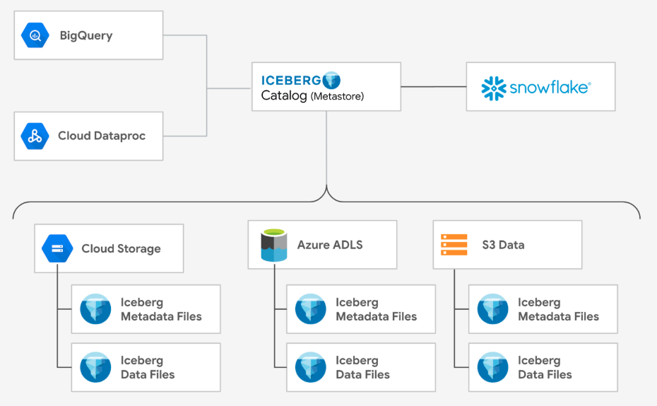

author: Matt Marzillo, Yoav Ostrinsky
id: getting-started-with-snowflake-and-bigquery-via-iceberg
categories: snowflake-site:taxonomy/solution-center/certification/quickstart, snowflake-site:taxonomy/product/data-engineering, snowflake-site:taxonomy/snowflake-feature/transformation, snowflake-site:taxonomy/snowflake-feature/apache-iceberg
language: en
summary: Interoperate between Snowflake and BigQuery on a single set of Apache Iceberg tables using the Google BigLake Iceberg REST catalog, catalog-linked databases, and workload identity federation — no metadata files to copy and no service-account keys to manage.
environments: web
status: Published 
feedback link: https://github.com/Snowflake-Labs/sfguides/issues


# Getting Started with Snowflake and BigQuery via Iceberg
<!-- ------------------------ -->
## Overview 
Duration: 5

Apache Iceberg has become the de-facto open table format for the data lakehouse because it lets multiple engines read and write the *same* physical tables without copying data. This quickstart shows you how to make Snowflake and Google BigQuery interoperate on one shared set of Iceberg tables using the modern, catalog-based approach: the **Google BigLake Iceberg REST catalog** (part of Google's *Lakehouse for Apache Iceberg*), Snowflake **catalog-linked databases**, and **workload identity federation** for keyless authentication.

> aside positive
> **What changed since the old approach?** Earlier integrations required you to manually copy `metadata.json` pointers between platforms, run `PATCH` commands, and manage long-lived service-account keys. That is no longer necessary. A shared Iceberg REST catalog lets each engine discover the current table state automatically, and workload identity federation removes keys entirely. This guide uses that modern path end-to-end.

### Use Case
There is often no one-size-fits-all engine for every workload. Teams land data with one platform and serve it with another, or inherit multiple platforms through mergers and acquisitions. Sharing a single set of Iceberg tables through a common catalog lets you:
- Modernize a data lake into an open lakehouse
- Enable data interoperability and a joint data-mesh architecture
- Build batch or streaming ingestion, transformation, and CDC pipelines
- Serve analytics-ready data to teams on the engine they prefer — without duplicating storage

### The Two Interoperability Patterns You Will Build
The BigLake Iceberg REST catalog exposes **one** endpoint (`https://biglake.googleapis.com/iceberg/v1/restcatalog`) but supports **two warehouse flavours**. Which flavour a catalog uses determines who owns the tables and who can write. This guide walks through both, because real deployments usually need one specific direction:

| | **Pattern A — Snowflake writes, BigQuery reads** | **Pattern B — BigQuery writes, Snowflake reads** |
|---|---|---|
| Catalog warehouse | `gs://<bucket>` (GCS flavour) | `bq://projects/<project>` (BigQuery federation) |
| Who owns the tables | The BigLake catalog (files in GCS) | BigQuery (Apache Iceberg *managed* tables) |
| Primary writer | Snowflake (via catalog-linked database) | BigQuery (DML / streaming / CDC) |
| Reader | BigQuery, live, via `project.catalog.namespace.table` | Snowflake, via catalog integration + external volume |
| Credential vending | Supported (no external volume needed) | Not supported (external volume required) |
| Data freshness | Live for readers | Reader refreshes after writer publishes metadata |

<!-- DIAGRAM: Side-by-side of Pattern A and Pattern B. Center = one BigLake Iceberg REST endpoint. Left card (Pattern A): Snowflake CLD --write--> gs:// bucket tables; BigQuery --read (PCNT)-->. Right card (Pattern B): BigQuery --write--> BQ-managed Iceberg tables; Snowflake --read (catalog int + ext vol)-->. Show workload identity federation (no keys) as the auth line from Snowflake to Google. -->


### Prerequisites
- Familiarity with [Snowflake](/en/developers/guides/getting-started-with-snowflake/) and a Snowflake account (with `ACCOUNTADMIN` or a role that can create catalog integrations, external volumes, and databases)
- Familiarity with [Google Cloud](https://cloud.google.com/free) and a Google Cloud project where you can enable APIs and grant IAM roles
- The [`gcloud` CLI](https://cloud.google.com/sdk/docs/install) installed and authenticated (`gcloud auth login`)

### What You'll Learn
- The BigLake Iceberg REST catalog model and its two warehouse flavours
- How to authenticate Snowflake to Google with workload identity federation (no keys)
- **Pattern A:** create an Iceberg table in Snowflake through a catalog-linked database and read it live in BigQuery
- **Pattern B:** create a BigQuery-managed Iceberg table and read it in Snowflake via a catalog integration + external volume
- How data freshness works in each direction and how to keep readers in sync

### What You'll Build
- A shared GCS bucket, a BigLake Iceberg REST catalog, and a workload identity federation pool/provider
- A Snowflake catalog-linked database that writes an Iceberg table BigQuery reads (Pattern A)
- A BigQuery Apache Iceberg managed table that Snowflake reads (Pattern B)

> aside negative
> **Regions must line up.** Keep your GCS bucket, BigLake catalog, BigQuery datasets/connections, and Snowflake account in compatible regions to avoid cross-region latency and egress. This guide uses `us-west1` on the Google side; substitute your own region consistently everywhere it appears.

<!-- ------------------------ -->
## Understanding the Architecture
Duration: 5

Before touching a keyboard, it helps to have the mental model straight — this is what makes the two patterns click.

**One catalog, one REST endpoint.** Google's *Lakehouse runtime catalog* (the service historically called the *BigLake metastore*) speaks the open **Apache Iceberg REST catalog** protocol at `https://biglake.googleapis.com/iceberg/v1/restcatalog`. Any Iceberg-aware engine — Snowflake, BigQuery, Apache Spark, Trino — can talk to it.

**Two warehouse flavours decide who owns the tables.** When you create a catalog (or point an engine at one), the *warehouse* you choose changes the behavior fundamentally:

- **GCS flavour** (`warehouse = gs://<bucket>`): the catalog itself owns Iceberg tables whose files live in your bucket. These are *Google-managed Iceberg REST catalog tables*. External engines that can write Iceberg (Snowflake via a catalog-linked database, or Spark) create and mutate these tables, and the catalog can **vend** short-lived, scoped storage credentials to readers/writers so they never need direct bucket IAM. BigQuery reads these tables **live and natively** using the four-part name `project.catalog.namespace.table` — but today BigQuery cannot run DML against them. → **This is Pattern A.**

- **BigQuery federation flavour** (`warehouse = bq://projects/<project>/locations/<location>`): the catalog *proxies BigQuery's own catalog*. The tables here are **Apache Iceberg managed tables** — BigQuery-managed Iceberg tables (formerly "BigLake tables for Apache Iceberg in BigQuery"). BigQuery is the writer (full DML, streaming, CDC). This flavour does **not** vend credentials, so external readers like Snowflake attach their own storage access through an **external volume**. → **This is Pattern B.**

<!-- DIAGRAM: The "one endpoint, two flavours" model. Top: the REST endpoint box. Branch left to a "gs:// warehouse — catalog-owned tables, vended creds" node (label: Pattern A writers = Snowflake CLD / Spark; reader = BigQuery live). Branch right to a "bq:// warehouse — BigQuery-managed Iceberg tables, no vending" node (label: Pattern B writer = BigQuery; reader = Snowflake via ext vol). -->


> aside positive
> **Keyless by design.** In both patterns Snowflake authenticates to Google using **workload identity federation** with an OAuth `TOKEN_EXCHANGE` grant. Snowflake presents a signed identity token; Google exchanges it for a short-lived access token scoped to the roles you grant a *federated subject*. There are **no service-account keys** to create, store, or rotate.

> aside positive
> **A note on names.** In April 2026 Google rebranded *BigLake* to *Lakehouse for Apache Iceberg* and the *BigLake metastore* to the *Lakehouse runtime catalog*. The APIs, CLI (`gcloud biglake`), IAM roles, and endpoint hostname are unchanged and still say `biglake`, and Snowflake's documentation still refers to "BigLake." This guide uses **BigLake** to match the tooling.

<!-- ------------------------ -->
## Shared Setup: Project, Bucket, and Keyless Auth
Duration: 10

Both patterns share the same Google project, storage bucket, and workload identity federation (WIF) trust between Snowflake and Google. Do this section once.

### Set your variables
Run these in a local terminal. Substitute your own values; the rest of the guide reuses these names.

```bash
export PROJECT_ID="<your-gcp-project>"
export REGION="us-west1"
export BUCKET="<your-unique-bucket-name>"
export POOL_ID="snowflake-pool"
export PROVIDER_ID="snowflake-oidc"

gcloud config set project "$PROJECT_ID"
export PROJECT_NUMBER=$(gcloud projects describe "$PROJECT_ID" --format='value(projectNumber)')
echo "Project number: $PROJECT_NUMBER"
```

### Enable the required APIs
```bash
gcloud services enable \
  biglake.googleapis.com \
  bigquery.googleapis.com \
  storage.googleapis.com \
  iam.googleapis.com \
  iamcredentials.googleapis.com \
  sts.googleapis.com \
  cloudresourcemanager.googleapis.com
```

### Create the shared GCS bucket
```bash
gcloud storage buckets create "gs://$BUCKET" \
  --location="$REGION" \
  --uniform-bucket-level-access
```

### Get Snowflake's identity issuer URL
Snowflake publishes an OIDC issuer that Google will trust. In a Snowflake worksheet:

```sql
USE ROLE ACCOUNTADMIN;
SELECT SYSTEM$GET_WORKLOAD_IDENTITY_ISSUER_URL();
```

Copy the returned URL (looks like `https://identity.snowflake.com/oauth2/.../.../...`). Save it locally:

```bash
export SNOWFLAKE_ISSUER_URL="<paste-the-issuer-url-here>"
```

### Create the workload identity pool and OIDC provider
```bash
gcloud iam workload-identity-pools create "$POOL_ID" \
  --location=global \
  --display-name="Snowflake pool"

gcloud iam workload-identity-pools providers create-oidc "$PROVIDER_ID" \
  --location=global \
  --workload-identity-pool="$POOL_ID" \
  --issuer-uri="$SNOWFLAKE_ISSUER_URL" \
  --attribute-mapping="google.subject=assertion.sub"
```

The **audience** that Snowflake's catalog integration will use is the provider resource name:

```bash
export OAUTH_AUDIENCE="//iam.googleapis.com/projects/$PROJECT_NUMBER/locations/global/workloadIdentityPools/$POOL_ID/providers/$PROVIDER_ID"
echo "$OAUTH_AUDIENCE"
```

> aside negative
> Creating a WIF pool requires `roles/iam.workloadIdentityPoolAdmin`. If you grant it to yourself, allow ~60–90 seconds for the grant to propagate before the create commands succeed. If `gcloud` prompts hang in your shell, prefix commands with `CLOUDSDK_CORE_DISABLE_PROMPTS=1`.

<!-- SCREENSHOT: GCP console → IAM & Admin → Workload Identity Federation, showing the new "snowflake-pool" with its "snowflake-oidc" provider. -->

You now have the shared foundation. Pick your direction below.

<!-- ------------------------ -->
## Pattern A: Snowflake Writes, BigQuery Reads
Duration: 15

In this pattern the BigLake catalog owns the Iceberg tables (files in your bucket). Snowflake writes through a **catalog-linked database** and BigQuery reads the same tables **live** — no metadata copying.

<!-- DIAGRAM: Pattern A dataflow. Snowflake worksheet -> catalog integration (WIF/TOKEN_EXCHANGE) -> BigLake REST catalog (gs:// warehouse) -> Iceberg files in GCS. BigQuery -> reads same catalog live via project.catalog.namespace.table. Highlight "vended credentials" arrow from catalog to Snowflake. -->


### Create the BigLake catalog (GCS flavour) and a namespace
The catalog id is the bucket name. `gcs-bucket` selects the GCS warehouse flavour.

```bash
gcloud biglake iceberg catalogs create "$BUCKET" \
  --catalog-type=gcs-bucket

gcloud biglake iceberg namespaces create "analytics" \
  --catalog="$BUCKET"
```

### Turn on credential vending
Vended credentials let the catalog hand short-lived storage tokens to Snowflake, so Snowflake never needs direct bucket IAM.

```bash
gcloud biglake iceberg catalogs update "$BUCKET" \
  --credential-mode=vended-credentials
```

This prints the catalog's service account (looks like `blirc-<PROJECT_NUMBER>-xxxx@gcp-sa-biglakerestcatalog.iam.gserviceaccount.com`). Grant it storage access on the bucket so it can vend:

```bash
export BIGLAKE_SA="<paste-the-blirc-...-service-account>"
gcloud storage buckets add-iam-policy-binding "gs://$BUCKET" \
  --member="serviceAccount:$BIGLAKE_SA" \
  --role="roles/storage.objectUser"
```

### Create the Snowflake catalog integration
Back in Snowflake. The header key **must be double-quoted**.

```sql
USE ROLE ACCOUNTADMIN;

CREATE OR REPLACE CATALOG INTEGRATION biglake_int
  CATALOG_SOURCE = ICEBERG_REST
  TABLE_FORMAT = ICEBERG
  REST_CONFIG = (
    CATALOG_URI = 'https://biglake.googleapis.com/iceberg/v1/restcatalog'
    CATALOG_NAME = 'gs://<your-unique-bucket-name>'
    ACCESS_DELEGATION_MODE = VENDED_CREDENTIALS
    ADDITIONAL_HEADERS = ( "x-goog-user-project" = '<your-gcp-project>' )
  )
  REST_AUTHENTICATION = (
    TYPE = OAUTH
    OAUTH_GRANT_TYPE = TOKEN_EXCHANGE
    OAUTH_TOKEN_URI = 'https://sts.googleapis.com/v1/token'
    OAUTH_AUDIENCE = '<paste-your-OAUTH_AUDIENCE>'
    OAUTH_ALLOWED_SCOPES = ('https://www.googleapis.com/auth/bigquery')
  )
  ENABLED = TRUE;
```

### Grant the federated subject its Google roles
Get the subject Snowflake will present:

```sql
DESC CATALOG INTEGRATION biglake_int;
-- copy the WORKLOAD_IDENTITY_FEDERATION_SUBJECT value
```

> aside negative
> The federated subject **changes every time you run `CREATE OR REPLACE`** on the integration. If you recreate it, re-run `DESC` and re-apply the grants below.

Grant it (in your terminal). `serviceUsageConsumer` is required because of the `x-goog-user-project` billing header; `biglake.viewer` is enough for read in vended mode.

```bash
export SUBJECT="<paste-WORKLOAD_IDENTITY_FEDERATION_SUBJECT>"
export MEMBER="principal://iam.googleapis.com/projects/$PROJECT_NUMBER/locations/global/workloadIdentityPools/$POOL_ID/subject/$SUBJECT"

gcloud projects add-iam-policy-binding "$PROJECT_ID" \
  --member="$MEMBER" --role="roles/serviceusage.serviceUsageConsumer" --condition=None
gcloud projects add-iam-policy-binding "$PROJECT_ID" \
  --member="$MEMBER" --role="roles/biglake.viewer" --condition=None
```

### Verify the integration
Allow ~60–90 seconds for IAM to propagate (a `403` right after granting is normal — wait and retry).

```sql
SELECT SYSTEM$VERIFY_CATALOG_INTEGRATION('biglake_int');
```

<!-- SCREENSHOT: Snowflake worksheet showing SYSTEM$VERIFY_CATALOG_INTEGRATION returning a success payload. -->

### Create the catalog-linked database and write a table
A catalog-linked database (CLD) mirrors the BigLake catalog into Snowflake. Because vended credentials are on, **no external volume is needed**.

```sql
CREATE OR REPLACE DATABASE biglake_db
  LINKED_CATALOG = ( CATALOG = 'biglake_int' );

USE DATABASE biglake_db;
USE SCHEMA analytics;

CREATE OR REPLACE ICEBERG TABLE customers (id INT, name STRING);
INSERT INTO customers VALUES (1, 'Ada'), (2, 'Grace'), (3, 'Alan');
SELECT * FROM customers ORDER BY id;
```

Expected result:

| ID | NAME |
|----|------|
| 1  | Ada  |
| 2  | Grace |
| 3  | Alan |

### Read the same table live in BigQuery
No metadata copying, no external table definition. BigQuery reads the catalog directly with the four-part name `project.catalog.namespace.table`. In a BigQuery query window:

```sql
SELECT * FROM `<your-unique-bucket-name>.analytics.customers` ORDER BY id;
```

Expected result — the same three rows Snowflake just wrote:

| id | name |
|----|------|
| 1  | Ada  |
| 2  | Grace |
| 3  | Alan |

<!-- SCREENSHOT: BigQuery console query editor showing the three rows (Ada, Grace, Alan) returned from the four-part-named catalog table. -->

> aside positive
> **Freshness in Pattern A is automatic.** BigQuery reads the shared catalog on every query, so a new Snowflake `INSERT` is visible immediately on the next BigQuery `SELECT`. There is nothing to refresh.

> aside negative
> **BigQuery is read-only here today.** Running DML (e.g. `INSERT`) against a GCS-flavour catalog table from BigQuery returns *"DML statements are only supported over tables that have data stored in BigQuery."* Bidirectional write to these tables is a Google **preview** feature (see *What's Next*). For BigQuery-side writes today, use Pattern B.

<!-- ------------------------ -->
## Pattern B: BigQuery Writes, Snowflake Reads
Duration: 15

Here BigQuery owns the tables as **Apache Iceberg managed tables**, and Snowflake reads them through a catalog integration that federates BigQuery's catalog (`bq://`). Because this flavour does not vend credentials, Snowflake attaches its own storage access via an **external volume**.

<!-- DIAGRAM: Pattern B dataflow. BigQuery -> writes Apache Iceberg managed table -> Iceberg files in GCS + BigQuery catalog. Snowflake -> catalog integration (bq:// federation, WIF) reads metadata via REST endpoint; external volume (Snowflake GCS SA) reads data files. Highlight two Snowflake read principals: federated subject (metadata.json via REST) and external-volume SA (data files). -->


### Create a BigQuery connection and grant it storage
```bash
bq mk --connection --location="$REGION" --connection_type=CLOUD_RESOURCE biglake_conn

# get the connection's service account
bq show --connection --location="$REGION" --format=json "$PROJECT_ID.$REGION.biglake_conn"
export CONN_SA="<paste the serviceAccountId from the output>"

gcloud storage buckets add-iam-policy-binding "gs://$BUCKET" \
  --member="serviceAccount:$CONN_SA" \
  --role="roles/storage.objectUser"
```

### Create a dataset and a BigQuery-managed Iceberg table
In a BigQuery query window:

```sql
CREATE SCHEMA IF NOT EXISTS bq_val OPTIONS (location = 'us-west1');

CREATE OR REPLACE TABLE `bq_val.drivers`
(
  driver_id   INT64,
  driver_name STRING
)
WITH CONNECTION `us-west1.biglake_conn`
OPTIONS (
  file_format = 'PARQUET',
  table_format = 'ICEBERG',
  storage_uri = 'gs://<your-unique-bucket-name>/blmt/drivers'
);

INSERT INTO `bq_val.drivers` VALUES (10, 'BQ-Alice'), (20, 'BQ-Bob');
```

### Publish the latest metadata for external readers
BigQuery-managed Iceberg tables publish an Iceberg metadata pointer that external engines read. After a write, publish it:

```sql
EXPORT TABLE METADATA FROM `bq_val.drivers`;
```

### Create the Snowflake catalog integration (BigQuery federation)
Point `CATALOG_NAME` at `bq://` and use `EXTERNAL_VOLUME_CREDENTIALS` — this flavour does not vend.

```sql
USE ROLE ACCOUNTADMIN;

CREATE OR REPLACE CATALOG INTEGRATION bq_fed_int
  CATALOG_SOURCE = ICEBERG_REST
  TABLE_FORMAT = ICEBERG
  REST_CONFIG = (
    CATALOG_URI = 'https://biglake.googleapis.com/iceberg/v1/restcatalog'
    CATALOG_NAME = 'bq://projects/<your-gcp-project>'
    ACCESS_DELEGATION_MODE = EXTERNAL_VOLUME_CREDENTIALS
    ADDITIONAL_HEADERS = ( "x-goog-user-project" = '<your-gcp-project>' )
  )
  REST_AUTHENTICATION = (
    TYPE = OAUTH
    OAUTH_GRANT_TYPE = TOKEN_EXCHANGE
    OAUTH_TOKEN_URI = 'https://sts.googleapis.com/v1/token'
    OAUTH_AUDIENCE = '<paste-your-OAUTH_AUDIENCE>'
    OAUTH_ALLOWED_SCOPES = ('https://www.googleapis.com/auth/bigquery')
  )
  ENABLED = TRUE;
```

### Create an external volume over the bucket
The volume gives Snowflake its own read path to the data files. Read-only is enough here.

```sql
CREATE OR REPLACE EXTERNAL VOLUME bq_extvol
  STORAGE_LOCATIONS = (
    (
      NAME = 'gcs-drivers'
      STORAGE_PROVIDER = 'GCS'
      STORAGE_BASE_URL = 'gcs://<your-unique-bucket-name>/'
    )
  )
  ALLOW_WRITES = FALSE;

DESC EXTERNAL VOLUME bq_extvol;
-- copy STORAGE_GCP_SERVICE_ACCOUNT
```

### Grant Google IAM to BOTH Snowflake principals
Pattern B needs storage read for two distinct identities:

1. **The external-volume service account** (the `STORAGE_GCP_SERVICE_ACCOUNT` from `DESC`) reads the *data files*. It also needs `buckets.get` to activate the volume — grant `legacyBucketReader` in addition to object read.
2. **The federated subject** (from `DESC CATALOG INTEGRATION bq_fed_int`) reads `metadata.json` *through the REST endpoint using its own identity* — it needs `storage.objectViewer` too.

```bash
# 1) external-volume SA
export EXTVOL_SA="<paste STORAGE_GCP_SERVICE_ACCOUNT>"
gcloud storage buckets add-iam-policy-binding "gs://$BUCKET" \
  --member="serviceAccount:$EXTVOL_SA" --role="roles/storage.legacyBucketReader" --condition=None
gcloud storage buckets add-iam-policy-binding "gs://$BUCKET" \
  --member="serviceAccount:$EXTVOL_SA" --role="roles/storage.objectViewer" --condition=None

# 2) federated subject (re-DESC after any CREATE OR REPLACE)
export SUBJECT_B="<paste WORKLOAD_IDENTITY_FEDERATION_SUBJECT for bq_fed_int>"
export MEMBER_B="principal://iam.googleapis.com/projects/$PROJECT_NUMBER/locations/global/workloadIdentityPools/$POOL_ID/subject/$SUBJECT_B"
for ROLE in serviceusage.serviceUsageConsumer biglake.viewer bigquery.dataViewer storage.objectViewer; do
  gcloud projects add-iam-policy-binding "$PROJECT_ID" \
    --member="$MEMBER_B" --role="roles/$ROLE" --condition=None
done
```

### Verify, then create the Snowflake Iceberg table and read
```sql
SELECT SYSTEM$VERIFY_CATALOG_INTEGRATION('bq_fed_int');
SELECT SYSTEM$VERIFY_EXTERNAL_VOLUME('bq_extvol');

CREATE OR REPLACE DATABASE bq_demo;
USE SCHEMA bq_demo.public;

CREATE OR REPLACE ICEBERG TABLE drivers
  CATALOG = 'bq_fed_int'
  EXTERNAL_VOLUME = 'bq_extvol'
  CATALOG_NAMESPACE = 'bq_val'
  CATALOG_TABLE_NAME = 'drivers';

SELECT * FROM drivers ORDER BY driver_id;
```

Expected result — the rows BigQuery wrote:

| DRIVER_ID | DRIVER_NAME |
|-----------|-------------|
| 10        | BQ-Alice    |
| 20        | BQ-Bob      |

<!-- SCREENSHOT: Snowflake worksheet showing the two BigQuery-written rows (BQ-Alice, BQ-Bob) read through the federated catalog integration. -->

> aside negative
> **First activation can be slow.** The very first bind of a brand-new cross-cloud external volume can loop on *"Query needs to be retried to setup external volume"* for a few minutes. This almost always means the external-volume SA is missing `buckets.get` — confirm the `legacyBucketReader` grant above — then wait and retry.

<!-- ------------------------ -->
## Keeping Readers in Sync
Duration: 5

Freshness behaves differently in each direction, and it is worth stating plainly.

**Pattern A (BigQuery reading Snowflake's tables): live.** BigQuery queries the shared catalog on every read, so new Snowflake writes appear immediately. Nothing to do.

**Pattern B (Snowflake reading BigQuery's tables): reader refreshes after the writer publishes.** BigQuery must publish updated Iceberg metadata, and Snowflake must pick it up. To see it in action, write another row in BigQuery:

```sql
-- BigQuery
INSERT INTO `bq_val.drivers` VALUES (30, 'BQ-Carol');
EXPORT TABLE METADATA FROM `bq_val.drivers`;
```

A plain re-query in Snowflake will still show the old rows. Refresh, then re-query:

```sql
-- Snowflake
ALTER ICEBERG TABLE bq_demo.public.drivers REFRESH;
SELECT * FROM bq_demo.public.drivers ORDER BY driver_id;
```

Expected result after refresh:

| DRIVER_ID | DRIVER_NAME |
|-----------|-------------|
| 10        | BQ-Alice    |
| 20        | BQ-Bob      |
| 30        | BQ-Carol    |

To avoid manual refreshes, enable automatic refresh so Snowflake polls the catalog for newly published metadata:

```sql
ALTER ICEBERG TABLE bq_demo.public.drivers SET AUTO_REFRESH = TRUE;
```

> aside positive
> With `AUTO_REFRESH = TRUE`, Snowflake keeps the table current as BigQuery publishes new metadata. You can also have BigQuery publish metadata automatically on mutation for managed Iceberg tables; contact Google to enable that on your project if you want zero manual `EXPORT TABLE METADATA` calls.

<!-- ------------------------ -->
## What's Next
Duration: 2

- **Bidirectional writes to a single table (preview).** Google has announced read **and write** interoperability for GCS-flavour Iceberg REST catalog tables — meaning BigQuery will be able to write the very same tables Snowflake writes in Pattern A. When that reaches your project you can collapse Patterns A and B into one truly shared, multi-writer table. Until then, choose the pattern that matches your primary writer.
- **Add a third engine.** The same catalog is open to Apache Spark (Google's Managed Service for Apache Spark, or self-managed Spark) using the Iceberg REST catalog config with `GoogleAuthManager` and, for the GCS flavour, the `X-Iceberg-Access-Delegation: vended-credentials` header. Nothing about Snowflake or BigQuery changes.
- **Automate the plumbing.** Move the `gcloud`/SQL steps into your IaC of choice and schedule `EXPORT TABLE METADATA` (Pattern B) so readers stay fresh without manual steps.

<!-- ------------------------ -->
## Conclusion and Resources
Duration: 2

You built genuine, catalog-based interoperability between Snowflake and BigQuery on shared Apache Iceberg tables — no metadata files copied by hand and no service-account keys. You saw both directions and, importantly, *why* each one works the way it does: one BigLake Iceberg REST catalog with two warehouse flavours that decide table ownership, write access, credential vending, and freshness.

### What You Learned
- The BigLake Iceberg REST catalog model and its GCS vs. BigQuery-federation warehouse flavours
- Keyless Snowflake-to-Google authentication with workload identity federation
- Pattern A: Snowflake writes via a catalog-linked database; BigQuery reads live
- Pattern B: BigQuery writes a managed Iceberg table; Snowflake reads via a federated catalog integration + external volume
- How freshness differs by direction and how to keep readers in sync with `REFRESH` / `AUTO_REFRESH`

### Resources
- Snowflake: [Configure a catalog integration for BigLake (Iceberg REST)](https://docs.snowflake.com/en/user-guide/tables-iceberg-configure-catalog-integration-rest-biglake)
- Snowflake: [Apache Iceberg tables overview](https://docs.snowflake.com/en/user-guide/tables-iceberg)
- Google Cloud: [Lakehouse for Apache Iceberg — Iceberg REST catalog](https://cloud.google.com/lakehouse/docs/lakehouse-iceberg-rest-catalog)
- Google Cloud: [Apache Iceberg managed tables in BigQuery](https://cloud.google.com/bigquery/docs/iceberg-tables)
- Google Cloud: [Workload identity federation](https://cloud.google.com/iam/docs/workload-identity-federation-with-other-providers)
