author: Ember Crooks
id: getting-started-with-snowflake-cluster-key-selection
categories: snowflake-site:taxonomy/solution-center/certification/quickstart, snowflake-site:taxonomy/product/platform
language: en
summary: This is a hands-on guide to choosing a Snowflake clustering key 
environments: web
status: Published 
feedback link: https://github.com/Snowflake-Labs/sfguides/issues


# A Data-Driven Methodology for Choosing a Snowflake Clustering Key
<!-- ------------------------ -->
## Overview 

### Overview
This quickstart focuses on the process of choosing a clustering key for a table and workload in Snowflake. You will get out of this quickstart what you put into it. Simply copying and pasting the commands won't lead to as many insights as doing your own experimentation and exploring the concepts here on your own data and workloads.

### Why Cluster?
The primary goal of clustering is to enable better micro-partition pruning when running queries. The goal is to improve query performance. There can be other benefits as well such as better compression. For more information on what clustering is and the benefits of clustering, check out [Snowflake Clustering Demystified](https://medium.com/snowflake/snowflake-clustering-demystified-8042fa81289e).

### What You Will Build 

- A table clustered for a given workload
- A Better knowledge of how to navigate clustering key choices

### What You Will Learn  
&nbsp;
* Properties that make better or worse choices for clustering keys  
* How to use data to make clustering key decisions   
* How to simulate a clustered table for testing purposes  
* How to estimate the cost of a clustering key  

### Prerequisites

- A [Snowflake](https://signup.snowflake.com/?utm_source=snowflake-devrel&utm_medium=developer-guides&utm_cta=developer-guides) account. Sign up for a [30-day free trial](https://signup.snowflake.com/?utm_source=snowflake-devrel&utm_medium=developer-guides&utm_cta=developer-guides) account, if required.

<!-- ------------------------ -->
## Clustering Key Selection Concepts
### Clustering Key Cardinality Targets
The minimum and maximum values for each eligible column on a micro-partition are used to determine whether each micro-partition might contain values that are needed to satisfy a query. If we can determine that the value we are looking for doesn't exist on a micro-partition at all, then we can skip reading that micro-partition. If we can skip reading a significant fraction of a large table, then our query is likely to run faster.

&nbsp;

>  The **clustering key cardinality** is the number of distinct values of the clustering key.

&nbsp;

Choosing a clustering key with an appropriate cardinality (number of distinct values) balances better performance with the increased cost of clustering data. Rows are not ordered within micro-partitions, so there is no performance advantage to be gained from a clustering key that produces a cardinality larger than the micro-partition count for the table. Furthermore, a high-cardinality clustering key is often more expensive to maintain than a low-cardinality clustering key. Since the performance advantage of clustering is gained through having a narrow range between the minimum and maximum values on each micro-partition, we might ideally have only one value for the minimum and maximum values of the clustering key on a micro-partition. When the minimum and maximum values are the same, we call it a constant micro-partition.

Our clustering key cardinality target is therefore aiming to have each micro-partition with either only a single value for the clustering key or to have the range between the minimum and maximum for the clustering key be as small as possible. Stated another way, the maximum we really want to see for the cardinality of a clustering key is the number of micro-partitions in the table. A sane minimum for smaller tables (under one million micro-partitions) is probably to have a cardinality about 1/10th of the number of micro-partitions in the table. Over a million micro-partitions, the same targets may work well, or the goal posts may change a bit, depending on the workload.


>  High-cardinality clustering keys may be more expensive for automatic clustering to maintain than those with an appropriate cardinality.

### The Process of Selecting a Clustering Key
Choosing a good clustering key is a combination of art and science. Here, we'll be following the methodology laid out in [A Data-Driven Approach to Choosing a Clustering Key in Snowflake](https://medium.com/snowflake/a-data-driven-approach-to-choosing-a-clustering-key-in-snowflake-4b3400704778). That article is a good read if you want to dig further into this topic. In short, the steps are:

1. Identify workload or queries to target
1. Establish baseline performance for the target workload
1. Identify filtering predicates in the workload
1. Select potential clustering keys with reasonable cardinality
1. Create table copies clustered on each potential key
1. Test query workload against clustered test tables and record results
1. Compare test results with baseline and select a clustering key
1. Implement clustering
1. Periodically review performance and clustering actions

We will follow those steps in the following sections, with an additional step at the beginning to define the data and structure of our experimentation environment.

<!-- ------------------------ -->
## Data and Structure

To keep things simple, we'll use data from the [Snowflake sample data](https://docs.snowflake.com/en/user-guide/sample-data-tpcds). The database `SNOWFLAKE_SAMPLE_DATA` is shared with all Snowflake accounts, so should be easily accessible. We'll be making copies of this data so we can play with different clustering options, and querying it in order to test performance. For the purposes of this quickstart, we'll be using data from the tpcds_sf10tcl schema. This schema represents a 10 TB scale of data following the data model for the [TPC Benchmark™ DS (TPC-DS)](https://www.tpc.org/TPC_Documents_Current_Versions/pdf/TPC-DS_v2.5.0.pdf).

We will also need dedicated warehouses to work with. While this work can be done on shared warehouses, when testing query performance, we really need to isolate the execution of queries to eliminate the variable of concurrent work.

Here's the syntax to create the objects we will need. We're using 2XL for the warehouse size here to speed up the creation of the largest testing table.
```sql
CREATE OR REPLACE TRANSIENT DATABASE clustering_exp;
CREATE OR REPLACE SCHEMA clustering_exp.tpcds_clustering_test;
CREATE OR REPLACE WAREHOUSE clustering_qs_2xl_wh WAREHOUSE_SIZE='XXLARGE' AUTO_SUSPEND=60;
CREATE OR REPLACE WAREHOUSE clustering_qs_l_wh WAREHOUSE_SIZE='LARGE' AUTO_SUSPEND=60;

USE WAREHOUSE clustering_qs_2xl_wh;
CREATE OR REPLACE TABLE clustering_exp.tpcds_clustering_test.catalog_sales AS
    SELECT timestamp_from_parts(d_date, time_from_parts(t_hour, t_minute, t_second)) AS sold_timestamp
        , catalog_sales.*
      FROM snowflake_sample_data.tpcds_sf10tcl.catalog_sales
        JOIN snowflake_sample_data.tpcds_sf10tcl.date_dim 
          ON cs_sold_date_sk=d_date_sk
        JOIN snowflake_sample_data.tpcds_sf10tcl.time_dim on cs_sold_time_sk=t_time_sk
     ORDER BY RANDOM();
CREATE OR REPLACE TABLE clustering_exp.tpcds_clustering_test.customer AS
    SELECT * 
      FROM snowflake_sample_data.tpcds_sf10tcl.customer
     ORDER BY RANDOM();
CREATE OR REPLACE TABLE clustering_exp.tpcds_clustering_test.catalog_returns AS
    SELECT * 
      FROM snowflake_sample_data.tpcds_sf10tcl.catalog_returns
     ORDER BY RANDOM();
CREATE OR REPLACE TABLE clustering_exp.tpcds_clustering_test.warehouse AS
    SELECT * 
      FROM snowflake_sample_data.tpcds_sf10tcl.warehouse
     ORDER BY RANDOM();
CREATE OR REPLACE TABLE clustering_exp.tpcds_clustering_test.item AS
    SELECT * 
      FROM snowflake_sample_data.tpcds_sf10tcl.item
     ORDER BY RANDOM();
CREATE OR REPLACE TABLE clustering_exp.tpcds_clustering_test.date_dim AS
    SELECT * 
      FROM snowflake_sample_data.tpcds_sf10tcl.date_dim
     ORDER BY RANDOM();
CREATE OR REPLACE TABLE clustering_exp.tpcds_clustering_test.inventory AS
    SELECT * 
      FROM snowflake_sample_data.tpcds_sf10tcl.inventory
     ORDER BY RANDOM();
```
Note that we are doing a bit of change for the date storage and handling for the `CATALOG_SALES` table. This is mostly because this data model uses a highly normalized approach to dates and times that is a bit out of the ordinary. Tweaking this lets us handle dates in a more common manner throughout this tutorial. We're also defining the entire database as transient so as not to incur charges for Fail-safe for this purely experimental work.

The `ORDER BY RANDOM()` ensures we don't get strange effects from data that happens to be naturally clustered. In a real world scenario, we might choose not to order by random, because we often take advantage of natural clustering and want to see the effects, but using an order by random gives us a clearer baseline to compare to for this example.

<!-- ------------------------ -->
## Identify Workload
Identifying the workload to optimize for is one of the hardest parts of choosing a clustering key. It is also one of the steps that truly requires human involvement, and mostly shouldn't be automated. On the one hand, the workload could be considered every query that accesses a table. However, we can only cluster a table in one way, and it is unusual for a workload to be so simple that every single query can be helped by a single choice for a clustering key. 

The choice of queries that make up a workload to optimize for is usually based on business factors. Identifying queries that are part of the most critical performance path is common. Also common is identifying queries related to a specific critical application or dashboard. Sometimes the identification of queries is related to a specific high-priority person or group - for example the queries used by a business executive to look regularly at critical business performance metrics. The choice of a critical workload can include data engineering workloads to reduce the latency for a pipeline, or even focus on specific queries where users are complaining about performance.

In this scenario, we're selecting three synthetic queries. The queries selected here have some complexity to them to make them somewhat realistic. For a simpler scenario following similar steps to this QuickStart, check out [An Example of Choosing a Clustering Key in Snowflake](https://medium.com/snowflake/an-example-of-choosing-a-clustering-key-in-snowflake-3b23a35cd9b4). The queries that make up our performance-critical workload here are:
```sql
-- query 1
SELECT  
    w_state
    ,i_item_id
    ,SUM(CASE 
        WHEN (sold_timestamp < CAST('2002-05-08' AS DATE))
            THEN cs_sales_price - coalesce(cr_refunded_cash,0) 
        ELSE 0
        END) AS sales_before
    ,SUM(CASE 
        WHEN (sold_timestamp >= CAST('2002-05-08' AS DATE))
            THEN cs_sales_price - coalesce(cr_refunded_cash,0) 
        ELSE 0 
        END) AS sales_after
  FROM
    catalog_sales 
    LEFT JOIN catalog_returns 
        ON cr_order_number = cs_order_number
            AND cr_item_sk = cs_item_sk 
    JOIN warehouse ON w_warehouse_sk = cs_warehouse_sk 
    JOIN item      ON i_item_sk = cs_item_sk
 WHERE
    i_current_price BETWEEN 0.99 AND 1.49
    AND sold_timestamp BETWEEN DATEADD(DAY,-30,to_date('2002-05-08')) AND DATEADD(DAY,30,to_date('2002-05-08'))
 GROUP BY
    w_state
    ,i_item_id
 ORDER BY 
    w_state
    ,i_item_id
;
```
```sql
-- query 2
SELECT  
    i_item_id
    ,i_item_desc
    ,i_current_price
  FROM 
    item
    JOIN inventory ON inv_item_sk = i_item_sk
    JOIN date_dim ON d_date_sk = inv_date_sk
    JOIN catalog_sales ON cs_item_sk = i_item_sk
 WHERE 
    i_current_price BETWEEN 58 AND 58 + 30
    AND d_date BETWEEN CAST('2001-02-11' AS DATE) AND DATEADD(DAY,60,TO_DATE('2001-02-11'))
    AND i_manufact_id IN (910,893,984,865)
    AND inv_quantity_on_hand BETWEEN 100 AND 500
 GROUP BY 
    i_item_id
    ,i_item_desc
    ,i_current_price
 ORDER BY i_item_id
;
```
```sql
 -- query 3
SELECT cs_order_number
    ,ANY_VALUE(c_customer_id) 
    ,COUNT(*) AS num_items
    ,SUM(cs_sales_price - COALESCE(cr_refunded_cash,0)) AS total_spend 
  FROM
   catalog_sales 
    LEFT JOIN catalog_returns 
        ON cr_order_number = cs_order_number 
            AND cr_item_sk = cs_item_sk 
    JOIN date_dim ON cs_sold_date_sk = d_date_sk
    JOIN customer ON cs_bill_customer_sk = c_customer_sk
 WHERE 
    cs_order_number IN (23224193,34574645,8038666,64998601,42)    
 GROUP BY cs_order_number
 ORDER BY cs_order_number
;
```
<!-- ------------------------ -->
## Establish Baseline Performance
It is critical to establish an accurate baseline for the performance of our workload. This is not load testing where we are testing how things run with concurrency, but is isolation testing where we are isolating the performance of individual queries, and recording the results, with the goal of having something to compare against as we change things. 

### Run Query Workload
Testing the performance of individual queries is not just running a query and recording the amount of time it took to run. Cloud services have a huge number of variables that can play into the performance of a query. Some of these are obvious like having warm caches. Others may be less obvious. Generally speaking, we want to run the same query a minimum of 10 times, preferably alternating with other queries in the same workload, and preferably hitting at least two or three time periods, maybe even on different days. This should control somewhat for transient effects.

When we're comparing performance later on, we want to compare not just a single run, but use an average (or some other metric you care about like p90) over the course of multiple runs in different time periods. One way that Snowflake makes this easier is by allowing us to tag a query. We can then use the tag to find runs of the query in the [QUERY_HISTORY view in ACCOUNT_USAGE](https://docs.snowflake.com/en/sql-reference/account-usage/query_history) or the [QUERY_HISTORY table function in INFORMATION_SCHEMA](https://docs.snowflake.com/en/sql-reference/functions/query_history).

Since we're using query history to look at performance, we can alter our session with the correct query tag before running a query:
```sql
ALTER SESSION SET query_tag='query1_base';
```
If we were using a third party tool or another methodology, we might not want to set this at the session level, since the time for setting the tag might be included in the query time.

There's one other alteration we'll want to make for our session. This is important when testing isolated query performance, but is NOT something we would set for load testing. We want to disable use of the [result set cache](https://docs.snowflake.com/en/user-guide/querying-persisted-results). Using persisted query results is excellent for the performance of dashboards and other applications that may run the same queries over and over, even when the underlying tables and data have not changed. It can be integral to the performance of certain workloads, but will just add confusion when we are looking at the differences in performance for a query when we are making specific changes and evaluating the impact of those changes.

>  Disable use of the result set cache when recording times for query duration analysis.

&nbsp;
>  Avoid disabling use of the result set cache for load or concurrency testing!

In order to get a baseline, we'll want to run the following at least 10 times, split over several different times of day:
```sql
USE clustering_exp.tpcds_clustering_test;  
ALTER SESSION SET use_cached_result=FALSE;

USE WAREHOUSE clustering_qs_l_wh;

ALTER SESSION SET QUERY_TAG='query_1_base';
-- query 1
SELECT  
    w_state
    ,i_item_id
    ,SUM(CASE 
        WHEN (sold_timestamp < CAST('2002-05-08' AS DATE))
            THEN cs_sales_price - coalesce(cr_refunded_cash,0) 
        ELSE 0
        END) AS sales_before
    ,SUM(CASE 
        WHEN (sold_timestamp >= CAST('2002-05-08' AS DATE))
            THEN cs_sales_price - coalesce(cr_refunded_cash,0) 
        ELSE 0 
        END) AS sales_after
  FROM
    catalog_sales 
    LEFT JOIN catalog_returns 
        ON cr_order_number = cs_order_number
            AND cr_item_sk = cs_item_sk 
    JOIN warehouse ON w_warehouse_sk = cs_warehouse_sk 
    JOIN item      ON i_item_sk = cs_item_sk
 WHERE
    i_current_price BETWEEN 0.99 AND 1.49
    AND sold_timestamp BETWEEN DATEADD(DAY,-30,to_date('2002-05-08')) AND DATEADD(DAY,30,to_date('2002-05-08'))
 GROUP BY
    w_state
    ,i_item_id
 ORDER BY 
    w_state
    ,i_item_id
;

ALTER SESSION SET QUERY_TAG='query_2_base';
-- query 2
SELECT  
    i_item_id
    ,i_item_desc
    ,i_current_price
  FROM 
    item
    JOIN inventory ON inv_item_sk = i_item_sk
    JOIN date_dim ON d_date_sk = inv_date_sk
    JOIN catalog_sales ON cs_item_sk = i_item_sk
 WHERE 
    i_current_price BETWEEN 58 AND 58 + 30
    AND d_date BETWEEN CAST('2001-02-11' AS DATE) AND DATEADD(DAY,60,TO_DATE('2001-02-11'))
    AND i_manufact_id IN (910,893,984,865)
    AND inv_quantity_on_hand BETWEEN 100 AND 500
 GROUP BY 
    i_item_id
    ,i_item_desc
    ,i_current_price
 ORDER BY i_item_id
;

ALTER SESSION SET QUERY_TAG='query_3_base';
 -- query 3
SELECT cs_order_number
    ,ANY_VALUE(c_customer_id) 
    ,COUNT(*) AS num_items
    ,SUM(cs_sales_price - COALESCE(cr_refunded_cash,0)) AS total_spend 
  FROM
   catalog_sales 
    LEFT JOIN catalog_returns 
        ON cr_order_number = cs_order_number 
            AND cr_item_sk = cs_item_sk 
    JOIN date_dim ON cs_sold_date_sk = d_date_sk
    JOIN customer ON cs_bill_customer_sk = c_customer_sk
 WHERE 
    cs_order_number IN (23224193,34574645,8038666,64998601,42)    
GROUP BY cs_order_number
ORDER BY cs_order_number
;
ALTER SESSION UNSET QUERY_TAG;
```

### Record Baseline Performance
Once the queries have been executed multiple times, preferably at different times of day and/or days of the week, we can use `QUERY_HISTORY` to look at the performance. Using the query tags, we can get an average execution time for each query:
```sql
SELECT query_tag
    ,count(*)
    ,round(avg(total_elapsed_time)/1000,1) AS avg_duration
    ,round(percentile_cont(0.90) within group (order by total_elapsed_time)/1000,1) AS p90
  FROM snowflake.account_usage.query_history as t 
 WHERE execution_status='SUCCESS' 
    AND query_tag LIKE 'query%_base' 
    AND query_text LIKE 'SELECT%'
 GROUP BY query_tag
 ORDER BY query_tag;
```
An example of what this output might look like:

| **QUERY_TAG**     |	**COUNT(*)** | **AVG_DURATION** | **P90** |
| ----------------- | ------------:| ----------------:| -------:|
| query1_base       |           10 |             60.6 |   103.6 |
| query_2_base      |           10 |              9.3 |    14.9 |
| query_3_base      |           10 |             27.1 |    39.4 |

It can also be useful to understand the variability by using the Snowsight interface to graph the execution time of the queries. For example, using a query like this:
```sql
SELECT *
  FROM snowflake.account_usage.query_history as t 
 WHERE execution_status='SUCCESS' 
    AND query_tag LIKE 'query%_base' 
    AND query_text LIKE 'SELECT%' 
;
```
And then selecting chart and the appropriate options:
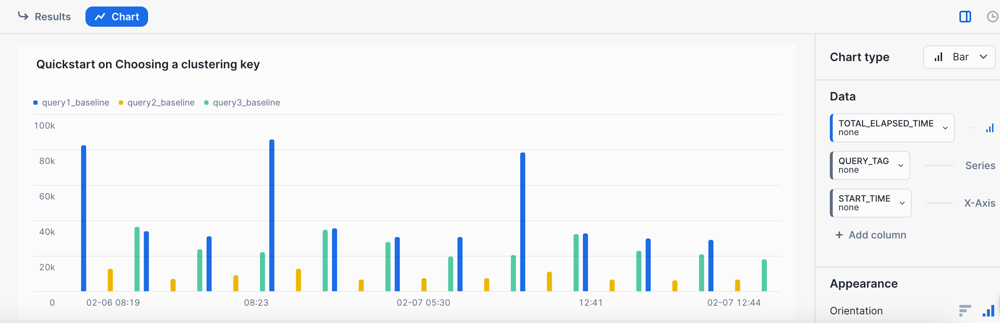
The pattern here is not an unusual one. These queries were run in three separate time periods. The first execution in each time period was the longest, as the warehouse data cache was cold. Subsequent runs in each time frame were shorter with the warmed warehouse data cache. The important part is that we follow a somewhat similar pattern when testing various clustering keys.

#### ACCOUNT_USAGE vs. INFORMATION_SCHEMA for QUERY_HISTORY
The queries provided here are against `ACCOUNT_USAGE.QUERY_HISTORY` because they were run more than an hour after the testing queries were run. If you are running them more immediately, you may want to choose to use the table function `TABLE(INFORMATION_SCHEMA.QUERY_HISTORY())` instead. There is some latency in queries showing up in `ACCOUNT_USAGE.QUERY_HISTORY`, but they are immediately available in the table function.
<!-- ------------------------ -->
## Identify Filtering Predicates

We're focusing in this example on the `CATALOG_SALES` table. It is the larger table in our workload, and one where we spend a lot of time scanning micro-partitions. 
### Predicates
The next thing to do with our workload is to identify predicates in the queries that have the capability to filter out data. This can be simple or complex depending on where the predicates are. Let's start by just pulling out all predicates and fully qualifying them with table names. There are two primary locations where predicates are specified in SQL - the WHERE clause (including subqueries and CTEs), and the JOIN clause. Additionally, we can find predicates that may filter data in other places - like in the case statements in query 1. We're pulling ALL predicates to start, as data modeling may mean that the predicates that specify one table actually may affect pruning for another table.
```sql
-- query 1
catalog_sales.sold_timestamp      < CAST ('2002-05-08' AS DATE)
catalog_sales.sold_timestamp      >= CAST ('2002-05-08' AS DATE)
catalog_sales.cs_order_number     = catalog_returns.cr_order_number
catalog_sales.cs_item_sk          = catalog_returns.cr_item_sk
item.i_current_price              BETWEEN 0.99 AND 1.49
item.i_item_sk                    = catalog_sales.cs_item_sk
catalog_sales.cs_warehouse_sk     = warehouse.w_warehouse_sk
catalog_sales.cs_sold_date_sk     = date_dim.d_date_sk
catalog_sales.sold_timestamp      BETWEEN DATEADD(DAY,-30,TO_DATE('2002-05-08')) AND DATEADD(DAY,30,TO_DATE('2002-05-08'))
-- query 2
item.i_current_price              BETWEEN 58 AND 58 + 30
inventory.inv_item_sk             = item.i_item_sk
date_dim.d_date_sk                = inventory.inv_date_sk
date_dim.d_date                   BETWEEN CAST('2001-02-11' AS DATE) AND DATEADD(DAY,60,TO_DATE('2001-02-11'))
item.i_manufact_id                IN (910,893,984,865)
inventory.inv_quantity_on_hand    BETWEEN 100 AND 500
catalog_sales.cs_item_sk          = item.i_item_sk
-- query 3
catalog_sales.cs_order_number     = catalog_returns.cr_order_number
catalog_sales.cs_item_sk          = catalog_returns.cr_item_sk
catalog_sales.cs_sold_date_sk     = date_dim.d_date_sk
catalog_sales.cs_bill_customer_sk = customer.c_customer_sk
catalog_sales.cs_order_number     IN (23224193,34574645,8038666,64998601,42)    
```

### Filtering Predicates
Since we're focusing on the `CATALOG_SALES` table here, it makes sense to pare down our list to predicates that apply directly or indirectly to the `CATALOG_SALES` table. The shortened list looks something like this:
```sql
-- query 1
catalog_sales.sold_timestamp      < CAST ('2002-05-08' AS DATE)
catalog_sales.sold_timestamp      >= CAST ('2002-05-08' AS DATE)
item.i_current_price              BETWEEN 0.99 AND 1.49
item.i_item_sk                    = catalog_sales.cs_item_sk
catalog_sales.cs_sold_date_sk     = date_dim.d_date_sk
catalog_sales.sold_timestamp      BETWEEN DATEADD(DAY,-30,TO_DATE('2002-05-08')) AND DATEADD(DAY,30,TO_DATE('2002-05-08'))
-- query 2
item.i_current_price              BETWEEN 58 AND 58 + 30
inventory.inv_item_sk             = item.i_item_sk
date_dim.d_date_sk                = inventory.inv_date_sk
date_dim.d_date                   BETWEEN CAST('2001-02-11' AS DATE) AND DATEADD(DAY,60,TO_DATE('2001-02-11'))
item.i_manufact_id                IN (910,893,984,865)
inventory.inv_quantity_on_hand    BETWEEN 100 AND 500
catalog_sales.cs_item_sk          = item.i_item_sk
-- query 3
catalog_sales.cs_order_number     IN (23224193,34574645,8038666,64998601,42)  
```
Not all of these predicates are on `CATALOG_SALES` directly. For example, the predicates on `ITEM` in query2. The reason we are still interested in them is that the join with `ITEM` significantly reduces the row count from `CATALOG_SALES`. Note how for some queries, we are able to eliminate a number of predicates that cannot impact filtering of rows, such as for query 3. However for other queries, such as query2, nearly all of the predicates could be involved in filtering.

The next piece of the puzzle here is understanding which predicates contribute most to filtering out rows. Some predicates may filter out almost nothing, or we may have one predicate that filters out nearly everything. The predicates which are most likely to be impactful to performance when they are part of a clustering key are the predicates that filter out data.

#### Additive Approach - Query 1
Let's look at query 1, and understand what kind of filtering from the two primary predicates here. I'm curious as to whether the date range predicate or the predicate on the current price filters out more rows. To understand this, we'll run a few count queries.
```sql
-- table count
SELECT COUNT(*) FROM catalog_sales;
-- date predicate
SELECT  
    COUNT(*)
  FROM
    catalog_sales
 WHERE
    sold_timestamp BETWEEN DATEADD(DAY,-30,TO_DATE('2002-05-08')) AND DATEADD(DAY,30,TO_DATE('2002-05-08'))
;   
-- item price predicate
SELECT  
    COUNT(*)
  FROM
    CATALOG_SALES 
    JOIN item ON i_item_sk = cs_item_sk
 WHERE
    i_current_price BETWEEN 0.99 AND 1.49
;
-- combined predicates
SELECT  
    COUNT(*)
  FROM
    catalog_sales
    JOIN item ON i_item_sk = cs_item_sk
 WHERE
    sold_timestamp BETWEEN DATEADD(DAY,-30,TO_DATE('2002-05-08')) AND DATEADD(DAY,30,TO_DATE('2002-05-08'))
    AND i_current_price BETWEEN 0.99 AND 1.49
;
```
Count results
| **Count Type**       | **Count**      |
| -------------------- | --------------:|
| CATALOG_SALES table  | 14,399,964,710 |
| date predicate       |    271,454,880 |
| item price predicate |    887,900,147 |
| combined predicates  |     17,013,500 |

This tells us that each of these predicates provides significant filtering, but the combination of the two predicates (date and item price) provides the most filtering.

#### Subtractive Approach - Query 2
If there are a large number of predicates, as there are for query 2, or if we have a bit more knowledge of data patterns going in, we may want to instead look at what happens if we eliminate one or two predicates to understand their impact on the final result set, instead of iterating through every predicate individually. Here's the SQL we might use to do that:
```sql
-- combined predicates
SELECT COUNT(*) 
  FROM 
    item
    JOIN inventory ON inv_item_sk = i_item_sk
    JOIN date_dim ON d_date_sk=inv_date_sk
    JOIN catalog_sales ON cs_item_sk = i_item_sk
  WHERE
    item.i_current_price BETWEEN 58 AND 58 + 30
    AND date_dim.d_date BETWEEN CAST('2001-02-11' AS DATE) AND DATEADD(DAY,60,TO_DATE('2001-02-11'))
    AND item.i_manufact_id IN (910,893,984,865)
    AND inventory.inv_quantity_on_hand BETWEEN 100 AND 500
;
-- without date predicate
SELECT COUNT(*) 
  FROM 
    item
    JOIN inventory ON inv_item_sk = i_item_sk
    JOIN date_dim ON d_date_sk=inv_date_sk
    JOIN catalog_sales ON cs_item_sk = i_item_sk
 WHERE
    item.i_current_price BETWEEN 58 AND 58 + 30
--    AND date_dim.d_date BETWEEN CAST('2001-02-11' AS DATE) AND DATEADD(DAY,60,TO_DATE('2001-02-11'))
    AND item.i_manufact_id IN (910,893,984,865)
    AND inventory.inv_quantity_on_hand BETWEEN 100 AND 500
;
-- without manufacturer predicate
SELECT COUNT(*) 
  FROM 
    item
    JOIN inventory ON inv_item_sk = i_item_sk
    JOIN date_dim ON d_date_sk=inv_date_sk
    JOIN catalog_sales ON cs_item_sk = i_item_sk
  WHERE
    item.i_current_price BETWEEN 58 AND 58 + 30
    AND date_dim.d_date BETWEEN CAST('2001-02-11' AS DATE) AND DATEADD(DAY,60,TO_DATE('2001-02-11'))
    --AND item.i_manufact_id IN (910,893,984,865)
    AND inventory.inv_quantity_on_hand BETWEEN 100 AND 500
;
-- without price predicate
SELECT COUNT(*) 
  FROM 
    item
    JOIN inventory ON inv_item_sk = i_item_sk
    JOIN date_dim ON d_date_sk=inv_date_sk
    JOIN catalog_sales ON cs_item_sk = i_item_sk
  WHERE
    --item.i_current_price BETWEEN 58 AND 58 + 30
    --AND 
    date_dim.d_date BETWEEN CAST('2001-02-11' AS DATE) AND DATEADD(DAY,60,TO_DATE('2001-02-11'))
    AND item.i_manufact_id IN (910,893,984,865)
    AND inventory.inv_quantity_on_hand BETWEEN 100 AND 500
;
```
Count results
| **COUNT TYPE**                 |      **COUNT** |
| ------------------------------ | --------------:|
| combined predicates            |     44,254,064 |
| without date predicate         |    950,162,529 |
| without manufacturer predicate | 23,977,538,622 |
| without price predicate        |    857,788,564 |

We can see from this that the cardinality really explodes when we eliminate the predicate on the manufacturer. This comes from the item table, and indicates that including the join column for item (cs_item_sk) in our clustering key might really help this particular query.

The choice to use an additive or subtractive approach to understanding the filtering value of predicates is really based on the person doing the analysis. Sometimes the person doing the analysis knows enough about the data that this step is just a quick double-check. Sometimes it feels like looking for needles in a haystack. Often, the combination of two predicates, sometimes in different tables, accounts for the biggest filtering.

In the next section, we'll use this information to select potential clustering keys that we want to explore further.

<!-- ------------------------ -->
## Select Potential Clustering Keys

In the last section, we identified that the following columns in the CATALOG_SALES table are important to filtering in our workload of queries:
* sold_timestamp
* cs_item_sk
* cs_order_number

Our next goal is to transform this list of ideas into what we'd actually like to try based on our targets for cardinality in a clustering key. We'll look at the cardinality of these columns and various transformations in context of the number of micro-partitions in the table.
### Micro-Partitions in Table
Snowflake does not show the number of micro-partitions in a table in very many places. One of the places it is shown is in the output of the [SYSTEM$CLUSTERING_INFORMATION function](https://docs.snowflake.com/en/sql-reference/functions/system_clustering_information). 
```sql
SELECT PARSE_JSON(SYSTEM$CLUSTERING_INFORMATION(
  'catalog_sales',
  '(null)')
):total_partition_count::integer as PARTITION_COUNT
;
```
The results of this query are:
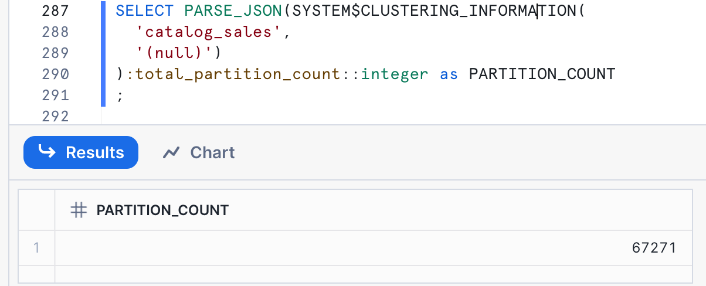

There are 67,271 micro-partitions in this table. Note that your numbers may vary. This means that our target for a clustering key on this table would be a cardinality between 6,727 and 67,271.

### sold_timestamp
A date/time element is often an excellent choice for the leading edge of a clustering key. The full cardinality of a timestamp leads to an extremely high cardinality, though, so we're often working with the DATE_TRUNC function to get the cardinality we'd like to see for a clustering key. What we truncate it to depends heavily on the data. Let's start by truncating it to just the date.

```sql
SELECT 
    DATE_TRUNC('DAY', sold_timestamp) AS sold_ckey
    , COUNT(*)
  FROM
    catalog_sales
 GROUP BY sold_ckey
;
```
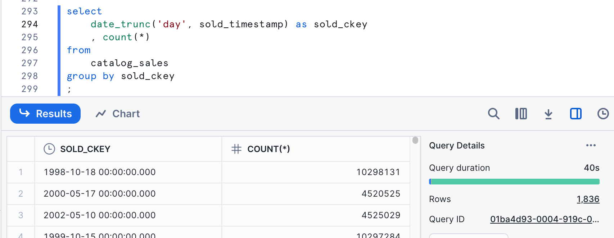
The number we're really looking for here is the number of rows in the result set - in this case, 1,836. This is lower than our target range for our clustering key. We likely would want try a different granularity to hit our cardinality target with this column alone. 
```sql
SELECT 
    DATE_TRUNC('HOUR', sold_timestamp) AS sold_ckey
    , COUNT(*)
  FROM
    catalog_sales
 GROUP BY sold_ckey
;
``` 
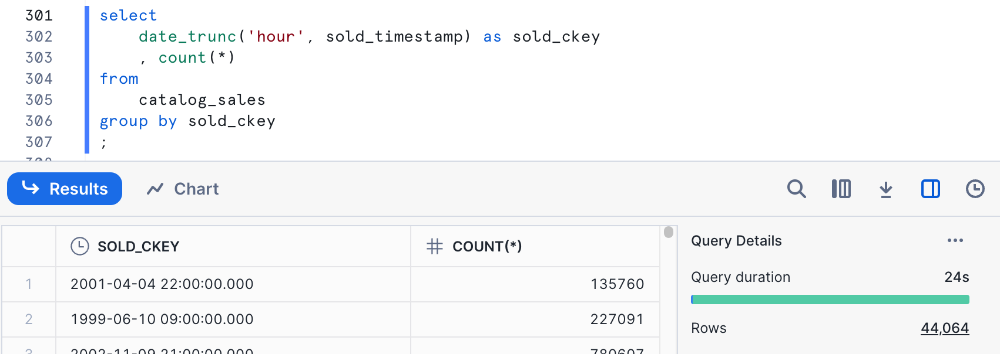
This hits our target cardinality range. Whether this makes sense logically is something to consider as well. All of our predicates that address dates are date only, not time. If we never specify times and have no plans to, it might make sense to adjust cardinality by introducing another element instead.

Date or timestamp columns make excellent clustering choices because there are often other columns that correlate with a date column. Also, data is often loaded in at least rough date/time order - making clustering cheaper and faster.
### cs_item_sk
The item in this table is used as a join key in a join that is highly selective for one of our queries. Let's look at the item and the cardinality that we're considering here. 
```sql
SELECT 
    cs_item_sk
    ,COUNT(*)
  FROM
    catalog_sales
 GROUP BY cs_item_sk
;
```
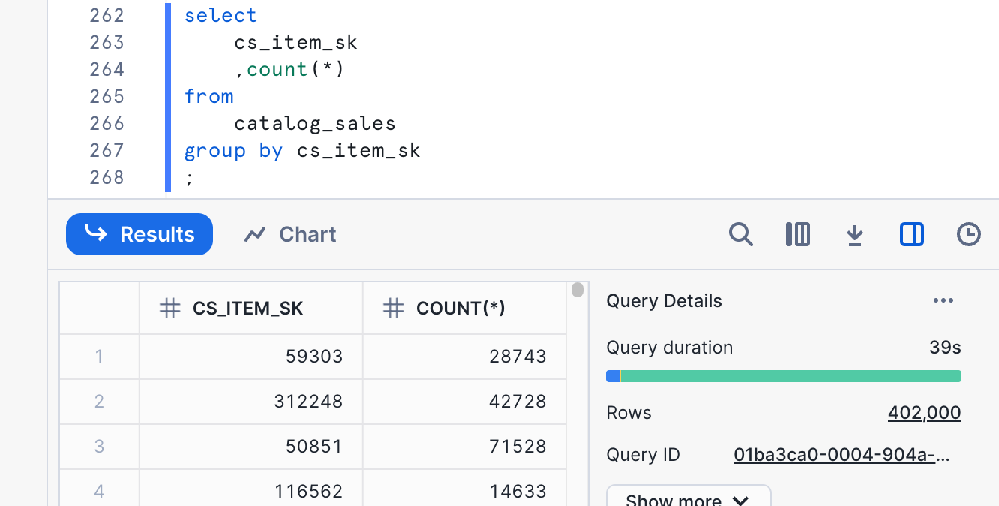
We can see from the output here that the cardinality is 402,000. This cardinality is too high for the range that we're looking at. This means that we should use a function to reduce the cardinality if we want to use it in a clustering key. Since this field is numeric and fairly evenly distributed, we can use simple trunc function to reduce cardinality. Let's try a couple of numbers and see what we get.
```sql
SELECT 
    TRUNC(cs_item_sk,-1) AS item_ckey
    ,COUNT(*)
  FROM
    catalog_sales
 GROUP BY item_ckey
;
```
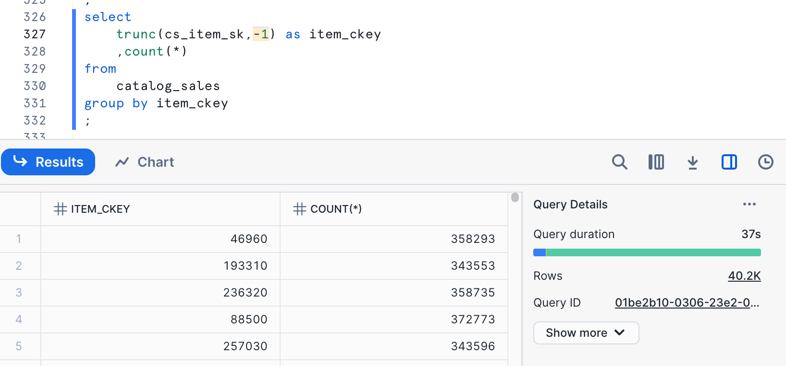
The results here, not surprisingly, show a cardinality of 40,201. This is within the target range we're looking at - between 6,727 and 67,271. The function we are using also preserves the relationship for min/max values with the original data. If we want to use this column alone, this would be a good choice.
### cs_order_number
Our third query specifies some order numbers, so we are also looking at the order number as a potential clustering key. Let's explore the cardinality of order number. 
```sql
SELECT 
    cs_order_number
    ,COUNT(*)
  FROM
    catalog_sales
 GROUP BY cs_order_number
;
```
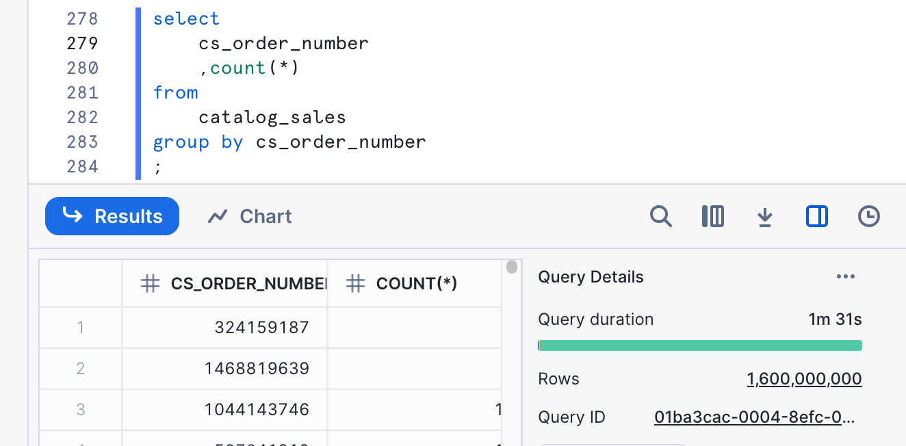
Ok, 1.6 billion, definitely not in our target range. Let's use the same technique we did for item to get it down to something reasonable.
```sql
SELECT 
    TRUNC(cs_order_number,-5) as ord_num_ckey
    ,COUNT(*)
  FROM
    catalog_sales
 GROUP BY ord_num_ckey
;
```
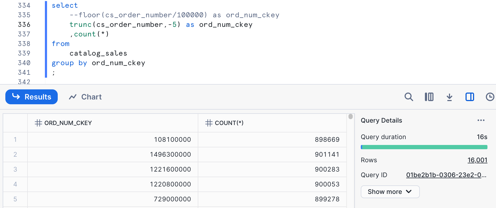

### sold_timestamp AND s_item_sk
There are some other considerations when combining columns in a clustering key. We still care about the overall cardinality of the clustering key in the same range as when we're looking at individual columns. In this case, we're going to look at a combination of sold_timestamp and s_item_sk. The quickest way of estimating the cardinality we will get is to just multiply the cardinalities for the individual columns. For date, we had a cardinality of 1,836, while for a basic function on item(TRUNC(cs_item_sk,-1)), we had 40,201. Multiplying these would get 73,809,036. Sometimes data correlations can skew this. Let's run a query to see what it really is.
```sql
SELECT
    DATE_TRUNC('day', sold_timestamp) AS sold_ckey
    ,TRUNC(cs_item_sk,-1) AS item_ckey
    ,COUNT(*)
FROM catalog_sales
GROUP BY sold_ckey, item_ckey
;
```

The cardinality is pretty close to our estimate at 73,807,578. This is far too high for our clustering key target. We have different choices on how to reduce the cardinality here. We can apply a function to either column to reduce cardinality or both of them. Let's start by reducing the cardinality on cs_item_sk.
```sql
SELECT
    DATE_TRUNC('DAY', sold_timestamp) AS sold_ckey
    ,TRUNC(cs_item_sk,-5) AS item_ckey
    ,COUNT(*)
  FROM catalog_sales
 GROUP BY sold_ckey, item_ckey
;
```
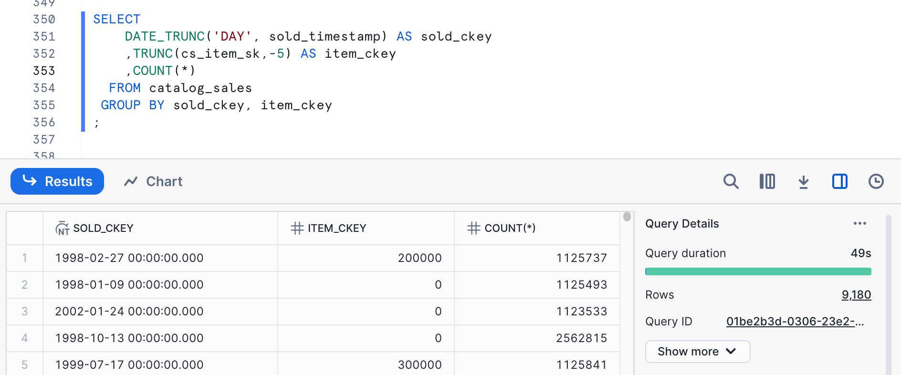
The cardinality is reasonable here, but we are actually down to a single digit for the item number, so let's look at a combination of cardinality reduction between the two columns.
```sql
SELECT
    DATE_TRUNC('WEEK', sold_timestamp) AS sold_ckey
    ,TRUNC(cs_item_sk,-4) AS item_ckey
    ,COUNT(*)
  FROM catalog_sales
 GROUP BY sold_ckey, item_ckey
;
```
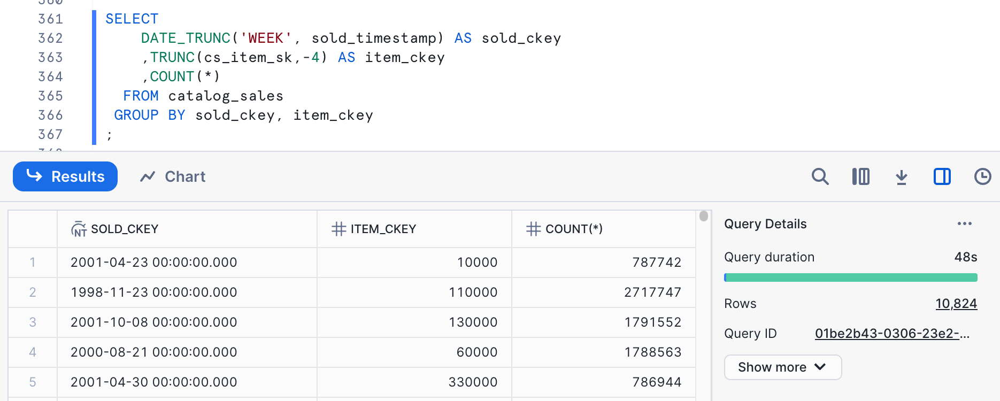
The cardinality here is within our target range.
### Cluster Keys to Try
Based on this exploration, we'd like to try the following cluster keys:
* `DATE_TRUNC('HOUR', sold_timestamp)`
* `TRUNC(cs_item_sk,-1)`
* `TRUNC(cs_order_number,-5)`
* `DATE_TRUNC('WEEK', sold_timestamp), TRUNC(cs_item_sk,-4)`

<!-- ------------------------ -->
## Test Query Workload

Clustering is a physical state of the data, where data is grouped into micro-partitions in such a way that the minimum/maximum ranges of a clustering key are narrow. It can be achieved and maintained long-term through something like [automatic clustering](https://docs.snowflake.com/en/user-guide/tables-auto-reclustering). It can also be achieved naturally - a table with data that is loaded regularly with time-based data often achieves some natural time- or date-based clustering. Data engineering processes can also sort data as a table is built to achieve clustering. While we might want to use auto-clustering long-term, using a simple ORDER BY works well for testing the impact of clustering. We will use `CREATE TABLE ... AS ... ORDER BY ...` statements to create copies of the data in a clustered form and test performance to compare against the baseline.
### DATE_TRUNC('hour', sold_timestamp)
To create the table for testing, we can use this syntax:
```sql
USE WAREHOUSE clustering_qs_2xl_wh;
CREATE OR REPLACE TABLE clustering_exp.tpcds_clustering_test.catalog_sales_by_sold_hour AS
    SELECT *
      FROM catalog_sales
     ORDER BY DATE_TRUNC('HOUR', sold_timestamp);
```
After that exists, we can use our standard set of queries, with different tags, to test performance against this table.
```sql
USE clustering_exp.tpcds_clustering_test;  
ALTER SESSION SET use_cached_result=FALSE;

USE WAREHOUSE clustering_qs_l_wh;

ALTER SESSION SET QUERY_TAG='query1_sold_hour';
-- query 1
SELECT  
    w_state
    ,i_item_id
    ,SUM(CASE 
        WHEN (sold_timestamp < CAST('2002-05-08' AS DATE))
            THEN cs_sales_price - coalesce(cr_refunded_cash,0) 
        ELSE 0
        END) AS sales_before
    ,SUM(CASE 
        WHEN (sold_timestamp >= CAST('2002-05-08' AS DATE))
            THEN cs_sales_price - coalesce(cr_refunded_cash,0) 
        ELSE 0 
        END) AS sales_after
  FROM
    catalog_sales_by_sold_hour 
    LEFT JOIN catalog_returns 
        ON cr_order_number = cs_order_number
            AND cr_item_sk = cs_item_sk 
    JOIN warehouse ON w_warehouse_sk = cs_warehouse_sk 
    JOIN item      ON i_item_sk = cs_item_sk
 WHERE
    i_current_price BETWEEN 0.99 AND 1.49
    AND sold_timestamp BETWEEN DATEADD(DAY,-30,to_date('2002-05-08')) AND DATEADD(DAY,30,to_date('2002-05-08'))
 GROUP BY
    w_state
    ,i_item_id
 ORDER BY 
    w_state
    ,i_item_id
;

ALTER SESSION SET QUERY_TAG='query2_sold_hour';
-- query 2
SELECT  
    i_item_id
    ,i_item_desc
    ,i_current_price
  FROM 
    item
    JOIN inventory ON inv_item_sk = i_item_sk
    JOIN date_dim ON d_date_sk = inv_date_sk
    JOIN catalog_sales_by_sold_hour ON cs_item_sk = i_item_sk
 WHERE 
    i_current_price BETWEEN 58 AND 58 + 30
    AND d_date BETWEEN CAST('2001-02-11' AS DATE) AND DATEADD(DAY,60,TO_DATE('2001-02-11'))
    AND i_manufact_id IN (910,893,984,865)
    AND inv_quantity_on_hand BETWEEN 100 AND 500
 GROUP BY 
    i_item_id
    ,i_item_desc
    ,i_current_price
 ORDER BY i_item_id
;

ALTER SESSION SET QUERY_TAG='query3_sold_hour';
 -- query 3
SELECT cs_order_number
    ,ANY_VALUE(c_customer_id) 
    ,COUNT(*) AS num_items
    ,SUM(cs_sales_price - COALESCE(cr_refunded_cash,0)) AS total_spend 
  FROM
   catalog_sales_by_sold_hour 
    LEFT JOIN catalog_returns 
        ON cr_order_number = cs_order_number 
            AND cr_item_sk = cs_item_sk 
    JOIN date_dim ON cs_sold_date_sk = d_date_sk
    JOIN customer ON cs_bill_customer_sk = c_customer_sk
 WHERE 
    cs_order_number IN (23224193,34574645,8038666,64998601,42)    
GROUP BY cs_order_number
ORDER BY cs_order_number
;
ALTER SESSION UNSET QUERY_TAG;
```
#### Performance Test Results for DATE_TRUNC('hour', sold_timestamp)
The easiest way to pull the results of our performance test is to query the `ACCOUNT_USAGE.QUERY_HISTORY` view or the `INFORMATION_SCHEMA.QUERY_HISTORY()` table function. This query looks at the average query time and P90:
```sql
SELECT query_tag
    ,COUNT(*)
    ,ROUND(AVG(total_elapsed_time)/1000,1) AS avg_duration
    ,ROUND(PERCENTILE_CONT(0.90) WITHIN GROUP (ORDER BY total_elapsed_time)/1000,1) AS p90
  FROM snowflake.account_usage.query_history AS t 
 WHERE execution_status='SUCCESS' 
    AND query_tag LIKE 'query%_sold_hour' 
    AND query_text LIKE 'select%'
 GROUP BY query_tag
 ORDER BY query_tag;
```
The results look something like this:
| **QUERY_TAG**     | **COUNT(*)** | **AVG_DURATION** | **P90** |
| ----------------- | ------------:| ----------------:| -------:|
| query1_sold_hour	|            12|	           8.3|	    13.2|
| query2_sold_hour	|            12|              13.1|     36.9|
| query3_sold_hour	|            12|               1.6|      2.5|

The results here are in seconds based on the calculations in the query.

### TRUNC(cs_item_sk,-1)
To create the table clustered on an appropriate cardinality derivation of item, this syntax works:
```sql
USE WAREHOUSE clustering_qs_2xl_wh;
CREATE OR REPLACE TABLE clustering_exp.tpcds_clustering_test.catalog_sales_by_item AS
    SELECT *
      FROM catalog_sales
     ORDER BY TRUNC(cs_item_sk,-1);
```
After that exists, we can use our standard set of queries, with different tags, to test performance against this table.
```sql
USE clustering_exp.tpcds_clustering_test;  
ALTER SESSION SET use_cached_result=FALSE;

USE WAREHOUSE clustering_qs_l_wh;

ALTER SESSION SET QUERY_TAG='query1_item';
-- query 1
SELECT  
    w_state
    ,i_item_id
    ,SUM(CASE 
        WHEN (sold_timestamp < CAST('2002-05-08' AS DATE))
            THEN cs_sales_price - coalesce(cr_refunded_cash,0) 
        ELSE 0
        END) AS sales_before
    ,SUM(CASE 
        WHEN (sold_timestamp >= CAST('2002-05-08' AS DATE))
            THEN cs_sales_price - coalesce(cr_refunded_cash,0) 
        ELSE 0 
        END) AS sales_after
  FROM
    catalog_sales_by_item 
    LEFT JOIN catalog_returns 
        ON cr_order_number = cs_order_number
            AND cr_item_sk = cs_item_sk 
    JOIN warehouse ON w_warehouse_sk = cs_warehouse_sk 
    JOIN item      ON i_item_sk = cs_item_sk
 WHERE
    i_current_price BETWEEN 0.99 AND 1.49
    AND sold_timestamp BETWEEN DATEADD(DAY,-30,to_date('2002-05-08')) AND DATEADD(DAY,30,to_date('2002-05-08'))
 GROUP BY
    w_state
    ,i_item_id
 ORDER BY 
    w_state
    ,i_item_id
;

ALTER SESSION SET QUERY_TAG='query2_item';
-- query 2
SELECT  
    i_item_id
    ,i_item_desc
    ,i_current_price
  FROM 
    item
    JOIN inventory ON inv_item_sk = i_item_sk
    JOIN date_dim ON d_date_sk = inv_date_sk
    JOIN catalog_sales_by_item ON cs_item_sk = i_item_sk
 WHERE 
    i_current_price BETWEEN 58 AND 58 + 30
    AND d_date BETWEEN CAST('2001-02-11' AS DATE) AND DATEADD(DAY,60,TO_DATE('2001-02-11'))
    AND i_manufact_id IN (910,893,984,865)
    AND inv_quantity_on_hand BETWEEN 100 AND 500
 GROUP BY 
    i_item_id
    ,i_item_desc
    ,i_current_price
 ORDER BY i_item_id
;

ALTER SESSION SET QUERY_TAG='query3_item';
 -- query 3
SELECT cs_order_number
    ,ANY_VALUE(c_customer_id) 
    ,COUNT(*) AS num_items
    ,SUM(cs_sales_price - COALESCE(cr_refunded_cash,0)) AS total_spend 
  FROM
   catalog_sales_by_item 
    LEFT JOIN catalog_returns 
        ON cr_order_number = cs_order_number 
            AND cr_item_sk = cs_item_sk 
    JOIN date_dim ON cs_sold_date_sk = d_date_sk
    JOIN customer ON cs_bill_customer_sk = c_customer_sk
 WHERE 
    cs_order_number IN (23224193,34574645,8038666,64998601,42)    
GROUP BY cs_order_number
ORDER BY cs_order_number
;
ALTER SESSION UNSET QUERY_TAG;
```
#### Performance Test Results for TRUNC(cs_item_sk,-1)
Again, the easiest way to pull the results of our performance test is to query the `ACCOUNT_USAGE.QUERY_HISTORY` view or the `INFORMATION_SCHEMA.QUERY_HISTORY()` table function. This query looks at the average query time and P90:
```sql
SELECT query_tag
    ,COUNT(*)
    ,ROUND(AVG(total_elapsed_time)/1000,1) AS avg_duration
    ,ROUND(PERCENTILE_CONT(0.90) WITHIN GROUP (ORDER BY total_elapsed_time)/1000,1) AS p90
  FROM snowflake.account_usage.query_history AS t 
 WHERE execution_status='SUCCESS' 
    AND query_tag IN ('query1_item', 'query2_item', 'query3_item') 
    AND query_text LIKE 'select%'
 GROUP BY query_tag
 ORDER BY query_tag;
```
The results look something like this:
| **QUERY_TAG**     | **COUNT(*)** | **AVG_DURATION** | **P90** |
| ----------------- | ------------:| ----------------:| -------:|
| query1_item	    |           13 |             50.5 |    83.0 |
| query2_item       |           13 |              1.8 |     3.0 |
| query3_item       |           13 |             31.2 |    43.9 |

The results here are in seconds based on the calculations in the query.

### TRUNC(cs_order_number,-5)
To create the table clustered on an appropriate cardinality derivation of item, this syntax works:
```sql
USE WAREHOUSE clustering_qs_2xl_wh;
CREATE OR REPLACE TABLE clustering_exp.tpcds_clustering_test.catalog_sales_by_ordnum AS
    SELECT *
      FROM catalog_sales
     ORDER BY TRUNC(cs_order_number,-5);
```
After that exists, we can use our standard set of queries, with different tags, to test performance against this table.
```sql
USE clustering_exp.tpcds_clustering_test;  
ALTER SESSION SET use_cached_result=FALSE;

USE WAREHOUSE clustering_qs_l_wh;

ALTER SESSION SET QUERY_TAG='query1_ordnum';
-- query 1
SELECT  
    w_state
    ,i_item_id
    ,SUM(CASE 
        WHEN (sold_timestamp < CAST('2002-05-08' AS DATE))
            THEN cs_sales_price - coalesce(cr_refunded_cash,0) 
        ELSE 0
        END) AS sales_before
    ,SUM(CASE 
        WHEN (sold_timestamp >= CAST('2002-05-08' AS DATE))
            THEN cs_sales_price - coalesce(cr_refunded_cash,0) 
        ELSE 0 
        END) AS sales_after
  FROM
    catalog_sales_by_ordnum 
    LEFT JOIN catalog_returns 
        ON cr_order_number = cs_order_number
            AND cr_item_sk = cs_item_sk 
    JOIN warehouse ON w_warehouse_sk = cs_warehouse_sk 
    JOIN item      ON i_item_sk = cs_item_sk
 WHERE
    i_current_price BETWEEN 0.99 AND 1.49
    AND sold_timestamp BETWEEN DATEADD(DAY,-30,to_date('2002-05-08')) AND DATEADD(DAY,30,to_date('2002-05-08'))
 GROUP BY
    w_state
    ,i_item_id
 ORDER BY 
    w_state
    ,i_item_id
;

ALTER SESSION SET QUERY_TAG='query2_ordnum';
-- query 2
SELECT  
    i_item_id
    ,i_item_desc
    ,i_current_price
  FROM 
    item
    JOIN inventory ON inv_item_sk = i_item_sk
    JOIN date_dim ON d_date_sk = inv_date_sk
    JOIN catalog_sales_by_ordnum ON cs_item_sk = i_item_sk
 WHERE 
    i_current_price BETWEEN 58 AND 58 + 30
    AND d_date BETWEEN CAST('2001-02-11' AS DATE) AND DATEADD(DAY,60,TO_DATE('2001-02-11'))
    AND i_manufact_id IN (910,893,984,865)
    AND inv_quantity_on_hand BETWEEN 100 AND 500
 GROUP BY 
    i_item_id
    ,i_item_desc
    ,i_current_price
 ORDER BY i_item_id
;

ALTER SESSION SET QUERY_TAG='query3_ordnum';
 -- query 3
SELECT cs_order_number
    ,ANY_VALUE(c_customer_id) 
    ,COUNT(*) AS num_items
    ,SUM(cs_sales_price - COALESCE(cr_refunded_cash,0)) AS total_spend 
  FROM
   catalog_sales_by_ordnum 
    LEFT JOIN catalog_returns 
        ON cr_order_number = cs_order_number 
            AND cr_item_sk = cs_item_sk 
    JOIN date_dim ON cs_sold_date_sk = d_date_sk
    JOIN customer ON cs_bill_customer_sk = c_customer_sk
 WHERE 
    cs_order_number IN (23224193,34574645,8038666,64998601,42)    
GROUP BY cs_order_number
ORDER BY cs_order_number
;
ALTER SESSION UNSET QUERY_TAG;
```
#### Performance Test Results for TRUNC(cs_order_number,-5)
Again, the easiest way to pull the results of our performance test is to query the `ACCOUNT_USAGE.QUERY_HISTORY` view or the `INFORMATION_SCHEMA.QUERY_HISTORY()` table function. This query looks at the average query time and P90:
```sql
SELECT query_tag
    ,COUNT(*)
    ,ROUND(AVG(total_elapsed_time)/1000,1) AS avg_duration
    ,ROUND(PERCENTILE_CONT(0.90) WITHIN GROUP (ORDER BY total_elapsed_time)/1000,1) AS p90
  FROM snowflake.account_usage.query_history AS t 
 WHERE execution_status='SUCCESS' 
    AND query_tag LIKE 'query%_ordnum' 
    AND query_text LIKE 'SELECT%'
 GROUP BY query_tag
 ORDER BY query_tag;
```
The results look something like this:
| **QUERY_TAG**     |	**COUNT(*)** | **AVG_DURATION** | **P90** |
| ----------------- | --------------:| ----------------:| -------:|
| query1_ordnum     |             11 |              8.6 |    12.1 |
| query2_ordnum     |             11 |             17.2 |    32.9 |
| query3_ordnum     |             11 |              1.6 |     2.4 |

The results here are in seconds based on the calculations in the query.
### DATE_TRUNC('week', sold_timestamp), TRUNC(cs_item_sk,-4)
To create the table clustered on an appropriate cardinality derivation of item, this syntax works:
```sql
USE WAREHOUSE clustering_qs_2xl_wh;
CREATE OR REPLACE TABLE clustering_exp.tpcds_clustering_test.catalog_sales_by_sold_week_item AS
    SELECT *
      FROM catalog_sales
     ORDER BY DATE_TRUNC('WEEK', sold_timestamp), TRUNC(cs_item_sk,-4);
```
After that exists, we can use our standard set of queries, with different tags, to test performance against this table.
```sql
USE clustering_exp.tpcds_clustering_test;  
ALTER SESSION SET use_cached_result=FALSE;

USE WAREHOUSE clustering_qs_l_wh;

ALTER SESSION SET QUERY_TAG='query1_soldweekitem';
-- query 1
SELECT  
    w_state
    ,i_item_id
    ,SUM(CASE 
        WHEN (sold_timestamp < CAST('2002-05-08' AS DATE))
            THEN cs_sales_price - coalesce(cr_refunded_cash,0) 
        ELSE 0
        END) AS sales_before
    ,SUM(CASE 
        WHEN (sold_timestamp >= CAST('2002-05-08' AS DATE))
            THEN cs_sales_price - coalesce(cr_refunded_cash,0) 
        ELSE 0 
        END) AS sales_after
  FROM
    catalog_sales_by_sold_week_item 
    LEFT JOIN catalog_returns 
        ON cr_order_number = cs_order_number
            AND cr_item_sk = cs_item_sk 
    JOIN warehouse ON w_warehouse_sk = cs_warehouse_sk 
    JOIN item      ON i_item_sk = cs_item_sk
 WHERE
    i_current_price BETWEEN 0.99 AND 1.49
    AND sold_timestamp BETWEEN DATEADD(DAY,-30,to_date('2002-05-08')) AND DATEADD(DAY,30,to_date('2002-05-08'))
 GROUP BY
    w_state
    ,i_item_id
 ORDER BY 
    w_state
    ,i_item_id
;

ALTER SESSION SET QUERY_TAG='query2_soldweekitem';
-- query 2
SELECT  
    i_item_id
    ,i_item_desc
    ,i_current_price
  FROM 
    item
    JOIN inventory ON inv_item_sk = i_item_sk
    JOIN date_dim ON d_date_sk = inv_date_sk
    JOIN catalog_sales_by_sold_week_item ON cs_item_sk = i_item_sk
 WHERE 
    i_current_price BETWEEN 58 AND 58 + 30
    AND d_date BETWEEN CAST('2001-02-11' AS DATE) AND DATEADD(DAY,60,TO_DATE('2001-02-11'))
    AND i_manufact_id IN (910,893,984,865)
    AND inv_quantity_on_hand BETWEEN 100 AND 500
 GROUP BY 
    i_item_id
    ,i_item_desc
    ,i_current_price
 ORDER BY i_item_id
;

ALTER SESSION SET QUERY_TAG='query3_soldweekitem';
 -- query 3
SELECT cs_order_number
    ,ANY_VALUE(c_customer_id) 
    ,COUNT(*) AS num_items
    ,SUM(cs_sales_price - COALESCE(cr_refunded_cash,0)) AS total_spend 
  FROM
   catalog_sales_by_sold_week_item 
    LEFT JOIN catalog_returns 
        ON cr_order_number = cs_order_number 
            AND cr_item_sk = cs_item_sk 
    JOIN date_dim ON cs_sold_date_sk = d_date_sk
    JOIN customer ON cs_bill_customer_sk = c_customer_sk
 WHERE 
    cs_order_number IN (23224193,34574645,8038666,64998601,42)    
GROUP BY cs_order_number
ORDER BY cs_order_number
;
ALTER SESSION UNSET QUERY_TAG;
```
#### Performance Test Results for DATE_TRUNC('week', sold_timestamp), TRUNC(cs_item_sk,-4)
Again, the easiest way to pull the results of our performance test is to query the `ACCOUNT_USAGE.QUERY_HISTORY` view or the `INFORMATION_SCHEMA.QUERY_HISTORY()` table function. This query looks at the average query time and P90:
```sql
SELECT query_tag
    ,COUNT(*)
    ,ROUND(AVG(total_elapsed_time)/1000,1) AS avg_duration
    ,ROUND(PERCENTILE_CONT(0.90) WITHIN GROUP (ORDER BY total_elapsed_time)/1000,1) AS p90
  FROM snowflake.account_usage.query_history AS t 
 WHERE execution_status='SUCCESS' 
    AND query_tag LIKE 'query%_soldweekitem' 
    AND query_text LIKE 'SELECT%'
 GROUP BY query_tag
 ORDER BY query_tag;
```
The results look something like this:
| **QUERY_TAG**       |	**COUNT(*)** | **AVG_DURATION** | **P90** |
| ------------------- | ------------:| ----------------:| -------:|
| query1_soldweekitem |           13 |              6.6 |	  8.1 |
| query2_soldweekitem |           13 |              4.8 |    13.4 |
| query3_soldweekitem |           13 |              1.5 |     2.5 |

The results here are in seconds based on the calculations in the query.
<!-- ------------------------ -->
## Compare Test Results

Now that we have the results of performance testing for each of the potential clustering keys, we can look at them and make an informed decision. 
Average durations:
| **Query** |	**Baseline** | **Hour Sold** | **Item** | **Order Number** | **Week Sold and Item** |
| --------- | --------------:| ------------:| ---------:| ----------------:| ---------------------- |
| query1    |           60.6 |          8.3 |      50.5 |	           8.6 |                    6.6 |
| query2    |            9.3 |         13.1 |       1.8 |	          17.2 |                    4.8 |
| query3    |           27.1 |          1.6 |      31.2 |              1.6 |                    1.5 |
| *sum*     |         *97.0* |       *23.0* |    *83.5* |           *27.4* |                 *12.9* | 

There are some interesting things we see in this data. The first thing is that ANY of the clustering keys improve the execution time of query1. If we want the best performance for query1, we would choose to cluster on DATE_TRUNC('week', sold_timestamp), TRUNC(cs_item_sk,-4). If we want the best performance for query2, we would choose to cluster on TRUNC(cs_item_sk,-1). If we want the best performance for query3, It is pretty much a tie between three of the four choices we tried. 

We're looking at query duration here because that is the metric we care about optimizing for in this case. We might also look at the number of micro-partitions scanned and look for the clustering key choice that minimizes that. 

Overall, the clustering key that combines the week sold along with the item provides the best performance improvement. The new overall time for this workload is just 13% of the original time - that's an outstanding improvement in performance.

One question that these numbers bring up is - why does clustering on order number help queries that look at date/time sold, and vice-versa? The reason here is correlation in the data. This is a common correlation - in this case, the order number is an incrementing integer, and orders were added, at least roughly, in date order. We can verify this with a simple query to calcuate the correalation coefficient:
```sql
SELECT CORR( DATE_PART(EPOCH,sold_timestamp), cs_order_number)
  FROM clustering_exp.tpcds_clustering_test.catalog_sales;
```
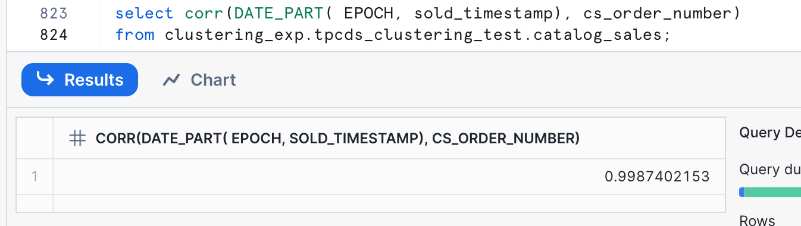
The result here, 0.9987402153, means that the values are highly correlated. The closer to 1 this value is, the more correlated they are. 

Because the primary performance advantage in clustering in Snowflake is gained through partition pruning, which looks at the minimum and maximum values on a micro-partition, we can take advantage of correlations in data.

There are techniques that might work when there are truely two different ways data needs to be clustered. They are mostly beyond the scope of this tutorial. One that bears mentioning is the use of various materializations, including materialized views, to cluster the same data in multiple ways. Caution should be used when clustering materialized views. If both the table and materialized views based on it are clustered, then automatic clustering can incur some additional costs. It is best to choose one level within the table/view hierarchy for clustering, and not cluster at multiple levels. If you are using automatic clustering for materialized views, do not use automatic clustering for the table the materialized view is based on.
<!-- ------------------------ -->
## Implement Clustering
Implementing clustering for the first time or changing a clustering key can be an expensive operation. It is valid to modify a data engineering pipeline to introduce natural clustering, or to to use Snowflake's Automatic Clustering Service to introduce or just maintain clustering. It makes sense to use the function [SYSTEM$ESTIMATE_AUTOMATIC_CLUSTERING_COSTS](https://docs.snowflake.com/en/sql-reference/functions/system_estimate_automatic_clustering_costs) to estimate the initial costs of defining a clustering key. This function can also be used to estimate ongoing clustering costs for certain patterns, but the nature of our test scenario will not work with this functionality. This syntax can be used to run the function for the sample scenario:
```sql 
SELECT SYSTEM$ESTIMATE_AUTOMATIC_CLUSTERING_COSTS(
  'clustering_exp.tpcds_clustering_test.catalog_sales'
  , '(DATE_TRUNC(\'week\', sold_timestamp), TRUNC(cs_item_sk,-4))'
);
```
Running this function may take several minutes. The output will look something like this:
```json
{
  "reportTime": "Mon, 28 Apr 2025 15:02:26 GMT",
  "clusteringKey": "LINEAR(DATE_TRUNC(\u0027week\u0027, sold_timestamp), TRUNC(cs_item_sk,-4))",
  "initial": {
    "unit": "Credits",
    "value": 36.580923038,
    "comment": "Total upper bound of one time cost"
  },
  "maintenance": {
    "comment": "Unable to produce maintenance cost estimate because table does not have enough substantial DMLs in the past 7 days."
  }
}
```
This output tells us that if we were to just turn on automatic clustering using an Alter Table statement, it would cost approximately 36.6 credits to achieve a well-clustered state. One method for reducing the initial cost of clustering is to first use either a CTAS (Create Table AS) or `INSERT OVERWRITE ...` to manually place a table in order first, and then enable automatic clustering to keep up with clustering as our data changes over time.

In this case, we'll use this statement to replace our table with a clustered version of the same data:
```sql
INSERT OVERWRITE INTO catalog_sales
  SELECT * 
  FROM catalog_sales
  ORDER BY DATE_TRUNC('week', sold_timestamp), TRUNC(cs_item_sk,-4);
```
This methodology works up to a size somewhere between 250,000 and about 500,000 micro-partitions. Use the largest warehouse size you are willing to for this work - on the larger sizes, 4XL is likely to be needed. If the warehouse size is too small, remote spilling will occur and the operation will become more expensive, and may not be worth doing over letting automatic clustering do the work for you. In this case, this statement took 11m and 32s on a 2XL warehouse, equating to approximately 6.16 credits(using the [credits/second from the documentation](https://docs.snowflake.com/en/user-guide/warehouses-overview)). 

We can see in the query profile that while there was local spilling, there was no remote spilling for this `INSERT OVERWRITE ...` operation:

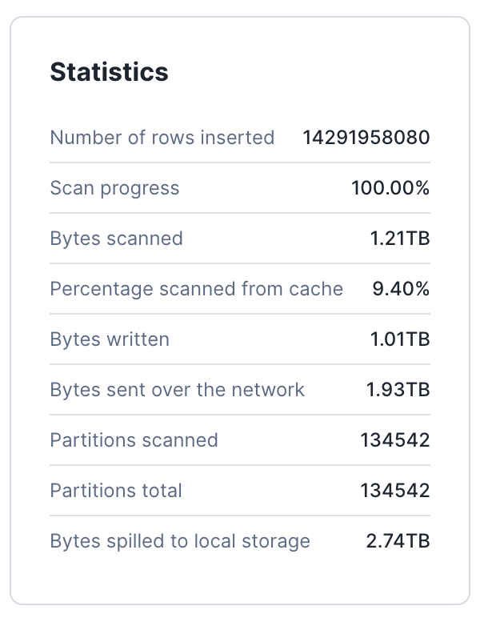

We then still want to enable automatic clustering for this table so that clustering will be maintained for new data and as data is changed. That can be done using this syntax:
```sql
 ALTER TABLE catalog_sales 
  CLUSTER BY (DATE_TRUNC('WEEK', sold_timestamp), TRUNC(cs_item_sk,-4));
```
We can validate that auto clustering is enabled by using the SHOW TABLES command:
```sql
SHOW TABLES LIKE 'catalog_sales';
```
Looking at the **automatic_clustering** column in that output, we can see that auto clustering is enabled for this table:

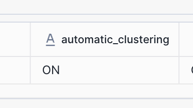

Even though we've put the data into order with the `INSERT OVERWRITE ...`, automatic clustering will likely still go through and do some work. Some time after altering the table, it makes sense to query the `AUTOMATIC_CLUSTERING_HISTORY` table to see what work has been done. That query looks something like this:
```sql
SELECT *
  FROM TABLE(INFORMATION_SCHEMA.AUTOMATIC_CLUSTERING_HISTORY(TABLE_NAME => 'catalog_sales'));
```
The output after a while might look something like this:
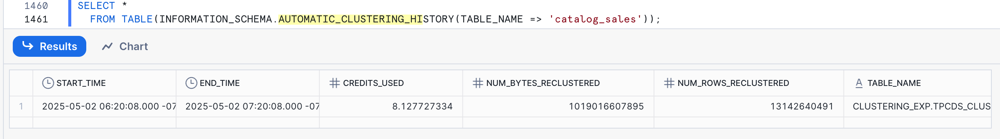

This output represents the use of 8.1 credits in the initial clustering of this table, which is much lower than the estimate of 36 for the unclustered table.

<!-- ------------------------ -->
## Conclusion And Resources

### Conclusion
Clustering is one of the easier and earlier steps in performance optimizaiton. Adding clustering on top of a reasonable data model can meet many performance requirements. Using a data-based approach like this is an excellent way to start. There may be additional considerations when choosing a clustering key, like the rate and patterns of arriving data, so don't hesitate to contact your Snowflake Solutions Engineer for more guidance.

### What You Learned
- Properties that make better or worse choices for clustering keys
- How to use data to make clustering key decisions 
- How to simulate a clustered table for testing purposes
- How to estimate the cost of a clustering key

### Resources
To read more about clustering in Snowflake, check out the [official documentation](https://docs.snowflake.com/en/user-guide/tables-clustering-keys) and these medium articles with more information:

- [Snowflake Clustering Demystified](https://medium.com/snowflake/snowflake-clustering-demystified-8042fa81289e)
- [A Data-Driven Approach to Choosing a Clustering Key in Snowflake](https://medium.com/snowflake/a-data-driven-approach-to-choosing-a-clustering-key-in-snowflake-4b3400704778)
- [An Example of Choosing a Clustering Key in Snowflake](https://medium.com/snowflake/an-example-of-choosing-a-clustering-key-in-snowflake-3b23a35cd9b4)
