author: Ellery Berk
id: getting-started-with-snowflake-cortex-ml-forecasting-and-classification
categories: snowflake-site:taxonomy/solution-center/certification/quickstart, snowflake-site:taxonomy/product/ai, snowflake-site:taxonomy/snowflake-feature/model-development, snowflake-site:taxonomy/snowflake-feature/ml-functions
language: en
summary: This is an introduction to building with ML functions. 
environments: web
status: Published 
feedback link: https://github.com/Snowflake-Labs/sfguides/issues

# Getting Started with Snowflake ML Forecasting and Classification
<!-- ------------------------ -->
## Overview 

One of the most critical activities that a Data/Business Analyst has to perform is to produce recommendations to their business stakeholders based upon the insights they have gleaned from their data. In practice, this means that they are often required to build models to: identify trends, identify abnormalities within their data, and classify users or entities into one of many groups. However, Analysts are often impeded from creating the best models possible due to the depth of statistical and machine learning knowledge required to implement them in practice. Further, Python or other programming frameworks may be unfamiliar to Analysts who write SQL, and the nuances of fine-tuning a model may require expert knowledge that may be out of reach.
For these use cases, Snowflake has developed a set of SQL based ML Functions that implement machine learning models on the user's behalf. As of June 2024, four ML Functions are available:

### Time series functions
1. Forecasting: which enables users to forecast a metric based on past values. Common use cases for forecasting include predicting future sales, demand for particular SKUs of an item, or volume of traffic into a website over a period of time.
2. Anomaly Detection: which flags anomalous values using both unsupervised and supervised learning methods. This may be useful in use cases where you want to identify spikes in your cloud spend, identifying abnormal data points in logs, and more.
3. Contribution Explorer: which enables users to perform root cause analysis to determine the most significant drivers to a particular metric of interest.

### Other analytical functions
1. Classification: which enables users to sort data into different classes using patterns detected within the training data. Compared to the first three, classification doesn't require that the data have an explicit time stamp associated with each of the records.

For further details on ML Functions, please refer to the [Snowflake documentation](https://docs.snowflake.com/guides-overview-analysis).

### Prerequisites
- A Snowflake account login with an `ACCOUNTADMIN` role. If not, you will need to use a different role - Access to Snowsight and working knowledge of SQL.

### What You’ll Learn 

* How to make use of the Classification and Forecasting ML Function to create models and produce predictions
* How to evaluate and interpret the model results and feature importances
* How to score on new datasets to generate predictions
* How to schedule recurring model training and prediction with Snowflake Tasks

### What You’ll Build 
This Quickstart is designed to help you get up to speed with the Classification and Forecasting ML Functions.

We will work through an example using data provided by the [Irvine Machine Learning Repository](https://archive.ics.uci.edu/); specifically their [Bank Marketing Dataset](https://archive.ics.uci.edu/dataset/222/bank+marketing) to: 
- Build a classification model to predict whether or not clients at a Portuguese bank subscribed to a term deposit during a marketing campaign.
- Build a forecasting model to predict the total number of subscriptions the bank should expect over the upcoming 30-day period.

The dataset contains various variables you'd find in a typical marketing campaign, including demographic details of the customer, their previous interactions with the bank, and a range of economic indicators that'd help us predict whether or not the customer will subscribe to the term deposit. Furthermore, we have both numeric and categorical variables in our dataset, typical of something you would find within your organization's data.

After we build our models, we will evaluate them and look at the feature importances to help us better understand the factors that were correlated with customers signing up for term deposits. Often in a business context, it is not only enough to just build a model to make predictions, we also need to understand the reasons why the predictions were made. Understanding these factors give us a better insight into what drives a customer's behavior, so that we may make meaningful recommendations to our stakeholders.

Let's get started!

**Note**: As of April 2024, the ML Classification function is in Public Preview. From time to time, Snowflake may refine the underlying algorithm and will roll out the improvements through the regular Snowflake release process. You cannot revert to a previous version of the model, but models you have created with a previous version will continue to use that version. These changes in the underlying algorithm also means that the results you get when you run through the quickstart may differ from the images you see.

<!-- ------------------------ -->
## Setting Up Data in Snowflake

You will use [Snowsight](https://docs.snowflake.com/en/user-guide/ui-snowsight), the Snowflake web interface, to:
- Create Snowflake objects (i.e warehouse, database, schema, etc..)
- Ingest data from S3 and load it into a Snowflake table

Creating Objects, Loading Data, & Set Up Tables: 
- Create a new SQL worksheet by clicking on the 'Worksheets' tab on the left hand side.
- Paste and run the following SQL commands in the worksheet to create the required Snowflake objects, ingest data from S3, and create the tables we will use for this lab.

```sql
-- Using accountadmin is often suggested for quickstarts, but any role with sufficient privledges can work
USE ROLE ACCOUNTADMIN;

-- Create development database, schema for our work: 
CREATE OR REPLACE DATABASE quickstart;
CREATE OR REPLACE SCHEMA ml_functions;

-- Use appropriate resources: 
USE DATABASE quickstart;
USE SCHEMA ml_functions;

-- Create warehouse to work with: 
CREATE OR REPLACE WAREHOUSE quickstart_wh;
USE WAREHOUSE quickstart_wh;

-- Create a csv file format to be used to ingest from the stage: 
CREATE OR REPLACE FILE FORMAT quickstart.ml_functions.csv_ff
    TYPE = 'csv'
    SKIP_HEADER = 1,
    COMPRESSION = AUTO;

-- Create an external stage pointing to AWS S3 for loading our data:
CREATE OR REPLACE STAGE s3load 
    COMMENT = 'Quickstart S3 Stage Connection'
    URL = 's3://sfquickstarts/hol_snowflake_cortex_ml_for_sql/'
    FILE_FORMAT = quickstart.ml_functions.csv_ff;

-- Define our table schema
CREATE OR REPLACE TABLE quickstart.ml_functions.bank_marketing(
    CUSTOMER_ID TEXT,
    AGE NUMBER,
    JOB TEXT, 
    MARITAL TEXT, 
    EDUCATION TEXT, 
    DEFAULT TEXT, 
    HOUSING TEXT, 
    LOAN TEXT, 
    CONTACT TEXT, 
    MONTH TEXT, 
    DAY_OF_WEEK TEXT, 
    DURATION NUMBER(4, 0), 
    CAMPAIGN NUMBER(2, 0), 
    PDAYS NUMBER(3, 0), 
    PREVIOUS NUMBER(1, 0), 
    POUTCOME TEXT, 
    EMPLOYEE_VARIATION_RATE NUMBER(2, 1), 
    CONSUMER_PRICE_INDEX NUMBER(5, 3), 
    CONSUMER_CONFIDENCE_INDEX NUMBER(3,1), 
    EURIBOR_3_MONTH_RATE NUMBER(4, 3),
    NUMBER_EMPLOYEES NUMBER(5, 1),
    CLIENT_SUBSCRIBED BOOLEAN,
    TIMESTAMP TIMESTAMP_NTZ(9)
);

-- Ingest data from S3 into our table:
COPY INTO quickstart.ml_functions.bank_marketing
FROM @s3load/customers.csv;

-- View a sample of the ingested data: 
SELECT * FROM quickstart.ml_functions.bank_marketing LIMIT 100;
```
<!-- ------------------------ -->
## Exploratory Data Analysis

Before building our model, let's first visualize our data to get a feel for what it looks like and get a sense of what variables we will be working with. Follow along below:
```sql
-- Query a sample of the ingested data
SELECT *
FROM bank_marketing
LIMIT 100;
```
After running the command, you'll notice that we have a total of 21 columns in the result set that is displayed at the bottom of the worksheet.

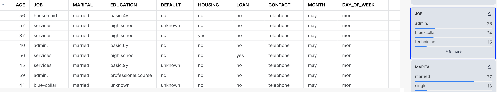

The variables in this dataset can be roughly grouped into three categories: 

1. Demographic data (i.e Age, Job, Marital Status) of the banking customer
2. Data around the interactions that the bank may have had with the customer previously, i.e `contact` which describes communication type used (either cellular or telephone), and `previous` which describes the number of contacts that were performed before the campaign was run
3. Social and economic data (i.e `employee_variation_rate`, etc..) that details economic indicators during the time that the contact was made. These variables add information about the macroeconomic for when the customer was contacted, and may prove to be useful in predicting whether or not the customer accepts the term deposit.

The target variable that we will want to predict is the column denoted by `client_subscribed`. This is a binary variable, meaning it takes on one of two values, either `TRUE` OR `FALSE`. While in this case we only have two values, the ML Classification function can also handle [Multi-Class Classification](https://en.wikipedia.org/wiki/Multiclass_classification), where there are more than three classes we want to group/classify.

For the full data dictionary, refer to the [Bank Marketing Dataset](https://archive.ics.uci.edu/dataset/222/bank+marketing) for the Variables Table. **Note** that the macroeconomic variables are not listed in the chart, you may find that by downloading the dataset, and opening the file `bank-additional-names.txt` contained within the `bank-additional` folder. 

Lastly, on the right hand side of the result set, you'll notice that there are many visualizations for each of the variables, providing distribution plots for columns that are numeric, and also providing a count for those variables that are categorical. Feel free to scroll through them to get a better sense of the different values the dataset contains. 
<!-- ------------------------ -->
## Classification

### Step 1: Preparing Training and Inference Views

Now that we have a sense of what our data looks like, let's prepare our dataset for both training and inference purposes.
```sql
-- Total count of rows in the dataset
SELECT COUNT(1) as num_rows
FROM bank_marketing;

-- Count of subscribed vs not subscribed: 
SELECT client_subscribed, COUNT(1) as num_rows
FROM bank_marketing
GROUP BY 1;
```
Our input dataset has a total of 41,188 rows of data, and roughly 11% percent of the customers (4640) subscribed to the term deposit. To make sure we have some left over data to make predictions on, we will sample 95% of the data, and create a view for our training and testing dataset.

```sql
-- Create a view with a column that will be filtered for either training/inference purposes
CREATE OR REPLACE TABLE partitioned_data as (
  SELECT *, 
        CASE WHEN UNIFORM(0::float, 1::float, RANDOM()) < .95 THEN 'training' ELSE 'inference' END AS split_group
  FROM bank_marketing
);

-- Training data view: 
CREATE OR REPLACE VIEW training_view AS (
  SELECT * EXCLUDE split_group
  FROM partitioned_data 
  WHERE split_group LIKE 'training');

-- Inference data view
CREATE OR REPLACE VIEW inference_view AS (
  SELECT * EXCLUDE split_group
  FROM partitioned_data 
  WHERE split_group LIKE 'inference');
```

In the code above, we made use of the both the `Uniform` and the `Random` function to first generate a random number between 0 and 1, and then assign it to either the `training` or `inference` group.
In the next section, we will use these views to build our model and make predictions.

### Step 2: Use Snowflake AI & ML Studio

We’ll use the new **Snowflake AI & ML Studio** to set us up for classification.

First, navigate to Snowsight. Click “Create” next to the Classification button below. 

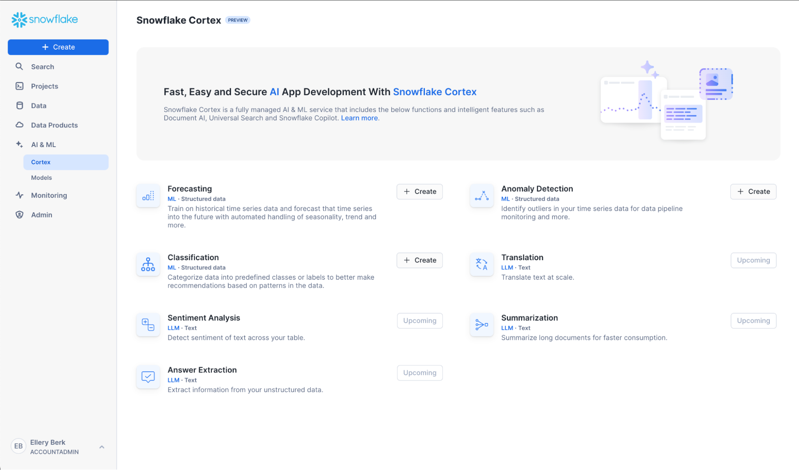

Name your model `bank_classifier`, or whatever suits you! Also, select a role and warehouse. See the in-context warehouse suggestions for help on warehouse selection. Note that we’re leaving “Generate evaluation metrics” checked, since we want to evaluate our model after we’ve trained it. 

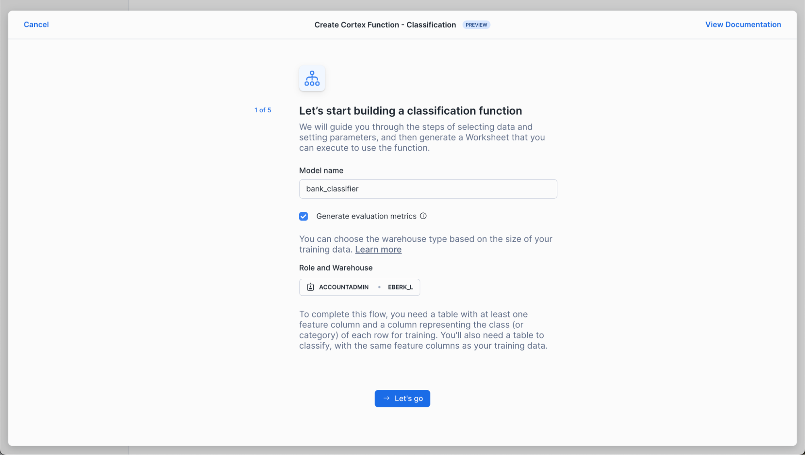

Next, choose `training_view` from the database and schema you’ve been working in. A data preview should automatically appear – to help us sanity check that the data are as expected.

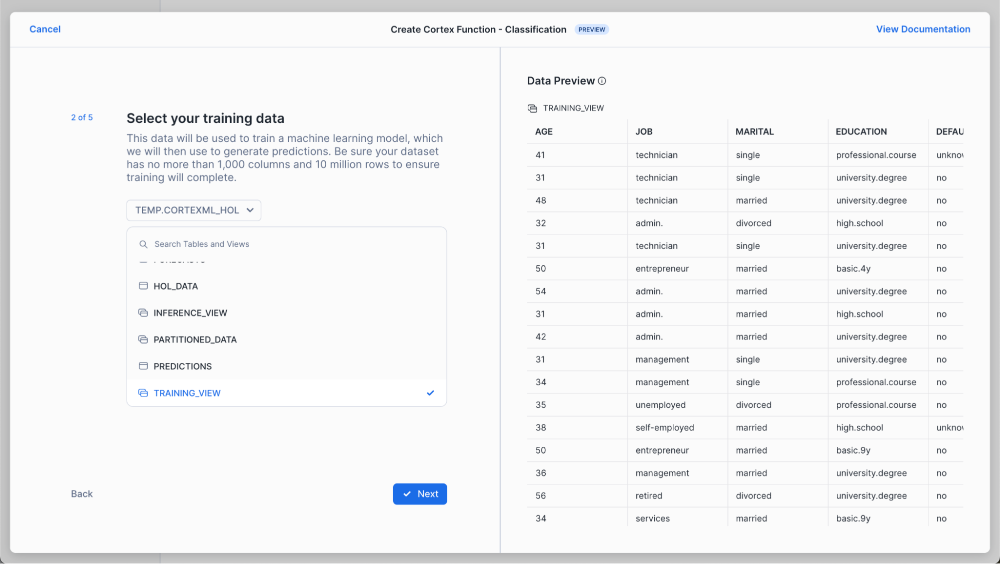

Choose `client_subscribed` as your target column. This is the column you want to predict for new customers (i.e., whether new customers will subscribe or not to your product). We leave “Log all errors if training fails” checked to allow the training process to complete and log all relevant errors instead of stopping at the first error encountered. This is helpful for debugging. 

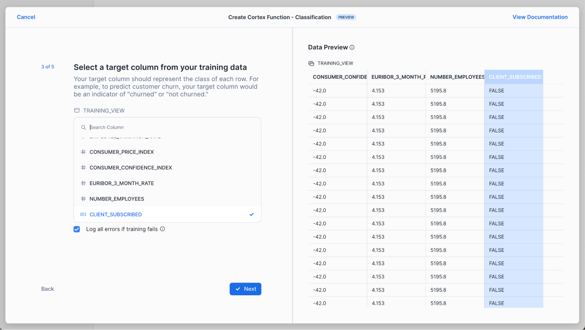

Now, select the data you’d like to classify. In this scenario, we’re selecting a new set of customers to predict whether they’re likely to subscribe to our product or not. Note that we keep “Skip rows that cannot be included in predictions” so that we can get predictions for as many rows as possible without failing the whole process when a row without sufficient informationis encountered. 

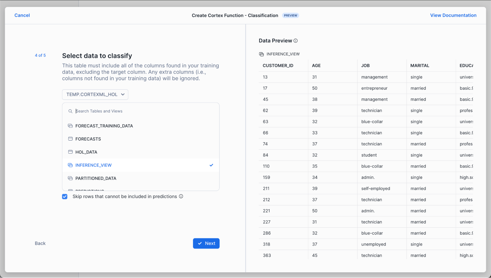

Finally, we select the table we want to store our predictions into. 

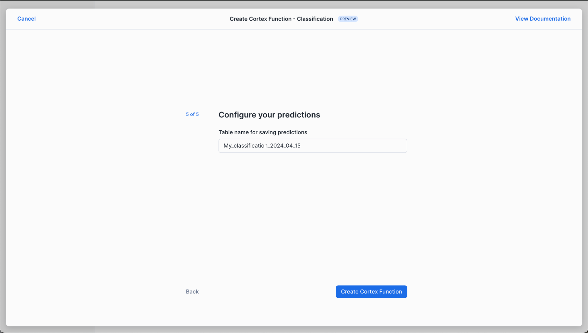

The results? A worksheet with all of the SQL you need to train your model, generate predictions and evaluate your results. 

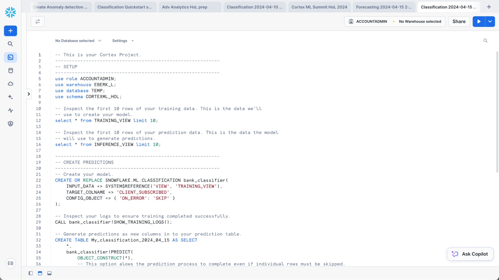

### Step 2: Generate Predictions

Use the SQL generated in the previous section to train a model, generate predictions, evaluate your model and generate predictions. 
First, train your model: 
```sql
-- Train our classifier: 
CREATE OR REPLACE snowflake.ml.classification bank_classifier(
    INPUT_DATA => SYSTEM$REFERENCE('VIEW', 'training_view'),
    TARGET_COLNAME => 'CLIENT_SUBSCRIBED',
    CONFIG_OBJECT => {'on_error': 'skip'}
);
```
The above parameters map to the choices we made in the Snowflake AI & ML Studio: 
1. `INPUT_DATA`: refers to the the reference to the training data. You can pass in a reference to a table or a view if the data is ready as it is in our case, or make use of a [query reference](https://docs.snowflake.com/developer-guide/stored-procedure/stored-procedures-calling-references#label-reference-object-query-references) to pass in a query for the data you want to train the model on.
2. `TARGET_COLNAME`: refers to the variable/column we want to predict, which in our case is the binary variable `CLIENT_SUBSCRIBED`. 
3. `CONFIG_OBJECT`: This is an optional object that contains key-value pairs that provides you the ability to create evaluation metrics as part of the training procedure, handle potential error riddled rows, and also to configure how much of the dataset passed into the `INPUT_DATA` would be reserved for the holdout evaluation set.  

For further details on the syntax for creating the models as well as the default values, please refer to the [documentation](https://docs.snowflake.com/sql-reference/classes/classification/commands/create-classification). 

Now, classify the customers in your new dataset (`inference_view`). 
```sql
-- Classify your data.
CREATE TABLE My_classification_2024_04_15 AS SELECT
    *, 
    bank_classifier!PREDICT(
        OBJECT_CONSTRUCT(*),
        -- This option alows the prediction process to complete even if individual rows must be skipped.
        {'ON_ERROR': 'SKIP'}
    ) as predictions
from INFERENCE_VIEW;

-- View your predictions.
SELECT * FROM My_classification_2024_04_15;
```

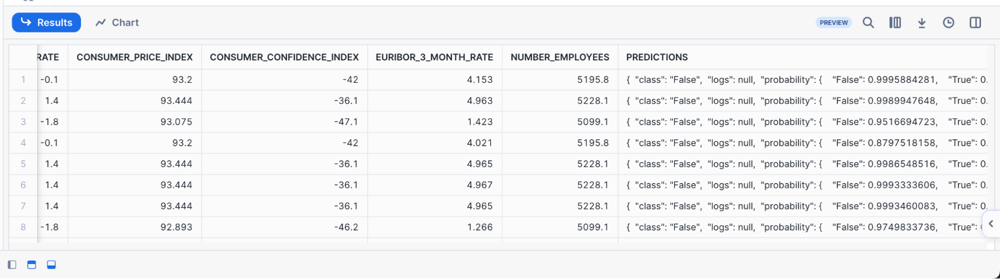

In the result set, we see that the model produces both a predicted class denoted by `True` or `False` as well giving us the probability of the respective class membership. Oftentimes, we may want to parse out the probabilities or the prediction directly, and have it in its own column. 
See the example below in how to do this, where we create a new table with the predicted class and its associated probability parsed out:
```sql
SELECT * EXCLUDE predictions,
        predictions:class AS class,
      round(predictions['probability'][class], 3) as probability
FROM My_classification_2024_04_15;
```
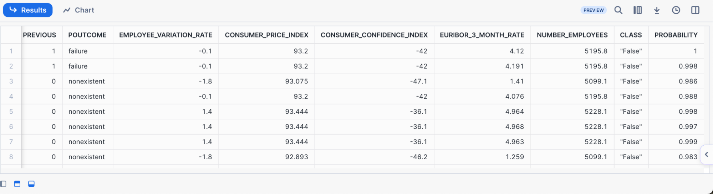

Note that each row contains `CUSTOMER_ID`, so that we can understand which specific customers will subscribe _in addition_ to understanding in aggregate how many customers will subscribe.

### Step 3: Evaluating our Classifier and Understanding Feature Importances

Now that we have built our classifier, we can begin to evaluate it to better understand both its performance as well as the primary factors within the dataset that were driving the predictions. Follow along below to see the various commands you may run to evalute your own classifier:

#### 3a. Confusion Matrix & Model Accuracy
One of the most common ways of evaluating a classifier is by creating a [Confusion Matrix](https://en.wikipedia.org/wiki/Confusion_matrix), which allows us to visualize the types of errors that the model is making. Typically, they are used to calculate a classifier's [Precision & Recall](https://en.wikipedia.org/wiki/Precision_and_recall); which describe both the accuracy of a model when it predicts a certain class of interest (Precision), as well as how many of that specific class of interest were classified (recall). In our use-case, the class of interest is knowing that if the customer will subscribe to the term deposit. In this case:
1. The Precision score will answer "What percentage of the time when the model predicts the client subscribed did it get correct" vs
2. The Recall score will answer "Of all the customers that did subscribe, what percentage were we able to identify successfully?"

Let's first create our confusion matrix before looking at these model metrics.
```sql
CALL bank_classifier!SHOW_CONFUSION_MATRIX();
```
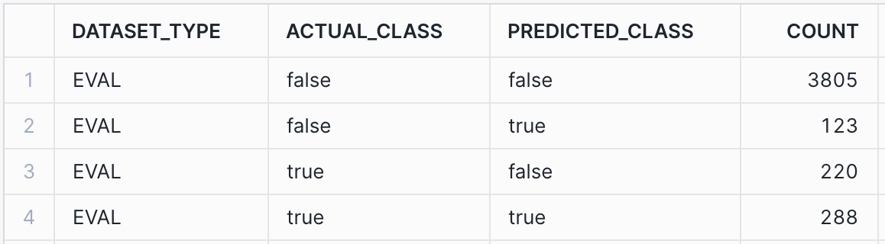

We can turn the output table above into a visualization by:
1. Clicking on the "Chart" button found above the result set
2. Select "Heatgrid" as the chart type
3. Select "Actual Class" for the Rows, and "Predicted Class" as the column
4. Ensure that there are no aggregations selected, and "None" is selected for all the data.

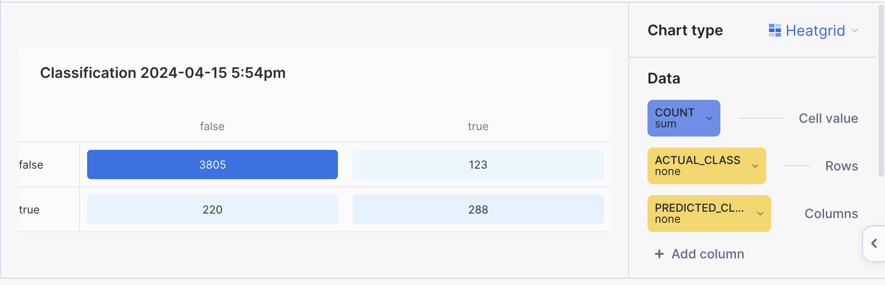

With our confusion matrix, we can calculate both precision, recall and other classifier metrics by running the following queries below. The first one will provide model metrics against each class (i.e True vs False for `CLIENT_SUBSCRIBED`), while the global evaluation metrics provides the averaged model metrics across classes. For more information on how these metrics are calculated, please refer to the [documentation](https://docs.snowflake.com/en/user-guide/snowflake-cortex/ml-powered/classification#metrics-in-show-evaluation-metrics) for further details. Note: The metrics below are calculated on a previously unseen holdout set that we had configured when first training the model.
```sql
-- Calculate the evaluation metrics
CALL bank_classifier!SHOW_EVALUATION_METRICS();
CALL bank_classifier!SHOW_GLOBAL_EVALUATION_METRICS();
```
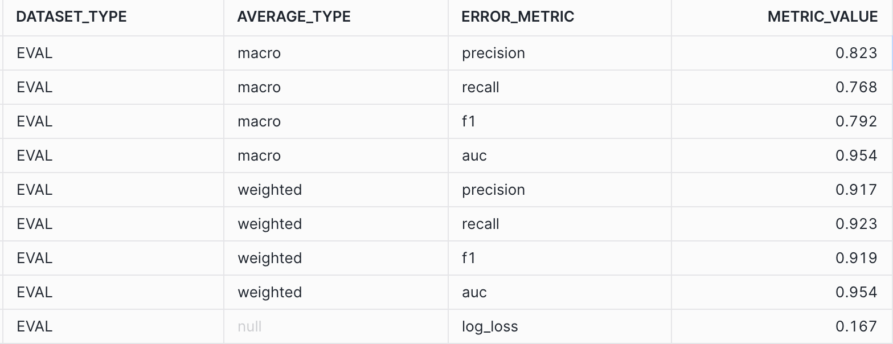

This image above calculates the overall precision, recall, f1, and AUC across all the classes (i.e the `GLOBAL_EVALUATION_METRICS`). In the case that you are working on a multi-class problem with more than two classes, looking at the `SHOW_EVALUATION_METRICS` will give you a better sense of how good the model is at predicting each one of the classes. A higher number here (i.e closer to 1) means that the model is more predictive of the outcomes.

#### 3b. Feature Importances
The last thing we want to understand when evaluating the classifier is to get a sense of the importance of each of the individual input columns or features we made use of. We may do this for many reasons -
1. Better understand what's driving a model's prediction to give us more insight into the business process we are trying to model out
2. Engineer new features or remove ones that are not too impactful to increase the model's performance.

The ML Classification function provides a method to do just this, and provides us a ranked list of the relative importance of all the input features, such that their values are between 0 and 1, and the importances across all the features sum to be 1. The higher the number, the more influential that data point was in driving the prediction the model made. For more details on how the feature importance is calculated, please refer to the [documentation](https://docs.snowflake.com/en/user-guide/snowflake-cortex/ml-powered/classification#understanding-feature-importance).
```sql
CALL bank_classifier!SHOW_FEATURE_IMPORTANCE();
```
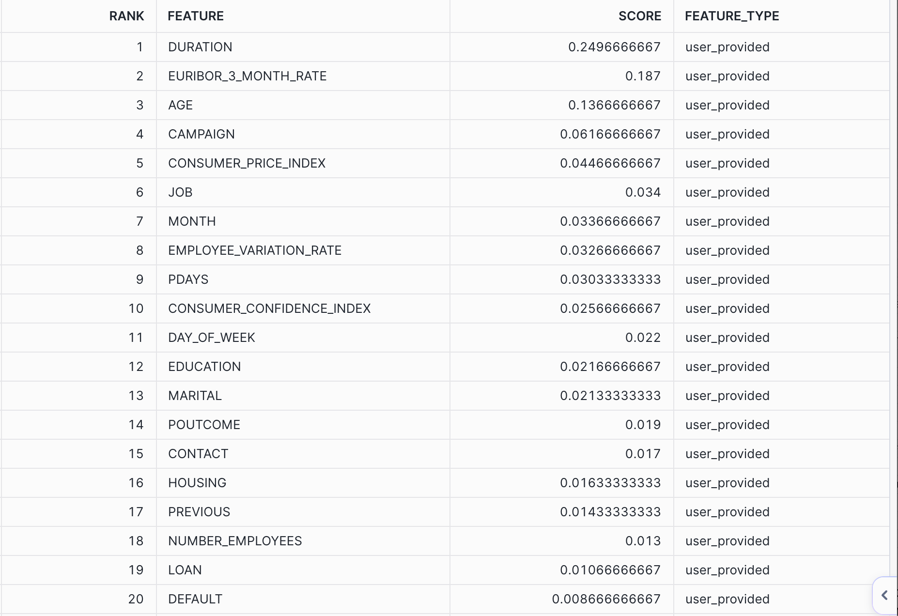

For this particular dataset, it appears that `Duration`, `Euribor_3_month_rate`, and `Age` were the top three features. From the data dictionary, these features should make sense, as `Duration` stands for the amount of time the customer spent with the bank in their previous interaction. If they spent a longer time, it'd be likely indicative that they are strongly interested in the services the bank has to offer. Similarly, the macroeconomic variable `Euribor_3_month_rate` tells us the interest rate is highly indicative of a customer subscribing to the term deposit. If an interest rate is very high or low compared to the historical average, the customer may behave differently.

<!-- ------------------------ -->
## Forecasting

Now that we’ve built a model to understand whether specific customers are likely to subscribe to our term deposit or not, we want to understand how many total customers are likely to subscribe. That will help us with revenue projections and staffing needs. 

To do this, we’ll train a forecasting model then use it to generate predictions – and evaluate the model to understand how accurate those predictions are likely to be. 

### Step 1: Visualize Data and Prepare for Forecasting

In this scenario, we want to forecast the number of total subscriptions per day – for customers aged 40 and under, and aged 40 and up. This helps us better prepare for and market to our distinct customer segments. 

We want our model to train on historical counts of subscriptions by day – and on the Euribor rate, which is an interest rate. We include the Euribor rate because we know that interest rates can impact customer decisions about whether to subscribe or not to our deposits.

This means we need to do the following:
- Add a label to our data indicating whether a customer is 40 and under, or 40 and up. 
- Create a table to train on, including timestamp, the count of subscriptions per day, the Euribor (interest) rate, and the appropriate age category (age_bin).
- Create a table to help the model create predictions, which must rows for each timestamp and age bin combination we want to predict for and the Euribor rate for each of these days.
 
Run the below SQL to accomplish this: 
```sql
-- Subset to the data we want to train on – and create age bins.
-- Create bins from 18 and under, 18 to 30, 30 to 40, 40 to 50, 50 to 60, 60 and older 
CREATE OR REPLACE TABLE bank_marketing_age_bins AS SELECT
    timestamp,
    client_subscribed,
    euribor_3_month_rate,
    CASE 
        WHEN age <= 40 THEN '40 and under'
        ELSE '40 and up'
    END as age_bin
FROM bank_marketing;

-- Now count subscriptions by day and age group. 
CREATE OR REPLACE VIEW daily_subscriptions AS SELECT 
    timestamp, 
    age_bin,
    AVG(euribor_3_month_rate) as interest_rate,
    SUM(CASE WHEN client_subscribed = TRUE THEN 1 ELSE 0 END) AS subscribed_count 
FROM bank_marketing_age_bins
GROUP BY timestamp, age_bin;

-- View our data for the 40+ category.
select * from daily_subscriptions where age_bin = '40 and up';

-- Split data into data for training and hold out one month for predictions. 
-- Since we are using interest rate to help train the model, we need to provide this variable at prediction time, too. 
CREATE OR REPLACE TABLE forecast_training AS SELECT
    * 
FROM daily_subscriptions 
WHERE  timestamp <= (SELECT MAX(timestamp) - INTERVAL '30 days' FROM daily_subscriptions);

CREATE OR REPLACE TABLE forecast_future_values AS SELECT
    timestamp, 
    age_bin, 
    interest_rate
FROM daily_subscriptions
WHERE timestamp NOT IN (SELECT timestamp FROM forecast_training);
```

### Step 2: Use Snowflake AI & ML Studio 

We’ll use the new Snowflake AI & ML Studio to set us up for forecasting. 

First, navigate to Snowsight. Click “Create” next to the Forecasting button below. 

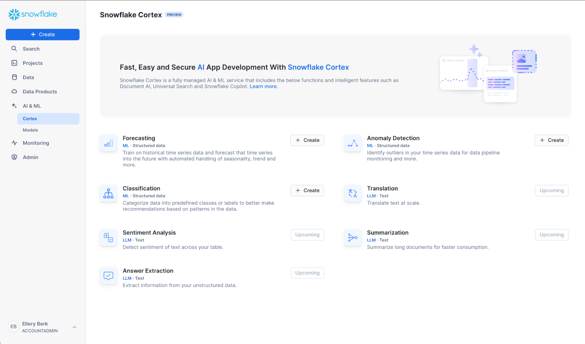

Name your model `forecast_subscriptions_model`, or whatever suits you! Also, select a role and warehouse. See the in-context warehouse suggestions for help on warehouse selection. Note that we’re leaving “Generate evaluation metrics” checked, since we want to evaluate our model after we’ve trained it. You’ll see later that we turn this option _off_ when we are generating predictions on a recurring basis using Snowflake Tasks. 

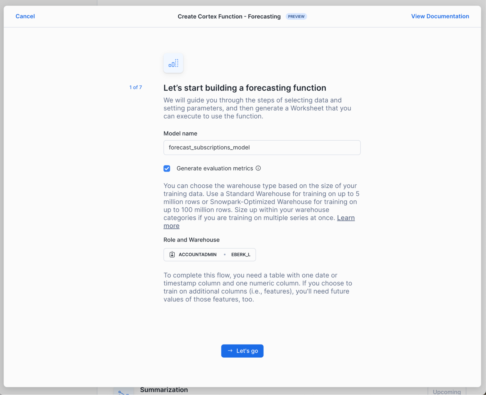

Next, choose `forecast_training` from the database and schema you’ve been working in. A data preview should automatically appear – to help us sanity check that the data are as expected.

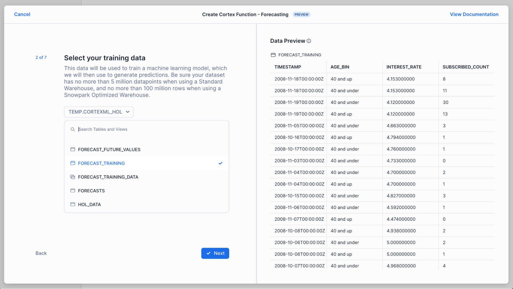

In the next two steps, choose `subscribed_count` as your target column. Your target column is the one you want the model to predict. And choose `timestamp` as your timestamp column.

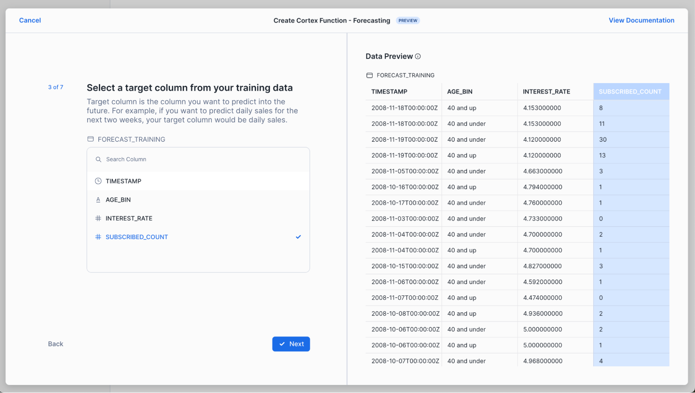
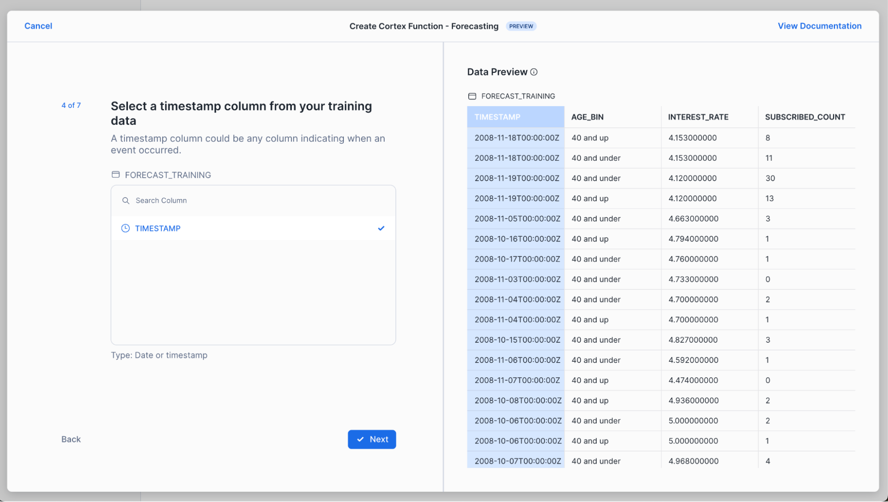

Now, select your “series identifier”, which in this case is `age_bin`. By using this option, we’re telling the forecast function to train separate models for each of the unique categories in `age_bin`. In this case, the forecast function will train two separate models for us, one for “40 and up” the other for “40 and under.” 

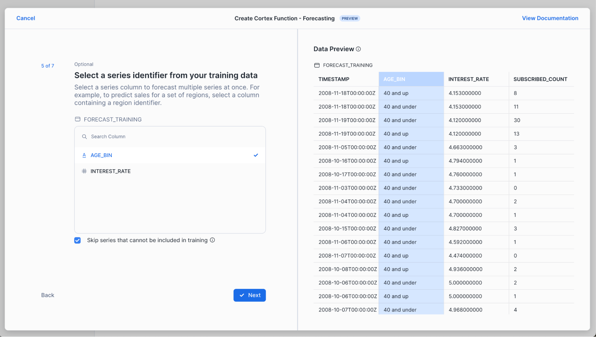


Confirm that you want to use all remaining columns in your table as features. In this case, we’re using `interest_rate` as a feature when we train our model. 

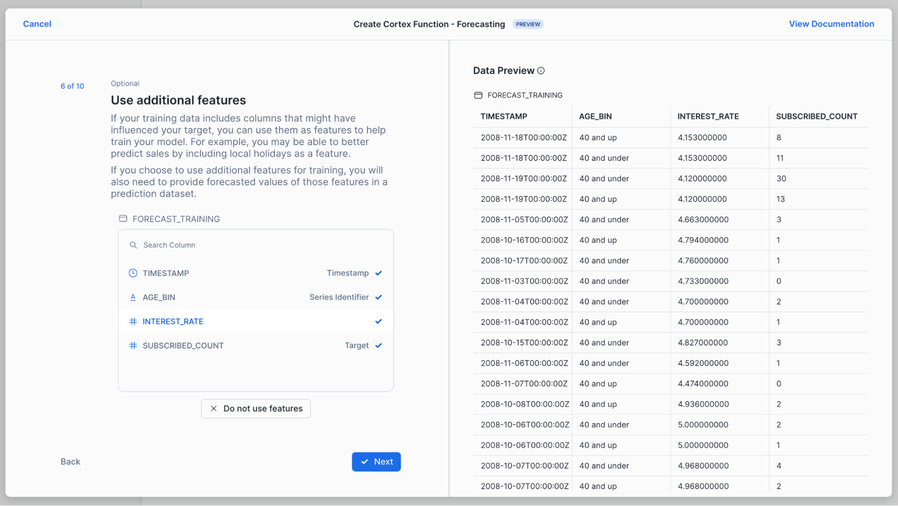

In the next few steps, you’ll pick the data the model should use as an input when it makes its predictions and indicate which columns hold timestamps and series identifiers, just like we did for the training data. Note that we _must_ provide input data at this prediction step because we asked the model to train not only on historical subscription counts (our “target”) but also on interest rates. Now, the model needs to know what interest rates are predicted to be in order to predict daily subscription counts accurately. 

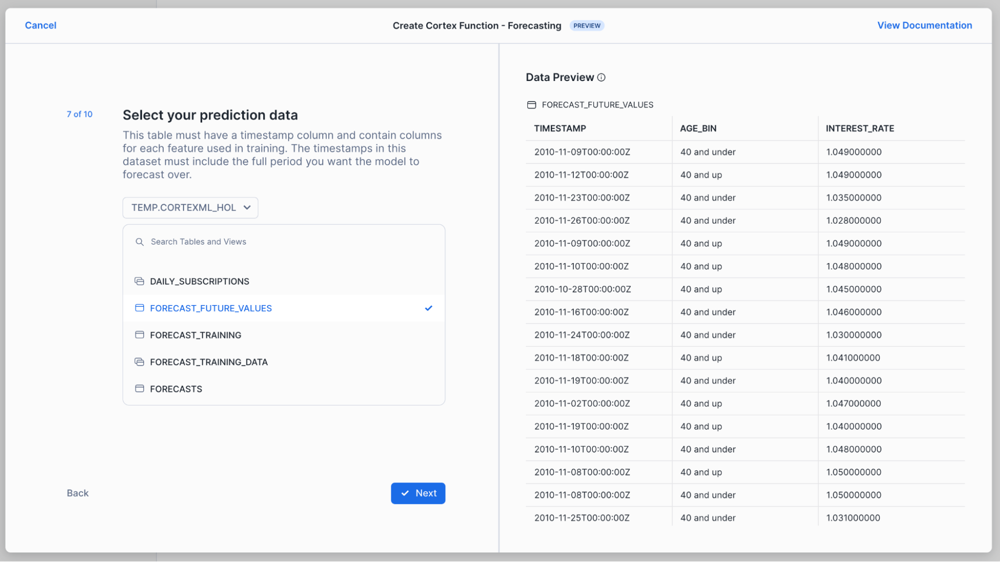
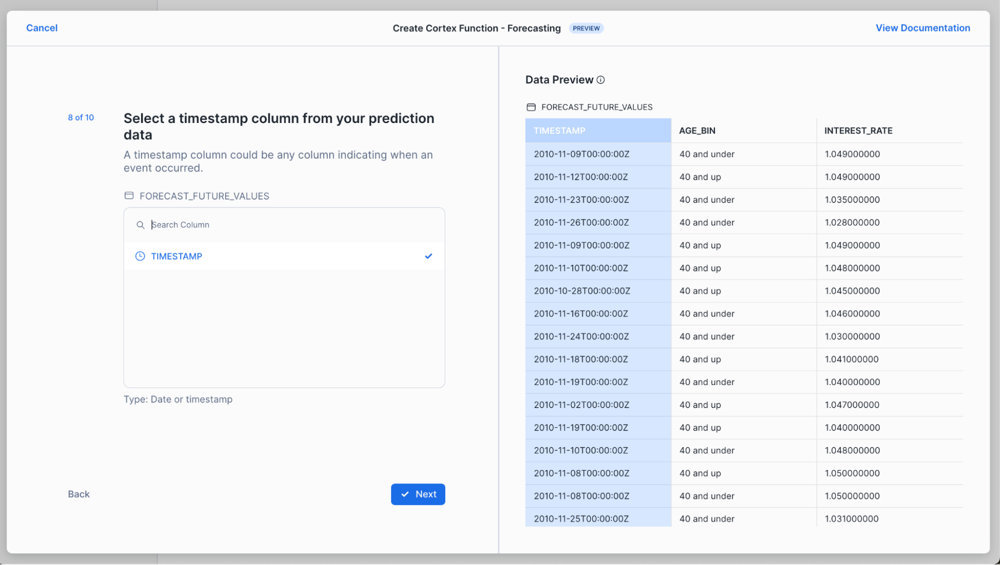
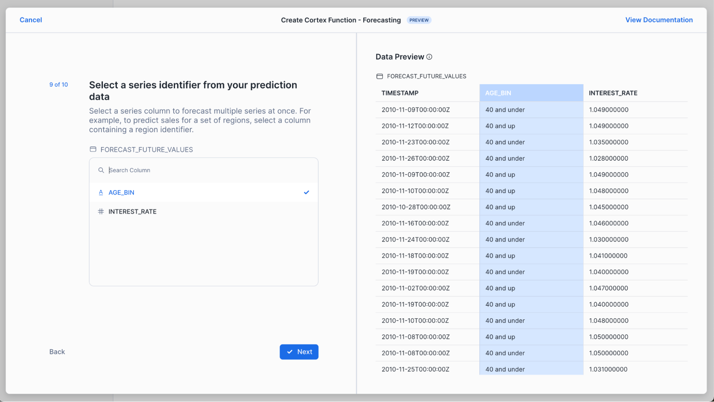

Finally, we select our prediction interval width and name the table we want to store our predictions into. 

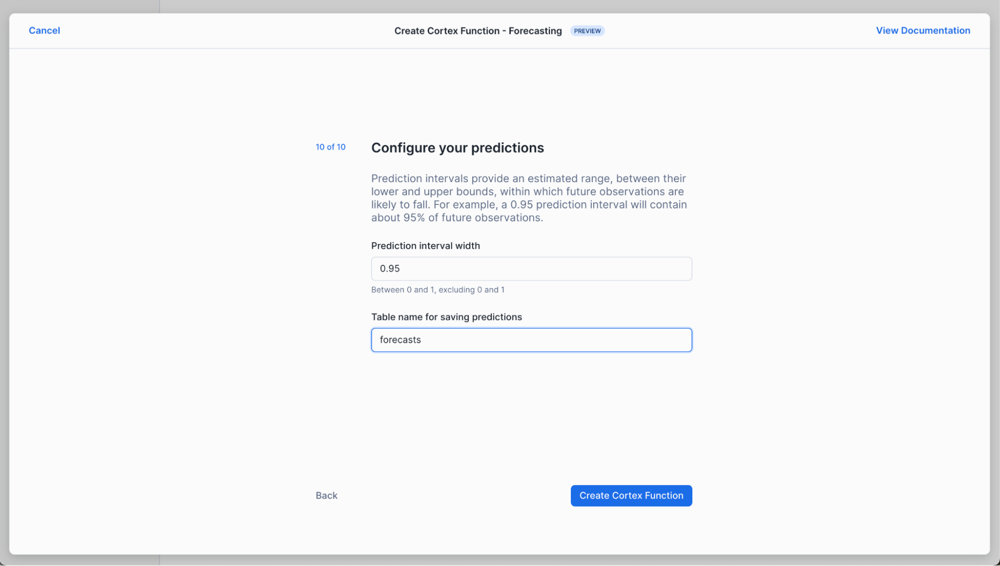

The results? A worksheet with all of the SQL you need to train your model, generate predictions and evaluate your results. 

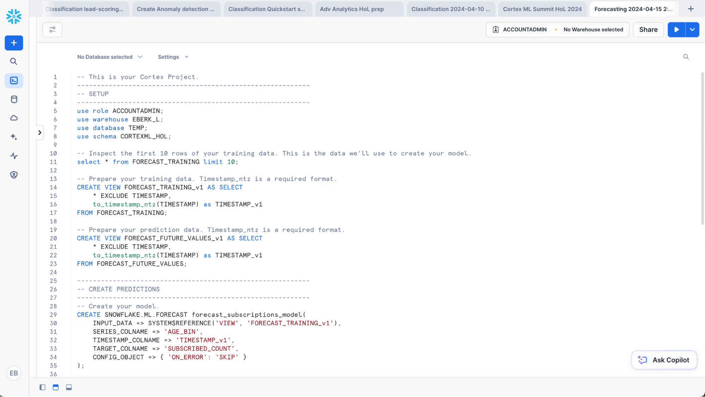

### Step 3: Generate Predictions and Visualize 

**Once you’ve run the steps under `SETUP` in your worksheet,** run this step in your worksheet to train your model: 
```sql
-- Train your forecasting model.
CREATE OR REPLACE SNOWFLAKE.ML.FORECAST forecast_subscriptions_model(
    INPUT_DATA => SYSTEM$REFERENCE('TABLE', 'forecast_training_v1'),
    SERIES_COLNAME => 'age_bin',
    TIMESTAMP_COLNAME => 'timestamp',
    TARGET_COLNAME => 'subscribed_count'
);
```

Call your model to generate forecasts of the number of customers who you expect to subscribe to our term deposit each day for the next month. 

We wrap our model call in a code block and leverage `result_scan` and `SQLID` to guarantee that our forecasts are stored to the forecast table we create. Keep an eye out for updates we’re working on to simplify this syntax. 

Otherwise, the below SQL uses the `forecast_subscriptions_model` we just trained to generate forecasts for each of the timestamp and age bin combinations we provided to it, using the interest rate as context. 

```sql
-- Generate predictions and store the results to a table.
BEGIN
    -- This is the step that creates your predictions.
    CALL forecast_subscriptions_model!FORECAST(
        INPUT_DATA => SYSTEM$REFERENCE('TABLE', 'forecast_future_values_v1'),
        SERIES_COLNAME => 'age_bin',
        TIMESTAMP_COLNAME => 'timestamp'
    );
    -- These steps store your predictions to a table.
    LET x := SQLID;
    CREATE TABLE forecasts AS SELECT * FROM TABLE(RESULT_SCAN(:x));
END;

-- View your predictions.
SELECT * FROM forecasts;
```

We added a `WHERE` clause to this step in your worksheet so that we can visualize just one segment of our customers. Update your worksheet to the below SQL to view historical and forecasted daily subscriptions for your 40 and up category.

```sql
SELECT TIMESTAMP, subscribed_count AS actual, NULL AS forecast, NULL AS lower_bound, NULL AS upper_bound
    FROM forecast_training 
    WHERE age_bin = '40 and up' and TIMESTAMP > '2010-02-01'
UNION ALL
SELECT  ts as TIMESTAMP, NULL AS actual, forecast, lower_bound, upper_bound
    FROM forecasts 
    WHERE series = '40 and up';
```

Run the above SQL then click on “Chart” in the results pane. Be sure to add `FORECAST` as a variable and set “Aggregation” to “None” for both `ACTUAL` and `FORECAST`. 

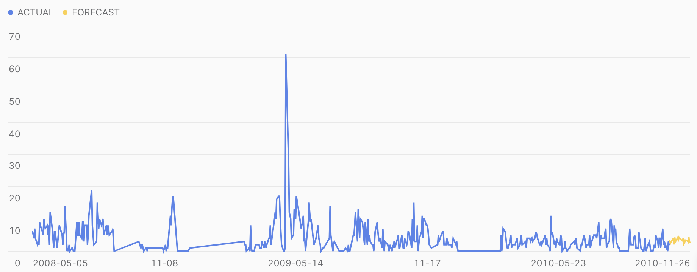

### Step 4: Evaluate the Model 

Great, we’ve trained a model and used it to generate forecasts. Before we rely on this model to make recurring business decisions, let’s see how well it performs. 

To do this, we’ll inspect the model’s accuracy metrics by calling the below command. 
```sql
-- Inspect the accuracy metrics of your model. 
CALL forecast_subscriptions_model!SHOW_EVALUATION_METRICS();
```

The results include separate evaluation metrics for _both_ age bins we provided to the model. The results also list out various metrics we can use to understand our model’s performance. We’ll look at MAPE and Mean Absolute Error, which represents the average absolute error between actual and predicted values. At a high level, we can interpret this as a representation of how accurate the model’s predictions will be. The lower the better.  

The results we get indicate that, on average, our forecasts are off by 3 to six daily sales. 

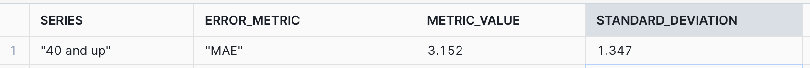
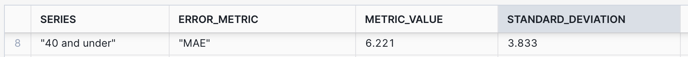

Next, we’ll inspect the relative importance of the features the model auto-generated and the feature we provided (interest rate). 
```sql
-- Inspect the relative importance of your features, including auto-generated features. 
CALL forecast_subscriptions_model!EXPLAIN_FEATURE_IMPORTANCE();
```

The results indicate that `aggregated_endogenous_trend_features` are the most important features to the model. These include rolling averages of our historical subscriptions (e.g., a 7-day rolling average of daily subscriptions). Our `interest_rate` feature, which we provided to the model, is the next most influential feature for generating prediction. The other features the model auto-generates are also listed in this table, including lags (e.g., a 7-day lag of daily subscriptions, calendar variables like day of quarter). 

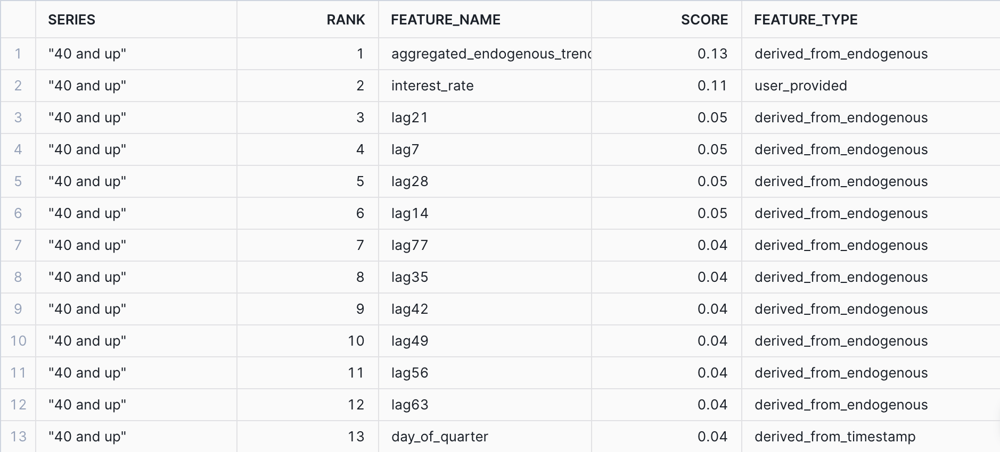

We now know how well our model is likely to perform (accuracy) and what is influencing our model’s predictions! 

### Step 5: Use Tasks to Automate Training and Prediction

Now that we’ve gotten comfortable with our model, we can schedule our model to train and predict on a regular basis. This is helpful when our business needs predictions each week to help make planning decisions. These steps are not included in the worksheet you produced, so you’ll need to copy these into your worksheet.

First, we’ll schedule recurring model training. Notice that we specify the warehouse the task should use and the timing of the task. This task is scheduled for midnight Monday morning – so that our forecasts are ready first thing Monday morning for our decision makers. (Try [crontab.guru](https://crontab.guru/#0_*_*_*) to create a different schedule.) The other important note is that we are training our model on the `forecast_training_v1` table. Separately, we’ll need to make sure this table is updated weekly so that our model trains on the most recent data.
```sql
-- Update your input data with recent data to make your predictions as accurate as possible. 
CREATE TASK train_task
WAREHOUSE = my_warehouse
SCHEDULE = 'USING CRON 0 0 * * 1  America/Los_Angeles' -- Runs at midnight PT, Monday morning.
AS
    CREATE OR REPLACE SNOWFLAKE.ML.FORECAST forecast_subscriptions_model(
        INPUT_DATA => SYSTEM$REFERENCE('TABLE', 'forecast_training_v1'),
        SERIES_COLNAME => 'age_bin',
        TIMESTAMP_COLNAME => 'timestamp',
        TARGET_COLNAME => 'subscribed_count'
    );
```

Next, we’ll schedule recurring predictions. Again, we set our warehouse and the training schedule. Just like we did with the training step, we need to ensure that `forecast_future_values_v1` is updated with future values for the timestamps we want to predict over. (For example, if we are predicting for the next two weeks, we need a table with a row for each day and age bin combination, with a column for the Euribor rate, since we included that feature in the model training step.) 
```sql
CREATE TASK predict_task
WAREHOUSE = my_warehouse
SCHEDULE = 'USING CRON 0 1 * * 1 America/Los_Angeles' -- Runs at 1am PT, Monday morning.
AS
    BEGIN
        CALL forecast_subscriptions_model!FORECAST(
            INPUT_DATA => SYSTEM$REFERENCE('TABLE', 'forecast_future_values_v1'),
            SERIES_COLNAME => 'age_bin',
            TIMESTAMP_COLNAME => 'timestamp'
        );
        LET x := SQLID;
        CREATE OR REPLACE TABLE my_forecasts AS SELECT * FROM TABLE(RESULT_SCAN(:x));
    END; 
```

If you’d like to test your task, you can run `EXECUTE TASK`. To suspend or drop your task, run the `ALTER` and `DROP` commands below. 

```sql
-- Execute your task immediately to confirm it is working. 
EXECUTE TASK train_task;

-- Suspend or drop your task.
ALTER TASK train_task suspend;
DROP TASK train_task;
DROP TASK predict_task;
```

## Conclusion and Resources

You did it! You've successfully built and evaluated Snowflake ML Classification and Forecast models!

As a review, in this guide we covered how you are able to:
1. Import our data and perform some exploratory data analysis in the Snowsight UI
2. Trained a model for classification to predict whether customers would subscribe to a new product, and a forecast model to predict the total number of subscriptions in the next 30 days. 
3. Created predictions using both models.
4. Evaluated the models to get a better understanding of how well they perform.

### What You Learned 
* How to build your own classification model 
* How to build your own forecasting model 
* How to evaluate those models and use them for prediction 
* How to apply abstract concepts like classification and forecasting to real-world problems 

### Resources
- Classification [documentation](https://docs.snowflake.com/en/user-guide/snowflake-cortex/ml-functions/classification), alongside the [classification syntax](https://docs.snowflake.com/sql-reference/classes/classification)
- Forecasting [documentation](https://docs.snowflake.com/user-guide/snowflake-cortex/ml-functions/forecasting)
- To explore other Cortex ML Functions, please refer to the Snowflake Cortex [ML Functions Page](https://docs.snowflake.com/en/guides-overview-ml-powered-functions)
