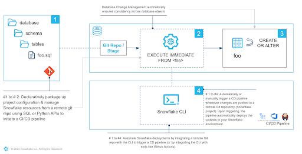
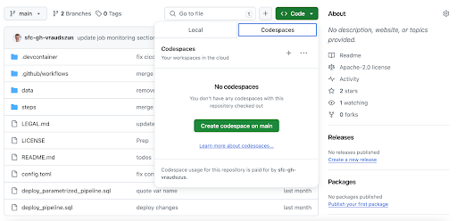
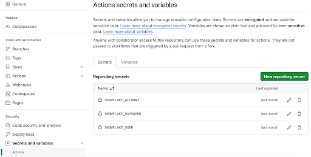
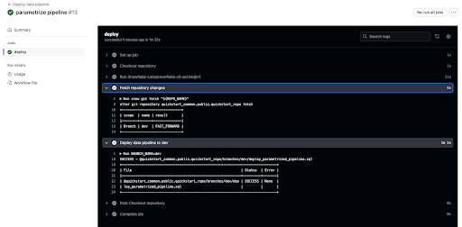

author: Vincent Raudszus
id: getting-started-with-snowflake-devops
categories: snowflake-site:taxonomy/solution-center/certification/quickstart, snowflake-site:taxonomy/product/data-engineering
language: en
summary: Getting Started with Snowflake DevOps 
environments: web
status: Published
feedback link: <https://github.com/Snowflake-Labs/sfguides/issues>


# Getting Started with Snowflake DevOps

<!-- ------------------------ -->
## Overview


A data pipeline is a series of automated processes that ingest, process, and move data from one place to another. It's a crucial component in data management and analytics, enabling organizations to make use of the vast amounts of data available to them.

The data engineer’s work doesn’t end when the pipeline is up and running for the first time. As businesses grow and change, so do their data needs. Data schemas as well as the pipeline as a whole need to evolve to capture new data sources or analyst requirements. In software engineering, DevOps techniques are applied to emphasize collaboration and communication to make changes rapidly and reliably. Similarly, DevOps best practices should be followed to ensure that changes to tables, data pipelines, and other database objects are made in a controlled, repeatable, and safe manner.

Are you interested in bringing your database game to the next level by unleashing the power of Snowflake’s many DevOps capabilities, empowering you to build safe and robust data pipelines? Well then, this Quickstart is for you!

This quickstart will cover a lot of ground. By the end of this guide, you will have built a robust CI/CD pipeline that automates the deployment of changes to a data pipeline from Git, promotes the separation of dev and prod databases and facilitates monitoring. You'll also learn how to use Snowflake's marketplace to enrich your data without incurring storage costs, get to know the new developer CLI tool and the Visual Studio Code extension!



The data pipeline used as an example in this quickstart makes use of data available on the Snowflake marketplace to come up with the perfect spot for a family vacation. Let's get started!

> 
> Note: The Git integration, Create-or-Alter and Jinja templating are still in preview.

### Prerequisites

- Familiarity with Snowflake
- Fundamentals of data engineering. You can use [Intro to Data Engineering with Snowpark Python](/en/developers/guides/data-engineering-with-snowpark-python-intro/) to refresh your memory
- Familiarity with Git repositories and GitHub

### What you will learn

You will learn about the following Snowflake features in this Quickstart:

- Native Git Integration
- Declarative Database Change Management
- Parametrization of SQL scripts with Jinja templating
- GitHub Actions (CI/CD) integration
- Snowflake’s Visual Studio Code extension
- SnowflakeCLI tool
- Snowflake's Python APIs
- Data Sharing/Marketplace (instead of ETL)
- LLM interference with Snowflake Cortex

### What you will need

You will need the following things before starting:

- Snowflake
  - **A [Snowflake Account](https://signup.snowflake.com/?utm_source=snowflake-devrel&utm_medium=developer-guides&utm_cta=developer-guides)**
  - **A Snowflake user with ACCOUNTADMIN permissions**
  - **Anaconda Terms & Conditions accepted**. See [Using Third-Party Packages](https://docs.snowflake.com/en/developer-guide/udf/python/udf-python-packages#getting-started).
- GitHub
  - A GitHub account. If you don't already have one, you can [create one for free](https://github.com/).

### What you will build

During this Quickstart you will accomplish the following things:

- Establish a connection between Snowflake and a GitHub repository
- Setup access to Snowflake Marketplace data
- Create a vectorized Python UDF making use of dynamic file access
- Create a data engineering pipeline to process data from multiple sources
- Orchestrate the pipeline with tasks
- Make declarative changes to the pipeline with Create-or-Alter and Python APIs
- Separate dev and prod environments with Jinja templating
- Deploy the pipeline via an automated CI/CD pipeline
- Enrich your data with Cortex LLM functions 

<!-- ------------------------ -->
## Setup Environment


### Fork the Quickstart Repository

You'll need to create a fork of the repository for this Quickstart in your GitHub account. Visit the [associated GitHub repository](https://github.com/Snowflake-Labs/sfguide-getting-started-with-snowflake-devops) and click on the "Fork" button near the top right. Complete any required fields and click "Create Fork".

### Create GitHub Codespace

For this Quickstart we will be using [GitHub Codespaces](https://docs.github.com/en/codespaces/overview) as our development environment. Codespaces offer a hosted development environment with a hosted, web-based VS Code environment. The free offering should be more than enough for this quickstart.

To create a GitHub Codespace, click on the green “<> Code” button from the forked repository’s homepage. In the Code popup, click on the green “Create codespace on main”.



This will open a new tab and begin setting up your codespace. This will take a few minutes as it sets up the entire environment for this Quickstart.

Once the codespace has been created and started, you should see a hosted web-based version of VS Code with your forked repository set up! Snowflake’s VS Code extension and the Snowflake CLI have already been installed for you.

### Snowflake Extension for VS Code

You can run SQL queries against Snowflake in many different ways (through the Snowsight UI, SnowSQL, etc.) but for this Quickstart we'll be using the Snowflake extension for VS Code. For a brief overview of Snowflake's native extension for VS Code, please check out our [VS Code Marketplace Snowflake extension page](https://marketplace.visualstudio.com/items?itemName=snowflake.snowflake-vsc).

### Snowflake CLI

[Snowflake CLI](https://docs.snowflake.com/en/developer-guide/snowflake-cli/index) is an open-source command-line tool explicitly designed for developer-centric workloads in addition to SQL operations. With Snowflake CLI, developers can create, manage, update, and view apps running on Snowflake across workloads such as Streamlit in Snowflake, the Snowflake Native App Framework, Snowpark Container Services, and Snowpark.

Here we will make use of the CLI to quickly setup a CI/CD pipeline.

### Connecting to Snowflake

Both the VS Code extension and the CLI manage their Snowflake connections in a shared file. Open `.snowflake/config.toml` and add your [account identifier](https://docs.snowflake.com/en/user-guide/admin-account-identifier), username and password in the corresponding placeholders. Note that the user must have ACCOUNTADMIN privileges. Make sure to not commit this file to Git.

Now use these credentials to login with the VS Code extension, by clicking the Snowflake logo in the activity bar to the left of the editor. The dialog should have been pre-filled from the config file. Press "Sign in" and you are good to go.

<!-- ------------------------ -->
## Setup Snowflake


To get started we need to create some basic Snowflake objects like databases, stages and a warehouse that we will use later on. Open `steps/01_setup_snowflake.sql` to review what statements will be executed.

### Create and Connect a Git Repository

This quickstart makes extensive use of the [GIT REPOSITORY](https://docs.snowflake.com/en/developer-guide/git/git-overview) object. This object acts similarly to an external stage except that it is backed by a GitHub repository. It enables the access to version controlled files at a certain commit, branch or tag. This way your database scripts and object definitions can be evolved with software engineering best practices such as branching, pull requests and code reviews.

Before continuing, **replace the two placeholders** in `steps/01_setup_snowflake.sql` with your GitHub username and the url of the forked repository.

```sql
CREATE OR REPLACE API INTEGRATION git_api_integration
  API_PROVIDER = git_https_api
  API_ALLOWED_PREFIXES = ('https://github.com/<insert GitHub username>')
  ENABLED = TRUE;

CREATE OR REPLACE GIT REPOSITORY quickstart_common.public.quickstart_repo
  API_INTEGRATION = git_api_integration
  ORIGIN = '<insert URL of forked GitHub repo>';
```

### Run the Script

After replacing the git-related placeholders, it is time to execute the script to create all the objects we'll need for this quickstart.

Start by opening the `steps/01_setup_snowflake.sql` script. Now you can run all the queries in this script, by using the "Execute All Statements" button in the upper right corner of the editor window. If you want to run them in chunks instead, you can highlight the ones you want to run and press “CMD/CTRL+Enter”.

<!-- ------------------------ -->
## Load Data from the Marketplace


In this step, we will be "loading" the raw data we need to find the perfect vacation spot to Snowflake. But "loading" is really the wrong word here. Because as we're using Snowflake's unique data sharing capability, we don't actually need to copy any data to our Snowflake account. Instead, we can directly access the data shared by various data providers in the Snowflake Data Marketplace.

As we are looking to find the perfect vacation spot, we are interested in:

- The weather forecast
- Flight connections
- Points of interest

### Snowflake Data Marketplace

All this data is freely available on Snowflake’s marketplace, and we won’t incur any storage costs as long as we don’t materialize it in our account. The other great thing about the marketplace is that we don't have to do anything to keep this data updated. The provider will do that for us, and data sharing means we are always seeing whatever they have published. How amazing is that? Just think of all the additional insights you could extract from your data if only you had the necessary, always up-to-date supplementary data available.

For this quickstart we will add a number of data sets to our account. The process is always the same:

1. Login to Snowsight
2. Click on the “Data Products” link in the left navigation bar
3. Enter the name of the data set in the search box and click return
4. Click on the corresponding listing tile
5. Click the blue "Get" button on the top right
6. On the popup, click the blue "Get" button

Now, perform these steps for the following data listings:

1. “OAG: Flight Emissions Data (Sample)” by OAG
2. “OAG: Flight Status Data (Sample)” by OAG
3. “Global Weather & Climate Data for BI” by Weather Source
4. “Snowflake Public Data (Free)” by Snowflake Public Data Products

### Inspect Imported Listings

That’s all! The imported listings are now available in our account and can be accessed like any other table. Use the following sample queries to inspect the imported data and verify that all data sets are accessible. You can also find the sample queries in `steps/02_access_marketplace_data.sql` of the Git repository.

```sql
SELECT * FROM oag_flight_emissions_data_sample.public.estimated_emissions_schedules_sample LIMIT 100;
SELECT * FROM oag_flight_status_data_sample.public.flight_status_latest_sample LIMIT 100;
SELECT * FROM global_weather__climate_data_for_bi.standard_tile.forecast_day LIMIT 100;
SELECT * FROM SNOWFLAKE_PUBLIC_DATA_FREE.PUBLIC_DATA_FREE.datacommons_timeseries LIMIT 100;
SELECT * FROM SNOWFLAKE_PUBLIC_DATA_FREE.PUBLIC_DATA_FREE.point_of_interest_index LIMIT 100;
```

<!-- ------------------------ -->
## Harmonize Marketplace Data


The step will establish a data pipeline that will help us answer the question of what the perfect vacation spot is by joining together the different data sources from the market place, aggregating data points and picking only the columns and rows we need.

While most parts of our data pipeline are authored in SQL, `steps/03_harmonize_data.py` is written in Python. Snowflake supports seamlessly switching between SQL and Python when authoring data pipelines. Here, [Snowflake's first class PythonAPI's](https://docs.snowflake.com/en/developer-guide/snowflake-python-api/snowflake-python-overview) are used to manage creations, alterations, or drops of Snowflake objects just like you would otherwise do with SQL commands.

We will skip the details of how the pipeline is constructed to focus on how we can employ DevOps practices to later safely evolve and manage the pipeline. If you want to learn more about the Python APIs check the tutorials [here](https://docs.snowflake.com/en/developer-guide/snowflake-python-api/overview-tutorials).

### Run the Script

To establish the pipeline, we need to run the commands in the Python file `steps/03_harmonize_data.py`. Open the file in VS Code. Next, click on “Run Python File” to run the script.

<!-- ------------------------ -->
## Orchestrate Jobs


During this step we will be orchestrating our new pipeline with Snowflake's native orchestration feature named “tasks”. In this step, we will create two tasks and chain them together. We will then deploy or run the tasks to operationalize the data pipeline.

The job of the first task “vacation_spots_update” is joining the views created in the previous step and merge the result into the output table “vacation_spots”. The second task “email_notification” runs after the update task has finished. It selects a number of suitable places for a summer vacation and feeds the results into an LLM to get a final verdict and turn the recommendation into an entire vacation plan. The answer the LLM comes up with is sent via email, informing you of the pipelines completion and providing you with the ultimate vacation plan. No more stressful vacation planning, just book your flights and hotel, share the email with friends and family and off you go!

In this step, we will run through the commands in the Python file `steps/04_orchestrate_jobs.sql`. Open the file in VS Code and **add your email address to the three placeholders**. Then execute the file by clicking on on “Execute All Statements” to run all the commands sequentially.

> 
> Note: The Snowflake Cortex LLM functions are currently not available in all regions. Check the [docs](https://docs.snowflake.com/user-guide/snowflake-cortex/llm-functions#availability) to verify your region is supported. If not, it is up to you to pick your favorite vacation spot from the results.


> 
> Tip: The query used in the “email_notification” task selects suitable places for a summer vacation. If you are running the pipeline in the colder months, it might not return any results. In that case, adapt the filters and off you go on your winter vacation! You might want to add snowfall days to your weather metrics.

### Declarative Create-or-Alter Command

When creating the target table and the tasks orchestrating the pipeline, we make use of the [CREATE OR ALTER](https://docs.snowflake.com/en/sql-reference/sql/create-table#create-or-alter-table) command. CREATE OR ALTER behaves similarly to CREATE OR REPLACE except that an existing object is not replaced, but rather altered to the target state.

```sql
create or alter table vacation_spots (
  city varchar,
  airport varchar,
  co2_emissions_kg_per_person float,
  punctual_pct float,
  avg_temperature_air_f float,
  avg_relative_humidity_pct float,
  avg_cloud_cover_pct float,
  precipitation_probability_pct float
) data_retention_time_in_days = 1;
```

> 
> Note: The Create-or-Alter command is currently not publicly available for all object types. Check the docs for currently supported objects types and contact your account manager if you want to join the extended preview.

### Verify Pipeline Completion

By this time the pipeline should has completed processing. You should have received an email with all the details for your dream vacation. If you haven’t received an email, use the following query to see what is going on:

```sql
SELECT *
FROM TABLE(QUICKSTART_PROD.INFORMATION_SCHEMA.TASK_HISTORY(
    SCHEDULED_TIME_RANGE_START=>DATEADD('DAY',-1,CURRENT_TIMESTAMP()),
    RESULT_LIMIT => 100))
ORDER BY SCHEDULED_TIME DESC;
```

Check out [this](/en/developers/guides/data-engineering-pipelines-with-snowpark-python/) guide to learn more about the powerful Snowflake features enabling you to monitor the execution of your tasks.

<!-- ------------------------ -->
## Database Change Management


Just as business needs change, so do data needs. Over time our data pipeline will need to adapt to capture new or differently formatted data. It is our responsibility as data engineers to make sure that these changes can be made in a safe manner. In DevOps, Infrastructure as Code (IaC) is a common pattern applied when making infrastructure changes. Managing our database resources in a common, versioned source allows us to effectively collaborate and have a source off truth that is consistent across all deployments. IaC if often done in a declarative manner using tools such as [terraform](/en/developers/guides/devops-dcm-terraform-github/).

Declarative definitions are concise, idempotent and easy to understand as we don’t need to understand the entire stack of historic changes leading up to the current state as in tools like [schemachange](/en/developers/guides/devops-dcm-schemachange-github/). Rolling back multiple ALTER statements to get back to a previous state can be a pain.

### Declarative Pipeline Evolution

This is where the [CREATE OR ALTER](https://docs.snowflake.com/en/sql-reference/sql/create-table#create-or-alter-table) command shines. It allows us to have one single source of truth for the current state of the object. Potential rollbacks are super easy to do thanks to the straightforward integration with version control tools such as Git. Just apply an older version of the CREATE OR ALTER. This makes CREATE OR ALTER a great choice to manage data pipelines.

> 
> Note: The Create-or-Alter command is currently not publicly available for all object types. Check the docs for currently supported objects types and contact your account manager if you want to join the extended preview.

### Adding a new Data Source to the Pipeline

Until now our vacation spot pipeline did only consider the weather and the reachability of potential locations. But what about activities during the stay? After all, what is a vacation without a visit to at least one Korean restaurant? And it’s a family vacation, so how about a visit to a zoo or an aquarium?

Let’s add data on these points of interest to our pipeline! **Follow along and perform the described steps** yourself in VS Code.

1. In DevOps it is always a good practice to make our changes on a development branch to properly test them before merging to main. Let’s create a new branch for our changes. Open the terminal of your VS Code codespace and run:

```bash
git checkout -b dev
```

2. Open `steps/03_harmonize_data.py` and add the following view definition at the end of the file. This view makes use of the “US Points of Interest & Addresses” data set we previously imported from the marketplace to find the number of Korean restaurants, zoos and aquariums for each potential vacation spot.

```py
View(
    name="attractions",
    columns=[
        ViewColumn(name="geo_id"),
        ViewColumn(name="geo_name"),
        ViewColumn(name="aquarium_cnt"),
        ViewColumn(name="zoo_cnt"),
        ViewColumn(name="korean_restaurant_cnt"),
    ],
    query="""
    select
        city.geo_id,
        city.geo_name,
        count(case when category_main = 'Aquarium' THEN 1 END) aquarium_cnt,
        count(case when category_main = 'Zoo' THEN 1 END) zoo_cnt,
        count(case when category_main = 'Korean Restaurant' THEN 1 END) korean_restaurant_cnt,
    from SNOWFLAKE_PUBLIC_DATA_FREE.PUBLIC_DATA_FREE.point_of_interest_index poi
    join SNOWFLAKE_PUBLIC_DATA_FREE.PUBLIC_DATA_FREE.point_of_interest_addresses_relationships poi_add 
        on poi_add.poi_id = poi.poi_id
    join SNOWFLAKE_PUBLIC_DATA_FREE.PUBLIC_DATA_FREE.us_addresses address 
        on address.address_id = poi_add.address_id
    join major_us_cities city on city.geo_id = address.id_city
    where true
        and category_main in ('Aquarium', 'Zoo', 'Korean Restaurant')
        and id_country = 'country/USA'
    group by city.geo_id, city.geo_name
    """,
),
```

3. Next, let’s update the schema of our target table to account for the new columns. Head over to `steps/04_orchestrate_jobs.sql` and modify the CREATE OR ALTER on top by appending the following columns to its column list:

```sql
, aquarium_cnt int
, zoo_cnt int
, korean_restaurant_cnt int
```

4. Then update the MERGE statement in task “vacation_spots_update” by adding a JOIN with the new view.

```sql
join silver.attractions att on att.geo_name = city.geo_name
```

5. Add the new columns to the WHEN MATCHED clause of the same MERGE statement.

```sql
, vacation_spots.aquarium_cnt = harmonized_vacation_spots.aquarium_cnt
, vacation_spots.zoo_cnt = harmonized_vacation_spots.zoo_cnt
, vacation_spots.korean_restaurant_cnt = harmonized_vacation_spots.korean_restaurant_cnt
```

6. Don’t forget to also add the new columns to the MERGE statement’s WHEN NOT MATCHED clause.

```sql
, harmonized_vacation_spots.aquarium_cnt
, harmonized_vacation_spots.zoo_cnt
, harmonized_vacation_spots.korean_restaurant_cnt
```

7. Finally, update the WHERE clause of the filter query in task “email_notification” to filter for vacation spots that have a Korean restaurant as well as either a zoo or an aquarium for the kids to enjoy.

```sql
and korean_restaurant_cnt > 0
and (zoo_cnt > 0 or aquarium_cnt > 0)
```

### Deploy Pipeline Changes

After accounting for the new data in our pipeline it is time to deploy the new version. First commit your changes to the Git repository. Run the following commands in the VS Code terminal:

```bash
git add steps/*
git commit -m "added attractions to pipeline"
git push --set-upstream origin dev
```

Next, deploy the new version of the data pipeline manually. Open the terminal in VS Code and run `snow git fetch quickstart_common.public.quickstart_repo` to fetch the changes from GitHub to Snowflake. Finally, run `snow git execute @quickstart_common.public.quickstart_repo/branches/dev/steps/0[134]_*`. The command reexecutes `steps/01_setup_snowflake.sql` to apply changes to the foundational objects, `steps/03_harmonize_data.py` to update the views used to transform the marketplace data and `steps/04_orchestrate_jobs.sql` to apply our changes to the target table and update and execute the two tasks.

```bash
$ snow git fetch quickstart_common.public.quickstart_repo
+------------------------+
| scope  | name | result |
|--------+------+--------|
| Branch | dev  | FORCED |
+------------------------+

$ snow git execute '@quickstart_common.public.quickstart_repo/branches/dev/steps/0[134]_*'
SUCCESS - @quickstart_common.public.quickstart_repo/branches/dev/steps/01_setup_snowflake.sql
SUCCESS - @quickstart_common.public.quickstart_repo/branches/dev/steps/03_harmonize_data.py
SUCCESS - @quickstart_common.public.quickstart_repo/branches/dev/steps/04_orchestrate_jobs.sql
+--------------------------------------------------------------------------------------------------------+
| File                                                                                 | Status  | Error |
|--------------------------------------------------------------------------------------+---------+-------|
| @quickstart_common.public.quickstart_repo/branches/dev/steps/01_setup_snowflake.sql  | SUCCESS | None  |
| @quickstart_common.public.quickstart_repo/branches/dev/steps/03_harmonize_data.py    | SUCCESS | None  |
| @quickstart_common.public.quickstart_repo/branches/dev/steps/04_orchestrate_jobs.sql | SUCCESS | None  |
+--------------------------------------------------------------------------------------------------------+
```

If done correctly, you will shortly receive another email with your updated vacation plan.

<!-- ------------------------ -->
## Separate Dev and Prod Environments


In the previous section we did not pause to verify our changes before deploying them to Snowflake. In this section, we will discuss how to properly test the changes before deploying them to our production database.

DevOps emphasizes the use of separate environments for development, testing, and production to minimize the risk of bugs or regressions affecting live systems. By maintaining separate dev and prod databases, teams can isolate development activities from the production environment, reducing the likelihood of unintended consequences and data corruption. A common pattern to separate production from development environments is using separate databases.

There is a problem preventing us from doing so: Our pipeline definitions contain hard references to the production database “quickstart_prod”. We need to parametrize these references to enable a CI/CD pipeline to choose the deployment target.

### Jinja Templating in Snowflake

[Jinja](https://jinja.palletsprojects.com/en/3.1.x/) is a popular templating language with features ranging from simple script parametrization to extensive scripting in a language similar to Python. Snowflake supports the execution of templated SQL scripts with the [EXECUTE IMMEDIATE FROM](https://docs.snowflake.com/en/sql-reference/sql/execute-immediate-from) command.

For the use case of changing the deployment target, variable replacement is all we need from Jinja. Jinja variables in SQL scripts are marked by `{{...}}`. We can provide a value for a variable in the USING clause of EXECUTE IMMEDIATE FROM. Template variables can be used everywhere is a SQL script. We can use variables to inject object names, property values or even entire statements.

### Parameterize the Deployment Target

A number of small changes are necessary to parametrize which database the data pipeline gets deployed to. To get more control over our storage costs, we will also parametrize the retention time for the data in our target table.

Let’s perform the necessary changes! Follow along and perform the described steps yourself in VS Code.

1. Open `steps/01_setup_snowflake.sql` and parametrize part the database name in the CREATE OR REPLACE DATABASE QUICKSTART_PROD command.

```sql
CREATE OR ALTER DATABASE QUICKSTART_{{environment}}; 
```

2. Open `steps/03_harmonize_data.py` and read the environment variable.

```py
silver_schema = root.databases[f"quickstart_{os.environ['environment']}"].schemas["silver"]
```

3. Open `steps/04_orchestrate_jobs.sql` and parametrize the USE SCHEMA command.

```sql
use schema quickstart_{{environment}}.gold;
```

4. Finally, in the same file, parametrize the value of the “data_retention_time_in_days” parameter in the CREATE OR ALTER TABLE command.

```sql
data_retention_time_in_days = {{retention_time}};
```

<!-- ------------------------ -->
## Deployment Automation


In this section we will use the Jinja templating to automatically deploy the pipeline using GitHub Actions. We build a CI/CD pipeline to deploy the data pipeline to the “prod” database when changes are pushed to the repository’s “main” branch. Thanks to templating, commits to the “dev” branch are deployed to the “dev” database instead.

### Configuring Your Forked GitHub Project

By default, GitHub disables any workflows (or CI/CD pipelines) when forking a repository. The forked repository contains a CI/CD workflow to deploy your data pipeline to dev and prod environments. Enable the workflows by opening your forked repository in GitHub, clicking on the “Actions” tab near the top middle of the page, and then clicking on the “I understand my workflows, go ahead and enable them” green button.


In order for your GitHub Actions workflow to connect to your Snowflake account you will need to store your Snowflake credentials in GitHub. Action Secrets in GitHub are used to securely store values/variables for use in CI/CD pipelines.

In GitHub, click on the “Settings” tab near the top of the page. From the Settings page, click on the “Secrets and variables” then “Actions” tab in the left hand navigation. The “Secrets” tab should be selected. For each secret listed below click on the green “New repository secret” and enter the name given below along with the appropriate value (adjusting as appropriate).

| Secret name | Secret value |
|-------------|--------------|
| SNOWFLAKE_ACCOUNT | myaccount |
| SNOWFLAKE_USER | myusername |
| SNOWFLAKE_PRIVATE_KEY | contents of private key file (follow [this guide](https://docs.snowflake.com/en/user-guide/key-pair-auth) to setup key-pair auth) |

> 
> Note: For more details on how to structure the account name in SNOWFLAKE_ACCOUNT secret, see the account name discussion in the [Snowflake Python Connector install guide](https://docs.snowflake.com/en/developer-guide/python-connector/python-connector-api#usage-notes-for-the-account-parameter-for-the-connect-method).

When you're finished adding all the secrets, the page should look like this:



### Deploy to Development Environment with CI/CD Pipeline

The CI/CD pipeline is ready to use. Let’s push our changes to GitHub and let the CI/CD pipeline do its thing. Open the terminal of the VS Code codespace and execute the following commands.

```bash
git add steps/*
git commit -m "parametrize pipeline"
git push
```

The CI/CD pipeline will pick us the changes and run the workflow defined in `.github/workflows/deploy_pipeline.yml`. To view the results go back to the homepage of your GitHub repository and do the following:

- From the repository, click on the Actions tab near the top middle of the page
- Click on the name of the most recent run (which should have the name “parametrize pipeline”)
- From the run overview page click on the “deploy” job and browse through the output from the various steps. In particular you might want to review the output of the “Deploy data pipeline to dev” step.



The workflow should indicate a successful execution. If this is the case, you will receive the familiar email containing the vacation plan after about a minute. Great! We just successfully tested our parametrization changes in a dedicated test environment.

### Deploy to Production Environment with CI/CD Pipeline

After validating the changes, we can confidently merge them to our production database. Normally, at this point we would open a pull request to get our changes reviewed. Let’s speed this up and merge directly to main by executing the following commands in the VS Code terminal:

```bash
git checkout main
git merge dev
git push
```

Time to check GitHub’s “Actions” tab again. Another run of the “Deploy data pipeline” has appeared. Since we have dutifully tested our changes beforehand, we can confidently expect the vacation plan email to arrive shortly indicating a successful run.

To save storage costs, we also used templating to parametrize the data retention time of the target table “vacation_spots”. The CI/CD pipeline did set the retention time to 0 days for the dev environment, while the prod environment stayed at the default of 1 day. Confirm this with the following commands. Note, that as the production pipeline might still be running, the second command might throw an error initially.

```sql
show parameters like 'data_retention_time_in_days' in table quickstart_dev.gold.vacation_spots;
> returns 0
show parameters like 'data_retention_time_in_days' in table quickstart_prod.gold.vacation_spots;
> returns 1
```

### CI/CD Pipeline using SnowflakeCLI

While the pipeline is running, let’s understand how it works. Open `.github/workflows/deploy_pipeline.yml` in VS Code. The workflow is triggered on pushes to “main” or “dev”, sets up the SnowflakeCLI and stores the GitHub Actions secrets in environment variables. This environment is then used to execute two commands on Snowflake.

```yaml
name: Deploy data pipeline

# Action will run on pushes to selected branches
on:
  push:
    branches:
      - dev
      - main

  # Allows you to run this workflow manually from the Actions tab
  workflow_dispatch:

jobs:
  deploy:
    runs-on: ubuntu-22.04

    env:
      REPO_NAME: "quickstart_common.public.quickstart_repo"
      SNOWFLAKE_CONNECTIONS_DEFAULT_AUTHENTICATOR: "SNOWFLAKE_JWT"
      SNOWFLAKE_CONNECTIONS_DEFAULT_PRIVATE_KEY_FILE: ".snowflake/snowflake_rsa_key"
      # Read connection secrets
      SNOWFLAKE_CONNECTIONS_DEFAULT_ACCOUNT: ${{ secrets.SNOWFLAKE_ACCOUNT }}
      SNOWFLAKE_CONNECTIONS_DEFAULT_USER: ${{ secrets.SNOWFLAKE_USER }}

    steps:
      # Checkout step is necessary if you want to use a config file from your repo
      - name: Checkout repository
        uses: actions/checkout@v4

      # Write private key secret as file
      - name: Configure Private Key
        run: |
          echo "${{ secrets.SNOWFLAKE_PRIVATE_KEY }}" > .snowflake/snowflake_rsa_key

      # Install Snowflake CLI GitHub Action and point to config file
      - name: Install snowflake-cli
        uses: Snowflake-Labs/snowflake-cli-action@v1.5
        with:
          cli-version: "latest"
          default-config-file-path: ".snowflake/config.toml"

      # Update Snowflake's copy of the repository
      - name: Fetch repository changes
        run: snow git fetch "${REPO_NAME}"

      # Deploy pipeline with branch specific parameters
      - name: Deploy data pipeline to ${{ github.ref_name }}
        run: |
          BRANCH_NAME=${{ github.ref_name }}
          if [ "${BRANCH_NAME}" == "main" ]; then
            RETENTION_TIME=1
          else
            RETENTION_TIME=0
          fi
          snow git execute \
            "@${REPO_NAME}/branches/${BRANCH_NAME}/steps/0[134]_*" \
            -D "environment='${BRANCH_NAME}'" \
            -D "retention_time=${RETENTION_TIME}"
```

Both commands are executed using the `snow` command. This command is part of the [SnowflakeCLI](https://docs.snowflake.com/en/developer-guide/snowflake-cli-v2/index) tool, not to be confused with its predecessor [SnowSQL](https://docs.snowflake.com/en/user-guide/snowsql). SnowflakeCLI is an open-source command-line tool explicitly designed for developer-centric workloads. Also provided is a [native GitHub Action](https://github.com/Snowflake-Labs/snowflake-cli-action), simplifying the setup and connection management. It is a flexible and extensible tool that can accommodate modern development practices and technologies. This makes it a perfect choice for DevOps.

<!-- ------------------------ -->
## Cleanup


Once you're finished with the Quickstart and want to clean things up, you can drop all the objects you created by running the cleanup script. Open `steps/08_cleanup.sql` in the VS Code extension and run all command using the "Execute All Statements" button in the upper right corner of the editor window.

<!-- ------------------------ -->
## Conclusion And Resources


Wow, we have covered a lot of ground during this Quickstart! Not only can you now skip this year’s vacation planning, but you have also learned how to manage a data pipeline with DevOps practices. You followed the Infrastructure as Code principle and used Snowflake’s version control capabilities in combination with declarative Create-or-Alters to make database change management much less error-prone and less painful. With the help of SnowflakeCLI and Jinja templating you verified your changes in a test environment before automatically rolling them out to production with the help of a CI/CD pipeline.

But we've really only just scratched the surface of what's possible with Snowflake DevOps. You now have the building blocks, and examples, you need to get started integrating DevOps best practices into your own data engineering pipelines. So, what will you DevOps-ify first?

### What You Learned

You have learned a ton in this guide. Here are the highlights:

- How to connect Snowflake to Git with the native Git integration
- How to simplify database change management with declarative Create-or-Alters
- How to verify your changes in a test environment with Jinja templating
- How to use Snowflake’s Visual Studio Code extension
- How to build CI/CD pipelines with SnowflakeCLI and GitHub Actions
- How to interact with Snowflake's Python APIs
- How to gain access to the powerful data on Snowflake's Marketplace
- How to enhance your data with Snowflake Cortex LLM functions

### Related Resources

- [Source Code on GitHub](https://github.com/Snowflake-Labs/sfguide-getting-started-with-snowflake-devops)
- [DevOps in Snowflake: How Git and Database Change Management enable a file-based object lifecycle](https://medium.com/snowflake/devops-in-snowflake-how-git-and-database-change-management-enable-a-file-based-object-lifecycle-1f61a0d5257c)
- [DevOps: Database Change Management with Terraform and GitHub](/en/developers/guides/devops-dcm-terraform-github/)
- [Advanced: Data Engineering Pipelines with Snowpark Python](/en/developers/guides/data-engineering-pipelines-with-snowpark-python/)
- Related Tools
  - [Snowflake Visual Studio Code Extension](https://docs.snowflake.com/en/user-guide/vscode-ext)
  - [SnowflakeCLI Tool](https://docs.snowflake.com/en/developer-guide/snowflake-cli-v2/index) and [GitHub Action](https://github.com/Snowflake-Labs/snowflake-cli-action)
