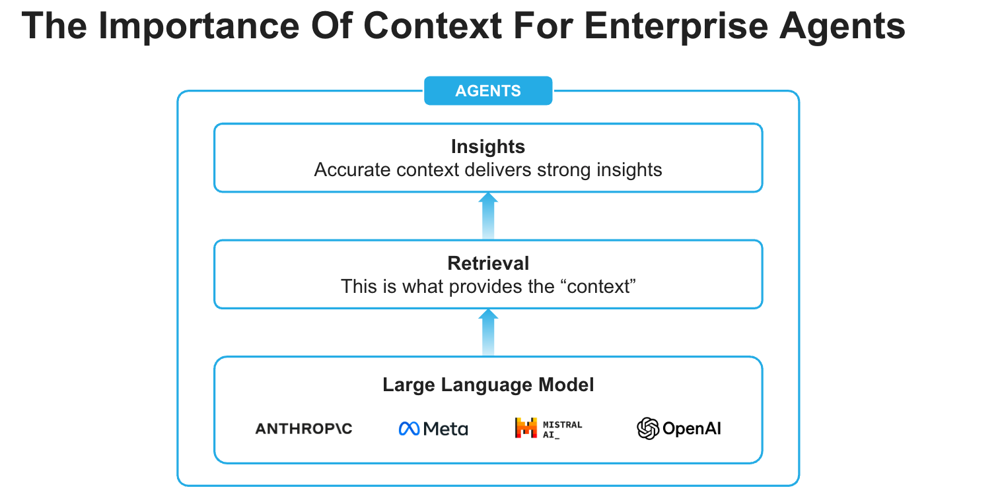

id: getting-started-with-snowflake-intelligence-and-cke
categories: snowflake-site:taxonomy/solution-center/certification/quickstart, snowflake-site:taxonomy/product/platform
language: en
summary: This guide outlines the process for getting started with Snowflake Intelligence and Cortex Knowledge Extensions. 
environments: web
status: Published
feedback link: <https://github.com/Snowflake-Labs/sfguides/issues>
authors: Dash Desai

# Getting Started with Snowflake Intelligence and Cortex Knowledge Extensions
<!-- ------------------------ -->

## Overview

Snowflake Intelligence is an Enterprise Intelligence Agent that provides every user with the ability to answer complex questions in natural language, and puts insights at every user’s fingertips. With a single question, you can get comprehensive insights across your business data. It moves beyond the “what” to the critical “why” with an always-available thought partner at their fingertips that can facilitate deep research and suggest solutions to previously difficult and time-consuming business problems.

Snowflake Intelligence removes the barriers to insights, enabling users to understand the cross-sections of their data and test assumptions with a shared understanding of the data needed to make impactful business decisions.

### What is Snowflake Intelligence? 

Ask complex questions of all your data, analyze and get insights instantly with Snowflake Intelligence as your always-on thought partner.

* **Deep analysis, quick action**: Go beyond the “what” to quickly understand the critical “why,” accelerating action with AI agents that use natural language to analyze and reason across all your data, including third-party sources and market intelligence.
* **Verified, trusted answers**: Trace every answer to its source. Codify "golden" questions for verified answers.
* **Enterprise-ready**: Maintain peace of mind knowing that Snowflake Intelligence scales with your enterprise data and application complexity — all within Snowflake’s secure perimeter and with the same robust governance policies.

### What are Cortex Knowledge Extensions?

[Cortex Knowledge Extensions](https://docs.snowflake.com/en/user-guide/snowflake-cortex/cortex-knowledge-extensions/cke-overview?utm_source=guide&utm_medium=gettingstartedwithsi) (CKEs) allow publishers to bring their documents (news articles, market research reports, books, articles, etc.) directly to customers in their generative AI applications. They are Snowflake [Cortex Search Services](https://docs.snowflake.com/en/user-guide/snowflake-cortex/cortex-search/cortex-search-overview?utm_source=guide&utm_medium=gettingstartedwithsi) that can be shared on the Snowflake Marketplace or through private listings. They enable a [retrieval-augmented generation](https://www.snowflake.com/en/fundamentals/rag/) (RAG) architecture to integrate licensed and proprietary content into Cortex AI applications.

### Prerequisites

* [Git](https://git-scm.com/book/en/v2/Getting-Started-Installing-Git) installed.

Download the [Git repository](https://github.com/Snowflake-Labs/sfguide-getting-started-with-snowflake-intelligence-and-cke). This is how you get the necessary source code and data to complete this quickstart.

* Access to a [Snowflake account](https://signup.snowflake.com/?utm_source=snowflake-devrel&utm_medium=developer-guides&utm_cta=developer-guides) with the ACCOUNTADMIN role.

### What You Will Learn

How to acquire external knowledge sources from the Snowflake Marketplace and create the building blocks (agents) for Snowflake Intelligence that can respond to questions by reasoning over data from Cortex Knowledge Extensions.

### What You Will Build

An Enterprise Intelligence Agent - Snowflake Intelligence - that can respond to questions by reasoning over data from Cortex Knowledge Extensions. 

<!-- ------------------------ -->
## Setup

### Create database, schema, and role

* Clone [GitHub repository](https://github.com/Snowflake-Labs/sfguide-getting-started-with-snowflake-intelligence-and-cke).

* In Snowsight, [create a SQL Worksheet](https://docs.snowflake.com/en/user-guide/ui-snowsight-worksheets-gs?_fsi=THrZMtDg,%20THrZMtDg&_fsi=THrZMtDg,%20THrZMtDg#create-worksheets-from-a-sql-file) and open [setup.sql](https://github.com/Snowflake-Labs/sfguide-getting-started-with-snowflake-intelligence-and-cke/blob/main/setup.sql) to execute all statements in order from top to bottom.

> NOTE: Switch your user role in Snowsight to **SNOWFLAKE_INTELLIGENCE_ADMIN**.

### Cortex Knowledge Extension

* In Snowsight, on the left hand navigation menu, select **Marketplace** 
* In **Snowflake Marketplace**, search for **Snowflake Documentation** 
* Click on **Snowflake Documentation** 
* On the top right, click on **Get** and follow instructions while keeping the default values 

### Create Agent

An agent is an intelligent entity within Snowflake Intelligence that acts on behalf of the user. Agents are configured with specific tools and orchestration logic to answer questions and perform tasks on top of your data. 

Note that you can create multiple agents for various use cases and/or business teams in your organization. 

* In Snowsight, on the left hand navigation menu, select <a href="https://app.snowflake.com/_deeplink/#/agents?utm_source=snowflake-devrel&utm_medium=developer-guides&utm_campaign=-us-en-all&utm_content=app-getting-started-with-si-and-cke&utm_cta=developer-guides-deeplink" class="_deeplink">**AI & ML** >> **Agents**</a>
* On the top right, click on **Create agent**
     - Select **Create this agent for Snowflake Intelligence**
     - Schema: SNOWFLAKE_INTELLIGENCE.AGENTS
     - Agent object name: Snowflake_Documentation
     - Display name: Snowflake_Documentation
* Select the newly created **Snowflake_Documentation** agent and click on **Edit** on the top right corner and make the following updates.

### Add Instructions

Add the following starter questions under **Example questions**:

- How do I create a new Snowflake account and set up my first database?
- What are virtual warehouses in Snowflake, and how do I properly size them?
- Can you explain zero-copy cloning and how to clone a database or table?

### Add Tools

Tools are the capabilities an agent can use to accomplish a task. Think of them as the agent's skillset and note that you can add one or more of each of the following tools.

* Tools

  - **Cortex Search Services**
    - Click on **+ Add**
        - Database and Schema: **SNOWFLAKE_DOCUMENTATION.SHARED**
        - Search service: **SNOWFLAKE_DOCUMENTATION.SHARED.CKE_SNOWFLAKE_DOCS_SERVICE**
        - ID column: SOURCE_URL
        - Title column: DOCUMENT_TITLE
        - Name: Snowflake_Documentation
        
  - **Custom tools**
    - Click on **+ Add**
      - Resource type: procedure
      - Database & Schema: **SNOWFLAKE_INTELLIGENCE.TOOLS**
      - Custom tool identifier: **SNOWFLAKE_INTELLIGENCE.TOOLS.SEND_EMAIL()**
      - Name: Send_Email
      - Warehouse: **COMPUTE_WH**
      - Parameter: body
        - Description: *If body is not provided, summarize the last question and use that as content for the email.*
      - Parameter: recipient_email
        - Description: *If the email is not provided, send it to **YOUR_EMAIL_ADDRESS_GOES_HERE***.
    > NOTE: For the recipient_email parameter in the Send_Email custom tool, make sure to replace YOUR_EMAIL_ADDRESS_GOES_HERE with your actual email address.

      - Parameter: subject
        - Description: *If the subject is not provided, use "Snowflake Intelligence".*
      

* Orchestration instructions: *Whenever you can answer visually with a chart, always choose to generate a chart even if the user didn't specify to.*

> NOTE: On the top right corner, click on Save to save the newly updated **Snowflake_Documentation** agent.

* Access: SNOWFLAKE_INTELLIGENCE_ADMIN

> NOTE: On the top right corner, click on **Save** to save the newly updated **Snowflake_Documentation** agent.

<!-- ------------------------ -->
## Snowflake Intelligence

> PREREQUISITE: Successful completion of steps outlined under **Setup**.

Your Agent is now deployed and connected to the external documentation! Open <a href="https://ai.snowflake.com/_deeplink/#/ai?utm_source=snowflake-devrel&utm_medium=developer-guides&utm_campaign=-us-en-all&utm_content=app-getting-started-with-si-and-cke&utm_cta=developer-guides-deeplink" class="_deeplink">Snowflake Intelligence</a> and make sure you're signed into the right account. If you're not sure, click on your name in the bottom left >> **Sign out** and sign back in. Also note that your role should be set to **SNOWFLAKE_INTELLIGENCE_ADMIN** and your agent should be set to Snowflake_Documentation. 

Now, let's ask the following questions.

### Q1. *How do I create a new Snowflake account and set up my first database?*
___

### Q2. *What are virtual warehouses in Snowflake, and how do I properly size them?*
___

### Q3. *Can you explain zero-copy cloning and how to clone a database or table?*
___

### Q4. *Send a summary email*

NOTE: The Agent will use the Send_Email custom tool to summarize the answer and send the content to the verified email address configured in the tool. Check your inbox to see the summary email that would have been sent to the email address set in **AI & ML** >> **Agents** >> **Snowflake_Documentation** >> **Custom tools** >> **Send_Email** >> **recipient_email** >> **Description**.

<!-- ------------------------ -->
## Conclusion And Resources

Congratulations! You've successfully built an enterprise intelligence agent - Snowflake Intelligence - that can respond to questions by reasoning over the data from Cortex Knowledge Extensions. You have expanded your application’s reach beyond your organization’s internal data.

### What You Learned

You've learned how to create the fundamental building blocks for Snowflake Intelligence that can reason effectively over the data from Cortex Knowledge Extensions.

### Related Resources

- [GitHub Repository](https://github.com/Snowflake-Labs/sfguide-getting-started-with-snowflake-intelligence-and-cke)
- [CKE in Snowflake Marketplace](https://app.snowflake.com/marketplace/data-products?sortBy=popular&categorySecondary=%5B%2226%22%5D)
- [Snowflake Intelligence Documentation](https://docs.snowflake.com/user-guide/snowflake-cortex/snowflake-intelligence)

