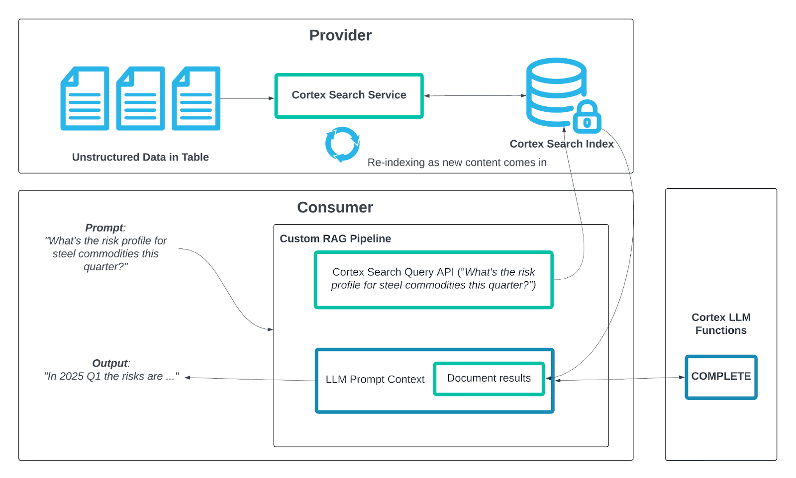

id: getting-started-with-snowflake-intelligence-and-cke
summary: This guide outlines the process for getting started with Snowflake Intelligence and Cortex Knowledge Extensions.
categories: featured,getting-started,data-science-&-ml,app-development
environments: web
status: Hidden
feedback link: <https://github.com/Snowflake-Labs/sfguides/issues>
tags: Getting Started, Data-Science-&-Ai, Featured
authors: Dash Desai

# Getting Started with Snowflake Intelligence and Cortex Knowledge Extensions
<!-- ------------------------ -->

## Overview

Duration: 4

Snowflake Intelligence offers a powerful solution for organizations to access and activate their vast data. It addresses common challenges for business users struggling to get timely answers from scattered data, and for data teams overwhelmed by ad hoc requests. By using AI agents, Snowflake Intelligence enables employees to securely talk with their data, derive deeper insights, and initiate actions, all from a unified, easy-to-use interface. This transforms how businesses operate by bridging the gap between data and actionable insights.

*NOTE: Snowflake Intelligence is in Public Preview as of August 2025.*

### What is Snowflake Intelligence? 

Snowflake Intelligence is an agentic AI solution, enabling business users to directly and securely interact with their organization's structured and unstructured data using natural language. Snowflake Intelligence provides:

* Natural language interaction: Engage with data like a trusted colleague to securely access and analyze both structured and unstructured data to uncover trends and understand the "why" behind the "what."

* Actionable intelligence: Go beyond just insights by configuring agents to perform tasks based on findings, such as sending notifications, updating records in other systems, or triggering workflows.

* Enterprise-grade security and governance: Honors existing access controls and governance, unifies information from Snowflake and third-party applications for a holistic view, and provides transparency on how answers are derived and data lineage.

### What are Cortex Knowledge Extensions?

Cortex Knowledge Extensions (CKEs) allow publishers to bring their documents (for example, news articles, market research reports, books, articles, etc.) to customers in their generative AI applications.

### Prerequisites

* Access to a [Snowflake account](https://signup.snowflake.com/) with ACCOUNTADMIN role in a region where you have access to Anthropic Claude 4, OpenAI GPT 4.1. Otherwise, you will need to enable [cross-region inference](https://docs.snowflake.com/en/user-guide/snowflake-cortex/cross-region-inference).

### What You Will Learn

How to create building blocks for creating a Snowflake Intelligence agent that can intelligently respond to questions by reasoning over data from Cortex Knowledge Extensions.

### What You Will Build

A Snowflake Intelligence agent that can intelligently respond to questions by reasoning over data from Cortex Knowledge Extensions.

<!-- ------------------------ -->
## Setup

Duration: 10

### Create database, schema, and role

* Clone [GitHub repo](https://github.com/Snowflake-Labs/sfguide-getting-started-with-snowflake-intelligence-and-cke).

* In Snowsight, [create a SQL Worksheet](https://docs.snowflake.com/en/user-guide/ui-snowsight-worksheets-gs?_fsi=THrZMtDg,%20THrZMtDg&_fsi=THrZMtDg,%20THrZMtDg#create-worksheets-from-a-sql-file) and open [setup.sql](https://github.com/Snowflake-Labs/sfguide-getting-started-with-snowflake-intelligence-and-cke/blob/main/setup.sql) to execute all statements in order from top to bottom.

> aside positive
> NOTE: Switch your user role in Snowsight to **SNOWFLAKE_INTELLIGENCE_ADMIN**.

### Cortex Knowledge Extension

* In Snowsight, on the left hand navigation menu, select **Data Products** >> **Marketplace** 
* In **Snowflake Marketplace**, search for **PubMed** 
* Click on **PubMed Biomedical Research Corpus** 
* On the top right, click on **Get** and follow instructions while keeping the default values 

### Create Agent

An agent is an intelligent entity within Snowflake Intelligence that acts on behalf of the user. Agents are configured with specific tools and orchestration logic to answer questions and perform tasks on top of your data. 

Note that you can create multiple agents for various use cases and/or business teams in your organization. 

* In Snowsight, on the left hand navigation menu, select **AI & ML** >> **Agents** 
* On the top right, click on **Create agent**
     - Schema: SNOWFLAKE_INTELLIGENCE.AGENTS
     - Select **Create this agent for Snowflake Intelligence**
     - Agent object name: PubMed_Biomedical
     - Display name: PubMed_Biomedical

### Add Tools

Tools are the capabilities an agent can use to accomplish a task. Think of them as the agent's skillset and note that you can add one or more of each of the following tools.

Select the newly created **PubMed_Biomedical** agent and click on **Edit** on the top right corner and make the following updates.

* Tools

  - **Cortex Search Services**
    - Click on **+ Add**
        - Name: PubMed_Biomedical
        - Database and Schema: **PUBMED_BIOMEDICAL_RESEARCH_CORPUS.OA_COMM**
        - Search service: **PUBMED_BIOMEDICAL_RESEARCH_CORPUS.OA_COMM.PUBMED_OA_CKE_SEARCH_SERVICE**
        - ID column: PMID
        - Title column: ARTICLE_URL
        
  - **Custom tools**
    - Click on **+ Add**
      - Name: Send_Email
      - Resource type: procedure
      - Database & Schema: **DASH_SI_CKE.DATA**
      - Custom tool identifier: **DASH_SI_CKE.DATA.SEND_EMAIL()**
      - Parameter: body
      - Parameter: recipient_email
        - Description: *If the email is not provided, send it to **YOUR_EMAIL_ADDRESS_GOES_HERE***.
      - Parameter: subject
      - Warehouse: **COMPUTE_WH**

* Orchestration: *Whenever you can answer visually with a chart, always choose to generate a chart even if the user didn't specify to.*

* Access: SNOWFLAKE_INTELLIGENCE_ADMIN

> aside positive
> NOTE: On the top right corner, click on **Save** to save the newly updated **PubMed_Biomedical** agent.

<!-- ------------------------ -->
## Snowflake Intelligence

Duration: 5

> aside negative
> PREREQUISITE: Successful completion of steps outlined under **Setup**.

In Snowsight, on the left hand navigation menu, select **AI & ML** >> **Snowflake Intelligence** and let's ask the following questions.

### Q1. *What are the molecular mechanisms linking inflammation to insulin resistance in type 2 diabetes?*

___

### Q2. *What are the most effective interventions for preventing hospital-acquired infections in ICU settings?*

___

### Q3. *What lifestyle factors most strongly influence disease progression in multiple sclerosis?*

___

### Q4. *What are emerging drug targets for treating KRAS-mutant cancers?*

___

### Q5. *Send a summary email*

NOTE: Check your inbox to see the summary email that would have been sent to the email address set it **AI & ML** >> **Agents** >> **PubMed_Biomedical** >> **Custom tools** >> **Send_Email** >> **recipient_email** >> **Description**: "If the email is not provided, send it to YOUR_EMAIL_ADDRESS_GOES_HERE".

___

### Other Questions

Visit [PubMed Biomedical Research Corpus](https://app.snowflake.com/marketplace/listing/GZSTZ67BY9OQW/snowflake-pubmed-biomedical-research-corpus) in the Snowflake Marketplace to explore the data.

<!-- ------------------------ -->
## Conclusion And Resources

Duration: 1

Congratulations! You've successfully created a Snowflake Intelligence agent that can intelligently respond to questions by reasoning over the data from Cortex Knowledge Extensions.

### What You Learned

You've learned how to create building blocks for creating a Snowflake Intelligence agent that can intelligently respond to questions by reasoning over the data from Cortex Knowledge Extensions.

### Related Resources

- [GitHub Repo](https://github.com/Snowflake-Labs/sfguide-getting-started-with-snowflake-intelligence-and-cke)
- [CKE in Snowflake Marketplace](https://app.snowflake.com/marketplace/data-products?sortBy=popular&categorySecondary=%5B%2226%22%5D)
- [Snowflake Intelligence Documentation](https://docs.snowflake.com/user-guide/snowflake-cortex/snowflake-intelligence)

