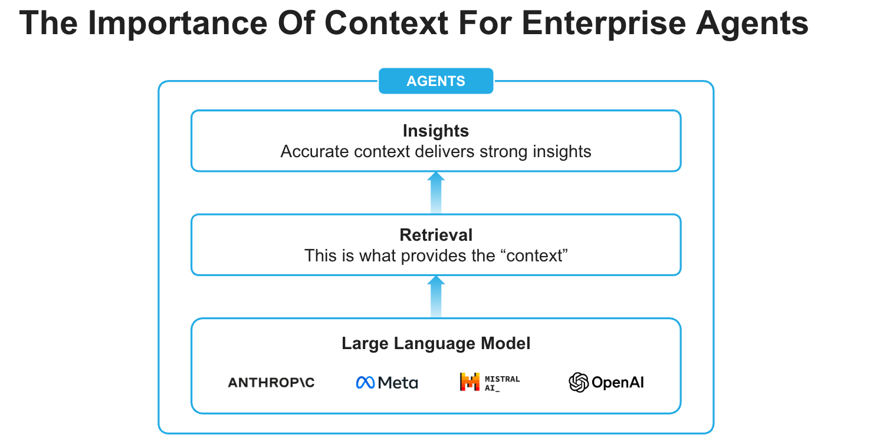
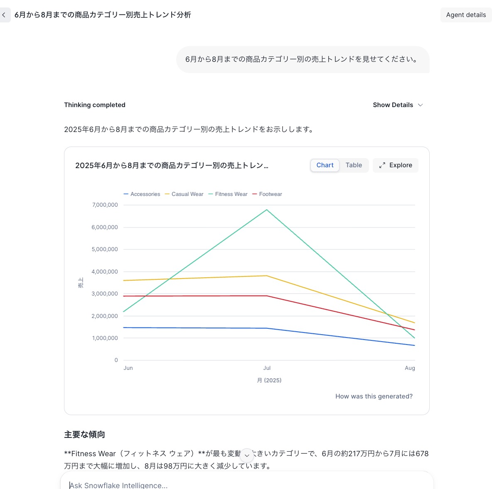
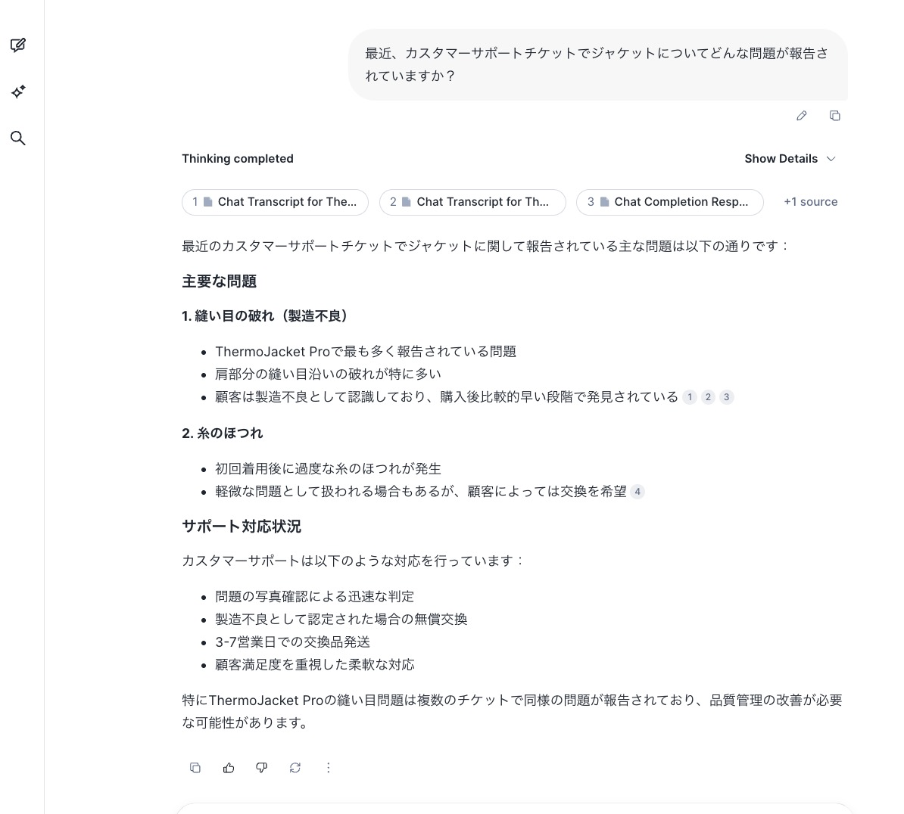
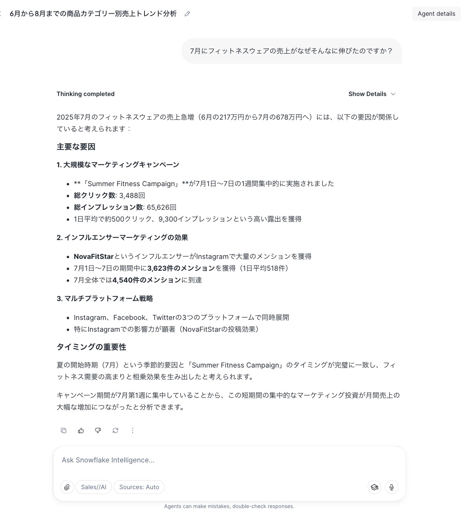

author: Sho Tanaka, Dash Desai
id: getting-started-with-snowflake-intelligence-ja
categories: snowflake-site:taxonomy/solution-center/certification/quickstart, snowflake-site:taxonomy/product/platform, snowflake-site:taxonomy/product/ai, snowflake-site:taxonomy/snowflake-feature/snowflake-intelligence
language: ja
summary: このガイドでは、Snowflake Intelligence の導入方法について説明します。
environments: web
status: Published
feedback link: <https://github.com/Snowflake-Labs/sfguides/issues>
open in snowflake link: https://app.snowflake.com/templates?template=get_started_with_snowflake_intelligence_ja&utm_source=build&utm_medium=templates&utm_campaign=guides&utm_content=nov25


# はじめての Snowflake Intelligence

## Overview


Snowflake Intelligenceは、エンジニアだけではなく、ビジネスユーザーを含めたすべてのユーザーが自然言語で複雑な質問に答えられる、エンタープライズ向けのインテリジェンスエージェントです。あらゆるユーザーが手軽にインサイトを得ることができ、たった1つの質問で、ビジネスデータ全体にわたる包括的な洞察を獲得できます。「何が起きているか」という事実だけでなく、重要な「なぜそうなったのか」という理由にまで踏み込み、ユーザーのAIのパートナーとして、従来は困難で時間のかかっていたビジネス課題の深い調査を支援し、解決策を提案します。

Snowflake Intelligenceは、インサイト獲得への障壁を取り除き、ユーザーがデータの相互関係を理解し、インパクトのあるビジネス意思決定に必要なデータへの共通理解に基づいて仮説を検証できるようにします。


### Snowflake Intelligence とは？ 

Snowflake Intelligence は、思考パートナーとして、すべてのデータに対して複雑な質問を投げかけ、分析し、即座にインサイトを得ることを可能にします。
- **深い分析、迅速な行動：** 「何が起きているか」だけでなく、重要な「なぜそうなったのか」を素早く理解し、自然言語を使ってサードパーティのデータソースや市場インテリジェンスを含むすべてのデータを分析・推論するAIエージェントによって、行動を加速します。
- **検証済みで信頼できる回答：** すべての回答をその情報源まで遡ることができます。検証済みの回答のために「質問を体系化できます。
- **エンタープライズ対応：** Snowflake Intelligence は、エンタープライズのデータとアプリケーションの複雑性に対応してスケールし、すべてがSnowflakeのセキュアな境界内で、同じ堅牢なガバナンスポリシーの下で運用されることを知り、安心してご利用いただけます。




### 実際の使用例

Snowflake Intelligence は、さまざまなビジネスユースケースにおいて、データドリブンな意思決定を効率化します：

* **営業パフォーマンス分析：** 営業マネージャーは「先四半期の西部地域での売上トップ商品は何で、なぜ商品Xが商品Yを上回ったのか？」といった複雑な質問に素早く回答を得ることができます。また、アナリストは多様なデータソースを横断して推論することで、「なぜサポートチケットが増加しているのか？」といった重要なトレンドを理解できます。

* **強化されたリサーチと財務インサイト：** Cortex Knowledge Extensionsを介して外部ソースで内部データを充実させることで、金融アナリストはポートフォリオのパフォーマンスと市場ニュースを組み合わせたり、プロダクトマネージャーは顧客フィードバックを業界レポートと並べて分析し、より深いコンテキストを得ることができます。

* **セルフサービスのデータ探索：** すべてのビジネスユーザーが独立してデータを探索し、複雑な質問に即座に回答を得られるようにすることで、データチームへの依存を減らし、組織全体での意思決定を加速します。

### 前提条件

* [Git](https://git-scm.com/book/en/v2/Getting-Started-Installing-Git) がインストールされていること

* [サポートされているモデル](https://docs.snowflake.com/en/user-guide/snowflake-cortex/snowflake-intelligence#supported-models-and-regions)にアクセスできるリージョンで、ACCOUNTADMIN ロールを持つ [Snowflake アカウント](https://signup.snowflake.com/?utm_source=snowflake-devrel&utm_medium=developer-guides&utm_cta=developer-guides)へのアクセス権があること。それ以外の場合は、[クロスリージョン推論](https://docs.snowflake.com/en/user-guide/snowflake-cortex/cross-region-inference/?utm_source=snowflake-devrel&utm_medium=developer-guides)を有効にする必要があります。

### この QuickStart で学べること

Snowflake Intelligence の構成要素（エージェント）を作成する方法を学びます。

### 構築するもの

構造化データと非構造化データの両方を推論することで質問に回答できる、エンタープライズ インテリジェンス エージェント - Snowflake Intelligence - を構築します。

<!-- ------------------------ -->
## セットアップ


### データベース、スキーマ、テーブルの作成とAWS S3からのデータのロード

* [GitHub リポジトリ](https://github.com/Snowflake-Labs/sfguide-getting-started-with-snowflake-intelligence-ja)をクローンします。

* Snowsight で、[SQL ワークシートを作成](https://docs.snowflake.com/en/user-guide/ui-snowsight-worksheets-gs?_fsi=THrZMtDg,%20THrZMtDg&_fsi=THrZMtDg,%20THrZMtDg#create-worksheets-from-a-sql-file)し、[setup.sql](https://github.com/Snowflake-Labs/sfguide-getting-started-with-snowflake-intelligence-ja/blob/main/setup.sql) を開いて、すべてのステートメントを上から順に実行します。


> 注意: 上記 SQL 実行後、Snowsight でユーザーロールを **SNOWFLAKE_INTELLIGENCE_ADMIN** に切り替えてください。

### Cortex Analyst (分析)

このツールは、SQL を生成することで、エージェントが Snowflake 内の構造化データをクエリできるようにします。これは、ビジネスコンセプト（例：「商品名」、「売上」）と Snowflake アカウント内の基盤となるテーブルやカラムとの間のマッピングであるセマンティックビューに依存しています。この抽象化により、テーブルが複雑または任意の命名規則を持っている場合でも、LLM がデータを効果的にクエリする方法を理解できるようになります。

* Snowsight の左側のナビゲーションメニューで、<a href="https://app.snowflake.com/_deeplink/#/cortex/analyst?utm_source=snowflake-devrel&utm_medium=developer-guides&utm_campaign=-us-en-all&utm_content=app-getting-started-with-si&utm_cta=developer-guides-deeplink" class="_deeplink">**AI と ML** >> **アナリスト**</a> を選択します
* 右上の **新規作成** のドロップダウン矢印をクリックし、**YAML ファイルをアップロード** を選択します
* [marketing_campaigns.yaml](https://github.com/Snowflake-Labs/sfguide-getting-started-with-snowflake-intelligence-ja/blob/main/marketing_campaigns.yaml) をアップロード | データベース、スキーマ、ステージを選択: **DB_SI_JP.RETAIL** >> **SEMANTIC_MODELS** 
* 右上の **アップロード** をクリックします 

### Cortex Search (検索)

このツールは、カスタマーサポートチケット、Slack の会話、契約書などの非構造化テキストデータから情報を検索・取得することをエージェントに可能にします。Cortex Search を活用してこれらのテキスト「チャンク」をインデックス化しクエリすることで、エージェントは[Retrieval Augmented Generation](https://www.snowflake.com/en/fundamentals/rag/)（RAG）を実行できます。

* Snowsight の左側のナビゲーションメニューで、<a href="https://app.snowflake.com/_deeplink/#/cortex/search?utm_source=snowflake-devrel&utm_medium=developer-guides&utm_campaign=-us-en-all&utm_content=app-getting-started-with-si&utm_cta=developer-guides-deeplink" class="_deeplink">**AI と ML** >> **検索**</a> を選択します
* 右上の **作成** をクリックします
    - サービスデータベースとスキーマ: **DB_SI_JP.RETAIL**
    - サービス名: Support_Cases
    - インデックスを作成するデータを選択: SUPPORT_CASES テーブルを選択
    - 検索列を選択: TRANSCRIPT を選択
    - 属性列を選択: TITLE、PRODUCT を選択 
    - サービスに含む列を選択: すべて選択
    - インデックス作成用のウェアハウス: **WH_SI_JP**
    - 他はデフォルトで問題なし

#### オプション: Cortex AISQL を使用したサポートケースの活用

個々のサポートケースに対して Cortex Search サービスを作成する代わりに、集約されたサポートケースに対してサービスを作成することもできます。これは、個々のチケットの詳細ではなく、ハイレベルなトレンドに基づいてエージェントに質問に答えてもらいたい場合に最適です。実際にはユースケース次第ですが、ここでは Cortex AISQL を使用した例として示します。

以下の SQL ステートメントを実行します。これらは [AI_AGG()](https://docs.snowflake.com/en/sql-reference/functions/ai_agg/) を使用して集約されたサポートケースのサマリーを作成し、新しいテーブル **AGGREGATED_SUPPORT_CASES_SUMMARY** に挿入します。その後、そのテーブルに対して Cortex Search サービスが作成されます。

```sql
-- Use AI_AGG to aggregate support cases summary and insert into a new table AGGREGATED_SUPPORT_CASES_SUMMARY

use database DB_SI_JP;
use schema RETAIL;

create or replace table AGGREGATED_SUPPORT_CASES_SUMMARY as
 select 
    ai_agg(transcript,'Read and analyze all support cases to provide a long-form text summary in no less than 5000 words.') as summary
    from support_cases;

-- Create Cortex Search service on table AGGREGATED_SUPPORT_CASES_SUMMARY

create or replace cortex search service AGGREGATED_SUPPORT_CASES 
on summary 
attributes
  summary 
warehouse = WH_SI_JP 
embedding_model = 'snowflake-arctic-embed-m-v1.5' 
target_lag = '1 hour' 
initialize=on_schedule 
as (
  select
    summary
  from AGGREGATED_SUPPORT_CASES_SUMMARY
);
```
> 注意: これらの SQL ステートメントの実行には 3〜5 分かかる場合があります。


### Agent の作成

エージェントは、Snowflake Intelligence 内のインテリジェントなエンティティで、ユーザーの代わりに動作します。エージェントは、特定のツールとオーケストレーションロジックで構成され、データに基づいて質問に答えたりタスクを実行したりします。

組織内のさまざまなユースケースやビジネスチームに対して、複数のエージェントを作成できることに注意してください。

* Snowsight の左側のナビゲーションメニューで、<a href="https://app.snowflake.com/_deeplink/#/agents?utm_source=snowflake-devrel&utm_medium=developer-guides&utm_campaign=-us-en-all&utm_content=app-getting-started-with-si&utm_cta=developer-guides-deeplink" class="_deeplink">**AI と ML** >> **エージェント**</a> を選択します
* 右上の **エージェントを作成** をクリックします
     - Schema: **SNOWFLAKE_INTELLIGENCE.AGENTS**
     - Agent object name: Sales_AI
     - Display name: Sales//AI
* 新しく作成された **Sales_AI** エージェントを選択し、右上の **編集** をクリックして、以下の更新を行います。

### Instructions (指示) の追加

**質問の例** に以下のスターター質問を追加します：

- 6月から8月までの商品カテゴリー別の売上トレンドを見せてください
- 最近、カスタマーサポートチケットでジャケットについてどんな問題が報告されていますか？
- 7月にフィットネスウェアの売上がなぜそんなに伸びたのですか？

### ツール (Tools) の追加

ツール (Tools) は、Agent がタスクを達成するために使用できる機能です。これらを Agent のスキルセットと考えてください。以下の各ツールを1つ以上追加できます。

* Tools
  - **Cortex アナリスト**
    - **+ 追加** をクリック
        - セマンティックモデルのファイルを選択: **DB_SI_JP.RETAIL.SEMANTIC_MODELS** >> **marketing_campaigns.yaml**
        - Name: Sales_And_Marketing_Data

        - Description: *DB_SI_JP.RETAIL スキーマの Sales and Marketing Data モデルは、マーケティングキャンペーン、商品情報、売上データ、ソーシャルメディアエンゲージメントを接続することで、小売ビジネスのパフォーマンスの全体像を提供します。このモデルは、クリックとインプレッションを通じてマーケティングキャンペーンの効果を追跡することを可能にし、異なる地域の実際の売上パフォーマンスとリンクします。ソーシャルメディアエンゲージメントは、インフルエンサーの活動とメンションを通じて監視され、すべてのデータは商品カテゴリーとIDを通じて接続されます。テーブル間の時間的な整合性により、時間経過に伴うマーケティングの売上パフォーマンスとソーシャルメディアエンゲージメントへの影響を包括的に分析できます。*

        - Warehouse: **WH_SI_JP**
        - Query timeout (seconds): 60

  - **Cortex Search Services**
    - **+ 追加** をクリック

        - Search service: **DB_SI_JP.RETAIL** >> **Support_Cases**
        - ID 列: ID
        - タイトル列: TITLE
        - 名前: Support_Cases

    >  注意: オプションで AGGREGATED_SUPPORT_CASES Cortex Search サービスを作成した場合は、ここに追加することもできます。

  - **カスタムツール**
    - **+ 追加** をクリック

      - リソースタイプ: procedure
      - データベースとスキーマ: **DB_SI_JP.RETAIL**
      - カスタムツール識別子: **DB_SI_JP.RETAIL.SEND_EMAIL()**
      - 名前: Send_Email
      - ウェアハウス: **WH_SI_JP**
      - パラメーター: body
        - 説明: *これには HTML 構文を使用してください。取得したコンテンツが Markdown の場合は、HTML に変換してください。body が提供されていない場合は、最後の質問を要約し、それをメールのコンテンツとして使用してください。*
      - パラメーター: recipient_email
        - 説明: *メールアドレスが提供されていない場合は、現在のユーザーのメールアドレスに送信してください。*
      - パラメーター: subject
        - 説明: *件名が提供されていない場合は、"Snowflake Intelligence" を使用してください。*
      

* Orchestration Instructions: *グラフで視覚的に回答できる場合は、ユーザーが指定していなくても、常にグラフを生成することを選択してください。*

* Access: SNOWFLAKE_INTELLIGENCE_ADMIN


> 注意: 右上の **追加** をクリックして、新しく更新された **Sales_AI** エージェントを保存してください。

<!-- ------------------------ -->
## Snowflake Intelligence


> 前提条件: **セットアップ** で説明されている手順が正常に完了していること。

<a href="https://ai.snowflake.com/_deeplink/#/ai?utm_source=snowflake-devrel&utm_medium=developer-guides&utm_campaign=-us-en-all&utm_content=app-getting-started-with-si&utm_cta=developer-guides-deeplink" class="_deeplink">Snowflake Intelligence</a> を開き、正しいアカウントにサインインしていることを確認してください。不明な場合は、左下の名前をクリック >> **Sign out** をクリックしてサインアウトし、再度サインインしてください。また、ロールが **SNOWFLAKE_INTELLIGENCE_ADMIN** に設定され、ウェアハウスが **WH_SI_JP** に設定され、エージェントが Sales//AI に設定されていることを確認してください。

それでは、以下の質問をしてみましょう。

### Q1. *6月から8月までの商品カテゴリー別の売上トレンドを見せてください。*



___

### Q2. *最近、カスタマーサポートチケットでジャケットについてどんな問題が報告されていますか？*



___

### Q3. *7月にフィットネスウェアの売上がなぜそんなに伸びたのですか？*



### Q4. *要約メールを送信してください*

*注意: 現在のユーザーのメールアドレスに送信された要約メールを受信トレイで確認してください。*
___

### その他の質問
エージェントは、さまざまなタイプのデータを組み合わせた多様な複雑なクエリを処理するように構成されています。エージェントをさらにテストするには、以下の例を試してみてください：

以下は、他に質問できる内容です。

#### *ソーシャルメディアで最もパフォーマンスが良い商品カテゴリーはどれですか？*

#### *ソーシャルメディアのメンションと売上の関係はどのようなものですか？*

#### *異なる地域はマーケティングキャンペーンにどのように反応していますか？*

<!-- ------------------------ -->
## まとめと参考情報


おめでとうございます！構造化データと非構造化データの両方を推論することで質問に回答できる、エンタープライズ Intelligence Agent - Snowflake Intelligence - の構築に成功しました。

### 学んだこと

Snowflake Intelligence の基本的な構成要素の作成方法を学びました。このエージェントは現在、単一のチャットインターフェースから分析と自動化されたタスクを組み合わせることができる強力な資産となっています。

### 関連リソース

- [GitHub リポジトリ](https://github.com/Snowflake-Labs/sfguide-getting-started-with-snowflake-intelligence-ja)
- [翻訳元 GitHub リポジトリ](https://github.com/Snowflake-Labs/sfguide-getting-started-with-snowflake-intelligence)
- [Snowflake Intelligence ドキュメント](https://docs.snowflake.com/user-guide/snowflake-cortex/snowflake-intelligence)


