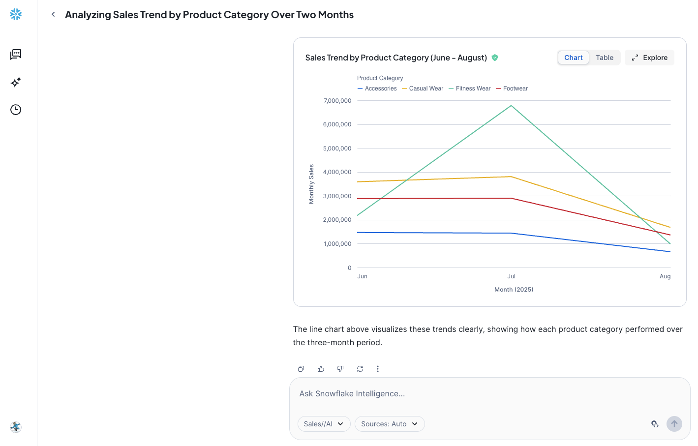
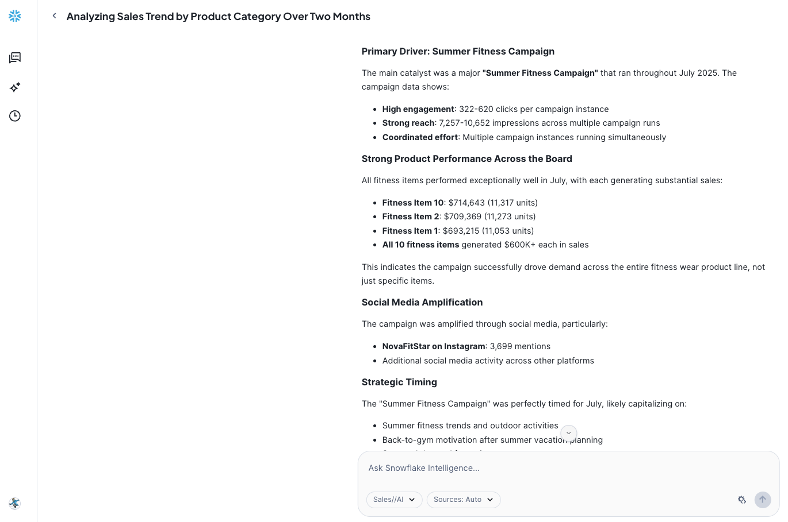

id: getting-started-with-snowflake-intelligence
summary: This guide outlines the process for getting started with Snowflake Intelligence.
categories: featured,getting-started,data-science-&-ml,app-development
environments: web
status: Published
feedback link: <https://github.com/Snowflake-Labs/sfguides/issues>
tags: Getting Started, Data-Science-&-Ai, Featured
authors: Dash Desai

# Getting Started with Snowflake Intelligence
<!-- ------------------------ -->

## Overview

Duration: 4

Snowflake Intelligence offers a powerful solution for organizations to access and activate their vast data. It addresses common challenges for business users struggling to get timely answers from scattered data, and for data teams overwhelmed by ad hoc requests. By using AI agents, Snowflake Intelligence enables employees to securely talk with their data, derive deeper insights, and initiate actions, all from a unified, easy-to-use interface. This transforms how businesses operate by bridging the gap between data and actionable insights.

*NOTE: Snowflake Intelligence is in Public Preview as of July 2025.*

### What is Snowflake Intelligence? 

Snowflake Intelligence is an agentic AI solution, enabling business users to directly and securely interact with their organization's structured and unstructured data using natural language. Snowflake Intelligence provides:

* Natural language interaction: Engage with data like a trusted colleague to securely access and analyze both structured and unstructured data to uncover trends and understand the "why" behind the "what."

* Actionable intelligence: Go beyond just insights by configuring agents to perform tasks based on findings, such as sending notifications, updating records in other systems, or triggering workflows.

* Enterprise-grade security and governance: Honors existing access controls and governance, unifies information from Snowflake and third-party applications for a holistic view, and provides transparency on how answers are derived and data lineage.

### Use Cases

Snowflake Intelligence streamlines data-driven decision-making across various business use cases:

* Sales performance analysis: Sales managers can quickly get answers to complex questions like "What were my top product sales in the West region last quarter, and why did product X outperform product Y?" while analysts can understand critical trends like "Why are support tickets increasing?" by reasoning across diverse data sources.

* Enhanced research & financial insights: Enrich internal data with external sources via Cortex Knowledge Extensions, allowing financial analysts to combine portfolio performance with market news, or product managers to analyze customer feedback alongside industry reports for deeper context.

* Self-service data exploration: Enable all business users to independently explore data and get immediate answers to complex questions, reducing reliance on data teams and accelerating decisions across the organization.

### Prerequisites

* Access to a [Snowflake account](https://signup.snowflake.com/) with ACCOUNTADMIN role in a region where you have access to Anthropic Claude 4, OpenAI GPT 4.1. Otherwise, you will need to enable [cross-region inference](https://docs.snowflake.com/en/user-guide/snowflake-cortex/cross-region-inference).

### What You Will Learn

How to create building blocks for creating a Snowflake Intelligence agent that can intelligently respond to questions by reasoning over both structured and unstructured data.

### What You Will Build

A Snowflake Intelligence agent that can intelligently respond to questions by reasoning over both structured and unstructured data.

<!-- ------------------------ -->
## Setup

Duration: 20 

### Create database, schema, tables and load data from AWS S3

* Clone [GitHub repo](https://github.com/Snowflake-Labs/sfguide-getting-started-with-snowflake-intelligence).

* In Snowsight, [create a SQL Worksheet](https://docs.snowflake.com/en/user-guide/ui-snowsight-worksheets-gs?_fsi=THrZMtDg,%20THrZMtDg&_fsi=THrZMtDg,%20THrZMtDg#create-worksheets-from-a-sql-file) and open [setup.sql](https://github.com/Snowflake-Labs/sfguide-getting-started-with-snowflake-intelligence/blob/main/setup.sql) to execute all statements in order from top to bottom.

> aside positive
> NOTE: Switch your user role in Snowsight to **SNOWFLAKE_INTELLIGENCE_ADMIN**.

### Cortex Analyst

This tool enables the agent to query structured data in Snowflake by generating SQL. It relies on semantic views, which are mappings between business concepts (e.g., "product name," "sales") and the underlying tables and columns in your Snowflake account. This abstraction helps the LLM understand how to query your data effectively, even if your tables have complex or arbitrary naming conventions.

* In Snowsight, on the left hand navigation menu, select **AI & ML** >> **Cortex Analyst** 
* On the top right, click on **Create new model** down arrow and select **Upload your YAML file** 
* Upload [marketing_campaigns.yaml](https://github.com/Snowflake-Labs/sfguide-getting-started-with-snowflake-intelligence/blob/main/marketing_campaigns.yaml) to **DASH_DB_SI.RETAIL** >> **SEMANTIC_MODELS** to create "Sales And Marketing Data" semantic model 
* On the top right, click on **Save** 

### Cortex Search

This tool allows the agent to search and retrieve information from unstructured text data, such as customer support tickets, Slack conversations, or contracts. It leverages Cortex Search to index and query these text "chunks," enabling the agent to perform Retrieval Augmented Generation (RAG).

* In Snowsight, on the left hand navigation menu, select **AI & ML** >> **Cortex Search** 
* On the top right, click on **Create**
    - Role and Warehouse: SNOWFLAKE_INTELLIGENCE_ADMIN | COMPUTE_WH
    - Database and Schema: DASH_DB_SI.RETAIL
    - Name: Support_Cases
    - Select data to be indexed: SUPPORT_CASES 
    - Select a search column: TRANSCRIPT
    - Select attribute column(s): TITLE, PRODUCT 
    - Select columns to include in the service: Select all
    - Configure your Search Service: *Keep default values*

### Create Agent

An agent is an intelligent entity within Snowflake Intelligence that acts on behalf of the user. Agents are configured with specific tools and orchestration logic to answer questions and perform tasks on top of your data. 

Note that you can create multiple agents for various use cases and/or business teams in your organization. 

* In Snowsight, on the left hand navigation menu, select **AI & ML** >> **Agents** 
* On the top right, click on **Create agent**
     - Schema: SNOWFLAKE_INTELLIGENCE.AGENTS
     - Select **Create this agent for Snowflake Intelligence**
     - Agent object name: Sales_AI
     - Display name: Sales//AI

### Edit Agent

Select the newly created **Sales_AI** agent and click on **Edit** on the top right corner and make the following updates.

Tools are the capabilities an agent can use to accomplish a task. Think of them as the agent's skillset and note that you can add one or more of each of the following tools.

* Tools
  - **Cortex Analyst**
    - Click on **+ Add**
        - Name: Sales And Marketing Data
        - Add: Semantic model file **DASH_DB_SI.RETAIL.SEMANTIC_MODELS** >> **marketing_campaigns.yaml**
        - Warehouse: DASH_WH_SI
        - Query timeout (seconds): 60
        - Description: *The Sales and Marketing Data model in DASH_DB_SI.RETAIL schema provides a complete view of retail business performance by connecting marketing campaigns, product information, sales data, and social media engagement. The model enables tracking of marketing campaign effectiveness through clicks and impressions, while linking to actual sales performance across different regions. Social media engagement is monitored through influencer activities and mentions, with all data connected through product categories and IDs. The temporal alignment across tables allows for comprehensive analysis of marketing impact on sales performance and social media engagement over time.*
  - **Cortex Search Services**
    - Click on **+ Add**
        - Name: Support Cases
        - Search service: **DASH_DB_SI.RETAIL** >> **Support_Cases**
        - ID column: ID
        - Title column: TITLE

* Orchestration: *Whenever you can answer visually with a chart, always choose to generate a chart even if the user didn't specify to.*

* Access: SNOWFLAKE_INTELLIGENCE_ADMIN

> aside positive
> NOTE: On the top right corner, click on **Save** to save the newly updated **Sales_AI** agent.

<!-- ------------------------ -->
## Snowflake Intelligence

Duration: 5

> aside negative
> PREREQUISITE: Successful completion of steps outlined under **Setup**.

In Snowsight, on the left hand navigation menu, select **AI & ML** >> **Snowflake Intelligence** and let's ask the following questions.

### Q1. *Show me the trend of sales by product category between June and August*

___

### Q2. *What issues are reported with jackets recently in customer support tickets?*

___

### Q3. *Why did sales of Fitness Wear grow so much in July?*

___

### Sample Questions

Here are some other questions you may ask.

#### * *Which product categories perform best on social media?*

#### * *What's the relationship between social media mentions and sales?*

#### * *How do different regions respond to marketing campaigns?*

<!-- ------------------------ -->
## Conclusion And Resources

Duration: 1

Congratulations! You've successfully created a Snowflake Intelligence agent that can intelligently respond to questions by reasoning over both structured and unstructured data

### What You Learned

You've learned how to create building blocks for creating a Snowflake Intelligence agent that can intelligently respond to questions by reasoning over both structured and unstructured data.

### Related Resources

- [GitHub Repo](https://github.com/Snowflake-Labs/sfguide-getting-started-with-snowflake-intelligence)

