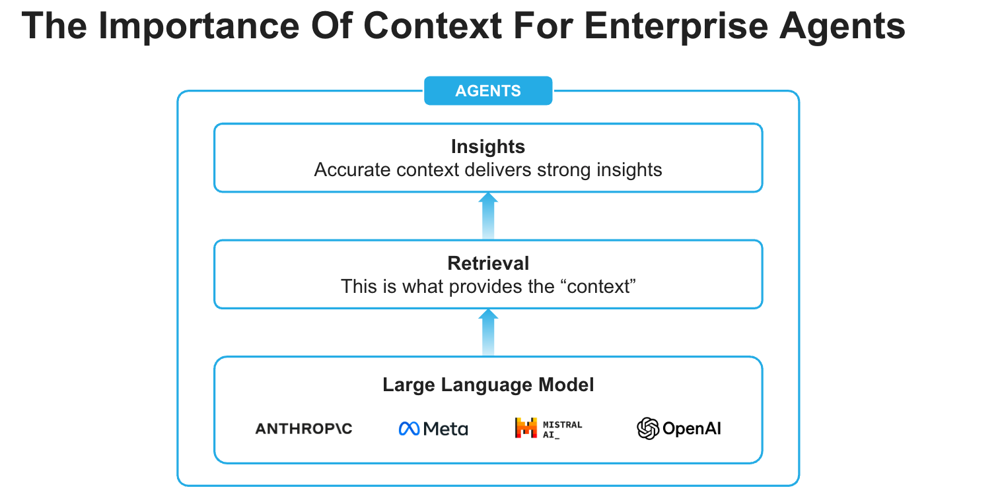
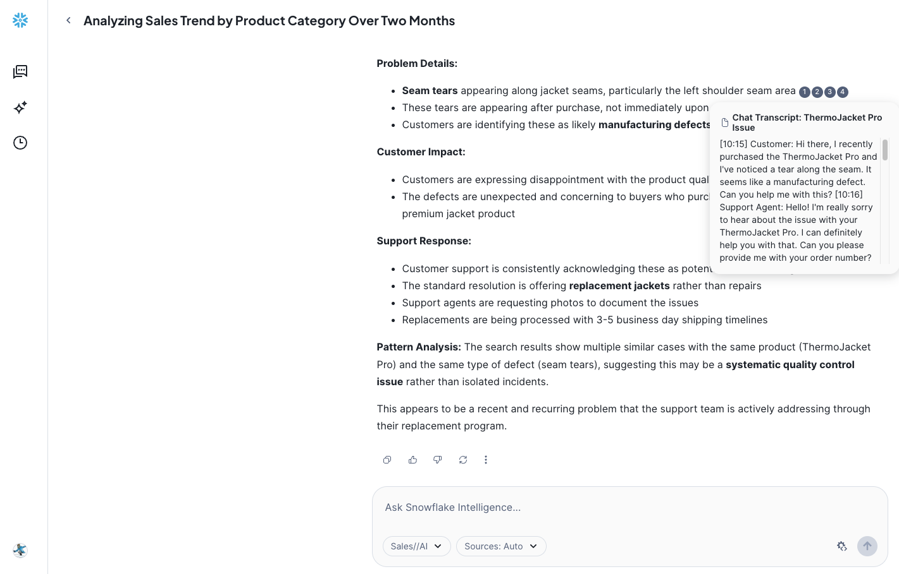

id: getting-started-with-snowflake-intelligence
categories: snowflake-site:taxonomy/solution-center/certification/quickstart, snowflake-site:taxonomy/product/platform
language: en
summary: This guide outlines the process for getting started with Snowflake Intelligence. 
environments: web
status: Published
feedback link: <https://github.com/Snowflake-Labs/sfguides/issues>
authors: Dash Desai
open in snowflake link: https://app.snowflake.com/templates?template=get_started_with_snowflake_intelligence&utm_source=build&utm_medium=templates&utm_campaign=guides&utm_content=nov25


# Getting Started with Snowflake Intelligence

## Overview


Snowflake Intelligence is an Enterprise Intelligence Agent that provides every user with the ability to answer complex questions in natural language, and puts insights at every user’s fingertips. With a single question, you can get comprehensive insights across your business data. It moves beyond the “what” to the critical “why” with an always-available thought partner at their fingertips that can facilitate deep research and suggest solutions to previously difficult and time-consuming business problems.

Snowflake Intelligence removes the barriers to insights, enabling users to understand the cross-sections of their data and test assumptions with a shared understanding of the data needed to make impactful business decisions.


### What is Snowflake Intelligence? 

Ask complex questions of all your data, analyze and get insights instantly with Snowflake Intelligence as your always-on thought partner.
- **Deep analysis, quick action:** Go beyond the “what” to quickly understand the critical “why,” accelerating action with AI agents that use natural language to analyze and reason across all your data, including third-party sources and market intelligence.
- **Verified, trusted answers:** Trace every answer to its source. Codify "golden" questions for verified answers.
- **Enterprise-ready:** Maintain peace of mind knowing that Snowflake Intelligence scales with your enterprise data and application complexity — all within Snowflake’s secure perimeter and with the same robust governance policies.




### Use Cases

Snowflake Intelligence streamlines data-driven decision-making across various business use cases:

* **Sales performance analysis:** Sales managers can quickly get answers to complex questions like "What were my top product sales in the West region last quarter, and why did product X outperform product Y?" while analysts can understand critical trends like "Why are support tickets increasing?" by reasoning across diverse data sources.

* **Enhanced research & financial insights:** Enrich internal data with external sources via Cortex Knowledge Extensions, allowing financial analysts to combine portfolio performance with market news, or product managers to analyze customer feedback alongside industry reports for deeper context.

* **Self-service data exploration:** Enable all business users to independently explore data and get immediate answers to complex questions, reducing reliance on data teams and accelerating decisions across the organization.

### Prerequisites

* [Git](https://git-scm.com/book/en/v2/Getting-Started-Installing-Git) installed

* Access to a [Snowflake account](https://signup.snowflake.com/?utm_source=snowflake-devrel&utm_medium=developer-guides&utm_cta=developer-guides) with the ACCOUNTADMIN role in a region where you have access to the [supported models](https://docs.snowflake.com/en/user-guide/snowflake-cortex/snowflake-intelligence#supported-models-and-regions). Otherwise, you will need to enable [cross-region inference](https://docs.snowflake.com/en/user-guide/snowflake-cortex/cross-region-inference/?utm_source=snowflake-devrel&utm_medium=developer-guides).

### What You Will Learn

How to create the building blocks (agents) for Snowflake Intelligence.

### What You Will Build

An Enterprise Intelligence Agent - Snowflake Intelligence - that can respond to questions by reasoning over both structured and unstructured data.

<!-- ------------------------ -->
## Setup


### Create database, schema, tables and load data from AWS S3

* Clone [GitHub repository](https://github.com/Snowflake-Labs/sfguide-getting-started-with-snowflake-intelligence).

* In Snowsight, [create a SQL Worksheet](https://docs.snowflake.com/en/user-guide/ui-snowsight-worksheets-gs?_fsi=THrZMtDg,%20THrZMtDg&_fsi=THrZMtDg,%20THrZMtDg#create-worksheets-from-a-sql-file) and open [setup.sql](https://github.com/Snowflake-Labs/sfguide-getting-started-with-snowflake-intelligence/blob/main/setup.sql) to execute all statements in order from top to bottom.


> NOTE: Switch your user role in Snowsight to **SNOWFLAKE_INTELLIGENCE_ADMIN**.

### Cortex Analyst

This tool enables the agent to query structured data in Snowflake by generating SQL. It relies on semantic views, which are mappings between business concepts (e.g., "product name," "sales") and the underlying tables and columns in your Snowflake account. This abstraction helps the LLM understand how to query your data effectively, even if your tables have complex or arbitrary naming conventions.

* In Snowsight, on the left hand navigation menu, select <a href="https://app.snowflake.com/_deeplink/#/cortex/analyst?utm_source=snowflake-devrel&utm_medium=developer-guides&utm_campaign=-us-en-all&utm_content=app-getting-started-with-si&utm_cta=developer-guides-deeplink" class="_deeplink">**AI & ML** >> **Cortex Analyst**</a>
* On the top right, click on **Create new** down arrow and select **Upload your YAML file** 
* Upload [marketing_campaigns.yaml](https://github.com/Snowflake-Labs/sfguide-getting-started-with-snowflake-intelligence/blob/main/marketing_campaigns.yaml) | Select database, schema, and stage: **DASH_DB_SI.RETAIL** >> **SEMANTIC_MODELS** 
* On the top right, click on **Save** 

### Cortex Search

This tool allows the agent to search and retrieve information from unstructured text data, such as customer support tickets, Slack conversations, or contracts. It leverages Cortex Search to index and query these text "chunks," enabling the agent to perform [Retrieval Augmented Generation](https://www.snowflake.com/en/fundamentals/rag/) (RAG).

* In Snowsight, on the left hand navigation menu, select <a href="https://app.snowflake.com/_deeplink/#/cortex/search?utm_source=snowflake-devrel&utm_medium=developer-guides&utm_campaign=-us-en-all&utm_content=app-getting-started-with-si&utm_cta=developer-guides-deeplink" class="_deeplink">**AI & ML** >> **Cortex Search**</a> 
* On the top right, click on **Create**
    - Role and Warehouse: **SNOWFLAKE_INTELLIGENCE_ADMIN** | **DASH_WH_SI**
    - Database and Schema: **DASH_DB_SI.RETAIL**
    - Name: Support_Cases
    - Select data to be indexed: select SUPPORT_CASES table
    - Select a search column: select TRANSCRIPT
    - Select attribute column(s): select TITLE, PRODUCT 
    - Select columns to include in the service: Select all
    - Configure your Search Service: Keep default values **except** select **DASH_WH_SI** for "Warehouse for indexing" (Choose COMPUTE_WH if DASH_WH_SI is not available)

#### OPTIONAL: Aggregated Support Cases using Cortex AISQL

Instead of creating a Cortex Search service for individual support cases, you may create one on aggregated support cases. This is ideal if you want the Agent to answer questions based on high-level trends rather than individual ticket details. It really depends on your use case, but it's shown here as an example using Cortex AISQL.

Execute the following SQL statements that use [AI_AGG()](https://docs.snowflake.com/en/sql-reference/functions/ai_agg/) to create aggregated support cases summary which is inserted into a new table **AGGREGATED_SUPPORT_CASES_SUMMARY**. Then, a Cortex Search service is created on that table.

```sql
-- Use AI_AGG to aggregate support cases summary and insert into a new table AGGREGATED_SUPPORT_CASES_SUMMARY

use database DASH_DB_SI;
use schema RETAIL;

create or replace table AGGREGATED_SUPPORT_CASES_SUMMARY as
 select 
    ai_agg(transcript,'Read and analyze all support cases to provide a long-form text summary in no less than 5000 words.') as summary
    from support_cases;

-- Create Cortex Search service on table AGGREGATED_SUPPORT_CASES_SUMMARY

create or replace cortex search service AGGREGATED_SUPPORT_CASES 
on summary 
attributes
  summary 
warehouse = dash_wh_si 
embedding_model = 'snowflake-arctic-embed-m-v1.5' 
target_lag = '1 hour' 
initialize=on_schedule 
as (
  select
    summary
  from AGGREGATED_SUPPORT_CASES_SUMMARY
);
```
> NOTE: These SQL statements may take 3-5 minutes to run.


### Create Agent

An agent is an intelligent entity within Snowflake Intelligence that acts on behalf of the user. Agents are configured with specific tools and orchestration logic to answer questions and perform tasks on top of your data. 

Note that you can create multiple agents for various use cases and/or business teams in your organization. 

* In Snowsight, on the left hand navigation menu, select <a href="https://app.snowflake.com/_deeplink/#/agents?utm_source=snowflake-devrel&utm_medium=developer-guides&utm_campaign=-us-en-all&utm_content=app-getting-started-with-si&utm_cta=developer-guides-deeplink" class="_deeplink">**AI & ML** >> **Agents**</a> 
* On the top right, click on **Create agent**
     - Select **Create this agent for Snowflake Intelligence**
     - Schema: **SNOWFLAKE_INTELLIGENCE.AGENTS**
     - Agent object name: Sales_AI
     - Display name: Sales//AI
* Select the newly created **Sales_AI** agent and click on **Edit** on the top right corner and make the following updates.

### Add Instructions

Add the following starter questions under **Example questions**:

- Show me the trend of sales by product category between June and August
- What issues are reported with jackets recently in customer support tickets?
- Why did sales of Fitness Wear grow so much in July?

### Add Tools

Tools are the capabilities an agent can use to accomplish a task. Think of them as the agent's skillset and note that you can add one or more of each of the following tools.

* Tools
  - **Cortex Analyst**
    - Click on **+ Add**
        - Add: Semantic model file **DASH_DB_SI.RETAIL.SEMANTIC_MODELS** >> **marketing_campaigns.yaml**
        - Name: Sales_And_Marketing_Data

        - Description: *The Sales and Marketing Data model in DASH_DB_SI.RETAIL schema provides a complete view of retail business performance by connecting marketing campaigns, product information, sales data, and social media engagement. The model enables tracking of marketing campaign effectiveness through clicks and impressions, while linking to actual sales performance across different regions. Social media engagement is monitored through influencer activities and mentions, with all data connected through product categories and IDs. The temporal alignment across tables allows for comprehensive analysis of marketing impact on sales performance and social media engagement over time.*

        - Warehouse: **DASH_WH_SI**
        - Query timeout (seconds): 60

  - **Cortex Search Services**
    - Click on **+ Add**

        - Search service: **DASH_DB_SI.RETAIL** >> **Support_Cases**
        - ID column: ID
        - Title column: TITLE
        - Name: Support_Cases

    >  NOTE: If you optionally created AGGREGATED_SUPPORT_CASES Cortex Search service, you may add it here as well.

  - **Custom tools**
    - Click on **+ Add**

      - Resource type: procedure
      - Database & Schema: **DASH_DB_SI.RETAIL**
      - Custom tool identifier: **DASH_DB_SI.RETAIL.SEND_EMAIL()**
      - Name: Send_Email
      - Warehouse: **DASH_WH_SI**
      - Parameter: body
        - Description: *Use HTML-Syntax for this. If the content you get is in markdown, translate it to HTML. If body is not provided, summarize the last question and use that as content for the email.*
      - Parameter: recipient_email
        - Description: *If the email is not provided, send it to the current user's email address.*
      - Parameter: subject
        - Description: *If the subject is not provided, use "Snowflake Intelligence".*
      

* Orchestration Instructions: *Whenever you can answer visually with a chart, always choose to generate a chart even if the user didn't specify to.*

* Access: SNOWFLAKE_INTELLIGENCE_ADMIN


> NOTE: On the top right corner, click on **Save** to save the newly updated **Sales_AI** agent.

<!-- ------------------------ -->
## Snowflake Intelligence


> PREREQUISITE: Successful completion of steps outlined under **Setup**.

Open <a href="https://ai.snowflake.com/_deeplink/#/ai?utm_source=snowflake-devrel&utm_medium=developer-guides&utm_campaign=-us-en-all&utm_content=app-getting-started-with-si&utm_cta=developer-guides-deeplink" class="_deeplink">Snowflake Intelligence</a> and make sure you're signed into the right account. If you're not sure, click on your name in the bottom left >> **Sign out** and sign back in. Also note that your role should be set to **SNOWFLAKE_INTELLIGENCE_ADMIN**, the warehouse should be set to **DASH_WH_SI**, and your agent should be set to Sales//AI.

Now, let's ask the following questions.

### Q1. *Show me the trend of sales by product category between June and August.*


___

### Q2. *What issues are reported with jackets recently in customer support tickets?*



___

### Q3. *Why did sales of Fitness Wear grow so much in July?*


### Q4. *Send a summary email*

*NOTE: Check your inbox to see the summary email that would have been sent to the current user's email address.*
___

### Other Questions
Your Agent is configured to handle a variety of complex queries that blend various types of data. Try these examples to further test the Agent:

Here are some other questions you may ask.

#### *Which product categories perform best on social media?*

#### *What's the relationship between social media mentions and sales?*

#### *How do different regions respond to marketing campaigns?*

<!-- ------------------------ -->
## Conclusion And Resources


Congratulations! You've successfully built an enterprise intelligence agent - Snowflake Intelligence - that can respond to questions by reasoning over both structured and unstructured data.

### What You Learned

You've learned how to create the fundamental building blocks for Snowflake Intelligence. This agent is now a powerful asset, capable of combining analysis and automated tasks right from a single chat interface. 

### Related Resources

- [GitHub Repository](https://github.com/Snowflake-Labs/sfguide-getting-started-with-snowflake-intelligence)
- [Snowflake Intelligence Documentation](https://docs.snowflake.com/user-guide/snowflake-cortex/snowflake-intelligence)


