summary: Questa è un’introduzione generale a Snowflake che spiega come effettuare il login, eseguire query e caricare dati.
id: getting-started-with-snowflake-it
categories: snowflake-site:taxonomy/solution-center/certification/quickstart, snowflake-site:taxonomy/product/data-engineering
language: it
environment: web
status: Pubblicato
feedback link: https://github.com/Snowflake-Labs/sfguides/issues


# Guida introduttiva a Snowflake - Da zero a Snowflake


<!-- ------------------------ -->

## Panoramica


Ti diamo il benvenuto in Snowflake! Questa guida introduttiva, concepita per amministratori e architetti di database e data warehouse, aiuta a orientarsi nell’interfaccia di Snowflake e presenta alcune delle nostre funzionalità fondamentali. [Registrati per una prova gratuita di 30 giorni di Snowflake](https://trial.snowflake.com) per seguire gli esercizi di questo workshop. Una volta apprese le nozioni di base, sarai in grado di iniziare a elaborare i tuoi dati e affrontare con sicurezza le funzionalità più avanzate di Snowflake.

### Hands-On Lab virtuale gratuito

Questa guida a Snowflake è disponibile come Hands-On Lab virtuale gratuito tenuto da un istruttore. [Iscriviti oggi stesso al Virtual Hands-On Lab](/virtual-hands-on-lab/).

### Prerequisiti:

- Utilizzo dell’[ambiente Snowflake in prova gratuita per 30 giorni](https://trial.snowflake.com)
- Conoscenza di base di SQL, dei concetti di database e degli oggetti
- Familiarità con i file CSV delimitati da virgole e con i dati semi-strutturati JSON

### Cosa imparerai:

- Come creare stage, database, tabelle, viste e virtual warehouse.
- Come caricare dati strutturati e semi-strutturati.
- Come eseguire query analitiche sui dati in Snowflake, compresi i join tra tabelle.
- Come clonare oggetti.
- Come annullare gli errori dell’utente utilizzando Time Travel.
- Come creare ruoli e utenti e concedere privilegi.
- Come condividere dati con altri account in modo facile e sicuro.
- Come utilizzare i data set disponibili nel Marketplace Snowflake.

<!-- ------------------------ -->

## Preparare l’ambiente del workshop


Se non l’hai ancora fatto, registrati per una [prova gratuita di 30 giorni di Snowflake](https://signup.snowflake.com/developers?utm_source=snowflake-devrel&utm_medium=developer-guides&utm_cta=developer-guides). Le sezioni successive di questo workshop presuppongono che tu stia utilizzando un nuovo account Snowflake creato al momento della registrazione per la prova gratuita.

L’edizione di Snowflake (Standard, Enterprise, Business Critical, ecc.), il cloud provider (AWS, Azure, GCP) e la regione (US-East, EU, ecc.) che utilizzi per questo workshop sono irrilevanti. Tuttavia, ti consigliamo di selezionare la regione fisicamente più vicina a te e di scegliere Enterprise, il nostro prodotto più diffuso, come edizione di Snowflake.

Al termine della registrazione, riceverai un’email con un link per l’attivazione e un URL per accedere al tuo account Snowflake.


<!-- ------------------------ -->

## L’interfaccia utente di Snowflakee la storia del workshop


> 
>  **Informazioni sulle schermate, il codice di esempio e l’ambiente** Gli esempi e i risultati presentati nelle schermate possono differire leggermente da ciò che vedrai quando avrai completato gli esercizi.

### Effettuare l’accesso all’interfaccia utente di Snowflake

Apri una finestra del browser e inserisci l’URL dell’ambiente Snowflake di prova che ti è stato inviato con l’email di registrazione.

Dovrebbe comparire la seguente finestra di login​. Immetti il nome utente e la password che hai specificato durante la registrazione:


### Componenti dell’interfaccia utente di Snowflake

Facciamo la conoscenza di Snowflake! Questa sezione illustra i componenti di base dell’interfaccia utente. Procederemo dall’alto in basso lungo lato sinistro.


#### Worksheets

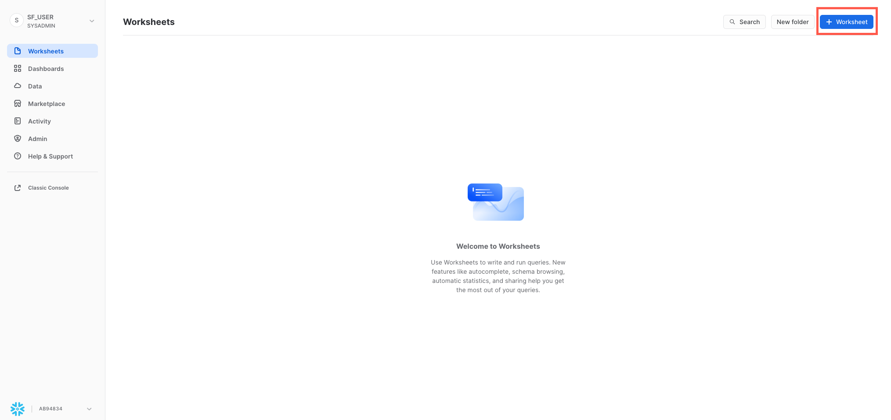

La scheda ​**Worksheets​** fornisce un’interfaccia per inviare query SQL, eseguire operazioni DDL e DML e visualizzare i risultati una volta completate le query o le operazioni. Per creare un nuovo foglio di lavoro si preme **+ Worksheet** in alto a destra.


L’angolo superiore sinistro contiene:

- Icona **Home**: puoi utilizzarla per tornare alla console principale e chiudere il foglio di lavoro.
- Menu a discesa **Nome_foglio_di_lavoro**: Il nome predefinito corrisponde alla data e ora di creazione del foglio di lavoro. Fai clic sul nome del foglio di lavoro per modificarlo. Il menu a discesa visualizza anche altre azioni che puoi eseguire per il foglio di lavoro.
- Pulsante **Manage filters**: i filtri personalizzati sono parole chiave speciali che producono una sotto-query o un elenco di valori.

L’angolo superiore destro contiene:

- Casella **Context**: indica a Snowflake quale ruolo e quale warehouse utilizzare durante questa sessione. Può essere modificata dall’interfaccia utente o tramite comandi SQL.
- Pulsante **Share**: apre il menu di condivisione per condividere con altri utenti o copiare il link a questo foglio di lavoro.
- Pulsante **Play/Run**: esegue l’istruzione SQL in cui si trova attualmente il cursore o più istruzioni selezionate.

Il riquadro centrale contiene:

- Menu a discesa in alto per impostare il contesto del database/schema/oggetto per il foglio di lavoro.
- Area di lavoro generale in cui immettere ed eseguire query e altre istruzioni SQL. 

Il riquadro centrale sinistro contiene:
- Scheda **Worksheets**: usa questa scheda per selezionare e passare rapidamente da un foglio di lavoro all’altro
- Scheda **Databases**: usa questa scheda per visualizzare tutti gli oggetti di database disponibili per il ruolo corrente
- **Barra di ricerca**: browser degli oggetti di database che consente di esplorare tutti i database, gli schemi, le tabelle e le viste accessibili per il ruolo attualmente in uso nel foglio di lavoro. 

Il riquadro inferiore visualizza i risultati delle query e delle altre operazioni. Include inoltre quattro opzioni (**Object**, **Query**, **Result**, **Chart**) che aprono/chiudono i rispettivi riquadri dell’interfaccia utente. **Chart** apre un riquadro di visualizzazione per i risultati restituiti. Torneremo su questo argomento più avanti.

I vari riquadri di questa pagina possono essere ridimensionati spostandone i cursori. Se ti serve più spazio nel foglio di lavoro, comprimi il browser degli oggetti di database nel riquadro sinistro. Questo riquadro è chiuso in molte delle schermate illustrate in questa guida.


> 
>  **Fogli di lavoro o interfaccia utente** Per risparmiare tempo, la maggior parte degli esercizi di questo workshop viene eseguita utilizzando codice SQL pronto all’uso in questo foglio di lavoro. Queste operazioni possono essere eseguite anche tramite l’interfaccia utente, ma richiederebbero numerosi spostamenti tra le diverse schede dell’interfaccia.


#### Dashboards


La scheda **Dashboards** consente di creare visualizzazioni flessibili di uno o più grafici, sotto forma di riquadri che possono essere disposti vari modi. Riquadri e widget vengono prodotti eseguendo query SQL che restituiscono i risultati in un foglio di lavoro. Le dashboard possono essere utilizzate in dimensioni diverse con una configurazione minima.


#### Databases


La scheda **Databases**​, sotto **Data**, mostra informazioni sui database che hai creato o a cui puoi accedere. Puoi creare, clonare, eliminare o trasferire la proprietà dei database, oltre a caricare dati nell’interfaccia utente. Nota che nel tuo ambiente esiste già un database. Tuttavia, non lo utilizzeremo in questo workshop.


#### Private Shared Data

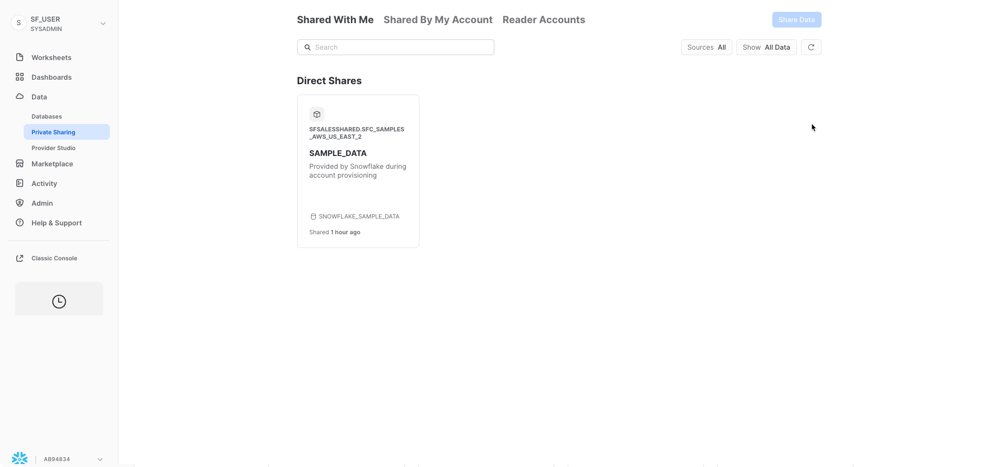

Sempre sotto **Data**, la scheda **Private Shared Data** consente di configurare la condivisione dei dati per condividere in modo facile e sicuro tabelle Snowflake tra account Snowflake separati o con utenti esterni, senza bisogno di creare una copia dei dati. Tratteremo la condivisione dei dati nella Sezione 10.


#### Marketplace

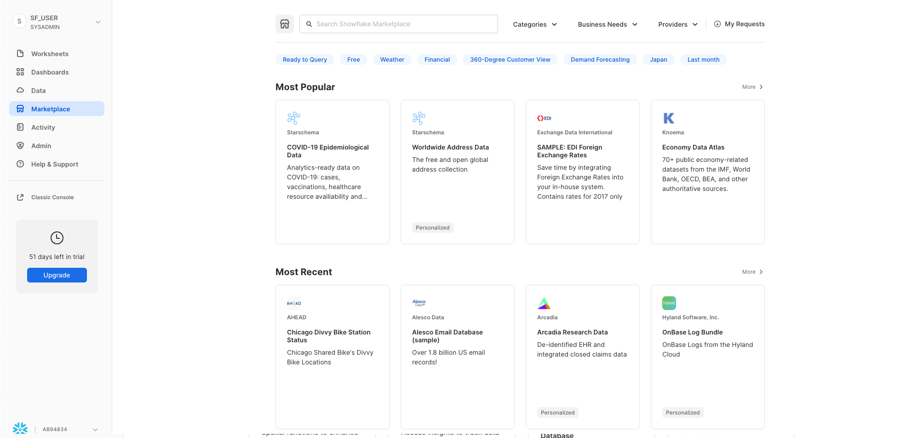

La scheda **Marketplace** consente a qualsiasi cliente Snowflake di sfogliare e utilizzare data set messi a disposizione dai provider. I dati condivisi sono di due tipi: pubblici e personalizzati. I dati pubblici sono data set gratuiti che possono essere sottoposti immediatamente a query. Nel caso dei dati personalizzati, è necessario contattare il provider dei dati perché ne approvi la condivisione.


#### Query History


Sotto **Activity** sono disponibili le due schede **Query History** e **Copy History**:

- **Query History** visualizza le query precedenti e una serie di filtri che possono essere utilizzati per restringere i risultati (utente, warehouse, stato, tag della query, ecc.). Puoi visualizzare i dettagli di tutte le query eseguite negli ultimi 14 giorni dal tuo account Snowflake. Fai clic su un’ID query per selezionarla e visualizzare ulteriori informazioni.
- **Copy History** mostra lo stato dei comandi di copia eseguiti per caricare dati in Snowflake.


#### Warehouses

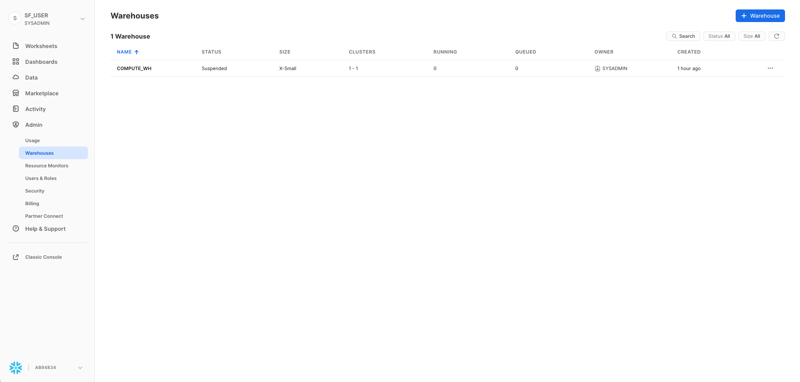

Sotto **Admin**, la scheda **​Warehouses​** consente di configurare e gestire risorse di calcolo dette virtual warehouse per caricare o interrogare i dati in Snowflake. Nel tuo ambiente esiste già un warehouse chiamato COMPUTE_WH.


#### Resource Monitors

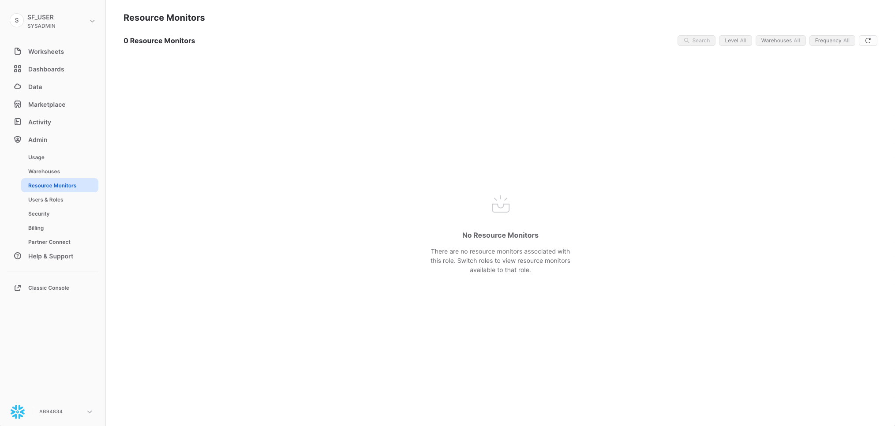

Sotto **Admin**, la scheda **Resource Monitors** mostra tutti i monitor delle risorse che sono stati creati per controllare il numero di crediti consumati dai virtual warehouse. Per ogni monitor delle risorse, mostra la quota di credito, il tipo di monitoraggio, la pianificazione e le azioni eseguite quando il virtual warehouse raggiunge il suo limite di credito.


#### Roles

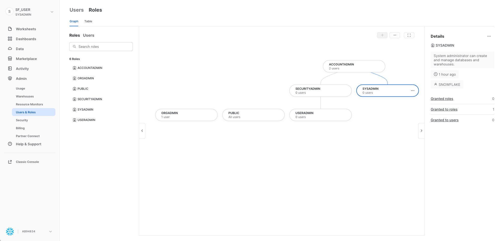

Sotto **Admin**, la sottoscheda **Roles** della scheda **Users and Roles** mostra un elenco di ruoli con le relative gerarchie. I ruoli possono essere creati, riorganizzati e concessi agli utenti in questa scheda. I ruoli possono essere visualizzati anche sotto forma di tabella/elenco selezionando la sottoscheda **Table**.


#### Users


Sempre sotto **Admin**, la sottoscheda **Users** della scheda **Users and Roles** mostra un elenco degli utenti nell’account, dei ruoli predefiniti e del proprietario degli utenti. Per un nuovo account non viene visualizzato alcun ruolo, poiché non sono ancora stati creati ruoli aggiuntivi. Le autorizzazioni concesse attraverso il tuo ruolo corrente determinano le informazioni visualizzate in questa scheda. Per vedere tutte le informazioni disponibili nella scheda, passa al ruolo ACCOUNTADMIN.


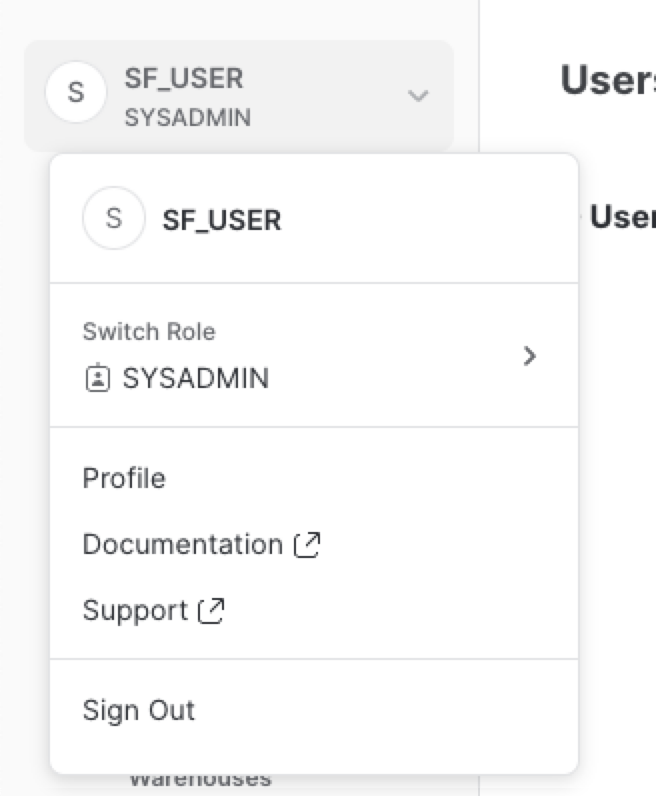

Facendo clic sul tuo nome utente in alto a destra nell’interfaccia puoi modificare la password, i ruoli e le preferenze. Snowflake dispone di vari ruoli definiti dal sistema. In questo momento hai il ruolo predefinito di `SYSADMIN`, che manterrai per la maggior parte del workshop.

> 
>  **SYSADMIN** Il ruolo `SYSADMIN` (o amministratore di sistema) ha i privilegi necessari per creare warehouse, database e altri oggetti in un account. In un ambiente reale, utilizzeresti ruoli diversi per le attività di questo workshop e assegneresti ruoli ai tuoi utenti. Parleremo ancora dei ruoli e del modello di controllo degli accessi di Snowflake nella Sezione 9; inoltre puoi trovare ulteriori informazioni nella [documentazione di Snowflake](https://docs.snowflake.com/user-guide/security-access-control-overview).

### La storia

Questo workshop si basa sul team di analisi di Citi Bike, un sistema di bike sharing realmente esistente di New York, negli Stati Uniti. Il team vuole eseguire analisi sui dati provenienti dai sistemi transazionali interni dell’azienda per comprendere meglio i suoi utenti e come servirli nel modo migliore.

Per prima cosa caricheremo in Snowflake i dati `.csv` strutturati provenienti dalle transazioni degli utenti. Poi lavoreremo con dati meteorologici JSON semi-strutturati open source per stabilire se esiste una correlazione tra il numero di spostamenti in bici e le condizioni meteorologiche.


<!-- ------------------------ -->

## Preparare l’ambiente per il caricamento dei dati


Per iniziare, prepariamoci a caricare in Snowflake i dati strutturati delle transazioni degli utenti di Citi Bike.

Questa sezione illustra nei dettagli i passaggi necessari per:

- Creare un database e una tabella.
- Creare uno stage esterno.
- Creare un formato di file per i dati.

> 
>  **Inserire dati in Snowflake** Vi sono molti modi per inserire dati in Snowflake da molte origini, tra cui il comando COPY, l’ingestion automatica di Snowpipe, connettori esterni e soluzioni ETL/ELT di terze parti. Per maggiori informazioni sull’inserimento di dati in Snowflake, consulta la [documentazione di Snowflake](https://docs.snowflake.com/guides-overview-loading-data). In questo workshop useremo il comando COPY e lo storage AWS S3 per caricare i dati manualmente. In una situazione reale, solitamente si utilizza un processo automatizzato o una soluzione ETL.

Useremo i dati del bike sharing forniti da Citi Bike NYC. I dati sono stati esportati e preparati per l’uso in un bucket Amazon AWS S3 nella regione US-EAST e comprendono informazioni sulla durata degli spostamenti, il tipo di utente, il sesso, l’età e così via. Su AWS S3, questi dati rappresentano 61,5 milioni di righe, 377 oggetti e 1,9 GB compressi.

Ecco un frammento di uno dei file di dati CSV di Citi Bike:


È in formato delimitato da virgole con un’unica riga di intestazione e con tutti i valori stringa racchiusi tra virgolette doppie, comprese le intestazioni dei campi nella riga di intestazione. Questo sarà rilevante più avanti in questa sezione, quando configureremo la tabella Snowflake in cui memorizzare questi dati.

### Creare un database e una tabella

Per prima cosa creiamo un database chiamato `CITIBIKE` da utilizzare per caricare i dati strutturati.

Assicurati di utilizzare il ruolo sysadmin selezionando il tuo nome in alto a sinistra e poi **Switch Role** > **SYSADMIN**.

Vai alla scheda **Databases**. Fai clic su **Create**, assegna al database il nome `CITIBIKE` e poi fai clic su **CREATE**.

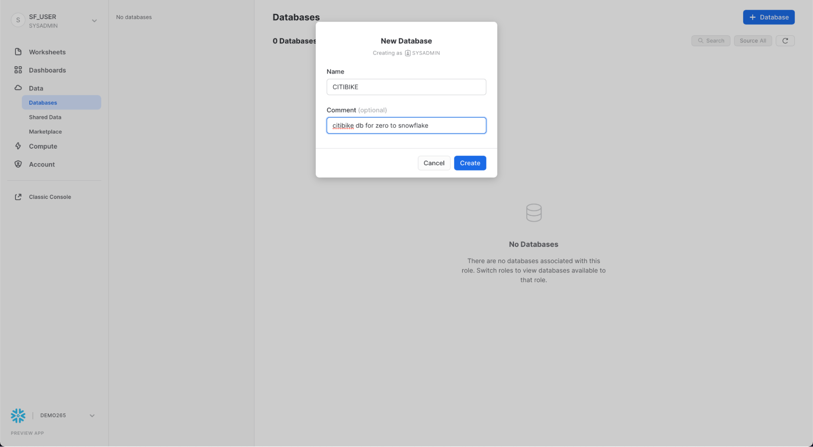


Ora vai alla scheda **Worksheets**. Dovresti vedere il foglio di lavoro che abbiamo creato nel passaggio 3.

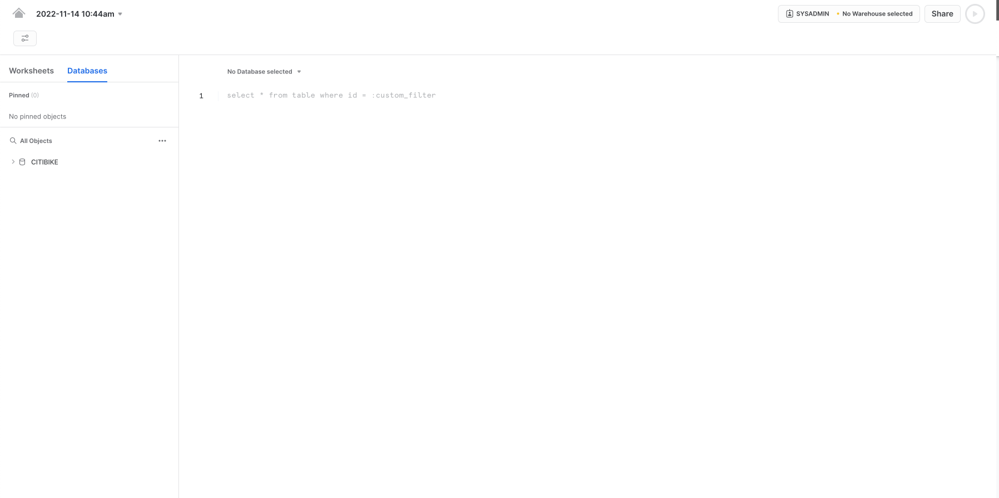

Dobbiamo impostare il contesto in modo appropriato all’interno del foglio di lavoro. Nell’angolo superiore destro del foglio di lavoro, fai clic sulla casella a sinistra del pulsante **Share** per visualizzare il menu contestuale, che consente di controllare gli elementi che puoi vedere ed eseguire da ogni foglio di lavoro. Qui stiamo utilizzando l’interfaccia utente per impostare il contesto. Più avanti nel workshop utilizzeremo comandi SQL all’interno del foglio di lavoro per fare la stessa cosa.

Seleziona le seguenti impostazioni del contesto:

Ruolo: `SYSADMIN` Warehouse: `COMPUTE_WH`

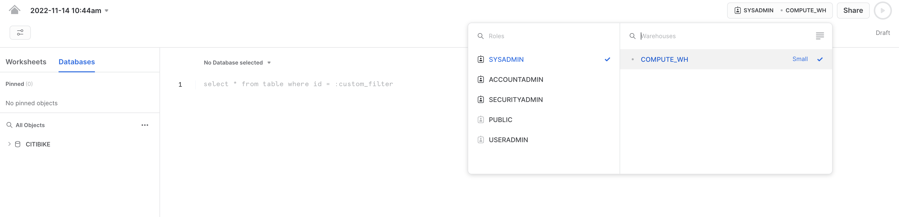

Quindi, nel menu a discesa del database, seleziona le seguenti impostazioni del contesto:

Database: `CITIBIKE` Schema = `PUBLIC`

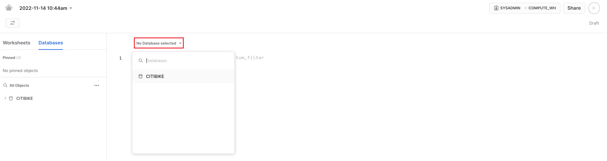

> 
>  **Le operazioni DDL (Data Definition Language) sono gratuite!** Tutte le operazioni DDL che abbiamo eseguito finora non richiedono risorse di calcolo, quindi possiamo creare tutti gli oggetti gratuitamente.

Per lavorare più facilmente nel foglio di calcolo, rinominiamolo. Nell’angolo superiore sinistro, fai doppio clic sul nome del foglio di lavoro, che corrisponde alla data e all’ora in cui è stato creato, e modificalo in `CITIBIKE_ZERO_TO_SNOWFLAKE`.

Ora creiamo una tabella chiamata `TRIPS` da utilizzare per caricare i dati delimitati da virgole. Invece di utilizzare l’interfaccia utente, useremo il foglio di lavoro per eseguire il DDL che crea la tabella. Copia questo testo SQL nel foglio di lavoro:

``` SQL
create or replace table trips
(tripduration integer,
starttime timestamp,
stoptime timestamp,
start_station_id integer,
start_station_name string,
start_station_latitude float,
start_station_longitude float,
end_station_id integer,
end_station_name string,
end_station_latitude float,
end_station_longitude float,
bikeid integer,
membership_type string,
usertype string,
birth_year integer,
gender integer);
```

> 
>  **Molte opzioni per eseguire i comandi.** I comandi SQL possono essere eseguiti utilizzando l’interfaccia utente, la scheda **Worksheets**, lo strumento della riga di comando SnowSQL, il tuo editor SQL preferito tramite ODBC/JDBC oppure altri connettori Snowflake (Python, Spark ecc.). Come già detto, per risparmiare tempo svolgeremo la maggior parte delle operazioni di questo workshop eseguendo codice SQL pronto per l’uso nel foglio di lavoro, invece di utilizzare l’interfaccia utente.

Per eseguire la query, colloca il cursore in qualsiasi punto del testo SQL e fai clic sul pulsante blu **Play/Run** nell’angolo superiore destro del foglio di lavoro. Oppure usa i tasti di scelta rapida [Ctrl]/[Cmd]+[Invio].

Verifica che sia stata creata la tabella TRIPS. Nella parte inferiore del foglio di lavoro dovrebbe essere visualizzata una sezione Results con il messaggio “Table TRIPS successfully created”.


Vai alla scheda **Databases** facendo clic sull’icona **HOME** nell’angolo superiore sinistro del foglio di lavoro. Quindi fai clic su **Data** > **Databases**. Nell’elenco dei database, fai clic su `CITIBIKE` > `PUBLIC` > **TABLES** per vedere la tabella `TRIPS` appena creata. Se sulla sinistra non vedi i database, espandi il browser, perché potrebbero essere nascosti.

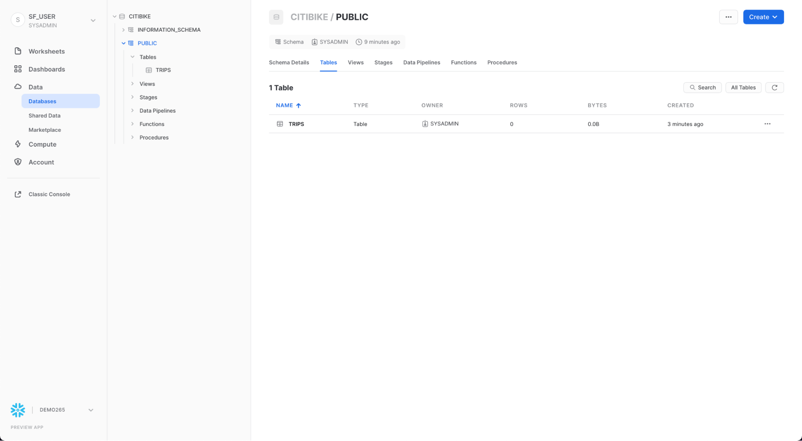

Fai clic su `TRIPS` e sulla scheda **Columns** per vedere la struttura della tabella appena creata.


### Creare uno stage esterno

Stiamo lavorando con dati strutturati delimitati da virgole che sono già stati preparati per l’uso in un bucket S3 pubblico esterno. Prima di poterli utilizzare, dobbiamo creare uno stage che specifichi la posizione del bucket esterno.

> 
>  Per questo workshop utilizziamo un bucket AWS-East. Per evitare costi di uscita/trasferimento dati in futuro, seleziona una posizione per lo stage nello stesso cloud provider e nella stessa regione del tuo account Snowflake.

Nella scheda **Databases**, fai clic sul database `CITIBIKE` e sullo schema `PUBLIC`. Fai clic sul pulsante **Create** e poi su **Stage** > **Amazon S3**.

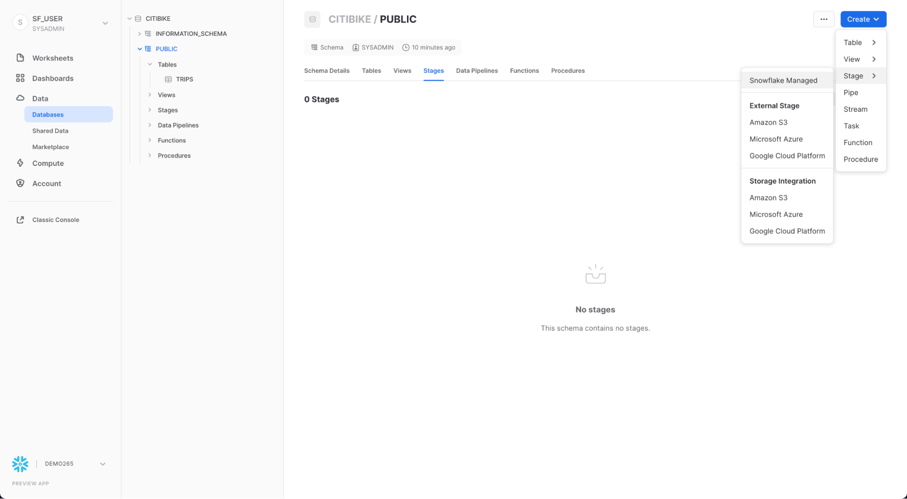

Nella finestra di dialogo “Create Securable Object” che viene visualizzata, sostituisci i seguenti valori nell’istruzione SQL:

`<stage_name>`: `citibike_trips`

`<url>`: `s3://snowflake-workshop-lab/citibike-trips-csv/`

**Nota:** assicurati di includere la barra (`/`) alla fine dell’URL; in caso contrario si verificheranno errori al momento di caricare i dati dal bucket. Assicurati inoltre di rimuovere l’istruzione 'credentials = (…)', che non è necessaria. Puoi anche impostarla come commento usando '--', come illustrato nell’immagine seguente. Il comando “create stage” dovrebbe essere uguale a quello illustrato, ma potrebbe non includere la terza riga.

> 
>  Il bucket S3 per questo workshop è pubblico, quindi puoi lasciare vuote le opzioni relative alle credenziali nell’istruzione. In una situazione reale, il bucket utilizzato per uno stage esterno probabilmente richiederebbe informazioni sulle chiavi.


Ora esaminiamo il contenuto dello stage `citibike_trips`. Torna alla scheda **Worksheets** e apri il foglio di lavoro 'CITIBIKE_ZERO_TO_SNOWFLAKE' che abbiamo creato, aggiungi la seguente istruzione SQL sotto il codice precedente, come illustrato, quindi esegui:

``` SQL
list @citibike_trips;
```

Nel riquadro dei risultati in basso dovrebbe comparire l’elenco dei file contenuti nello stage:


### Creare un formato di file

Prima di caricare i dati in Snowflake, dobbiamo creare un formato di file corrispondente alla struttura dei dati.

Nel foglio di lavoro, aggiungi nuovamente il seguente comando dopo il testo già presente ed eseguilo per creare il formato di file:

``` SQL 
--create file format

create or replace file format csv type='csv' 
  compression = 'auto' field_delimiter = ',' record_delimiter = '\n' 
  skip_header = 0 field_optionally_enclosed_by = '\ 042' trim_space = false
  error_on_column_count_mismatch = false escape = 'none' escape_unenclosed_field = '\134'
  date_format = 'auto' timestamp_format = 'auto' null_if = ('') 
  comment = 'file format for ingesting data for zero to snowflake'; 
```

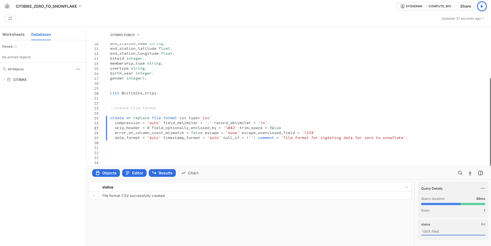

Verifica che il formato sia stato creato con le impostazioni corrette eseguendo il seguente comando:

``` SQL 
--verify file format is created

show file formats in database citibike; 
```

Il formato di file appena creato dovrebbe essere elencato nel riquadro dei risultati:
 
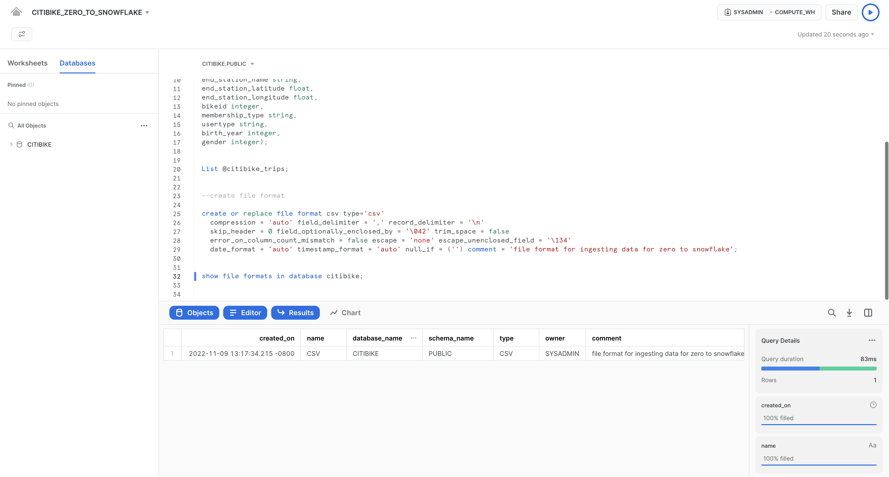


<!-- ------------------------ -->

## Caricare i dati


In questa sezione utilizzeremo un virtual warehouse e il comando COPY per avviare il caricamento in blocco di dati strutturati nella tabella Snowflake che abbiamo creato nella sezione precedente.

### Ridimensionare e utilizzare un warehouse per il caricamento dei dati

Per caricare i dati sono necessarie risorse di calcolo. I nodi di calcolo di Snowflake sono detti virtual warehouse e possono essere dimensionati dinamicamente in base al workload, a seconda che si tratti di caricare dati, eseguire una query o svolgere un’operazione DML. Ogni workload può avere il proprio warehouse per evitare contese di risorse.

Vai alla scheda **Warehouses** (sotto **Admin**). Qui puoi vedere tutti i tuoi warehouse esistenti e analizzarne i trend di utilizzo.

Nota l’opzione **+ Warehouse** nell’angolo superiore sinistro. Qui puoi aggiungere rapidamente un nuovo warehouse. Tuttavia, vogliamo utilizzare il warehouse COMPUTE_WH già esistente, incluso nell’ambiente di prova di 30 giorni.

Fai clic sulla riga del warehouse `COMPUTE_WH`. Quindi fai clic sui tre puntini (**…**) nel testo che compare nell’angolo superiore destro per vedere le azioni che puoi eseguire sul warehouse. Utilizzeremo questo warehouse per caricare i dati da AWS S3.


Fai clic su **Edit** per esaminare le opzioni di questo warehouse e scoprire alcune delle funzionalità uniche di Snowflake.

> 
>  Se questo account non utilizza Snowflake Enterprise Edition (o versione superiore), non vedrai le opzioni **Mode** o **Clusters** illustrate nella schermata qui sotto. La funzionalità dei warehouse multi-cluster non viene utilizzata in questo workshop, ma ne parleremo poiché si tratta di una funzionalità chiave di Snowflake.


- Il menu a discesa **Size** consente di selezionare la capacità del warehouse. Per le operazioni di caricamento di grandi quantità di dati o per query con esigenze di calcolo più impegnative, è consigliato un warehouse di dimensioni maggiori. Le dimensioni si traducono in risorse di calcolo sottostanti fornite dal cloud provider (AWS, Azure o GCP) su cui risiede in hosting il tuo account Snowflake. Determinano inoltre il numero di crediti consumati dal warehouse per ogni ora intera di attività. Dimensioni maggiori comportano una quantità maggiore di risorse di calcolo del cloud provider allocate al warehouse e un numero maggiore di crediti consumati. Ad esempio, l’impostazione `4X-Large` consuma 128 crediti per ogni ora intera. Queste dimensioni possono essere aumentate o ridotte in qualsiasi momento con un semplice clic.

- Se utilizzi Snowflake Enterprise Edition (o versione superiore), è disponibile l’opzione **Query Acceleration**. Quando è abilitata per un warehouse, può migliorarne le prestazioni complessive riducendo l’impatto delle query anomale, ossia le query che utilizzano più risorse del normale. Lascia questa opzione disabilitata 

- Se utilizzi Snowflake Enterprise Edition (o versione superiore) e l’opzione **Multi-cluster Warehouse** è abilitata, vedrai alcune opzioni aggiuntive. Qui puoi configurare un warehouse per l’uso di più cluster di risorse di calcolo, fino a un massimo di 10. Ad esempio, se a un warehouse multi-cluster `4X-Large` viene assegnata una dimensione massima dei cluster di 10, può scalare orizzontalmente fino a 10 volte le risorse di calcolo che lo alimentano… e può farlo in pochi secondi! Tuttavia, tieni presente che questo aumenterà il numero di crediti consumati dal warehouse fino a 1280 se tutti i 10 cluster sono attivi per un’ora intera (128 crediti/ora x 10 cluster). La configurazione multi-cluster è ideale per gli scenari di concorrenza, ad esempio quando molti business analyst eseguono simultaneamente query diverse utilizzando lo stesso warehouse. In questo caso d’uso, le diverse query vengono allocate su più cluster per garantire che vengano eseguite rapidamente.

- Le opzioni sotto **Advanced Warehouse Options** consentono di sospendere automaticamente il warehouse quando non è in uso per evitare di consumare inutilmente crediti. Un’altra opzione consente di riavviare automaticamente un warehouse sospeso, in modo che si riattivi automaticamente quando riceve un nuovo workload. Questa funzionalità rende possibile l’efficiente modello di fatturazione “pay-per-use” di Snowflake, che consente di scalare le risorse quando servono e ridurle o disattivarle automaticamente quando non sono più necessarie, eliminando quasi completamente le risorse inattive. Inoltre, è disponibile un’opzione per cambiare il tipo di warehouse da standard a ottimizzato per Snowpark. I warehouse ottimizzati per Snowpark forniscono una quantità di memoria per nodo 16 volte superiore e sono consigliati per i workload con requisiti di memoria elevati, come i casi d’uso di addestramento ML che utilizzano una stored procedure su un unico nodo virtual warehouse. Lascia questa opzione impostata su Standard

> 
>  **Capacità di calcolo di Snowflake e di altri data warehouse** Molte delle funzionalità di virtual warehouse e di calcolo di cui abbiamo appena parlato, come la capacità di creare, scalare orizzontalmente e verticalmente e sospendere o riavviare automaticamente i virtual warehouse, sono facili da utilizzare in Snowflake e richiedono solo pochi secondi. Per i data warehouse on-premise, utilizzare queste funzionalità è molto più difficile, se non impossibile, poiché richiedono notevoli risorse hardware fisiche, over-provisioning dell’hardware per i picchi dei workload e notevole lavoro di configurazione, oltre a presentare sfide di altro tipo. Anche altri cloud data warehouse non sono in grado di scalare orizzontalmente e verticalmente come Snowflake o richiedono molto più tempo e lavoro per la configurazione.

**Attenzione alla spesa!** Nel corso di questo workshop, fai attenzione a non eseguire le seguenti azioni senza un buon motivo, per evitare di consumare troppo rapidamente i tuoi 400 $ di crediti gratuiti:

- Non disabilitare la sospensione automatica. Se la sospensione automatica è disabilitata, i tuoi warehouse rimangono attivi e continuano a consumare crediti anche quando non sono in uso.
- Non utilizzare una taglia del warehouse troppo grande per il tuo workload. Più il warehouse è grande, più crediti consuma.

Utilizzeremo questo virtual warehouse per caricare in Snowflake i dati strutturati contenuti nei file CSV (archiviati nel bucket AWS S3). Tuttavia, prima modificheremo la taglia del warehouse per aumentare le risorse di calcolo utilizzate. Al termine del caricamento dei dati, prendi nota del tempo impiegato; in un passaggio successivo di questa sezione ripeteremo la stessa operazione di caricamento con un warehouse ancora più grande e osserveremo la riduzione del tempo di caricamento.

Modifica la taglia (**Size**) di questo data warehouse da `X-Small` a `Small`. quindi fai clic sul pulsante **Save Warehouse**:

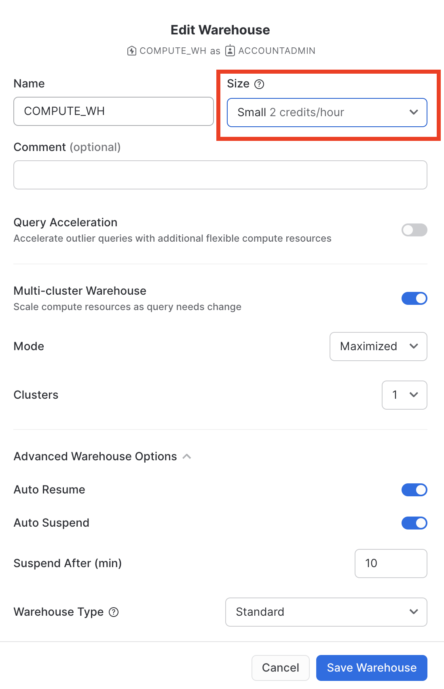

### Caricare i dati

Ora possiamo eseguire un comando COPY per caricare i dati nella tabella `TRIPS` che abbiamo creato in precedenza.

Torna al foglio di lavoro `CITIBIKE_ZERO_TO_SNOWFLAKE` nella scheda **Worksheets**. Assicurati che il contesto del foglio di lavoro sia impostato correttamente:

Ruolo: `SYSADMIN` Warehouse: `COMPUTE_WH` Database: `CITIBIKE` Schema = `PUBLIC`


Esegui le seguenti istruzioni nel foglio di lavoro per caricare i dati dallo stage nella tabella. Questo può richiedere fino a 30 secondi.

``` SQL
copy into trips from @citibike_trips file_format=csv PATTERN = '.*csv.*' ;
```

Nel riquadro dei risultati dovrebbe comparire lo stato di ogni file caricato. Una volta completato il caricamento, nel riquadro **Query Details** in basso a destra puoi scorrere tra i diversi stati, le statistiche degli errori e le visualizzazioni per l’ultima istruzione eseguita:

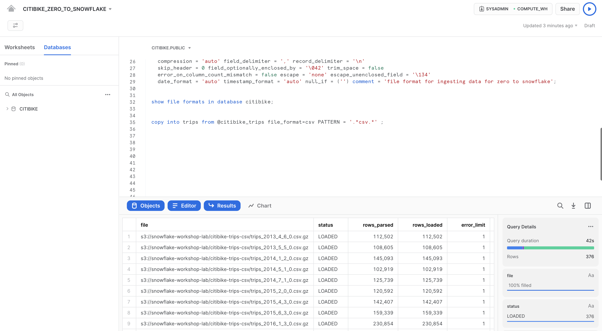

Ora vai alla scheda **Query History** facendo clic sull’icona **Home** e poi su **Activity** > **Query History**. Seleziona la query in cima all’elenco, che dovrebbe essere l’istruzione COPY INTO che è stata eseguita per ultima. Seleziona la scheda **Query Profile** e osserva i passaggi dell’esecuzione della query, i dettagli della query, i nodi più costosi e le statistiche aggiuntive.

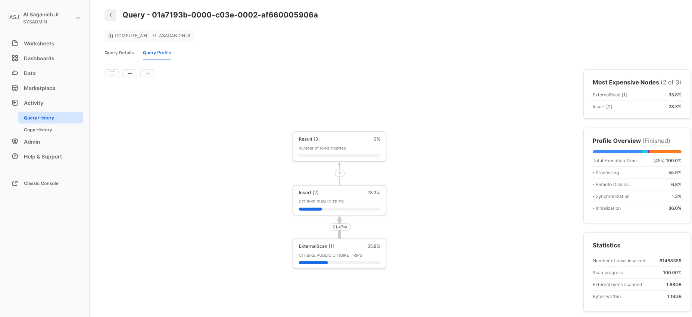

Ora carichiamo nuovamente la tabella `TRIPS` con un warehouse più grande per vedere l’impatto delle risorse di calcolo aggiuntive sul tempo di caricamento.

Torna al foglio di lavoro e usa il comando TRUNCATE TABLE per cancellare tutti i dati e i metadati dalla tabella:

``` SQL
truncate table trips;
```

Verifica che la tabella sia vuota eseguendo il comando:

``` SQL
--verify table is clear
select * from trips limit 10;
```

Il risultato dovrebbe essere “Query produced no results”.

Modifica la taglia del warehouse in `large` utilizzando la seguente istruzione ALTER WAREHOUSE:
 
``` SQL
--change warehouse size from small to large (4x)
alter warehouse compute_wh set warehouse_size='large';
```

Verifica la modifica utilizzando la seguente istruzione SHOW WAREHOUSES:

``` SQL
--load data with large warehouse
show warehouses;
```


La taglia può essere modificata anche dall’interfaccia utente, facendo clic sulla casella del contesto del foglio di lavoro e poi sull’icona **Configure** (3 righe) sul lato destro della casella del contesto e modificando `Small` in `Large` nel menu a discesa **Size**:


Esegui la stessa istruzione COPY INTO utilizzata in precedenza per caricare nuovamente gli stessi dati:

``` SQL
copy into trips from @citibike_trips
file_format=CSV;
```

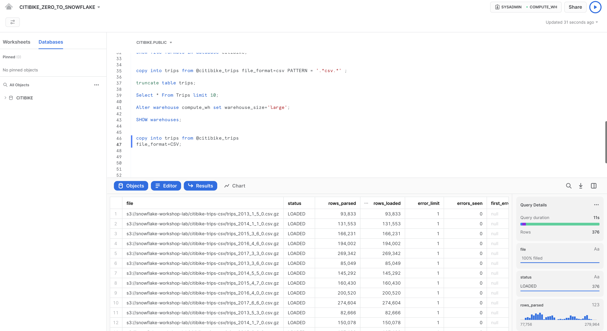

Una volta completato il caricamento, torna alla pagina **Queries** (icona **Home** > **Activity** > **Query History**). Confronta i tempi di esecuzione dei due comandi COPY INTO. Il caricamento con il warehouse `Large` è stato notevolmente più veloce.

### Creare un nuovo warehouse per l’analisi dei dati

Tornando alla storia del workshop, poniamo che il team di Citi Bike voglia eliminare le contese di risorse tra i suoi workload di caricamento dei dati/ETL e gli utenti finali che eseguono le analisi utilizzando strumenti di BI per interrogare Snowflake. Come già accennato, in Snowflake è facile risolvere il problema assegnando warehouse diversi di dimensioni appropriate ai diversi workload. Poiché Citi Bike ha già un warehouse per il caricamento dei dati, creiamo un nuovo warehouse per gli utenti finali che eseguono le analisi. Utilizzeremo questo warehouse per eseguire analisi nella sezione successiva.

Vai alla scheda **Admin** > **Warehouses**, fai clic su **+ Warehouse**, assegna al nuovo warehouse il nome ANALYTICS_WH e imposta la taglia su `Large`.

Se utilizzi Snowflake Enterprise Edition (o versione superiore) e l’opzione **Multi-cluster Warehouse** è abilitata, vedrai alcune impostazioni aggiuntive:

- Assicurati che **Max Clusters** sia impostato su `1`.
- Lascia inalterate tutte le altre opzioni predefinite.


Fai clic sul pulsante **Create Warehouse** per creare il warehouse.


<!-- ------------------------ -->

## Lavorare con le query, la cache dei risultati e la clonazione


Negli esercizi precedenti abbiamo caricato dati in due tabelle utilizzando il comando per il caricamento in blocco COPY e il virtual warehouse `COMPUTE_WH`. Ora assumeremo il ruolo degli utenti di Citi Bike che eseguono le analisi e hanno bisogno di interrogare i dati in quelle tabelle utilizzando il foglio di lavoro e il secondo warehouse `ANALYTICS_WH`.

> 
>  **Ruoli e query in situazioni reali** In un’azienda reale, gli utenti che eseguono le analisi probabilmente avranno un ruolo diverso da SYSADMIN. Per semplificare le cose in questo workshop, continueremo a utilizzare il ruolo SYSADMIN in questa sezione. Inoltre, le query vengono tipicamente eseguite utilizzando un prodotto di business intelligence come Tableau, Looker, PowerBI, ecc. Per analisi più avanzate, strumenti di data science come Datarobot, Dataiku, AWS Sagemaker e molti altri possono inviare query a Snowflake. Qualsiasi tecnologia che utilizza JDBC/ODBC, Spark, Python o un’altra delle interfacce di programmazione supportate può eseguire analisi sui dati contenuti in Snowflake. Per semplificare le cose in questo workshop, tutte le query verranno eseguite tramite il foglio di lavoro Snowflake.

### Eseguire alcune query

Vai al foglio di lavoro **CITIBIKE_ZERO_TO_SNOWFLAKE** e cambia warehouse per utilizzare il nuovo warehouse che hai creato nella sezione precedente. Il contesto del foglio di lavoro dovrebbe essere:

Ruolo: `SYSADMIN` Warehouse: `ANALYTICS_WH (L)` Database: `CITIBIKE` Schema = `PUBLIC`

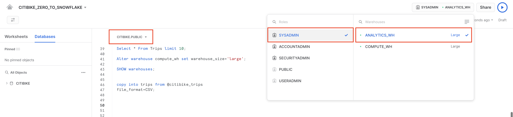

Esegui la seguente query per vedere un campione dei dati della tabella `trips`:

``` SQL
select * from trips limit 20;
```


Ora vediamo alcune statistiche orarie di base sull’utilizzo di Citi Bike. Esegui la seguente query nel foglio di lavoro. Per ogni ora, mostra il numero di spostamenti, la loro durata media e la loro distanza media.

``` SQL
select date_trunc('hour', starttime) as "date",
count(*) as "num trips",
avg(tripduration)/60 as "avg duration (mins)",
avg(haversine(start_station_latitude, start_station_longitude, end_station_latitude, end_station_longitude)) as "avg distance (km)"
from trips
group by 1 order by 1;
```


### Utilizzare la cache dei risultati

Snowflake dispone di una cache dei risultati che memorizza i risultati di ogni query eseguita nelle ultime 24 ore. Questi sono disponibili in tutti i warehouse, quindi i risultati delle query restituiti a un utente sono a disposizione di qualsiasi altro utente del sistema che esegue la stessa query, purché i dati sottostanti non siano cambiati. Non solo queste query ripetute restituiscono risultati molto rapidamente, ma in più non utilizzano crediti per il calcolo.

Vediamo la cache dei risultati in azione eseguendo nuovamente la stessa query.

``` SQL
select date_trunc('hour', starttime) as "date",
count(*) as "num trips",
avg(tripduration)/60 as "avg duration (mins)",
avg(haversine(start_station_latitude, start_station_longitude, end_station_latitude, end_station_longitude)) as "avg distance (km)"
from trips
group by 1 order by 1;
```

Nel riquadro **Query Details** sulla destra, nota che la seconda query è stata eseguita molto più rapidamente, poiché i risultati erano memorizzati nella cache.


### Eseguire un’altra query

Ora eseguiamo la seguente query per vedere in quali mesi si verifica il maggiore utilizzo:

``` SQL
select
monthname(starttime) as "month",
count(*) as "num trips"
from trips
group by 1 order by 2 desc;
```

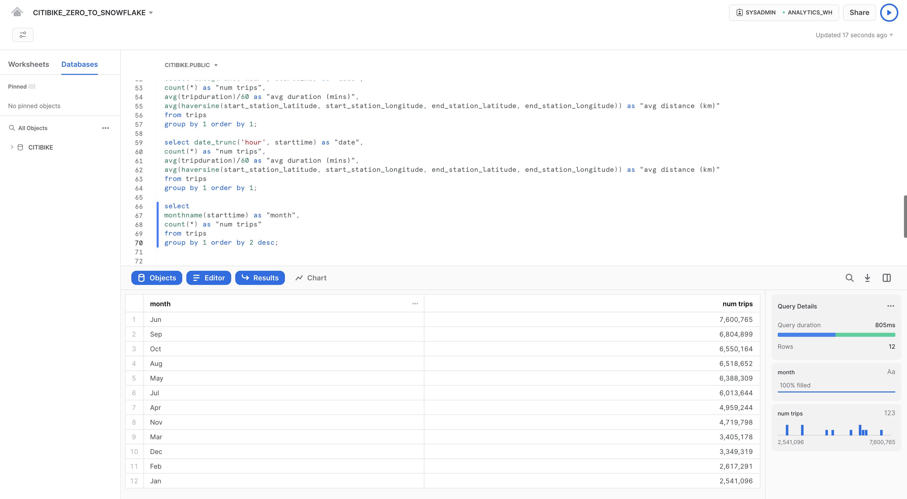

### Clonare una tabella

Snowflake consente di creare in pochi secondi cloni, detti anche cloni “zero-copy”, di tabelle, schemi e database. Quando viene creato un clone, Snowflake crea uno snapshot dei dati presenti nell’oggetto sorgente e li rende disponibili nell’oggetto clonato. L’oggetto clonato è scrivibile e indipendente dalla sorgente del clone. Di conseguenza, le modifiche apportate all’oggetto sorgente non sono incluse nell’oggetto clone e viceversa.

Un caso d’uso comune per Zero-Copy Cloning è clonare un ambiente di produzione perché i team di sviluppo e test possano utilizzarlo per eseguire test ed esperimenti senza incidere sull’ambiente di produzione, eliminando la necessità di configurare e gestire due ambienti separati.

> 
>  **Zero-Copy Cloning** Un enorme vantaggio della clonazione zero-copy è che i dati sottostanti non vengono copiati. Cambiano solo i metadati e i riferimenti ai dati sottostanti. Di conseguenza evitando la copia dei dati, i requisiti di storage non raddoppiano quando i dati vengono clonati. La maggior parte dei data warehouse non è in grado di farlo, ma con Snowflake è semplicissimo!

Esegui il seguente comando nel foglio di lavoro per creare un clone della tabella `trips` per lo sviluppo (dev):

``` SQL
create table trips_dev clone trips;
```

Fai clic sui tre puntini (**…**) nel riquadro a sinistra e seleziona **Refresh**. Espandi la struttura degli oggetti sotto il database `CITIBIKE` e verifica che sia presente una nuova tabella chiamata `trips_dev`. Ora il tuo team di sviluppo può fare ciò che vuole con questa tabella, anche aggiornarla o eliminarla, senza incidere in alcun modo sulla tabella `trips` o su qualsiasi altro oggetto.


<!-- ------------------------ -->

## Lavorare con dati semi-strutturati, viste e join


> 
>  Questa sezione richiede il caricamento di dati aggiuntivi e quindi offre una revisione dell’argomento, oltre a introdurre il caricamento dei dati semi-strutturati.

Per tornare all’esempio del workshop, il team di analisi di Citi Bike vuole stabilire l’impatto delle condizioni meteorologiche sul numero di spostamenti. Per farlo, in questa sezione svolgeremo le seguenti operazioni:

- Caricare dati meteorologici in formato JSON semi-strutturato archiviati in un bucket S3 pubblico.
- Creare una vista e interrogare i dati JSON utilizzando la notazione punto di SQL.
- Eseguire una query che unisce i dati JSON ai dati `TRIPS` caricati in precedenza.
- Analizzare i dati delle condizioni meteorologiche e del numero di spostamenti per stabilire una correlazione.

I dati JSON sono informazioni meteorologiche fornite da *MeteoStat* riferite alle condizioni storiche nella città di New York City dal 05-07-2016 al 25-06-2019. Sono anche predisposti in uno stage su AWS S3, dove i dati rappresentano 75.000 righe, 36 oggetti e 1,1 MB compressi. In un editor di testo, i dati JSON grezzi contenuti nei file GZ appaiono come segue:


> 
>  **DATI SEMI-STRUTTURATI** Snowflake consente di caricare e interrogare facilmente i dati semi-strutturati come JSON, Parquet o Avro senza trasformazioni. Questa è una caratteristica chiave di Snowflake, poiché oggi sempre più dati importanti per le aziende sono semi-strutturati e molti data warehouse tradizionali non sono in grado di caricare e interrogare facilmente tali dati. Snowflake rende tutto facile.

### Creare un nuovo database e una nuova tabella per i dati

Per prima cosa, nel foglio di lavoro, creiamo un database chiamato `WEATHER` che utilizzeremo per memorizzare i dati JSON semi-strutturati.

``` SQL
create database weather;
```

Esegui i seguenti comandi USE per impostare correttamente il contesto del foglio di lavoro:

``` SQL 
use role sysadmin;

use warehouse compute_wh;

use database weather;

use schema public; 
```

> 
>  **Eseguire più comandi** Ricorda che devi eseguire ciascun comando separatamente. Tuttavia puoi eseguirli insieme in sequenza selezionando tutti i comandi e poi facendo clic sul pulsante **Play/Run** (o utilizzando i tasti di scelta rapida).

Ora creiamo una tabella chiamata `JSON_WEATHER_DATA` da utilizzare per caricare i dati JSON. Nel foglio di lavoro, esegui questo comando CREATE TABLE:

``` SQL
create table json_weather_data (v variant);
```

Nota che Snowflake dispone di un tipo di colonna speciale chiamato `VARIANT` che consente di memorizzare l’intero oggetto come un’unica riga e, quando richiesto, interrogare direttamente l’oggetto.

> 
>  **Un grande aiuto per i dati semi-strutturati** Il tipo di dati VARIANT consente a Snowflake di acquisire dati semi-strutturati senza bisogno di predefinire lo schema.

Nel riquadro dei risultati nella parte inferiore del foglio di lavoro, verifica che sia stata creata la tabella `JSON_WEATHER_DATA`:

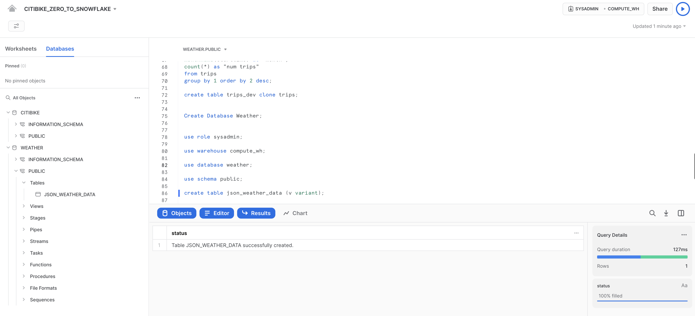

### Creare un altro stage esterno

Nel foglio di lavoro `CITIBIKE_ZERO_TO_SNOWFLAKE`, utilizza il seguente comando per creare uno stage che fa riferimento al bucket in cui sono archiviati i dati JSON semi-strutturati su AWS S3:

``` SQL
create stage nyc_weather
url = 's3://snowflake-workshop-lab/zero-weather-nyc';
```

Ora esaminiamo il contenuto dello stage `nyc_weather`. Esegui questo comando LIST per visualizzare l’elenco dei file:

``` SQL
list @nyc_weather;
```

Nel riquadro dei risultati dovrebbe comparire un elenco di file `.gz` provenienti da S3:


### Caricare e verificare i dati semi-strutturati

In questa sezione utilizzeremo un warehouse per caricare i dati dal bucket S3 nella tabella `JSON_WEATHER_DATA` che abbiamo creato in precedenza.

Nel foglio di lavoro `CITIBIKE_ZERO_TO_SNOWFLAKE`, esegui questo comando COPY per caricare i dati.

Nota che puoi specificare un oggetto `FILE FORMAT` in linea nel comando. Nella sezione precedente, quando abbiamo caricato dati strutturati in formato CSV, abbiamo dovuto definire un formato di file per supportare la struttura CSV. Poiché i dati JSON che dobbiamo utilizzare sono ben formati, possiamo semplicemente specificare il tipo JSON e utilizzare tutte le impostazioni predefinite:

``` SQL
copy into json_weather_data
from @nyc_weather 
    file_format = (type = json strip_outer_array = true);
```

Verifica che ogni file abbia lo stato `LOADED`:


Ora diamo un’occhiata ai dati caricati:

``` SQL
select * from json_weather_data limit 10;
```

Fai clic su qualsiasi riga per visualizzare i dati JSON formattati nel riquadro a destra:


Per chiudere la visualizzazione nel riquadro e vedere nuovamente i dettagli della query, fai clic sul pulsante **X** (Chiudi) che compare spostando il mouse nell’angolo superiore destro del riquadro.

### Creare una vista e interrogare i dati semi-strutturati

Ora vediamo come Snowflake ci consente di creare una vista e di interrogare direttamente i dati JSON utilizzando SQL.

> 
>  **Viste e viste materializzate** Una vista consente di accedere al risultato di una query come se fosse una tabella. Le viste possono essere utili per presentare i dati agli utenti finali in modo più ordinato, limitare ciò che gli utenti finali possono vedere in una tabella sorgente e scrivere codice SQL più modulare. Snowflake supporta anche le viste materializzate, in cui i risultati delle query vengono memorizzati come se fossero una tabella. Questo consente un accesso più rapido, ma richiede spazio di archiviazione. È possibile creare e interrogare le viste materializzate se si utilizza Snowflake Enterprise Edition (o versione superiore).

Esegui il seguente comando per creare una vista in colonne dei dati meteorologici semi-strutturati JSON, che gli analisti potranno comprendere e interrogare più facilmente. Il valore ``72502`` per ``station_id`` corrisponde all’Aeroporto di Newark, la stazione più vicina che dispone delle condizioni meteorologiche per l’intero periodo.

``` SQL
// create a view that will put structure onto the semi-structured data
create or replace view json_weather_data_view as
select
    v:obsTime::timestamp as observation_time,
    v:station::string as station_id,
    v:name::string as city_name,
    v:country::string as country,
    v:latitude::float as city_lat,
    v:longitude::float as city_lon,
    v:weatherCondition::string as weather_conditions,
    v:coco::int as weather_conditions_code,
    v:temp::float as temp,
    v:prcp::float as rain,
    v:tsun::float as tsun,
    v:wdir::float as wind_dir,
    v:wspd::float as wind_speed,
    v:dwpt::float as dew_point,
    v:rhum::float as relative_humidity,
    v:pres::float as pressure
from
    json_weather_data
where
    station_id = '72502';
```

In questo comando viene utilizzata la notazione punto di SQL `v:temp` per estrarre valori ai livelli inferiori della gerarchia degli oggetti JSON. Questo ci consente di trattare ciascun campo come se fosse una colonna in una tabella relazionale.

La nuova vista dovrebbe comparire nel browser degli oggetti a sinistra con il nome `JSON_WEATHER_DATA` sotto `WEATHER` > `PUBLIC` > **Views**. Per vederla potrebbe essere necessario espandere o aggiornare il browser degli oggetti.


Verifica la vista con la seguente query: 

``` SQL
select * from json_weather_data_view
where date_trunc('month',observation_time) = '2018-01-01'
limit 20;
```

Nota che i risultati sono esattamente simili a una normale sorgente di dati strutturati. Il tuo set di risultati potrebbe avere valori diversi per `observation_time`:


### Utilizzare un’operazione di join per stabilire una correlazione tra data set

Ora uniremo dati meteorologici JSON con i dati `CITIBIKE.PUBLIC.TRIPS` per rispondere alla nostra domanda originale, ossia l’impatto delle condizioni meteorologiche sul numero di spostamenti.

Esegui la seguente query per mettere in join `WEATHER` a `TRIPS` e contare il numero di spostamenti associati a determinate condizioni meteorologiche:

> 
>  Poiché ci troviamo ancora nel foglio di lavoro, il database `WEATHER` è ancora in uso. Di conseguenza, devi specificare completamente il riferimento alla tabella `TRIPS` fornendo il nome del database e dello schema.


``` SQL
select weather_conditions as conditions
,count(*) as num_trips
from citibike.public.trips
left outer join json_weather_data_view
on date_trunc('hour', observation_time) = date_trunc('hour', starttime)
where conditions is not null
group by 1 order by 2 desc;
```


L’obiettivo iniziale era stabilire se esistesse una correlazione tra il numero di spostamenti in bicicletta e le condizioni meteorologiche analizzando sia i dati sugli spostamenti che quelli sul meteo. I risultati riportati sopra ci forniscono una risposta chiara. Come prevedibile, il numero di spostamenti è significativamente maggiore quando è bel tempo!


<!-- ------------------------ -->

## Utilizzare Time Travel


La potente funzionalità Time Travel di Snowflake consente di accedere ai dati storici e agli oggetti che li contengono in qualsiasi momento entro un determinato periodo di tempo. La finestra temporale predefinita è di 24 ore e può essere aumentata fino a 90 giorni se si utilizza Snowflake Enterprise Edition. La maggior parte dei data warehouse non è in grado di offrire questa funzionalità, ma naturalmente… Snowflake rende tutto più facile!

Alcune applicazioni utili includono:

- Ripristinare oggetti relativi ai dati come tabelle, schemi e database che sono stati eliminati.
- Duplicare ed eseguire copie di backup dei dati in momenti chiave del passato.
- Analizzare l’utilizzo e la manipolazione dei dati durante periodi di tempo specificati.

### Fare il drop e l’undrop di una tabella

Per prima cosa, vediamo come possiamo ripristinare oggetti di dati che sono stati eliminati accidentalmente o intenzionalmente.

Nel foglio di lavoro `CITIBIKE_ZERO_TO_SNOWFLAKE`, esegui il seguente comando DROP per rimuovere la tabella `JSON_WEATHER_DATA`:

``` SQL
drop table json_weather_data;
```

Esegui una query sulla tabella:

``` SQL
select * from json_weather_data limit 10;
```

Nel riquadro dei risultati in basso dovrebbe comparire un errore, perché la tabella sottostante è stata rimossa:


Ora ripristina la tabella:

``` SQL
undrop table json_weather_data;
```

La tabella json_weather_data dovrebbe essere ripristinata. Per verificarlo, esegui la seguente query:

``` SQL 
--verify table is undropped

select * from json_weather_data limit 10; 
```

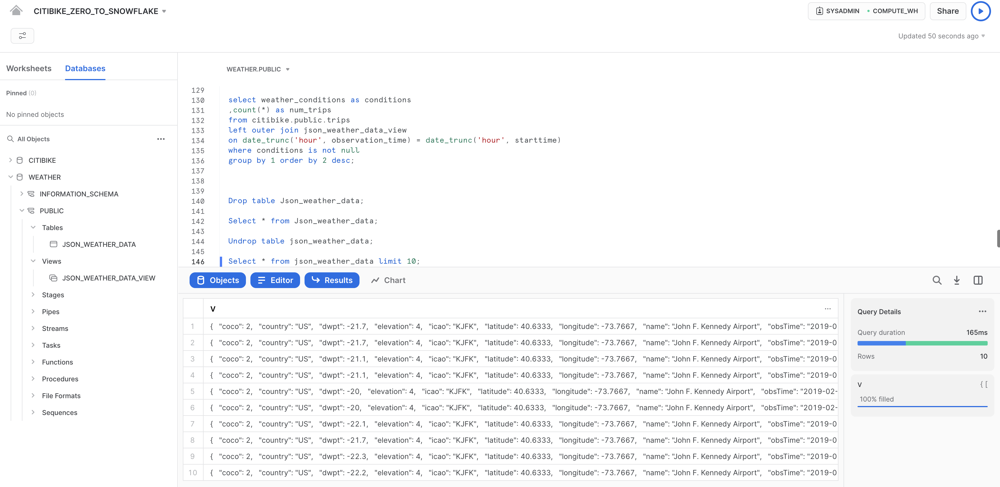

### Eseguire il rollback di una tabella

Eseguiamo il rollback della tabella `TRIPS` nel database `CITIBIKE` a uno stato precedente per correggere un errore DML accidentale che sostituisce tutti i nomi delle stazioni nella tabella con la parola “oops”.

Per prima cosa, esegui le seguenti istruzioni SQL per impostare il contesto corretto nel foglio di lavoro:

``` SQL 
use role sysadmin;

use warehouse compute_wh;

use database citibike;

use schema public; 
```

Esegui il seguente comando per sostituire tutti i nomi delle stazioni nella tabella con la parola “oops”:

``` SQL
update trips set start_station_name = 'oops';
```

Ora esegui una query che restituisce le prime 20 stazioni per numero di spostamenti. Nota che il risultato per i nomi delle stazioni contiene una sola riga:

``` SQL
select
start_station_name as "station",
count(*) as "rides"
from trips
group by 1
order by 2 desc
limit 20;
```

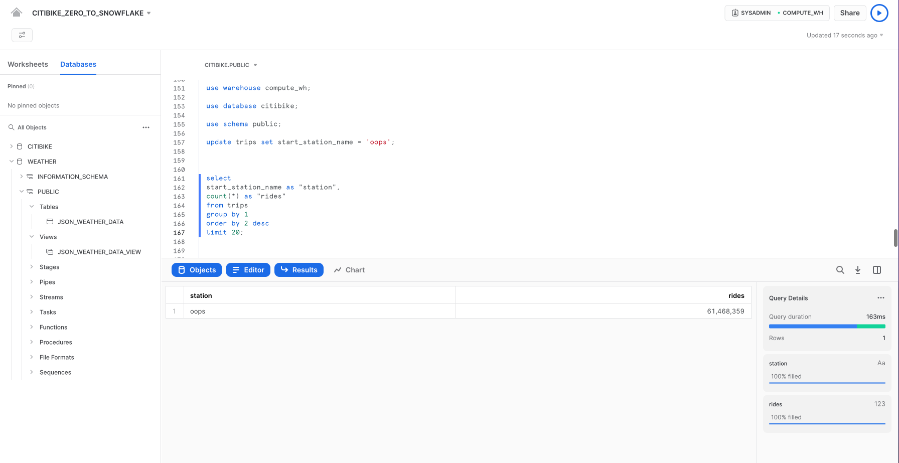

Normalmente dovremmo metterci le mani nei capelli e sperare di avere un backup da qualche parte.

In Snowflake, possiamo semplicemente eseguire un comando per trovare l’ID query dell’ultimo comando UPDATE e memorizzarlo in una variabile chiamata `$QUERY_ID`.

``` SQL
set query_id =
(select query_id from table(information_schema.query_history_by_session (result_limit=>5))
where query_text like 'update%' order by start_time desc limit 1);
```

Utilizza Time Travel per ricreare la tabella con i nomi delle stazioni corretti:

``` SQL
create or replace table trips as
(select * from trips before (statement => $query_id));
```

Esegui di nuovo la query precedente per verificare che i nomi delle stazioni siano stati ripristinati:

``` SQL
select
start_station_name as "station",
count(*) as "rides"
from trips
group by 1
order by 2 desc
limit 20;
```

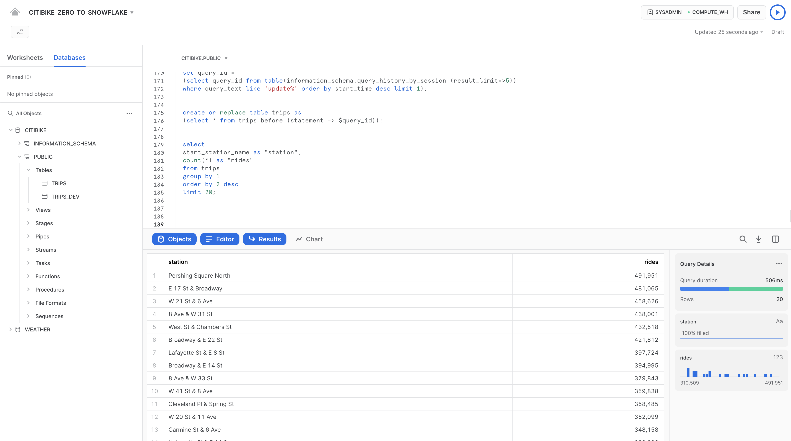


<!-- ------------------------ -->

## Lavorare con i ruoli, ACCOUNTADMIN e l’utilizzo dell’account


In questa sezione esploreremo alcuni aspetti del modello di sicurezza per il controllo degli accessi di Snowflake, come la creazione di un ruolo e l’assegnazione di specifiche autorizzazioni. Esamineremo anche altri usi del ruolo ACCOUNTADMIN (amministratore dell’account) che abbiamo presentato brevemente in una delle sezioni precedenti.

Per continuare con la nostra storia, supponiamo che un nuovo DBA sia entrato a far parte del team di Citi Bike e di volergli assegnare un nuovo ruolo con meno privilegi del ruolo SYSADMIN predefinito del sistema.

> 
>  **Controllo degli accessi basato sui ruoli** Snowflake offre un controllo degli accessi molto potente e granulare che definisce gli oggetti e le funzionalità a cui può accedere un utente e il livello di accesso di cui dispone. Per maggiori dettagli, consulta la [documentazione di Snowflake](https://docs.snowflake.com/user-guide/security-access-control-overview).

### Creare un nuovo ruolo e aggiungere un utente

Nel foglio di lavoro `CITIBIKE_ZERO_TO_SNOWFLAKE`, passa al ruolo ACCOUNTADMIN per creare un nuovo ruolo. ACCOUNTADMIN combina i ruoli definiti dal sistema SYSADMIN e SECURITYADMIN. È il ruolo di livello più alto nell’account e deve essere concesso solo a un numero limitato di utenti.

Nel foglio di lavoro `CITIBIKE_ZERO_TO_SNOWFLAKE`, esegui questo comando:

``` SQL
use role accountadmin;
```

Nota che in alto a destra nel foglio di lavoro il contesto è cambiato in ACCOUNTADMIN:

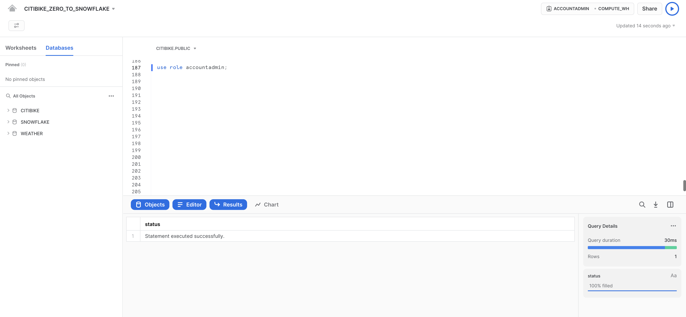

Prima di utilizzarlo per il controllo degli accessi, è necessario assegnare a un ruolo almeno un utente. Creiamo quindi un nuovo ruolo chiamato `JUNIOR_DBA` e assegniamolo all’utente Snowflake. Per completare questa attività devi conoscere il tuo nome utente, che è il nome che hai utilizzato per effettuare l’accesso all’interfaccia utente.

Usa i seguenti comandi per creare il ruolo e assegnarlo a te. Prima di eseguire il comando GRANT ROLE, sostituisci `YOUR_USERNAME_GOES_HERE` con il tuo nome utente:

``` SQL 
create role junior_dba;

grant role junior_dba to user YOUR_USERNAME_GOES_HERE; 
```

> 
>  Se provassi a eseguire questa operazione con un ruolo come SYSADMIN, non riusciresti per mancanza di privilegi. Di default (e intenzionalmente), il ruolo SYSADMIN non può creare nuovi ruoli o utenti.

Modifica il contesto del foglio di lavoro per passare al nuovo ruolo `JUNIOR_DBA`:

``` SQL
use role junior_dba;
```

In alto a destra nel foglio di lavoro, nota che il contesto è cambiato per riflettere il ruolo `JUNIOR_DBA`. 

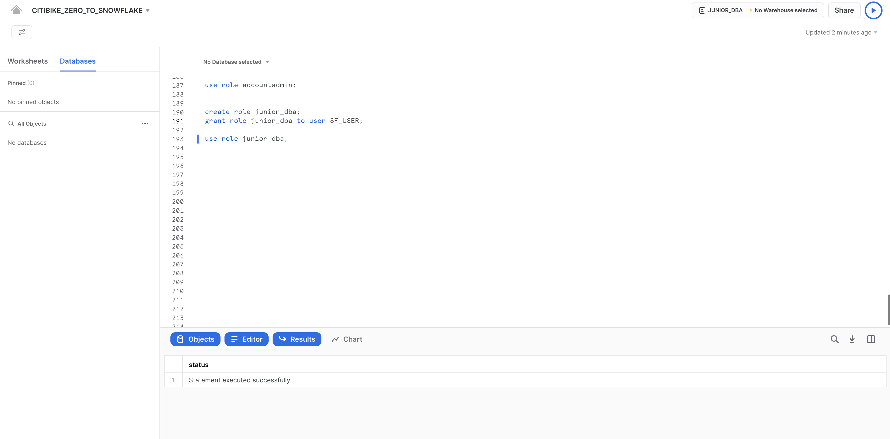

Inoltre il warehouse non è selezionato, perché il ruolo appena creato non dispone di privilegi di utilizzo per alcun warehouse. Per correggere questo problema, torniamo al ruolo ADMIN e concediamo i privilegi di utilizzo per il warehouse `COMPUTE_WH`.

``` SQL 
use role accountadmin;

grant usage on warehouse compute_wh to role junior_dba; 
```

Torna al ruolo `JUNIOR_DBA`. Ora dovresti essere in grado di utilizzare `COMPUTE_WH`.

``` SQL 
use role junior_dba;

use warehouse compute_wh; 
```

Infine, puoi notare che nel riquadro del browser degli oggetti di database sulla sinistra non compaiono più i database `CITIBIKE` e `WEATHER`. Il motivo è che il ruolo `JUNIOR_DBA` non dispone dei relativi privilegi di accesso.

Torna al ruolo ACCOUNTADMIN e concedi a `JUNIOR_DBA` il privilegio USAGE necessario per visualizzare e utilizzare i database `CITIBIKE` e `WEATHER`:

``` SQL 
use role accountadmin;

grant usage on database citibike to role junior_dba;

grant usage on database weather to role junior_dba; 
```

Passa al ruolo `JUNIOR_DBA`:

``` SQL
use role junior_dba;
```

Nota che ora i database `CITIBIKE` e `WEATHER` compaiono nel riquadro del browser degli oggetti di database sulla sinistra. Se non compaiono, prova a fare clic su **…** nel riquadro e poi fare clic su **Refresh**.

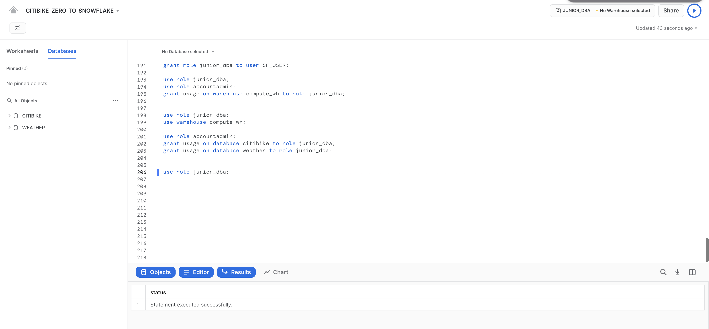

### Visualizzare l’interfaccia utente dell’amministratore dell’account

Impostiamo nuovamente il nostro ruolo di controllo degli accessi su `ACCOUNTADMIN` per vedere altre aree dell’interfaccia utente accessibili solo con questo ruolo. Tuttavia, per eseguire questa attività, utilizza l’interfaccia utente invece del foglio di lavoro.

Per prima cosa fai clic sull’icona **Home** nell’angolo superiore sinistro del foglio di lavoro. Quindi, nell’angolo superiore sinistro dell’interfaccia utente, fai clic sul tuo nome per visualizzare il menu delle preferenze utente. Nel menu, vai a **Switch Role** e seleziona ACCOUNTADMIN.

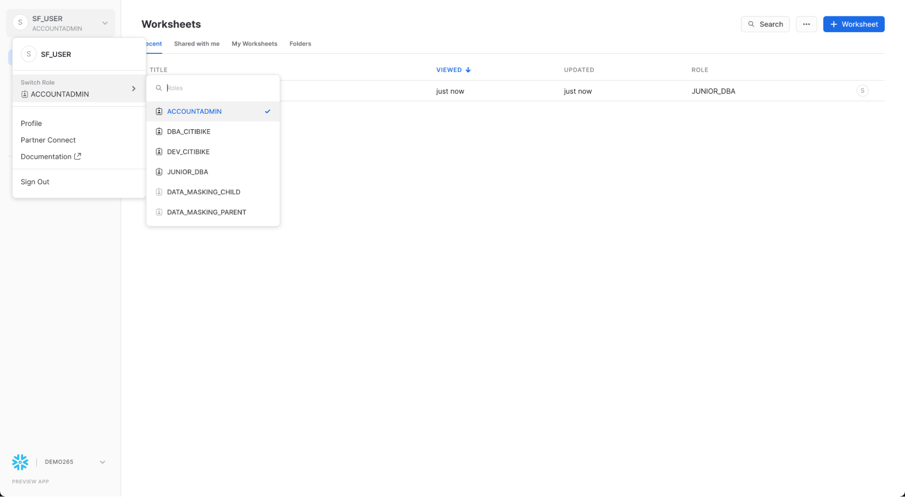

> 
>  **Ruoli nelle preferenze utente e nel foglio di lavoro** Perché abbiamo utilizzato il menu delle preferenze per cambiare ruolo invece del foglio di lavoro? La sessione UI e ciascun foglio di lavoro hanno ruoli separati. Il ruolo della sessione UI controlla gli elementi che puoi visualizzare e utilizzare nell’interfaccia utente, mentre il ruolo del foglio di lavoro controlla solo gli oggetti e le azioni a cui puoi accedere all’interno del ruolo.

Nota come, una volta impostata la sessione UI sul ruolo ACCOUNTADMIN, sotto **Admin** compaiono nuove schede.


#### Usage

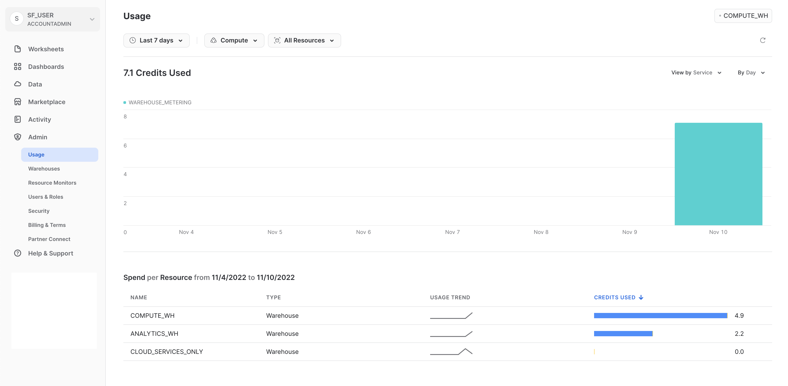

La scheda **Usage** visualizza le seguenti informazioni, ciascuna con la propria pagina:

- **Organization**: utilizzo dei crediti in tutti gli account della tua organizzazione.
- **Consumption**: crediti consumati dai virtual warehouse nell’account corrente.
- **Storage**: quantità media di dati archiviati in tutti i database, gli stage interni e Snowflake Fail-Safe nell’account corrente per il mese appena trascorso.
- **Transfers**: quantità media di dati trasferiti fuori dalla regione (per l’account corrente) verso altre regioni per il mese appena trascorso.

I filtri nell’angolo superiore destro di ogni pagina consentono di suddividere le visualizzazioni di utilizzo/consumo/ecc. in base a varie misure.


#### Security


La scheda **Security** contiene le policy di rete create per l’account Snowflake. È possibile creare nuove policy di rete selezionando “+ Network Policy” in alto a destra nella pagina.


#### Billing


La scheda **Billing** contiene il metodo di pagamento per l’account:

- Se sei un cliente Snowflake con un contratto, la scheda mostra il nome associato ai dati del tuo contratto.
- Se sei un cliente Snowflake on demand, la scheda mostra la carta di credito utilizzata per pagare mensilmente, se è stata inserita. Se non è stata registrata una carta di credito, puoi aggiungerla per continuare a utilizzare Snowflake al termine del periodo di prova.

Per la prossima sezione, mantieni il ruolo ACCOUNTADMIN per la sessione UI.


<!-- ------------------------ -->

## Condividere i dati in modo sicuro e utilizzare il Marketplace

Snowflake consente l’accesso ai dati con account diversi tramite le funzionalità di Secure Data Sharing. Le condivisioni vengono create dai provider di dati e importate dai data consumer tramite il proprio account Snowflake o un reader account Snowflake attivato. Il data consumer può essere un’entità esterna o un’altra business unit interna, che deve avere il proprio account Snowflake univoco.

Con Secure Data Sharing:

- Esiste una sola copia dei dati, che risiede nell’account del provider di dati.
- I dati condivisi sono sempre aggiornati, in tempo reale e immediatamente disponibili per i data consumer.
- I provider possono stabilire criteri di accesso dettagliati e revocabili alle condivisioni.
- La condivisione dei dati è semplice e sicura, soprattutto in confronto ai vecchi metodi di condivisione, che spesso erano manuali e poco sicuri, come il trasferimento di file `.csv` di grandi dimensioni tramite internet.

> 
>  **Condivisione dei dati tra regioni e cloud diversi** Per condividere dati tra regioni o piattaforme cloud diverse, devi configurare la replica. Questo non rientra nell’ambito di questo workshop, ma puoi trovare ulteriori informazioni in [questo articolo Snowflake](/trending/what-is-data-replication).

Snowflake utilizza Secure Data Sharing per fornire dati sull’utilizzo dell’account e data set campione a tutti gli account Snowflake. In questo contesto, Snowflake funge da provider di dati per i dati e tutti gli altri account.

Secure Data Sharing è anche alla base del Marketplace Snowflake, che è a disposizione di tutti i clienti di Snowflake e consente di trovare e accedere a set di dati di terze parti offerti da numerosi provider di dati e fornitori SaaS. Di nuovo, in questo modello di condivisione i dati non escono mai dall’account del provider e i data set possono essere utilizzati senza alcuna trasformazione.


### Visualizzare le condivisioni esistenti

Dalla home page, vai a **Data** > **Databases**. Nell’elenco di database, osserva la colonna **SOURCE**. Dovresti vedere due database con l’indicazione `Local` in questa colonna. Questi sono i due database che abbiamo creato in precedenza in questo workshop. Per l’altro database, `SNOWFLAKE`, in questa colonna compare `Share`, a indicare che è condiviso da un provider.

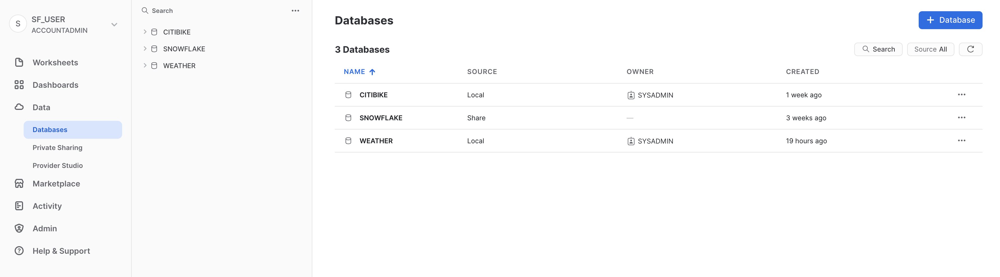

### Creare una condivisione in uscita

Torniamo alla storia di Citi Bike e supponiamo di essere l’amministratore dell’account Snowflake di Citi Bike. Abbiamo un partner di fiducia che desidera analizzare i dati contenuti nel nostro database `TRIPS` in tempo quasi reale. Anche questo partner ha un account Snowflake nella stessa regione del nostro account. Utilizziamo quindi Secure Data Sharing per consentirgli di accedere a queste informazioni.

Vai a **Data** > **Private Sharing** e quindi, nella parte alta della scheda, fai clic su **Shared by My Account**. Fai clic sul pulsante **Share** nell’angolo superiore destro e seleziona **Create a Direct Share**:

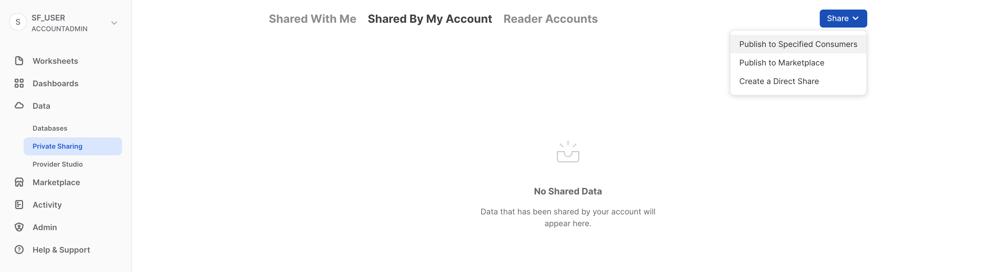

Fai clic su **+ Select Data** e vai al database `CITIBIKE` e allo schema `PUBLIC`. Seleziona le due tabelle che abbiamo creato in questo schema e fai clic sul pulsante **Done**:

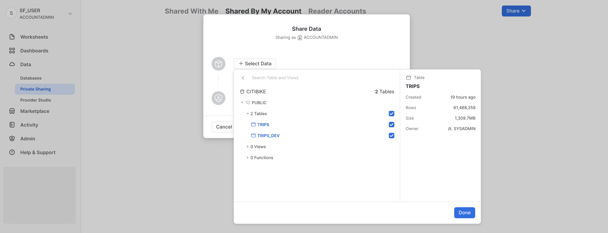

Il nome predefinito della condivisione è un nome generico seguito da un valore numerico casuale. Sostituisci il nome predefinito con un valore più descrittivo che ci consentirà di identificare più facilmente la condivisione in futuro (ad es. `ZERO_TO_SNOWFLAKE_SHARED_DATA`. Puoi anche aggiungere un commento.

In una situazione reale, a questo punto l’amministratore dell’account di Citi Bike aggiungerebbe uno o più account consumer alla condivisione, ma per questo workshop ci fermeremo qui.

Fai clic sul pulsante **Create Share** nella parte inferiore della finestra di dialogo:

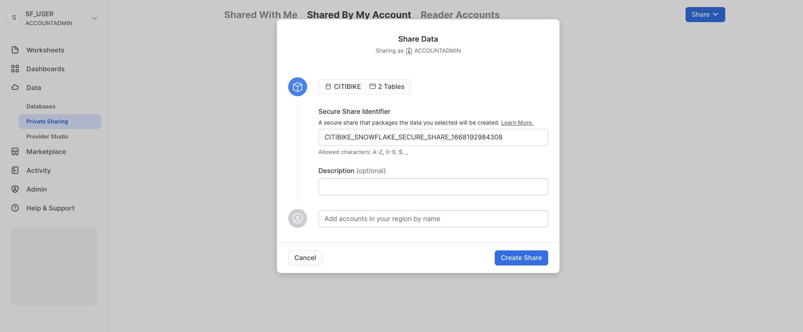

La finestra di dialogo si chiude e la pagina mostra la condivisione sicura che hai creato:

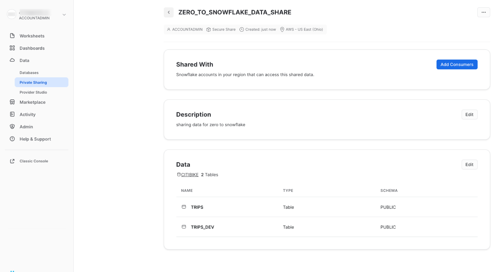

Puoi aggiungere data consumer, aggiungere/modificare la descrizione e modificare gli oggetti nella condivisione in qualsiasi momento. In questa pagina, fai clic sul pulsante **<** accanto al nome della condivisione per tornare alla pagina **Share with Other Accounts**:

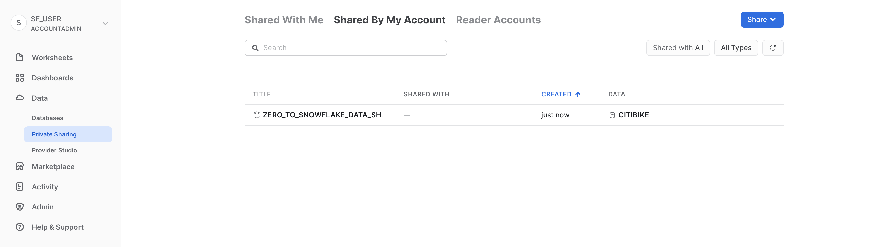

Abbiamo dimostrato che bastano pochi secondi per concedere ad altri account l’accesso ai dati nel tuo account Snowflake in modo sicuro senza bisogno di copiare o trasferire i dati!

Snowflake offre vari metodi per condividere i dati in modo sicuro senza compromettere la confidenzialità. Oltre alle tabelle puoi condividere viste protette, UDF (User Defined Function) protette e altri oggetti protetti. Per maggiori informazioni sull’utilizzo di questi metodi per condividere i dati impedendo l’accesso a informazioni sensibili, consulta la [documentazione di Snowflake](https://docs.snowflake.com/en/user-guide/data-sharing-secure-views.html).

### Marketplace Snowflake

Assicurati di utilizzare il ruolo ACCOUNTADMIN e vai al **Marketplace**:


#### Trovare un prodotto nel marketplace

La casella di ricerca sul lato superiore consente di cercare un prodotto in catalogo. L’elenco a discesa a destra della casella di ricerca consente di filtrare i risultati per provider, esigenze aziendali e categorie.

Digita `COVID` nella casella di ricerca, scorri i risultati e seleziona **COVID-19 Epidemiological Data** (fornito da Starschema).

  

Nella pagina di **COVID-19 Epidemiological Data** puoi scoprire di più sul data set e vedere alcune query che ne esemplificano l’uso. Al termine, fai clic sul pulsante **Get** per rendere disponibili queste informazioni nel tuo account Snowflake:

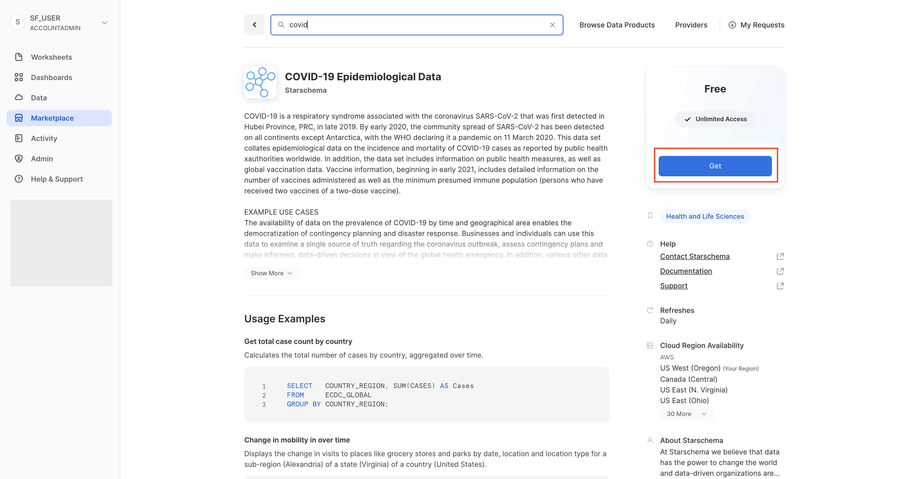

Verifica le informazioni nella finestra di dialogo e fai nuovamente clic su **Get**:


Ora puoi fare clic su **Done** o scegliere di eseguire le query di esempio fornite da Starschema:


Se scegli **Open**, si apre un nuovo foglio di lavoro in una nuova scheda/finestra del browser:

1. Imposta il contesto 
2. Seleziona la query che vuoi eseguire (o colloca il cursore nel testo della query).
3. Fai clic sul pulsante **Run/Play** (o usa i tasti di scelta rapida).
4. Puoi vedere i dati dei risultati nel riquadro in basso.
5. Dopo avere eseguito le query di esempio, fai clic sull’icona **Home** nell’angolo superiore sinistro.


A questo punto:

1. Fai clic su **Data** > **Databases**
2. Fai clic sul database `COVID19_BY_STARSCHEMA_DM`.
3. Puoi vedere i dettagli sugli schemi, le tabelle e le viste disponibili per l’esecuzione di query.


Ecco fatto! Hai completato la registrazione per il data set COVID-19 di Starschema, che viene aggiornato quotidianamente con dati globali sul COVID. Nota che non abbiamo dovuto creare database, tabelle, viste o un processo ETL. Abbiamo semplicemente cercato e ottenuto accesso a dati condivisi dal Marketplace Snowflake.

aside positive
Per maggiori informazioni su come utilizzare la nuova interfaccia del foglio di lavoro, consulta la [documentazione di Snowsight](https://docs.snowflake.com/en/user-guide/ui-snowsight.html#using-snowsight)


<!-- ------------------------ -->

## Ripristinare l’ambiente Snowflake

Se desideri ripristinare il tuo ambiente eliminando tutti gli oggetti creati nel corso di questo workshop, esegui queste istruzioni SQL in un foglio di lavoro.

Per prima cosa, assicurati di utilizzare il ruolo ACCOUNTADMIN nel foglio di lavoro:

``` SQL
use role accountadmin;
```

Quindi esegui i seguenti comandi SQL per fare il drop di tutti gli oggetti che abbiamo creato durante il workshop:

``` SQL 
drop share if exists zero_to_snowflake_shared_data; 
-- If necessary, replace "zero_to_snowflake-shared_data" with the name you used for the share

drop database if exists citibike;

drop database if exists weather;

drop warehouse if exists analytics_wh;

drop role if exists junior_dba; 
```


<!-- ------------------------ -->

## Conclusione e fasi successive


Congratulazioni per avere completato questo workshop introduttivo! Hai appreso le nozioni fondamentali di Snowflake e puoi iniziare ad applicarle ai tuoi dati. Potrai tornare a consultare questa guida se avrai bisogno di un ripasso.

Ti invitiamo a continuare la tua prova gratuita caricando i tuoi dati di esempio o di produzione e utilizzando alcune delle funzionalità più avanzate di Snowflake non trattate in questo workshop.

### Risorse aggiuntive:

- Scopri di più sulla documentazione di [Snowsight](https://docs.snowflake.com/en/user-guide/ui-snowsight.html#using-snowsight).
- Leggi il documento [Definitive Guide to Maximizing Your Free Trial](/test-driving-snowflake-the-definitive-guide-to-maximizing-your-free-trial/).
- Partecipa a un [evento Snowflake online o in presenza](/about/events/) e scopri di più sulle nostre funzionalità e sui nostri clienti.
- Entra a far parte della [community Snowflake](https://community.snowflake.com/s/topic/0TO0Z000000wmFQWAY/getting-started-with-snowflake).
- Iscriviti alla [Snowflake University](https://community.snowflake.com/s/article/Getting-Access-to-Snowflake-University).
- Contatta il nostro [team di vendita](/free-trial-contact-sales/) per maggiori informazioni.

### Cosa abbiamo visto:

- Come creare stage, database, tabelle, viste e virtual warehouse.
- Come caricare dati strutturati e semi-strutturati.
- Come eseguire query analitiche sui dati in Snowflake, compresi i join tra tabelle.
- Come clonare oggetti.
- Come annullare gli errori dell’utente utilizzando Time Travel.
- Come creare ruoli e utenti e concedere privilegi.
- Come condividere dati con altri account in modo facile e sicuro.
- Come utilizzare i data set disponibili nel Marketplace Snowflake.
