summary: これはSnowflakeの大まかな紹介であり、ログイン、クエリの実行、データのロード方法について説明しています。
id: getting-started-with-snowflake-ja
categories: snowflake-site:taxonomy/solution-center/certification/quickstart, snowflake-site:taxonomy/product/data-engineering
language: ja
environments: web
status: Published
feedback link: https://github.com/Snowflake-Labs/sfguides/issues


# Snowflake入門 - ゼロからはじめるSnowflake

<!-- ------------------------ -->
## 概要


Snowflakeへようこそデータベースおよびデータウェアハウスの管理者およびアーキテクト向けに作成されたこのエントリーレベルガイドでは、Snowflakeインターフェイスの操作方法について説明すると共に、Snowflakeのコア機能をいくつかご紹介します。[Snowflakeの30日間の無料トライアルに登録](https://trial.snowflake.com)し、このラボ演習を進めてください。基本事項を学習したら、自社のデータを処理したり、Snowflakeのより高度な機能をプロのように使いこなしたりできるようになります。

### 無料のバーチャルハンズオンラボ

このSnowflakeガイドは、インストラクター主導の無料のバーチャルハンズオンラボとしてご利用いただけます。[今すぐVHOLに登録してください](/virtual-hands-on-lab/)。

### 前提条件：

- [Snowflakeの30日間無料トライアル環境](https://trial.snowflake.com)の使用
- SQL、データベース構想、オブジェクトについての基本知識
- CSVカンマ区切りのファイルおよびJSON半構造化データに精通していること

### 学習する内容：

- ステージ、データベース、テーブル、ビュー、仮想ウェアハウスの作成方法。
- 構造化データおよび半構造化データのロード方法。
- テーブル間の結合を含む、Snowflake内のデータに対する分析クエリの実行方法。
- オブジェクトのクローン方法。
- タイムトラベルを使用してユーザーエラーを元に戻す方法。
- ロールおよびユーザーを作成し、権限を付与する方法。
- 他のアカウントと安全かつ簡単にデータを共有する方法。
- Snowflakeマーケットプレイスでデータセットを利用する方法。

<!-- ------------------------ -->
## ラボ環境の準備


まだ[Snowflakeの30日間無料トライアル](https://signup.snowflake.com/developers?utm_source=snowflake-devrel&utm_medium=developer-guides&utm_cta=developer-guides)に登録していない方は、登録してください。このラボの残りのセクションでは、トライアルに登録することによって作成した新しいSnowflakeアカウントの使用を前提としています。

このラボで使用するSnowflakeエディション（標準、エンタープライズ、ビジネスクリティカルなど）、クラウドプロバイダー（AWS、Azure、GCP）、リージョン（米国東部、EUなど）は、どれでも構いません。ただし、物理的に最も近いリージョンを選択し、Snowflakeエディションとして最も人気のあるエンタープライズを選択することをお勧めします。

登録後、アクティベーションリンクとSnowflakeアカウントにアクセスするためのURLが記載されたメールが届きます。

<!-- ------------------------ -->
## Snowflakeのユーザーインターフェイスとラボストーリー


> 
> **スクリーンショット、サンプルコード、環境について** このラボのスクリーンショットに表示される例と結果は、皆さんが演習を完了したときに実際に目にするものとは若干異なる場合があります。

### Snowflakeユーザーインターフェイス（UI）へのログイン

ブラウザウィンドウを開き、登録メールと合わせて送信されたSnowflakeの30日間トライアル環境のURLを入力します。

以下のログインダイアログが表示されます。登録時に指定したユーザー名とパスワードを入力します。

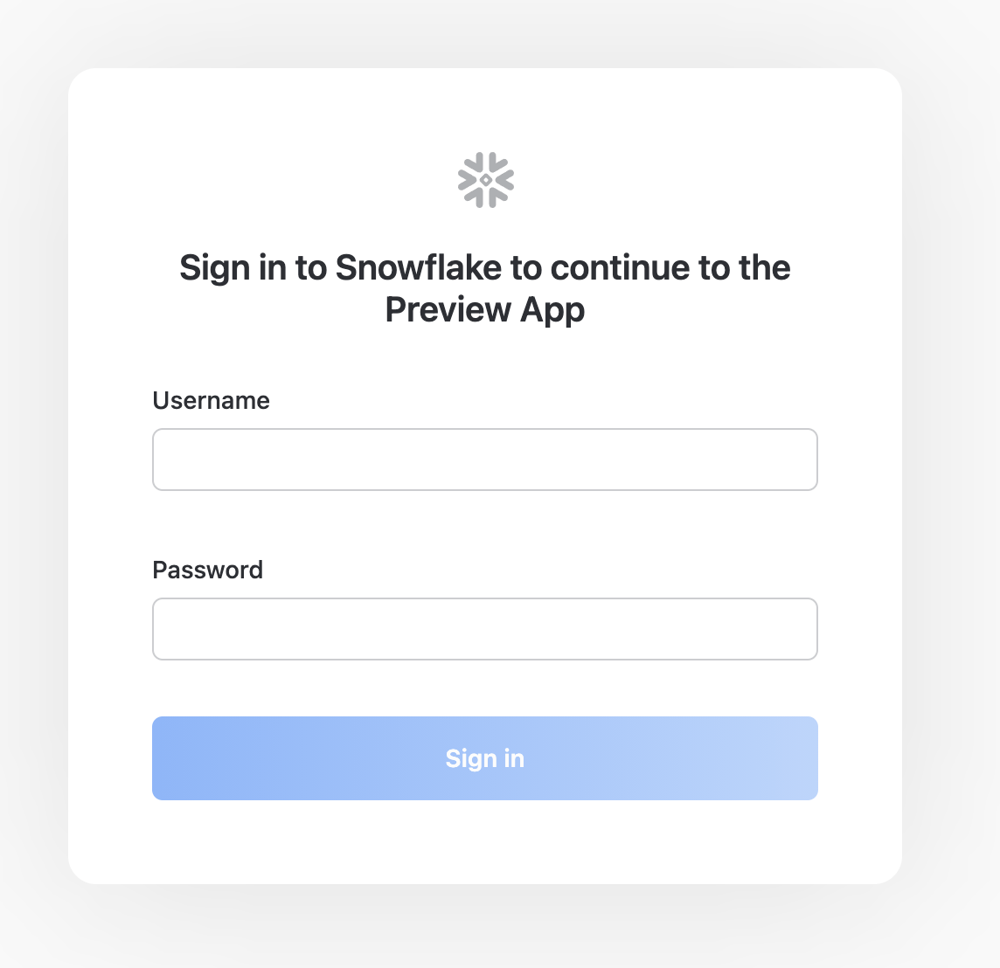

### Snowflake UIを実際に操作してみる

まずはSnowflakeの使い方に慣れていきましょう。このセクションでは、ユーザーインターフェイスの基本コンポーネントについて説明します。左側のナビゲーションバーを上から下へ見ていきましょう。

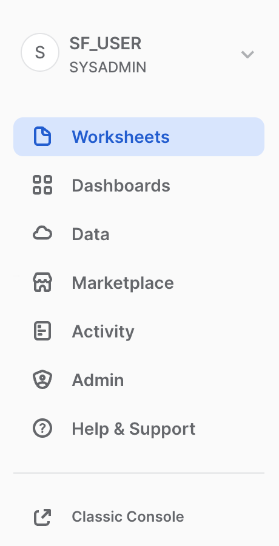

※以下の説明は、Snowflake公式ドキュメントの[Snowsightナビゲーションメニュー](https://docs.snowflake.com/ja/user-guide/ui-snowsight-navigation)を参考にしています。

#### プロジェクト

「**プロジェクト**」は、Notebooks、Streamlit、ダッシュボード、Native Appsなどのツールを使用してデータを分析し、アプリケーションを開発します。データの加工などを行う**ワークスペース**機能もここに内包されています。

#### 取り込み

「**取り込み**」は、コネクターやツールを使用してデータをSnowflakeに取り込みます。AWSやMicrosoft Azureなどといったクラウドサービスからデータを取り込むことができます。


#### 変換

「**変換**」は、動的テーブルとタスクを使用して、データ変換ジョブとパイプラインを監視および管理します。dbtプロジェクトなどの管理もここで行われます。

#### AI & ML

「**AI & ML**」は、Snowflake Cortex AI と Snowflake ML を使用して、非構造化データを分析し、モデルを構築し、インテリジェントエージェントを作成します。

#### モニタリング

「**モニタリング**」は、クエリ履歴、コンテナーサービス、ジョブ履歴、トレースとログを監視します。

#### マーケットプレイス

「**マーケットプレイス**」は、サードパーティのデータ、アプリ、エージェント製品にアクセスできます。

#### カタログ

「**カタログ**」は、アカウント内のデータベース、組織内で公開されているその他のデータ製品やアプリなど、すべてのデータを一箇所で閲覧できます。

#### データの共有

「**データの共有**」は、データ製品を社内 Marketplace に公開したり、他の Snowflake アカウントと非公開で共有したり、Snowflake Marketplace で販売したりできます。

#### ガバナンス& セキュリティ

「**ガバナンス& セキュリティ**」は、アクセス許可の管理、データアクセスの監視、セキュリティポリシーの実施。コンプライアンスを維持しながらデータを保護します。

#### コンピュート

「**コンピュート**」は、SnowflakeでウェアハウスとCompute Poolリソースを管理します。

#### Postgres

「**Postgres**」は、Snowflakeから直接Postgresインスタンスを作成、管理、使用できます。

#### 管理者

「**管理者**」は、アカウントの管理、請求や規約の管理、管理者の連絡先や統合の管理ができます。

続いて、データの加工・集計に必要なワークスペース機能に触れてみましょう。


### ワークスペースを実際に操作してみる

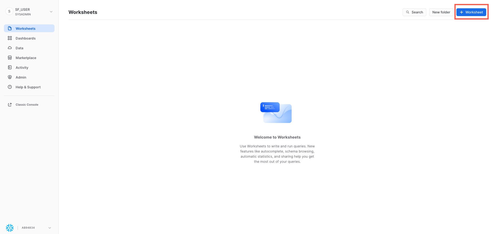

「**プロジェクト**」タブの**ワークスペース**（未移行の一部アカウントでは「ワークシート」）には、SQLクエリの送信、DDLおよびDML操作の実行、クエリまたは操作の完了時の結果表示のためのインターフェイスが用意されています。左上の「**+ Add new**」から、今回は`ノートブック`を作成します。

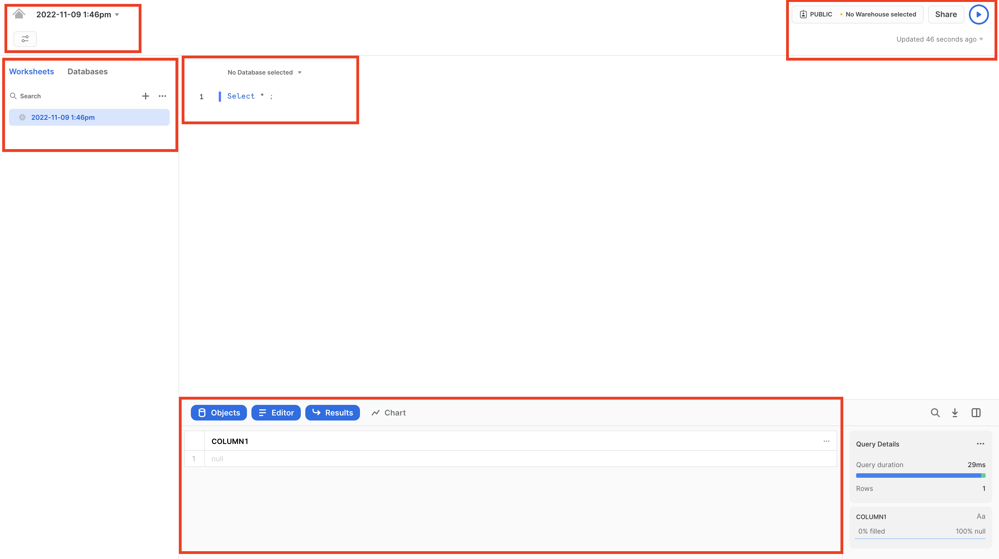

左から2番目のサイドバーには以下の項目があります

- **自分のワークスペース**
  - 現在作業しているワークスペースを示す。
  - ドロップダウンを選択することで既存のワークスペースの切り替えや、新しいワークスペースを作成することができる。
  - **Add new**ボタンからSQL fileやNotebook、dbt Project などをワークスペース内に作成できる。
- **データベースエクスプローラー**
  - データベースの一覧（例：SNOWFLAKE、WEATHER など）を表示できる。
  - ここで対象オブジェクトを選ぶことで、SQL作成時に参照先を素早く確認できる。

このページの各種ペインは、スライダーを調整することでサイズを変更できます。ノートブック内に余裕が必要な場合は、左のパネルのデータベースオブジェクトブラウザを折りたたんでください。本ガイドのスクリーンショットの多くは、このパネルを閉じた状態となっています。

### ラボストーリー

このラボは、米国のニューヨーク市に実在する市全域の自転車シェアリングシステムであるCiti Bikeの分析チームをベースとしています。このチームは、自社の自転車利用者についての理解を深め、利用者に最高のサービスを提供する方法を知るために、社内のトランザクションシステムからのデータについて分析を実行したいと考えています。

まず私たちは、自転車利用者のトランザクションから得られた構造化された`.csv`データをSnowflakeにロードします。その後、オープンソースの半構造化JSON気象データを利用して、自転車の利用回数と天候に相関関係があるかを判断していきます。

<!-- ------------------------ -->
## データロードの準備


構造化されたCiti Bike利用者のトランザクションデータをSnowflakeにロードする準備から始めましょう。

このセクションでは、以下の手順を、順を追って説明していきます。

- データベースとテーブルを作成する。
- 外部ステージを作成する。
- データのファイル形式を作成する。

> 
> **データをSnowflakeに取り込む** 多くのロケーションからSnowflakeにデータを取り込むには多数の方法があります。たとえば、COPYコマンド、Snowpipeの自動取り込み、外部コネクタ、サードパーティのETL/ELTソリューションなどです。Snowflakeへのデータの取り込みに関する詳細については、[Snowflakeドキュメント](https://docs.snowflake.com/guides-overview-loading-data)を参照してください。このラボでは、COPYコマンドとAWS S3ストレージを使用してデータを手動でロードします。実際のシナリオでは、自動化プロセスまたはETLソリューションを使用する可能性が高いでしょう。

使用するデータは、Citi Bike（NYC）によって提供された自転車シェアのデータです。データは、米国西部リージョンのAmazon AWS S3バケットにエクスポートされ、事前設定されています。データは、走行時間、ロケーション、ユーザータイプ、性別、年齢などの情報で構成されています。AWS S3上では、このデータは6,150万行、377個のオブジェクト、圧縮サイズ1.9GBで表されています。

以下は、Citi Bike（CSV）データファイルのスニペットです。

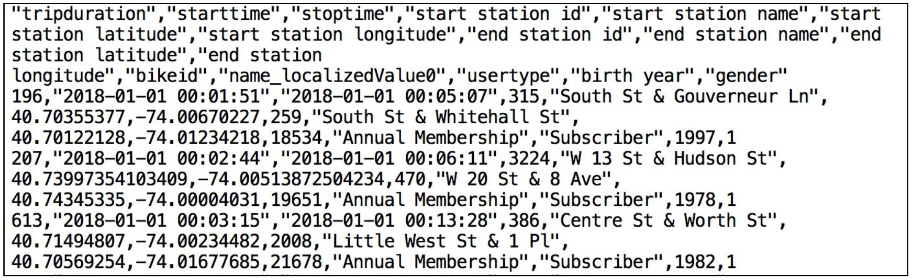

このカンマ区切り形式のファイルには、単一のヘッダーラインがあり、ヘッダーラインに含まれるフィールドの見出しを含め、すべての文字列値がダブルクォーテーションで囲まれています。これは、このセクションの後半で、このデータを格納するSnowflakeテーブルを構成する際に重要になります。

### データベースとテーブルを作成する

まず、構造化データのロードに使用する`CITIBIKE`という名前のデータベースを作成しましょう。

左下のアカウントマークをクリックし、「**ロールの切り替え** 」> 「**SYSADMIN**」で自分の名前を選択し、現在SYSADMINロールを使用していることを確認してください。

「**カタログ**」タブの「**データベースエクスプローラー**」を選択します。「**作成**」をクリックし、データベースに`CITIBIKE`という名前を付けて「**作成**」をクリックします。

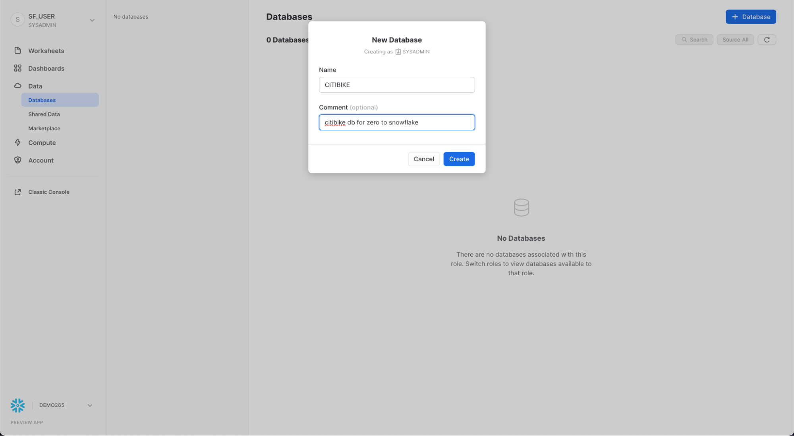

「**ワークスペース**」に移動します。[ワークスペースを実際に操作してみる](#ワークスペースを実際に操作してみる)で作成したノートブックが表示されます。

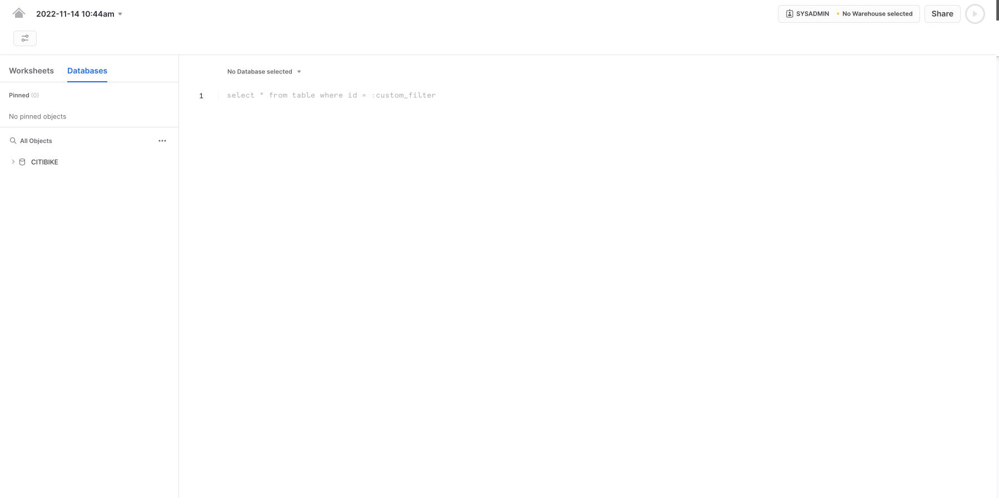

次にノートブックのSQLなどを実行できるようにするために画面中央上の**Connect**ボタンを押します。

TODO 何かしらの画像をここで入れる

**Connect**ボタンが「Connected」になったのち、ノートブック内のコンテキストを適切に設定します。画面右端の**Share**ボタンの左にある家マークをクリックし、コンテキストメニューを表示します。ここで、各ノートブックから表示および実行できるエレメントを制御します。ここでは、UIを使用してコンテキストを設定します。このラボの後半では、ノートブック内のSQLコマンドを使用して同じことを実行します。

以下のコンテキスト設定を選択します。

ロール：`SYSADMIN`ウェアハウス：`COMPUTE_WH`

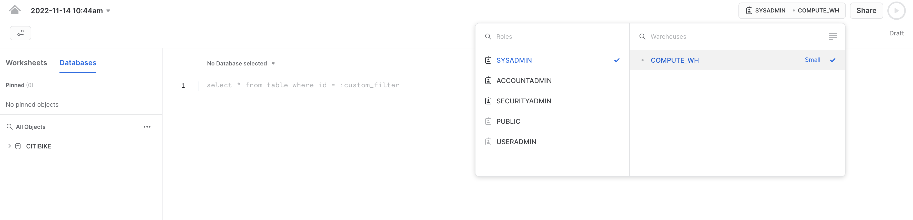

> 
> **データ定義言語（DDL）の操作は無料です。**これまで実行したDDL操作はどれもコンピューティングリソースを必要としません。そのため、すべてのオブジェクトを無料で作成することができます。

ノートブックでの作業をしやすくするために、名前を変更しましょう。中央上にあるタブノートブックのタブをダブルクリックし、`CITIBIKE_ZERO_TO_SNOWFLAKE`に変更します。

次に、カンマ区切りのデータのロードに使用する`TRIPS`という名前のテーブルを作成します。UIを使用する代わりに、ノートブックを使用してテーブルを作成するDDLを実行します。以下のSQLテキストをノートブックにコピーしてください。

```SQL
use database citibike;

create or replace table trips
(tripduration integer,
starttime timestamp,
stoptime timestamp,
start_station_id integer,
start_station_name string,
start_station_latitude float,
start_station_longitude float,
end_station_id integer,
end_station_name string,
end_station_latitude float,
end_station_longitude float,
bikeid integer,
membership_type string,
usertype string,
birth_year integer,
gender integer);
```

> 
> **コマンド実行のための多数のオプション。**UI、「ワークスペース」タブ、またはSnowSQLコマンドラインツールを使用して実行できます。また、お好みのSQLエディターを使用してODBC/JDBC経由で実行することも、その他のコネクタ（Python、Sparkなど）を使用して実行することもできます。前述のとおり、このラボでは、時間を節約するため、ほとんどの操作はUIを使用せずにノートブックで記述済みSQLを実行することで行われます。

SQLテキストの任意の場所にカーソルを合わせ、ノートブックの中央上部にある青い「**すべて実行**」ボタンをクリックしてクエリを実行します。または、キーボードショートカットの[Ctrl]/[Cmd]+[Enter]を使用します。

TRIPSテーブルが作成されたことを確認します。ノートブックの下部の「結果」セクションに、「Table TRIPS successfully created（テーブルTRIPSが問題なく作成されました）」というメッセージが表示されます。

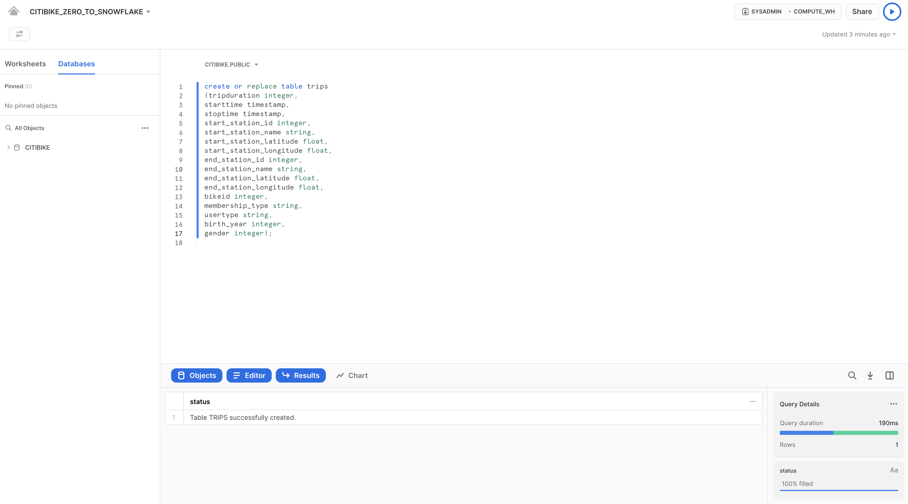

左のナビゲーションバーの「**カタログ**」タブをクリックします。データベースリストで、`CITIBIKE`>`PUBLIC`>「**テーブル**」の順にクリックすると、新たに作成した`TRIPS`テーブルが表示されます。左側にデータベースが表示されない場合は、データベースが隠れている場合がありますので、ブラウザを拡大してください。

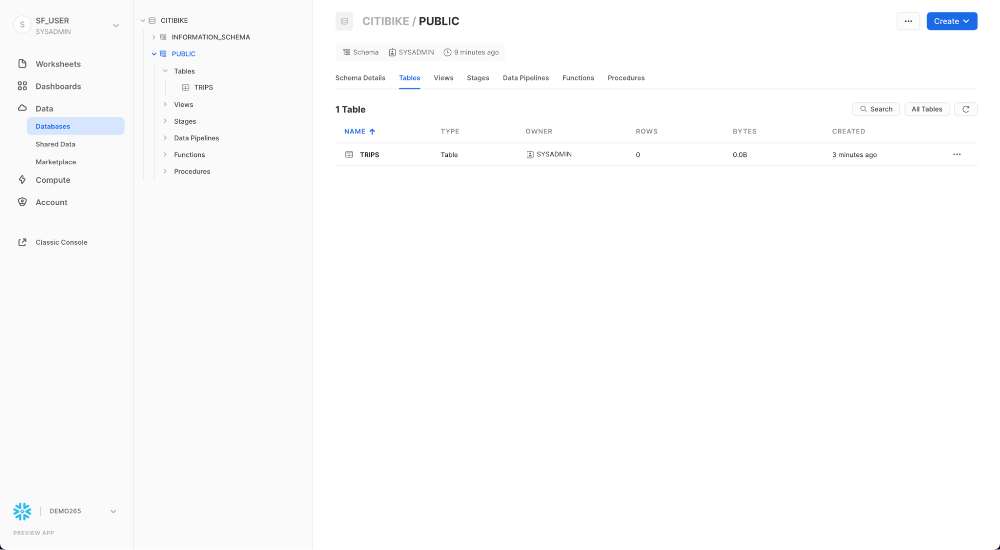

`TRIPS`と「**列**」タブをクリックすると、先ほど作成したテーブル構造が表示されます。

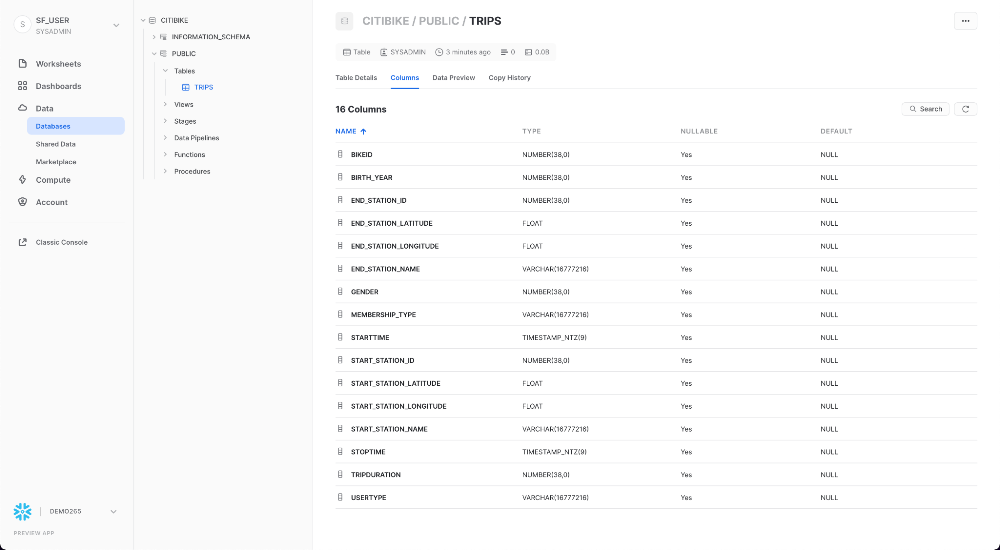

### 外部ステージを作成する

ここでは、公開された外部のS3バケット内ですでにステージングされている、構造化されたカンマ区切りのデータを扱います。このデータを使用する前に、まず外部バケットのロケーションを指定するステージを作成する必要があります。

> 
> このラボではAWS-Eastバケットを使用します。将来のデータのエグレス/転送コストを防ぐために、Snowflakeアカウントと同じクラウドプロバイダーおよびリージョンからステージングロケーションを選択する必要があります。

まず、中央のナビゲーションバーで`CITIBIKE`>`PUBLIC`を選択し、右上の「**作成**」ボタンをクリックします。
出てきた表示の中で「**ステージ**」の「**Amazon S3**」を選択します。
次に、ダイアログで以下の値を記載します。

`<ステージ名>`: `citibike_trips`

`<URL>`: `s3://snowflake-workshop-lab/japan/citibike-trips/`

**注意：**URLの最後には、必ずフォワードスラッシュ（`/`）を入れてください。これを入れておかなければ、後でバケットからデータを読み込む際にエラーが発生します。また、必要のない「credentials = (...)」ステートメントが削除されていることを確認してください。下図のように「--」を使用してコメントアウトすることもできます。create stageコマンドは、下図のようになります。あるいは、3行目を含めないでください。

> 
> このラボのS3バケットは公開であるため、ステートメント内のcredentialsオプションは空のままで構いません。実際のシナリオでは、外部ステージに使用するバケットにはキー情報が必要になるでしょう。

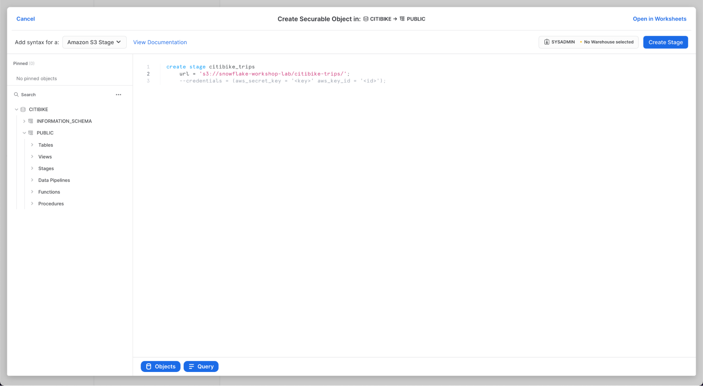

では`citibike_trips`ステージのコンテンツを見ていきましょう。「**ワークスペース**」に戻り、作成した「CITIBIKE_ZERO_TO_SNOWFLAKE」ノートブックを開いて、下図のように、先ほどのコードの下に以下のSQLステートメントを追加して実行します。

```SQL
list @citibike_trips;
```

最下部のペインの結果に、ステージ内のファイルのリストが表示されます。

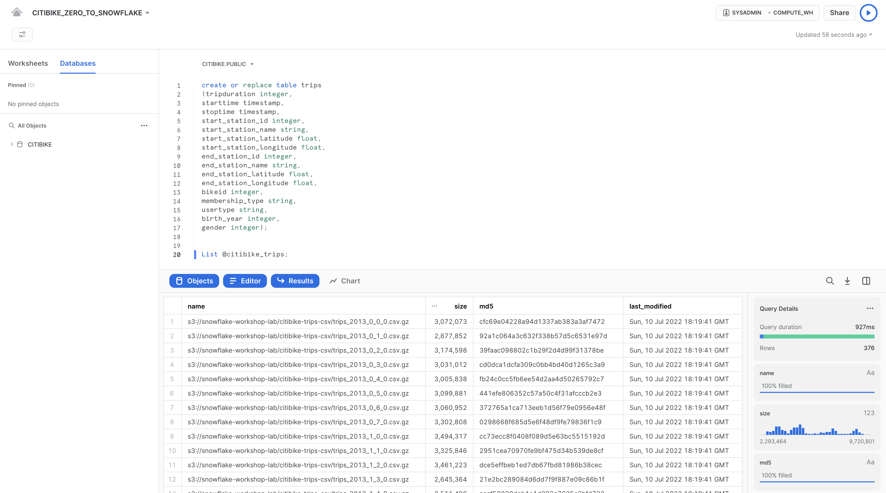

### ファイル形式を作成する

Snowflakeにデータをロードする前に、データ構造に合うファイル形式を作成する必要があります。

ノートブックで、以下のコマンドを追加して実行し、ファイル形式を作成します。

```SQL
--create file format

create or replace file format csv type='csv'
  compression = 'auto' field_delimiter = ',' record_delimiter = '\n'
  skip_header = 0 field_optionally_enclosed_by = '\042' trim_space = false
  error_on_column_count_mismatch = false escape = 'none' escape_unenclosed_field = '\134'
  date_format = 'auto' timestamp_format = 'auto' null_if = ('') comment = 'file format for ingesting data for zero to snowflake';
```

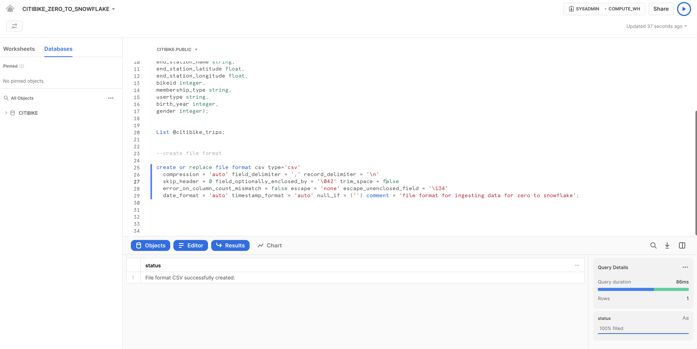

次のコマンドを実行することにより、ファイル形式が正しい設定で作成されていることを確認します。

```SQL
--verify file format is created

show file formats in database citibike;
```

作成されたファイル形式が結果にリスト表示されます。

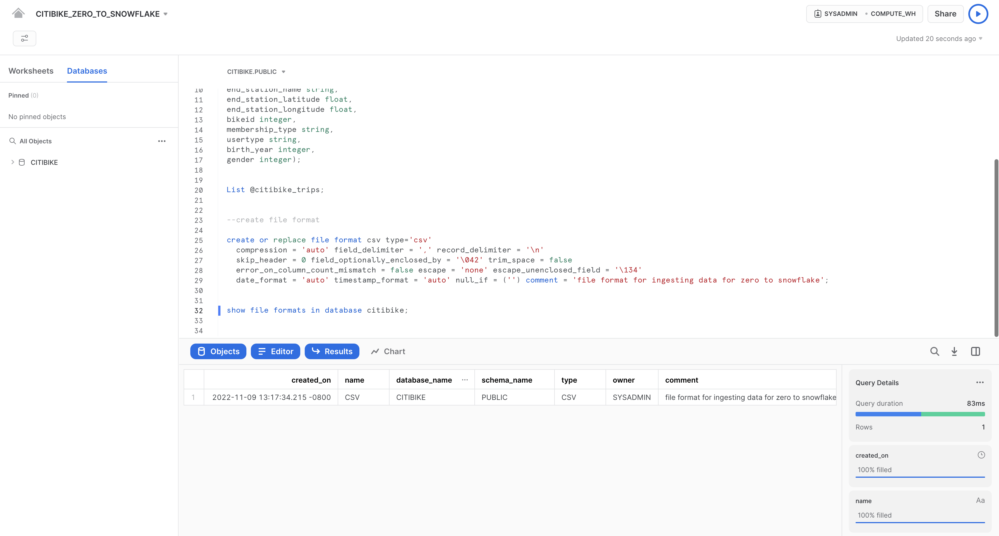

<!-- ------------------------ -->
## データのロード


このセクションでは、仮想ウェアハウスとCOPYコマンドを使用して、前のセクションで作成したSnowflakeテーブルへの構造化データの一括ロードを開始します。

### データロードのためのウェアハウスのサイズ変更と使用

データをロードするにはコンピューティングリソースが必要です。Snowflakeコンピュートノードは仮想ウェアハウスと呼ばれ、データのロード、クエリの実行、DML操作の実行のいずれであっても、ワークロードに応じて動的にサイズを変更できます。それぞれのワークロードは独自のウェアハウスを持つことができるため、リソースの競合はありません。

管理>コンピュートの「**ウェアハウス**」タブへ移動します。ここでは、既存のウェアハウスをすべて表示できるほか、使用状況トレンドの分析も可能です。

右上にある「**+ウェアハウス**」で新しいウェアハウスを素早く追加できます。ただし、今回は既存のウェアハウスであるCOMPUTE_WHを使用します。

`COMPUTE_WH`ウェアハウスの行をクリックします。その後、右上にある**...**（3つのドット）をクリックすると、ウェアハウス上で実行できるアクションが表示されます。

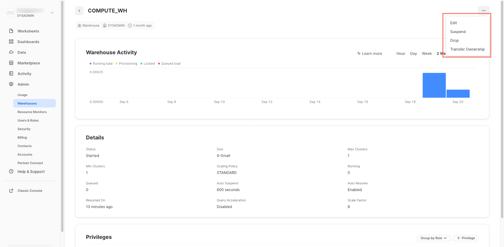

「**編集**」をクリックし、このウェアハウスのオプションとSnowflakeのユニークな機能の一部を実際に確認してみてください。

> 
> このアカウントがSnowflakeエンタープライズエディション（またはそれ以上）を使用していない場合は、以下のスクリーンショットの「**モード**」または「**クラスター**」オプションは表示されません。このラボでは、マルチクラスターウェアハウス機能は使用しませんが、Snowflakeの主な機能として説明します。

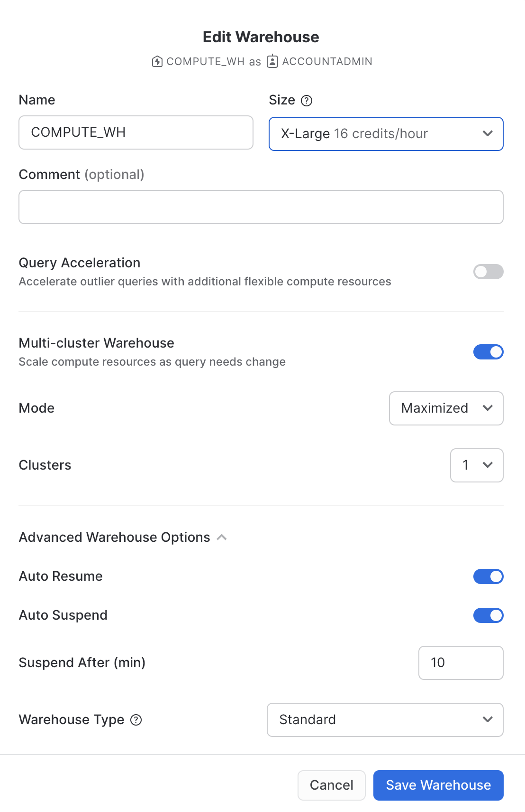

- 「**サイズ**」ドロップダウンでウェアハウスの容量を選択します。大規模なデータロード処理やコンピュートインテンシブなクエリの場合は、より大規模なウェアハウスが推奨されます。サイズは、Snowflakeアカウントがホストされているクラウドプロバイダー（AWS、Azure、またはGCP）からプロビジョニングされる基礎となるコンピューティングリソースの量に直結します。また、ウェアハウスが1時間稼働するごとに消費するクレジット数もこのサイズによって決まります。サイズが大きくなればなるほど、クラウドプロバイダーからウェアハウスに割り当てられるコンピューティングリソースの量とウェアハウスが消費するクレジットの数が多くなります。たとえば、`4X-Large`設定では、1時間ごとに128クレジットが消費されます。このサイズ設定は、いつでもワンクリックで変更できます。

- Snowflakeエンタープライズエディション（またはそれ以上）を使用している場合は、「**クエリアクセラレーション**」オプションを使用できます。このオプションをウェアハウスに対して有効にすると、通常のクエリよりも多くのリソースを使用する外れ値クエリの影響を減らすことで、ウェアハウス全体のパフォーマンスを向上させることができます。これは無効のままにしておきます。

- Snowflakeエンタープライズエディション（またはそれ以上）を使用しており、「**マルチクラスターウェアハウス**」オプションが有効になっている場合、追加のオプションが表示されます。ここでは、ウェアハウスがコンピューティングリソースのクラスターを複数（最大10クラスター）使用するように設定できます。たとえば、`4X-Large`マルチクラスターウェアハウスに最大クラスターサイズの10が割り当てられた場合、そのウェアハウスは基礎となるコンピューティングリソースの10倍までスケールアウトできます（しかも数秒で！）。ただし、この場合、10クラスターすべてが1時間フル稼働すると、ウェアハウスが消費するクレジット数は1280に増えることに注意してください（128クレジット/時間 x 10クラスター）。マルチクラスターは、多くのビジネスアナリストが同じウェアハウスを使用してさまざまなクエリを同時に実行するような同時実行シナリオに最適です。このユースケースでは、さまざまなクエリが高速に実行されるように複数のクラスターに割り当てられます。

- 「**詳細ウェアハウスオプション**」では、使用していないウェアハウスを自動的に一時停止し、クレジットを無駄に消費しないようにするオプションがあります。一時停止されたウェアハウスを自動的に再開するオプションもあります。このオプションが有効な場合、新しいワークロードがウェアハウスに送信されると、自動的に再開されます。この機能によって、Snowflakeの効率的な「従量課金」モデルが可能となり、リソースが必要になったときにスケールアップし、不要になったときに自動的にスケールダウンするかオフにすることができるため、アイドリング状態のリソースをほぼ完全に排除できます。さらに、ウェアハウスのタイプを標準からSnowpark用に最適化されたものに変更するオプションもあります。Snowpark用に最適化されたウェアハウスは、ノードあたり16倍のメモリを提供し、単一の仮想ウェアハウスノードでストアドプロシージャを使用するMLトレーニングのユースケースなど、大規模なメモリ要件を持つワークロードに推奨されます。ここでは、タイプを標準のままにしておきます

> 
> **Snowflakeコンピュートとその他のデータウェアハウスの比較** 先ほど説明した仮想ウェアハウスとコンピュート機能の多く（仮想ウェアハウスの作成、スケールアップ、スケールアウト、自動サスペンド/再開機能など）は、Snowflakeでは簡単に使用でき、数秒で実行できます。オンプレミスデータウェアハウスでは、これらの機能を使用することは、不可能とは言えないまでもはるかに困難です。大量の物理ハードウェア、ワークロードの急増に対応するためのハードウェアのオーバープロビジョニング、かなりの量の設定作業、その他の課題への対処が必要になるからです。他のクラウドベースデータウェアハウスでさえも、Snowflakeのように設定に多大な労力と時間をかけずにスケールアップやスケールアウトを行うことはできません。

**警告 - 支出に注意してください。**このラボ中またはその終了後に、正当な理由なく以下の操作を実行しないよう注意してください。これらの操作を行うと、400ドルの無料クレジットを必要以上に早く使い切ってしまう可能性があります。

- 自動サスペンドを無効にしないでください。自動サスペンドが無効化されていると、ウェアハウスは使用されていなくても稼働し続け、クレジットを消費し続けます。
- ワークロードを考慮し、過剰なウェアハウスサイズを使用しないでください。ウェアハウスが大きいほど、消費されるクレジットが多くなります。

この仮想ウェアハウスを使用して、CSVファイルの構造化データ（AWS S3バケットに格納）をSnowflakeにロードすることになります。しかし、まずウェアハウスのサイズを変更して、使用するコンピューティングリソースを増やすことにします。ロード後、所要時間を記録してください。このセクションの後のステップで、さらに大きなウェアハウスで同じロード操作を再実行し、ロード時間が短縮していることを確認します。

このデータウェアハウスの**サイズ**を`X-Small`から`Small`へ変更し、その後「**ウェアハウスを保存**」ボタンをクリックします。

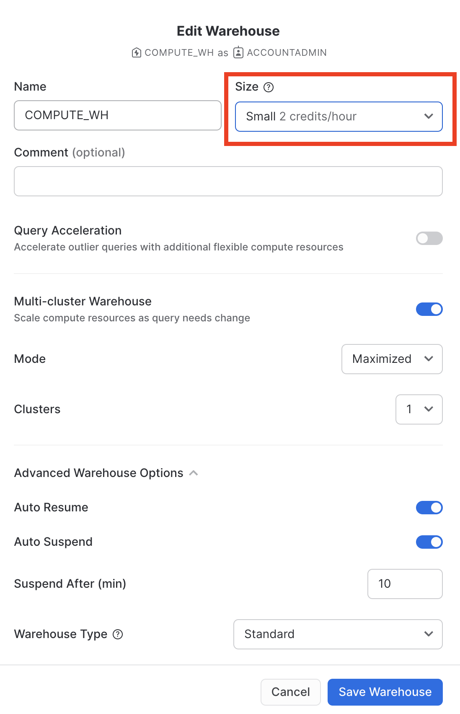

### データのロード

これで、COPYコマンドを実行し、先ほど作成した`TRIPS`テーブルにデータをロードできるようになりました。

「**プロジェクト**」タブで`CITIBIKE_ZERO_TO_SNOWFLAKE`ノートブックに戻ります。ノートブックのコンテキストが以下のように正しく設定されていることを確認してください。

ロール：`SYSADMIN` ウェアハウス：`COMPUTE_WH` データベース：`CITIBIKE` スキーマ = `PUBLIC`

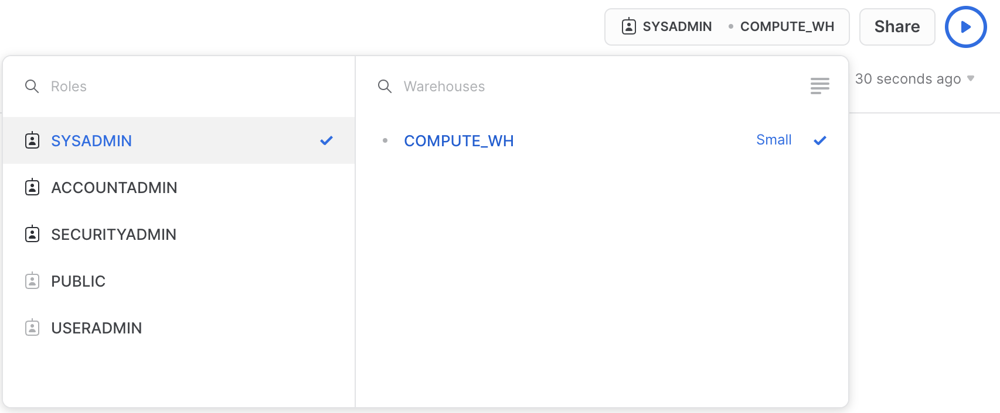

ノートブックで以下のステートメントを実行し、ステージングされたデータをテーブルにロードします。これには30秒ほどかかる場合があります。

```SQL
copy into trips from @citibike_trips file_format=csv PATTERN = '.*csv.*' ;
```

結果ペインに、ロードされた各ファイルのステータスが表示されます。ロードが完了後に、クエリ結果のウィンドの**iマーク**をクリックし、**クエリID**をのページに遷移するとステートメントのさまざまなステータス、エラー統計、および視覚化を確認できるようになります。

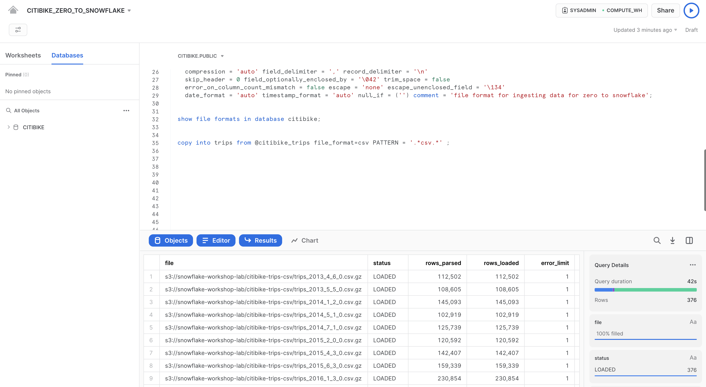

また、「**クエリプロファイル**」タブを選択すると、クエリ実行時のステップ、クエリの詳細、最もコストの高いノード、およびその他の統計情報を記録します。

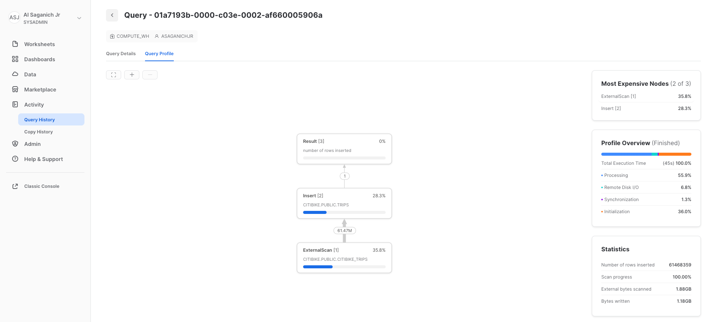

次に、より大きなウェアハウスで`TRIPS`テーブルをリロードし、追加されたコンピューティングリソースがロード時間に与える影響を見てみましょう。

ノートブックに戻り、TRUNCATE TABLEコマンドを使用して、テーブルからすべてのデータとメタデータを消去します。

```SQL
truncate table trips;
```

以下のコマンドを実行して、テーブルが空になったことを確認します。

```SQL
--verify table is clear
select * from trips limit 10;
```

結果には「Query produced no results（クエリで結果が生成されませんでした）」と表示されます。

次のALTER WAREHOUSEを使用してウェアハウスのサイズを`large`に変更します。

```SQL
--change warehouse size from small to large (4x)
alter warehouse compute_wh set warehouse_size='large';
```

次のSHOW WAREHOUSESを使用して変更を確認します。

```SQL
--load data with large warehouse
show warehouses;
```

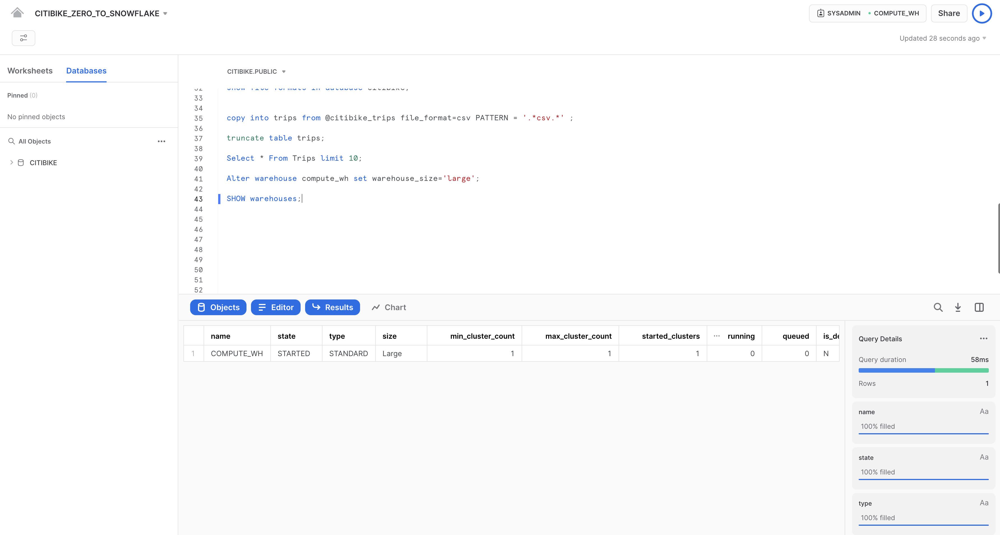

ロードが完了したら、「**クエリ**」ページに戻ります（**ホーム**アイコン、「**アクティビティ**」、「**クエリ履歴**」の順にクリック）。2つのCOPY INTOコマンドの時間を比較します。`Large`ウェアハウスを使用してロードするほうが大幅に速いことが分かります。

### データアナリティクス用の新しいウェアハウスの作成

ラボストーリーに戻り、Citi Bikeチームがデータロード/ETLワークロードと、BIツールを使用してSnowflakeをクエリする分析エンドユーザーの間でリソースの競合が発生しないようにしたいと考えているとしましょう。前述したように、Snowflakeでは、適切なサイズのさまざまなウェアハウスを各種ワークロードに割り当てることで、これを簡単に実現できます。Citi Bikeには、すでにデータロード用のウェアハウスがあるため、分析を実行するエンドユーザー用に新しいウェアハウスを作成しましょう。次のセクションでは、このウェアハウスを使用して分析を実行します。

「**ウェアハウス**」画面に移動し、「**+ウェアハウス**」をクリックして新しいウェアハウスの名前を\`ANALYTICS_WH\`とし、サイズを`Large`に設定します。

Snowflakeエンタープライズエディション（またはそれ以上）を使用しており、「**マルチクラスターウェアハウス**」が有効になっている場合、追加の設定が表示されます。

- 「**最大クラスター**」が`1`に設定されていることを確認します。
- その他の設定はすべてデフォルトのままにしておきます。

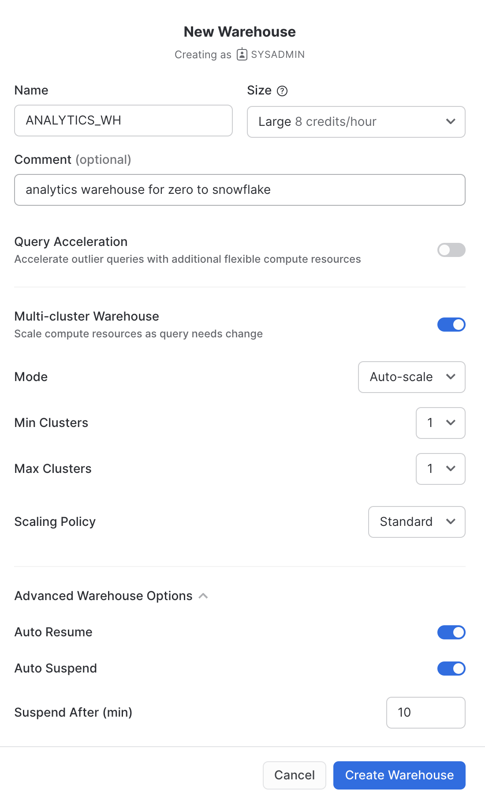

「**ウェアハウスを作成**」ボタンをクリックし、ウェアハウスを作成します。

<!-- ------------------------ -->
## クエリ、結果キャッシュ、クローンの操作


前の演習では、SnowflakeのCOPY一括ローダーコマンドと`COMPUTE_WH`仮想ウェアハウスを使用して、2つのテーブルにデータをロードしました。今回は、Citi Bikeのアナリティクスユーザーとして、ノートブックと2つ目のウェアハウス`ANALYTICS_WH`を使用して、これらのテーブルのデータをクエリします。

> 
> **実際のロールとクエリ作業** 実際の企業内では、アナリティクスユーザーはSYSADMINとは異なるロールを担うことが多いでしょう。ラボをシンプルに保つため、このセクションでは引き続きSYSADMINロールを使用していきます。さらに、クエリは通常、Tableau、Looker、PowerBIなどのビジネスインテリジェンスプロダクトで実行されます。より高度な分析が必要な場合は、Datarobot、Dataiku、AWS Sagemakerなどのデータサイエンスツールを使用してSnowflakeをクエリできます。JDBC/ODBC、Spark、Python、その他のサポート対象のプログラムインターフェイスを利用するテクノロジーであれば、Snowflakeのデータに対して分析を実行することができます。このラボをシンプルに保つため、すべてのクエリはSnowflakeノートブックを使用して実行されます。

### クエリの実行

**CITIBIKE_ZERO_TO_SNOWFLAKE**ノートブックに移動し、前のセクションで作成した新しいウェアハウスを使用するよう、ウェアハウスを変更します。ノートブックのコンテキストは次のようになっているはずです。

ロール：`SYSADMIN` ウェアハウス：`ANALYTICS_WH (L)` データベース：`CITIBIKE` スキーマ = `PUBLIC`

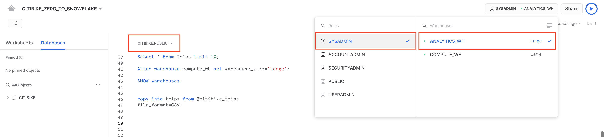

以下のクエリを実行し、`trips`データのサンプルを表示します。

```SQL
select * from trips limit 20;
```

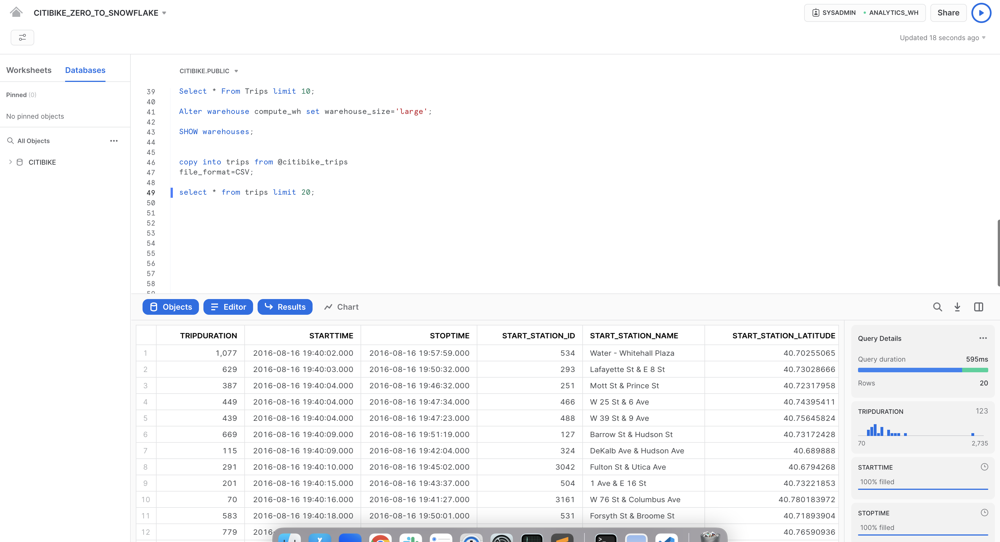

では、Citi Bikeの利用状況に関する基本的な時間別統計をいくつか見ていきましょう。ノートブックで以下のクエリを実行します。それぞれの時間の走行回数、平均走行時間、平均走行距離が表示されます。

```SQL
select date_trunc('hour', starttime) as "date",
count(*) as "num trips",
avg(tripduration)/60 as "avg duration (mins)",
avg(haversine(start_station_latitude, start_station_longitude, end_station_latitude, end_station_longitude)) as "avg distance (km)"
from trips
group by 1 order by 1;
```

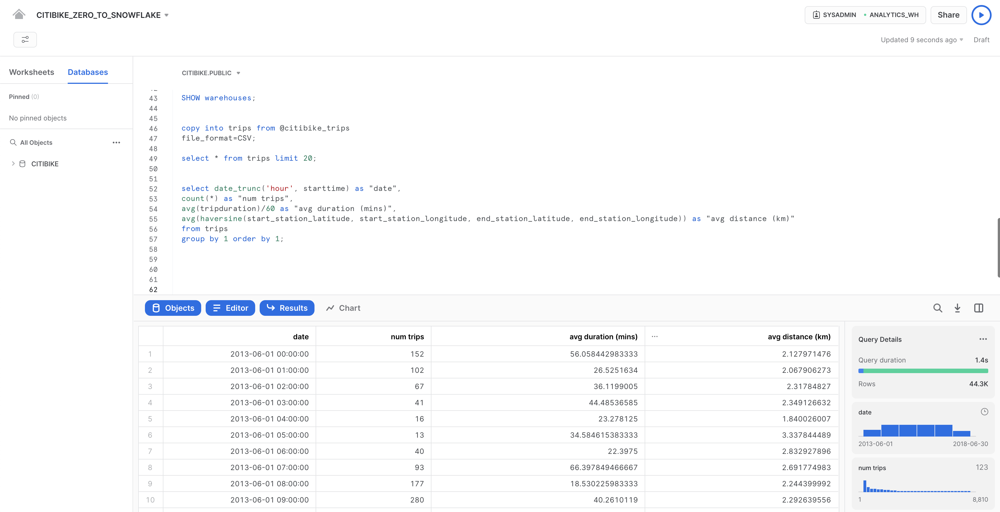

### 結果キャッシュの使用

Snowflakeには、過去24時間に実行されたすべてのクエリの結果を保持する結果キャッシュがあります。これはウェアハウスをまたいで利用可能であるため、あるユーザーに返されたクエリ結果を、基礎データが変更されていない限り、同じクエリを実行したシステム上の他のどのユーザーでも利用することができます。このようにクエリ結果を繰り返し返すことで、クエリの実行が非常に高速になるだけでなく、コンピュートクレジットの消費も回避できます。

まったく同じクエリを再度実行し、結果キャッシュの動作を見てみましょう。

```SQL
select date_trunc('hour', starttime) as "date",
count(*) as "num trips",
avg(tripduration)/60 as "avg duration (mins)",
avg(haversine(start_station_latitude, start_station_longitude, end_station_latitude, end_station_longitude)) as "avg distance (km)"
from trips
group by 1 order by 1;
```

右側の「**クエリの詳細**」ペインで、2回目のクエリ実行速度が大幅に向上していることに注意してください。これは、結果がキャッシュされているためです。

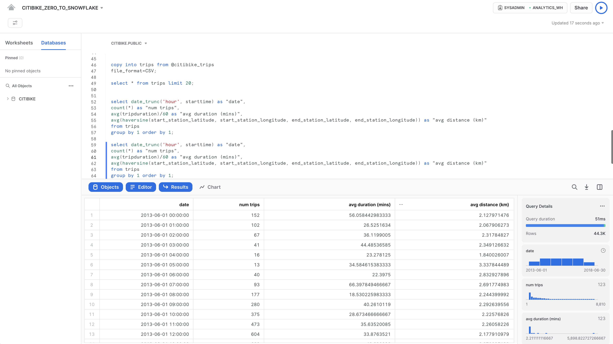

### 別のクエリの実行

次に、以下のクエリを実行し、どの月が最も忙しいかを確認してみましょう。

```SQL
select
monthname(starttime) as "month",
count(*) as "num trips"
from trips
group by 1 order by 2 desc;
```

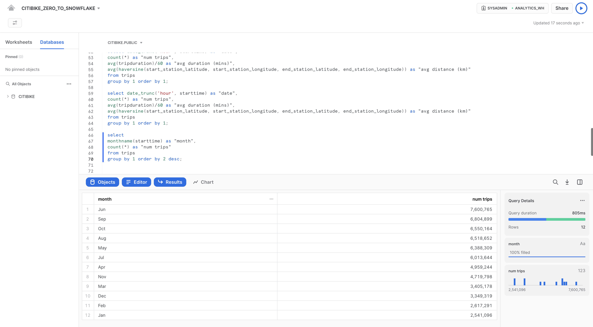

### テーブルの複製

Snowflakeを使用すると、テーブル、スキーマ、およびデータベースのクローンを数秒で作成できます。これは、「ゼロコピークローン」とも呼ばれます。クローンが作成されると、Snowflakeは、ソースオブジェクト内に存在するデータのスナップショットを取得し、クローンオブジェクトでそれを利用できるようにします。クローンオブジェクトは書き込み可能であり、クローン元から独立しています。つまり、ソースオブジェクトまたはクローンオブジェクトのどちらかに加えられた変更は、もう一方のオブジェクトには反映されないということです。

ゼロコピークローニングの一般的なユースケースは、本番環境のクローンを作成し、開発およびテストチームがテストや実験に使用できるようにすることです。こうすることで、本番環境に悪影響が及ぶことがなくなると同時に、2つの別個の環境を設定して管理する必要がなくなります。

> 
> **ゼロコピークローニング** ゼロコピークローニングの大きな利点は、基礎データはコピーされないという点にあります。変更されるのは、基礎データへのポインタとメタデータのみです。したがって、クローンは「ゼロコピー」であり、データがクローンされてもストレージ要件が2倍になることはありません。ほとんどのデータウェアハウスではこれを行うことはできませんが、Snowflakeでは簡単にできます。

ノートブックで以下のコマンドを実行し、`trips`テーブルの開発（dev）テーブルクローンを作成します。

```SQL
create table trips_dev clone trips;
```

データベースエクスプローラーのウィンドの右にある更新マークをクリックし、データベース情報の更新を行います。`CITIBIKE`データベースの下のオブジェクトツリーを展開し、`trips_dev`という名前の新規テーブルが表示されていることを確認します。これで、開発チームは、`trips`テーブルや他のオブジェクトに影響を与えることなく、更新や削除も含め、このテーブルに対してどのような操作でも実行することができるようになります。

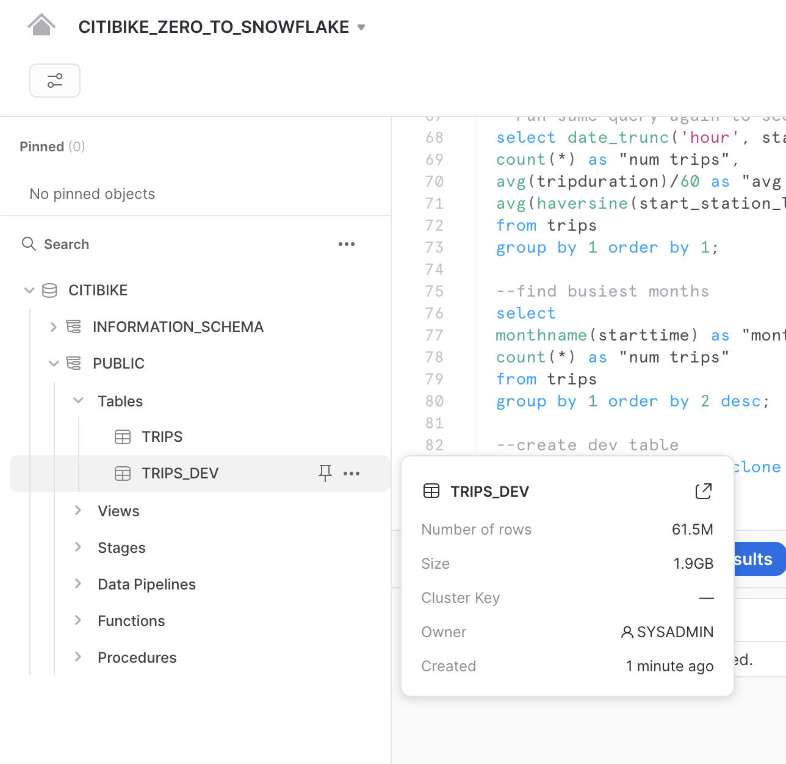

<!-- ------------------------ -->
## 半構造化データ、ビュー、結合の操作


> 
> このセクションでは、追加データをロードする必要があるため、データロードをおさらいしつつ、半構造化データのロードも紹介していきます。

ラボの例に戻りましょう。Citi Bikeの分析チームは天候が自転車の利用回数にどのような影響を与えるかを見極めたいと考えています。そのため、このセクションでは次のことを行います。

- 公開されているS3バケットにある半構造化JSON形式の気象データをロードする。
- ビューを作成し、SQLドット表記を使用してJSONデータをクエリする。
- 前にロードした`TRIPS`データにJSONデータを結合するクエリを実行する。
- 気象データと自転車の利用回数データを分析し、それらの関係を見極める。

JSONデータは、*MeteoStat*によって提供される気象情報で構成されており、2016年7月5日から2019年6月25日までのニューヨーク市の歴史的条件を詳細に示しています。また、AWS S3上でステージングされており、データは75000行、36個のオブジェクトで構成され、1.1MBに圧縮されています。テキストエディタで見ると、GZファイルの未加工JSONは以下のようになります。

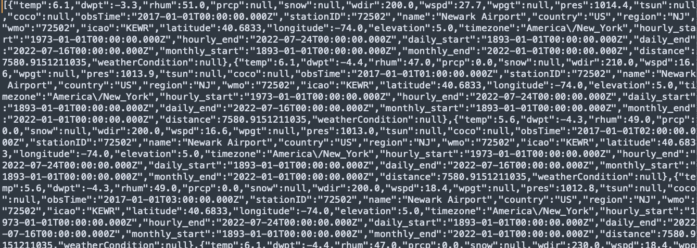

> 
> **半構造化データ** Snowflakeでは、JSON、Parquet、Avroなどの半構造化データを変換なしで簡単にロードしたりクエリしたりすることができます。これはSnowflakeの重要な機能です。現在生成されているビジネス関連データの多くが半構造化データであり、従来のデータウェアハウスの多くは、そのようなデータを簡単にロードしたりクエリしたりできないからです。Snowflakeでは、それを簡単に実行できます。

### データ用に新しいデータベースとテーブルを作成する

まず、自分のワークスペースウィンドウの**Add new**をクリックし、新しいノートブックを作成しましょう。

次に半構造化JSONデータの格納に使用する`WEATHER`という名前のデータベースを作成します。

```SQL
create database weather;
```

以下のUSEコマンドを実行し、ノートブックのコンテキストを適切に設定します。

```SQL
use role accountadmin;

use warehouse compute_wh;

use database weather;

use schema public;
```

> 
> **複数コマンドの実行** それぞれのコマンドを個別に実行する必要があることに注意してください。ただし、すべてのコマンドを選択してから、「**再生/実行**」ボタンをクリックする（あるいはキーボードのショートカットを使用する）ことで、それらをまとめて順番に実行することができます。

次に、JSONデータのロードに使用する`JSON_WEATHER_DATA`という名前のテーブルを作成しましょう。ノートブックで、次のCREATE TABLEコマンドを実行します。

```SQL
create table json_weather_data (v variant);
```

なお、Snowflakeには、JSONオブジェクト全体を単一の行として格納し、最終的にオブジェクトを直接クエリできるようにする、`VARIANT`という名前の特殊な列データ型があります。

> 
> **半構造化データマジック** VARIANTデータ型により、Snowflakeはスキーマを事前に定義することなく半構造化データを取り込むことができます。

データベースエクスプローラーで、テーブル`JSON_WEATHER_DATA`が作成されていることを確認します。

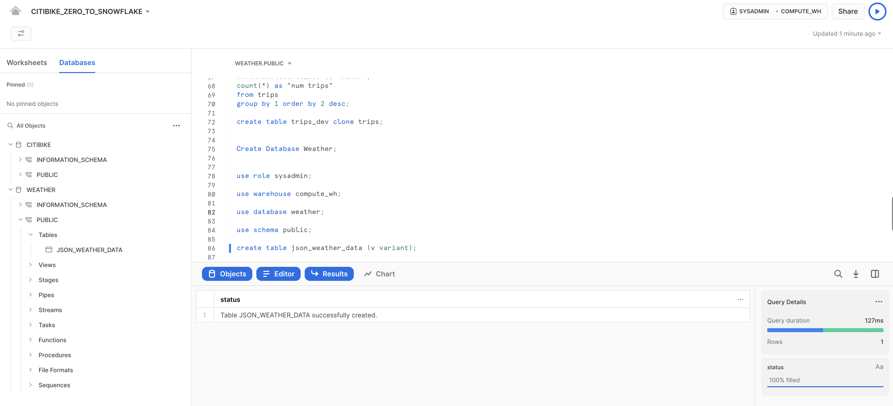

### 別の外部ステージの作成

`CITIBIKE_ZERO_TO_SNOWFLAKE`ノートブックで、以下のコマンドを使用して、半構造化JSONデータがAWS S3に保存されているバケットをポイントするステージを作成します。

```SQL
create stage nyc_weather
url = 's3://snowflake-workshop-lab/zero-weather-nyc';
```

では`nyc_weather`ステージのコンテンツを見ていきましょう。以下のLISTコマンドを実行して、ファイルのリストを表示します。

```SQL
list @nyc_weather;
```

結果ペインにS3からの`.gz`ファイルのリストが表示されます。

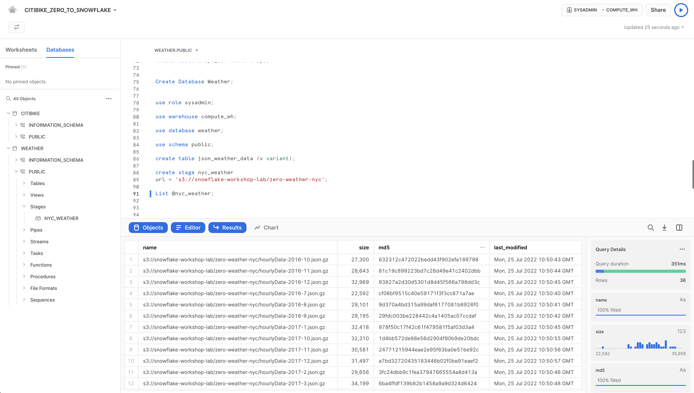

### 半構造化データのロードと検証

このセクションでは、ウェアハウスを使用して、S3バケットからのデータを先ほど作成した`JSON_WEATHER_DATA`テーブルにロードします。

`CITIBIKE_ZERO_TO_SNOWFLAKE`ノートブックで、以下のCOPYコマンドを実行し、データをロードします。

なお、`FILE FORMAT`オブジェクトはコマンド内のインラインで指定できます。構造化データをCSV形式でロードした前のセクションでは、CSV構造に対応するファイル形式を定義する必要がありました。ここでのJSONデータは整形式であるため、JSONタイプを指定するだけで、すべてのデフォルト設定を使用することができます。

```SQL
copy into json_weather_data
from @nyc_weather 
    file_format = (type = json strip_outer_array = true);
```

各ファイルのステータスが`LOADED`となっていること確認します。

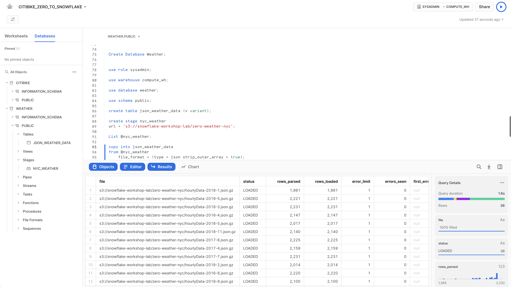

では、ロードされたデータを見ていきましょう。

```SQL
select * from json_weather_data limit 10;
```

いずれかの行をクリックすると、右側のパネルにフォーマットされたJSONが表示されます。

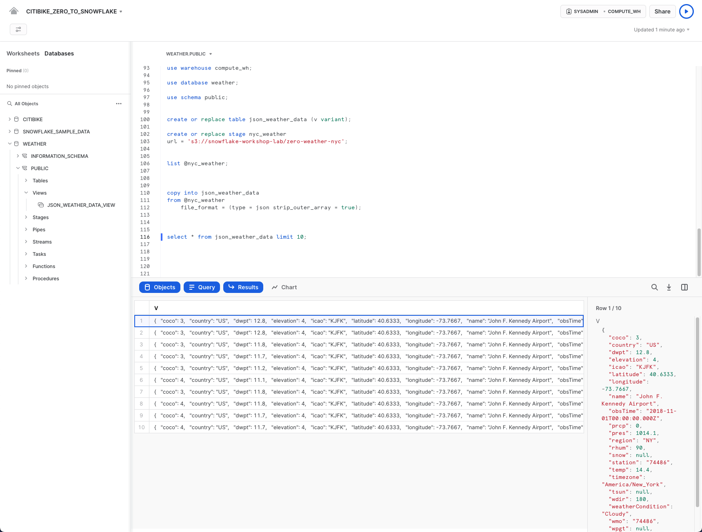

パネル内の表示を閉じてクエリの詳細を再度表示するには、パネルの右隅にカーソルを合わせると表示される**X**（閉じる）ボタンをクリックします。

### ビューの作成と半構造化データのクエリ

次に、Snowflakeでビューを作成し、SQLを使用してJSONデータを直接クエリする方法を見ていきましょう。

> 
> **ビューとマテリアライズドビュー** ビューを使用すると、クエリの結果にテーブルのようにアクセスできます。ビューを使用すると、エンドユーザーにデータを分かりやすく提示したり、エンドユーザーがソーステーブルで表示できる内容を制限したり、よりモジュール化されたSQLを書いたりすることができるようになります。Snowflakeは、マテリアライズドビューにも対応しています。このビューではクエリ結果がテーブルであるかのように格納されます。それによってアクセスは迅速化しますが、これにはストレージスペースが必要となります。Snowflakeエンタープライズエディション（またはそれ以上）を使用していれば、マテリアライズドビューを作成し、それをクエリすることができます。

以下のコマンドを実行して、半構造化JSON気象データの列ビューを作成します。こうすることで、アナリストによるデータの理解とクエリの実行が容易になります。`station_id`の`72502`という値は、ニューアーク空港に対応しています。ここは、全期間の気象条件を有する最も近いステーションです。

```SQL
// create a view that will put structure onto the semi-structured data
create or replace view json_weather_data_view as
select
    v:obsTime::timestamp as observation_time,
    v:station::string as station_id,
    v:name::string as city_name,
    v:country::string as country,
    v:latitude::float as city_lat,
    v:longitude::float as city_lon,
    v:weatherCondition::string as weather_conditions,
    v:coco::int as weather_conditions_code,
    v:temp::float as temp,
    v:prcp::float as rain,
    v:tsun::float as tsun,
    v:wdir::float as wind_dir,
    v:wspd::float as wind_speed,
    v:dwpt::float as dew_point,
    v:rhum::float as relative_humidity,
    v:pres::float as pressure
from
    json_weather_data
where
    station_id = '72502';
```

このコマンドでは、SQLドット表記である`v:temp`を使用してJSONオブジェクト階層内の下位レベルの値を取得します。これにより、各フィールドをリレーショナルテーブルの列のように扱うことができます。

新しいビューは、データベースエクスプローラーの`WEATHER` > `PUBLIC` > 「**ビュー**」の下に`JSON_WEATHER_DATA`として表示されます。このビューを表示するには、オブジェクトブラウザの展開または更新が必要になる場合があります。

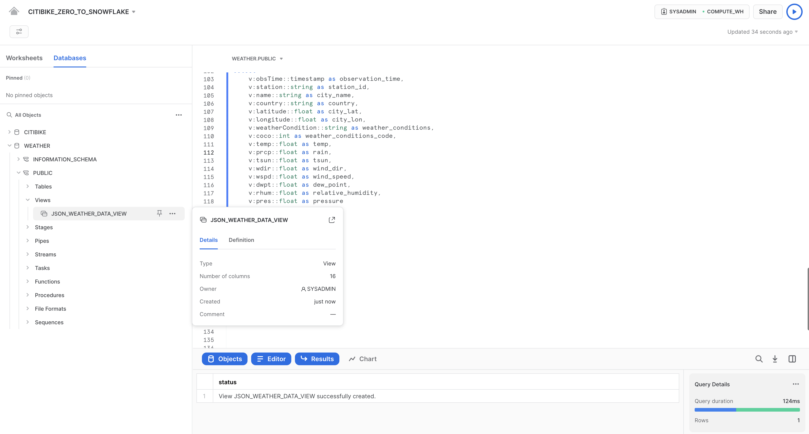

以下のクエリでビューを確認します。

```SQL
select * from json_weather_data_view
where date_trunc('month',observation_time) = '2018-01-01'
limit 20;
```

結果は、通常の構造化データソースと同じように見えることに注意してください。皆さんの結果セットでは`observation_time`の値が異なる場合があります。

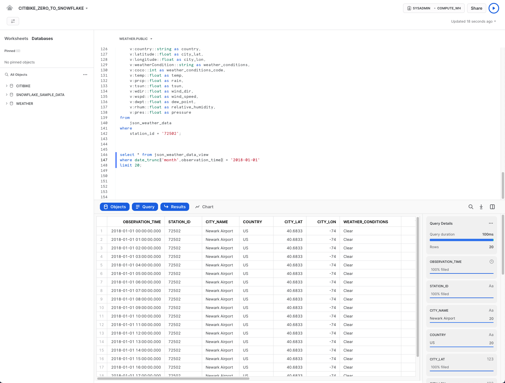

### 結合操作を使用してデータセットに対して相関させる

ここで、天候が自転車の利用回数にどのような影響を与えるかという当初の質問に答えるために、JSON気象データを`CITIBIKE.PUBLIC.TRIPS`データに結合します。

以下のクエリを実行して、`WEATHER`を`TRIPS`に結合し、特定の天候条件に関連する走行回数をカウントします。

> 
> まだノートブックの中にいるため、`WEATHER`データベースも使用中です。したがって、データベース名とスキーマ名を指定することで`TRIPS`テーブルへの参照を完全に修飾する必要があります。

```SQL
select weather_conditions as conditions
,count(*) as num_trips
from citibike.public.trips
left outer join json_weather_data_view
on date_trunc('hour', observation_time) = date_trunc('hour', starttime)
where conditions is not null
group by 1 order by 2 desc;
```

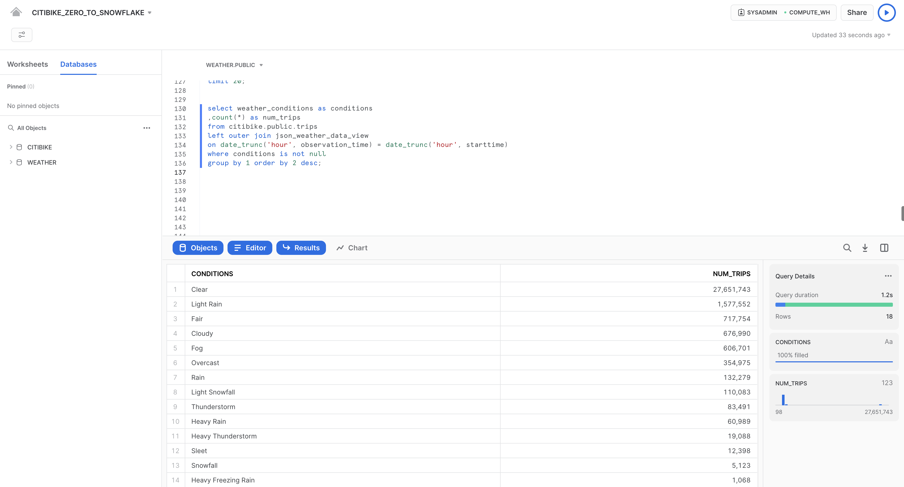

当初の目標は、自転車の利用者数データと気象データの両方を分析することで、自転車に乗る回数と天候の間に何らかの相関関係があるかどうかを判断することでした。上記の結果から、明確な答えが得られました。想像のとおり、天候が良好であれば走行回数はかなり多くなっています。

<!-- ------------------------ -->
## タイムトラベルの使用


Snowflakeの強力なタイムトラベル機能を使用すると、履歴データや、データを格納するオブジェクトに、一定期間内の任意の時点でアクセスすることができます。デフォルトの期間の幅は24時間ですが、Snowflakeエンタープライズエディションを使用している場合は、最大90日間まで増やすことができます。ほとんどのデータウェアハウスではこの機能が提供されていませんが、Snowflakeではこれを簡単に実行できます。

次に、便利な適用例をいくつかご紹介します。

- 削除されたデータ関連オブジェクト（テーブル、スキーマ、データベースなど）を復元する。
- 過去の重要な時点のデータを複製し、バックアップする。
- 特定の期間におけるデータの使用状況および操作を分析する。

### テーブルのドロップとドロップ解除

まず、誤って、または意図的に削除されたデータオブジェクトを復元する方法を見てみましょう。

`CITIBIKE_ZERO_TO_SNOWFLAKE`ノートブックで、以下のDROPコマンドを実行し、`JSON_WEATHER_DATA`テーブルを削除します。

```SQL
drop table json_weather_data;
```

テーブルに対してクエリを実行します。

```SQL
select * from json_weather_data limit 10;
```

基礎テーブルがドロップされているため、下部の結果ペインにはエラーが表示されます。

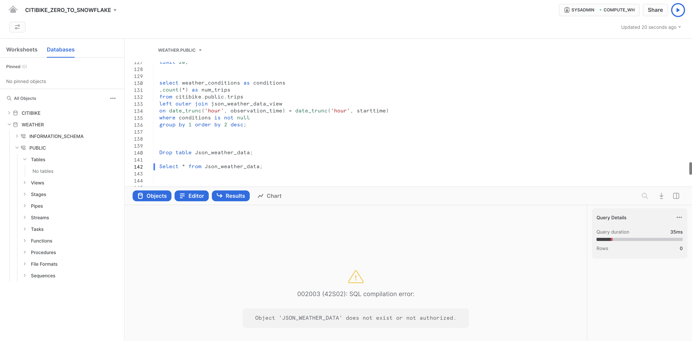

次に、テーブルを復元します。

```SQL
undrop table json_weather_data;
```

json_weather_dataテーブルが復元されたはずです。以下のクエリを実行して確認してください。

```SQL
--verify table is undropped

select * from json_weather_data limit 10;
```

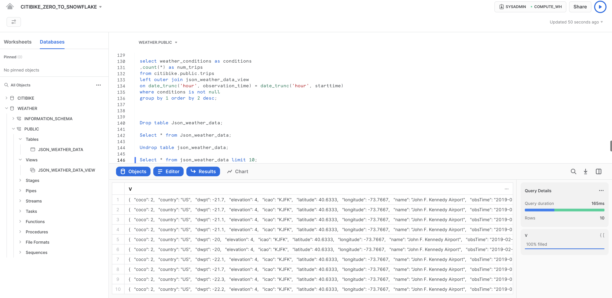

### テーブルのロールバック

`CITIBIKE`データベース内の`TRIPS`テーブルを以前の状態にロールバックし、テーブル内のステーション名をすべて「oops」という単語に置き換えてしまう、意図しないDMLエラーを修正してみましょう。

まず、以下のSQLステートメントを実行し、ノートブックを正しいコンテキストに切り替えます。

```SQL
use role sysadmin;

use warehouse compute_wh;

use database citibike;

use schema public;
```

以下のコマンドを実行し、テーブル内のすべての駅名を「oops」という単語に置き換えます。

```SQL
update trips set start_station_name = 'oops';
```

次に、自転車の利用回数の上位20ステーションを返すクエリを実行します。ステーション名の結果に1行しか含まれていないことに注意してください。

```SQL
select
start_station_name as "station",
count(*) as "rides"
from trips
group by 1
order by 2 desc
limit 20;
```

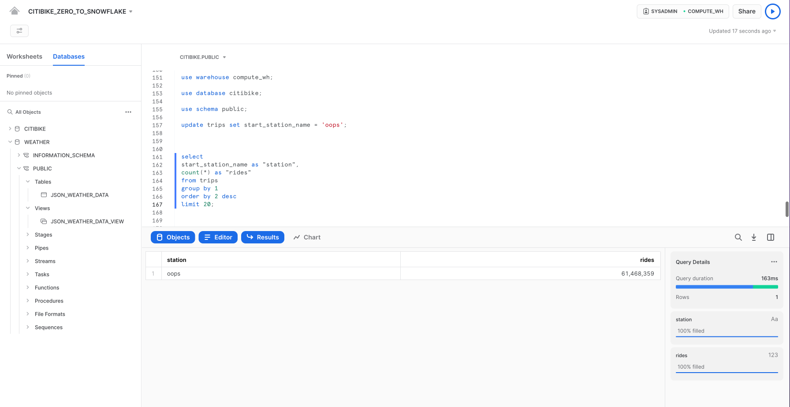

通常であれば、バックアップがあることを祈りながらあれこれ奔走するところです。

Snowflakeでは、1つのコマンドを実行するだけで、直近のUPDATEコマンドのクエリIDを見つけ、それを`$QUERY_ID`という名前の変数に格納することができます。

```SQL
set query_id =
(select query_id from table(information_schema.query_history_by_session (result_limit=>5))
where query_text like 'update%' order by start_time desc limit 1);
```

タイムトラベルを使用して、正しいステーション名でテーブルを作り直します。

```SQL
create or replace table trips as
(select * from trips before (statement => $query_id));
```

前のクエリを再度実行し、ステーション名が復元されていることを確認します。

```SQL
select
start_station_name as "station",
count(*) as "rides"
from trips
group by 1
order by 2 desc
limit 20;
```

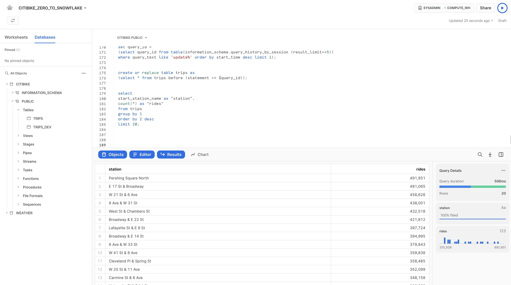

<!-- ------------------------ -->
## ロール、アカウント管理者、アカウント使用状況の操作


このセクションでは、ロールの作成やロールへの特定の権限の付与など、Snowflakeのアクセス制御セキュリティモデルについて説明します。また、ラボの前半で簡単に紹介したACCOUNTADMIN（アカウント管理者）ロールのその他の用途についても検討します。

ラボストーリーを続けます。ここでは、ある若手のDBAがCiti Bikeに入社し、システム定義のデフォルトロールであるSYSADMINよりも権限の少ない新しいロールを作成するとしましょう。

まず、自分のワークスペースウィンドウの**Add new**をクリックし、新しいノートブックを作成しましょう。

> 
> **ロールベースのアクセス制御** Snowflakeは、ユーザーがアクセスできるオブジェクトと機能、およびユーザーのアクセスレベルを指定する、非常に強力かつ粒度の高いアクセス制御を提供しています。詳細については、[Snowflakeドキュメント](https://docs.snowflake.com/user-guide/security-access-control-overview)を確認してください。

### 新しいロールの作成とユーザーの追加

`CITIBIKE_ZERO_TO_SNOWFLAKE`ノートブックでACCOUNTADMINロールに切り替え、新しいロールを作成します。ACCOUNTADMINは、SYSADMINとSECURITYADMINのシステム定義ロールをカプセル化したものです。これはアカウントの最上位のロールであり、限られた数のユーザーにのみ付与する必要があります。

`CITIBIKE_ZERO_TO_SNOWFLAKE`ノートブックで以下のコマンドを実行します。

```SQL
use role accountadmin;
```

ノートブックの右上で、コンテキストがACCOUNTADMINに変更されていることに注意してください。

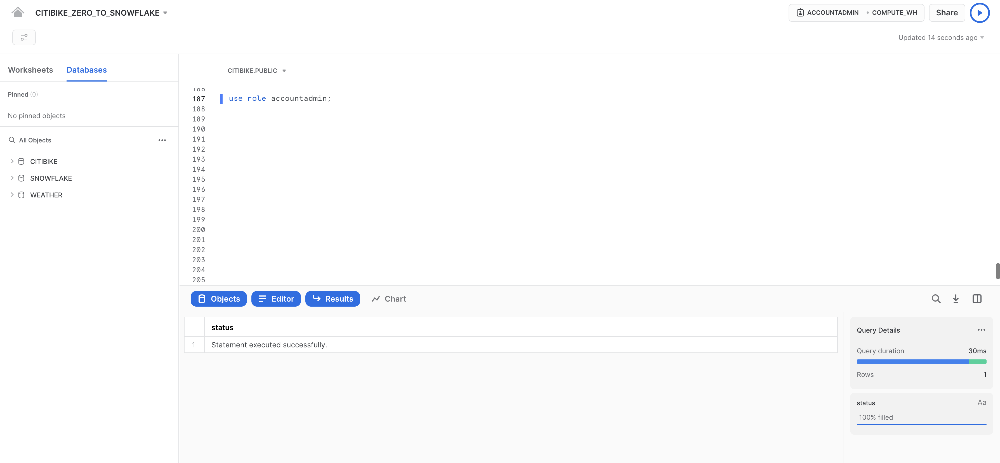

ロールをアクセス制御で使用できるようにするには、少なくとも1人のユーザーがそのロールに割り当てられている必要があります。では、`JUNIOR_DBA`という名前の新しいロールを作成し、Snowflakeユーザーに割り当ててみましょう。このタスクを完了するには、ユーザー名を把握している必要があります。ユーザー名は、自分がUIにログインするときに使用した名前です。

以下のコマンドを使用して、ロールを作成し、それを自分に割り当てます。GRANT ROLEコマンドを実行する前に、`YOUR_USERNAME_GOES_HERE`を自分のユーザー名に置き換えてください。

```SQL
create role junior_dba;

grant role junior_dba to user YOUR_USERNAME_GOES_HERE;
```

> 
> SYSADMINなどのロールでこの操作を実行しようとすると、権限が不十分であるため、操作が失敗します。デフォルト（および設計上）では、SYSADMINロールでは新しいロールやユーザーを作成できないようになっています。

ノートブックのコンテキストを、新しい`JUNIOR_DBA`ロールに変更します。

```SQL
use role junior_dba;
```

ノートブックの右上で、コンテキストが変更され、`JUNIOR_DBA`ロールが反映されていることに注意してください。

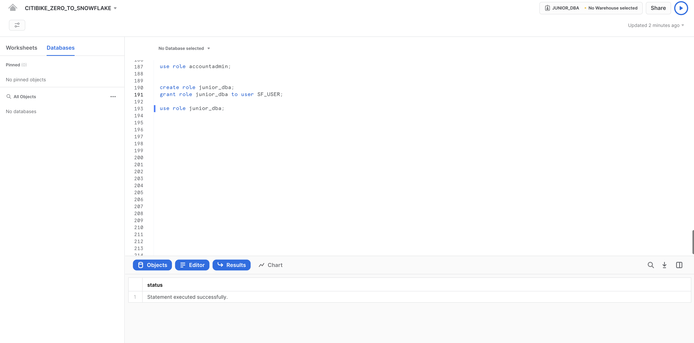

また、新しく作成されたロールにはウェアハウスの使用権限がないため、ウェアハウスは選択されていません。ADMINロールに戻し、`COMPUTE_WH`ウェアハウスの使用権限を付与することで、この問題を解決しましょう。

```SQL
use role accountadmin;

grant usage on warehouse compute_wh to role junior_dba;
```

`JUNIOR_DBA`ロールに戻します。これで`COMPUTE_WH`を使用できるようになりました。

```SQL
use role junior_dba;

use warehouse compute_wh;
```

最後に、左のデータベースオブジェクトブラウザパネルにデータベース、`CITIBIKE`と`WEATHER`が表示されなくなったことに気付くでしょう。これは、`JUNIOR_DBA`ロールにはそれらにアクセスする権限がないためです。

ACCOUNTADMINロールに再度切り替えて、データベース`CITIBIKE`および`WEATHER`を表示し使用するために必要な使用権限を`JUNIOR_DBA`に付与します。

```SQL
use role accountadmin;

grant usage on database citibike to role junior_dba;

grant usage on database weather to role junior_dba;
```

`JUNIOR_DBA`ロールに切り替えます。

```SQL
use role junior_dba;
```

これで、左のデータベースオブジェクトブラウザにデータベース`CITIBIKE`および`WEATHER`が表示されるようになりました。表示されない場合は、パネルの**...**をクリックし、その後「**更新**」をクリックしてみてください。

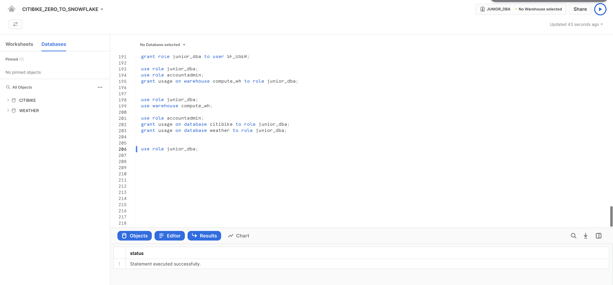

### アカウント管理者UIの表示

では、このロールのみがアクセスできるUIのその他の領域を確認するために、アクセス制御ロールを`ACCOUNTADMIN`に戻してみましょう。ただし、このタスクの実行には、ノートブックではなくUIを使用します。

まず、ノートブック左下の自分の名前をクリックし、**ロール切り替えセクション**でACCOUNTADMINを選択します。

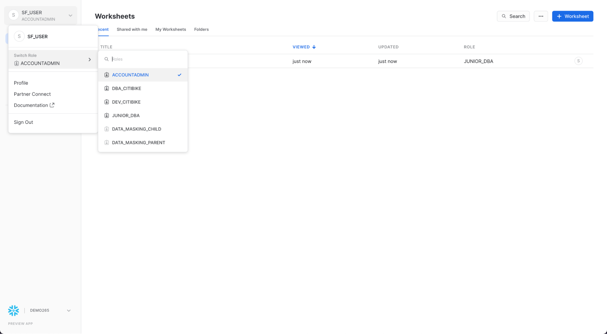

> 
> **ユーザー設定とノートブックのロールの比較** ここでノートブックではなく、ユーザー設定メニューを使ってロールを変更したのはなぜでしょうか？UIセッションとそれぞれのノートブックは、別々のロールを有します。UIセッションのロールは、UIで表示やアクセスが可能なエレメントを制御するものであり、ノートブックのロールは、そのロール内でアクセスできるオブジェクトと操作のみを制御するものです。

UIセッションをACCOUNTADMINロールに切り替えると、「**管理**」の下で新しいタブが利用できるようになることに注意してください。

#### コスト管理

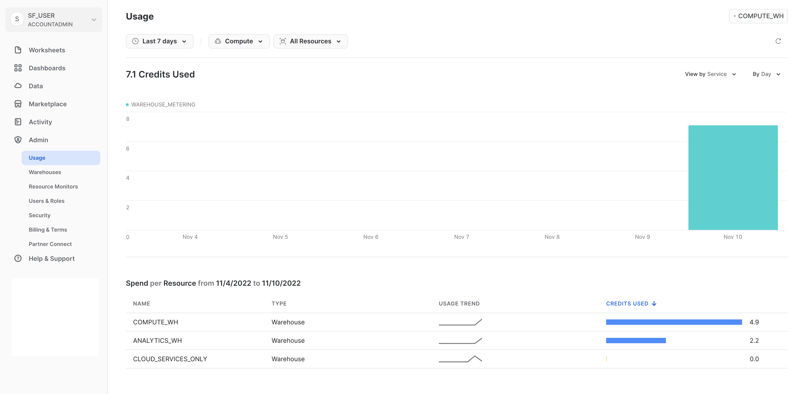

管理セクションの**管理者**の「**コスト管理**」タブには以下の項目が表示され、それぞれに独自のページが用意されています。

- **組織の概要（Organization Overview）**：組織内の全アカウントのクレジット消費を組織レベルで確認できます。
- **アカウントの概要（Account Overview）**：現在のアカウントにおけるクレジット消費の全体像を確認できます。期間で絞り込みながら、ウェアハウスやクエリのコスト傾向を把握できます。
- **消費（Consumption）**：コンピューティング、ストレージ、データ転送のコストを可視化します。フィルターでアカウント、使用タイプ、タグなどを絞り込めます。
- **異常（Anomalies）**：日次消費が想定範囲を上回る／下回るコスト異常を自動検出し、原因調査に使えます。
- **予算（Budgets）**：月次の支出上限を設定し、予測超過時に通知します。アカウント予算に加えて、用途別のカスタム予算も作成できます。
- **リソースモニター（Resource Monitors）**：アカウント全体またはウェアハウス単位でクレジット使用量を監視し、しきい値に応じた通知やアクションを設定できます。

各ページの右上にあるフィルターを使用すると、使用状況/消費量/その他の視覚化をさまざまな尺度で細分化することができます。

#### 請求

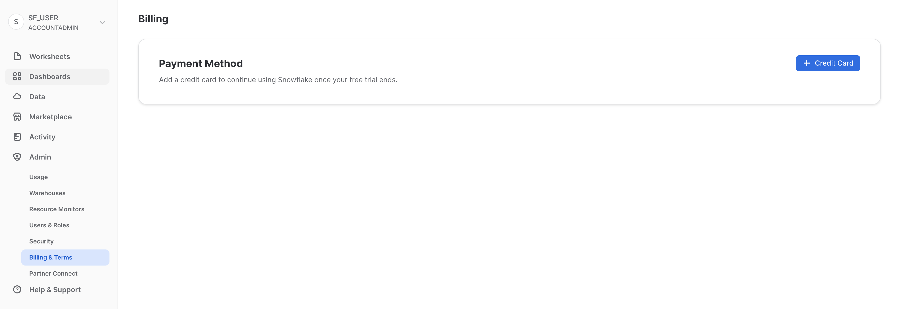

管理セクションの**管理者**の「**請求**」タブには、アカウントの支払い方法が含まれています。

- Snowflakeのご契約ユーザーの場合は、このタブに契約情報に関連付けられたお名前が表示されます。
- オンデマンドのSnowflakeユーザーで、月々のお支払いに使用するクレジットカード情報が登録されている場合は、このタブにそのクレジットカード情報が表示されます。クレジットカードが登録されていない場合、トライアル終了時にクレジットカード情報を追加することで、引き続きSnowflakeをご利用いただくことができます。

次のセクションのために、UIセッションはACCOUNTADMINロールのままにしておきます。

<!-- ------------------------ -->
## データの安全な共有とマーケットプレイス


Snowflakeは、安全なデータシェアリング機能を通じて、アカウント間でのデータアクセスを実現します。共有は、データプロバイダーによって作成され、データコンシューマーにより、自身のSnowflakeアカウントまたはプロビジョニングされたSnowflakeリーダーアカウントを通じてインポートされます。コンシューマーは、外部エンティティの場合もあれば、独自のSnowflakeアカウントを持つ必要がある社内の部門である場合もあります。

安全なデータシェアリングについて：

- データプロバイダーのアカウントに存在するデータのコピーは1つのみ。
- 共有データは常にライブのリアルタイムであり、コンシューマーが即時に利用可能。
- プロバイダーは、共有に対する取り消し可能なきめ細かいアクセスを設定可能。
- データシェアリングは特に旧式のデータシェアリング方法と比較した場合にシンプルで安全。旧式の方法は一般に、インターネットを介した大容量の`.csv`ファイルの転送など、手動で安全でない。

> 
> **クロスリージョンおよびクロスクラウドなデータシェアリング** リージョンまたはクラウドプラットフォームをまたいでデータを共有するには、レプリケーションを設定する必要があります。これはこのラボの範囲外ですが、詳細は[こちらのSnowflakeの記事](/trending/what-is-data-replication)でご確認いただけます。

Snowflakeは、安全なデータシェアリングを使用して、アカウント使用状況データおよびサンプルデータセットをすべてのSnowflakeアカウントに提供します。この機能において、Snowflakeはデータプロバイダーとして機能し、他のすべてのアカウントはコンシューマーとして機能します。

安全なデータシェアリングはSnowflakeマーケットプレイスの原動力でもあります。Snowflakeマーケットプレイスは、すべてのSnowflakeユーザーが利用できるものであり、多数のデータプロバイダーやSaaSベンダーからサードパーティのデータセットを見つけ、それらにアクセスすることができます。このデータシェアリングモデルでも、データはプロバイダーのアカウントから移動することはなく、データセットを変換なしで利用することができます。

### 既存の共有を表示

ホームページで、「**データ**」、「**データベース**」の順に進みます。データベースのリストで、**SOURCE**列を調べます。この列に`Local`と表示されている2つのデータベースがあります。これらは、ラボで先に作成していた2つのデータベースです。もう1つのデータベース、`SNOWFLAKE`には列に`Share`の表示がありますが、これは、プロバイダーから共有されていることを示しています。

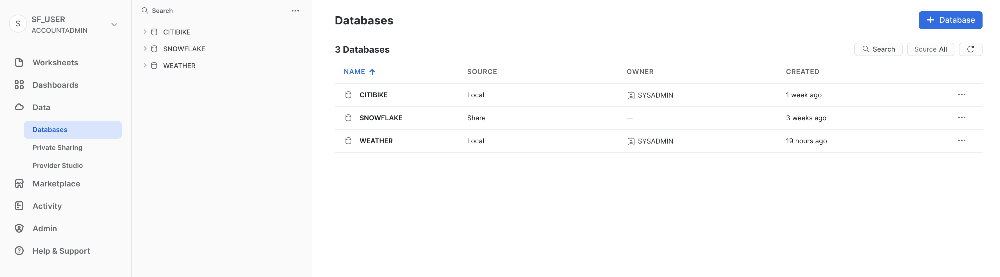

### アウトバウンド共有の作成

Citi Bikeのストーリーに戻りましょう。ここでは、私たちがCiti BikeのSnowflakeアカウント管理者であると想定します。私たちには、ほぼリアルタイムで`TRIPS`データベースのデータを分析することを希望している信頼できるパートナーがいます。このパートナーは、私たちのアカウントと同じリージョンに自社のSnowflakeアカウントを持っています。では、安全なデータシェアリングを使って、このパートナーがこの情報にアクセスできるようにしていきましょう。

「**データ**」、「**プライベートシェアリング**」の順に進み、タブの上部の「**マイアカウントで共有**」をクリックします。右上の「**共有**」ボタンをクリックし、「**直接共有の作成**」を選択します。

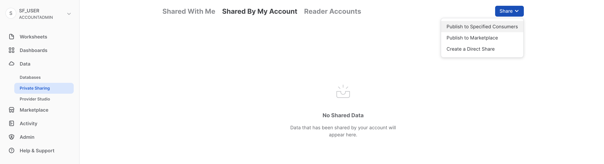

「**+データの選択**」をクリックし、`CITIBIKE`データベースと`PUBLIC`スキーマに移動します。スキーマで作成済みの2つのテーブルを選択し、「**完了**」ボタンをクリックします。

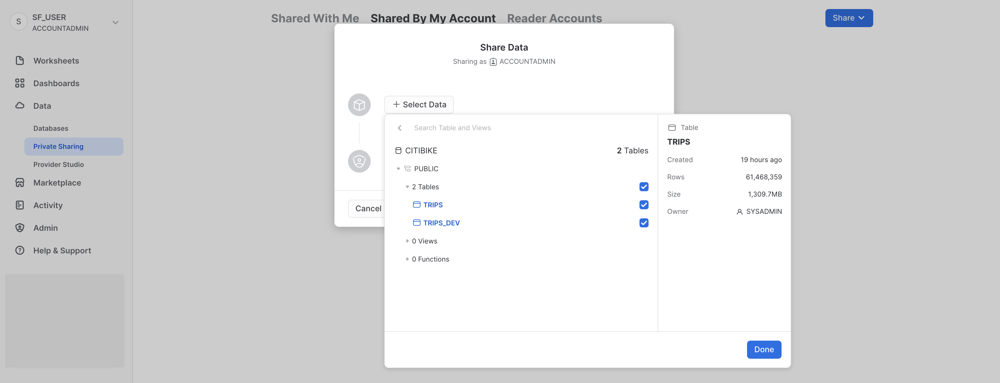

共有のデフォルト名は、ランダムな数値を付加した一般的な名前となっています。デフォルト名を編集し、将来的に共有を識別するのに役立つわかりやすい名前に変更します（`ZERO_TO_SNOWFLAKE_SHARED_DATA`など）。コメントを追加することもできます。

実際のシナリオでは、次に、Citi Bikeのアカウント管理者が1つ以上のコンシューマーアカウントを共有に追加することになると思いますが、今回のラボではそこまでは実行しません。

ダイアログの下部にある「**共有の作成**」ボタンをクリックします。

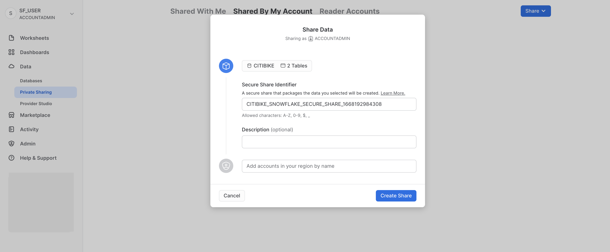

ダイアログが閉じ、作成した安全な共有がページに表示されます。

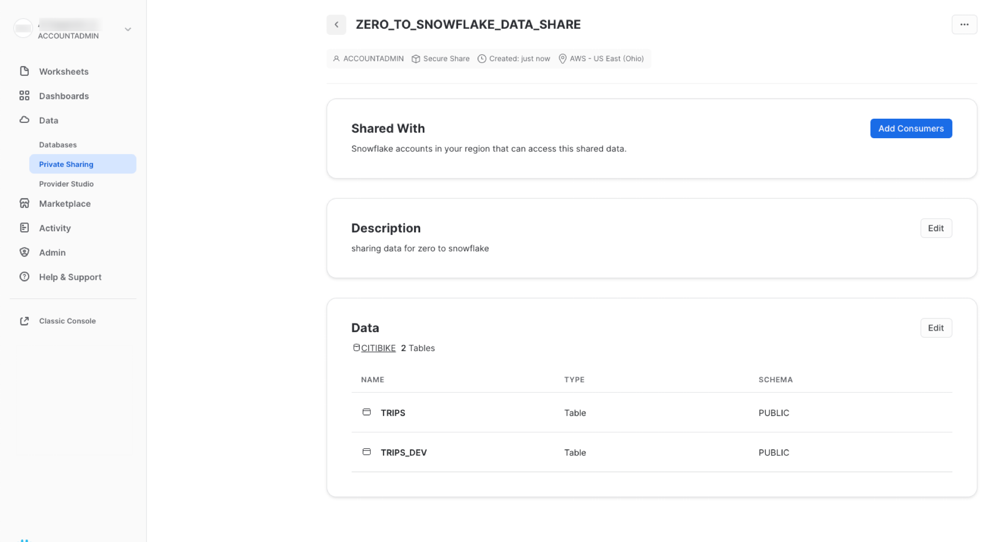

コンシューマーの追加、説明の追加/変更、共有内のオブジェクトの編集はいつでも実行できます。このページで共有名の隣にある**<**ボタンをクリックすると、「**他のアカウントと共有**」ページに戻ります。

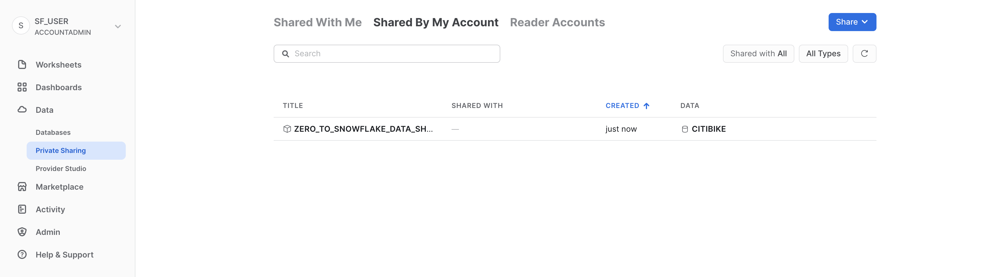

ここでは、自分のSnowflakeアカウントのデータへのアクセスを、データのコピーや転送を必要としない安全な方法で他のアカウントにほんの数秒で付与できることを示しました。

Snowflakeは、機密性を損なうことなくデータを安全に共有する方法をいくつか提供しています。テーブルに加えて、安全なビュー、安全なUDF（ユーザー定義関数）、その他の安全なオブジェクトを共有できます。これらの方法を使用して機密情報へのアクセスを防ぎながらデータを共有することについての詳細は、[Snowflakeドキュメント](https://docs.snowflake.com/ja/user-guide/data-sharing-secure-views.html)を参照してください。

### Snowflakeマーケットプレイス

自分がACCOUNTADMINロールを使用していることを確認したうえで、**マーケットプレイス**に移動します。

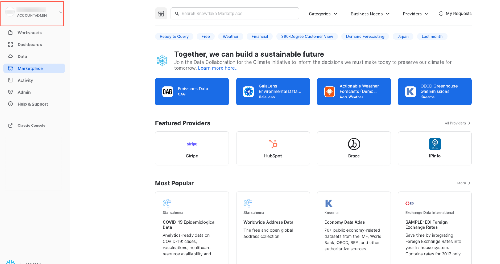

#### リスティングの検索

上部の検索ボックスでリスティングを検索できます。検索ボックスの右にあるドロップダウンリストを使用すると、プロバイダー、ビジネスニーズ、カテゴリーでデータリスティングをフィルタリングできます。

検索ボックスに「`COVID`」と入力し、結果をスクロールして**COVID-19疫学データ**（提供：Starschema）を選択します。

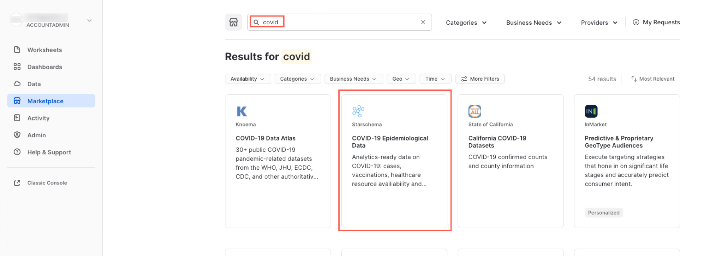

**COVID-19疫学データ**のページでは、データセットの詳細や、クエリの使用例を見ることができます。準備ができたら、「**取得**」ボタンをクリックします。そうすることで、この情報を自分のSnowflakeアカウント内で利用できるようになります。

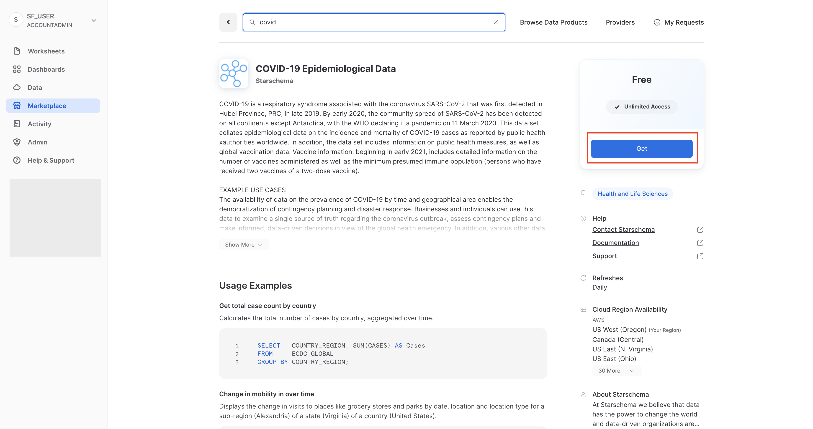

ダイアログで情報を確認し、再度「**取得**」をクリックします。

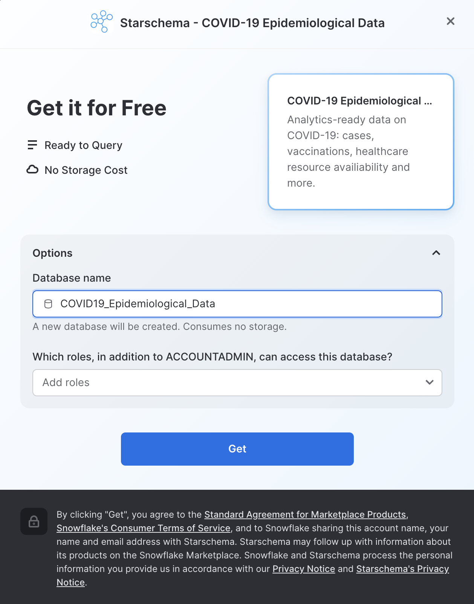

ここで「**完了**」をクリックしても構いません。あるいは、Starschemaが提供するサンプルクエリを実行することもできます。

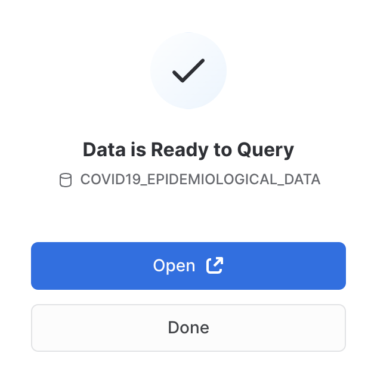

「**開く**」を選択すると、新しいブラウザタブ/ウィンドウで新規ノートブックが開きます。

1. コンテキストの設定
2. 実行したいクエリを選択します（または、クエリテキストにカーソルを合わせます）。
3. 「**実行/再生**」ボタンをクリックします（または、キーボードのショートカットを使用します）。
4. 最下部のペインでデータ結果を確認できます。
5. サンプルクエリの実行が完了したら、左上の**ホーム**アイコンをクリックします。

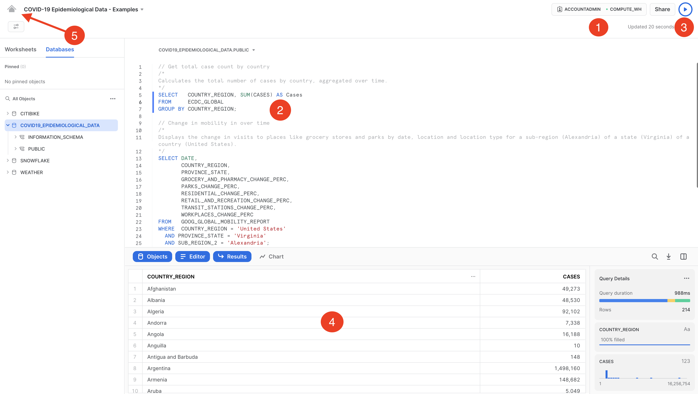

次：

1. 「**データ**」、「**データベース**」の順にクリックします。
2. `COVID19_BY_STARSCHEMA_DM`データベースをクリックします。
3. クエリできるスキーマ、テーブル、ビューの詳細を確認できます。

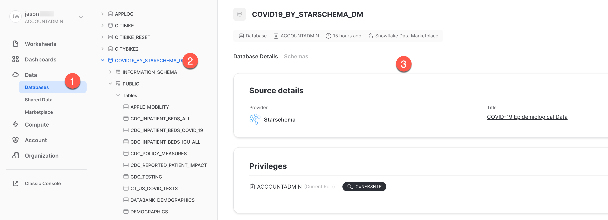

これで完了です。これで、Starschema提供のCOVID-19データセットのサブスクライブが問題なく完了しました。このデータセットは、世界的なCOVIDのデータにより毎日更新されます。データベース、テーブル、ビュー、ETLプロセスを作成する必要がなかったことに注意してください。Snowflakeマーケットプレイスの共有データを検索し、アクセスするだけでした。

新しいノートブックインターフェイスの使い方について詳しくは、[Snowsightドキュメント](https://docs.snowflake.com/ja/user-guide/ui-snowsight.html#using-snowsight)を参照してください

<!-- ------------------------ -->
## Snowflake環境のリセット


このラボの一環として作成したオブジェクトをすべて削除して環境をリセットしたい場合は、ノートブックでSQLステートメントを実行します。

まず、ノートブックで自分がACCOUNTADMINロールを使用していることを確認してください。

```SQL
use role accountadmin;
```

次に、以下のSQLコマンドを実行して、ラボで作成したすべてのオブジェクトをドロップします。

```SQL
drop share if exists zero_to_snowflake_shared_data;
-- If necessary, replace "zero_to_snowflake-shared_data" with the name you used for the share

drop database if exists citibike;

drop database if exists weather;

drop warehouse if exists analytics_wh;

drop role if exists junior_dba;
```

<!-- ------------------------ -->
## まとめと次のステップ


おめでとうございます。導入ラボ実習が終了しました。これで、Snowflakeの基礎はマスターできましたので、学んだ基礎を自分のデータに適用することができます。おさらいが必要な場合は、このガイドを参照するようにしてください。

無料トライアルを続行し、自分のサンプルデータまたは本番データをロードして、このラボで扱っていないSnowflakeのより高度な機能を試してみることをお勧めします。

### 関連リソース：

- [Snowsight](https://docs.snowflake.com/ja/user-guide/ui-snowsight.html#using-snowsight)ドキュメントの詳細を確認する。
- [無料トライアルを最大限に活用するための決定版ガイド](/test-driving-snowflake-the-definitive-guide-to-maximizing-your-free-trial/)を読む。
- [Snowflakeのバーチャルイベントまたは対面イベント](/about/events/)に参加し、当社の機能や顧客についてさらに詳しい情報を得る。
- [Snowflake Community](https://community.snowflake.com/s/topic/0TO0Z000000wmFQWAY/getting-started-with-snowflake)に参加する。
- [Snowflake University](https://community.snowflake.com/s/article/Getting-Access-to-Snowflake-University)に登録する。
- 詳細を当社[セールスチーム](/free-trial-contact-sales/)に問い合わせる。

### ここまで学んだ内容：

- ステージ、データベース、テーブル、ビュー、仮想ウェアハウスの作成方法。
- 構造化データおよび半構造化データのロード方法。
- テーブル間の結合を含む、Snowflake内のデータに対する分析クエリの実行方法。
- オブジェクトのクローン方法。
- タイムトラベルを使用してユーザーエラーを元に戻す方法。
- ロールおよびユーザーを作成し、権限を付与する方法。
- 他のアカウントと安全かつ簡単にデータを共有する方法。
- Snowflakeマーケットプレイスでデータセットを利用する方法。
