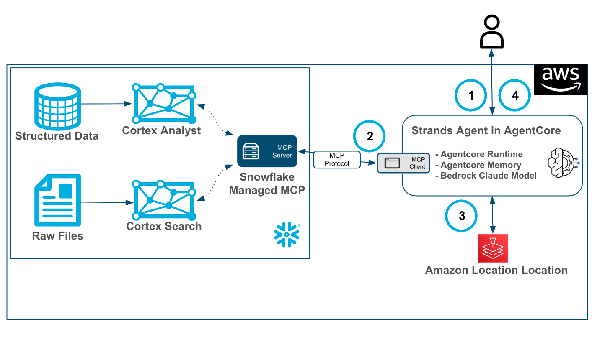
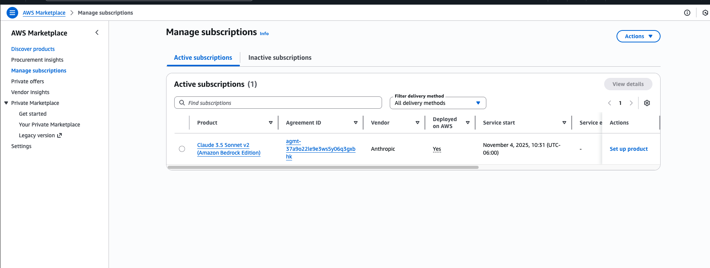
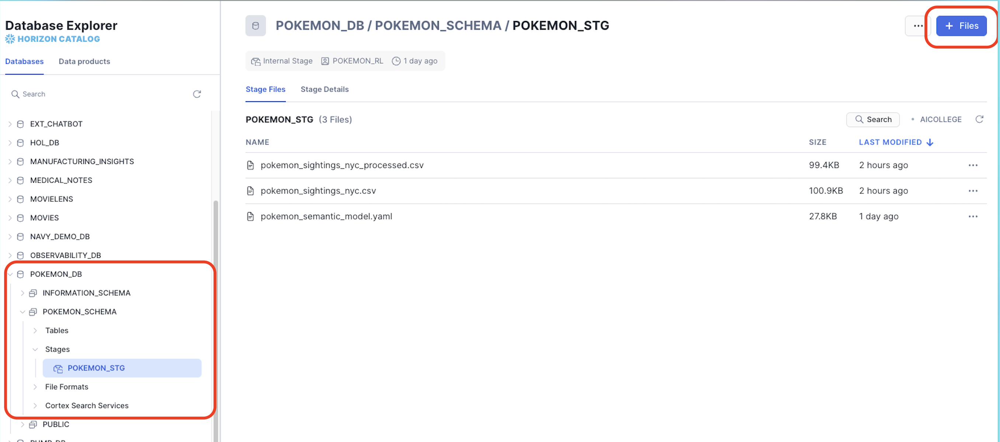
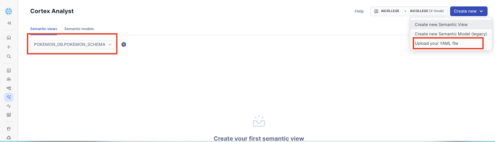
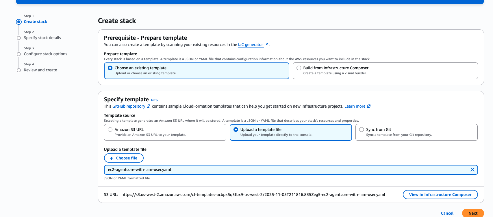
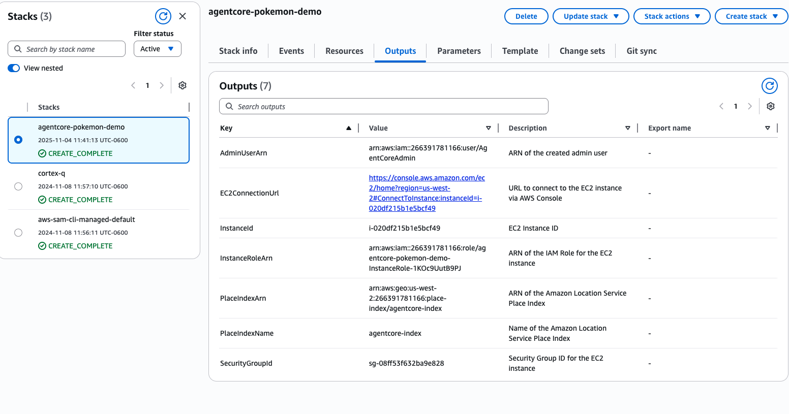
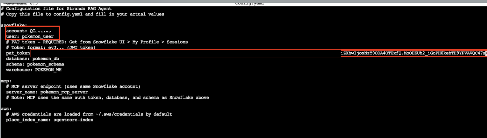
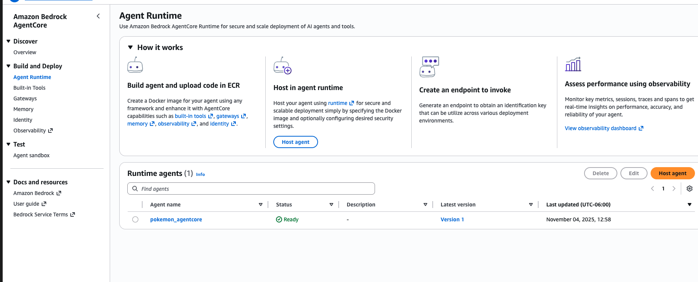
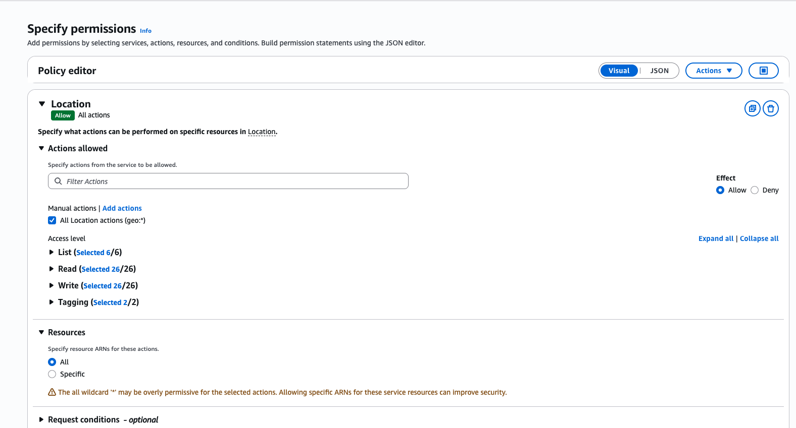

id: getting-started-with-snowflake-managed-mcp-and-bedrock-agentcore
categories: snowflake-site:taxonomy/solution-center/certification/quickstart, snowflake-site:taxonomy/product/ai, snowflake-site:taxonomy/snowflake-feature/cortex-llm-functions
language: en
summary: This is a quickstart for using the Snowflake Managed MCP Server and Amazon Bedrock AgentCore 
environments: web
status: Published 
feedback link: https://github.com/Snowflake-Labs/sfguides/issues
authors: James Sun, Matt Marzillo


# Getting Started with Snowflake Managed MCP Server and Amazon Bedrock AgentCore

<!-- ------------------------ -->
## Overview 

[Cortex Agents](https://www.snowflake.com/en/product/features/cortex/) orchestrate across both structured and unstructured data sources to deliver insights. They plan tasks, use tools to execute these tasks, and generate responses. Agents use Cortex Analyst (structured) and Cortex Search (unstructured) as tools, along with LLMs, to analyze data. Cortex Search extracts insights from unstructured sources, while Cortex Analyst generates SQL to process structured data. A comprehensive support for tool identification and tool execution enables delivery of sophisticated applications grounded in enterprise data.

[The Snowflake-managed MCP server](https://docs.snowflake.com/en/user-guide/snowflake-cortex/cortex-agents-mcp) lets AI agents securely retrieve data from Snowflake accounts without needing to deploy separate infrastructure. You can configure the MCP server to serve Cortex Analyst and Cortex Search as tools on the standards-based interface. MCP clients discover and invoke these tools, and retrieve data required for the application. With managed MCP servers on Snowflake, you can build scalable enterprise-grade applications while maintaining access and privacy controls.

[Amazon Bedrock AgentCore](https://aws.amazon.com/bedrock/agentcore/) is an agentic platform to build, deploy, and operate highly capable agents securely at scale. With AgentCore you can easily enable agents to take actions across tools and data, run agents securely with low-latency and extended runtimes, and monitor agents in production - all without any infrastructure management. AgentCore is comprised of fully-managed services that can be used together or independently and work with any framework (including CrewAI, LangGraph, LlamaIndex, Google ADK, OpenAI Agents SDK, and Strands Agents), as well as any foundation model - eliminating the choice between open-source flexibility and enterprise-grade security and reliability.

### Use Case

In this use case you will build a Cortex Search service and Cortex Analyst services that will allow users to quickly generate responses from Pokemon sightings data in New York City cia an Amazon Bedrock AgentCore Gateway.

The end-to-end workflow will look like this:

1. User will make a prompt to the Amazon Bedrock AgentCore Agent built in Strands.
2. Using AgentCore Runtime, Memory and a Amazon Bedrock Claude Model the Agent will orchestrate across Cortex Search and Analyst via an MCP client and Snowflake’s hosted MCP Server.
3. The agent will then access Amazon Location via a boto3 request to geocode the results from returned from the MCP Client.
4. After orchestrating services the agent will prepare an answer and return it to the user.


### Prerequisites
- Familiarity with [Snowflake](/en/developers/guides/getting-started-with-snowflake/) and a Snowflake account with Cortex Search.
- Familiarity with [AWS](https://aws.amazon.com/free) and an AWS account with access to Amazon Bedrock AgentCore.
- A Subscription to a Claude Sonnet model in AWS Marketplace. You can complete this by going to AWS marketplace console -> discover products -> search for claude sonnet 4 -> view purchase options -> subscribe.

Once subscribed to a model it will look like this:


### What You'll Learn
- Using Cortex Search and Cortex Analyst.
- Using the Snowflake Managed MCP Server.
- Using Amazon Bedrock AgentCore with a Strands Agent to access Snowflake Cortex via MCP and Amazon Location.

### What You’ll Need 
- A free [Snowflake Account](https://signup.snowflake.com/?utm_source=snowflake-devrel&utm_medium=developer-guides&utm_cta=developer-guides)
- [AWS Account](https://aws.amazon.com/free) with access to Amazon Bedrock AgentCore.
- For the sake of the lab it is best if both platforms have access to the public internet and are not in a virtual network.

### What You’ll Build 
You will build an end-to-end Agentic worklfow in AgentCore and Snowflake Cortex, this includes:
- Cortex Search and Cortex Analyst Services 
- A Snowflake Managed MCP Object
- An Amazon Bedrock AgentCore Agent

<!-- ------------------------ -->
## Set Up Snowflake and Cortex

Clone or download this [repo](https://github.com/Snowflake-Labs/sfguide-getting-started-with-snowflake-managed-mcp-and-bedrock-agentcore.git)

Once you have the files downloaded locally you will go to the Snowflake UI and open a new SQL worksheet and run the below code to create a database, warehouse and roles that we will be working with.

```sql
-- =============================================
-- Snowflake Setup for Cortex Agents
-- =============================================

USE ROLE ACCOUNTADMIN;

-- Create role for Cortex Agents
CREATE ROLE IF NOT EXISTS pokemon_rl
   COMMENT = 'Role for Cortex Agents demo';

-- Create a user
CREATE USER pokemon_user
DEFAULT_ROLE = pokemon_rl
MUST_CHANGE_PASSWORD = TRUE;

--Grant role to your user (replace YOUR_USERNAME)
GRANT ROLE pokemon_rl TO USER pokemon_user;

-- create database, schema and warehouse
CREATE WAREHOUSE IF NOT EXISTS pokemon_wh WITH
   WAREHOUSE_SIZE = 'XSMALL'
   AUTO_SUSPEND = 60
   AUTO_RESUME = TRUE
   COMMENT = 'Warehouse for Cortex demo';
   
CREATE DATABASE IF NOT EXISTS pokemon_db; 
create schema if not exists pokemon_db.pokemon_schema;

GRANT OWNERSHIP ON DATABASE pokemon_db TO ROLE pokemon_rl COPY CURRENT GRANTS;
GRANT OWNERSHIP ON SCHEMA pokemon_db.pokemon_schema TO ROLE pokemon_rl COPY CURRENT GRANTS;
GRANT OWNERSHIP ON WAREHOUSE pokemon_wh TO ROLE pokemon_rl COPY CURRENT GRANTS;

grant role pokemon_rl to role accountadmin;

-- ==============================================
-- PART 2: DATA SETUP (as cortex_agent_role)
-- ==============================================

-- Snowflake SQL command to create table for loading pokemon_sightings_nyc.csv
-- Use this in the context of pokemon_db.pokemon_schema

USE ROLE pokemon_rl;
USE DATABASE pokemon_db;
USE SCHEMA pokemon_schema;
USE WAREHOUSE pokemon_wh;

-- Create stage for storing Pokemon CSV files
CREATE OR REPLACE STAGE pokemon_stg
FILE_FORMAT = (TYPE = 'csv');
```

Let's load the data to stage.
- Go to the Snowsight UI using the POKEMON_RL role.
- Go to **Catalog > Database Explorer > POKEMON_DB > POKEMON_SCHEMA > STAGES** and select **POKEMON_STG**.
- Upload the two .csv files from the repo by selecting **+ Files** and specifying the correct stage.
(you will likely have to **Enable Directory Table** before adding the files)


Now, run the below script to populate the data in tables and create a Cortex Search Service.
```sql
ls @pokemon_stg;

CREATE OR REPLACE TABLE pokemon_tbl (
    pokemon_name VARCHAR(50) NOT NULL,
    pokemon_id INTEGER NOT NULL,
    activity VARCHAR(2000) NOT NULL,
    personality VARCHAR(50) NOT NULL
);

COPY INTO pokemon_tbl FROM @pokemon_stg/pokemon_sightings_nyc.csv
      FILE_FORMAT=(TYPE = 'csv' FIELD_DELIMITER = ',' SKIP_HEADER = 1)
        ON_ERROR = CONTINUE
;

select * from pokemon_tbl;
select count(*) from pokemon_tbl;

-- Search service
CREATE OR REPLACE CORTEX SEARCH SERVICE pokemon_search
ON activity
WAREHOUSE = pokemon_wh
TARGET_LAG = '5 MIN'
AS (
    SELECT pokemon_name, pokemon_id, activity, personality
    FROM pokemon_tbl
);

DESCRIBE CORTEX SEARCH SERVICE pokemon_search;

-- Row count in the index snapshot:
SELECT COUNT(*) AS indexed_rows
FROM TABLE(CORTEX_SEARCH_DATA_SCAN(service_name => 'pokemon_search'));

select * from  TABLE(CORTEX_SEARCH_DATA_SCAN(service_name => 'pokemon_search'));

-- Peek a few indexed chunks/attributes:
SELECT *
    FROM TABLE(CORTEX_SEARCH_DATA_SCAN(service_name => 'pokemon_search')) 
order by activity desc;


-- Semantic view
-- Create table for the processed Pokemon data with separated timestamp and location columns
CREATE OR REPLACE TABLE pokemon_semantic_tbl (
    pokemon_name VARCHAR(50) NOT NULL,
    pokemon_id INTEGER NOT NULL,
    timestamp TIMESTAMP_NTZ NOT NULL,
    location VARCHAR(200) NOT NULL,
    activity VARCHAR(2000) NOT NULL,
    personality VARCHAR(50) NOT NULL
);

-- Copy data from the processed CSV file with separated columns
COPY INTO pokemon_semantic_tbl FROM @pokemon_stg/pokemon_sightings_nyc_processed.csv
      FILE_FORMAT=(TYPE = 'csv' FIELD_DELIMITER = ',' SKIP_HEADER = 1)
        ON_ERROR = CONTINUE
;
```

Let's upload the .yaml file to create the Semantic View in Snowflake to enable Cortex Analyst. This can be done with the [Analyst UI](https://docs.snowflake.com/en/user-guide/views-semantic/ui) which makes it VERY easy to create and manage Semantic Views. For the sake of brevity let's upload the .yaml to create the Semantic View.
- Go to **AI & ML > Cortex Analyst > Create New** and select **Upload your YAML file**.
- Select your .yaml file 
- Select **POKEMON_DB > POKEMON_SCHEMA** then the **POKEMON_STG** Stage and select **Upload**.


It will take several seconds for the Semantic View to be created, but feel free to click around to view it. Select **Save** once completed.

Let's finish running the SQL to create the Snowflake MCP object and the PAT token which you should save for use later in the lab.

```sql
-- Create MCP server
CREATE OR REPLACE MCP SERVER pokemon_mcp_server FROM SPECIFICATION
$$
  tools:
  - name: "pokemon_search"
    identifier: "POKEMON_DB.POKEMON_SCHEMA.POKEMON_SEARCH"
    type: "CORTEX_SEARCH_SERVICE_QUERY"
    description: "A tool that performs a search query in pokemon activity datbase in New York City"
    title: "Pokemon Search"

  - name: "pokemon_semantic_view"
    type: "CORTEX_ANALYST_MESSAGE"
    identifier: "POKEMON_DB.POKEMON_SCHEMA.POKEMON_SEMANTIC_VIEW"
    description: "Semantic view for pokemon activities in NYC"
    title: "Semantic view for pokemon activities in NYC"
$$;

DESCRIBE MCP SERVER pokemon_mcp_server;


-- ==============================================
-- PART 3: PAT Token Creation
-- ==============================================

use role accountadmin;

-- Create PAT for the integration AND COPY THE PAT Token for future use!
ALTER USER pokemon_user ADD PROGRAMMATIC ACCESS TOKEN cortex_demo_token DAYS_TO_EXPIRY = 30 ROLE_RESTRICTION = 'POKEMON_RL';
--ALTER USER pokemon_user REMOVE PROGRAMMATIC ACCESS TOKEN cortex_demo_token;
```

Once complete make sure to also retrieve your **Account Locator** by going to the bottom left selecting **Account > View Account Details > Account Locator**. 

<!-- ------------------------ -->
## Set Up AgentCore

Let's use the CloudFormation service in the AWS console. 
- Select **Create stack**.
- Select **upload from template file** then **choose file** and select the **ec2-agentcore-with-iam-user.yaml** and select **Next**.



- Enter **agentcore-pokemon-demo** for the Stack name then select any public Subnet for **SubnetId** or a private subnet should have a nat gateway for egress traffic. Select **Next**.
- For VpcId selection, choose the VPC from the drop-down menu, make sure that the SubnetId you selected is inside of this VPC by looking up in the [VPC console](https://console.aws.amazon.com/vpcconsole/home#subnets).
- Leave as-is and check that you acknowledge IAM resources with custom names will be created.
- Select **Submit**.

After several minutes, the CFT will be deployed.



Now select **Outputs > Value for the Ec2ConnectionURL** and connect to the EC2.

Run the below to enter the agentcore directory
```bash
cd /opt/agentcore
```

Run the below to edit the config.yaml file
```bash
nano config.yaml
```

Update the config.yaml file with your **Snowflake Locator, User and PAT Token**. Use ctrl + O followed by enter on your keyboard to save the file then exit the file.




Run the below command to to configure the agent
```bash
agentcore configure
```

Using the tab and arrow keys select **pokemon_agentcore.py** as the entrypoint then continue to hit enter accepting the default options.

Run the below command to create the AgentCore resources.
```bash
sh generate_launch_command.sh
```

It will take several minutes for the AgentCore Runtime and Memory to be created. Go to the AgentCore service in the AWS console to verify they've been created.



Go to the IAM console, **select Roles** on the left, look for the role with name like: AmazonBedrockAgentCoreSDKRuntime-xxxxxxxx
- Add Permissions -> Create inline policy, in 'Select a service'
- choose 'Location'
- check 'All Location actions (geo:*)'
- check 'All' for Resources
- Next
- Policy name: geocoding
- Create policy



<!-- ------------------------ -->
## Use the Agent

Go back to the EC2 instance you are connected to and run the below command

```bash
python3 invoke_agentcore.py
```

You will be prompted with a greeting from the Agent, test it out with any of the below prompts!
- List 3 pokemon activities with addresses by pikachu 
- Add weather conditions and coordinates to above activities
- Analytical question: What's the average number of activities by Pokemon species per month?
- Search query: Count activities by Pokemon species?

[](assets/promptreply.png)

### Cleanup
1. sh cleanup.sh in the EC2 Session
2. delete cloudformation deployment from the AWS console
3. remove ecr repository, s3 bucket, iam roles (AmazonBedrockAgentSDKxxx) from the AWS console

<!-- ------------------------ -->
## Conclusion and Resources

This quickstart is just that, a quick way to get you started with using AgentCore and the Snowflake managed MCP Server. Feel free to continue to explore the documents below to further extend your AWS + Snowflake Agent workloads!

### What You Learned
- Using Cortex Search and Cortex Analyst.
- Using the Snowflake Managed MCP Server.
- Using Amazon Bedrock AgentCore with a Strands Agent to access Snowflake Cortex via MCP and Amazon Location.

### Resources
There are some great blogs on Medium regarding Snowflake Cortex and Amazon Services work together:

- [Snowflake Cortex](/en/data-cloud/cortex/)
- [Amazon Bedrock AgentCore](https://aws.amazon.com/bedrock/agentcore/)
- [Amazon Bedrock and Snowflake Cortex](https://catalog.us-east-1.prod.workshops.aws/workshops/2d4e5ea4-78c8-496f-8246-50d8971414c9/en-US/01-overview)
