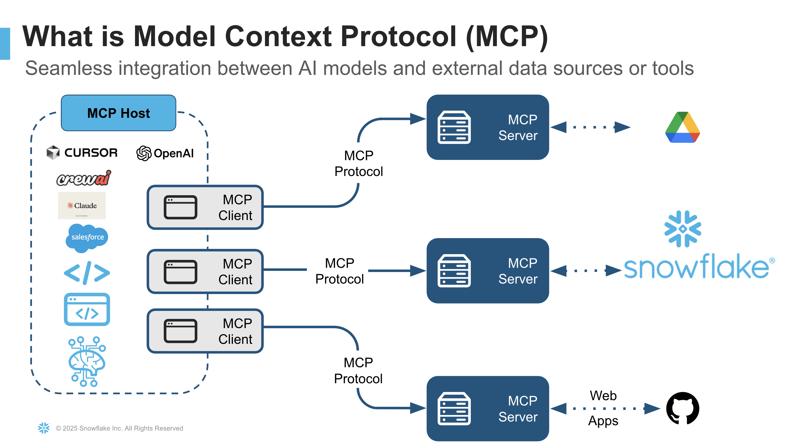

id: getting-started-with-snowflake-mcp-server
categories: snowflake-site:taxonomy/solution-center/certification/quickstart, snowflake-site:taxonomy/product/ai
language: en
summary: This guide outlines the process for getting started with Snowflake MCP Server.
environments: web
status: Published
feedback link: <https://github.com/Snowflake-Labs/sfguides/issues>
authors: Dash Desai

# Getting Started with Managed Snowflake MCP Server
<!-- ------------------------ -->

## Overview


The Snowflake MCP Server allows AI agents to securely retrieve data from Snowflake accounts without needing to deploy separate infrastructure. MCP clients discover and invoke tools, and retrieve data required for the application. The Snowflake MCP Server includes Cortex Analyst and Cortex Search as tools on the standards-based interface. It is now available with Model Context Protocol (MCP) so that AI Agents can discover and invoke tools (Cortex Analyst, Cortex Search) via a unified and standard based interface.

**Top 3 Benefits**

* Governed By Design: Enforce the same trusted governance policies, from role-based access to masking, for the MCP server as you do for your data.
* Reduced Integration: With the MCP Server, integration happens once. Any compatible agent can then connect without new development, accelerating adoption and reducing maintenance costs.
* Extensible Framework: Provide agents with out-of-the-box secure access to structured and unstructured data. You can refine the tools to improve how agents interact with your data.

**Why It Matters**

MCP Server on Snowflake simplifies the application architecture and eliminates the need for custom integrations. Enterprises can expedite delivery of generative AI applications with richer insights on a standards based architecture and a robust governance model with the Snowflake AI data cloud.

*NOTE: Snowflake MCP Server is in Public Preview as of October 2025.*



### Prerequisites

* Access to a Snowflake account with ACCOUNTADMIN role. If you do not have access to an account, create a [free Snowflake trial account](https://signup.snowflake.com/?utm_cta=quickstarts_).
* Access to [Cursor](https://cursor.com/).

### What You Will Learn

- How to create building blocks for Snowflake MCP Server that can intelligently respond to questions by reasoning over data
- How to configure Cursor to interact with Snowflake MCP Server

### What You Will Build

A Snowflake MCP Server that intelligently responds to questions by reasoning over data from within Cursor.

<!-- ------------------------ -->
## Setup


### Create Objects

* Clone [GitHub repo](https://github.com/Snowflake-Labs/sfguide-getting-started-with-snowflake-mcp-server).

* In Snowsight, [create a SQL Worksheet](https://docs.snowflake.com/en/user-guide/ui-snowsight-worksheets-gs?_fsi=THrZMtDg,%20THrZMtDg&_fsi=THrZMtDg,%20THrZMtDg#create-worksheets-from-a-sql-file) and open [setup.sql](https://github.com/Snowflake-Labs/sfguide-getting-started-with-snowflake-mcp-server/blob/main/setup.sql) to execute all statements in order from top to bottom.

### Create Personal Access Token

Create a [Personal Access Token (PAT)](https://docs.snowflake.com/en/user-guide/programmatic-access-tokens) **for your role** and make a note/local copy of it. (You will need to paste it later.)

### Create Cortex Search Service

This tool allows the agent to search and retrieve information from unstructured text data, such as customer support tickets, Slack conversations, or contracts. It leverages Cortex Search to index and query these text "chunks," enabling the agent to perform Retrieval Augmented Generation (RAG).

* In Snowsight, on the left hand navigation menu, select [**AI & ML** >> **Cortex Search**](https://app.snowflake.com/_deeplink/#/cortex/search?utm_source=quickstart&utm_medium=quickstart&utm_campaign=-us-en-all&utm_content=app-getting-started-with-snowflake-mcp-server) 
* On the top right, click on **Create**
    - Role and Warehouse: **ACCOUNTADMIN** | **DASH_WH_S**
    - Database and Schema: **DASH_MCP_DB.DATA**
    - Name: Support_Tickets
    - Select data to be indexed: select FACT_SUPPORT_TICKETS table
    - Select a search column: select DESCRIPTION
    - Select attribute column(s): select CATEGORY, SUBCATEGORY, PRIORITY, CHANNEL, STATUS, SATISFACTION_SCORE 
    - Select columns to include in the service: Select all
    - Configure your Search Service: Keep default values and select **DASH_WH_S** for "Warehouse for indexing"

<!-- ------------------------ -->
## Snowflake MCP Server


> PREREQUISITE: Successful completion of steps outlined under **Setup**.

#### Create Snowflake MCP Server

To create the Snowflake MCP server, run the following in the same SQL worksheet.

```sql
create or replace mcp server dash_mcp_server from specification
$$
tools:
  - name: "Support Tickets Search Service"
    identifier: "dash_mcp_db.data.support_tickets"
    type: "CORTEX_SEARCH_SERVICE_QUERY"
    description: "A tool that performs keyword and vector search over support tickets and call transcripts."
    title: "Support Tickets"
$$;
```

Now let's try this out in Cursor, but note that you should be able to use other clients like CrewAI, Claude by Anthropic, Devin by Cognition, and Agentforce by Salesforce.

#### Cursor

In Cursor, open or create `mcp.json` located at the root of your project and add the following. NOTE: Replace **<YOUR-ORG-YOUR-ACCOUNT>** and **<YOUR-PAT-TOKEN>** with your values.

```json
{
    "mcpServers": {
      "Snowflake": {
        "url": "https://<YOUR-ORG-YOUR-ACCOUNT>.snowflakecomputing.com/api/v2/databases/dash_mcp_db/schemas/data/mcp-servers/dash_mcp_server",
            "headers": {
              "Authorization": "Bearer <YOUR-PAT-TOKEN>"
            }
      }
    }
}
```

Then, select **Cursor** -> **Settings** -> **Cursor Settings** -> **MCP** (or **Tools & MCP**) and you should see **Snowflake** under **Installed Servers**. 

NOTE: If it continues to say "Loading tools" running the following `curl` command to test your connection.

```curl
curl -X POST "https://<YOUR-ORG-YOUR-ACCOUNT>.snowflakecomputing.com/api/v2/databases/dash_mcp_db/schemas/data/mcp-servers/dash_mcp_server" \
  --header 'Content-Type: application/json' \
  --header 'Accept: application/json' \
  --header "Authorization: Bearer <YOUR-PAT-TOKEN>" \
  --data '{
    "jsonrpc": "2.0",
    "id": 12345,
    "method": "tools/list",
    "params": {}
  }'
```

### Q&A

Assuming you're able to see the tool **Support_Tickets_Search_Service** under newly installed **Snowflake** MCP server, let's chat! Start a new chat in Cursor and set your `mcp.json` as context to ask the following questions.

#### Q1. Can you summarize the overall sentiments based on the support calls?

In a few moments, you should see a response similar to this. 

*NOTE: The response may not be the exact same.*

```code
Based on my analysis of the support tickets data, here's a comprehensive summary of the overall sentiments from support calls:
Overall Sentiment Summary

The support call data reveals three distinct sentiment categories with varying customer experiences:

🟢 Positive Sentiments (~35-40% of feedback)
Key Characteristics:
High praise for agent professionalism: Customers specifically commend agents who are "professional, knowledgeable, and genuinely cared about helping"
Problem resolution satisfaction: Quick resolution of complex issues (e.g., account balance discrepancies, wire transfer problems)
Communication excellence: Agents keeping customers informed throughout the process
Persistence and dedication: Support staff staying on calls until complete resolution
Representative feedback:
"Outstanding customer care!"
"They investigated thoroughly and found the missing deposit"
"The agent stayed on the line until everything was resolved"

🔴 Negative Sentiments (~30-35% of feedback)
Major Pain Points:
Long wait times: Customers reporting being on hold for over an hour
Multiple transfers: Frustration with being transferred 3+ times without resolution
Agent unprofessionalism: Reports of rude, dismissive, or annoyed agents
Account issues: Unexpected account freezes causing public embarrassment
Poor communication: Agents unable to explain problems or rushing through explanations
Representative feedback:
"Completely unprofessional"
"I've been transferred three times already and still no resolution"
"The embarrassment was terrible and the agent couldn't explain why it happened"

🟡 Neutral/Informational (~25-30% of feedback)
Characteristics:
Routine inquiries: Questions about interest rates, account tiers, balance requirements
Straightforward transactions: Basic information requests handled efficiently
No strong emotional response: Professional but unremarkable interactions
Representative feedback:
"Everything was straightforward"
"The agent provided the information and explained the different account tiers"

Key Insights
Bimodal Distribution: Customer sentiment tends to be either very positive or very negative, with fewer neutral experiences
Agent Training Impact: The difference between positive and negative experiences often comes down to individual agent skills and approach
Process Issues: System problems (account access, multiple transfers) contribute significantly to negative sentiment
Resolution Speed: Quick, thorough problem-solving generates the strongest positive feedback

Recommendations
Focus on reducing wait times and transfer frequency
Enhance agent training on communication and problem-solving skills
Improve system reliability to prevent unexpected account issues
Standardize the excellent service that generates positive feedback across all interactions

The data suggests a support organization with high potential but inconsistent execution, where exceptional service exists alongside significant operational challenges.
```

#### Q2. Which support categories would benefit most from automated responses based on transcript analysis?

In a few moments, you should see a response similar to this.

*NOTE: The response may not be the exact same.*

```code
Based on my comprehensive analysis of the support call transcripts, here are the support categories that would benefit most from automated responses:

🟢 High Automation Potential (70-90% automation success rate)

1. Account Balance & Transaction Inquiries
Evidence: Multiple calls with identical patterns: "I called to check my current account balance and recent transaction history. The agent verified my identity and provided the requested information."
Automation Strategy:
Automated identity verification via PIN/security questions
Real-time balance lookup from banking systems
Transaction history delivery via voice or SMS
Estimated Impact: Reduces call volume by 15-20%

2. Interest Rates & Product Information
Evidence: "I'm calling to inquire about the current interest rates for savings accounts. The agent provided the information and explained the different account tiers."
Automation Strategy:
Dynamic rate lookup from current rate tables
Automated explanation of account tiers and requirements
Minimum balance and fee information delivery
Estimated Impact: Reduces call volume by 10-15%

3. Basic Account Information
Evidence: Frequent requests for routing numbers, branch locations, hours
Automation Strategy:
Location-based branch finder
Automated routing number delivery after identity verification
Business hours and contact information
Estimated Impact: Reduces call volume by 8-12%

4. Standard Check Orders
Evidence: "I need to order checks for my checking account. The representative took my order and confirmed the delivery address."
Automation Strategy:
Automated order processing with address confirmation
Style selection through interactive menu
Delivery timeline and cost information
Estimated Impact: Reduces call volume by 5-8%

🟡 Medium Automation Potential (40-60% automation success rate)

5. Lost/Stolen Card Replacement
Evidence: "I called to report a lost debit card and request a replacement. The agent immediately canceled the old card and ordered a new one."
Automation Strategy:
Automated card cancellation after identity verification
Replacement card ordering with address confirmation
Temporary card number provision for immediate use
Escalation: Complex fraud cases require human intervention

6. Simple Fee Inquiries
Evidence: Complaints about unexpected fees, but also straightforward fee structure questions
Automation Strategy:
Automated fee schedule delivery
Account-specific fee history
Escalation: Fee disputes require human review

🔴 Low Automation Potential (Requires Human Intervention)

7. Transaction Disputes & Fraud
Evidence: "Thank you so much for your help today! I was really worried about the unauthorized transaction, but you walked me through the dispute process clearly."
Why Human Required:
Complex investigation needed
Emotional support required
Legal compliance requirements
Multi-step verification processes
```

> NOTE: Feel free to explore the transcripts in FACT_SUPPORT_TICKETS table and try out other prompts.

<!-- ------------------------ -->
## Conclusion And Resources


Congratulations! You've successfully created a Snowflake MCP Server that intelligently responds to questions by reasoning over data from within Cursor.

### What You Learned

- How to create building blocks for Snowflake MCP Server that can intelligently respond to questions by reasoning over data
- How to configure Cursor to interact with Snowflake MCP Server

### Related Resources

- [GitHub Repo](https://github.com/Snowflake-Labs/sfguide-getting-started-with-snowflake-mcp-server)
- [Snowflake-managed MCP server Docs](https://docs.snowflake.com/en/user-guide/snowflake-cortex/cortex-agents-mcp)


