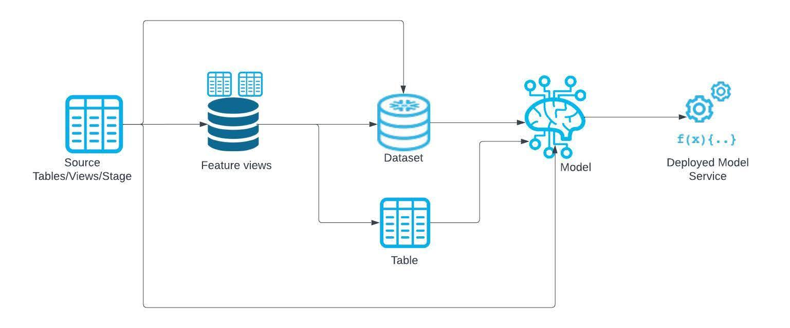
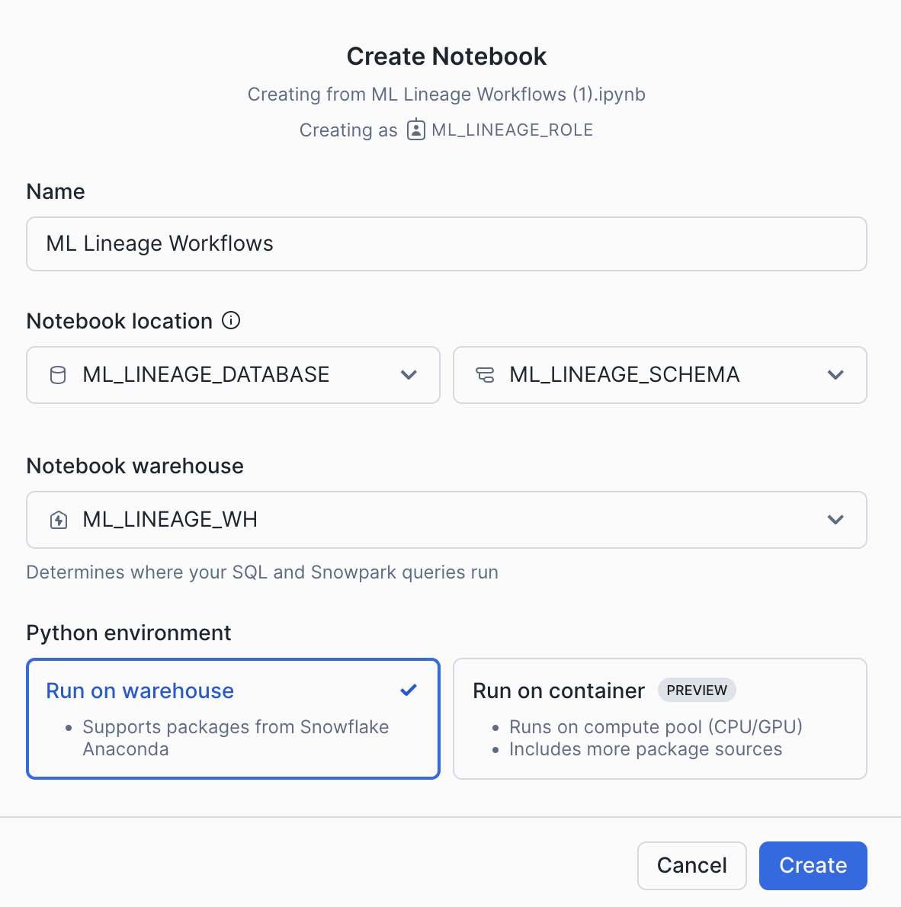

author: Charlie Hammond
id: getting-started-with-snowflake-ml-lineage
categories: snowflake-site:taxonomy/solution-center/certification/quickstart, snowflake-site:taxonomy/product/ai, snowflake-site:taxonomy/snowflake-feature/model-development, snowflake-site:taxonomy/snowflake-feature/ml-functions
language: en
summary: This is a sample Snowflake Guide 
environments: web
status: Published 
feedback link: https://github.com/Snowflake-Labs/sfguides/issues

# Getting Started with Snowflake ML Lineage
<!-- ------------------------ -->
## Overview 

[ML Lineage](https://docs.snowflake.com/en/developer-guide/snowflake-ml/ml-lineage) provides comprehensive tracing of data as it flows through your machine learning pipeline. This feature enables you to track the lineage between various data artifacts, including source tables/views/stages, feature views, datasets, registered models, and deployed model services. Additionally, ML Lineage captures the relationships between cloned artifacts and artifacts of similar types, ensuring a complete view of data transformations and dependencies within your pipeline. A possible pipeline is illustrated below:



This quickstart will introduce ML Lineage by building an ML pipeline containing lineage at every step. You will see how source data, Feature Store, Datasets, and models all are connected via lineage for easy tracking. 

### Prerequisites
- A Snowflake account login with a role that has the ACCOUNTADMIN role. If not, you will need to work with your ACCOUNTADMIN to perform the initial account setup 

### What You’ll Learn 
- How to use ML Lineage for Feature Views, Datasets and Models via a Snowflake Notebook 
- How to view the ML Lineage DAG in Snowsight

### What You’ll Need 
- A [Snowflake](https://app.snowflake.com/) account with Enterprise Edition or higher

### What You’ll Build 
- An entire ML pipeline connected via Snowflake ML Lineage

<!-- ------------------------ -->
## Setup Your Account

### Account Setup

Complete the following steps to setup your account:
- Navigate to Worksheets, click "+" in the top-right corner to create a new Worksheet, and choose "SQL Worksheet".
- Paste and the following SQL in the worksheet 
- Adjust <YOUR_USER> to your user
- Run all commands to create Snowflake objects

```sql
USE ROLE ACCOUNTADMIN;

-- Using ACCOUNTADMIN, create a new role for this exercise and grant to applicable users
CREATE OR REPLACE ROLE ML_LINEAGE_ROLE;
GRANT ROLE ML_LINEAGE_ROLE to USER <YOUR_USER>;

-- grant lineage
GRANT VIEW LINEAGE ON ACCOUNT TO ROLE ML_LINEAGE_ROLE;

-- create our virtual warehouse
CREATE OR REPLACE WAREHOUSE ML_LINEAGE_WH AUTO_SUSPEND = 60;
GRANT ALL ON WAREHOUSE ML_LINEAGE_WH TO ROLE ML_LINEAGE_ROLE;

-- Next create a new database and schema,
CREATE OR REPLACE DATABASE ML_LINEAGE_DATABASE;
CREATE OR REPLACE SCHEMA ML_LINEAGE_SCHEMA;

GRANT OWNERSHIP ON DATABASE ML_LINEAGE_DATABASE TO ROLE ML_LINEAGE_ROLE COPY CURRENT GRANTS;
GRANT OWNERSHIP ON ALL SCHEMAS IN DATABASE ML_LINEAGE_DATABASE TO ROLE ML_LINEAGE_ROLE COPY CURRENT GRANTS;
```
<!-- ------------------------ -->
## Run the Notebook

- Download the notebook from this [link](https://github.com/Snowflake-Labs/getting-started-with-snowflake-ml-lineage/blob/main/notebooks/0_start_here.ipynb)
- Change role to ML_LINEAGE_ROLE
- Navigate to Projects > Notebooks in Snowsight
- Click Import .ipynb from the + Notebook dropdown
- Create a new notebok with the following settings
  - Notebook Location: ML_LINEAGE_DATABASE, ML_LINEAGE_SCHEMA
  - Run on Warehouse
  - Warehouse: ML_LINEAGE_WH
- Create Notebook
- Upload the image located [here](https://github.com/Snowflake-Labs/getting-started-with-snowflake-ml-lineage/blob/main/scripts/img) using the plus button on the notebook file explorer
- Click Packages in the top right, add snowflake-ml-python
- Run cells in the notebook!



<!-- ------------------------ -->
## Conclusion And Resources

ML Lineage provides a powerful tool for tracking and understanding data flow throughout your machine learning pipeline. By capturing relationships between data artifacts—such as source tables, feature views, datasets, models, and services—ML Lineage ensures full visibility into data transformations and dependencies. In this quickstart you saw how many different objects within Snowflake ML are connected via lineage.

Start your journey now to unlock the full potential of ML Lineage!

### What You Learned
- How to use ML Lineage for Feature Views, Datasets and Models via a Snowflake Notebook 
- How to view the ML Lineage DAG in Snowsight

### Related Resources
- [ML Lineage](https://docs.snowflake.com/en/developer-guide/snowflake-ml/ml-lineage)
- [Feature Store](https://docs.snowflake.com/developer-guide/snowflake-ml/feature-store/overview)
- [Datasets](https://docs.snowflake.com/developer-guide/snowflake-ml/dataset)
- [Snowpark ML Modeling](https://docs.snowflake.com/developer-guide/snowflake-ml/modeling)
- [Snowflake Model Registry](https://docs.snowflake.com/developer-guide/snowflake-ml/model-registry/overview)
