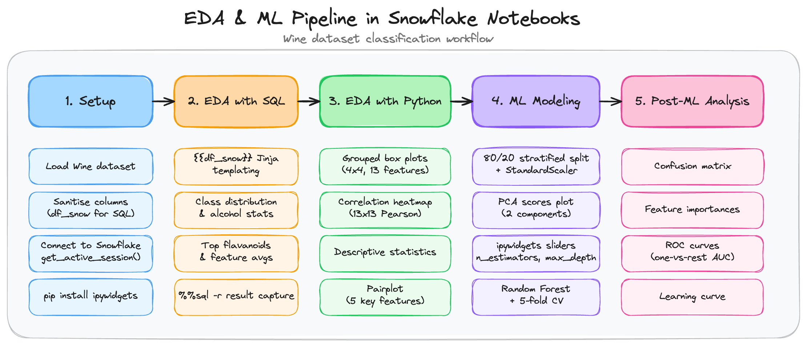
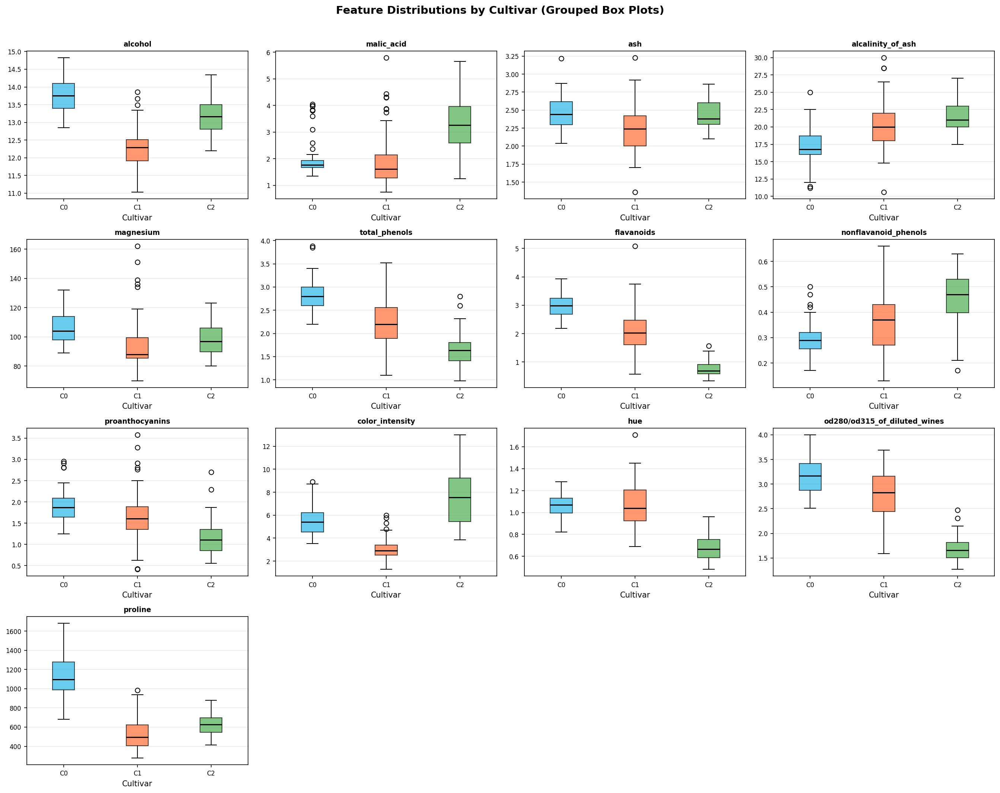
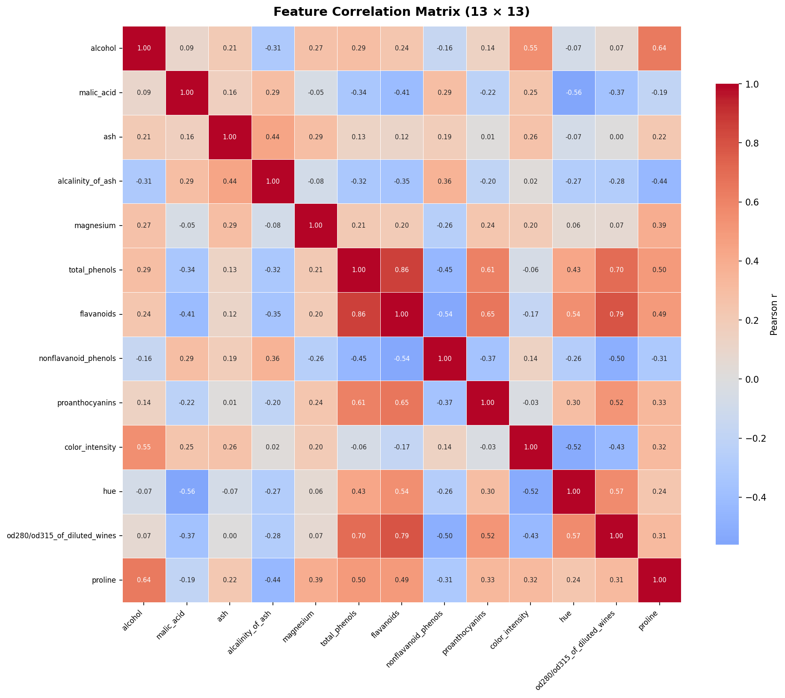
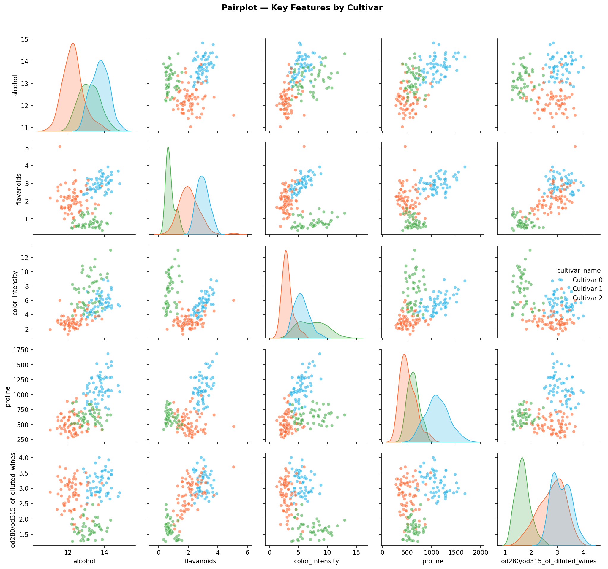
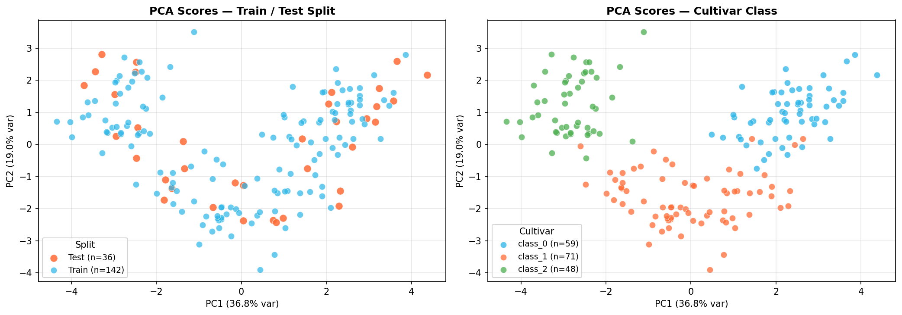
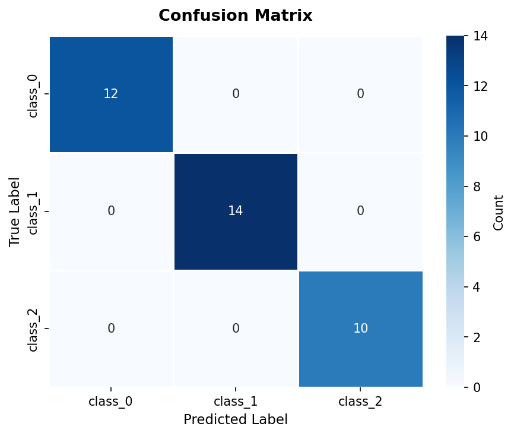
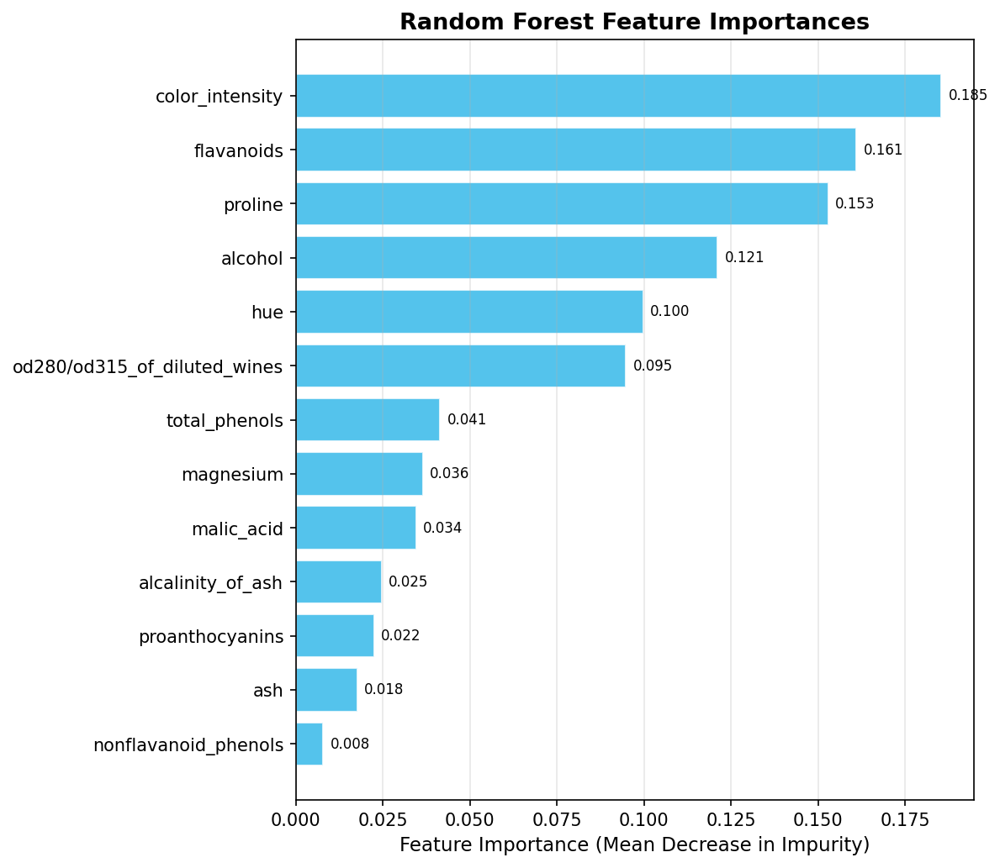
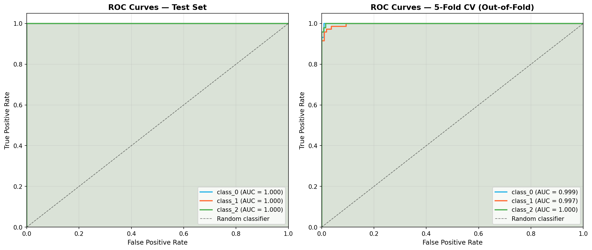
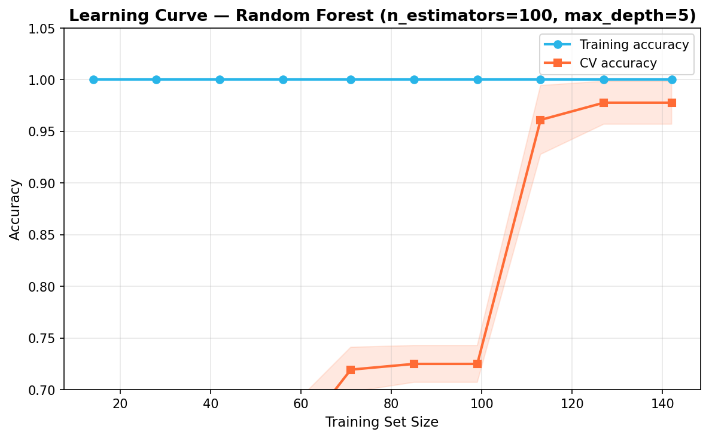

author: Chanin Nantasenamat
id: getting-started-with-snowflake-notebooks-in-workspaces-eda-ml-pipeline
categories: snowflake-site:taxonomy/solution-center/certification/quickstart, snowflake-site:taxonomy/product/platform, snowflake-site:taxonomy/product/ai
language: en
summary: Build a complete EDA and ML classification pipeline inside Snowflake Notebooks in Workspaces using the Wine dataset — combining SQL exploration, Python visualizations, and a Random Forest classifier.
environments: web
status: Published
feedback link: https://github.com/Snowflake-Labs/sfguides/issues
tags: Getting Started, Data Science, Machine Learning, Snowflake Notebooks, EDA, Random Forest, Container Runtime

# Getting Started with Snowflake Notebooks in Workspaces: Build an EDA and ML Pipeline
<!-- ------------------------ -->
## Overview

As a data scientist, setting up a local environment for each new project (*i.e.* installing packages, configuring database connections, and managing dependencies) takes time away from what matters: exploring data and building models. [Snowflake Notebooks in Workspaces](https://docs.snowflake.com/en/user-guide/ui-snowsight/notebooks-in-workspaces/notebooks-in-workspaces-overview) removes that friction by providing a cell-based, interactive environment for Python and SQL that runs directly inside Snowflake. You get access to your data, scalable compute, and a curated package library without leaving the platform.

This guide walks you through a realistic data science workflow using the [Wine dataset](https://scikit-learn.org/stable/datasets/toy_dataset.html#wine-recognition-dataset) — from loading data and writing SQL queries to producing visualizations and training a classification model, all inside a single Snowflake Notebook.

The pipeline covers five sequential stages:

| Step | Section | What you do |
|------|---------|-------------|
| 1 | **Setup** | Load the Wine dataset, write it to a Snowflake temp table |
| 2 | **EDA with SQL** | Class balance, per-class aggregations, ranked queries |
| 3 | **EDA with Python** | Grouped box plots, 13x13 correlation heatmap, pairplot |
| 4 | **Machine Learning Modeling** | Train/test split, PCA scores, Random Forest + cross-validation |
| 5 | **Post-ML Analysis** | Confusion matrix, feature importances, ROC curves, learning curve |

### Prerequisites

- Basic familiarity with Python and SQL.
- A [Snowflake account](https://signup.snowflake.com/cortex-code?utm_source=snowflake-devrel&utm_medium=developer-guides&utm_cta=developer-guides). Sign up for a [30-day free trial](https://signup.snowflake.com/cortex-code?utm_source=snowflake-devrel&utm_medium=developer-guides&utm_cta=developer-guides) if required.
- **[Cortex Code](https://docs.snowflake.com/en/user-guide/cortex-code/cortex-code) (optional)** — not required if you use the provided code snippets directly. Needed if you want to use the **Prompt** sections to generate or extend the code interactively.

### What You'll Learn

- How to load an in-memory Python dataset into a pandas DataFrame and reference it from SQL cells using Jinja templating.
- How SQL cells return **Snowpark pandas (snowpandas) DataFrames** by default in Container Runtime 2.6 or higher, and how to convert them to pandas with `.to_pandas()` when needed.
- How to produce publication-quality EDA visualizations (box plots, heatmaps, pairplots) inside a Notebook.
- How to train and evaluate a Random Forest classifier with interactive `ipywidgets` sliders for hyperparameters.
- How to interpret post-training diagnostics: confusion matrices, feature importances, ROC curves, and learning curves.

### What You'll Need

- Access to [Snowflake Workspaces](https://docs.snowflake.com/en/user-guide/ui-snowsight/workspaces) and a [Compute Pool](https://docs.snowflake.com/en/user-guide/ui-snowsight/notebooks-in-workspaces/notebooks-in-workspaces-compute-setup).
- The [getting-started-with-snowflake-notebooks-in-workspaces-eda-ml-pipeline.ipynb](https://github.com/Snowflake-Labs/snowflake-demo-notebooks/blob/main/getting-started-with-snowflake-notebooks-in-workspaces-eda-ml-pipeline/getting-started-with-snowflake-notebooks-in-workspaces-eda-ml-pipeline.ipynb) notebook file from the Snowflake Demo Notebooks](https://github.com/Snowflake-Labs/snowflake-demo-notebooks) repo.

### What You'll Build

An end-to-end classification pipeline on the Wine dataset:

- An in-memory pandas DataFrame (`df_snow`) holding 178 samples and 13 chemical features, referenced directly from SQL cells via Jinja templating.
- SQL EDA queries revealing class balance, alcohol statistics, and top samples by flavanoid content.
- Python EDA charts including grouped box plots and a 13x13 correlation heatmap.
- A trained `RandomForestClassifier` with interactive hyperparameter sliders, evaluated via 5-fold cross-validation.
- Post-ML diagnostic charts: confusion matrix, feature importances, ROC curves, and learning curve.

<!-- https://excalidraw.com/#json=pBuG3522Q2TPKjL59ep3l,Ka9AXVQl0-xrtxC5G6UVvQ -->

*EDA & ML Pipeline in Snowflake Notebooks — Wine dataset classification workflow*

<!-- ------------------------ -->
## Import the Notebook into Snowflake

The [getting-started-with-snowflake-notebooks-in-workspaces-eda-ml-pipeline.ipynb](https://github.com/Snowflake-Labs/snowflake-demo-notebooks/blob/main/getting-started-with-snowflake-notebooks-in-workspaces-eda-ml-pipeline/getting-started-with-snowflake-notebooks-in-workspaces-eda-ml-pipeline.ipynb) notebook file is available in the [Snowflake Demo Notebooks](https://github.com/Snowflake-Labs/snowflake-demo-notebooks) repository.

### Step 1 — Download the notebook

1. Click [getting-started-with-snowflake-notebooks-in-workspaces-eda-ml-pipeline](https://github.com/Snowflake-Labs/snowflake-demo-notebooks/tree/main/getting-started-with-snowflake-notebooks-in-workspaces-eda-ml-pipeline) to open the folder directly.
2. Click on the [getting-started-with-snowflake-notebooks-in-workspaces-eda-ml-pipeline.ipynb](https://github.com/Snowflake-Labs/snowflake-demo-notebooks/blob/main/getting-started-with-snowflake-notebooks-in-workspaces-eda-ml-pipeline/getting-started-with-snowflake-notebooks-in-workspaces-eda-ml-pipeline.ipynb) notebook file, then click **Download raw file** (top-right icon).

### Step 2 — Import into Snowsight

1. Log in to [Snowsight](https://app.snowflake.com).
2. Navigate to **Projects > Workspaces** in the left sidebar.
3. In the **Workspaces** tab on the left pane, click on **+ Add new**, then **Upload files**. 
4. Select the `.ipynb` notebook file from your local computer that you've already downloaded in step 1 and click **Open**.
5. From the **Workspaces** tab on the left pane, click on the notebook file to open it up. Next, click on the **"Connect"** widget so that it connects to the compute service.

### Step 3 — Switch to Container Runtime

This notebook uses packages such as `scikit-learn`, `seaborn`, and `ipywidgets` that are available on Container Runtime. This guide was developed and tested with **Container Runtime 2.6 (CPU)**.

1. Open the notebook and in the top **Connect/Connected** widget, click on the drop-down to create a new service or edit an existing service to use runtime version 2.6 or higher.
2. Click on the **Connect** widget to start the service and wait for the container to start (typically under 60 seconds).


<!-- ------------------------ -->
## Setup: Load the Wine Dataset

The first section loads the scikit-learn Wine dataset into a pandas DataFrame, connects to Snowflake, and prepares a SQL-safe copy of the DataFrame called `df_snow`. SQL cells in the notebook reference `df_snow` directly via Jinja templating (`{{df_snow}}`), so no explicit table upload is needed.

### Prompt

Use this prompt with an AI coding assistant to extend this section:

```
Load the scikit-learn Wine dataset into a pandas DataFrame. Sanitise column names
by replacing / with _ so they are safe to use in SQL. Print the dataset shape,
feature names, and class names.
```

### Load the Wine Dataset

```python
import re
import pandas as pd
from sklearn.datasets import load_wine

# Load Wine dataset into a pandas DataFrame
wine = load_wine()
df = pd.DataFrame(wine.data, columns=wine.feature_names)
df['cultivar'] = wine.target
df['cultivar_name'] = df['cultivar'].map({0: 'Cultivar 0', 1: 'Cultivar 1', 2: 'Cultivar 2'})

print(f"Dataset shape: {df.shape}")
print(f"Features: {list(wine.feature_names)}")
print(f"Classes: {list(wine.target_names)}")

# Sanitise column names for SQL (replace / with _)
def safe_col(name):
    return re.sub(r'[^a-zA-Z0-9_]', '_', name)

df_snow = df.rename(columns={c: safe_col(c) for c in df.columns})
print(f"\ndf_snow columns: {list(df_snow.columns)}")
```

The `df_snow` DataFrame is identical to `df` except its column names replace `/` with `_` — required because the SQL Jinja templating syntax (`{{df_snow}}`) does not accept slashes in column names.

### Install Packages

```python
! pip install ipywidgets
```

`ipywidgets` provides interactive sliders for the hyperparameter tuning section. It is not pre-installed on Container Runtime.

### Connect to Snowflake

```python
from snowflake.snowpark.context import get_active_session

session = get_active_session()
print(f'Connected as : {session.get_current_user()}')
print(f'Role         : {session.get_current_role()}')
print(f'Warehouse    : {session.get_current_warehouse()}')

result = session.sql('SELECT CURRENT_TIMESTAMP() AS now, CURRENT_VERSION() AS sf_version').collect()
for row in result:
    print(f'Timestamp : {row["NOW"]}')
    print(f'SF version: {row["SF_VERSION"]}')
```

`get_active_session()` connects to the Snowflake session that is already attached to the running notebook — no credentials are required.

The notebook does not explicitly write `df_snow` to `WINE_TMP` in a separate cell; instead, SQL cells reference the DataFrame directly via Jinja templating (`{{df_snow}}`), which Snowflake Notebooks evaluates at query time.

### What Gets Generated

Running this section prints the dataset dimensions, feature list, class names, and Snowflake session details:

```
Dataset shape: (178, 15)
Features: ['alcohol', 'malic_acid', 'ash', 'alcalinity_of_ash', 'magnesium',
           'total_phenols', 'flavanoids', 'nonflavanoid_phenols', 'proanthocyanins',
           'color_intensity', 'hue', 'od280/od315_of_diluted_wines', 'proline']
Classes: ['class_0', 'class_1', 'class_2']

df_snow columns: ['alcohol', 'malic_acid', 'ash', 'alcalinity_of_ash', 'magnesium',
                  'total_phenols', 'flavanoids', 'nonflavanoid_phenols', 'proanthocyanins',
                  'color_intensity', 'hue', 'od280_od315_of_diluted_wines', 'proline',
                  'cultivar', 'cultivar_name']

Connected as : JANE_DOE
Role         : SYSADMIN
Warehouse    : COMPUTE_WH
Timestamp : 2026-06-19 10:00:00.000
SF version: 8.x.x
```

<!-- ------------------------ -->
## EDA with SQL

With `df_snow` in memory, SQL cells can reference it directly using the `{{df_snow}}` Jinja syntax. Snowflake Notebooks evaluates the template at query time, serialises the DataFrame, and executes the query — all transparently.

SQL cells use the `%%sql` cell magic. Adding `-r <variable_name>` captures the result as a **Snowpark pandas (snowpandas) DataFrame** for use in subsequent Python cells. In Container Runtime 2.6 and later, SQL cell results are returned as Snowpark pandas DataFrames by default — if a downstream operation requires a regular pandas DataFrame, call `.to_pandas()` on the result:

```
%%sql -r df_result
SELECT ... FROM {{df_snow}}
```

```python
# Convert to pandas if needed for downstream pandas operations
df_result_pd = df_result.to_pandas()
```

### Prompt

Use this prompt with an AI coding assistant to extend this section with more advanced SQL patterns:

```
Using a Snowpark session in a Snowflake Notebook, write four SQL cells that
reference a pandas DataFrame via Jinja templating ({{df_snow}}): (1) count
samples per cultivar with percentage of total using a window function, (2)
compute a five-number summary (min, Q1, median, Q3, max) of alcohol content
grouped by cultivar using PERCENTILE_CONT, (3) rank the top 3 samples per
cultivар by flavanoid content using RANK() OVER (PARTITION BY), and (4) compute
per-feature average by cultivar using a single-scan UNPIVOT + PIVOT instead of
multiple UNION ALL subqueries.
```

### Class Distribution

```sql
%%sql -r df_class_dist
SELECT
    cultivar,
    cultivar_name,
    COUNT(*) AS sample_count
FROM {{df_snow}}
GROUP BY cultivar, cultivar_name
ORDER BY cultivar
```

This query confirms whether the dataset is balanced across the three Wine cultivar classes (0, 1, 2).

### Alcohol Stats per Cultivar

```sql
%%sql -r df_alcohol_stats
SELECT
    cultivar_name,
    ROUND(MIN(alcohol), 3)  AS min_alcohol,
    ROUND(AVG(alcohol), 3)  AS avg_alcohol,
    ROUND(MAX(alcohol), 3)  AS max_alcohol
FROM {{df_snow}}
GROUP BY cultivar_name
ORDER BY cultivar_name
```

The `%%sql -r <variable>` magic captures the result into a Python variable (`df_alcohol_stats`) for downstream use in Python cells.

### Top Samples by Flavanoid Content

```sql
%%sql -r df_top_flavanoids
SELECT
    cultivar_name,
    ROUND(alcohol, 3)    AS alcohol,
    ROUND(flavanoids, 3) AS flavanoids,
    ROUND(proline, 0)    AS proline
FROM {{df_snow}}
ORDER BY flavanoids DESC
LIMIT 9
```

### Average Feature Values per Cultivar

```sql
%%sql -r df_feature_avgs
SELECT
    cultivar_name,
    ROUND(AVG(alcohol), 3)         AS avg_alcohol,
    ROUND(AVG(flavanoids), 3)      AS avg_flavanoids,
    ROUND(AVG(color_intensity), 3) AS avg_color_intensity,
    ROUND(AVG(proline), 3)         AS avg_proline
FROM {{df_snow}}
GROUP BY cultivar_name
ORDER BY cultivar_name
```

This reveals how the three cultivars differ on the features most commonly used in Wine classification tasks.

### What Gets Generated

Each SQL cell returns a result table rendered inline in the notebook. For example, the class distribution query returns:

```
  cultivar  cultivar_name  sample_count
0        0    Cultivar 0            59
1        1    Cultivar 1            71
2        2    Cultivar 2            48
```

And the alcohol stats query returns:

```
  cultivar_name  min_alcohol  avg_alcohol  max_alcohol
0   Cultivar 0        11.45       13.745        14.83
1   Cultivar 1        11.03       12.279        14.10
2   Cultivar 2        11.03       13.153        14.34
```

<!-- ------------------------ -->
## EDA with Python

Python-based EDA focuses on the *shape* of the data — how features are distributed across cultivar classes and how strongly they correlate with each other.

### Prompt

Use this prompt with an AI coding assistant to extend this section:

```
Using matplotlib and seaborn, produce three visualisations for the Wine dataset:
(1) a grid of grouped box plots showing the distribution of every feature broken
out by cultivar, (2) a lower-triangle 13x13 Pearson correlation heatmap with
annotated coefficients, and (3) a pairplot of the five most discriminative
features coloured by cultivar class.
```

### Grouped Box Plots

```python
import matplotlib.pyplot as plt

features = wine.feature_names
n_cols = 4
n_rows = (len(features) + n_cols - 1) // n_cols

fig, axes = plt.subplots(n_rows, n_cols, figsize=(18, n_rows * 3.5))
axes = axes.flatten()
colors = ['#29B5E8', '#FF6B35', '#4CAF50']

for i, feat in enumerate(features):
    ax = axes[i]
    data_by_class = [df[df['cultivar'] == c][feat].values for c in [0, 1, 2]]
    bp = ax.boxplot(data_by_class, patch_artist=True, tick_labels=['C0', 'C1', 'C2'],
                    medianprops=dict(color='black', linewidth=1.5))
    for patch, color in zip(bp['boxes'], colors):
        patch.set_facecolor(color)
        patch.set_alpha(0.7)
    ax.set_title(feat, fontsize=9, fontweight='bold')
    ax.grid(True, alpha=0.3, axis='y')

for j in range(len(features), len(axes)):
    axes[j].set_visible(False)

fig.suptitle('Feature Distributions by Cultivar (Grouped Box Plots)', fontsize=14, fontweight='bold')
plt.tight_layout()
plt.show()
```

The 4x4 grid of box plots shows how each of the 13 chemical features is distributed across the three cultivar classes. Features such as **flavanoids** and **proline** show strong class separation — they are good candidates for classification.

### Correlation Heatmap

```python
import numpy as np
import seaborn as sns

numeric_df = df[list(wine.feature_names)]
corr = numeric_df.corr()

fig, ax = plt.subplots(figsize=(13, 11))
sns.heatmap(
    corr,
    annot=True, fmt='.2f',
    cmap='coolwarm', center=0,
    linewidths=0.4,
    annot_kws={'size': 7},
    ax=ax
)
ax.set_title('Feature Correlation Matrix (13x13)', fontsize=14, fontweight='bold')
plt.tight_layout()
plt.show()
```

The 13x13 heatmap annotates every Pearson correlation coefficient. Notable strong correlations include **flavanoids** and **total_phenols** (r ≈ 0.86) — meaning these features carry similar information and one could be dropped to reduce multicollinearity before modeling.

### Descriptive Statistics

```python
stats = df[list(wine.feature_names)].describe().T.round(3)
print(stats.to_string())
```

This prints count, mean, std, min, 25th/50th/75th percentile, and max for all 13 features in a single transposed table — useful for spotting scale differences before applying `StandardScaler`.

### Pairplot — Key Features by Cultivar

```python
key_features = ['alcohol', 'flavanoids', 'color_intensity', 'proline',
                'od280/od315_of_diluted_wines']
pair_df = df[key_features + ['cultivar_name']].copy()

palette = {'Cultivar 0': '#29B5E8', 'Cultivar 1': '#FF6B35', 'Cultivar 2': '#4CAF50'}
g = sns.pairplot(pair_df, hue='cultivar_name', palette=palette,
                 plot_kws={'alpha': 0.6, 's': 25}, diag_kind='kde')
g.figure.suptitle('Pairplot — Key Features by Cultivar', y=1.02, fontsize=13, fontweight='bold')
plt.tight_layout()
plt.show()
```

The pairplot of the 5 most discriminative features shows near-linear separability between cultivar classes in 2D projections — a strong signal that a linear or tree-based classifier should achieve high accuracy.

### What Gets Generated

Three figures are rendered inline in the notebook:

**Grouped box plots** — a 4x4 grid showing the distribution of all 13 features split by cultivar class. Features like `flavanoids` and `proline` show clean separation between classes:



**Correlation heatmap** — a 13x13 annotated Pearson correlation matrix. Strong positive correlations appear between `flavanoids` and `total_phenols` (r ≈ 0.86):



**Pairplot** — scatter matrix of the 5 most discriminative features coloured by cultivar, showing near-linear separability:



<!-- ------------------------ -->
## Machine Learning Modeling

This section preprocesses the data, visualizes the train/test split in PCA space, exposes interactive hyperparameter sliders, trains a Random Forest, and evaluates it with cross-validation.

### Prompt

Use this prompt with an AI coding assistant to extend this section:

```
Split the Wine dataset 80/20 with stratification and scale features using
StandardScaler. Fit a PCA with 2 components and plot the scores coloured by
(a) train/test split and (b) cultivar class in side-by-side scatter plots. Add
ipywidgets IntSlider widgets for n_estimators (range 10-500, step 10) and
max_depth (range 1-20), then train a RandomForestClassifier reading those slider
values, report test-set accuracy, and run 5-fold cross-validation on the full
dataset.
```

### Preprocessing: Train/Test Split and Scaling

```python
from sklearn.model_selection import train_test_split
from sklearn.preprocessing import StandardScaler

X = df[list(wine.feature_names)].values
y = df['cultivar'].values

X_train, X_test, y_train, y_test = train_test_split(
    X, y, test_size=0.2, random_state=42, stratify=y
)

scaler = StandardScaler()
X_train_scaled = scaler.fit_transform(X_train)
X_test_scaled = scaler.transform(X_test)

print(f"Train set: {X_train_scaled.shape[0]} samples")
print(f"Test set:  {X_test_scaled.shape[0]} samples")
```

An 80/20 stratified split is used so that the class proportions are preserved in both train and test sets. `StandardScaler` is **fit only on the training set** to avoid data leakage — it is then applied to the test set using the training-set statistics.

### PCA Scores Panel Plot

```python
from sklearn.decomposition import PCA

X_full = df[list(wine.feature_names)].values
X_full_scaled = scaler.transform(X_full)

pca = PCA(n_components=2, random_state=42)
X_pca = pca.fit_transform(X_full_scaled)
var_explained = pca.explained_variance_ratio_ * 100
```

The PCA scores plot has two panels:
- **Left**: train samples (blue) and test samples (orange) overlaid in 2D PCA space — confirming the split is representative and not accidentally grouped in one region.
- **Right**: the same points coloured by cultivar class — confirming that the three classes are largely linearly separable in the first two principal components.

### Interactive Hyperparameter Sliders

```python
import ipywidgets as widgets
from IPython.display import display

n_estimators_slider = widgets.IntSlider(
    value=100, min=10, max=500, step=10,
    description='n_estimators:',
    style={'description_width': 'initial'},
    continuous_update=False
)

max_depth_slider = widgets.IntSlider(
    value=5, min=1, max=20, step=1,
    description='max_depth:',
    style={'description_width': 'initial'},
    continuous_update=False
)

print('Adjust sliders then run the next cell to train the model.')
display(n_estimators_slider, max_depth_slider)
```

Adjust the sliders, then run the next cell. The model will be retrained with the new values each time you run it.

### Train Random Forest and Cross-Validate

```python
from sklearn.ensemble import RandomForestClassifier
from sklearn.model_selection import cross_val_score

n_estimators = n_estimators_slider.value
max_depth = max_depth_slider.value

rf = RandomForestClassifier(n_estimators=n_estimators, max_depth=max_depth, random_state=42)
rf.fit(X_train_scaled, y_train)

test_accuracy = rf.score(X_test_scaled, y_test)
print(f"Test set accuracy: {test_accuracy:.4f} ({test_accuracy*100:.1f}%)")

cv_scores = cross_val_score(rf, scaler.transform(X), y, cv=5, scoring='accuracy')
print(f"\n5-Fold Cross-Validation:")
print(f"  Scores: {[f'{s:.3f}' for s in cv_scores]}")
print(f"  Mean:   {cv_scores.mean():.4f} +/- {cv_scores.std():.4f}")
```

### Classification Report

```python
from sklearn.metrics import classification_report

y_pred = rf.predict(X_test_scaled)
print(classification_report(y_test, y_pred, target_names=wine.target_names))
```

The per-class precision, recall, and F1-score confirm which cultivar classes (if any) are harder for the model to distinguish.

### What Gets Generated

The PCA scores panel confirms the split is representative and that cultivars are linearly separable in 2D PCA space:



The Random Forest training cell prints accuracy and cross-validation scores:

```
Training RandomForest with n_estimators=100, max_depth=5
Test set accuracy: 0.9722 (97.2%)

5-Fold Cross-Validation:
  Scores: ['0.944', '0.944', '1.000', '1.000', '0.971']
  Mean:   0.9722 +/- 0.0249
```

<!-- ------------------------ -->
## Post-ML Analysis

Post-training diagnostics help you understand where the model makes mistakes, which features drive its predictions, how well it separates classes across all decision thresholds, and whether additional training data would improve performance.

### Prompt

Use this prompt with an AI coding assistant to extend this section:

```
After training a Random Forest on the Wine dataset, produce four evaluation
plots: (1) a seaborn heatmap confusion matrix for the test set, (2) a horizontal
bar chart of feature importances sorted ascending, (3) one-vs-rest ROC curves
with AUC scores for all three cultivar classes on a single axes, and (4) a
learning curve showing mean training and cross-validation accuracy with +/-1 std
shading as training set size increases. The learning curve title should reflect
the current n_estimators and max_depth values from the ipywidgets sliders.
```

### Confusion Matrix

```python
from sklearn.metrics import confusion_matrix

cm = confusion_matrix(y_test, y_pred)

fig, ax = plt.subplots(figsize=(6, 5))
sns.heatmap(
    cm, annot=True, fmt='d', cmap='Blues',
    xticklabels=wine.target_names,
    yticklabels=wine.target_names,
    ax=ax
)
ax.set_title('Confusion Matrix', fontsize=13, fontweight='bold')
ax.set_xlabel('Predicted Label')
ax.set_ylabel('True Label')
plt.tight_layout()
plt.show()
```

Each cell shows the count of test samples with a given true label (row) and predicted label (column). Off-diagonal cells represent misclassifications.

### Feature Importances

```python
importances = rf.feature_importances_
sorted_idx = np.argsort(importances)

fig, ax = plt.subplots(figsize=(8, 7))
ax.barh(range(len(sorted_idx)), importances[sorted_idx], color='#29B5E8', alpha=0.8)
ax.set_yticks(range(len(sorted_idx)))
ax.set_yticklabels([wine.feature_names[i] for i in sorted_idx])
ax.set_title('Random Forest Feature Importances', fontsize=13, fontweight='bold')
plt.tight_layout()
plt.show()
```

Feature importances are measured by **mean decrease in impurity** across all trees. Typically, **proline**, **color_intensity**, and **flavanoids** rank highest for the Wine dataset — consistent with the EDA observations.

### ROC Curves (One-vs-Rest)

```python
from sklearn.preprocessing import label_binarize
from sklearn.metrics import roc_curve, auc
from sklearn.model_selection import cross_val_predict

y_bin = label_binarize(y, classes=[0, 1, 2])
X_scaled_all = scaler.transform(X)
_, X_test_all, _, y_test_bin = train_test_split(
    X_scaled_all, y_bin, test_size=0.2, random_state=42, stratify=y
)
y_score = rf.predict_proba(X_test_scaled)

y_cv_score = cross_val_predict(
    RandomForestClassifier(n_estimators=n_estimators, max_depth=max_depth, random_state=42),
    X_scaled_all, y, cv=5, method='predict_proba'
)
```

Two ROC panels are plotted side by side:
- **Left** — AUC on the held-out test set (20% of data).
- **Right** — AUC from 5-fold CV out-of-fold predictions (all 178 samples used for evaluation without data leakage).

Comparing the two panels lets you check whether strong test-set AUC is reproducible across multiple splits or is a lucky artifact of the particular 80/20 split.

### Learning Curve

```python
from sklearn.model_selection import learning_curve

train_sizes, train_scores, val_scores = learning_curve(
    RandomForestClassifier(n_estimators=n_estimators, max_depth=max_depth, random_state=42),
    scaler.transform(X), y,
    cv=5, scoring='accuracy',
    train_sizes=np.linspace(0.1, 1.0, 10),
    n_jobs=-1
)

train_mean = train_scores.mean(axis=1)
val_mean   = val_scores.mean(axis=1)
```

The learning curve plots training accuracy and CV accuracy as a function of training set size. A small gap between the two curves at the rightmost point indicates the model is not overfitting and is unlikely to benefit significantly from collecting more data.

### What Gets Generated

Four diagnostic plots are rendered inline:

**Confusion matrix** — true vs predicted labels on the test set. Diagonal cells are correctly classified samples; off-diagonal cells are misclassifications:



**Feature importances** — horizontal bar chart ranked by mean decrease in impurity. `proline`, `color_intensity`, and `flavanoids` are the top predictors:



**ROC curves** — one-vs-rest AUC side by side for the test set and 5-fold CV out-of-fold predictions. All three cultivars achieve AUC > 0.99:



**Learning curve** — training and CV accuracy vs dataset size with ±1 std shading. The narrow gap at the right indicates no significant overfitting:



<!-- ------------------------ -->
## Summary and Next Steps

### What You Built

In this guide you built a complete end-to-end classification pipeline inside a single Snowflake Notebook:

- **Setup** — loaded the Wine dataset into a pandas DataFrame, connected to Snowflake via `get_active_session()`, and sanitised column names for SQL compatibility.
- **SQL EDA** — queried the in-memory pandas DataFrame directly from SQL cells using `{{df_snow}}` Jinja templating to verify class balance, compare alcohol statistics, surface top flavanoid samples, and compare per-cultivar feature averages. SQL cell results are returned as Snowpark pandas (snowpandas) DataFrames (call `.to_pandas()` for downstream pandas operations).
- **Python EDA** — grouped box plots revealed per-feature class separability; the 13x13 correlation heatmap identified collinear features; a pairplot of the five most discriminative features confirmed near-linear class separability.
- **PCA scores plot** — confirmed the stratified 80/20 train/test split is representative and that cultivars are largely separable in 2D PCA space.
- **Random Forest** — trained with interactive `ipywidgets` sliders for `n_estimators` and `max_depth`; validated with 5-fold cross-validation to confirm the result generalizes beyond the single split.
- **Post-ML analysis** — confusion matrix identified which cultivars are misclassified; feature importances ranked proline, color_intensity, and flavanoids as the top predictors; ROC curves confirmed strong one-vs-rest AUC; the learning curve showed no significant overfitting.

### Next Steps

- **Try other classifiers** — swap in `SVC`, `GradientBoostingClassifier`, or `LogisticRegression` in place of `RandomForestClassifier` to compare performance.
- **Hyperparameter search** — replace the manual sliders with `GridSearchCV` or `RandomizedSearchCV` from scikit-learn.
- **Register the model** — use the [Snowflake Model Registry](https://docs.snowflake.com/en/developer-guide/snowflake-ml/model-registry/overview) to version, log metrics for, and deploy the trained model.
- **Schedule the notebook** — use [Notebook Scheduling](https://docs.snowflake.com/en/user-guide/ui-snowsight/notebooks-schedule) to retrain the model on a cadence as new data arrives.
- **Use a real dataset** — replace the Wine dataset with your own table in Snowflake by reading it with `session.table()` or `session.sql()` instead of `load_wine()`.

### Resources

- [Snowflake Notebooks in Workspaces](https://docs.snowflake.com/en/user-guide/ui-snowsight/notebooks-in-workspaces/notebooks-in-workspaces-overview)
- [Snowflake Model Registry](https://docs.snowflake.com/en/developer-guide/snowflake-ml/model-registry/overview)
- [Snowpark Python API](https://docs.snowflake.com/en/developer-guide/snowpark/python/index)
- [scikit-learn Wine dataset](https://scikit-learn.org/stable/datasets/toy_dataset.html#wine-recognition-dataset)
