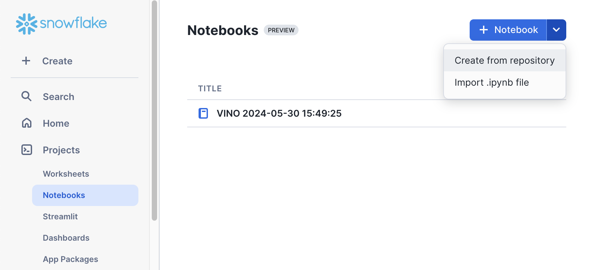
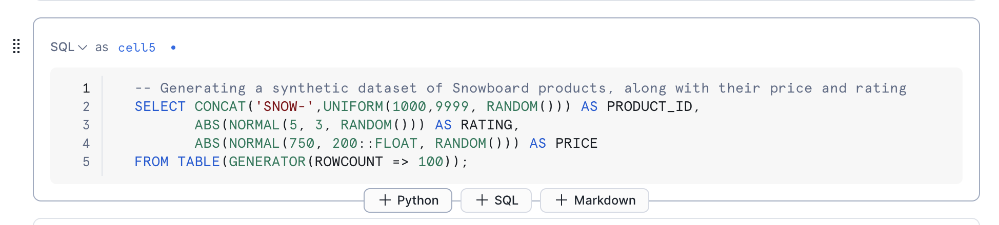
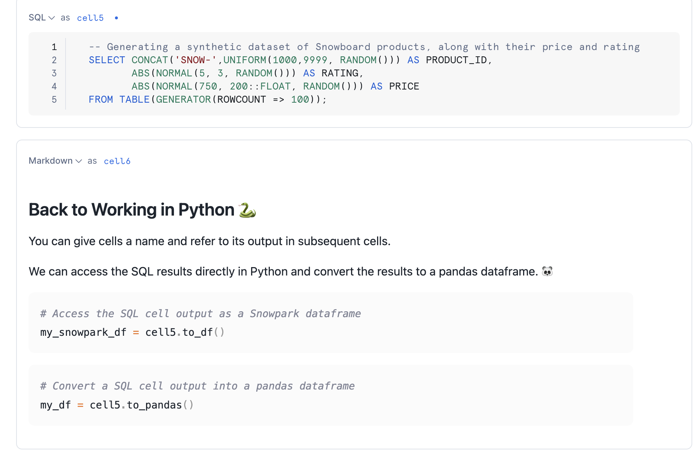
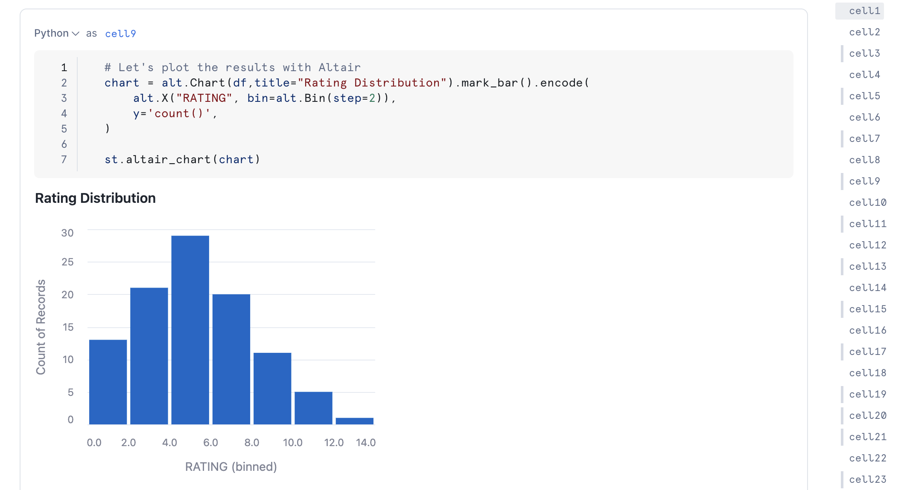
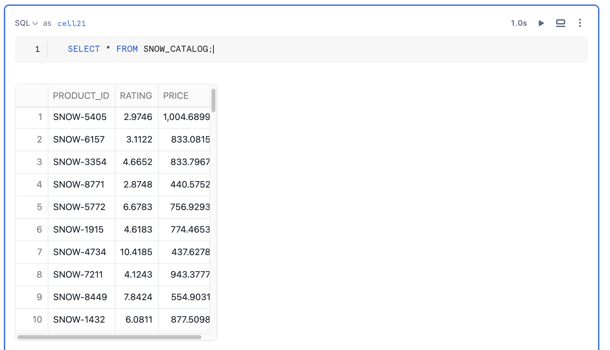
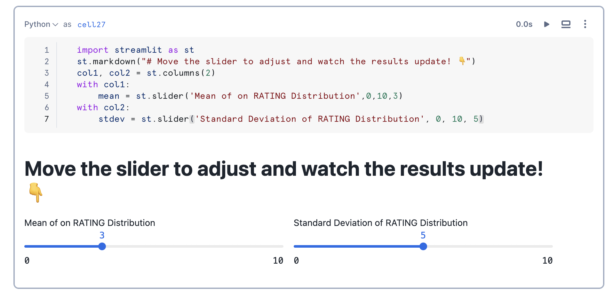
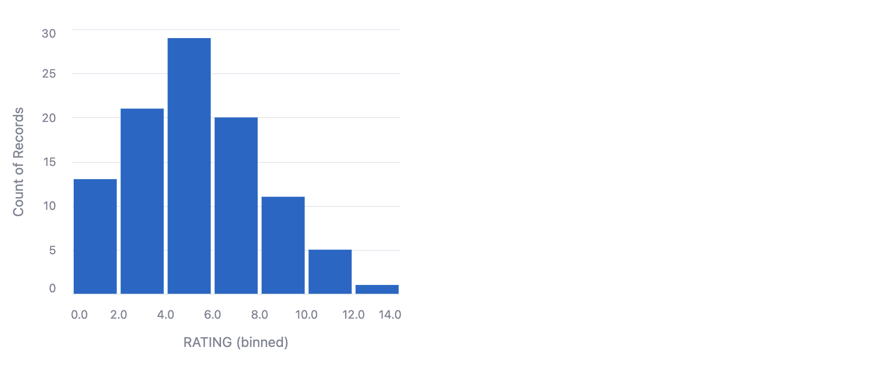

id: getting-started-with-snowflake-notebooks
categories: snowflake-site:taxonomy/solution-center/certification/quickstart, snowflake-site:taxonomy/product/platform
language: en
summary: This guide provides the instructions on how to get started with your first Snowflake Notebook. 
environments: web
status: Published
feedback link: <https://github.com/Snowflake-Labs/sfguides/issues>
authors: Vino Duraisamy, Doris Lee
fork repo link: https://github.com/Snowflake-Labs/sfguide-getting-started-with-snowflake-notebooks


# A Getting Started Guide With Snowflake Notebooks
<!-- ------------------------ -->
## Overview


[Snowflake Notebooks](https://docs.snowflake.com/user-guide/ui-snowsight/notebooks) offer an interactive, cell-based programming environment for Python and SQL. With a Snowflake Notebook, you can perform exploratory data analysis, experiment with feature engineering for machine learning, and perform other data science tasks within Snowflake.

You can write and execute code, visualize results, and tell the story of your analysis all in one place.

* Explore and experiment with data already in Snowflake, or upload new data to Snowflake from local files, external cloud storage, or datasets from the Snowflake Marketplace.
* Write SQL or Python code and quickly compare results with cell-by-cell development and execution.
* Interactively visualize your data using embedded Streamlit visualizations and other libraries like Altair, Matplotlib, or seaborn.
* Contextualize results and make notes about different results with Markdown cells.
* Keep your data fresh by relying on the default behavior to run a cell and all modified cells preceding it or debug your notebook by running it cell-by-cesll.
* Run your notebook on a schedule. See [Schedule your Snowflake Notebook to run](https://docs.snowflake.com/user-guide/ui-snowsight/notebooks-schedule).
* Make use of the role-based access control and other data governance functionality available in Snowflake to allow other users with the same role to view and collaborate on the notebook.


In this guide, we will learn how to get started with your first notebook project!

For ML workloads that require flexibility and scalability, Snowflake Notebooks are also available on the [container runtime](https://docs.snowflake.com/en/user-guide/ui-snowsight/notebooks-on-spcs). These notebooks run on a fully managed container environment with many optimizations for ML workloads including access to CPUs and GPUs, optimized data loading from Snowflake, automatic lineage capture, Model Registry integration, and the ability to Leverage a set of preinstalled ML packages or pip install any custom package of choice. Check out this quickstart for an introductory overview of Snowflake Notebooks on container runtime.

### Prerequisites

- A [Snowflake](https://signup.snowflake.com/?utm_source=snowflake-devrel&utm_medium=developer-guides&utm_cta=developer-guides) account. Sign up for a [30-day free trial](https://signup.snowflake.com/?utm_source=snowflake-devrel&utm_medium=developer-guides&utm_cta=developer-guides) account, if required.
- Access to download `.ipynb` file from [Snowflake notebooks demo repo](https://github.com/Snowflake-Labs/snowflake-demo-notebooks/tree/main)

### What will you build?

Here is a summary of what you will be able to learn in each step by following this quickstart:

- **Adding Python Packages**: How to use pre-installed libraries in Notebooks as well as adding additional packages from package picker
- **Switching between SQL and Python cells**: How to switch between SQL and Python cells in the same notebook
- **Visualize your Data**: How to use Altair and Matplotlib to visualize your data
- **Working with Snowpark**: How to use Snowpark API to process data at scale within the Notebook
- **Using Python Variables in SQL cells**: How to use Jinja syntax `{{.}}` to refer to Python variables within SQL queries, to reference previous cell outputs in your SQL query and more.
- **Creating an Interactive app with Streamlit**: How to build a simple interactive Streamlit app
- **Keyboard Shortcuts in Notebooks**: How to use Keyboard shortcuts in Notebooks to developer faster

<!-- ------------------------ -->
## Load demo notebooks to Snowflake


You can create a Snowflake Notebook directly from the Snowsight UI or upload an existing IPython Notebook to Snowflake.

In this example, we will upload an existing notebook from [Snowflake Notebooks demo repo](https://github.com/Snowflake-Labs/snowflake-demo-notebooks/tree/main) into a Snowflake account.

The notebook files are available for download as `.ipynb` files in the demo repository. To load the demo notebooks into your Snowflake Notebook, follow these steps: 

1. On Github, click into each folder containing the tutorial and the corresponding `.ipynb file`, such as [this](https://github.com/Snowflake-Labs/notebook-demo/blob/main/My%20First%20Notebook%20Project/My%20First%20Notebook%20Project.ipynb). Download the file by clicking on the `Download raw file` from the top right.

2. Go to the Snowflake web interface, [Snowsight](https://app.snowflake.com), on your browser.

3. Navigate to `Project` > `Notebooks` from the left menu bar. 

4. Import the .ipynb file you've download into your Snowflake Notebook by using the `Import from .ipynb` button located on the top right of the Notebooks page.



5. Select the file from your local directory and press `Open`.

6. A `Create Notebook` dialog will show up. Select a database, schema, and warehouse for the Notebook and click `Create`.

<!-- ------------------------ -->
## Running Snowflake Notebooks


Let's walk through the first demo notebook in Snowflake now.

### Adding Python Packages

Notebooks comes pre-installed with common Python libraries for data science and machine learning, such as numpy, pandas, matplotlib, and more!

If you are looking to use other packages, click on the Packages dropdown on the top right to add additional packages to your notebook.

For the purpose of this demo, let's add the `matplotlib` and `scipy` package from the package picker.


### Switching between SQL and Python cells

It is often useful to switch between working with SQL and Python at different stages in your data analysis workflow.

While creating a new cell, you can select between `SQL`, `Python` and `Markdown` cells to select an appropriate one you need.

Every cell at the top left has a drop down list that shows the type of cell along with the cell number as well.



### Accessing cell outputs as variables in Python

You can give cells a custom name (as opposed to the default cell#) and refer to the cell output in subsequent cells as well.

For example, you can refer to the output of the SQL query in `cell5` in a `Python variable` called `cell5` in subsequent cells.



### Visualize your data

You can use different visualization libraries such as Altair, Streamlit, matplotlib to plot your data.

Let's use Altair to easily visualize our data distribution as a histogram.



To learn more on how to visualize your data with other visualization libraries, refer to the [documentation](https://docs.snowflake.com/en/user-guide/ui-snowsight/notebooks-visualize-data).

### Working with Data using Snowpark

In addition to using your favorite Python data science libraries, you can also use the [Snowpark API](https://docs.snowflake.com/en/developer-guide/snowpark/index) to query and process your data at scale within the Notebook. 

First, you can get your session variable directly through the active notebook session. 
The session variable is the entrypoint that gives you access to using Snowflake's Python API.

```python
    from snowflake.snowpark.context import get_active_session
    session = get_active_session()
```
Here we use the Snowpark API to write a pandas dataframe as a Snowpark table named `SNOW_CATALOG`.

```python
    session.write_pandas(df, "SNOW_CATALOG", auto_create_table=True, table_type="temp")
```

### Using Python variables in SQL cells

You can use the Jinja syntax `{{..}}` to refer to Python variables within your SQL queries as follows. 

```python
threshold = 5
```

```sql
-- Reference Python variable in SQL
SELECT * FROM SNOW_CATALOG where RATING > {{threshold}}
```

Likewise, you can reference a Pandas dataframe within your SQL statment:

```sql
-- Filtering from a Pandas dataframe
SELECT * FROM {{my_df}} where VAR = 6
```

### Simplifying your subqueries

Let's start with the output of `cell21` in this notebook. Here is how it looks!

```sql
    SELECT * FROM SNOW_CATALOG;
```



You can simplify long subqueries with [CTEs](https://docs.snowflake.com/en/user-guide/queries-cte) by combining what we've learned with Python and SQL cell result referencing. 

For example, if we want to compute the average rating of all products with ratings above 5. We would typically have to write something like the following:

```sql
WITH RatingsAboveFive AS (
    SELECT RATING
    FROM SNOW_CATALOG
    WHERE RATING > 5
)
SELECT AVG(RATING) AS AVG_RATING_ABOVE_FIVE
FROM RatingsAboveFive;
```

With Snowflake Notebooks, the query is much simpler! You can get the same result by filtering a SQL table from another SQL cell by referencing it with Jinja, e.g., `{{my_cell}}`. 

```sql  
SELECT AVG(RATING) FROM {{cell21}}
WHERE RATING > 5
```

<!-- ------------------------ -->
## Create Interactive Streamlit App


Putting all our learnings together, let's build a streamlit app to explore how different parameters impact the shape of the data distribution histogram.

Here is the code snippet to build interactive sliders:

```python
import streamlit as st
st.markdown("# Move the slider to adjust and watch the results update! 👇")
col1, col2 = st.columns(2)
with col1:
    mean = st.slider('Mean of on RATING Distribution',0,10,3) 
with col2:
    stdev = st.slider('Standard Deviation of RATING Distribution', 0, 10, 5)
```



Now, let us capture the mean and standard deviation values from the above slider and use it to generate a distribution of values to plot a histogram.

```sql
CREATE OR REPLACE TABLE SNOW_CATALOG AS 
SELECT CONCAT('SNOW-',UNIFORM(1000,9999, RANDOM())) AS PRODUCT_ID, 
        ABS(NORMAL({{mean}}, {{stdev}}, RANDOM())) AS RATING, 
        ABS(NORMAL(750, 200::FLOAT, RANDOM())) AS PRICE
FROM TABLE(GENERATOR(ROWCOUNT => 100));
```

Let's plot the histogram using Altair.

```python
# Read table from Snowpark and plot the results
df = session.table("SNOW_CATALOG").to_pandas()
# Let's plot the results with Altair
alt.Chart(df).mark_bar().encode(
    alt.X("RATING", bin=alt.Bin(step=2)),
    y='count()',
)
```

As you adjust the slider values, you will see that cells below re-executes and the histogram updates based on the updated data.



<!-- ------------------------ -->
## Keyboard Shortcuts 


These shortcuts can help you navigate around your notebook more quickly. 

| Command | Shortcut |
| --- | ----------- |
| **Run this cell and advance** | SHIFT + ENTER |
| **Run this cell only** | CMD + ENTER |
| **Run all cells** | CMD + SHIFT + ENTER |
| **Add cell BELOW** | b |
| **Add cell ABOVE** | a |
| **Delete this cell** | d+d |


You can view the full list of shortcuts by clicking the `?` button on the bottom right on your Snowsight UI.

<!-- ------------------------ -->
## Conclusion And Resources


Congratulations! You've successfully completed the Getting Started with Snowflake Notebooks quickstart guide. 

### What You Learned

- **Adding Python Packages**: How to use pre-installed libraries in Notebooks as well as adding additional packages from package picker
- **Switching between SQL and Python cells**: How to switch between SQL and Python cells in the same notebook
TODO: (fix the error that says worksheet in the ipynb markdown)
- **Visualize your Data**: How to use Altair and Matplotlib to visualize your data
- **Working with Snowpark**: How to use Snowpark API to process data at scale within the Notebook
- **Using Python Variables in SQL cells**: How to use Jinja syntax `{{.}}` to refer to Python variables within SQL queries, to reference previous cell outputs in your SQL query and more.
- **Creating an Interactive app with Streamlit**: How to build a simple interactive Streamlit app
- **Keyboard Shortcuts in Notebooks**: How to use Keyboard shortcuts in Notebooks to developer faster

### Related Resources

Here are some resources to learn more about Snowflake Notebooks:

* [Documentation](https://docs.snowflake.com/LIMITEDACCESS/snowsight-notebooks/ui-snowsight-notebooks-about)
* [Container Runtime Documentation](https://docs.snowflake.com/en/user-guide/ui-snowsight/notebooks-on-spcs)
* [Github Demo Repo](https://github.com/Snowflake-Labs/snowflake-demo-notebooks/tree/main)
* [YouTube Playlist](https://www.youtube.com/playlist?list=PLavJpcg8cl1Efw8x_fBKmfA2AMwjUaeBI)
* [Solution Center](https://developers.snowflake.com/solutions/?_sft_technology=notebooks)
