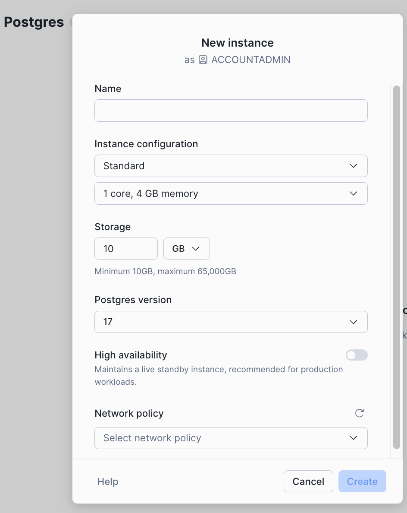
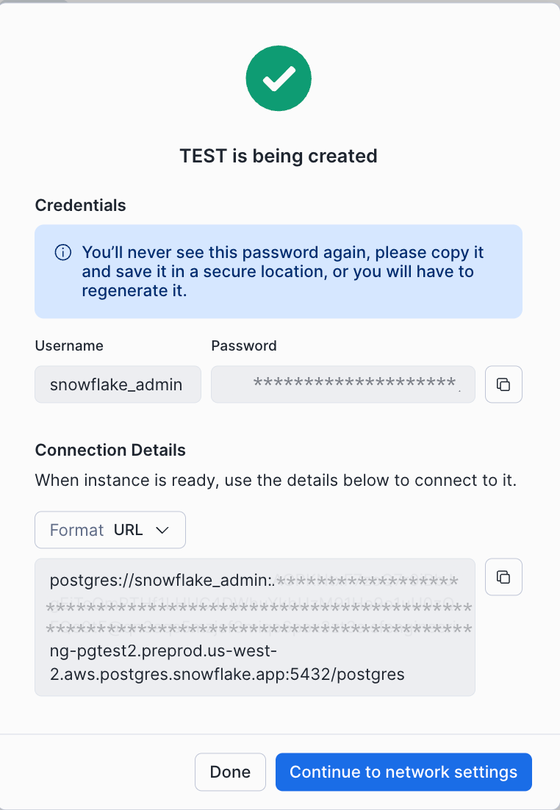
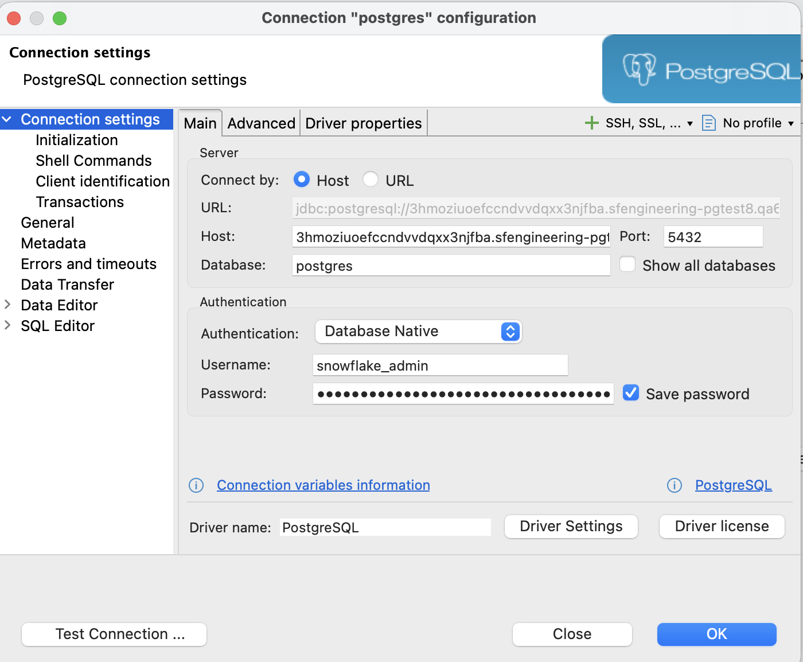

summary: Getting Started with Snowflake Postgres 
id:getting-started-with-snowflake-postgres
categories: snowflake-site:taxonomy/solution-center/certification/quickstart, snowflake-site:taxonomy/product/platform
language: en
environments: web
status: Published 
feedback link: https://github.com/Snowflake-Labs/sfguides/issues
authors: Elizabeth Christensen
fork repo link: https://github.com/Snowflake-Labs/sfquickstarts/tree/master/site/sfguides/src/getting-started-with-snowflake-postgres

# Getting Started with Snowflake Postgres
<!-- ------------------------ -->
## Overview 

In this guide, you will learn how to create a Snowflake Postgres instance, connect to it, and create sample data and queries. 

### What is Snowflake Postgres?

Snowflake Postgres is a fully-managed, enterprise-ready Postgres solution. It is compatible with community PostgreSQL with support for a range of Postgres extensions packaged and managed by Snowflake. Snowflake Postgres is enterprise ready with always-on features like optional high availability, point-in-time recovery, and automated backups. 


### Prerequisites
- Snowflake account or trial
- `ACCOUNTADMIN` role or a role that has been granted `CREATE POSTGRES INSTANCE`
    - For roles other than `ACCOUNTADMIN` you will also need network permissions to attach Postgres to a network. For new networks, `CREATE NETWORK POLICY ON ACCOUNT` and `CREATE NETWORK RULE ON SCHEMA` are required. For attaching Postgres to existing networks the policy owner can `GRANT` usage permissions to the role creating the instance. 
- Local Postgres install or a Postgres graphical user interface
- Ability to attach Postgres to a network. For new network policies `CREATE NETWORK POLICY ON ACCOUNT` or attach an existing network policy 


### What You’ll Learn 
- How to get started with Snowflake Postgres in the Snowsight UI
- How to connect to Postgres from popular Postgres clients 
- How to create sample data and queries

### What You’ll Build 
- A sample Postgres instance to use for testing or building hobby applications.
- A very simple sample database with 3 tables that can be used for testing queries.


<!-- ------------------------ -->
## Deploy a Postgres Instance

You can deploy Postgres from the Snowsight UI or via SQL in a worksheet. [Creating a Postgres instance](https://app.snowflake.com/_deeplink/#/postgres?show=create&utm_source=quickstart&utm_medium=quickstart&utm_campaign=-us-en-all&utm_content=app-getting-started-with-snowflake-postgres) from Snowsight is available from the + button at the top of the navigation menu or under the Manage section in the bottom left.

Postgres instances need these things defined:

- A name. We recommend using a name you will remember and that is related to the purpose of the database work, ie `dev-test` or `ecomm-prod`. 
- Instance class and amount of memory. You’ll select the amount of memory needed for the database’s workload. For getting started with small tests of the functionality, like the example below, we recommend a burstable instance with 2 cores, 2 GB memory.
- Storage: Specify the amount of storage needed. For small tests, the 10 GB default is sufficient. 
- Postgres version: We currently support several versions of Postgres, select the version you’d like to test with. If you do not have a specific version in mind, pick the newest version. 
- Network policy: You will attach a network policy to the new instance. If there are no applicable policies in your account, the screen following the instance configuration will let you create one. For testing purposes, use your own IP address. 




## Connect to Postgres

Following instance creation, you will be presented with a screen to gather your credentials. Add this password to a secure location like a password manager. 





There is both a URL connection string or you can choose a line by line environment variable format. A Postgres connection string contains the following information:

- protocol: postgres://
- username: this will be snowflake_admin
- password
- hostname
- port: 5432
- database_name: defaults to postgres

For this guide, we're continuing to work with the admin role. Snowflake generates credentials for `snowflake_admin` and `application`. It is recommended to also create additional roles for applications and users with the Postgres [user management features](https://www.postgresql.org/docs/current/user-manag.html). 

### Connect to Snowflake Postgres with psql

Postgres users often connect directly using the command line interface psql. This runs locally on your computer and comes with a Postgres install.

If you’re installing Postgres locally for the first time there are many options to get started:

- See the official [Docker](https://hub.docker.com/_/postgres) image
- Mac users: `brew install postgresql@18`. Postgres.app is also a good option.
- Windows users: see the [PostgreSQL Windows installer](https://www.postgresql.org/download/windows/)

*Note that the version of psql and the version of Postgres you’re connecting to should match.*

To initiate a session in psql with your database, use the connection url from instance creation:

```
psql postgres://snowflake_admin:****@****.sfdevrel-sfdevrel-enterprise.us-west-2.aws.postgres.snowflake.app:5432/postgres
```

Once you are connected, you can explore the database with psql meta commands and or use SQL to create tables, insert data, or issue queries.

Connecting via the `application` user will require SSL. This can be added to the connection string as `?sslmode=require`.


### Connect Snowflake Postgres to a User Interface

Many users connect to Postgres with a graphical user interface and there are many choices like PGAdmin, DBeaver, DataGrip, and many others. All user interfaces will accept Postgres connection inputs in the format described above.



Connecting via the `application` user will require SSL. This is typically one of the connection options.

## Create tables, data, and queries with Postgres

This example SQL will create three tables that could be used with an ecommerce application, customers, products, and orders. 

These examples are inside the `postgres` database and the `public` schema, where you connect by default. Postgres also allows new databases and schemas.

```sql
-- Create customers table
CREATE TABLE customers (
    customer_id SERIAL PRIMARY KEY,
    first_name VARCHAR(50),
    last_name VARCHAR(50),
    email VARCHAR(100),
    city VARCHAR(50)
);

-- Create products table
CREATE TABLE products (
    product_id SERIAL PRIMARY KEY,
    product_name VARCHAR(100),
    category VARCHAR(50),
    price DECIMAL(10, 2)
);

-- Create orders table with foreign key constraints to products and customers table
CREATE TABLE orders (
    order_id SERIAL PRIMARY KEY,
    order_date DATE DEFAULT CURRENT_DATE,
    customer_id INT,
    product_id INT,
    quantity INT,

    CONSTRAINT fk_order_customer
        FOREIGN KEY (customer_id) 
        REFERENCES customers(customer_id),

    CONSTRAINT fk_order_product
        FOREIGN KEY (product_id) 
        REFERENCES products(product_id)
);
```

Now let’s add some sample data via `INSERT` statements.

```sql
-- Insert 10 Customers
INSERT INTO customers (first_name, last_name, email, city) VALUES
('Alice', 'Smith', 'alice@example.com', 'New York'),
('Bob', 'Johnson', 'bob@test.com', 'Los Angeles'),
('Charlie', 'Brown', 'charlie@sample.net', 'Chicago'),
('Diana', 'Prince', 'diana@themyscira.com', 'Houston'),
('Evan', 'Wright', 'evan@write.com', 'Phoenix'),
('Fiona', 'Gallagher', 'fiona@shameless.com', 'Chicago'),
('George', 'Martin', 'grrm@books.com', 'Santa Fe'),
('Hannah', 'Montana', 'hannah@music.com', 'Los Angeles'),
('Ian', 'Malcolm', 'ian@chaos.com', 'Austin'),
('Julia', 'Roberts', 'julia@movie.com', 'New York');

-- Insert 10 Products
INSERT INTO products (product_name, category, price) VALUES
('Wireless Mouse', 'Electronics', 25.99),
('Mechanical Keyboard', 'Electronics', 120.50),
('Gaming Monitor', 'Electronics', 300.00),
('Yoga Mat', 'Fitness', 20.00),
('Dumbbell Set', 'Fitness', 55.00),
('Running Shoes', 'Footwear', 89.99),
('Leather Jacket', 'Apparel', 150.00),
('Coffee Maker', 'Kitchen', 45.00),
('Blender', 'Kitchen', 30.00),
('Novel: The Great Gatsby', 'Books', 12.50);

-- Insert 10 Orders
INSERT INTO orders (order_date, customer_id, product_id, quantity) VALUES
('2023-10-01', 1, 1, 1),  -- Alice bought a Mouse
('2023-10-02', 2, 3, 1),  -- Bob bought a Monitor
('2023-10-03', 1, 10, 2), -- Alice bought 2 Books
('2023-10-04', 3, 2, 1),  -- Charlie bought a Keyboard
('2023-10-05', 4, 6, 1),  -- Diana bought Shoes
('2023-10-06', 5, 8, 1),  -- Evan bought Coffee Maker
('2023-10-07', 2, 2, 1),  -- Bob bought a Keyboard
('2023-10-08', 6, 4, 3),  -- Fiona bought 3 Yoga Mats
('2023-10-09', 7, 10, 1), -- George bought a Book
('2023-10-10', 8, 7, 1);  -- Hannah bought a Jacket
```

Now let’s test some queries to our sample data set.

This joins all three tables to show who bought what products:

```sql
SELECT 
    o.order_id,
    o.order_date,
    c.first_name || ' ' || c.last_name AS customer_name,
    p.product_name,
    p.price,
    o.quantity,
    (p.price * o.quantity) AS total_cost
FROM orders o
JOIN customers c ON o.customer_id = c.customer_id
JOIN products p ON o.product_id = p.product_id;
```

This SUMs the order data by customer to see who the top 3 customers are:

```sql
SELECT 
    c.first_name,
    c.last_name,
    COUNT(o.order_id) as number_of_orders,
    SUM(p.price * o.quantity) as total_spent
FROM customers c
JOIN orders o ON c.customer_id = o.customer_id
JOIN products p ON o.product_id = p.product_id
GROUP BY c.first_name, c.last_name
ORDER BY total_spent DESC
LIMIT 3;
```

This shows sales by product category: 

```sql
SELECT 
    p.category,
    SUM(o.quantity) as items_sold,
    SUM(p.price * o.quantity) as revenue
FROM orders o
JOIN products p ON o.product_id = p.product_id
GROUP BY p.category
ORDER BY revenue DESC;
```

# Conclusion And Resources

Congratulations, you have successfully set up your first Snowflake Postgres instance!

### What You Learned

- How to create a Postgres instance inside Snowflake
- How to connect to Postgres
- How to create tables, sample data, and query Postgres

### Related Resources


- [Snowflake Postgres Documentation](https://docs.snowflake.com/en/user-guide/snowflake-postgres/about)
- [PostgreSQL Project Documentation](https://www.postgresql.org/docs/)
- [Snowflake Postgres Public Preview Annoucement Blog](https://www.snowflake.com/en/engineering-blog/postgres-public-preview/)
