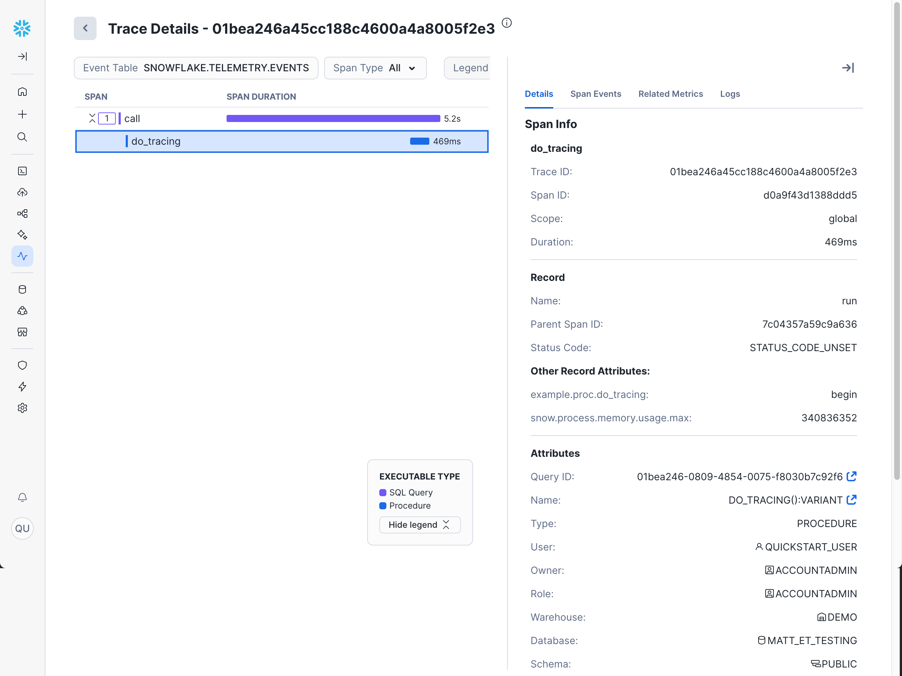

author: Matt Barreiro
id: getting-started-with-snowflake-trail-for-observability
categories: snowflake-site:taxonomy/solution-center/certification/quickstart, snowflake-site:taxonomy/product/platform
language: en
summary: Learn how to enable and use Snowflake Trail for comprehensive observability across your Snowflake workloads, including logs, traces, metrics, and monitoring capabilities. 
environments: web
status: Published
feedback link: https://github.com/Snowflake-Labs/sfguides/issues


# Getting Started with Snowflake Trail for Observability
<!-- ------------------------ -->
## Overview


Snowflake Trail is Snowflake's suite of observability capabilities that enable its users to better monitor, troubleshoot, debug and take actions on pipelines, apps, user code and compute utilizations.


As you can see above, Snowflake Trail utilizes core observability data — logs, metrics, traces, events, alerts, and notifications — to provide comprehensive workload monitoring across AI, applications, pipelines, and infrastructure.

This quickstart is intended to help tie together all the components of Snowflake Trail, and in turn, help you get started with Observability in Snowflake. While this quickstart will walk you through the basics of enabling and viewing telemetry, you will need to dive deeper into each area in order to fully understand Snowflake Trail. So wherever possible, links will be provided to additional quickstarts, documentation, and resources.

<!-- Without trailing punctuation or some other character after `Learn`, the bullets don't appear under this section. BUT ONLY for this header, the other two are fine... Literally no idea why... but adding : to all three for consistency -->
### What You'll Learn:

- How to enable telemetry collection in your Snowflake account
- The difference between system views and telemetry data in Snowflake
- How to use the Snowsight monitoring interfaces for traces, logs, and query history
- How to access and understand observability data in Snowflake

### What You'll Need:

- A Snowflake account. If you do not have a Snowflake account, you can register for a [free trial account](https://signup.snowflake.com/?utm_source=snowflake-devrel&utm_medium=developer-guides&utm_cta=developer-guides).
- A Snowflake account login with the `ACCOUNTADMIN` role, or a custom role with privileges to:
  - Set account-level parameters (`ALTER ACCOUNT`)
  - View and query event tables (`SELECT` on `SNOWFLAKE.TELEMETRY.*`)
  - Access monitoring features in Snowsight
- Basic familiarity with SQL and Snowflake concepts
- About 45 minutes to complete this quickstart

### What You'll Build:

- A Snowflake account with telemetry collection enabled at the account level
- Understanding of how to navigate and use Snowflake's built-in monitoring tools
- Foundation for implementing comprehensive observability across your Snowflake workloads

<!-- ------------------------ -->
## Data Source Overview


Observability in Snowflake comes in two main categories: System Views and Telemetry.

**System Views** provide historical data about your Snowflake account through views and table functions in the following schemas:

   1. The [Snowflake Information Schema](https://docs.snowflake.com/en/sql-reference/info-schema) (`INFORMATION_SCHEMA`) in every Snowflake database
   1. The [Account Usage](https://docs.snowflake.com/en/sql-reference/account-usage) (`ACCOUNT_USAGE` and `READER_ACCOUNT_USAGE`) in the Snowflake database
   1. The [Organization Usage](https://docs.snowflake.com/en/sql-reference/organization-usage) (`ORGANIZATION_USAGE`) in the Snowflake database

**Telemetry data**, on the other hand, is delivered exclusively through [event tables](https://docs.snowflake.com/en/developer-guide/logging-tracing/event-table-setting-up). An event table is a special kind of database table with a [predefined set of columns](https://docs.snowflake.com/en/developer-guide/logging-tracing/event-table-columns) that follows the data model for [OpenTelemetry](https://opentelemetry.io/) - a leading the industry standard for collecting and structuring observability data across systems.

This distinction is important because of the default behavior of each:

- System Views are always available and automatically populated with data about your Snowflake usage
- Telemetry data requires you to **explicitly enable collection** by setting levels for logging, metrics, and tracing

<!-- ------------------------ -->
## Enabling Telemetry


By default, Snowflake includes a [predefined event table](https://docs.snowflake.com/en/developer-guide/logging-tracing/event-table-setting-up#label-logging-event-table-default) (`SNOWFLAKE.TELEMETRY.EVENTS`) that is used if you don't specify an active event table. You can also [create your own event tables](https://docs.snowflake.com/en/developer-guide/logging-tracing/event-table-setting-up#label-logging-event-table-custom) for specific uses.

Most telemetry levels can be set at the account, object, or session level. And while many of the telemetry levels can be set via Snowsight, some require using SQL commands for full flexibility.

For this quickstart, we will focus on enabling telemetry at the account level. We will show you both the SQL and Snowsight methods, and use the default table.

Complete **one** of the following:

### (Option 1): Setting Telemetry Levels via Snowsight

You can use Snowsight to set telemetry levels at the account level.

1. Sign in to Snowsight.
1. In the navigation menu, select **Monitoring** » **Traces and Logs**.
1. On the Traces & Logs page, select **Set Event Level**.
1. For **Set logging & tracing for**, ensure **Account** is selected.
1. Set your desired levels:
   1. For **All Events**, select **On**
   1. For **Logs**, select **INFO**
   1. Ensure all other fields show as **On**.
1. Click **Save**.

You can see the **Set Event Level** dialog box below.


### (Option 2): Setting Telemetry Levels via SQL

1. Open a new SQL worksheet or a <a href="https://app.snowflake.com/_deeplink/#/workspaces?utm_source=snowflake-devrel&utm_medium=developer-guides&utm_content=getting-started-with-snowflake-trail-for-observability&utm_cta=developer-guides-deeplink" class="_deeplink">workspace</a>.
1. Run the following:

```sql
-- Switch to ACCOUNTADMIN
USE ROLE ACCOUNTADMIN;

-- Set account level values
ALTER ACCOUNT SET LOG_LEVEL = 'INFO'; 
ALTER ACCOUNT SET METRIC_LEVEL = 'ALL'; 
ALTER ACCOUNT SET TRACE_LEVEL = 'ALWAYS'; 

```

Note that valid and default values are as follows:

| Level          | Valid Values                                              | Default Value |
| -------------- | --------------------------------------------------------- | ------------- |
| `LOG_LEVEL`    | `TRACE`, `DEBUG`, `INFO`, `WARN`, `ERROR`, `FATAL`, `OFF` | `OFF`         |
| `METRIC_LEVEL` | `ALL`, `NONE`                                             | `NONE`        |
| `TRACE_LEVEL`  | `ALWAYS`, `ON_EVENT`, `OFF`                               | `OFF`         |

### Additional Resources

- [Setting levels for logging, metrics, and tracing | Snowflake Documentation](https://docs.snowflake.com/en/developer-guide/logging-tracing/telemetry-levels)
- [How Snowflake determines the level in effect | Snowflake Documentation](https://docs.snowflake.com/en/developer-guide/logging-tracing/telemetry-levels#how-snowflake-determines-the-level-in-effect)

<!-- ------------------------ -->
## Traces


A **trace** represents the complete execution path of a request through your Snowflake workloads. It provides a detailed view of how operations flow through different components, helping you understand performance bottlenecks, dependencies, and execution patterns. Each trace is made up of one or more **spans**, where each span represents a single operation within the trace (like a SQL query, UDF execution, or procedure call).

### Why Traces Are Useful

Traces help you:

- Understand the end-to-end execution flow of complex operations
- Identify performance bottlenecks and slow operations
- Debug issues by seeing the exact sequence of operations
- Optimize query and procedure performance
- Monitor dependencies between different components

### Accessing Traces in Snowsight

The easiest way to get started with traces is through the Trace Explorer UI in Snowsight:

1. Navigate to **Monitoring** » **Traces and Logs**
1. (Optional) Use filters to narrow down the returned results.

You'll now have a list of all the traces for your event table. The Trace Explorer interface shows a list of traces with key information such as Date, Duration, Trace Name, Status, and number of Spans in the trace.


You can now click on any trace to view its spans in detail.

>
> If you don't see any traces after enabling tracing, you'll need to execute operations that generate traces, such as stored procedures or UDFs.
>
> Note that simple DML/DQL SQL commands executed directly in a worksheet or workspace **do not generate traces**. Traces are only generated when SQL is executed within supported handler code.
>
> For a complete walkthrough with examples, see: [Getting Started with Traces](/en/developers/guides/getting-started-with-traces/).

### Viewing Trace Details

When you click on a trace, you'll see a detailed view showing the timeline of all spans within that trace. This view allows you to:

- **Filter by Span Type**: Use the **Span Type** drop-down to show or hide spans by type (_All_, _UDF_, _Procedures_, _Streamlit_, and/or _Query_).
- **Change the Legend**: Use the **Legend** drop-down to switch how spans are colored - either by _Type_ (operation type) or by _Query_ (Query ID).


### Viewing Span Details

Clicking on any individual span in the trace opens a sidebar with four tabs: **Details**, **Span Events**, **Related Metrics**, and **Logs**.

#### Details

The **Details** tab shows info and attributes about the selected span, including Trace ID, Span ID, Duration, Type, Warehouse, and more.



#### Span Events

The **Span Events** tab shows details of events recorded within the span.


#### Related Metrics

The **Related Metrics** tab shows CPU and memory metrics related to the span.


#### Logs

The **Logs** tab shows logs directly related to the trace.


This detailed information helps you understand exactly what happened during each operation and identify optimization opportunities.

>
> For full details on each of the above fields, see the [documentation here](https://docs.snowflake.com/en/developer-guide/logging-tracing/tracing-accessing-events).

### Additional Resources

- [Getting Started with Traces | Quickstart](/en/developers/guides/getting-started-with-traces/)
- [Using trace events in Java | Quickstart](/en/developers/guides/java-trace-events/)
- [Viewing trace data | Snowflake Documentation](https://docs.snowflake.com/en/developer-guide/logging-tracing/tracing-accessing-events)
- [Trace events for functions and procedures | Snowflake Documentation](https://docs.snowflake.com/en/developer-guide/logging-tracing/tracing)
- [Adding custom spans to a trace | Snowflake Documentation](https://docs.snowflake.com/en/developer-guide/logging-tracing/tracing-custom-spans)

<!-- ------------------------ -->

## Logs


**Logs** are structured records of events that occur during the execution of your Snowflake workloads. They provide detailed information about what happened during code execution, including informational messages, warnings, errors, and debug information. Logs are essential for troubleshooting issues, understanding application behavior, and monitoring the health of your systems.

### Why Logs Are Useful

Logs help you:

- Debug issues by providing detailed error messages and stack traces
- Monitor application behavior and performance
- Audit operations and track important events
- Understand the flow of execution in complex procedures
- Identify patterns in application usage or errors

### Accessing Logs in Snowsight

To view logs in Snowsight:

1. Navigate to **Monitoring** » **Traces & Logs**
1. Click on the **Logs** tab to switch from the default traces view.
1. (Optional) Use the filters to find specific logs. For example:
   - **Time Range** can be set either by using the drop-down or by clicking on the graph.
   - **Severity** can be used to select specific log levels (DEBUG, WARN, etc).
   - **Languages** allows filtering by handler code language (Python, Java, etc).
   - **Database** allows filtering by specific procedures, functions, or applications.
   - **Record** allows selecting Logs, Events, or All.

### Log Details

By default, you will be shown a list of logs sorted by timestamp.


You can also click on any log entry to bring up a sidebar with more details, including the full log text.


>
> If you don't see any logs after enabling logging, you'll need to execute operations that generate logs. such as UDFs or stored procedures with logging statements.
>
> For a complete walkthrough with examples, see: [Getting Started with Logging](https://docs.snowflake.com/en/developer-guide/logging-tracing/logging-log-messages).

### Additional Resources

- [Logging messages from handler code | Snowflake Documentation](https://docs.snowflake.com/en/developer-guide/logging-tracing/logging#label-logging-handler-code)
- [Viewing log messages | Snowflake Documentation](https://docs.snowflake.com/en/developer-guide/logging-tracing/logging-accessing-messages)

<!-- ------------------------ -->
## Query History


**Query History** provides a comprehensive view of all SQL queries executed in your Snowflake account. It's one of the most important tools for monitoring, troubleshooting, and optimizing database performance. Query History shows detailed information about query execution, performance metrics, and resource usage patterns.

### Why Query History Is Useful

Query History helps you:

- Monitor query performance and identify slow-running queries
- Analyze resource usage and warehouse utilization
- Troubleshoot failed queries and understand error patterns
- Track query execution trends over time
- Optimize queries by understanding execution patterns
- Audit database activity and user behavior

Query history can be viewed as **Individual Queries** or **Grouped Queries**.

### Accessing Query History in Snowsight (Individual Queries)

To view Query History in Snowsight:

1. Navigate to **Monitoring** » **Query History**
1. (Optional) Use the filters to find specific queries:
   - **Status**: Filter by execution status (Success, Failed, etc.)
   - **User**: Filter by specific users
   - **Time Range**: Filter by execution time
   - **Filters**: Various other filters to help you find a specific query.

When you click on any query in the history, you'll see three main tabs with detailed information:


#### Query Details

The **Query Details** tab shows details about the query run (status, duration, ID, etc), the SQL text of the query run, and the query results.

>
> By default, the query text for failed queries is redacted. You can change this behavior by following the following KB article: [SQL text is showing redacted for failed queries](https://community.snowflake.com/s/article/SQL-text-is-showing-redacted-for-failed-queries).


#### Query Profile

The **Query Profile** tab provides a visual representation of query execution, which provides critical details for debugging and optimizing complex queries.


For a list of all possible fields, see the [documentation here](https://docs.snowflake.com/en/user-guide/ui-snowsight-activity#query-profile-reference).

>
> The Query Profile is essential for query optimization. Look for:
>
> - Steps with the highest percentage of total time
> - Large data movements between nodes
> - Inefficient join strategies
> - Missing or unused indexes

#### Query Telemetry

The **Query Telemetry** tab shows the same telemetry data as the Trace Explorer.


### Accessing Grouped Query History in Snowsight

Snowsight also provides **Grouped Query History**, which aggregates similar queries together:

1. Navigate to **Monitoring** » **Query History**
2. Click on the **Grouped Queries** tab

This feature helps you:

- Identify the most frequently executed query patterns
- See aggregate performance metrics across similar queries
- Spot trends in query execution patterns
- Focus optimization efforts on the most impactful queries


By clicking into a single grouped query, you can see detailed information about execution count, duration, and more.


### Additional Resources

- [Monitor query activity with Query History | Snowflake Documentation](https://docs.snowflake.com/en/user-guide/ui-snowsight-activity)
- [Query profiling | Snowflake Documentation](https://docs.snowflake.com/en/user-guide/ui-query-profile)
- [QUERY_HISTORY view | Snowflake Documentation](https://docs.snowflake.com/en/sql-reference/account-usage/query_history)
- [Query Profile reference | Snowflake Documentation](https://docs.snowflake.com/en/user-guide/ui-snowsight-activity#query-profile-reference)

<!-- ------------------------ -->
## Copy History


**Copy History** provides comprehensive monitoring for all data loading activities in your Snowflake account. It tracks operations from COPY INTO commands, Snowpipe, and Snowpipe Streaming, giving you visibility into data ingestion performance, errors, and throughput patterns.

### Why Copy History Is Useful

Copy History helps you:

- Monitor data loading performance and identify bottlenecks
- Track successful and failed data loading operations
- Analyze data ingestion patterns and volume trends
- Troubleshoot data loading errors and validation issues
- Optimize data loading strategies and warehouse sizing
- Audit data ingestion activities across your organization

### Accessing Copy History in Snowsight

To view Copy History in Snowsight:

1. Navigate to **Ingestion** » **Copy History**
1. (Optional) Use the filters to narrow down activity by status, database, pipe, and more.

### Copy Operations

Each copy operation entry shows details such as status, target table, pipe, data size, and number of rows loaded.


Click on any operation to see detailed information about that operation/target table, such as individual file details and status.


>
> If you don't see any copy history, you'll need to perform data loading operations (`COPY INTO`, Snowpipe, or Snowpipe Streaming).
>
> For a complete walkthrough with examples, see ONE of the following:
>
> - [Getting Started with Snowpipe](/en/developers/guides/getting-started-with-snowpipe/)
> - [Getting Started with Snowpipe Streaming and Azure Event Hubs](/en/developers/guides/getting-started-with-snowpipe-streaming-azure-eventhubs/)

### Additional Resources

- [Monitor data loading activity by using Copy History | Snowflake Documentation](https://docs.snowflake.com/en/user-guide/data-load-monitor)
- [Monitor data loading activity by using Copy History | Snowflake Documentation](https://docs.snowflake.com/en/user-guide/data-load-monitor)

<!-- ------------------------ -->
## Task History


**Task History** provides monitoring and observability for Snowflake Tasks, which are scheduled SQL statements or procedures that run automatically. Tasks are essential for building data pipelines, ETL processes, and automated maintenance operations. Task History helps you monitor task execution, troubleshoot failures, and optimize task performance.

### Why Task History Is Useful

Task History helps you:

- Monitor task execution success and failure rates
- Track task performance and execution duration trends
- Troubleshoot failed tasks and identify error patterns
- Analyze task scheduling and dependency execution
- Optimize task graphs and pipeline performance
- Audit automated operations across your data pipelines

### Accessing Task History in Snowsight

To view Task History in Snowsight:

1. Navigate to **Transformation** » **Tasks**
1. (Optional) Use the filters to narrow down activity by status, database, and more.

Task History can be viewed as either **Task Graphs** or **Task Runs**.

### Task Graphs

The **Task Graphs** view groups related tasks together in a directed acyclic graph (DAG) that shows the relationship between the root task and any dependent tasks. Each row shows the root task name, schedule, recent run history, and more.


Click on any task execution to see detailed information including child task names, status, duration, and more. The real value of this is to be able to see dependencies between different tasks.

<!-- 
! TODO replace screenshot with one showing child tasks (and performance info if possible). -->


### Tasks Runs

The **Tasks Runs** view shows individual task executions without grouping by parent task.


Clicking into any task run will bring you to the Run History for that task.


>
> If you don't see any task history, you'll need to create and run some tasks.
>
> For a step-by-step guide with examples, try one of these quickstarts:
>
> - [Getting Started with Streams & Tasks](/en/developers/guides/getting-started-with-streams-and-tasks/)
> - [Getting Started with Snowflake Task Graphs](/en/developers/guides/getting-started-with-task-graphs/)

### Additional Resources

- [Getting Started with Streams & Tasks](/en/developers/guides/getting-started-with-streams-and-tasks/)
- [Getting Started with Snowflake Task Graphs](/en/developers/guides/getting-started-with-task-graphs/)
- [Introduction to tasks | Snowflake Documentation](https://docs.snowflake.com/en/user-guide/tasks-intro)
- [Task graphs | Snowflake Documentation](https://docs.snowflake.com/en/user-guide/tasks-graphs)
- [Monitoring task Runs | Snowflake Documentation](https://docs.snowflake.com/en/user-guide/tasks-monitor)

<!-- ------------------------ -->
## Dynamic Tables


**Dynamic Tables** are a table type that automatically materializes the results of a query and keeps them updated as the underlying data changes. They combine the simplicity of views with the performance of materialized data, automatically managing refresh operations. Dynamic Tables monitoring helps you track refresh performance, data freshness, and resource usage.

### Why Dynamic Tables Monitoring Is Useful

Dynamic Tables monitoring helps you:

- Track refresh performance and identify optimization opportunities
- Monitor data freshness and lag times
- Analyze resource consumption for materialized views
- Troubleshoot refresh failures and dependency issues
- Optimize refresh strategies and warehouse sizing
- Ensure data pipeline reliability and performance

### Accessing Dynamic Tables in Snowsight

To view Dynamic Tables monitoring in Snowsight:

1. Navigate to **Transformation** » **Dynamic Tables**
1. (Optional) Use the filters to narrow down by refresh status and database.

### Dynamic Table Refreshes

For each Dynamic Table, we get info such as status, target lag, database, and more.


Clicking on any table will bring you to the graph view for that table.


>
> If you don't see any Dynamic Tables, you'll need to create one first.
>
> For a step-by-step guide, try this quickstart: [Getting Started with Snowflake Dynamic Tables](/en/developers/guides/getting-started-with-dynamic-tables/).

### Additional Resources

- [Dynamic tables | Snowflake Documentation](https://docs.snowflake.com/en/user-guide/dynamic-tables-about)
- [Monitor dynamic tables | Snowflake Documentation](https://docs.snowflake.com/en/user-guide/dynamic-tables-monitor)
- [Dynamic table refresh | Snowflake Documentation](https://docs.snowflake.com/en/user-guide/dynamic-tables-refresh)

<!-- ------------------------ -->
## AI Observability


**AI Observability** in Snowflake provides monitoring and insights for AI/ML workloads, including Cortex AI functions and model inference operations. As AI becomes increasingly integrated into data workflows, observability helps ensure AI operations are performing reliably and cost-effectively.

AI Observability has the following features:

- **Evaluations**: Use AI Observability to systematically evaluate the performance of your generative AI applications and agents using the LLM-as-a-judge technique. You can use metrics, such as accuracy, latency, usage, and cost, to quickly iterate on your application configurations and optimize performance.
- **Comparison**: Compare multiple evaluations side by side and assess the quality and accuracy of responses. You can analyze the responses across different LLMs, prompts, and inference configurations to identify the best configuration for production deployments.
- **Tracing**: Trace every step of application executions across input prompts, retrieved context, tool use, and LLM inference. Use it to debug individual records and refine the app for accuracy, latency, and cost.

### Additional Resources

- [Getting Started with AI Observability | Quickstart](/en/developers/guides/getting-started-with-ai-observability/)
- [Getting Started with ML Observability in Snowflake | Quickstart](/en/developers/guides/getting-started-with-ml-observability-in-snowflake/)
- [AI Observability in Snowflake Cortex | Snowflake Cortex](https://docs.snowflake.com/user-guide/snowflake-cortex/ai-observability)

<!-- ------------------------ -->
## Conclusion And Resources


Congratulations! You have successfully explored the comprehensive observability capabilities available in Snowflake Trail. By following this quickstart, you've gained hands-on experience with the key components that make up Snowflake's observability platform.

### What You Learned

Through this quickstart, you have learned how to:

- **Enabled telemetry collection** at the account level to start capturing logs, metrics, and traces
- **Know the difference** between System Views (historical data) and Telemetry data (event-driven observability)
- **Utilize traces** to gain end-to-end insight of execution flows and identify performance bottlenecks
- **Analyze logs** to debug issues and monitor application behavior
- **Leverage Query History** to optimize query performance and troubleshoot database operations
- **Monitor data loading** activities through Copy History for all ingestion methods
- **Track automated operations** using Task History for pipeline monitoring
- **Observe Dynamic Tables** refresh patterns and data freshness
- **Explore AI observability** concepts for monitoring AI/ML workloads and Cortex AI functions
- **Build a foundational understanding** of the tools available for observability across your Snowflake workloads

### Possible Next Steps

Now that you have explored the basics of Snowflake Trail, consider these possible next steps:

- **Configure alerts and notifications** based on the telemetry data you're now collecting
- **Integrate external observability tools** such as [Grafana, Observe for Snowflake, or Datadog](https://docs.snowflake.com/en/developer-guide/builders/observability#tools-for-analysis-and-visualization)
- **Build custom dashboards** for your specific monitoring needs using the observability data
- **Implement automated monitoring** workflows using Tasks and event-driven architectures
- **Explore advanced observability patterns** for your specific workload types

### Related Resources

#### Core Documentation

- [Event tables overview | Snowflake Documentation](https://docs.snowflake.com/en/developer-guide/logging-tracing/event-table-setting-up)
- [Logging, tracing, and metrics | Snowflake Documentation](https://docs.snowflake.com/en/developer-guide/logging-tracing/logging-tracing-overview)
- [Logging messages from functions and procedures | Snowflake Documentation](https://docs.snowflake.com/en/developer-guide/logging-tracing/logging)
- [AI Observability in Snowflake Cortex](https://docs.snowflake.com/en/user-guide/snowflake-cortex/ai-observability)

#### Quickstart Guides

- [Getting Started with AI Observability](/en/developers/guides/getting-started-with-ai-observability/)
- [Getting Started with Event Tables and Alerts](/en/developers/guides/alert-on-events/)
- [Getting Started with Snowflake Dynamic Tables](/en/developers/guides/getting-started-with-dynamic-tables/)
- [Getting Started with Snowflake Task Graphs](/en/developers/guides/getting-started-with-task-graphs/)
- [Getting Started with Snowpipe Streaming and Azure Event Hubs](/en/developers/guides/getting-started-with-snowpipe-streaming-azure-eventhubs/)
- [Getting Started with Snowpipe](/en/developers/guides/getting-started-with-snowpipe/)
- [Getting Started with Streams & Tasks](/en/developers/guides/getting-started-with-streams-and-tasks/)
- [Getting Started with Traces](/en/developers/guides/getting-started-with-traces/)
