id: getting-started-with-snowflake
categories: snowflake-site:taxonomy/solution-center/certification/quickstart, snowflake-site:taxonomy/solution-center/certification/community-sourced, snowflake-site:taxonomy/solution-center/includes/architecture, snowflake-site:taxonomy/product/platform, snowflake-site:taxonomy/product/data-engineering
language: en
summary: This is a broad introduction of Snowflake and covers how to login, run queries, and load data. 
environments: web
status: Published
feedback link: https://github.com/Snowflake-Labs/sfguides/issues
authors: Victoria Warner (Cybersyn)


# Getting Started with Snowflake

<!-- ------------------------ -->

## Overview


Welcome to Snowflake! This entry-level guide, designed for database and data warehouse administrators and architects, will help you navigate the Snowflake interface and introduce you to some of our core capabilities. [Sign up for a free 30-day trial of Snowflake](https://trial.snowflake.com) and follow along with this lab. Once we cover the basics, you'll be ready to start processing your own data and diving into Snowflake's more advanced features!

### Free Virtual Hands-on Lab
This Snowflake Guide is available as a free, instructor-led Virtual Hands on Lab. [Sign up for the VHOL today](/virtual-hands-on-lab/).

### Prerequisites:
- Use of the [Snowflake free 30-day trial environment](https://trial.snowflake.com)
- Basic knowledge of SQL, database concepts, and objects
- Familiarity with CSV (comma-delimited) files and JSON semi-structured data

### What You'll Learn:
- How to create stages, databases, tables, views, and virtual warehouses.
- How to load structured and semi-structured data.
- How to consume Snowflake Public Data data from the [Snowflake Data Marketplace](https://app.snowflake.com/marketplace/listing/GZTSZ290BV255/snowflake-public-data-products-snowflake-public-data-free?search=Snowflake+Public+Data+%28Free%29).
- How to perform analytical queries on data in Snowflake, including joins between tables.
- How to clone objects.
- How to undo user errors using Time Travel.
- How to create roles and users, and grant them privileges.
- How to securely and easily share data with other accounts.

### Data You'll Use:
**Snowflake Public Data** is a next generation data company creating a real-time view of the world's economy with analytics-ready data exclusively on Snowflake Marketplace. Initially focused on consumer insights, Snowflake Public Data enables you to access external data directly in your Snowflake instance — no ETL required.

This lab will use the following Snowflake Public Data datasets:
- Snowflake Public Data (Free)

Check out Snowflake Public Data's [Snowflake Public Data (Free)](https://app.snowflake.com/marketplace/listing/GZTSZ290BV255/snowflake-public-data-products-snowflake-public-data-free?search=Snowflake+Public+Data+%28Free%29) product and [explore all public sources](https://app.snowflake.com/marketplace/providers/GZTSZAS2KCS/Snowflake%20Public%20Data%20Products) Snowflake Public Data offers on the Snowflake Marketplace.
<!-- ------------------------ -->

## Prepare Your Lab Environment


If you haven't already, register for a [Snowflake free 30-day trial](https://signup.snowflake.com/developers?utm_source=snowflake-devrel&utm_medium=developer-guides&utm_cta=developer-guides). This lab assumes you are using a new Snowflake account created by registering for a trial.

The Snowflake edition (Standard, Enterprise, Business Critical, etc.), cloud provider (AWS, Azure, GCP), and Region (US East, EU, etc.) you use for this lab, do not matter. However, we suggest you select the region that is physically closest to you and Enterprise, our most popular offering, as your Snowflake edition.

After registering, you will receive an email with an activation link and URL for accessing your Snowflake account.

### Logging into the Snowflake User Interface (UI)
Open a browser window and enter the URL of your Snowflake 30-day trial environment that was sent with your registration email. Enter the username and password that you specified during the registration:

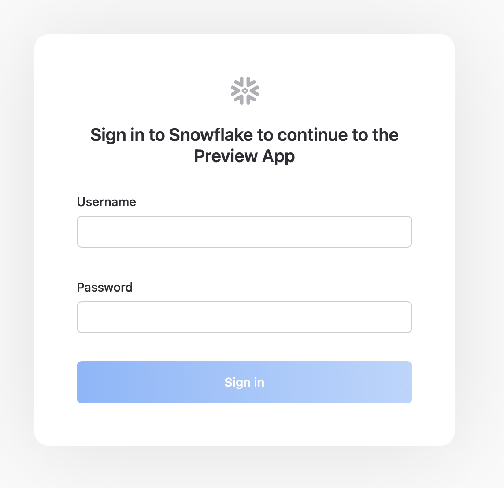

<!-- ------------------------ -->

## The Snowflake ​User Interface


> 
> 
>  **About the screenshots, sample code, and environment**
Screenshots in this lab depict examples; results may vary slightly from what you see when you complete the exercises.

### Navigating the Snowflake UI

Let's get you acquainted with Snowflake! This section covers the basic components of the user interface.

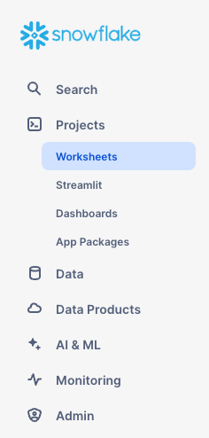

### Projects > Worksheets

Under **Projects** on the left-hand panel, select the ​**Worksheets​** tab or go directly by <a href="https://app.snowflake.com/_deeplink/worksheets?utm_source=snowflake-devrel&utm_medium=developer-guides&utm_campaign=-us-en-all&utm_content=app-getting-started-with-snowflake&utm_cta=developer-guides-deeplink" class="_deeplink">clicking here</a>. This provides an interface for submitting SQL queries, performing DDL and DML operations, and viewing results as your queries or operations complete. A new worksheet is created by clicking **`+`** on the top right.

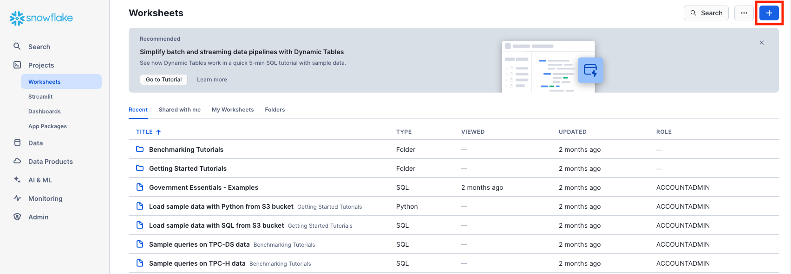

### Worksheet Structure 

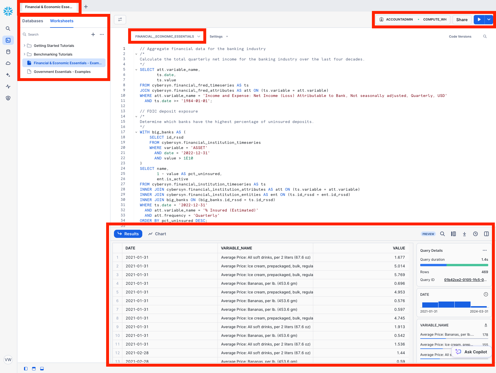

The top left corner contains the following:
- **Snowflake** icon: Use this to get back to the main console/close the worksheet.
- **Worksheet_name** drop-down: The default name is the timestamp when the worksheet was created. Click the timestamp to edit the worksheet name. The drop-down also displays additional actions you can perform for the worksheet.
- **Filters** button: Custom filters are special keywords that resolve as a subquery or list of values.

The top right corner contains the following:
- **Context** box: This lets Snowflake know which role and warehouse to use during this session. It can be changed via the UI or SQL commands.
- **Share** button: Open the sharing menu to share to other users or copy the link to the worksheet.
- **Play/Run** button: Run the SQL statement where the cursor currently is or multiple selected statements.

The middle pane contains the following:
- Drop-down at the top for setting the database/schema/object context for the worksheet.
- General working area where you enter and execute queries and other SQL statements. 

The middle-left panel contains the following:
- **Worksheets** tab: Use this tab to quickly select and jump between different worksheets
- **Databases** tab: Use this tab to view all of the database objects available to the current role
- **Search** bar: database objects browser which enables you to explore all databases, schemas, tables, and views accessible by the role currently in use for the worksheet. 

The bottom pane displays the results of queries and other operations. Also includes 4 options (**Object**, **Query**, **Result**, **Chart**) that open/close their respective panels on the UI. **Chart** opens a visualization panel for the returned results. More on this later.

The various panes on this page can be resized by adjusting their sliders. If you need more room in the worksheet, collapse the database objects browser in the left panel. Many of the screenshots in this guide keep this panel closed.

> 
> 
>  **Worksheets vs the UI**
Most of the exercises in this lab are executed using pre-written SQL within this worksheet to save time. These tasks can also be done via the UI, but would require navigating back-and-forth between multiple UI tabs.

### Projects > Dashboards

Under **Projects** on the left-hand panel, select the ​**Dashboards​** tab or <a href="https://app.snowflake.com/_deeplink/dashboards?utm_source=snowflake-devrel&utm_medium=developer-guides&utm_campaign=-us-en-all&utm_content=app-getting-started-with-snowflake&utm_cta=developer-guides-deeplink" class="_deeplink">click here</a>. This tab allows you to create flexible displays of one or more charts (in the form of tiles, which can be rearranged). Tiles and widgets are produced by executing SQL queries that return results in a worksheet. Dashboards work at a variety of sizes with minimal configuration.

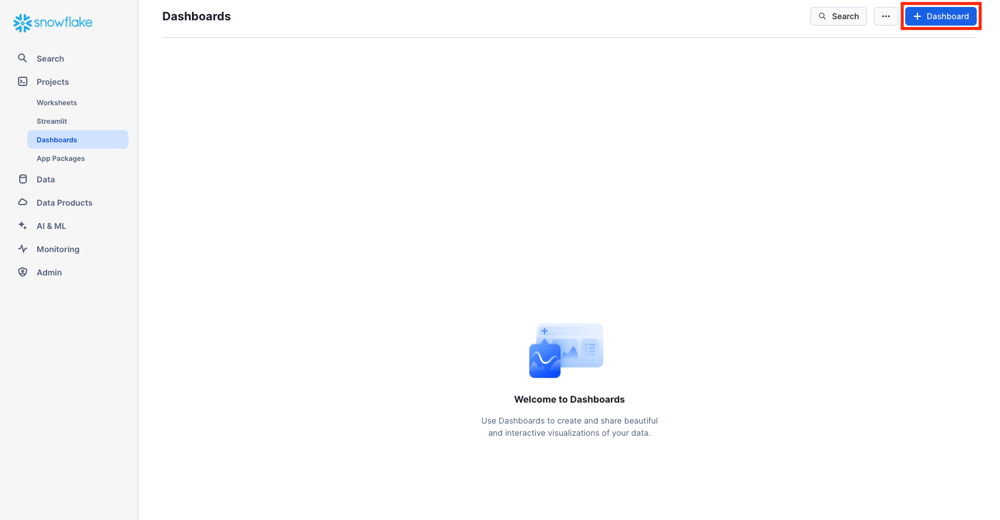

### Data > Databases

Under **Discover & Collaborate**, the **Catalog > Database Explorer**​ tab shows information about the databases you have created or have permission to access. Click here to naviage to the <a href="https://app.snowflake.com/_deeplink/#/data/databases?utm_source=snowflake-devrel&utm_medium=developer-guides&utm_campaign=-us-en-all&utm_content=app-getting-started-with-snowflake&utm_cta=developer-guides-deeplink" class="_deeplink">Database Explorer</a> directly.  You can create, clone, drop, or transfer ownership of databases, as well as load data in the UI. Notice that a database already exists in your environment. However, we will not be using it in this lab.

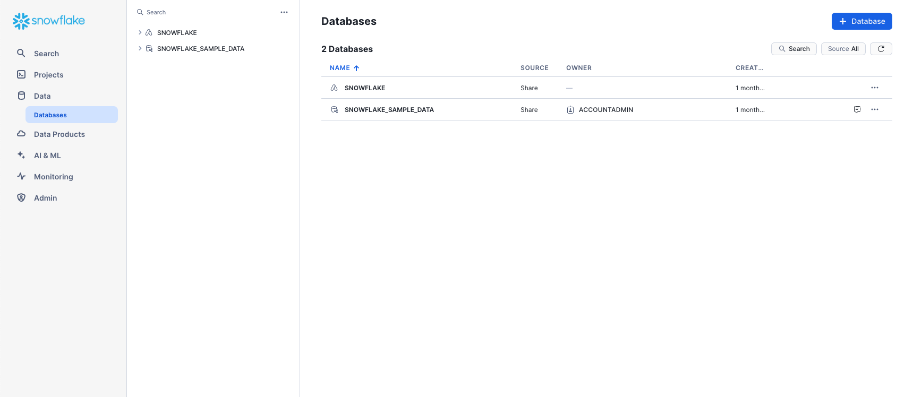

### Data Products > Marketplace

The **Marketplace** tab is where any Snowflake customer can browse and consume data sets made available by providers. Click here to navigate direclty to the <a href="https://app.snowflake.com/_deeplink/marketplace?utm_source=snowflake-devrel&utm_medium=developer-guides&utm_campaign=-us-en-all&utm_content=app-getting-started-with-snowflake&utm_cta=developer-guides-deeplink" class="_deeplink">Marketplace</a>.There are two types of shared data: Public and Personalized. Public data is free data sets available for querying instantaneously. Personalized data requires reaching out to the provider of data for approval of sharing data.

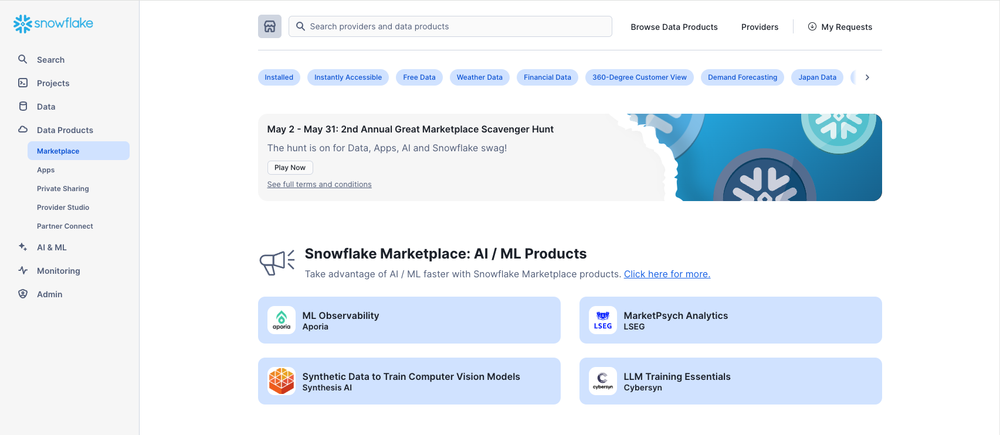

### Data Products > Private Sharing

Under **Data Products**, the **Private Sharing** tab is where data sharing can be configured to easily and securely share Snowflake tables among separate Snowflake accounts or external users, without having to create a copy of the data.  Browse directly to Private Sharing by <a href="https://app.snowflake.com/_deeplink/#/data/shared/shared-with-you?utm_source=snowflake-devrel&utm_medium=developer-guides&utm_campaign=-us-en-all&utm_content=app-getting-started-with-snowflake&utm_cta=developer-guides-deeplink" class="_deeplink">clicking here</a>.

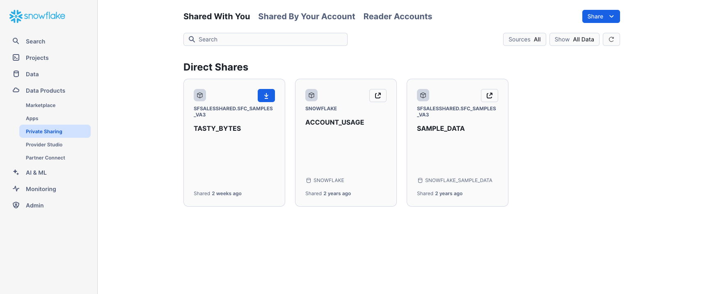

### Monitoring > Query History

Under **Monitoring** there are <a href="https://app.snowflake.com/_deeplink/#/compute/history/queries?utm_source=snowflake-devrel&utm_medium=developer-guides&utm_campaign=-us-en-all&utm_content=app-getting-started-with-snowflake&utm_cta=developer-guides-deeplink" class="_deeplink">multiple tabs</a> for tracking your usage of your Snowflake account:

- **Query History** is where previous queries are shown, along with filters that can be used to hone results (user, warehouse, status, query tag, etc.). View the details of all queries executed in the last 14 days from your Snowflake account. Click a query ID to drill into it for more information.
- **Copy History** shows the status of copy commands run to ingest data into Snowflake.
- **Task History** allows you to see the execution history for tasks and tasks graphs. (Tasks let you schedule the execution of SQL code. It is associated with a specific database and schema.)
- **Dynamic Tables** is where you can use Snowsight to monitor dynamic table refreshes and examine dynamic tables and dynamic table graphs.
- **Governance** tracks row- and column-level security, object tagging, data classification, access history, and more.

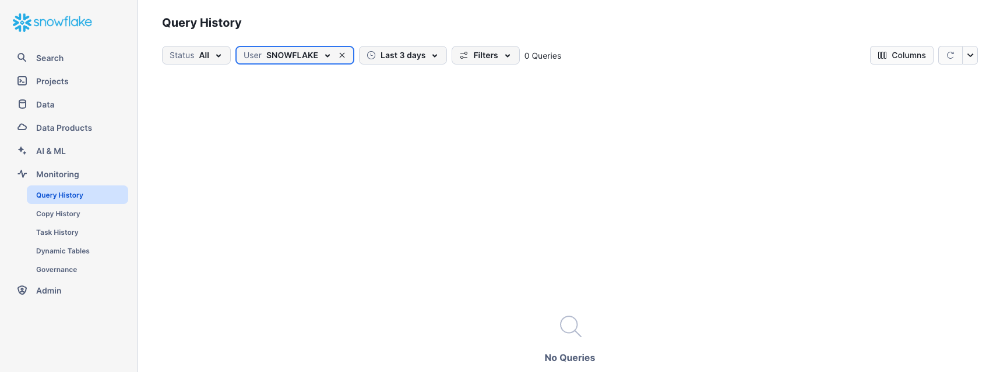

### Admin > Warehouses

Under **Admin**, the **​Warehouses​** tab is where you set up and manage compute resources known as virtual warehouses to load or query data in Snowflake. A warehouse called COMPUTE_WH already exists in your environment.  <a href="https://app.snowflake.com/_deeplink/#/compute/warehouses?utm_source=snowflake-devrel&utm_medium=developer-guides&utm_campaign=-us-en-all&utm_content=app-getting-started-with-snowflake&utm_cta=developer-guides-deeplink" class="_deeplink">Click here</a> to go directly to the Warehouses tab.

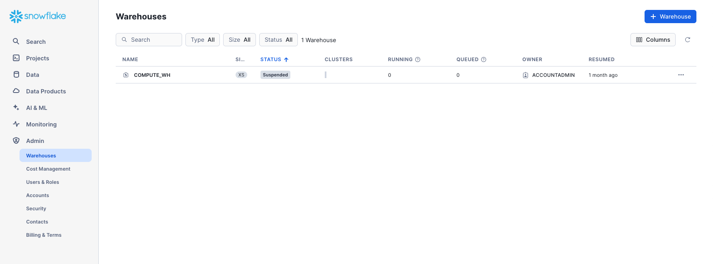

### Admin > Cost Management

Under **Admin**, the **Cost Management** tab shows an overview of account consumption and budgets. It also includes details on all the resource monitors that have been created to control the number of credits that virtual warehouses consume. For each resource monitor, it shows the credit quota, type of monitoring, schedule, and actions performed when the virtual warehouse reaches its credit limit.

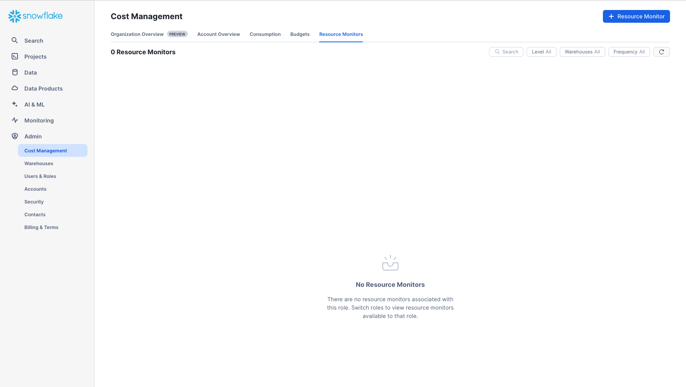

### Admin > Users & Roles

The **Roles** sub-tab of the **Users & Roles** tab shows a list of the roles and their hierarchies. Roles can be created, reorganized, and granted to users in this tab. The roles can also be displayed in tabular/list format by selecting the **Table** sub-tab.

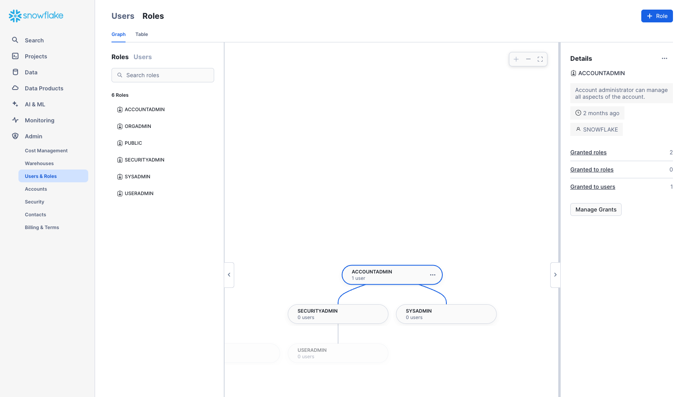

### Users

The **Users** sub-tab of the **Users & Roles** tab shows a list of users in the account, default roles, and owner of the users. For a new account, no records are shown because no additional roles have been created. Permissions granted through your current role determine the information shown for this tab. To see all the information available on the tab, switch your role to `ACCOUNTADMIN`.

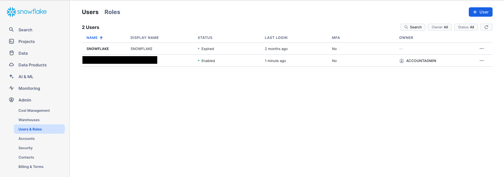

Clicking on your username in the bottom right of the UI allows you to change your password, roles, and preferences. Snowflake has several system defined roles. You are currently in the default role of `SYSADMIN` and will stay in this role for the majority of the lab.


> 
> 
>  **SYSADMIN**
The `SYSADMIN` (aka System Administrator) role has privileges to create warehouses, databases, and other objects in an account.
In a real-world environment, you would use different roles for the tasks in this lab, and assign roles to your users. We will cover more on roles and Snowflake's access control model in Section 9 and you can find additional information in the [Snowflake documentation](https://docs.snowflake.com/user-guide/security-access-control-overview).

<!-- ------------------------ -->

## Data Lab: Stock Price & SEC Filings Data


### The Lab Story
You work at a grocery retailer. You want to understand the performance of major consumer goods (CPG) companies in the US that supply your store. This lab takes a look at daily stock price data and quarterly and annual Securities Exchange Commission (SEC) company filings to understand the performance of the CPG landscape. Public companies are required to submit a quarterly and annual report to the SEC detailing their financial data.

We will start by collecting data from three different sources:
1. Load company metadata `.csv` file.
2. Load SEC filings from a semi-structured JSON format.
3. Use the Snowflake Marketplace to find free stock price data in "Snowflake Public Data (Free)" from Snowflake Public Data.

<!-- ------------------------ -->

## Loading Structured Data into Snowflake: CSVs


Let's start by preparing to load structured `.csv` data into Snowflake.

We are using company metadata developed from the Securities and Exchange Commission (SEC) that details the consumer packaged goods (CPG) companies we want to evaluate. The data has been exported and pre-staged for you in an Amazon AWS S3 bucket in the US-EAST region. It is in comma-delimited format with a single header line and double quotes enclosing all string values, including the field headings in the header line. This will be important when we configure the Snowflake table to store this data.

<!-- victoria image of the CPG data -->

> 
> 
> **Free Datasets from Snowflake Public Data direct to your Snowflake instance:** The full dataset is available [**for free**](https://app.snowflake.com/marketplace/listing/GZTSZ290BV255/snowflake-public-data-products-snowflake-public-data-free?search=Snowflake+Public+Data+%28Free%29) in Snowflake Marketplace from Snowflake Public Data -- no ETL required. For the purposes of this demo, we will focus on working with a subset of the data, staged in a csv file to learn how to load structured data into Snowflake.

**Getting Data into Snowflake**
Data can be ingested into Snowflake from many locations by using the `COPY` command, Snowpipe auto-ingestion, external connectors, or third-party ETL/ELT solutions. For more information on getting data into Snowflake, see the [Snowflake documentation](https://docs.snowflake.com/guides-overview-loading-data). For the purposes of this lab, we use the `COPY` command and AWS S3 storage to load data manually. In a real-world scenario, you would more likely use an ETL solution or grab data directly from the Snowflake Marketplace!

### Create a Database and Table
Ensure you are using the `SYSADMIN` role by selecting your name at the top left, **Switch Role** > **SYSADMIN**.

Navigate to the <a href="https://app.snowflake.com/_deeplink/#/data/databases?utm_source=snowflake-devrel&utm_medium=developer-guides&utm_campaign=-us-en-all&utm_content=app-getting-started-with-snowflake&utm_cta=developer-guides-deeplink" class="_deeplink">**Databases** tab</a>. Click **Create**, name the database `Public_Data`, then click **CREATE**.


Now navigate to the <a href="https://app.snowflake.com/_deeplink/worksheets?utm_source=snowflake-devrel&utm_medium=developer-guides&utm_campaign=-us-en-all&utm_content=app-getting-started-with-snowflake&utm_cta=developer-guides-deeplink" class="_deeplink">**Worksheets** tab</a>. You should see the worksheet we created in step 3.

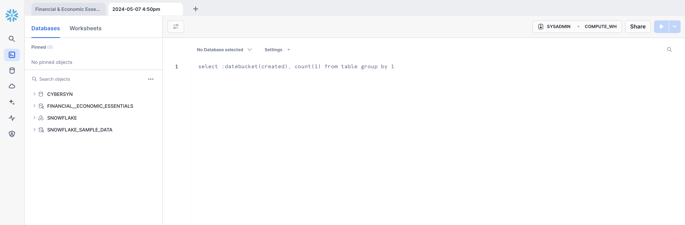

We need to set the context appropriately within the worksheet. In the upper right corner of the worksheet, click the box to the left of the **Share** button to show the context menu. Here we control the elements you can see and run from each worksheet. We are using the UI here to set the context. Later in the lab, we will accomplish the same thing via SQL commands within the worksheet.

Select the following context settings:

**Role:** `SYSADMIN`
**Warehouse:** `COMPUTE_WH`

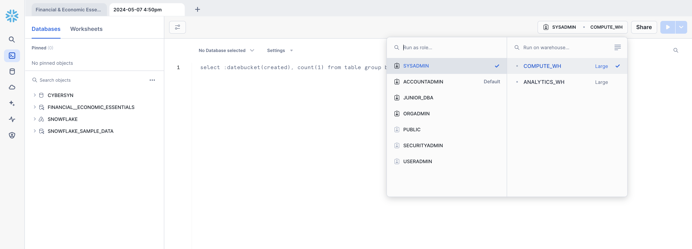

Next, in the drop-down for the database, select the following context settings:

**Database:** `Public_Data`
**Schema:** `PUBLIC`

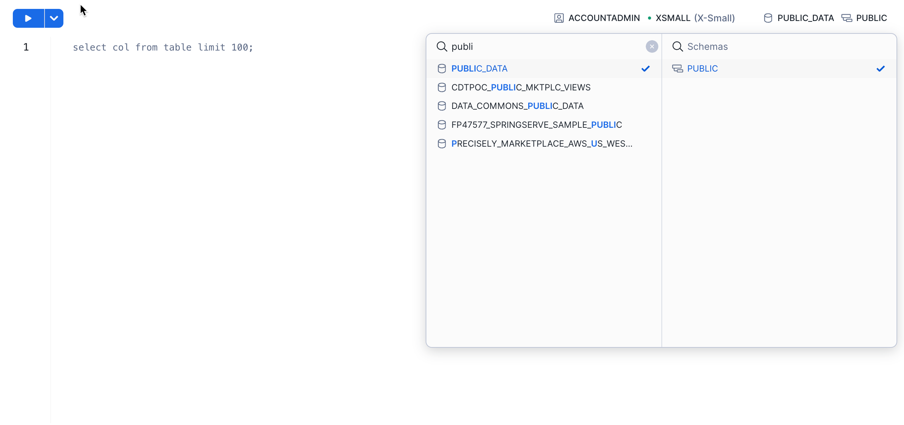

> 
> 
>  **Data Definition Language (DDL) operations are free!**
All the DDL operations we have done so far do not require compute resources, so we can create all our objects for free.

To make working in the worksheet easier, let's rename it. In the top left corner, double-click the worksheet name, which is the timestamp when the worksheet was created, and change it to `ZERO_TO_SNOWFLAKE_WITH_PUBLIC_DATA`.

Next we create a table called `COMPANY_METADATA` to use for loading the comma-delimited data. Instead of using the UI, we use the worksheet to run the DDL that creates the table. Copy the following SQL text into your worksheet:

```SQL
CREATE OR REPLACE TABLE company_metadata
(cybersyn_company_id string,
company_name string,
permid_security_id string,
primary_ticker string,
security_name string,
asset_class string,
primary_exchange_code string,
primary_exchange_name string,
security_status string,
global_tickers variant,
exchange_code variant,
permid_quote_id variant);
```

> 
> 
>  **Many Options to Run Commands.**
SQL commands can be executed through the UI, via the **Worksheets** tab, using our SnowSQL command line tool, with a SQL editor of your choice via ODBC/JDBC, or through our other connectors (Python, Spark, etc.).
As mentioned earlier, to save time, we are performing most of the operations in this lab via pre-written SQL executed in the worksheet as opposed to using the UI.

Run the query by placing your cursor anywhere in the SQL text and clicking the blue **Play/Run** button in the top right of the worksheet. Or use the keyboard shortcut [Ctrl]/[Cmd]+[Enter].

Verify your `COMPANY_METADATA` table has been created. At the bottom of the worksheet, you should see a Results section displaying a `"Table COMPANY_METADATA successfully created"` message.

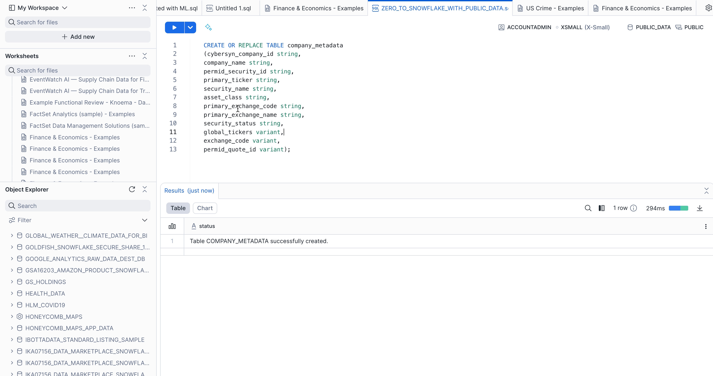

Navigate to the **Databases** tab by clicking the **HOME** icon in the upper left corner of the worksheet. Then click **Data** > **Databases**. In the list of databases, click `Public_Data` > `PUBLIC` > **TABLES** to see your newly created `COMPANY_METADATA` table. If you don't see any databases on the left, expand your browser because they may be hidden.

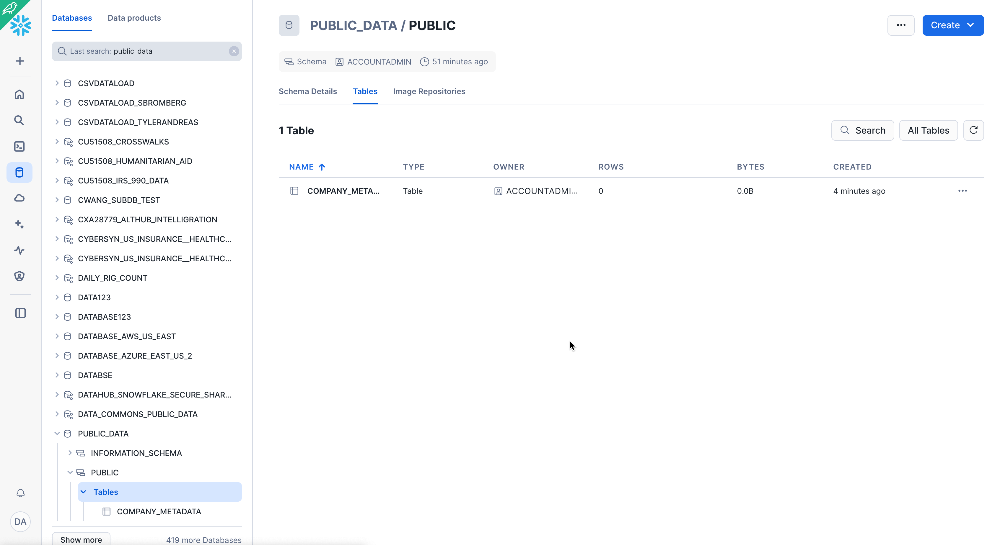

Click `COMPANY_METADATA` and the **Columns** tab to see the table structure you just created.

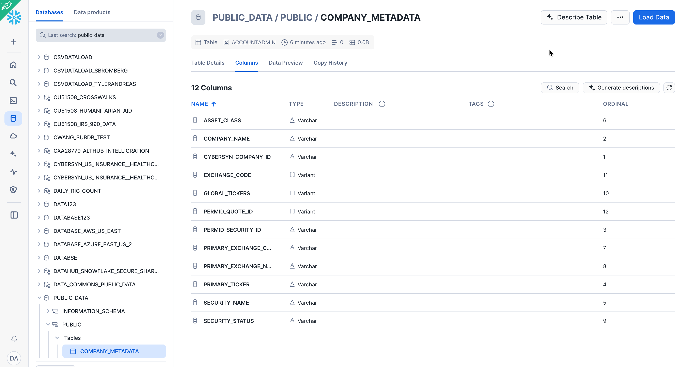

### Create an External Stage

We are working with structured, comma-delimited data that has already been staged in a public, external S3 bucket. Before we can use this data, we first need to create a _stage_ that specifies the location of our external bucket.

> 
> 
>  For this lab, we are using an AWS-East bucket. To prevent data egress/transfer costs in the future, you should select a staging location from the same cloud provider and region as your Snowflake account.

From the **Databases** tab, click the `Public_Data` database and `PUBLIC` schema. Click the **Create** button, then **Stage** > **Amazon S3**.

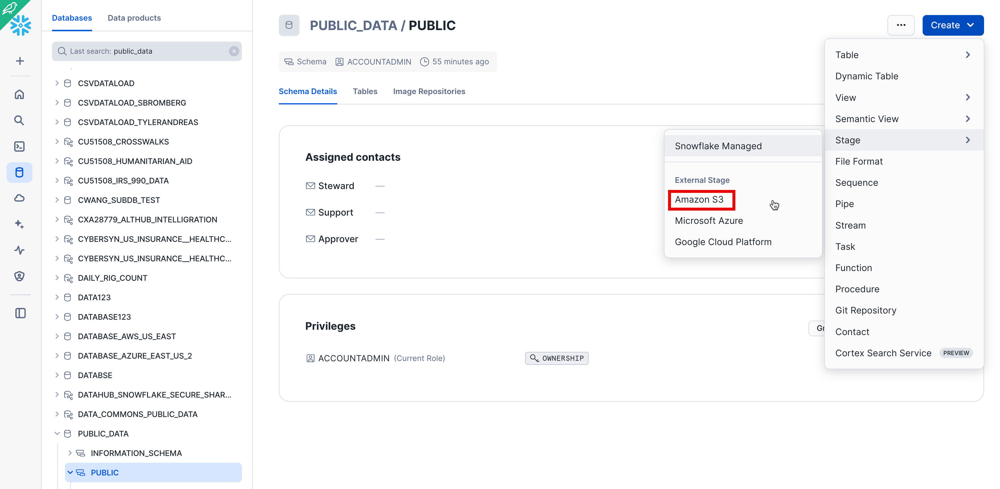

In the `Create Stage` dialog that opens, replace the following values in the SQL statement:

**Stage Name**: `Public_Data_company_metadata`
**URL**: `s3://sfquickstarts/zero_to_snowflake/cybersyn-consumer-company-metadata-csv/`

**Note:** Make sure to include the final forward slash (`/`) at the end of the URL or you will encounter errors later when loading data from the bucket.
Also ensure you have removed 'credentials = (...)' statement which is not required. You can also comment it out like the picture below by using '--'. The create stage command should resemble the below picture or not include the 3rd line.

> 
> 
>  The S3 bucket for this lab is public so you can leave the credentials options in the statement empty. In a real-world scenario, the bucket used for an external stage would likely require key information.

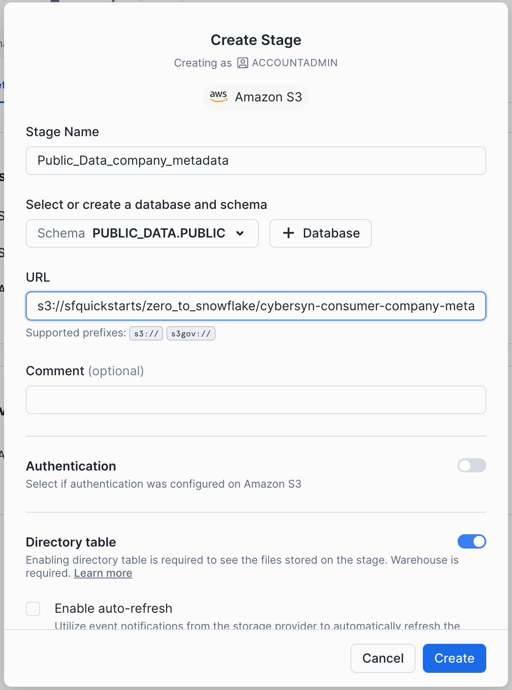

Now let's take a look at the contents of the `Public_Data_company_metadata` stage. Navigate back to the **Worksheets** tab and open the `ZERO_TO_SNOWFLAKE_WITH_Public_Data` worksheet we made.

Add the following SQL statement below the previous code and then execute:

```SQL
LIST @Public_Data_company_metadata;
```

In the results in the bottom pane, you should see the list of files in the stage:

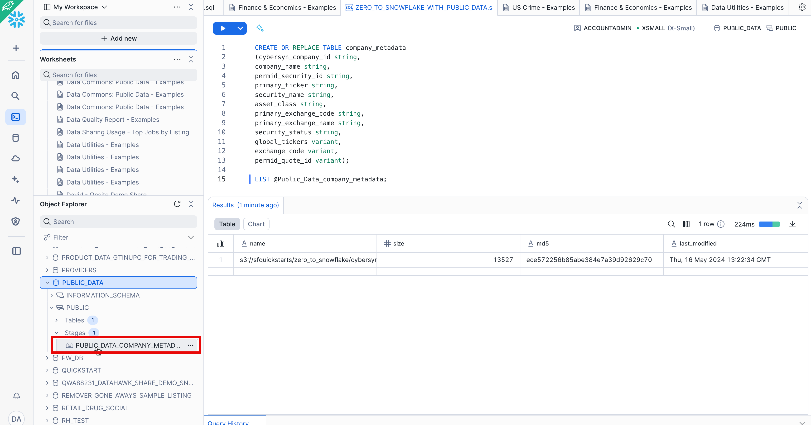

### Create a File Format

Before we can load the data into Snowflake, we have to create a file format that matches the data structure. In the worksheet, again add the following command below the rest and execute to create the file format:

```SQL
CREATE OR REPLACE FILE FORMAT csv
    TYPE = 'CSV'
    COMPRESSION = 'AUTO'  -- Automatically determines the compression of files
    FIELD_DELIMITER = ','  -- Specifies comma as the field delimiter
    RECORD_DELIMITER = '\n'  -- Specifies newline as the record delimiter
    SKIP_HEADER = 1  -- Skip the first line
    FIELD_OPTIONALLY_ENCLOSED_BY = '\042'  -- Fields are optionally enclosed by double quotes (ASCII code 34)
    TRIM_SPACE = FALSE  -- Spaces are not trimmed from fields
    ERROR_ON_COLUMN_COUNT_MISMATCH = FALSE  -- Does not raise an error if the number of fields in the data file varies
    ESCAPE = 'NONE'  -- No escape character for special character escaping
    ESCAPE_UNENCLOSED_FIELD = '\134'  -- Backslash is the escape character for unenclosed fields
    DATE_FORMAT = 'AUTO'  -- Automatically detects the date format
    TIMESTAMP_FORMAT = 'AUTO'  -- Automatically detects the timestamp format
    NULL_IF = ('')  -- Treats empty strings as NULL values
    COMMENT = 'File format for ingesting data for zero to snowflake';
```


Verify the file format has been created with the correct settings by executing the following command:

```SQL
SHOW FILE FORMATS IN DATABASE Public_Data;
```

The file format created should be listed in the result:
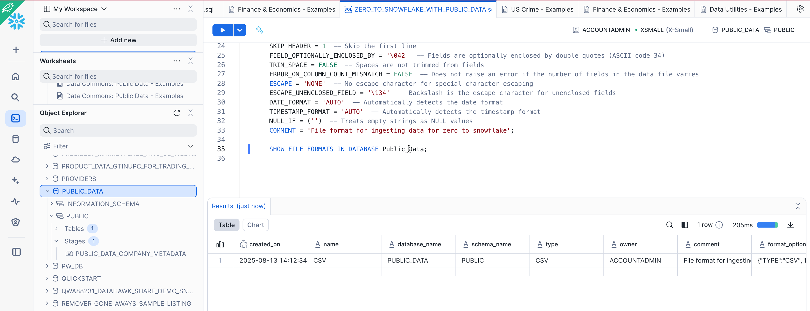

### Resize and Use a Warehouse for Data Loading

We will now use a virtual warehouse and the `COPY` command to initiate bulk loading of structured data into the Snowflake table we created.

Compute resources are needed for loading data. Snowflake's compute nodes are called virtual warehouses and they can be dynamically sized up or out according to workload, whether you are loading data, running a query, or performing a DML operation. Each workload can have its own warehouse so there is no resource contention.

Navigate to the <a href="https://app.snowflake.com/_deeplink/#/compute/warehouses?utm_source=snowflake-devrel&utm_medium=developer-guides&utm_campaign=-us-en-all&utm_content=app-getting-started-with-snowflake&utm_cta=developer-guides-deeplink" class="_deeplink">**Warehouses** tab</a> (under **Admin**). This is where you can view all of your existing warehouses, as well as analyze their usage trends.

Note the **+ Warehouse** option in the upper right corner of the top. This is where you can quickly add a new warehouse. However, we want to use the existing warehouse `COMPUTE_WH` included in the 30-day trial environment.

Click the row of the `COMPUTE_WH` warehouse. Then click the **[...]** in the upper right corner text above it to see the actions you can perform on the warehouse. We will use this warehouse to load the data from AWS S3.

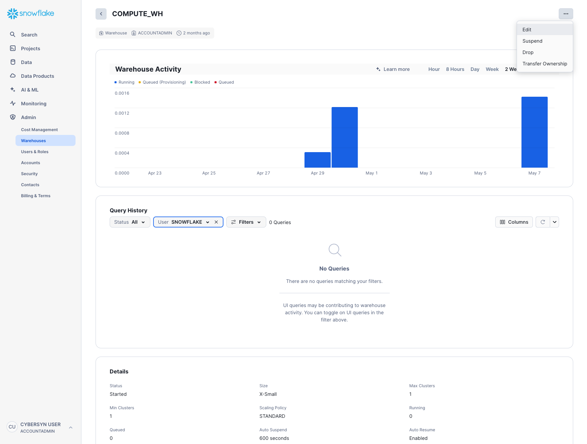

Click **Edit** to walk through the options of this warehouse and learn some of Snowflake's unique functionality.

> 
> 
>  If this account isn't using Snowflake Enterprise Edition (or higher), you will not see the **Mode** or **Clusters** options shown in the screenshot below. The multi-cluster warehouses feature is not used in this lab, but we will discuss it as a key capability of Snowflake.


- The **Size** drop-down is where the capacity of the warehouse is selected. For larger data loading operations or more compute-intensive queries, a larger warehouse is recommended. The sizes translate to the underlying compute resources provisioned from the cloud provider (AWS, Azure, or GCP) where your Snowflake account is hosted. It also determines the number of credits consumed by the warehouse for each full hour it runs. The larger the size, the more compute resources from the cloud provider are allocated to the warehouse and the more credits it consumes. For example, the `4X-Large` setting consumes 128 credits for each full hour. This sizing can be changed up or down at any time with a simple click.

- If you are using Snowflake Enterprise Edition (or higher) the **Query Acceleration** option is available. When it is enabled for a warehouse, it can improve overall warehouse performance by reducing the impact of outlier queries, which are queries that use more resources than the typical query. Leave this disabled 

- If you are using Snowflake Enterprise Edition (or higher) and the **Multi-cluster Warehouse** option is enabled, you will see additional options. This is where you can set up a warehouse to use multiple clusters of compute resources, up to 10 clusters. For example, if a `4X-Large` multi-cluster warehouse is assigned a maximum cluster size of 10, it can scale out to 10 times the compute resources powering that warehouse...and it can do this in seconds! However, note that this will increase the number of credits consumed by the warehouse to 1280 if all 10 clusters run for a full hour (128 credits/hour x 10 clusters). Multi-cluster is ideal for concurrency scenarios, such as many business analysts simultaneously running different queries using the same warehouse. In this use case, the various queries are allocated across multiple clusters to ensure they run quickly.

- Under **Advanced Warehouse Options**, the options allow you to automatically suspend the warehouse when not in use so no credits are needlessly consumed. There is also an option to automatically resume a suspended warehouse so when a new workload is sent to it, it automatically starts back up. This functionality enables Snowflake's efficient "pay only for what you use" billing model which allows you to scale your resources when necessary and automatically scale down or turn off when not needed, nearly eliminating idle resources. Additionally, there is an option to change the Warehouse type from Standard to Snowpark-optimized. Snowpark-optmized warehouses provide 16x memory per node and are recommended for workloads that have large memory requirements such as ML training use cases using a stored procedure on a single virtual warehouse node. Leave this type as Standard

> 
> 
>  **Snowflake Compute vs Other Data Warehouses**
Many of the virtual warehouse and compute capabilities we just covered, such as the ability to create, scale up, scale out, and auto-suspend/resume virtual warehouses are easy to use in Snowflake and can be done in seconds. For on-premise data warehouses, these capabilities are much more difficult, if not impossible, as they require significant physical hardware, over-provisioning of hardware for workload spikes, and significant configuration work, as well as additional challenges. Even other cloud-based data warehouses cannot scale up and out like Snowflake without significantly more configuration work and time.

**Warning - Watch Your Spend!**
During or after this lab, you should be careful about performing the following actions without good reason or you may burn through your $400 of free credits more quickly than desired:

- Do not disable auto-suspend. If auto-suspend is disabled, your warehouses continues to run and consume credits even when not in use.
- Do not use a warehouse size that is excessive given the workload. The larger the warehouse, the more credits are consumed.

We are going to use this virtual warehouse to load the structured data in the CSV files (stored in the AWS S3 bucket) into Snowflake. However, we are first going to change the size of the warehouse to increase the compute resources it uses. After the load, note the time taken and then, in a later step in this section, we will re-do the same load operation with an even larger warehouse, observing its faster load time.

Change the **Size** of this data warehouse from `X-Small` to `Small`. then click the **Save Warehouse** button:

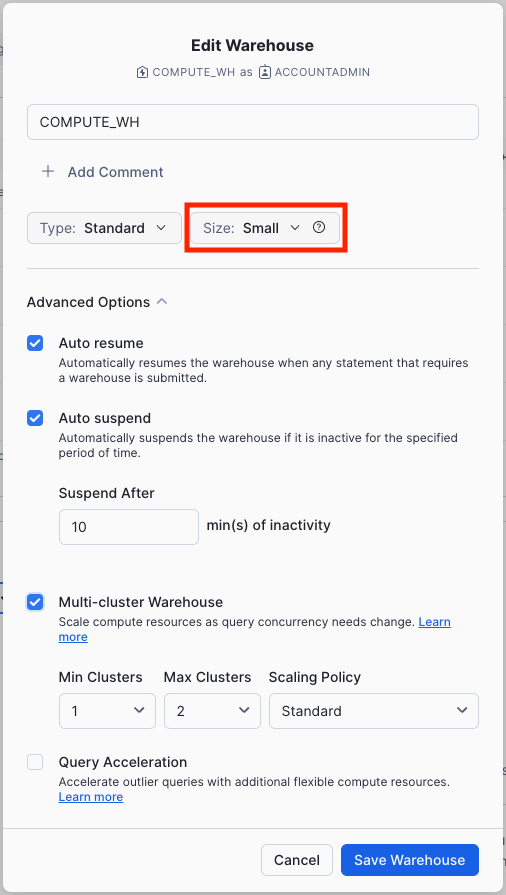

### Load the Data

Now we can run a COPY command to load the data into the `COMPANY_METADATA` table we created earlier.

Navigate back to the `ZERO_TO_SNOWFLAKE_WITH_PUBLIC_DATA` worksheet in the **Worksheets** tab. Make sure the worksheet context is correctly set:

**Role:** `SYSADMIN`
**Warehouse:** `COMPUTE_WH`
**Database:** `Public_Data`
**Schema:** `PUBLIC`

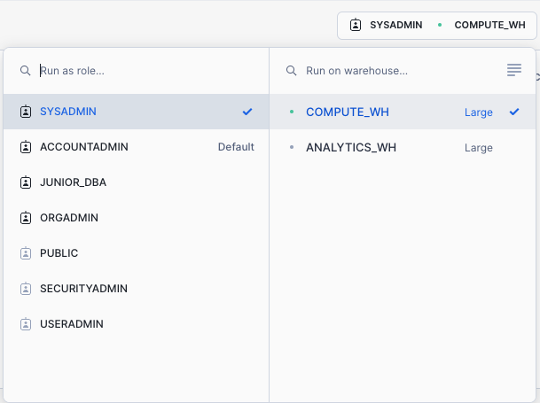

Execute the following statements in the worksheet to load the staged data into the table. This may take up to 30 seconds.

```SQL
COPY INTO company_metadata FROM @Public_Data_company_metadata file_format=csv PATTERN = '.*csv.*' ON_ERROR = 'CONTINUE';
```

In the result pane, you should see the status of each file that was loaded. Once the load is done, in the **Query Details** pane on the bottom right, you can scroll through the various statuses, error statistics, and visualizations for the last statement executed.

Next, navigate to the **Query History** tab by clicking the **Home** icon and then **Activity** > **Query History**. Select the query at the top of the list, which should be the COPY INTO statement that was last executed. Select the **Query Profile** tab and note the steps taken by the query to execute, query details, most expensive nodes, and additional statistics.

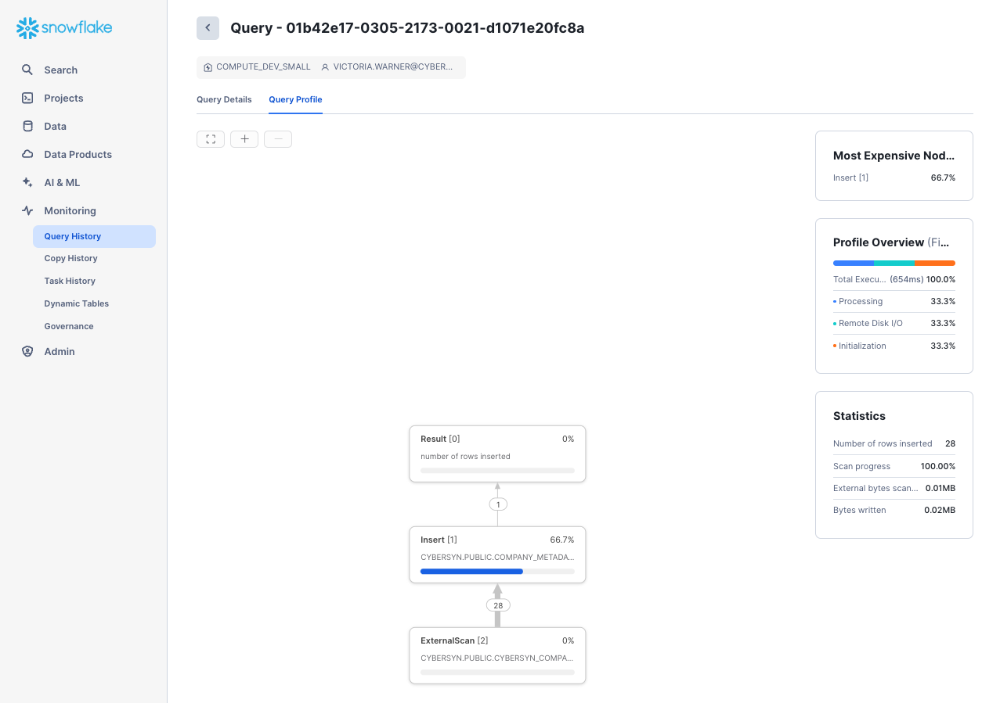

Now let's reload the `COMPANY_METADATA` table with a larger warehouse to see the impact the additional compute resources have on the loading time.

Go back to the worksheet and use the `TRUNCATE TABLE` command to clear the table of all data and metadata:
```SQL
TRUNCATE TABLE company_metadata;

-- Verify that the table is empty by running the following command:
SELECT * FROM company_metadata LIMIT 10;
```

The result should show `Query produced no results`. Change the warehouse size to `LARGE` using the following `ALTER WAREHOUSE`:
```SQL
ALTER WAREHOUSE compute_wh SET warehouse_size='large';

-- Verify the change using the following SHOW WAREHOUSES:
SHOW WAREHOUSES;
```

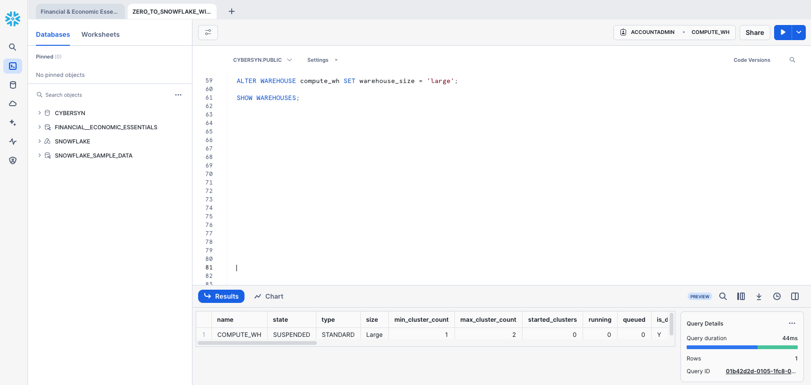

The size can also be changed using the UI by clicking on the worksheet context box, then the **Configure** (3-line) icon on the right side of the context box, and changing `Small` to `Large` in the **Size** drop-down:

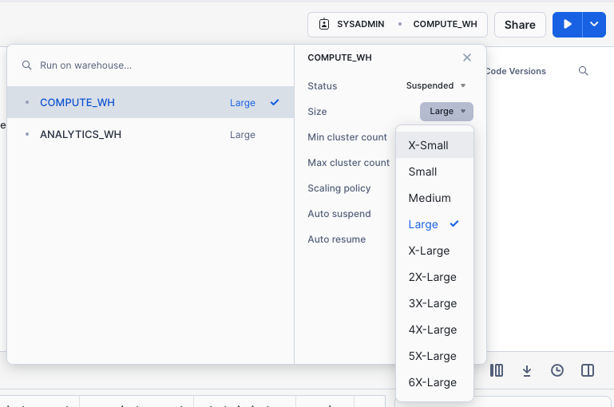

Execute the same `COPY INTO` statement as before to load the same data again:

```SQL
COPY INTO company_metadata FROM @Public_Data_company_metadata file_format=csv PATTERN = '.*csv.*' ON_ERROR = 'CONTINUE';
```

Once the load is done, navigate back to the **Queries** page (**Home** icon > **Activity** > **Query History**). Compare the times of the two `COPY INTO` commands. The load using the `Large` warehouse was significantly faster.

### Create a New Warehouse for Data Analytics

Let's assume our internal analytics team wants to eliminate resource contention between their data loading/ETL workloads and the analytical end users using BI tools to query Snowflake. As mentioned earlier, Snowflake can easily do this by assigning different, appropriately-sized warehouses to various workloads. Since our company already has a warehouse for data loading, let's create a new warehouse for the end users running analytics. We will use this warehouse to perform analytics in the next section.

Navigate to the **Admin** > **Warehouses** tab, click **+ Warehouse**, and name the new warehouse and set the size to `Large`.

If you are using Snowflake Enterprise Edition (or higher) and **Multi-cluster Warehouses** is enabled, you will see additional settings:
- Make sure **Max Clusters** is set to `1`.
- Leave all the other settings at their defaults.

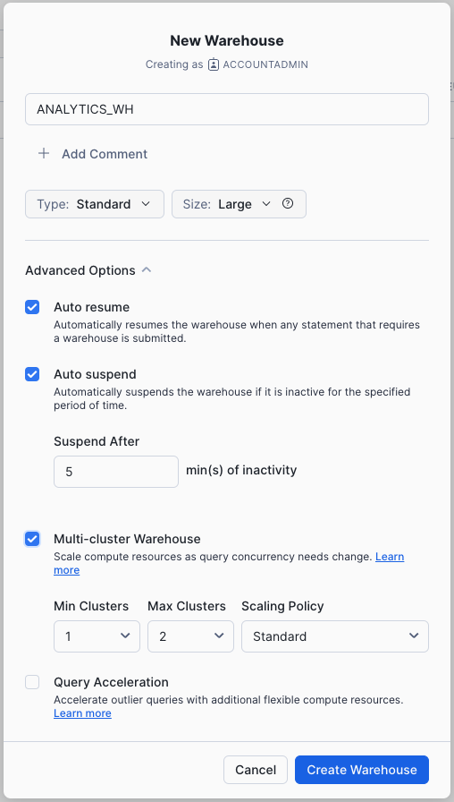

Click the **Create Warehouse** button to create the warehouse.

<!-- ------------------------ -->

## Loading Semi-Structured Data into Snowflake: JSONs


> 
> 
>  This section requires loading additional data and, therefore, provides a review of data loading while also introducing loading semi-structured data.

Going back to the lab's example, our company's analytics team wants to evaluate the performance of CPG companies through the lens of their reported metrics in SEC filings. To do this, in this section, we will:

- Load SEC filing data in semi-structured JSON format held in a public S3 bucket.
- Create a view and query the JSON data using SQL dot notation.

The JSON data consists of SEC filings provided by *Snowflake Public Data*, detailing the historical performance of consumer-packaged goods companies from 2019-2023. It is also staged on AWS S3. If viewed in a text editor, the raw JSON in the GZ files looks like:

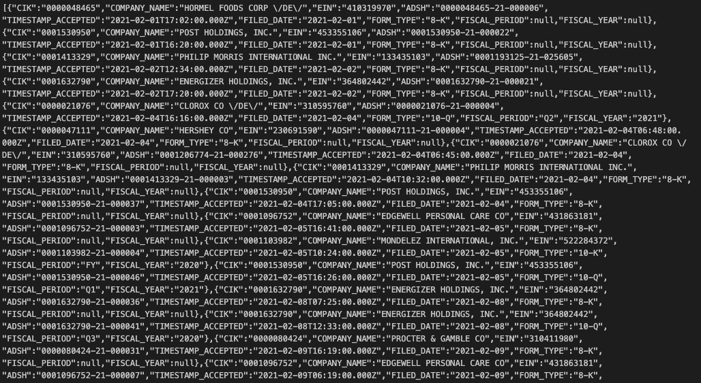

_(The full dataset available [**for free**](https://app.snowflake.com/marketplace/listing/GZTSZ290BV255/) in Snowflake Marketplace from Snowflake Public Data -- no ETL required. For the purposes of this demo, we will focus on working with the semi-structured JSON file to learn how to load structured data into Snowflake.)_

> 
> 
>  **SEMI-STRUCTURED DATA**
Snowflake can easily load and query semi-structured data such as JSON, Parquet, or Avro without transformation. This is a key Snowflake feature because an increasing amount of business-relevant data being generated today is semi-structured, and many traditional data warehouses cannot easily load and query such data. Snowflake makes it easy!

### Create a New Database and Table for the Data

> 
> 
>  **Executing Multiple Commands** Remember that you need to execute each command individually. However, you can execute them in sequence together by selecting all of the commands and then clicking the **Play/Run** button (or using the keyboard shortcut).

Next, let's create two tables, `SEC_FILINGS_INDEX` and `SEC_FILINGS_ATTRIBUTES` to use for loading JSON data. In the worksheet, execute the following `CREATE TABLE` commands:

```SQL
CREATE TABLE sec_filings_index (v variant);

CREATE TABLE sec_filings_attributes (v variant);
```

Note that Snowflake has a special data type called `VARIANT` that allows storing the entire JSON object as a single row and querying the object directly.

> 
> 
>  **Semi-Structured Data Magic**
The `VARIANT` data type allows Snowflake to ingest semi-structured data without having to predefine the schema.

In the results pane at the bottom of the worksheet, verify that your tables, `SEC_FILINGS_INDEX` and `SEC_FILINGS_ATTRIBUTES`, were created:

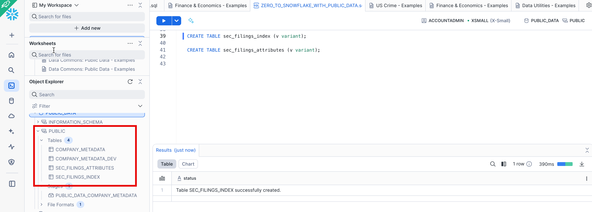

### Create Another External Stage

In the `ZERO_TO_SNOWFLAKE_WITH_Public_Data` worksheet, use the following command to create a stage that points to the bucket where the semi-structured JSON data is stored on AWS S3:

```SQL
CREATE STAGE Public_Data_sec_filings
url = 's3://sfquickstarts/zero_to_snowflake/cybersyn_cpg_sec_filings/';
```

Now let's take a look at the contents of the `Public_Data_sec_filings` stage. Execute the following `LIST` command to display the list of files:

```SQL
LIST @Public_Data_sec_filings;
```

In the results pane, you should see a list of `.gz` files from S3:
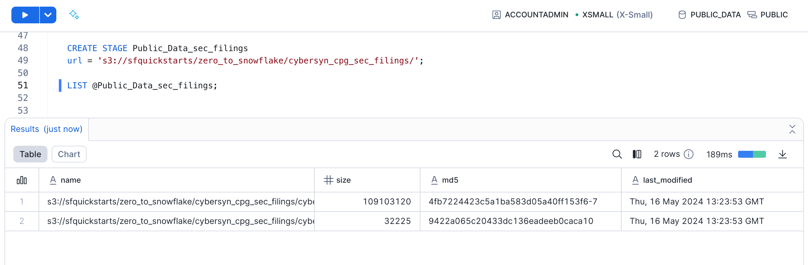

### Load and Verify the Semi-structured Data

We will now use a warehouse to load the data from an S3 bucket into the tables we created earlier. In the `ZERO_TO_SNOWFLAKE_WITH_PUBLIC_DATA worksheet, execute the `COPY` command below to load the data.

Note that you can specify a `FILE FORMAT` object inline in the command. In the previous section where we loaded structured data in CSV format, we had to define a file format to support the CSV structure. Because the JSON data here is well-formed, we are able to simply specify the JSON type and use all the default settings:

```SQL
COPY INTO sec_filings_index
FROM @Public_Data_sec_filings/cybersyn_sec_report_index.json.gz
    file_format = (type = json strip_outer_array = true);

COPY INTO sec_filings_attributes
FROM @Public_Data_sec_filings/cybersyn_sec_report_attributes.json.gz
    file_format = (type = json strip_outer_array = true);
```

Verify that each file has a status of `LOADED`:
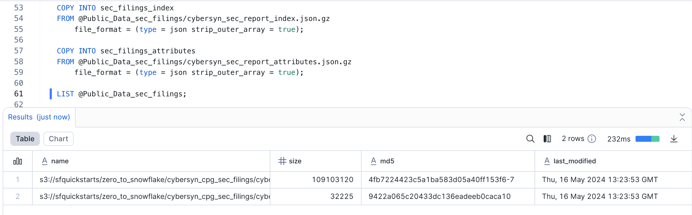

Now, let's take a look at the data that was loaded:
```SQL
SELECT * FROM sec_filings_index LIMIT 10;
SELECT * FROM sec_filings_attributes LIMIT 10;
```

Click any of the rows to display the formatted JSON in the right panel:

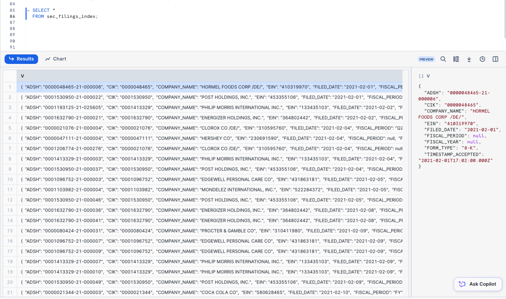

To close the display in the panel and display the query details again, click the **X** (Close) button that appears when you hover your mouse in the right corner of the panel.

### Create a View and Query Semi-Structured Data

Next, let's look at how Snowflake allows us to create a view and also query the JSON data directly using SQL.

> 
> 
>  **Views & Materialized Views**
A view allows the result of a query to be accessed as if it were a table. Views can help present data to end users in a cleaner manner, limit what end users can view in a source table, and write more modular SQL.

Snowflake also supports materialized views in which the query results are stored as though the results are a table. This allows faster access, but requires storage space. Materialized views can be created and queried if you are using Snowflake Enterprise Edition (or higher).

Run the following command to create a columnar view of the semi-structured JSON SEC filing data, so it is easier for analysts to understand and query. The CIK corresponds to the Central Index Key, or unique identifier that SEC gives to each filing entity. The ADSH is the document number for any filing submitted to the SEC.

```SQL
CREATE OR REPLACE VIEW sec_filings_index_view AS
SELECT
    v:CIK::string                   AS cik,
    v:COMPANY_NAME::string          AS company_name,
    v:EIN::int                      AS ein,
    v:ADSH::string                  AS adsh,
    v:TIMESTAMP_ACCEPTED::timestamp AS timestamp_accepted,
    v:FILED_DATE::date              AS filed_date,
    v:FORM_TYPE::string             AS form_type,
    v:FISCAL_PERIOD::string         AS fiscal_period,
    v:FISCAL_YEAR::string           AS fiscal_year
FROM sec_filings_index;

CREATE OR REPLACE VIEW sec_filings_attributes_view AS
SELECT
    v:VARIABLE::string            AS variable,
    v:CIK::string                 AS cik,
    v:ADSH::string                AS adsh,
    v:MEASURE_DESCRIPTION::string AS measure_description,
    v:TAG::string                 AS tag,
    v:TAG_VERSION::string         AS tag_version,
    v:UNIT_OF_MEASURE::string     AS unit_of_measure,
    v:VALUE::string               AS value,
    v:REPORT::int                 AS report,
    v:STATEMENT::string           AS statement,
    v:PERIOD_START_DATE::date     AS period_start_date,
    v:PERIOD_END_DATE::date       AS period_end_date,
    v:COVERED_QTRS::int           AS covered_qtrs,
    TRY_PARSE_JSON(v:METADATA)    AS metadata
FROM sec_filings_attributes;
```

SQL dot notation `v:VARIABLE` is used in this command to pull out values at lower levels within the JSON object hierarchy. This allows us to treat each field as if it were a column in a relational table.

The new view should appear as `SEC_FILINGS_INDEX_VIEW` under `Public_data` > `PUBLIC` > **Views** in the object browser on the left. You may need to expand or refresh the objects browser in order to see it.

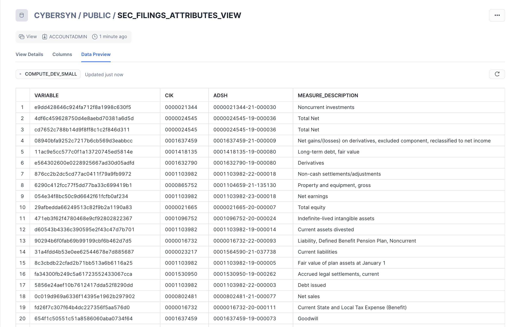

Notice the results look just like a regular structured data source: 

```SQL
SELECT *
FROM sec_filings_index_view
LIMIT 20;
```
<!-- ------------------------ -->

## Getting Data from Snowflake Marketplace


### Snowflake Data Marketplace

Make sure you're using the `ACCOUNTADMIN` role and, <a href="https://app.snowflake.com/_deeplink/marketplace?utm_source=snowflake-devrel&utm_medium=developer-guides&utm_campaign=-us-en-all&utm_content=app-getting-started-with-snowflake&utm_cta=developer-guides-deeplink" class="_deeplink">navigate to the Marketplace</a> (**Data Products** > **Marketplace**):

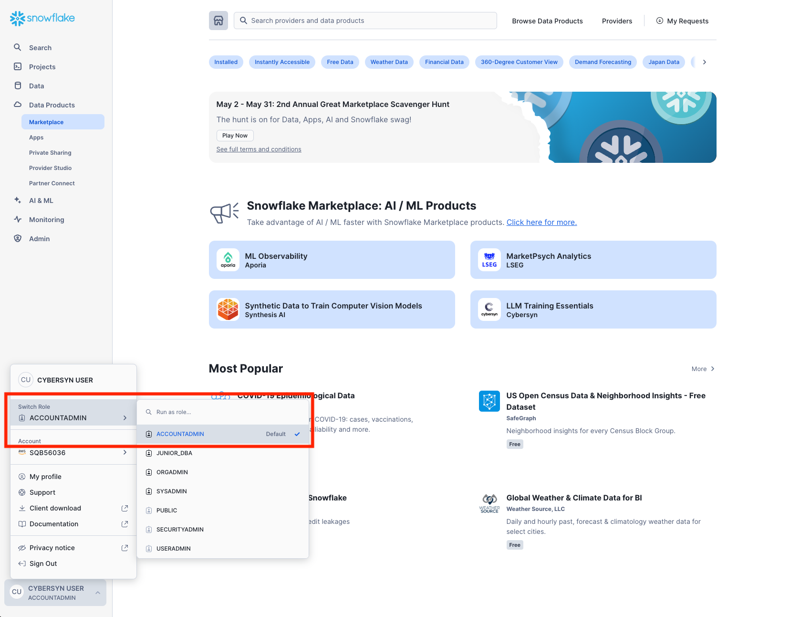

#### Find a listing

Type `Snowflake Public Data (Free)` in the search box at the top, scroll through the results, and select [**Snowflake Public Data (Free)**](https://app.snowflake.com/marketplace/listing/GZTSZ290BV255/) (provided by Snowflake Public Data).

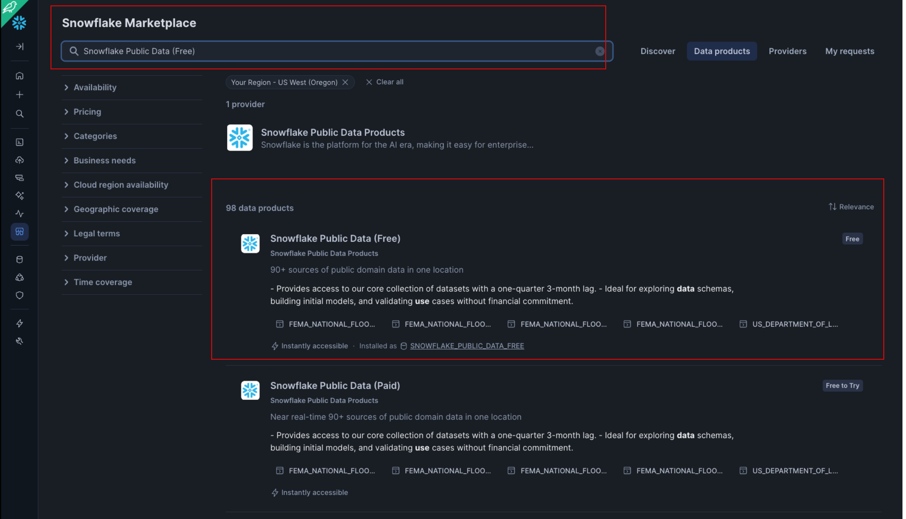  

In the **Snowflake Public Data (Free)** page, you can learn more about the contents of the data listing, explore data dictionaries, and see some sample queries. You will also see links to documentation and the dataset's cloud region availability. When you're ready, click the **Get** button to make this information available within your Snowflake account:


Review the information in the dialog and click **Get** again:

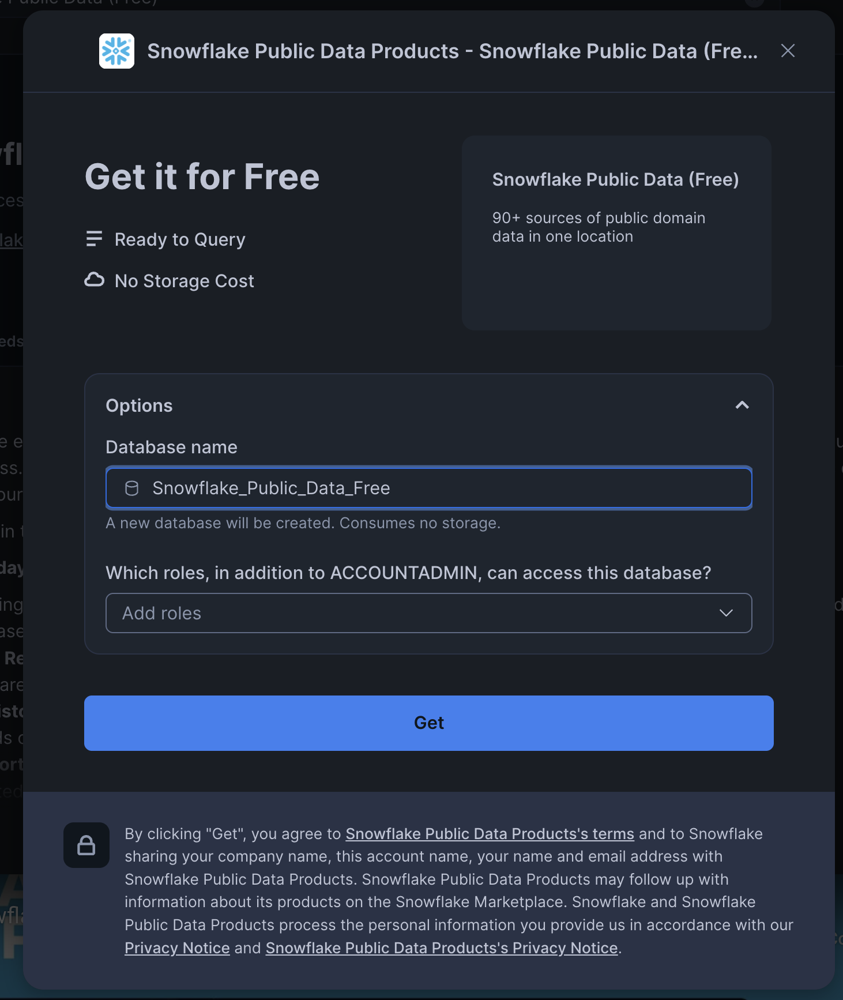

You can now click **Done** or choose to run the sample queries provided by Snowflake Public Data:

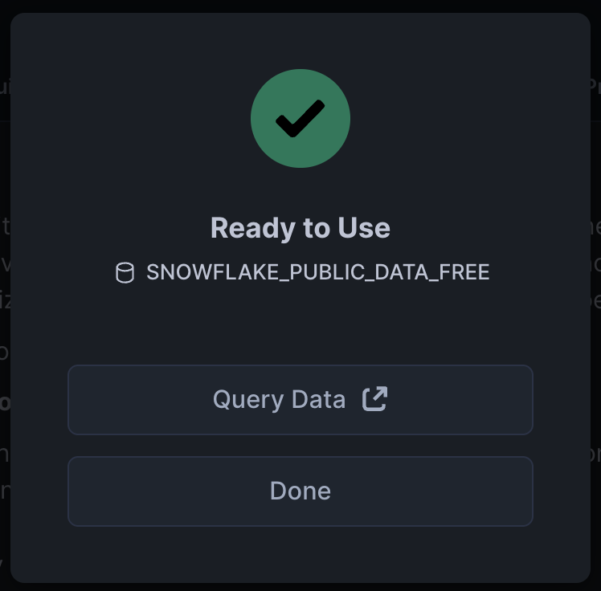

If you chose **Query Data**, a new worksheet opens in a new browser tab/window:
1. Set your context 
2. Select the query you want to run (or place your cursor in the query text).
3. Click the **Run/Play** button (or use the keyboard shortcut).
4. You can view the data results in the bottom pane.
5. When you are done running the sample queries, click the **Home** icon in the upper left corner.

Next:
1. Click **Data** > **Databases**.
2. Click the `SNOWFLAKE_PUBLIC_DATA_FREE` database.
3. You can see details about the schemas, tables, and views that are available to query.

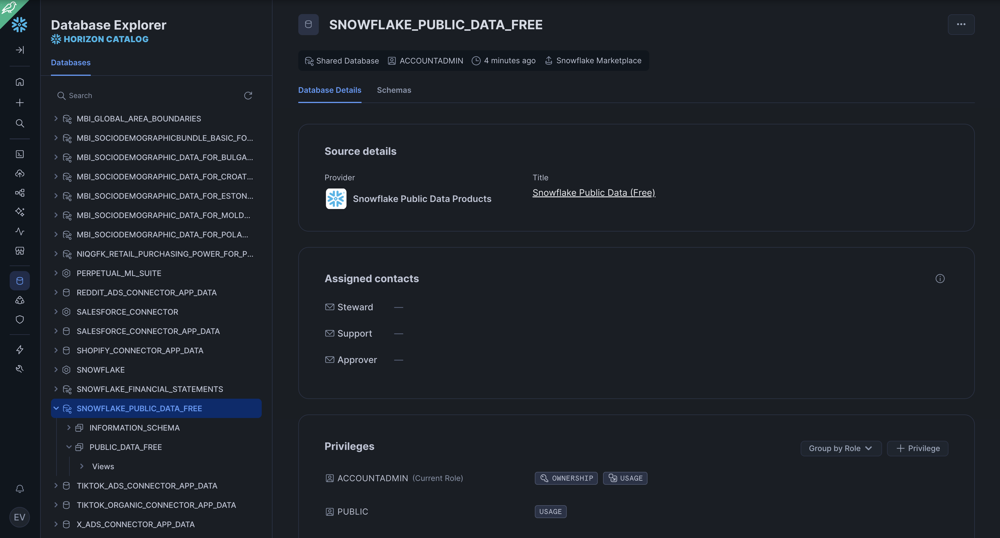

That's it! You have now successfully subscribed to the Snowflake Public Data (Free) from Snowflake Public Data, which is updated regularly with global financial data. Notice we didn't have to create databases, tables, views, or an ETL process. We simply searched for and accessed shared data from the Snowflake Data Marketplace.

> 
> 
> To learn more about how to use the new worksheet interface, go to the [Snowsight Docs](https://docs.snowflake.com/en/user-guide/ui-snowsight.html#using-snowsight).

<!-- ------------------------ -->

## Querying, the Results Cache, & Cloning


In the previous exercises, we loaded data into two tables using Snowflake's `COPY` bulk loader command and the `COMPUTE_WH` virtual warehouse. Now we are going to take on the role of the analytics users at our company who need to query data in those tables using the worksheet and the second warehouse `ANALYTICS_WH`.

> 
> 
>  **Real World Roles and Querying**
Within a real company, analytics users would likely have a different role than `SYSADMIN`. To keep the lab simple, we are going to stay with the `SYSADMIN` role for this section. Additionally, querying would typically be done with a business intelligence product like Tableau, Looker, PowerBI, etc. For more advanced analytics, data science tools like Datarobot, Dataiku, AWS Sagemaker or many others can query Snowflake. Any technology that leverages JDBC/ODBC, Spark, Python, or any of the other supported programmatic interfaces can run analytics on the data in Snowflake. To keep this lab simple, all queries are being executed via the Snowflake worksheet.

### Execute Some Queries

Go to the **ZERO_TO_SNOWFLAKE_WITH_Public_Data** worksheet and change the warehouse to use the new warehouse you created in the last section. Your worksheet context should be the following:

**Role:** `SYSADMIN`
**Warehouse:** `ANALYTICS_WH (L)`
**Database:** `Public_Data`
**Schema:** `PUBLIC`

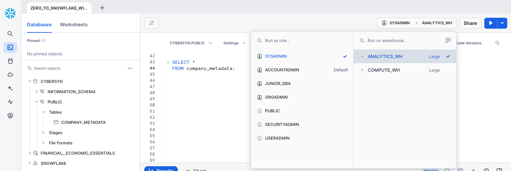

Run the following query to see a sample of the `company_metadata` data:

```SQL
SELECT * FROM company_metadata;
```

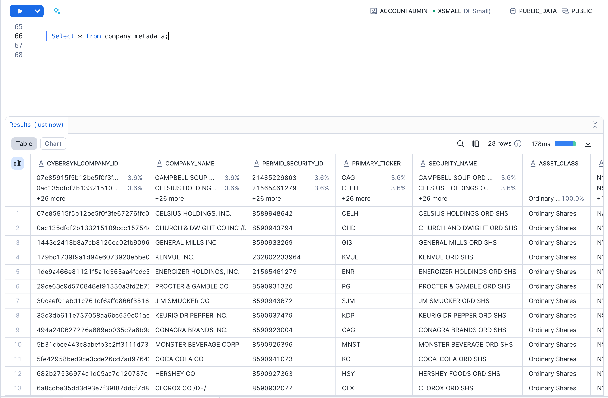

Now, let's look at the performance of these companies in the stock market. Run the queries below in the worksheet. 

**Closing Price Statistics:** First, calculate the daily return of a stock (the percent change in the stock price from the close of the previous day to the close of the current day) and 5-day moving average from closing prices (which helps smooth out daily price fluctuations to identify trends).

```SQL
SELECT
    meta.primary_ticker,
    meta.company_name,
    ts.date,
    ts.value AS post_market_close,
    (ts.value / LAG(ts.value, 1) OVER (PARTITION BY meta.primary_ticker ORDER BY ts.date))::DOUBLE AS daily_return,
    AVG(ts.value) OVER (PARTITION BY meta.primary_ticker ORDER BY ts.date ROWS BETWEEN 4 PRECEDING AND CURRENT ROW) AS five_day_moving_avg_price
FROM SNOWFLAKE_PUBLIC_DATA_FREE.PUBLIC_DATA_FREE.STOCK_PRICE_TIMESERIES ts
INNER JOIN company_metadata meta
ON ts.ticker = meta.primary_ticker
WHERE ts.variable_name = 'Post-Market Close';
```


> 
> 
>  If you have defined a particular database in the worksheet and want to use a table from a different database, you must fully qualify the reference to the other table by providing its database and schema name.

**Trading Volume Statistics:** Then, calculate the trading volume change from one day to the next to see if there's an increase or decrease in trading activity. This can be a sign of increasing or decreasing interest in a stock.

```SQL
SELECT
    meta.primary_ticker,
    meta.company_name,
    ts.date,
    ts.value AS nasdaq_volume,
    (ts.value / LAG(ts.value, 1) OVER (PARTITION BY meta.primary_ticker ORDER BY ts.date))::DOUBLE AS volume_change
FROM SNOWFLAKE_PUBLIC_DATA_FREE.PUBLIC_DATA_FREE.STOCK_PRICE_TIMESERIES ts
INNER JOIN company_metadata meta
ON ts.ticker = meta.primary_ticker
WHERE ts.variable_name = 'Nasdaq Volume';
```

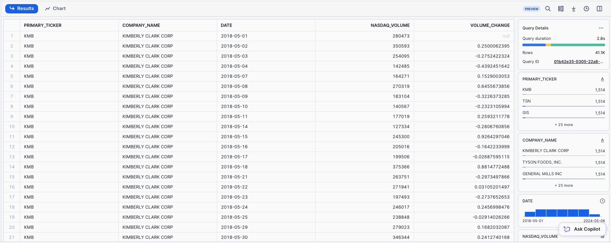

### Use the Result Cache

Snowflake has a result cache that holds the results of every query executed in the past 24 hours. These are available across warehouses, so query results returned to one user are available to any other user on the system who executes the same query, provided the underlying data has not changed. Not only do these repeated queries return extremely fast, but they also use no compute credits.

Let's see the result cache in action by running the exact same query again.

```SQL
SELECT
    meta.primary_ticker,
    meta.company_name,
    ts.date,
    ts.value AS post_market_close,
    (ts.value / LAG(ts.value, 1) OVER (PARTITION BY primary_ticker ORDER BY ts.date))::DOUBLE AS daily_return,
    AVG(ts.value) OVER (PARTITION BY primary_ticker ORDER BY date ROWS BETWEEN 4 PRECEDING AND CURRENT ROW) AS five_day_moving_avg_price
FROM SNOWFLAKE_PUBLIC_DATA_FREE.PUBLIC_DATA_FREE.STOCK_PRICE_TIMESERIES ts
INNER JOIN company_metadata meta
ON ts.ticker = meta.primary_ticker
WHERE variable_name = 'Post-Market Close';
```

In the **Query Details** pane on the right, note that the query runs significantly faster because the results have been cached.
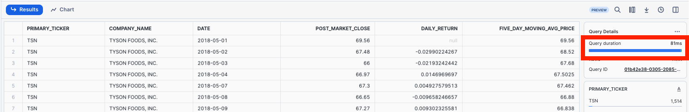

### Clone a Table

Snowflake allows you to create clones, also known as "zero-copy clones" of tables, schemas, and databases in seconds. When a clone is created, Snowflake takes a snapshot of data present in the source object and makes it available to the cloned object. The cloned object is writable and independent of the clone source. Therefore, changes made to either the source object or the clone object are not included in the other.

_A popular use case for zero-copy cloning is to clone a production environment for use by Development & Testing teams to test and experiment without adversely impacting the production environment and eliminating the need to set up and manage two separate environments._

> 
> 
>  **Zero-Copy Cloning**
A massive benefit of zero-copy cloning is that the underlying data is not copied. Only the metadata and pointers to the underlying data change. Hence, clones are “zero-copy" and storage requirements are not doubled when the data is cloned. Most data warehouses cannot do this, but for Snowflake it is easy!

Run the following command in the worksheet to create a development (dev) table clone of the `company_metadata` table:

```SQL
CREATE TABLE company_metadata_dev CLONE company_metadata;
```

Click the three dots (**...**) in the left pane and select **Refresh**. Expand the object tree under the `Public_Data` database and verify that you see a new table named `company_metadata_dev`. Your Development team now can do whatever they want with this table, including updating or deleting it, without impacting the `company_metadata` table or any other object.

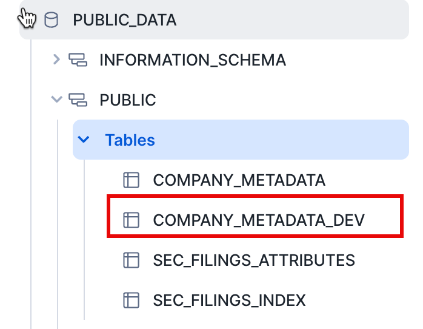

### Joining Tables

We will now join the JSON SEC filing datasets together to investigate the revenue of one CPG company, Kraft Heinz. Run the query below to join `SEC_FILINGS_INDEX` to `SEC_FILINGS_ATTRIBUTES` to see how Kraft Heinz (KHC) business segments have performed over time:

```SQL
WITH data_prep AS (
    SELECT 
        idx.cik,
        idx.company_name,
        idx.adsh,
        idx.form_type,
        att.measure_description,
        CAST(att.value AS DOUBLE) AS value,
        att.period_start_date,
        att.period_end_date,
        att.covered_qtrs,
        TRIM(att.metadata:"ProductOrService"::STRING) AS product
    FROM sec_filings_attributes_view att
    JOIN sec_filings_index_view idx
        ON idx.cik = att.cik AND idx.adsh = att.adsh
    WHERE idx.cik = '0001637459'
        AND idx.form_type IN ('10-K', '10-Q')
        AND LOWER(att.measure_description) = 'net sales'
        AND (att.metadata IS NULL OR OBJECT_KEYS(att.metadata) = ARRAY_CONSTRUCT('ProductOrService'))
        AND att.covered_qtrs IN (1, 4)
        AND value > 0
    QUALIFY ROW_NUMBER() OVER (
        PARTITION BY idx.cik, idx.company_name, att.measure_description, att.period_start_date, att.period_end_date, att.covered_qtrs, product
        ORDER BY idx.filed_date DESC
    ) = 1
)

SELECT
    company_name,
    measure_description,
    product,
    period_end_date,
    CASE
        WHEN covered_qtrs = 1 THEN value
        WHEN covered_qtrs = 4 THEN value - SUM(value) OVER (
            PARTITION BY cik, measure_description, product, YEAR(period_end_date)
            ORDER BY period_end_date
            ROWS BETWEEN 4 PRECEDING AND 1 PRECEDING
        )
    END AS quarterly_value
FROM data_prep
ORDER BY product, period_end_date;
```
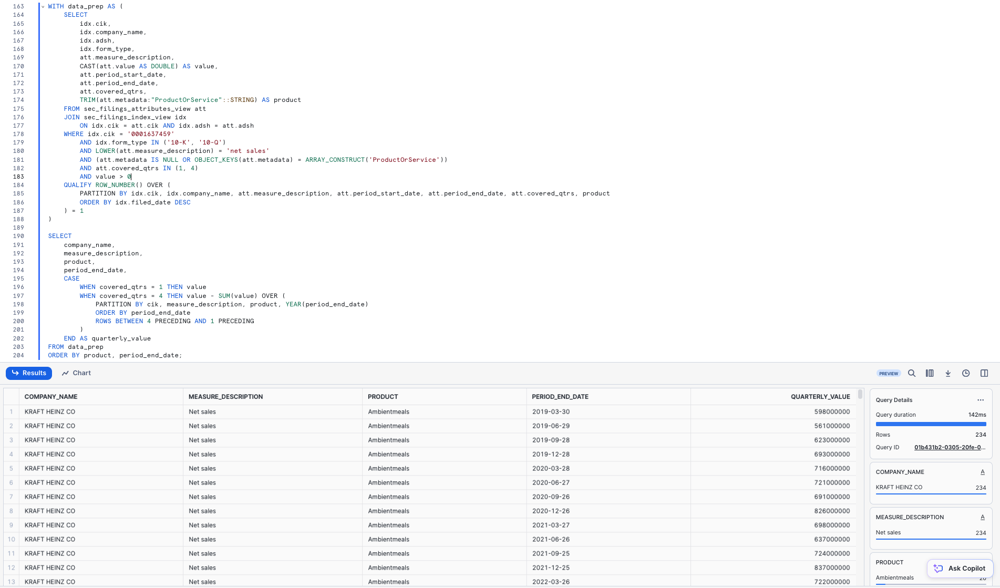

<!-- ------------------------ -->

## Using Time Travel


Snowflake's powerful Time Travel feature enables accessing historical data, as well as the objects storing the data, at any point within a period of time. The default window is 24 hours and, if you are using Snowflake Enterprise Edition, can be increased up to 90 days. Most data warehouses cannot offer this functionality, but - you guessed it - Snowflake makes it easy!

Some useful applications include:

- Restoring data-related objects such as tables, schemas, and databases that may have been deleted.
- Duplicating and backing up data from key points in the past.
- Analyzing data usage and manipulation over specified periods of time.

### Drop and Undrop a Table

First let's see how we can restore data objects that have been accidentally or intentionally deleted.

In the `ZERO_TO_SNOWFLAKE_WITH_Public_Data` worksheet, run the following DROP command to remove the `SEC_FILINGS_INDEX` table:

```SQL
DROP TABLE sec_filings_index;

-- Run a query on the table:
SELECT * FROM sec_filings_index LIMIT 10;
```

In the results pane at the bottom, you should see an error because the underlying table has been dropped:
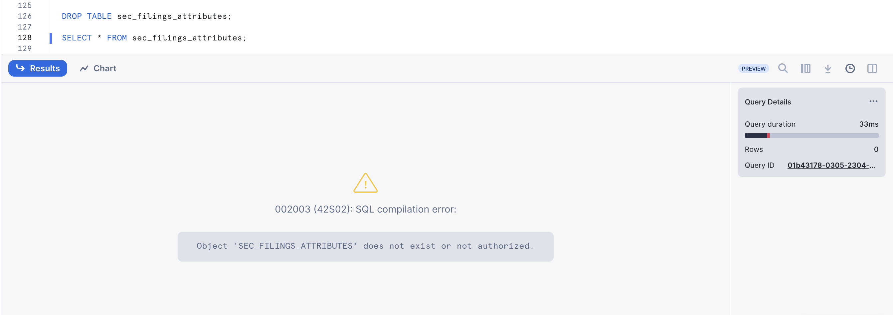

Now, restore the table:
```SQL
UNDROP TABLE sec_filings_index;
```

The SEC filing index table should be restored. Verify by running the following query:

```SQL 
SELECT * FROM sec_filings_index LIMIT 10;
```

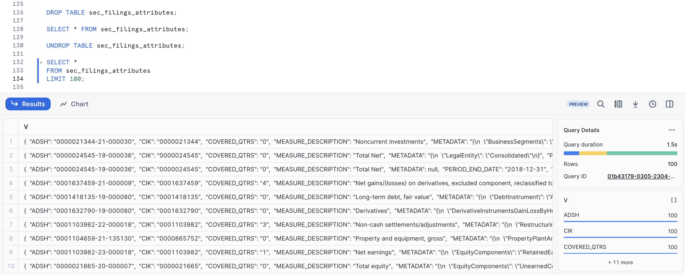

### Roll Back a Table

Let's roll back the `COMPANY_METADATA` table in the `Public_Data` database to a previous state to fix an unintentional DML error that replaces all the company names in the table with the word "oops".

First, run the following SQL statements to switch your worksheet to the proper context:

```SQL
USE ROLE sysadmin;

USE WAREHOUSE compute_wh;

USE DATABASE Public_Data;

USE SCHEMA public;
```

Run the following command to replace all of the company names in the table with the word "oops":

```SQL
UPDATE company_metadata SET company_name = 'oops';
```

Now, run a query that returns the companies. Notice that the company names are all the same:

```SQL
SELECT *
FROM company_metadata;
```

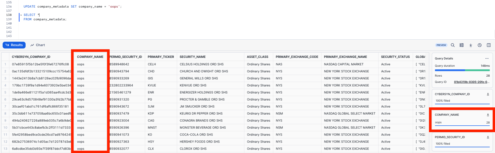

Normally we would need to scramble and hope we have a backup lying around. In Snowflake, we can simply run a command to find the query ID of the last `UPDATE` command and store it in a variable named `$QUERY_ID`.

Use Time Travel to recreate the table with the correct company names and verify the company names have been restored:
```SQL
-- Set the session variable for the query_id
SET query_id = (
  SELECT query_id
  FROM TABLE(information_schema.query_history_by_session(result_limit=>5))
  WHERE query_text LIKE 'UPDATE%'
  ORDER BY start_time DESC
  LIMIT 1
);

-- Use the session variable with the identifier syntax (e.g., $query_id)
CREATE OR REPLACE TABLE company_metadata AS
SELECT *
FROM company_metadata
BEFORE (STATEMENT => $query_id);

-- Verify the company names have been restored
SELECT *
FROM company_metadata;
```

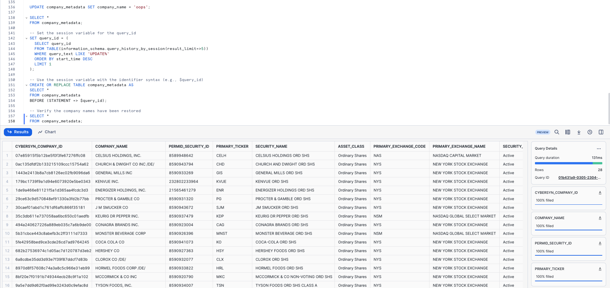

<!-- ------------------------ -->

## Working with Roles, Account Admin, & Account Usage


In this section, we will explore aspects of Snowflake's access control security model, such as creating a role and granting it specific permissions. We will also explore other usage of the `ACCOUNTADMIN` (Account Administrator) role.

Continuing with the lab story, let's assume a junior DBA has joined our internal analytics team, and we want to create a new role for them with less privileges than the system-defined, default role of `SYSADMIN`.

> 
> 
>  **Role-Based Access Control**
Snowflake offers very powerful and granular access control that dictates the objects and functionality a user can access, as well as the level of access they have. For more details, check out the [Snowflake documentation](https://docs.snowflake.com/user-guide/security-access-control-overview).

### Create a New Role and Add a User

In the `ZERO_TO_SNOWFLAKE_WITH_PUBLIC_DATA` worksheet, switch to the `ACCOUNTADMIN` role to create a new role. `ACCOUNTADMIN` encapsulates the `SYSADMIN` and `SECURITYADMIN` system-defined roles. It is the top-level role in the account and should be granted only to a limited number of users.

```SQL
USE ROLE accountadmin;
```

Notice that, in the top right of the worksheet, the context has changed to `ACCOUNTADMIN`:

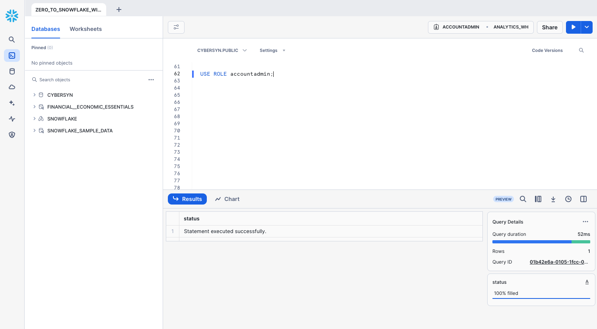

Before a role can be used for access control, at least one user must be assigned to it. So let's create a new role named `JUNIOR_DBA` and assign it to your Snowflake user. To complete this task, you need to know your username, which is the name you used to log in to the UI.

Use the following commands to create the role and assign it to you. Before you run the GRANT ROLE command, replace `YOUR_USERNAME_GOES_HERE` with your username:

```SQL
CREATE ROLE junior_dba;

GRANT ROLE junior_dba TO USER YOUR_USERNAME_GOES_HERE;
```

> 
> 
>  If you try to perform this operation while in a role such as `SYSADMIN`, it would fail due to insufficient privileges. By default (and design), the `SYSADMIN` role cannot create new roles or users.

Change your worksheet context to the new `JUNIOR_DBA` role:

```SQL
USE ROLE junior_dba;
```

In the top right of the worksheet, notice that the context has changed to reflect the `JUNIOR_DBA` role. 

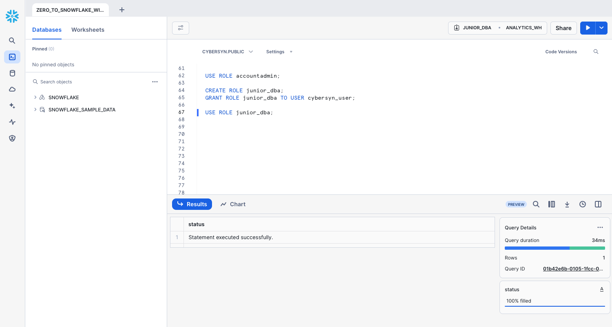

Also, the warehouse is not selected because the newly created role does not have usage privileges on any warehouse. Let's fix it by switching back to `ACCOUNTADMIN` role and grant usage privileges to `COMPUTE_WH` warehouse.

```SQL
USE ROLE accountadmin;

GRANT USAGE ON WAREHOUSE compute_wh TO ROLE junior_dba;
```

Switch back to the `JUNIOR_DBA` role. You should be able to use `COMPUTE_WH` now.
```SQL
USE ROLE junior_dba;

USE WAREHOUSE compute_wh;
```

Finally, you can notice that in the database object browser panel on the left, the `Public_Data` and `SNOWFLAKE_PUBLIC_DATA_FREE` databases no longer appear. This is because the `JUNIOR_DBA` role does not have privileges to access them.

Switch back to the `ACCOUNTADMIN` role and grant the `JUNIOR_DBA` the USAGE privilege required to view and use the `Public_data` and `SNOWFLAKE_PUBLIC_DATA_FREE` databases. Note that the Snowflake Public Data database from the Marketplace uses `GRANT IMPORTED PRIVILEGES`, instead of `GRANT USAGE`.

```SQL
USE ROLE accountadmin;

GRANT USAGE ON DATABASE Public_Data TO ROLE junior_dba;

GRANT IMPORTED PRIVILEGES ON DATABASE SNOWFLAKE_PUBLIC_DATA_FREE TO ROLE junior_dba;

USE ROLE junior_dba;
```

Notice that the `Public_Data` and `SNOWFLAKE_PUBLIC_DATA_FREE` databases now appear in the database object browser panel on the left. If they don't appear, try clicking **...** in the panel, then clicking **Refresh**.

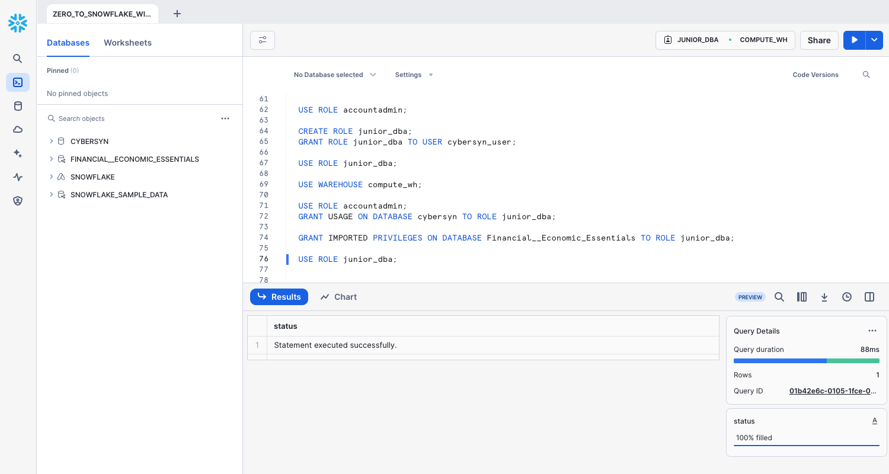

### View the Account Administrator UI

Let's change our access control role back to `ACCOUNTADMIN` to see other areas of the UI accessible only to this role. However, to perform this task, use the UI instead of the worksheet.

First, click the **Home** icon in the top left corner of the worksheet. Then, in the bottom left corner of the UI, click your name to display the user preferences menu. In the menu, go to **Switch Role** and select `ACCOUNTADMIN`.

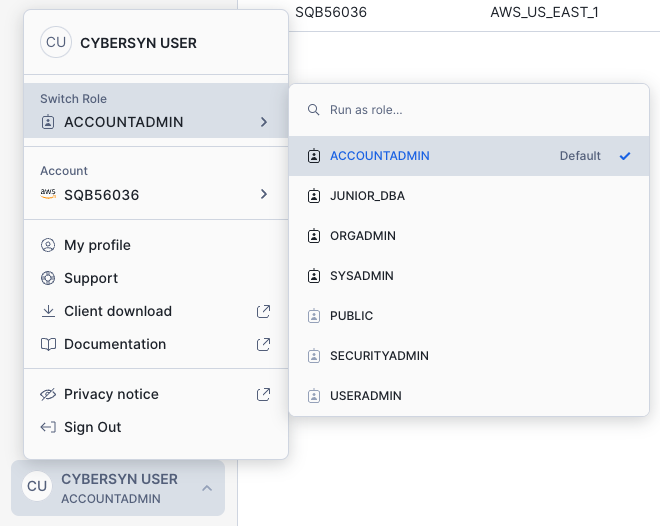

> 
> 
>  **Roles in User Preference vs Worksheet**
Why did we use the user preference menu to change the role instead of the worksheet? The UI session and each worksheet have their own separate roles. The UI session role controls the elements you can see and access in the UI, whereas the worksheet role controls only the objects and actions you can access within the role.

Notice that once you switch the UI session to the `ACCOUNTADMIN` role, new tabs are available under **Admin**.

#### Admin > Cost Management

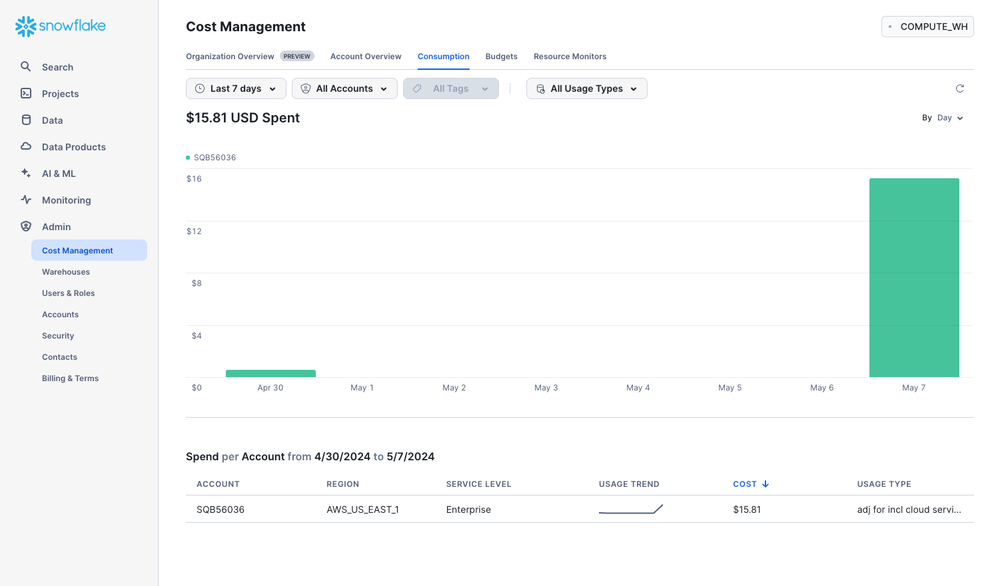

The <a href="https://app.snowflake.com/_deeplink/#/account/usage?utm_source=snowflake-devrel&utm_medium=developer-guides&utm_content=getting-started-with-snowflake&utm_cta=developer-guides-deeplink" class="_deeplink">**Cost Management** tab</a> shows your usage of Snowflake credits, with filters by account and consumption types:
- **Organization**: Credit usage across all the accounts in your organization.
- **Compute**: Credits consumed by the virtual warehouses in the current account.
- **Storage**: Average amount of data stored in all databases, internal stages, and Snowflake Failsafe in the current account for the past month.
- **Data Transfer**: Average amount of data transferred out of the region (for the current account) into other regions for the past month.

#### Admin > Security

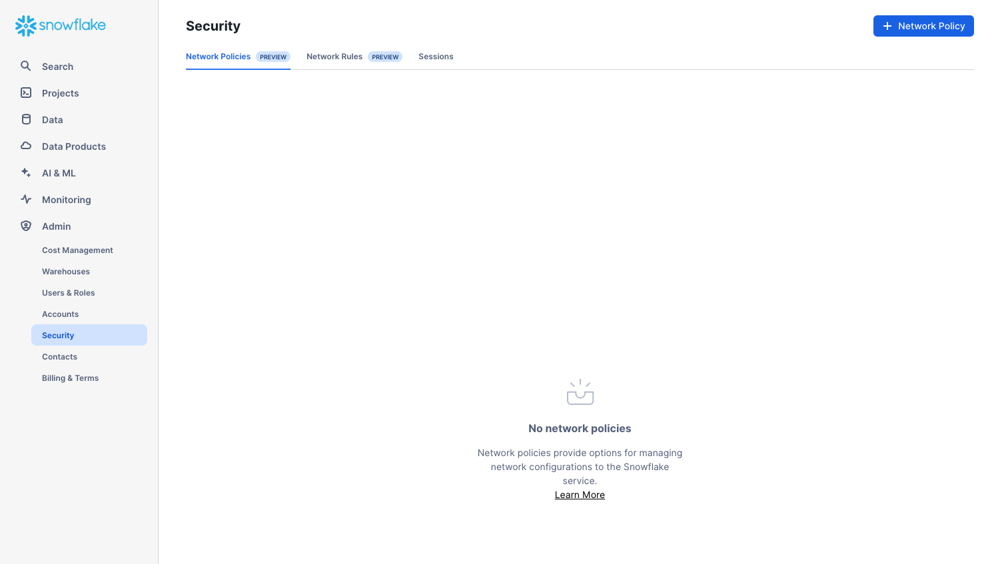

The **Security** tab contains network policies created for the Snowflake account. New network policies can be created by selecting “+ Network Policy” at the top right hand side of the page.

#### Admin > Billing & Terms

The **Billing & Terms** tab contains the payment method for the account:
- If you are a Snowflake contract customer, the tab shows the name associated with your contract information.
- If you are an on-demand Snowflake customer, the tab shows the credit card used to pay month-to-month, if one has been entered. If no credit card is on file, you can add one to continue using Snowflake when your trial ends.

For the next section, stay in the `ACCOUNTADMIN` role for the UI session.

<!-- ------------------------ -->

## Sharing Data Securely via Snowflake Marketplace


Snowflake enables data access between accounts through the secure data sharing features. Shares are created by data providers and imported by data consumers, either through their own Snowflake account or a provisioned Snowflake Reader account. The consumer can be an external entity or a different internal business unit that is required to have its own unique Snowflake account.

With secure data sharing:

- There is only one copy of the data that lives in the data provider's account.
- Shared data is always live, real-time, and immediately available to consumers.
- Providers can establish revocable, fine-grained access to shares.
- Data sharing is simple and safe, especially compared to older data sharing methods, which were often manual and insecure, such as transferring large `.csv` files across the internet.

> 
> 
>  **Cross-region & cross-cloud data sharing** To share data across regions or cloud platforms, you must set up replication. This is outside the scope of this lab, but more information is available in [this Snowflake article](/trending/what-is-data-replication).

Snowflake uses secure data sharing to provide account usage data and sample data sets to all Snowflake accounts. In this capacity, Snowflake acts as the data provider of the data and all other accounts.

Secure data sharing also powers the Snowflake Data Marketplace, which is available to all Snowflake customers and allows you to discover and access third-party datasets from numerous data providers and SaaS vendors. Again, in this data sharing model, the data doesn't leave the provider's account and you can use the datasets without any transformation.

### View Existing Shares

In the home page, navigate to **Data** > **Databases**. In the <a href="https://app.snowflake.com/_deeplink/#/data/databases?utm_source=snowflake-devrel&utm_medium=developer-guides&utm_campaign=-us-en-all&utm_content=app-getting-started-with-snowflake&utm_cta=developer-guides-deeplink" class="_deeplink">list of databases</a>, look at the **SOURCE** column. You should see one database with `Local` in the column, which we created previously in the lab. The other database, `SNOWFLAKE`, shows `Share` in the column, indicating it's shared from a provider.

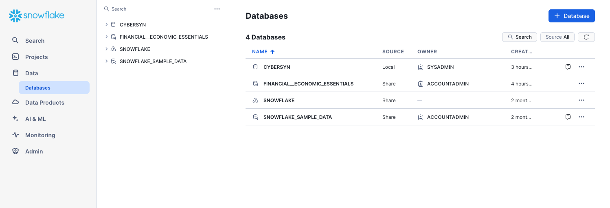

### Create an Outbound Share

Assume we are the Account Administrator for our Snowflake account. We have a trusted partner who wants to analyze our data on a near real-time basis. This partner also has their own Snowflake account in the same region as our account. We can use secure data sharing to allow them to access this information.

Navigate to **Data Products** > **Private Sharing**, then at the top of the tab click **Shared By Your Account**. Click the **Share** button in the top right corner and select **Create a Direct Share**:

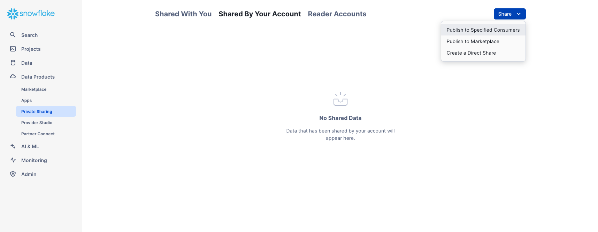

Click **+ Select Data** and navigate to the database and schema you want to share. Select the tables and click the **Done** button:

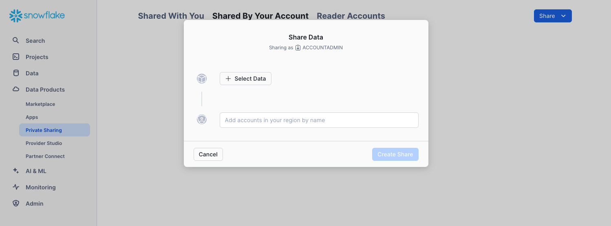

The default name of the share is a generic name with a random numeric value appended. Edit the default name to a more descriptive value that will help identify the share in the future (e.g. `ZERO_TO_SNOWFLAKE_SHARED_DATA`). You can also add a comment.

In a real-world scenario, the Account Administrator would next add one or more consumer accounts to the share, but we'll stop here for the purposes of this lab.

Click the **Create Share** button at the bottom of the dialog. The dialog closes and the page shows the secure share you created.

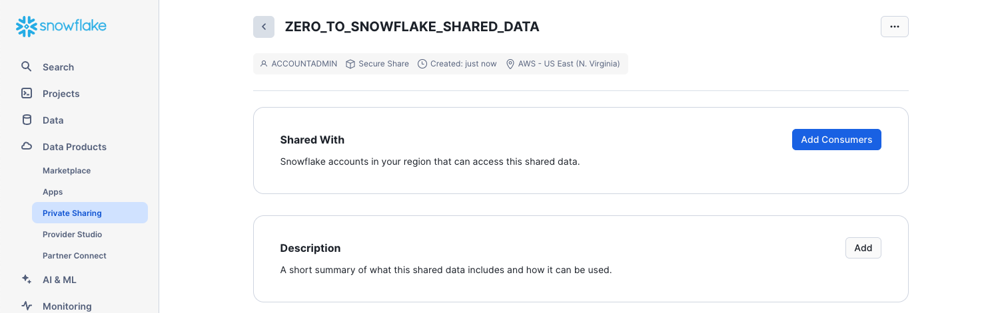

You can add consumers, add/change the description, and edit the objects in the share at any time. In the page, click the **<** button next to the share name to return to the **Share with Other Accounts** page.

We've demonstrated how it only takes seconds to give other accounts access to data in your Snowflake account in a secure manner with no copying or transferring of data required!

Snowflake provides several ways to securely share data without compromising confidentiality. In addition to tables, you can share secure views, secure UDFs (user-defined functions), and other secure objects. For more details about using these methods to share data while preventing access to sensitive information, see the [Snowflake documentation](https://docs.snowflake.com/en/user-guide/data-sharing-secure-views.html).

<!-- ------------------------ -->

## Resetting Your Snowflake Environment


If you would like to reset your environment by deleting all the objects created as part of this lab, ensure you are using the `ACCOUNTADMIN` role in the worksheet and run the following commands to drop the objects we created in the lab:

```SQL
USE ROLE accountadmin;

DROP DATABASE IF EXISTS Public_Data;

DROP WAREHOUSE IF EXISTS analytics_wh;

DROP ROLE IF EXISTS junior_dba;
```

<!-- ------------------------ -->

## Conclusion & Next Steps


Congratulations on completing this introductory lab exercise! You've mastered the Snowflake basics and are ready to apply these fundamentals to your own data. Be sure to reference this guide if you ever need a refresher.

We encourage you to continue with your free trial by loading your own sample or production data and by using some of the more advanced capabilities of Snowflake not covered in this lab.

### Additional Resources:

- Learn more about the [Snowsight](https://docs.snowflake.com/en/user-guide/ui-snowsight.html#using-snowsight) docs.
- Read the [Definitive Guide to Maximizing Your Free Trial](/test-driving-snowflake-the-definitive-guide-to-maximizing-your-free-trial/) document.
- Attend a [Snowflake virtual or in-person event](/about/events/) to learn more about our capabilities and customers.
- Join the [Snowflake Community](https://community.snowflake.com/s/topic/0TO0Z000000wmFQWAY/getting-started-with-snowflake).
- Sign up for [Snowflake University](https://community.snowflake.com/s/article/Getting-Access-to-Snowflake-University).
- Contact our [Sales Team](/free-trial-contact-sales/) to learn more.
- Access Snowflake Public Data's analytics-ready data on [Snowflake Marketplace](https://app.snowflake.com/marketplace/providers/GZTSZAS2KCS/Snowflake%20Public%20Data%20Products).

### What we've covered:

- How to create stages, databases, tables, views, and virtual warehouses.
- How to load structured and semi-structured data.
- How to consume Snowflake Public data from the [Snowflake Data Marketplace](https://app.snowflake.com/marketplace/listing/GZTSZAS2KF7/).
- How to perform analytical queries on data in Snowflake, including joins between tables.
- How to clone objects.
- How to undo user errors using Time Travel.
- How to create roles and users, and grant them privileges.
- How to securely and easily share data with other accounts.

- [Fork repo on GitHub](https://github.com/Snowflake-Labs/snowflake-demo-notebooks/blob/main/Create%20and%20Manage%20Snowflake%20Objects%20like%20a%20Pro/Create%20and%20Manage%20Snowflake%20Objects%20like%20a%20Pro.ipynb)
- [Download Reference Architecture](/content/dam/snowflake-site/developers/2024/05/Citibike-Data-Analysis_-Create-and-manage-Snowflake-Objects-like-a-pro.pdf)
- [Watch the Demo](https://youtu.be/Dj8aAoEOfrw?list=TLGGDV2-mOUmeyYyMDA5MjAyNQ)
