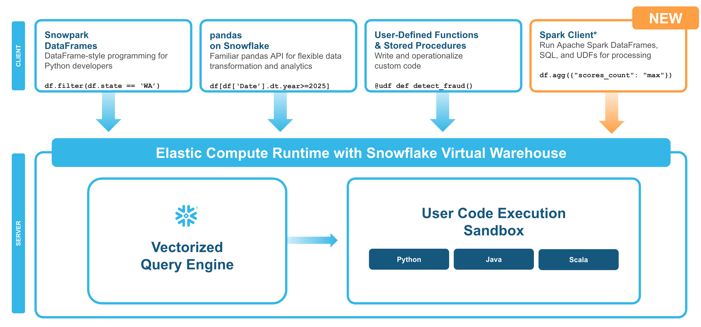

author: Vino Duraisamy, Kala Govindarajan
id: getting-started-with-snowpark-connect-for-apache-spark
categories: snowflake-site:taxonomy/solution-center/certification/quickstart, snowflake-site:taxonomy/product/data-engineering
language: en
summary: This quickstart guide shows you how to get started with Snowpark Connect for Apache Spark™ using Snowflake Notebooks in Workspaces.
environments: web
status: Published
feedback link: https://github.com/Snowflake-Labs/sfguides/issues

# Getting Started with Snowpark Connect for Apache Spark
<!-- ------------------------ -->

## Overview

Through this quickstart, you will learn how to get started with [Snowpark Connect for Apache Spark™](/en/blog/snowpark-connect-apache-spark-preview/). Using Snowpark Connect for Apache Spark, you can run Spark workloads directly on Snowflake.

### What You'll Learn

By the end of this quickstart, you will learn how to:

* Connect to the Snowpark Connect server from a Snowflake Notebook
* Generate synthetic data using PySpark and write it to Snowflake
* Create and apply Spark User-Defined Functions (UDFs)
* Create Snowflake Python functions and execute native SQL from Spark via SQL passthrough

### What is Snowpark?

Snowpark is the set of libraries and code execution environments that run Python and other programming languages next to your data in Snowflake. Snowpark can be used to build data pipelines, ML models, apps, and other data processing tasks.

### What is Snowpark Connect for Apache Spark™?

With Snowpark Connect for Apache Spark, you can connect your existing Spark workloads directly to Snowflake and run them on the Snowflake compute engine. Snowpark Connect for Spark supports using the Spark DataFrame API on Snowflake. All workloads run on Snowflake warehouse. As a result, you can run your PySpark dataframe code with all the benefits of the Snowflake engine.

In Apache Spark™ version 3.4, the Apache Spark community introduced Spark Connect. Its decoupled client-server architecture separates the user's code from the Spark cluster where the work is done. This new architecture makes it possible for Snowflake to power Spark jobs.

### What You'll Build

* Run simple PySpark code examples from Snowflake

* Generate synthetic support case data using PySpark and write it to a Snowflake table

* Create a Spark UDF (User Defined Function), register it and invoke it directly from a Snowflake Notebook

* Create a Snowflake Python Function and invoke it with SQL passthrough from Spark

### Prerequisites

* Access to a [Snowflake account](https://signup.snowflake.com/?utm_source=snowflake-devrel&utm_medium=developer-guides&utm_cta=developer-guides)

<!-- ------------------------ -->
## Setup

During this step you will set up a Snowflake Notebook in Workspaces and upload the PySpark notebook.

Sign up for a [Snowflake Free Trial](https://signup.snowflake.com/?utm_source=snowflake-devrel&utm_medium=developer-guides&utm_cta=developer-guides) account and login to Snowflake.

### Download the Notebook

Download the `getting_started_with_snowpark_connect_for_apache_spark.ipynb` from [this GitHub repository](https://github.com/Snowflake-Labs/sf-samples/blob/main/samples/snowpark_connect/getting_started_with_snowpark_connect_for_apache_spark.ipynb). On the GitHub page, click the **Download raw file** button (download icon in the top right) and save the `.ipynb` file to your computer.

### Upload the Notebook to a Workspace

[Snowflake Notebooks in Workspaces](https://docs.snowflake.com/en/user-guide/ui-snowsight/notebooks-in-workspaces/notebooks-in-workspaces-overview) provide a Jupyter-compatible environment with managed compute and direct access to Snowflake data.

* In the Snowsight UI, navigate to **Projects** > **Workspaces**.
* Click **Add new** > **Upload Files**.
* Select the `getting_started_with_snowpark_connect_for_apache_spark.ipynb` you downloaded earlier.
* Click on the uploaded file to open it — it is ready to run.

> NOTE:
> With Notebooks in Workspaces, the `snowpark-connect` package is automatically available. You do not need to manually install it via the packages dropdown.

<!-- ------------------------ -->
## Run PySpark Code

Follow along and run each of the cells in the notebook. Here is what each section covers:

### Connect to Snowpark Connect

The first cells initialize the Snowpark Connect server and verify the connection. The notebook uses `get_active_session()` to connect to Snowflake and then creates a Spark session via `snowpark_connect.server.init_spark_session()`.

### Generate Synthetic Data

Next, you will generate synthetic support case data using PySpark. This demonstrates creating DataFrames with complex schemas, data generation patterns, and writing DataFrames to Snowflake tables using `saveAsTable`.

### Spark UDFs

You will create a Spark UDF to categorize support cases based on their description, apply it to the data, and write the transformed results back to Snowflake. This shows how custom Python logic can be used within PySpark on Snowflake.

### Snowflake UDFs and SQL Passthrough

Finally, you will create a Snowflake Python function and invoke it using SQL passthrough from Spark with `spark.sql()`. This demonstrates how to combine native Snowflake functions with PySpark workflows.

<!-- ------------------------ -->
## Conclusion And Resources

Congratulations! You have successfully completed this quickstart and learned how to run PySpark workloads directly on Snowflake using Snowpark Connect.

### What You Learned

* How to connect to the Snowpark Connect server from a Snowflake Notebook in Workspaces
* How to generate synthetic data using PySpark and write it to Snowflake
* How to create and apply Spark User-Defined Functions (UDFs)
* How to create Snowflake Python functions and use SQL passthrough from Spark

### Related Resources

* [Snowpark Connect Documentation](https://docs.snowflake.com/en/developer-guide/snowpark-connect/snowpark-connect-overview)
* [Snowflake Notebooks in Workspaces](https://docs.snowflake.com/en/user-guide/ui-snowsight/notebooks-in-workspaces/notebooks-in-workspaces-overview)
* [Source Code on GitHub](https://github.com/Snowflake-Labs/sf-samples/blob/main/samples/snowpark_connect/getting_started_with_snowpark_connect_for_apache_spark.ipynb)
* [Comprehensive Intro to Snowpark Connect](https://github.com/Snowflake-Labs/sf-samples/blob/main/samples/snowpark_connect/intro_to_snowpark_connect.ipynb)
