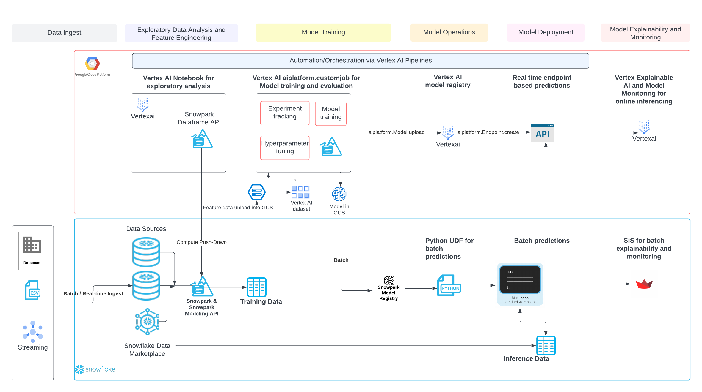
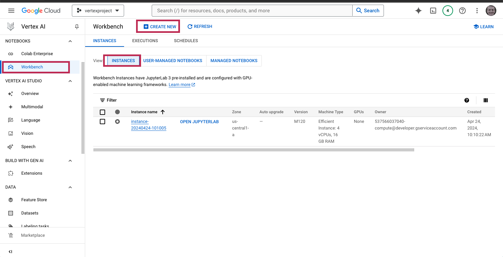
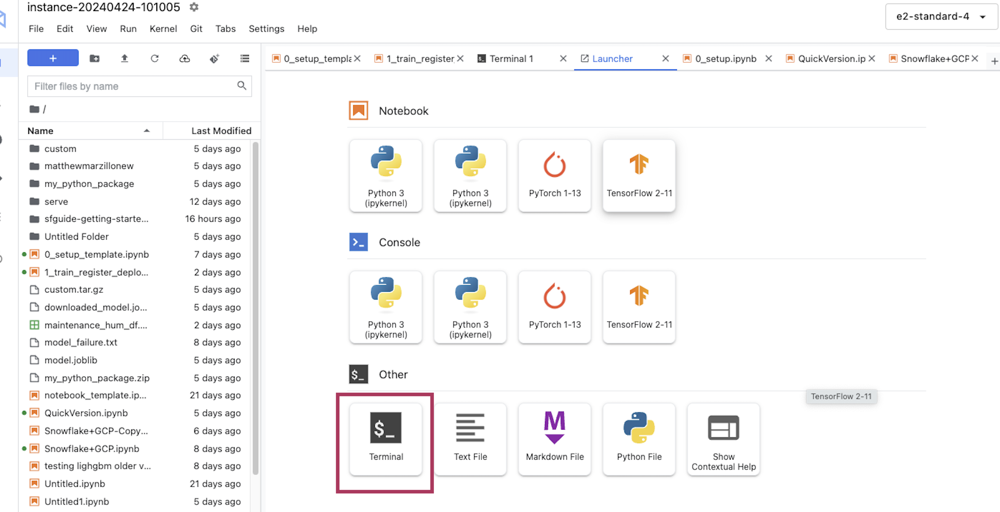
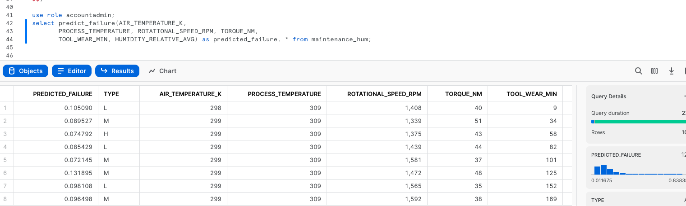

id: getting-started-with-snowpark-for-machine-learning-on-vertexai
categories: snowflake-site:taxonomy/solution-center/certification/quickstart, snowflake-site:taxonomy/product/ai, snowflake-site:taxonomy/product/applications-and-collaboration
language: en
summary: This is a qucikstart for using Snowpark for ML on Vertex AI 
environments: web
status: Published 
feedback link: https://github.com/Snowflake-Labs/sfguides/issues


# Getting Started with Snowpark for Machine Learning on Vertex AI
<!-- ------------------------ -->
## Overview 

Python is the language of choice for Data Science and Machine Learning workloads. Snowflake has long supported Python via the Python Connector, allowing data scientists to interact with data stored in Snowflake from their preferred Python environment. This did, however, require data scientists to write verbose SQL queries. To provide a more friendly, expressive, and extensible interface to Snowflake, we built Snowpark Python, a native Python experience with a pandas and PySpark-like API for data manipulation. This includes a client-side API to allow users to write Python code in a Spark-like API without the need to write verbose SQL. Python UDF and Stored Procedure support also provides more general additional capabilities for compute pushdown.

Snowpark includes client-side APIs and server-side runtimes that extends Snowflake to popular programming languages including Scala, Java, and Python. Ultimately, this offering provides a richer set of tools for Snowflake users (e.g. Python's extensibility and expressiveness) while still leveraging all of Snowflake's core features, and the underlying power of SQL, and provides a clear path to production for machine learning products and workflows.

A key component of Snowpark for Python is that you can "Bring Your Own IDE"- anywhere that you can run a Python kernel, you can run client-side Snowpark Python. You can use it in your code development the exact same way as any other Python library or module. In this quickstart, we will be using Jupyter Notebooks, but you could easily replace Jupyter with any IDE of your choosing.

Vertex AI is Google's unified artificial intelligence platform designed to streamline the process of building, deploying, and scaling machine learning models. Integrating a wide range of services, Vertex AI allows data scientists and engineers to efficiently manage end-to-end workflows, from data preparation and model training to hyperparameter tuning and model deployment. Its robust features include easy access to AutoML for automated model generation, custom training with user-defined algorithms, and support for popular frameworks like TensorFlow, PyTorch, and XGBoost. By leveraging Google Cloud's powerful infrastructure, Vertex AI ensures scalability, reduced latency, and operational efficiency, enabling organizations to derive actionable insights from their data more effectively.

This quickstart is designed to service as an introduction to using Vertex AI with Snowpark for model development and deployment to Snowflake. The idea is that users can build off this quickstart or integrate components into their existing Vertex AI workloads.

### Prerequisites
- Familiarity with [Snowflake](/en/developers/guides/getting-started-with-snowflake/) and a Snowflake account
- Familiarity with Vertex AI and a Google Cloud account
- Familiarity with [Python](https://www.udemy.com/course/draft/579706/)

### You'll Learn
- Using a Jupyter Notebook in Vertex AI with Snowpark
- Loading and transforming data via Snowpark
- Defining User Defined Functions for distributed scoring of machine learning models

### What You’ll Need 
- A free [Snowflake Account](https://signup.snowflake.com/?utm_source=snowflake-devrel&utm_medium=developer-guides&utm_cta=developer-guides)
- [Google Cloud Account](https://cloud.google.com/free?hl=en)


### What You’ll Build 
You will build an end-to-end data science workflow leveraging Snowpark for Python
- to load, clean and prepare data
- to train a machine learning model using Python in a Vertex AI Workbench notebook
- to deploy the trained models in Snowflake using Python User Defined Functions (UDFs)

The end-to-end workflow will look like this:


<!-- ------------------------ -->
## Use Case

In this use case you will build a binary model based on the 'Machine Predictive Maintenance Classification' dataset from [Kaggle](https://www.kaggle.com/datasets/shivamb/machine-predictive-maintenance-classification). We supplement this dataset with data from the Snowflake [data marketplace](/en/data-cloud/marketplace/).

The use case uses information related to machine diagnostics (torque, rotational speed) and environmental features (air temperature, humidity) to predict the likelihood of a failure.

<!-- ------------------------ -->
## Set Up Snowflake Environment

The first thing we will do is create a database and warehouse in your Snowflake environment. Run the below code in a Snowflake worksheet.
```sql
use role accountadmin;

CREATE OR REPLACE WAREHOUSE HOL_WH WITH WAREHOUSE_SIZE='X-SMALL';

CREATE OR REPLACE DATABASE HOL_DB;
```

## Double check Anaconda Terms (Instructions provided here)
https://docs.snowflake.com/en/developer-guide/udf/python/udf-python-packages#using-third-party-packages-from-anaconda

1. Sign in to Snowsight.
2. Select Admin » Billing & Terms.
3. In the Anaconda section, select Enable.
4. In the Anaconda Packages dialog, click the link to review the Snowflake Third Party Terms page.
5. If you agree to the terms, select Acknowledge & Continue.

<!-- ------------------------ -->
## Set Up Vertex AI Environment

If you haven't used Vertex AI you will have to create a Vertex AI service inside of a Google Cloud project. You can review material [here](https://cloud.google.com/vertex-ai/docs/start/introduction-unified-platform) though it is straightforward to create the service by searching "Vertex AI" in the Google Cloud console and starting up the service.

Once you have a Vertex AI service created you will proceed to the "Workbench" blade, select "Instances" the select "Create New". You can rename the instance but leave all of the default configurations as shown. 



Start the instance and wait several minutes for the instance to start then click "Open JupyterLab" and open a terminal window.



<!-- ------------------------ -->
## Clone Github Repo


In the terminal window you will copy the public repo that contains the data and scripts needed for this quickstart.
```bash
git clone https://github.com/Snowflake-Labs/sfguide-getting-started-with-snowpark-for-machine-learning-on-vertexai
```

Click into the folder on the side that has been copied. Click into the folder open up notebook "0_..." and make sure that you're using a Python 3 kernel.


<!-- ------------------------ -->
## Load data into Snowflake

Now work through the set up script. Uncomment the "pip install" code at the top in order to install the libraries you need. Your chosen role will need to have permissions to create these objects - if you are in a fresh lab account, the `ACCOUNTADMIN` role will work, but note that this wouldn't be used in a production setting.

You will need to enter your user and account credentials, and it is important that your `account` is in the correct format as outlined in the [Snowflake documentation](https://docs.snowflake.com/en/user-guide/admin-account-identifier#non-vps-account-locator-formats-by-cloud-platform-and-region). Your `host` will be your `account` ID followed by `.snowflakecomputing.com`, for example:
```python
connection_parameters = {
    "account": "hk12345.eu-west-2.aws",
    "host": "hk12345.eu-west-2.aws.snowflakecomputing.com",
    "user": <your_user>, 
    "password": <your_password>,
    "role": <your_role>, # using "ACCOUNTADMIN" may simplify things in an isolated lab environment
    }
```
> Tip for finding Snowflake account ID:
```sql
use role orgadmin;
show organization accounts;
```
Scroll to account_url and copy the URL

i.e. https://hvxehhp-bxb87833.snowflakecomputing.com

Account = hvxehhp-bxb87833
Host = hvxehhp-bxb87833.snowflakecomputing.com

> Note: for simplicity in this lab you will need to enter your account and user credentials directly in your notebook. For a production setup, this would be a security risk so Google Secret Manager or a similar tool would be appropriate.

Once complete with the script, check back to your Snowflake environment to make sure that your data has loaded. Review the steps as you go: you just used a little bit of Snowpark to get that data loaded via the `session.write_pandas` function!


### Troubleshooting `pyarrow` related issues

- If you have `pyarrow` library already installed, uninstall it from terminal before installing Snowpark.
- If you do not have `pyarrow` installed, you do not need to install it yourself; installing Snowpark automatically installs the appropriate version.
- Do not reinstall a different version of `pyarrow` after installing Snowpark.

<!-- ------------------------ -->
## Build and Deploy Model

Now open and work through the `1...` workbook to join together the datasets, bring in the training data then build and deploy the model. Once again, make sure to select the correct python environment.

Once that notebook is complete you will have deployed a model to the Snowpark Model Registry and have access to inference functions in Snowflake! Inference can be done via Snowpark Python code or Snowflake SQL. Let's generate predictions with this udf with Snowflake SQL. Copy and paste the code below into your snowflake environment to generate inference.

```sql
use role accountadmin;
select GET(aml_model!predict_proba(AIR_TEMPERATURE_K,
       PROCESS_TEMPERATURE, ROTATIONAL_SPEED_RPM, TORQUE_NM,
       TOOL_WEAR_MIN, HUMIDITY_RELATIVE_AVG), 'output_feature_1') as predicted_failure, * from maintenance_hum;
```



<!-- ------------------------ -->
## Conclusion and Additional Considerations

This quickstart is just that, a quick way to get you started with using Vertex AI with Snowflake and Snowpark. For enterprise uses, data scientists and developers will want to consider additional details. Most important is considering the tracking of the mlops lineage from data to model to deployment. A more mature architecture will include the additional steps below which include the registration of the data and the model.


Looking specifically at Vertex AI two additional considerations that you may want to consider are:
1. Rather than using an pre-built image then installing packages, you may want to create your own custom image that includes the Snowpark packages and other packages that you commonly use.
2. You may know that the Snowpark sandbox on Snowflake includes Anaconda supported packages which includes the scikitlearn package that was used to build the logistic regression model. If you use other packages to build your models that are not supported by Anaconda you will have to install [third party packages in the Snowpark sandbox](https://docs.snowflake.com/en/developer-guide/udf/python/udf-python-packages.html).

### What We covered
- Using Vertex AI Workbench with Snowpark
- Loading and transforming data via Snowpark with pushdown compute
- Deploying models to Snowflake via a User Defined Function

### Additional Considerations
- There are some great blogs on Medium regarding Snowpark and using Snowflake with the Google Cloud Platform

- [Operationalizing Snowpark](https://medium.com/snowflake/operationalizing-snowpark-python-part-one-892fcb3abba1)

If you have any questions, reach out to your Snowflake account team!
