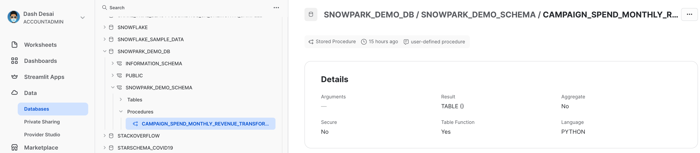

id: getting-started-with-snowpark-in-snowflake-python-worksheets-ptbr
categories: snowflake-site:taxonomy/solution-center/certification/quickstart, snowflake-site:taxonomy/product/data-engineering, snowflake-site:taxonomy/product/platform
language: pt_br
summary: Introdução ao Snowpark em planilhas Python para Snowflake
environments: web
status: Published
feedback link: https://github.com/Snowflake-Labs/sfguides/issues
authors: Dash Desai


# Introdução ao Snowpark em planilhas Python para Snowflake
<!-- ------------------------ -->
## Visão geral


Ao concluir este guia, você poderá testar o Snowpark para Python dentro da interface do Snowflake, e vai ter uma compreensão melhor de como realizar tarefas essenciais de engenharia de dados usando o Snowpark em uma planilha Snowflake Python.

### O que é o Snowpark?

Trata-se do conjunto de bibliotecas e sistemas de runtime (tempo de execução) do Snowflake que implementam e processam códigos não SQL de forma segura, incluindo Python, Java e Scala.

**Bibliotecas conhecidas dos clientes**: o Snowpark oferece interfaces de programação de aplicativos (application programming interface, APIs) totalmente integradas, com programação no estilo DataFrame e compatíveis com sistemas de suporte operacional (operational support system, OSS) nas linguagens que os operadores de dados gostam de usar. Ele também conta com a API Snowpark ML, para uma modelagem de aprendizado de máquina (machine learning, ML) (em versão preliminar pública) e operações de ML (em versão preliminar privada) mais eficientes.

**Estrutura de runtime flexível**: o Snowpark oferece estruturas de runtime flexíveis que permitem aos usuários inserir e executar uma lógica personalizada. Os desenvolvedores podem criar pipelines de dados, modelos de ML e aplicações de dados com facilidade, utilizando funções definidas pelo usuário e procedimentos armazenados.

Saiba mais sobre o [Snowpark](/snowpark/).


### O que são as planilhas Python?

As planilhas Python são um novo tipo de planilha no Snowsight que ajudam você a começar a usar o Snowpark com mais rapidez. Os usuários podem desenvolver pipelines de dados, aplicações e modelos de ML diretamente no Snowflake, sem precisar de um ambiente de desenvolvimento integrado (integrated development environment, IDE) adicional para executar, configurar ou manter no Python. Essas planilhas também podem ser convertidas em procedimentos para agendamento das suas aplicações Snowpark.

### Você vai aprender como

- Carregar dados de tabelas do Snowflake nos DataFrames do Snowpark.
- Executar uma análise de dados exploratória nos DataFrames do Snowpark.
- Dinamizar e combinar dados de várias tabelas usando os DataFrames do Snowpark.
- Salvar dados transformados em uma tabela do Snowflake.
- Implementar uma planilha Python como um procedimento armazenado.

### O que será desenvolvido

Um conjunto de dados preparado que pode ser usado em análises e aplicações mais adiante no processo para, por exemplo, treinar um modelo de aprendizado de máquina.

<!-- ------------------------ -->
## Introdução


### Criar uma conta de avaliação Snowflake

Clique no [link](https://signup.snowflake.com/?utm_source=snowflake-devrel&utm_medium=developer-guides&lab=getStartedWithSnowparkInPythonWorksheets&utm_cta=developer-guides) para obter uma conta de avaliação gratuita de 30 dias. Você acessará a página de configuração da avaliação intitulada **Introdução ao Snowpark em planilhas Python para Snowflake**. Recomendamos escolher a região mais próxima a você. Também recomendamos escolher a edição mais popular, Enterprise, mas qualquer uma funcionará para este laboratório.

### Login e configuração do laboratório

Acesse sua conta Snowflake. Para acessar este laboratório e configurar as amostras de dados e o código, clique no link a seguir.

> IMPORTANTE: é preciso ter a função ACCOUNTADMIN para prosseguir com a configuração do laboratório descrita abaixo. Observação: caso tenha criado uma nova conta de avaliação, você terá a função ACCOUNTADMIN automaticamente.

<button>[Configurar o ambiente de laboratório](https://app.snowflake.com/resources/labs/getStartedWithSnowparkInPythonWorksheets)</button>

O botão acima vai levar você até a página de avaliação intitulada **Introdução ao Snowpark em planilhas Python para Snowflake**. Na página, você precisará clicar em **Setup Lab**. O processo leva menos de um minuto e oferece uma configuração com amostras de dados e código Python com explicações.

==================================================================================================


<!-- ------------------------ -->
## Carregar dados de tabelas do Snowflake nos DataFrames do Snowpark


Primeiro, vamos importar a biblioteca Snowpark Python.

```python
# Import Snowpark for Python
import snowflake.snowpark as snowpark 
```

### Carregar dados agregados de despesas e receitas da campanha


A tabela campaign spend contém dados de cliques em anúncios que foram agregados para mostrar as despesas diárias em diferentes canais de anúncios digitais, incluindo mecanismos de busca, redes sociais, emails e vídeos. A tabela revenue contém dados de receita de 10 anos.

Neste exemplo, usaremos o código a seguir para carregar os dados das tabelas ***campaign_spend*** e ***monthly_revenue***.

```python
snow_df_spend = session.table('campaign_spend')
snow_df_revenue = session.table('monthly_revenue')
```

A seguir, veja outras formas de carregar dados nos DataFrames do Snowpark.

- session.sql("select col1, col2... from tableName")
- session.read.options({"field_delimiter": ",", "skip_header": 1}).schema(user_schema).csv("@mystage/testCSV.csv")
- session.read.parquet("@stageName/path/to/file")
- session.create_dataframe([1,2,3], schema=["col1"])

DICA: saiba mais sobre os [DataFrames do Snowpark](https://docs.snowflake.com/pt/developer-guide/snowpark/reference/python/latest/dataframe).

<!-- ------------------------ -->
## Transformações de dados


Nesta seção, vamos executar uma série de transformações, incluindo agregações e combinação de dois dataframes.

Primeiro, vamos importar todas as funções necessárias.

```python
from snowflake.snowpark.functions import month,year,col,sum
```

### Despesa total por ano e por mês para todos os canais

Vamos transformar os dados para que possamos ver o **custo total por ano/mês por canal** usando as funções ***group_by()*** e ***agg()*** do DataFrame do Snowpark.

```python
snow_df_spend_per_channel = snow_df_spend.group_by(year('DATE'), month('DATE'),'CHANNEL').agg(sum('TOTAL_COST').as_('TOTAL_COST')).with_column_renamed('"YEAR(DATE)"',"YEAR").with_column_renamed('"MONTH(DATE)"',"MONTH").sort('YEAR','MONTH')
```

DICA: veja a lista completa de [funções](https://docs.snowflake.com/pt/developer-guide/snowpark/reference/python/latest/functions).

Para visualizar o resultado dessa transformação, podemos usar a função ***show()*** no DataFrame do Snowpark, que apresentará o resultado na guia **Output**.

```python
print("Total Spend per Year and Month For All Channels")
snow_df_spend_per_channel.show()
```

### Despesa total em todos os canais

Vamos transformar ainda mais os dados das despesas da campanha para que cada linha represente o custo total em todos os canais por ano/mês usando as funções ***pivot()*** e ***sum()*** no DataFrame do Snowpark.

Essa transformação vai permitir combinar a tabela de receita para que tenhamos os recursos de entrada e a variável-alvo em uma única tabela para treinamento de modelos.

```python
snow_df_spend_per_month = snow_df_spend_per_channel.pivot('CHANNEL',['search_engine','social_media','video','email']).sum('TOTAL_COST').sort('YEAR','MONTH')
snow_df_spend_per_month = snow_df_spend_per_month.select(
    col("YEAR"),
    col("MONTH"),
    col("'search_engine'").as_("SEARCH_ENGINE"),
    col("'social_media'").as_("SOCIAL_MEDIA"),
    col("'video'").as_("VIDEO"),
    col("'email'").as_("EMAIL")
)
```

Para visualizar o resultado dessa transformação, podemos usar a função ***show()*** no DataFrame do Snowpark, que apresentará o resultado na guia **Output**.

```python
print("Total Spend Across All Channels")
snow_df_spend_per_month.show()
```

### Dados de receita total por ano e por mês

Agora vamos transformar os dados de receita em receita por ano/mês usando as funções ***group_by()*** e ***agg()***.

```python
snow_df_revenue_per_month = snow_df_revenue.group_by('YEAR','MONTH').agg(sum('REVENUE')).sort('YEAR','MONTH').with_column_renamed('SUM(REVENUE)','REVENUE')
```

Para visualizar o resultado dessa transformação, podemos usar a função ***show()*** no DataFrame do Snowpark, que apresentará o resultado na guia **Output**.

```python
print("Total Revenue per Year and Month")
snow_df_revenue_per_month.show()
```

### Combinação de despesas e receitas totais por ano e por mês em todos os canais

A seguir, vamos combinar os dados de receita com os dados de despesas da campanha transformados, para que nossos recursos de entrada (ou seja, o custo por canal) e a variável-alvo (ou seja, a receita) possam ser carregados em uma única tabela para treinamento de modelos e análises.

```python
snow_df_spend_and_revenue_per_month = snow_df_spend_per_month.join(snow_df_revenue_per_month, ["YEAR","MONTH"])
```

Para visualizar o resultado dessa transformação, podemos usar a função ***show()*** no DataFrame do Snowpark, que apresentará o resultado na guia **Output**.

```python
print("Total Spend and Revenue per Year and Month Across All Channels")
snow_df_spend_and_revenue_per_month.show()
```

### Verificação do plano de consultas com Explain

O Snowpark facilita a observação do plano de consulta e execução do DataFrame usando a função ***explain()*** do DataFrame do Snowpark.

```python
snow_df_spend_and_revenue_per_month.explain()
```

O resultado da instrução acima pode ser visualizado na guia **Output**.

### Guia Output

Aqui demonstramos o resultado da guia **Output** após executar a planilha.


<!-- ------------------------ -->
## Salvar os dados transformados


Vamos salvar os dados transformados em uma tabela Snowflake chamada ***SPEND_AND_REVENUE_PER_MONTH*** para que eles possam ser usados para análise e/ou treinamento de modelos.

```python
snow_df_spend_and_revenue_per_month.write.mode('overwrite').save_as_table('SPEND_AND_REVENUE_PER_MONTH')
```

<!-- ------------------------ -->
## Visualização e retorno de dados transformados


Um dos valores retornados de uma planilha Python é do tipo ***Table()*** e, no nosso caso, isso permitirá que você exiba e retorne os dados transformados como um Dataframe do Snowpark.

```python
return snow_df_spend_and_revenue_per_month
```

O resultado da instrução acima pode ser visualizado na guia **Results** conforme abaixo.

### Guia Results

Aqui demonstramos o resultado da guia **Results** após executar a planilha.


<!-- ------------------------ -->
## Implementação como um procedimento armazenado


Como alternativa, também é possível implementar essa planilha como um procedimento armazenado Python que você pode agendar usando o [Snowflake Tasks](https://docs.snowflake.com/pt/user-guide/tasks-intro), por exemplo. Para implementar essa planilha, clique em **Deploy** no canto superior direito e siga as instruções abaixo.


==================================================================================================


### Visualização do procedimento armazenado

Após ser implementado, os detalhes do procedimento armazenado podem ser visualizados em **Data >> Databases >> SNOWPARK_DEMO_SCHEMA >> Procedures**.



<!-- ------------------------ -->
## Conclusão e recursos

Parabéns! Você realizou com sucesso as tarefas de engenharia de dados usando o Snowpark nas planilhas Python para Snowflake.

Adoraríamos saber sua opinião sobre este quickstart guide! Preencha este [formulário de feedback](https://docs.google.com/forms/d/e/1FAIpQLScpCO4ekMB9kitQ6stQZ1NLqZf3VqbQfDrf7yRIwMQjty57_g/viewform?usp=sf_link).

### Você aprendeu a

- Carregar dados de tabelas do Snowflake nos DataFrames do Snowpark.
- Executar uma análise de dados exploratória nos DataFrames do Snowpark.
- Dinamizar e combinar dados de várias tabelas usando os DataFrames do Snowpark.
- Salvar dados transformados em uma tabela do Snowflake.
- Implementar uma planilha Python como um procedimento armazenado.

### Próximas etapas

Para aprender a processar dados de maneira incremental, orquestrar pipelines de dados com o Snowflake Tasks, implementá-los via pipelines de integração e entrega contínuas (continuous integration and continuous delivery, CI/CD), bem como usar a nova ferramenta de interface de linha de comando (command-line interface, CLI) do desenvolvedor Snowflake, além da extensão Visual Studio Code, continue a sua jornada e aprofunde os seus conhecimentos no quickstart [Pipelines de engenharia de dados com Snowpark Python](/en/developers/guides/data-engineering-pipelines-with-snowpark-python/).

### Recursos relacionados

- [Guia de desenvolvedor de planilhas Python](https://docs.snowflake.com/pt/developer-guide/snowpark/python/python-worksheets)
- [Introdução à engenharia de dados e ML com Snowpark para Python](/guide/getting_started_with_dataengineering_ml_using_snowpark_python_ptbr/index.html)
- [Avançado: guia de aprendizado de máquina com Snowpark para Python](/en/developers/guides/getting-started-snowpark-machine-learning/)
- [Demonstrações do Snowpark para Python](https://github.com/Snowflake-Labs/snowpark-python-demos/blob/main/README.md)
- [Guia do desenvolvedor de Snowpark para Python](https://docs.snowflake.com/pt/developer-guide/snowpark/python/index)
