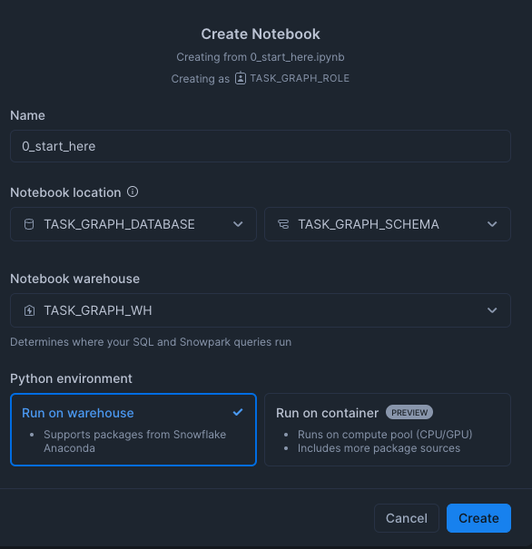

author: Charlie Hammond
id: getting-started-with-task-graphs
summary: This quickstart sets up an example Snowflake task graph to showcase its features.
categories: Getting-Started, Data-Engineering
environments: web
status: Published 
feedback link: https://github.com/Snowflake-Labs/sfguides/issues
tags: Getting Started, Data Engineering

# Getting Started with Snowflake Task Graphs
<!-- ------------------------ -->
## Overview 
Duration: 1

With [task graphs](https://docs.snowflake.com/en/user-guide/tasks-graphs) you can automatically run sequences of tasks. A task graph, or directed acyclic graph (DAG), is a series of tasks composed of a root task and child tasks, organized by their dependencies. Task graphs flow in a single direction, meaning a task later in the series cannot prompt the run of an earlier task. Each task can depend on multiple other tasks and won’t run until they all complete. Each task can also have multiple child tasks that depend on it.

This quickstart sets up an example task graph to showcase its features. 

### Prerequisites
- A Snowflake account login with a role that has the ACCOUNTADMIN role. If not, you will need to work with your ACCOUNTADMIN to perform the initial account setup 

### What You Will Learn 
- How to build and manage tasks within Snowflake

### What You’ll Need 
- A [Snowflake](https://app.snowflake.com/) Account

### What You’ll Build 
- A Snowflake Task DAG
<!-- ------------------------ -->
## Setup Your Account
Duration: 5

### Account Setup

Complete the following steps to setup your account:
- Navigate to Worksheets, click "+" in the top-right corner to create a new Worksheet, and choose "SQL Worksheet".
- Paste and the following SQL in the worksheet 
- Adjust <YOUR_USER> to your user
- Run all commands to create Snowflake objects

```sql
USE ROLE ACCOUNTADMIN;

-- Using ACCOUNTADMIN, create a new role for this exercise and grant to applicable users
CREATE OR REPLACE ROLE TASK_GRAPH_ROLE;
GRANT ROLE TASK_GRAPH_ROLE to USER <YOUR_USER>;
GRANT EXECUTE TASK ON ACCOUNT TO ROLE TASK_GRAPH_ROLE;
GRANT EXECUTE MANAGED TASK ON ACCOUNT TO ROLE TASK_GRAPH_ROLE;
GRANT IMPORTED PRIVILEGES ON DATABASE SNOWFLAKE TO ROLE TASK_GRAPH_ROLE;

-- create our virtual warehouse
CREATE OR REPLACE WAREHOUSE TASK_GRAPH_WH AUTO_SUSPEND = 60;

GRANT ALL ON WAREHOUSE TASK_GRAPH_WH TO ROLE TASK_GRAPH_ROLE;

-- Next create a new database and schema,
CREATE OR REPLACE DATABASE TASK_GRAPH_DATABASE;
CREATE OR REPLACE SCHEMA TASK_GRAPH_SCHEMA;

GRANT OWNERSHIP ON DATABASE TASK_GRAPH_DATABASE TO ROLE TASK_GRAPH_ROLE COPY CURRENT GRANTS;
GRANT OWNERSHIP ON ALL SCHEMAS IN DATABASE TASK_GRAPH_DATABASE TO ROLE TASK_GRAPH_ROLE COPY CURRENT GRANTS;
```
### Create Task DAG

- Download the notebook from this [link](https://github.com/Snowflake-Labs/sfguide-how-to-manage-features-in-dbt-with-snowflake-feature-store/blob/main/notebooks/0_start_here.ipynb)
- Change role to TASK_GRAPH_ROLE
- Navigate to Projects > Notebooks in Snowsight
- Click Import .ipynb from the + Notebook dropdown
- Create a new notebok with the following settings
  - Notebook Location: TASK_GRAPH_DATABASE, TASK_GRAPH_SCHEMA
  - Warehouse: TASK_GRAPH_WH




<!-- ------------------------ -->
## View Task Graph
Duration: 5

To streamline complex workflows in Snowflake, task graphs (or directed acyclic graphs, DAGs) enable seamless automation of task sequences. By defining dependencies between a root task and subsequent child tasks, you can ensure efficient, orderly execution from start to finish. Tasks flow in a single direction, preventing any task from triggering an earlier one and ensuring stability across the workflow. Additionally, each task in a DAG can have multiple dependencies and child tasks, giving you the flexibility to design intricate, resilient processes.

This quickstart provides a practical example of a task graph to help you understand and apply this functionality in Snowflake.

Start building your own Snowflake Task DAG today and unlock the power of automated, structured workflows in your Snowflake environment!


On the task graph, each task displays a status, such as Succeeded, Failed, Skipped, Suspended, Cancelled, or Did not run, along with a corresponding color. You can hover over the status of failed, skipped, suspended, and cancelled tasks for more information.

In addition to the task graph, you can review a table describing which tasks ran, the start time of each task, the duration of each task run, the status of each task, and a timeline representing the sequence of task runs. With the timeline, you can quickly determine why a task graph run was slow, and which long-running task might have delayed the start of a dependent task.

For each task in the table, you can select the … more menu to open the query ID for the task in a worksheet, or open the query profile.


<!-- ------------------------ -->
## Conclusion And Resources
Duration: 1

To streamline complex workflows in Snowflake, task graphs (or directed acyclic graphs, DAGs) enable seamless automation of task sequences. By defining dependencies between a root task and subsequent child tasks, you can ensure efficient, orderly execution from start to finish. Tasks flow in a single direction, preventing any task from triggering an earlier one and ensuring stability across the workflow. Additionally, each task in a DAG can have multiple dependencies and child tasks, giving you the flexibility to design intricate, resilient processes.

This quickstart provides a practical example of a task graph to help you understand and apply this functionality in Snowflake. Start building your own Snowflake Task DAG today and unlock the power of automated, structured workflows in your Snowflake environment!

### What You Learned
- How to build tasks with dependencies that build into a DAG
- How to view task history
- How to view and monitor task DAGs

### Related Resources
- [Task Graphs](https://docs.snowflake.com/en/user-guide/tasks-graphs)
- [Task History](https://docs.snowflake.com/user-guide/ui-snowsight-tasks)
