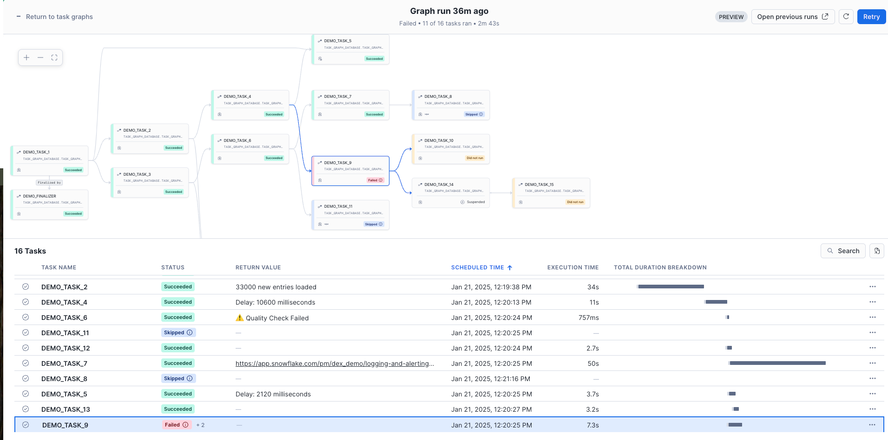

author: Charlie Hammond
id: getting-started-with-task-graphs
summary: This quickstart sets up an example Snowflake task graph to showcase its features.
categories: Getting-Started, Data-Engineering
environments: web
status: Published 
feedback link: https://github.com/Snowflake-Labs/sfguides/issues
tags: Getting Started, Data Engineering

# Getting Started with Snowflake Task Graphs
<!-- ------------------------ -->
## Overview 
Duration: 1

With [task graphs](https://docs.snowflake.com/en/user-guide/tasks-graphs) in Snowflake, you can automatically run sequences of tasks. A task graph, or directed acyclic graph, is a series of tasks composed of a root task and child tasks, organized by their dependencies. Task graphs flow in a single direction, meaning a task later in the series cannot prompt the run of an earlier task. Each task can depend on multiple other tasks and won’t run until they all complete. Each task can also have multiple child tasks that depend on it.

This quickstart sets up an example task graph to showcase its features. You will build a task graph that features a root task, a finalizer task, dependencies, tasks with various statuses, return values, conditional execution, and retry attempts.

### Prerequisites
- A Snowflake account login with a role that has the ACCOUNTADMIN role. If not, you will need to work with your ACCOUNTADMIN to perform the initial account setup 

### What You Will Learn 
- How to build and manage tasks within Snowflake

### What You’ll Need 
- A [Snowflake](https://app.snowflake.com/) Account

### What You’ll Build 
- A Snowflake Task Graph
<!-- ------------------------ -->
## Setup Your Account
Duration: 5

### Account Setup

Complete the following steps to setup your account:
- Navigate to Worksheets, click "+" in the top-right corner to create a new Worksheet, and choose "SQL Worksheet".
- Paste and the following SQL in the worksheet 
- Adjust <YOUR_USER> to your user
- Run all commands to create Snowflake objects

```sql
USE ROLE ACCOUNTADMIN;

-- Using ACCOUNTADMIN, create a new role for this exercise and grant to applicable users
CREATE OR REPLACE ROLE TASK_GRAPH_ROLE;
GRANT ROLE TASK_GRAPH_ROLE to USER <YOUR_USER>;
GRANT EXECUTE TASK ON ACCOUNT TO ROLE TASK_GRAPH_ROLE;
GRANT EXECUTE MANAGED TASK ON ACCOUNT TO ROLE TASK_GRAPH_ROLE;
GRANT IMPORTED PRIVILEGES ON DATABASE SNOWFLAKE TO ROLE TASK_GRAPH_ROLE;

-- create our virtual warehouse
CREATE OR REPLACE WAREHOUSE TASK_GRAPH_WH AUTO_SUSPEND = 60;

GRANT ALL ON WAREHOUSE TASK_GRAPH_WH TO ROLE TASK_GRAPH_ROLE;

-- Next create a new database and schema,
CREATE OR REPLACE DATABASE TASK_GRAPH_DATABASE;
CREATE OR REPLACE SCHEMA TASK_GRAPH_SCHEMA;

-- Create git integration to load our notebook
CREATE API INTEGRATION IF NOT EXISTS GITHUB_PUBLIC
API_PROVIDER = GIT_HTTPS_API
API_ALLOWED_PREFIXES = ('https://github.com/')
ENABLED = TRUE;

CREATE OR REPLACE GIT REPOSITORY SNOWFLAKE_LABS 
ORIGIN = 'https://github.com/Snowflake-Labs/getting-started-with-task-graphs' 
API_INTEGRATION = 'GITHUB_PUBLIC';

GRANT READ ON GIT REPOSITORY SNOWFLAKE_LABS TO ROLE TASK_GRAPH_ROLE;
GRANT OWNERSHIP ON DATABASE TASK_GRAPH_DATABASE TO ROLE TASK_GRAPH_ROLE COPY CURRENT GRANTS;
GRANT OWNERSHIP ON ALL SCHEMAS IN DATABASE TASK_GRAPH_DATABASE TO ROLE TASK_GRAPH_ROLE COPY CURRENT GRANTS;
```
### Create Task Graph Notebook

- Change role to TASK_GRAPH_ROLE
- Navigate to DATA > TASK_GRAPH_DATABASE > TASK_GRAPH_SCHEMA > Git Repositories > SNOWFLAKE_LABS
- From the SNOWFLAKE_LABS repository, navigate to the notebooks folder
- Create notebook `0_start_here.ipynb` by clicking the three dots > Create notebook. The database, schema, and warehouse should prepopulate. 


### Run Task Graph Notebook

- Click run all to run all of the cells in the notebook. This creates a task graph that includes the following features:
  - Root task with graph config used in other tasks and a return value
  - [Finalizer Task](https://docs.snowflake.com/en/user-guide/tasks-graphs#label-finalizer-task) that runs after all other tasks in the task graph
  - Task graph dependencies: downstream tasks depend on successful upstream tasks to run
  - Tasks with different status -- succeesful, failed, skipped
  - Tasks with return values
  - Task conditionally running on stream data (task 8)
  - Task with retry attempts (task 1)
  - Task conditionally running on returned values from upstream tasks (task 11)

<!-- ------------------------ -->
## View Task Graph
Duration: 5

To view the task graph you just created go to Data > Task Graph Database > Task Graph Schema > Tasks > Click on Demo_Task_1. From here, click Graph on the top toolbar to view the graph. From the task graph you can perform several tasks:

- View the definition and configuration of the task from the right sidebar 
- Suspend or resume Tasks by clicking the three dots in the top right
- Start a manual run of the Task Graph with the “play” button


You can also find the task graph in the Task History section of Snowsight. From Snowsight, go to Monitoring > Task History. Task history opens to Task Graph Runs which shows an overview of task graph execution along with successful and failed task metrics. Click the Task Run tab to see a full list of individual task runs containing information such as status, return value, and duration. Note that data may take 45 minutes to show after a task graph run. 


Clicking on a task run from the Task Graph Run list will take you to the associated task graph. On the task graph, each task displays a status, such as Succeeded, Failed, Skipped, Suspended, Cancelled, or Did not run, along with a corresponding color. You can hover over the status of failed, skipped, suspended, and cancelled tasks for more information.

In addition to the task graph, you can review a table describing which tasks ran, the start time of each task, the duration of each task run, the status of each task, and a timeline representing the sequence of task runs. With the timeline, you can quickly determine why a task graph run was slow, and which long-running task might have delayed the start of a dependent task.

For each task in the table, you can select the … more menu to open the query ID for the task in a worksheet, or open the query profile.



<!-- ------------------------ -->
## Conclusion And Resources
Duration: 1

To streamline complex workflows in Snowflake, task graphs enable seamless automation of task sequences. By defining dependencies between a root task and subsequent child tasks, you can ensure efficient, orderly execution from start to finish. 

This quickstart provided a practical example of a task graph to help you understand and apply this functionality in Snowflake. Start building your own Snowflake Task Graph today and unlock the power of automated, structured workflows in your Snowflake environment!

### What You Learned
- How to build tasks with dependencies that build into a task graph
- How to view task history
- How to view and monitor task graphs

### Related Resources
- [Task Graphs](https://docs.snowflake.com/en/user-guide/tasks-graphs)
- [Task History](https://docs.snowflake.com/user-guide/ui-snowsight-tasks)
