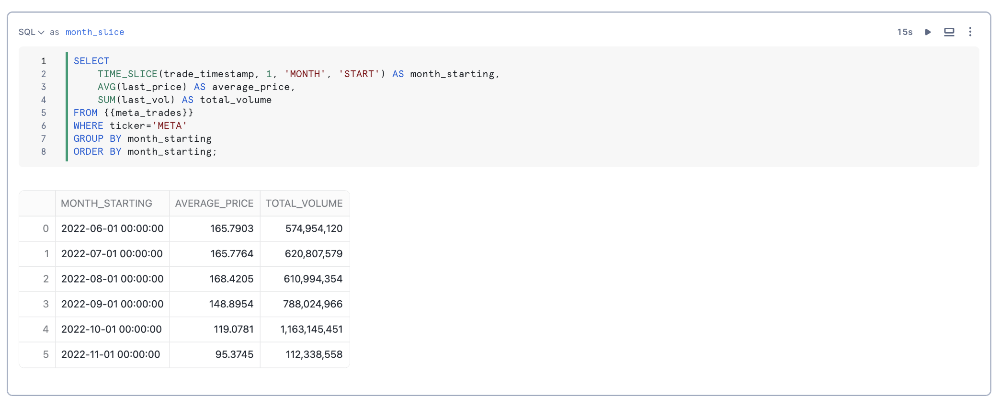
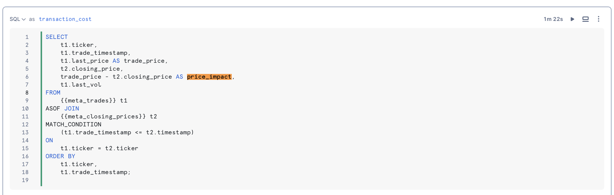
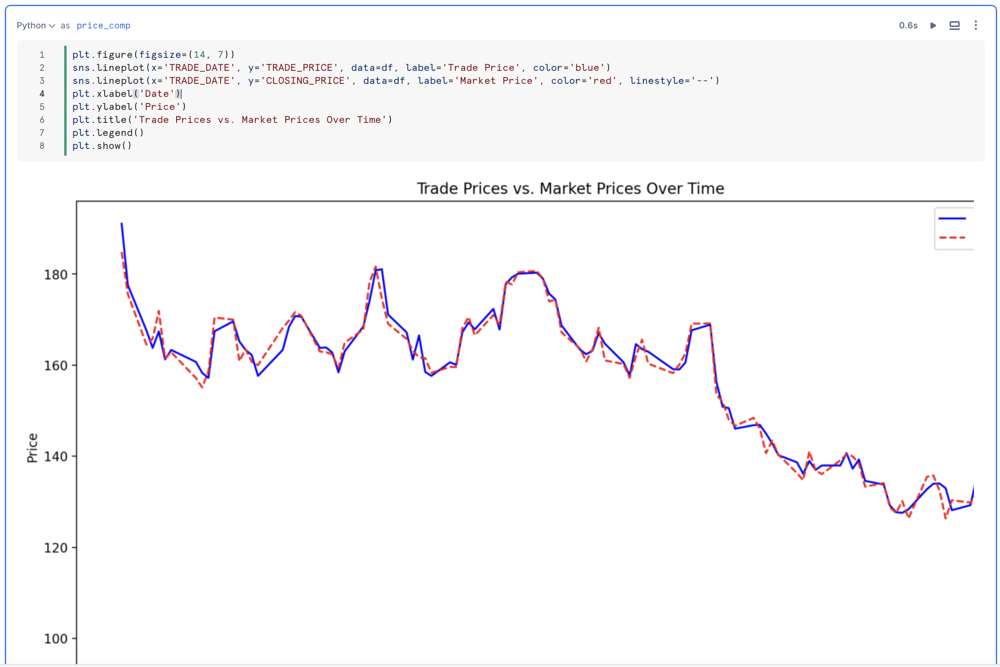
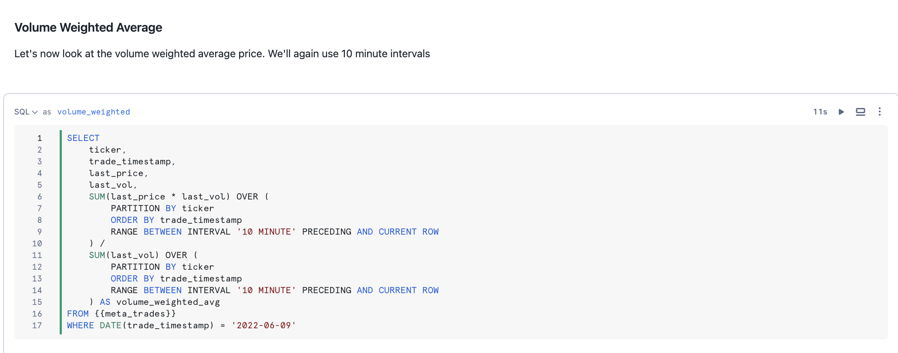
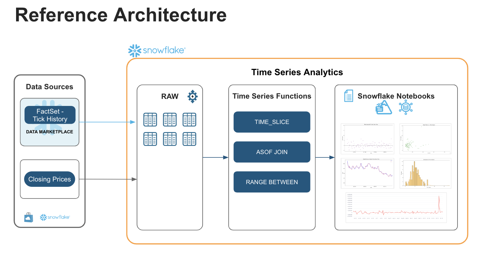
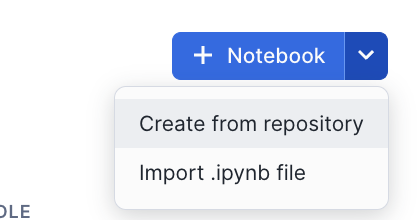
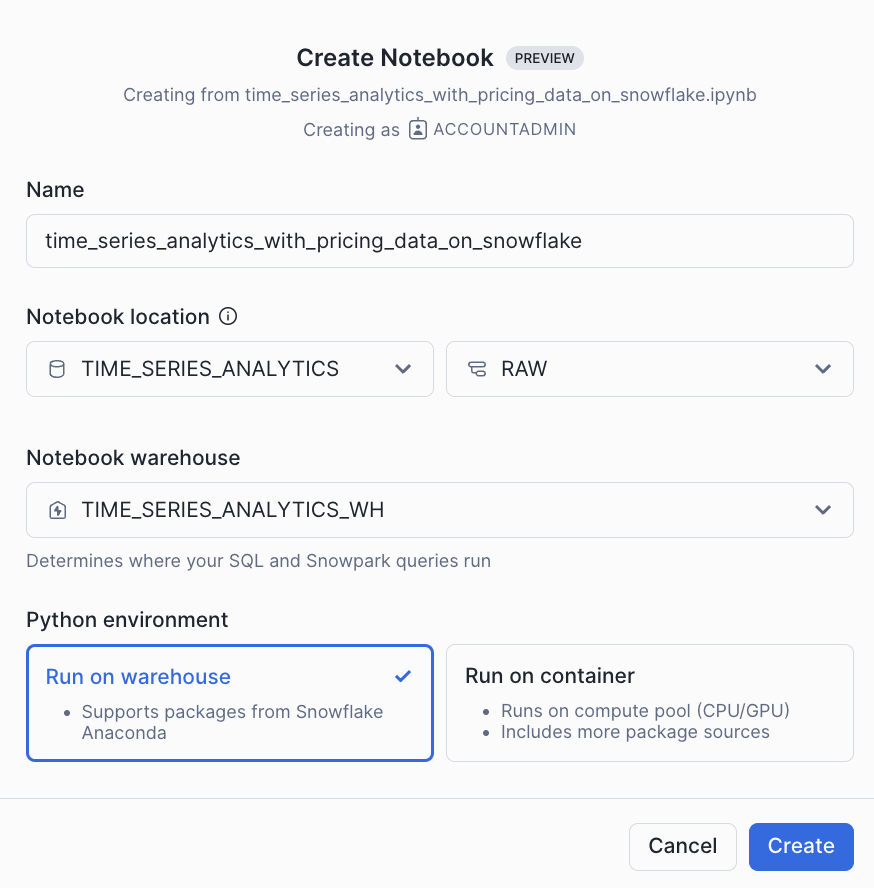
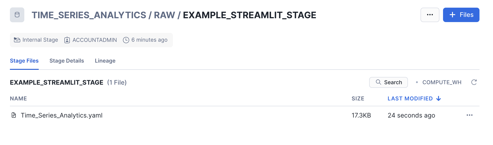
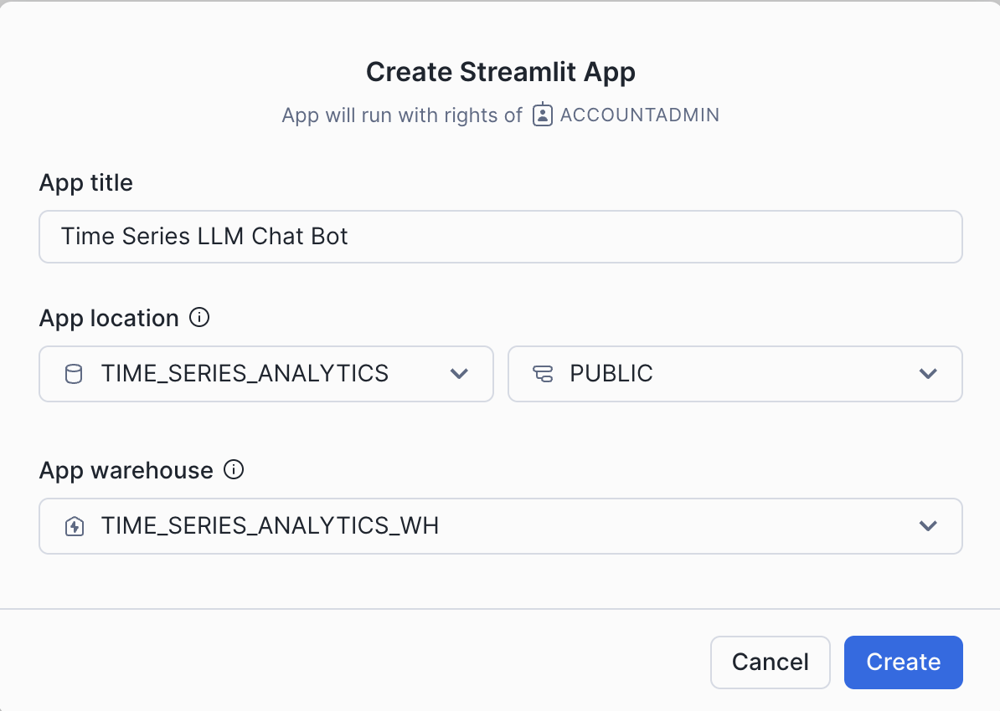
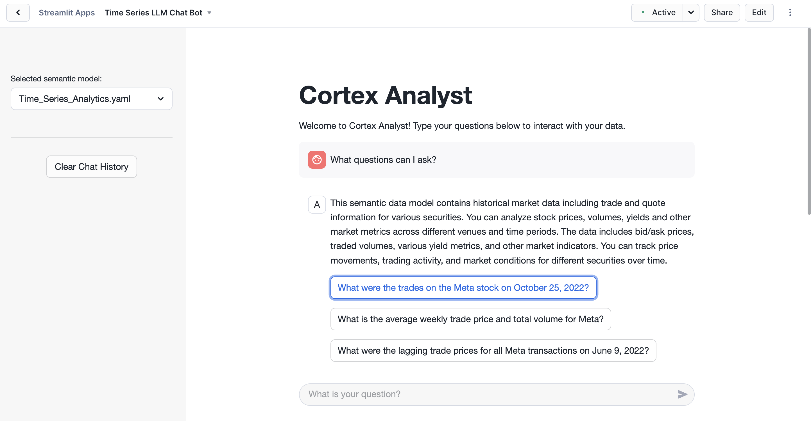

author: Swathi Jasti
id: getting-started-with-time-series-analytics-with-pricing-data-on-snowflake
categories: snowflake-site:taxonomy/solution-center/certification/quickstart, snowflake-site:taxonomy/solution-center/certification/certified-solution, snowflake-site:taxonomy/solution-center/includes/architecture, snowflake-site:taxonomy/product/analytics
language: en
summary: Getting Started with Time Series Analytics with Pricing Data on Snowflake 
environments: web
status: Published 
feedback link: https://github.com/Snowflake-Labs/sfguides/issues
fork repo link: https://github.com/Snowflake-Labs/sfguide-getting-started-with-time-series-analytics-using-sql

# Getting Started with Time Series Analytics with Pricing Data on Snowflake
<!-- ------------------------ -->
## Overview 

This quickstart explores several time series features using FactSet Tick Data, including TIME_SLICE, ASOF_JOIN, and RANGE BETWEEN for insights into trade data. Aggregating time-series data through downsampling reduces data size and storage needs, using functions like TIME_SLICE and DATE_TRUNC for efficiency. ASOF JOIN simplifies joining time-series tables, matching trades with the closest previous quote, ideal for transaction-cost analysis in financial trading. Windowed aggregate functions, such as moving averages using the RANGE BETWEEN window frame, allow trend analysis over time, accommodating data gaps for flexible rolling calculations.

### Prerequisites
- Privileges necessary to create a user, database, and warehouse in Snowflake
- Intermediate knowledge of SQL
- Access to run Notebooks in Snowflake

### What You Will Learn 
- Leveraging powerful SQL functions such as TIME_SLICE, ASOF JOIN, RANGE BETWEEN and more
- Analyzing Time Series data using Snowflake Notebooks
- Accessing data from Snowflake Marketplace

### What You’ll Need 
- A [GitHub](https://github.com/) Account 
- A [Snowflake](https://app.snowflake.com/) Account with Accountadmin access

### What You’ll Build 
- Time Series Analytics with Pricing Data on Snowflake
- Streamlit app using [Cortex Analyst](https://docs.snowflake.com/en/user-guide/snowflake-cortex/cortex-analyst)

<!-- ------------------------ -->
## Setting up the Data in Snowflake

We are using FactSet Tick History data from Snowflake Marketplace for this Quickstart. FactSet Provides historical trading information which we will analyze in this Quickstart. 

You will use [Snowsight](https://docs.snowflake.com/en/user-guide/ui-snowsight.html#), the Snowflake web interface, to:
- Create Snowflake objects (warehouse, database, schema)
- Access FactSet data from Snowflake Marketplace
- Create tables needed

### Access Data from Snowflake Marketplace

Follow below instructions to get the FactSet Tick History data from Snowflake Marketplace.
- Navigate to [Snowsight](https://app.snowflake.com/)
- Click: Data Products
- Click: Marketplace
- Search: FactSet Tick History
- Scroll Down and Click: Tick History
- Click: Get
- Make sure the Database name is: Tick_History
- Which roles, in addition to ACCOUNTADMIN, can access this database? PUBLIC
- Click: Get

### Creating Objects, Loading Data, and Joining Data

Navigate to Worksheets, click "+" in the top-right corner to create a new Worksheet, and choose "SQL Worksheet".

Run the SQL from the [file](https://github.com/Snowflake-Labs/sfguide-getting-started-with-time-series-analytics-with-pricing-data-on-snowflake/blob/main/scripts/setup.sql) in the worksheet to create Snowflake objects (database, schema, tables),

<!-- ------------------------ -->
## Time Series Analytics using Snowflake Notebooks

This quickstart demonstrates several advanced time series features using FactSet Tick Data on Snowflake. You will learn to leverage powerful SQL functions such as TIME_SLICE, ASOF JOIN, and RANGE BETWEEN to gain deeper insights into time series trade data.

### Aggregating Time-Series Data
Managing time-series data often requires aggregating fine-grained records into a summarized form, known as downsampling. This process reduces data size and storage needs, and minimizes compute resource requirements during query execution. For example, if a sensor records data every second but changes rarely, data can be aggregated to minute intervals for analysis. 

You can downsample data using the TIME_SLICE function, which groups records into fixed-width "buckets" and applies aggregate functions like SUM and AVG. Similarly, the DATE_TRUNC function reduces the granularity of date or timestamp values. 

[TIME_SLICE](https://docs.snowflake.com/en/sql-reference/functions/time_slice) calculates the beginning or end of a “slice” of time, where the length of the slice is a multiple of a standard unit of time (minute, hour, day, etc.). This function can be used to calculate the start and end times of fixed-width “buckets” into which data can be categorized.

### Joining Time-Series Data

The [ASOF JOIN](https://docs.snowflake.com/en/sql-reference/constructs/asof-join) construct simplifies joining tables with time-series data. Commonly used in financial trading analysis, ASOF JOIN enables transaction-cost analysis by matching trades with the closest previous quote. This method is beneficial for analyzing historical data, especially when timestamps from different devices are not perfectly aligned. We will determine transaction costs by joining trades with the closest preceding price data using an ASOF JOIN.

### Using Windowed Aggregations
Windowed aggregate functions allow you to analyze trends over time by computing rolling calculations (such as moving averages) within defined subsets of a dataset. The [RANGE BETWEEN](https://docs.snowflake.com/en/sql-reference/functions-analytic) window frame, ordered by timestamps or numbers, remains unaffected by gaps in the data, providing flexible rolling aggregations. A range-based window frame consists of a logically computed set of rows rather than a physical number of rows as would be expressed in a row-based frame. In this solution you will explore RANGE BETWEEN to create interesting time series metrics on our data.

### Architecture
This solution harnesses the power of Snowflake to extract valuable insights from high-frequency financial data. By utilizing FactSet Tick Data, available on the Snowflake Marketplace, we've constructed a robust data foundation. Synthetic closing prices, derived from the tick history, are stored in the closing_prices table within the raw schema.

Snowflake Notebooks serve as our interactive workspace for exploring time series data. Through the skillful application of advanced SQL functions like TIME_SLICE, ASOF JOIN, and RANGE BETWEEN, we demonstrate how to:

- Calculate prevailing prices.
- Track trading performance using TIME_SLICE
- Analyze transaction costs using ASOF JOIN
- Identify trends using RANGE-based sliding window
- Measure volatility using LEAD & LAG

### Snowflake Notebook
Import the following Snowflake Notebook in Snowsight and run each of the cells: [0_start_here.ipynb](https://github.com/Snowflake-Labs/sfguide-getting-started-with-time-series-analytics-with-pricing-data-on-snowflake/blob/main/notebooks/0_start_here.ipynb)

<!-- ------------------------ -->
## Streamlit App Using Cortex Analyst

Cortex Analyst is a fully-managed, LLM-powered Snowflake Cortex feature that helps you create applications capable of reliably answering business questions based on your structured data in Snowflake. With Cortex Analyst, business users can ask questions in natural language and receive direct answers without writing SQL. Available as a convenient REST API, Cortex Analyst can be seamlessly integrated into any application.

In this step, you will build a Streamlit application leveraging Cortex Analyst to allow business users to query TICK_HISTORY data using natural language. 

### Setup
- Upload the semantic model to `EXAMPLE_STREAMLIT_STAGE`
    - Download the semantic model [here](https://github.com/Snowflake-Labs/sfguide-getting-started-with-time-series-analytics-with-pricing-data-on-snowflake/blob/main/streamlit/Time_Series_Analytics.yaml)
    - Navigate to Data > Databases > TIME_SERIES_ANALYTICS > RAW > EXAMPLE_STREAMLIT_STAGE
    - Click + File and upload `Time_Series_Analytics.yaml`

- Create Streamlit App
    - Navigate to Projects > Streamlit > Click + Streamlit
    - Select TIME_SERIES_ANALYTICS database, RAW schema, and TIME_SERIES_ANALYTICS_WH warehouse

    - Copy and paste the [Streamlit code](https://github.com/Snowflake-Labs/sfguide-getting-started-with-time-series-analytics-with-pricing-data-on-snowflake/blob/main/streamlit/time_series_cortex_analyst.py) into the editor

### Run the App

Ask one of the preconfigured questions or any other question! Cortex Analyst uses the semantic model and LLMs to translate natural language into SQL to explore the data. 

<!-- ------------------------ -->
## Conclusion And Resources

**You did it!** You have successfully completed the Time Series Analytics with Pricing Data on Snowflake Quickstart.

### What you learned
- Leveraged powerful SQL functions such as TIME_SLICE, ASOF JOIN, RANGE BETWEEN and more
- Analyzed Time Series data using Snowflake Notebooks
- Accessed data from Snowflake Marketplace

### Related Resources
- [Source Code on GitHub](https://github.com/Snowflake-Labs/sfguide-getting-started-with-time-series-analytics-with-pricing-data-on-snowflake)
- [Analyzing time-series data on Snowflake](https://docs.snowflake.com/en/user-guide/querying-time-series-data)
- [TIME_SLICE](https://docs.snowflake.com/en/sql-reference/functions/time_slice)
- [ASOF JOIN](https://docs.snowflake.com/en/sql-reference/constructs/asof-join)
- [RANGE BETWEEN](https://docs.snowflake.com/en/sql-reference/functions-analytic)
- [DOWNLOAD REFERENCE ARCHITECTURE](/content/dam/snowflake-site/developers/2024/09/Time_Series_Analytics_Solution_Architecture.png)
- [READ THE BLOG](/en/blog/time-series-analytics-asof-join-generally-available/)
- [WATCH THE DEMO](https://youtu.be/kJN80yR9fn0?list=TLGGuatxmhLPH_wyNTA5MjAyNQ)
