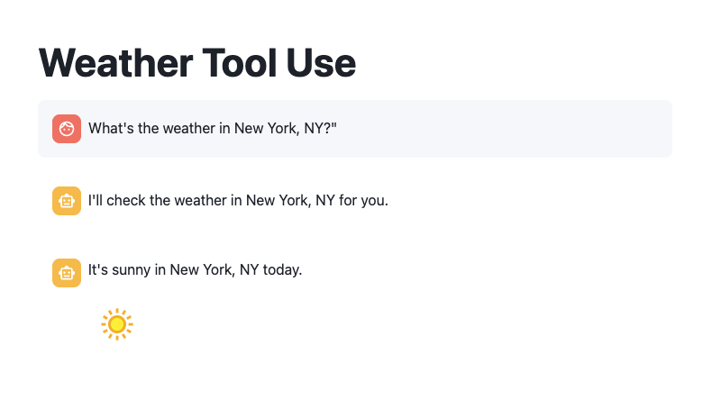
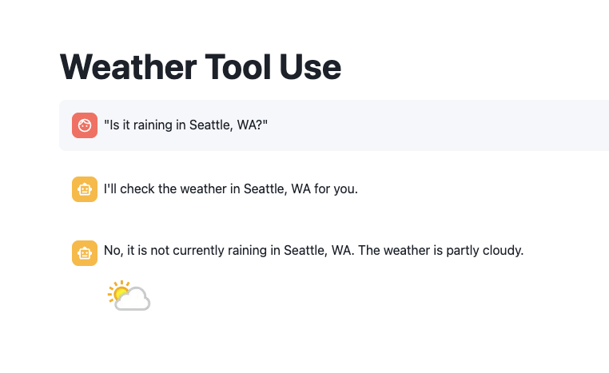
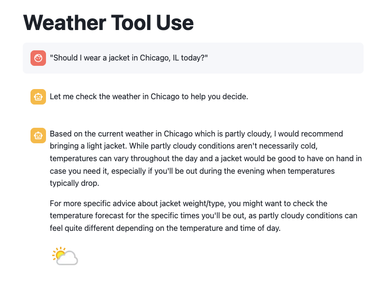

author: James Cha-Earley
id: getting-started-with-tool-use-on-cortex-and-anthropic-claude
categories: snowflake-site:taxonomy/solution-center/certification/quickstart, snowflake-site:taxonomy/product/ai, snowflake-site:taxonomy/snowflake-feature/external-collaboration, snowflake-site:taxonomy/snowflake-feature/ml-functions
language: en
summary: This guide demonstrates how Snowflake Cortex integrates with Claude to enable external API interactions through tools. 
environments: web
status: Published 
feedback link: https://github.com/Snowflake-Labs/sfguides/issues


# Getting Started with Tool Use on Cortex and Anthropic Claude

## Overview

In this quickstart, you'll learn how to leverage Snowflake Cortex's AI capabilities to create an intelligent weather assistant with tool use functionality. This guide demonstrates how Snowflake Cortex integrates with Claude to enable external API interactions, allowing you to define tools, process tool requests, and format tool results to create a seamless conversational experience powered by Snowflake's AI infrastructure.

### What You Will Build
- An AI application in Snowflake that demonstrates Claude's tool use capabilities
- A weather information tool for US locations that Claude can invoke when users ask weather-related questions
- A system that enables Claude to access external data through API calls
- A conversational interface that showcases AI-to-API interaction patterns

### What You Will Learn
- How to define tools for Claude to use within Snowflake
- How to structure tool specifications with proper input schemas
- How to handle tool execution and pass results back to Claude
- How to configure Snowflake for secure external API access
- How to implement the complete tool use lifecycle from request to response

### Prerequisites
- A [Snowflake account](https://signup.snowflake.com/?utm_source=snowflake-devrel&utm_medium=developer-guides&utm_cta=developer-guides)
- A [WeatherAPI account](https://www.weatherapi.com/signup.aspx) and API key
- Account must have these features enabled:
  - [Streamlit in Snowflake](https://docs.snowflake.com/en/developer-guide/streamlit/about-streamlit)
  - [Cortex LLM Functions](https://docs.snowflake.com/en/sql-reference/functions/complete-snowflake-cortex?_fsi=LnJgA8TM&_fsi=LnJgA8TM)
  - In a supported [Region](https://docs.snowflake.com/en/user-guide/snowflake-cortex/llm-functions#availability)

## Setup Environment

### Set Up Required Database Objects and External Access

To prepare your Snowflake environment, you'll need to create the necessary database objects, establish roles with appropriate permissions, and configure external network access for the WeatherAPI service.

1. Open a new worksheet in Snowflake
2. Create the necessary database objects, warehouse, and network rules by executing the following SQL commands from [setup.sql](https://github.com/Snowflake-Labs/sfguide-getting-started-with-tools-use-on-cortex-and-anthropic/blob/main/setup.sql):

> Replace **YOUR USER** with your Snowflake username.

### Set Up API Access

For this application to work, you'll need to:
1. Obtain a WeatherAPI key by signing up at [WeatherAPI.com](https://www.weatherapi.com/)
2. Keep your API key handy for insertion into the application code

## Streamlit App

### Setting Up the Streamlit App

To create and configure your Streamlit application in Snowflake:

1. Navigate to Streamlit in Snowflake:
   * Click on the **Streamlit** tab in the left navigation pane
   * Click on **+ Streamlit App** button in the top right

2. Configure App Settings:
   * Enter a name for your app (e.g., "Weather Assistant")
   * Select **ANTHROPIC_TOOL_USE_WH_XS** as your warehouse
   * Choose **ANTHROPIC_TOOL_USE_DB** as your database and **TOOL_SCHEMA** as your schema

3. Create the app:
   * In the editor, paste the complete code provided below

### Complete Application Code

You will need add a package. On the top left select **Packages**.
* Add **requests** package

Below is the full code for the Weather Assistant application.
Copy the Streamlit app from [streamlit.py](https://github.com/Snowflake-Labs/sfguide-getting-started-with-tools-use-on-cortex-and-anthropic/blob/main/streamlit.py)

* Enable the External Access
    * On the top right click on three dots 
        * App Settings 
            * External networks
                *  WEATHERAPI_ACCESS_INTEGRATION
* Click "Run" to launch your application


## Understanding Tool Use

This section explains how the weather assistant application implements Claude's tool use capabilities in Snowflake.

### Claude API and Tool Use Components

The Claude API in Snowflake uses several key structures for tool functionality:

1. **Tool Specification**:
   - A JSON object that defines what the tool does and how to use it
   - Contains a unique name, description, and JSON schema for inputs
   - Defines required parameters and their data types

2. **ToolChoice**:
   - Controls if tool use is automatic, required, or specific
   - Our application uses "auto" mode with the weather tool suggested

3. **ToolUse**:
   - Represents Claude's request to use a tool
   - Contains a unique `tool_use_id` for tracking
   - Includes structured inputs matching the tool's schema

4. **ToolResults**:
   - Returns data from tool execution back to Claude
   - Must reference the original `tool_use_id`
   - Contains the output content for Claude to incorporate

5. **Content Types**:
   - TextContent: Plain text responses
   - JSONContent: Structured data for complex information

The application demonstrates a complete end-to-end implementation with these components.

## Implementing the Weather Tool

The heart of our tool use implementation is the `get_weather` function, which executes when Claude invokes the weather tool and communicates with the WeatherAPI service:

```python
def get_weather(location):
    try:
        apiKey = 'YOUR_API_KEY_HERE';
        url = f'https://api.weatherapi.com/v1/current.json?key={apiKey}&q={location}';

        headers = {
            "Content-Type": "application/json"
        }
        response = re.get(url, headers=headers);
        weatherData = response.json();
        response.raise_for_status()
        current_weather = weatherData.get('current')
        condition = current_weather.get('condition')
        text = condition.get('text')
        icon = condition.get('icon')
        return text, icon
        
    except re.exceptions.HTTPError as err:
        st.error(f"HTTP error occurred: {err}")
    except Exception as e:
        st.error(f"Error to get weather: {e}")
    return "We were not able to get the weather.", ""
```

This function:
1. Takes a location string (e.g., "San Francisco, CA")
2. Makes an API request to WeatherAPI
3. Parses the response to extract weather conditions and icon URL
4. Returns this information or an error message if something goes wrong

## Defining Tool Specification

Next, we'll set up the tool specification and Claude integration through Snowflake's API. This is where we define what the weather tool does and how Claude should use it:

```python
def call_snowflake_claude():
    """
    Make an API call to Snowflake's Claude integration.
    
    Args:
        user_message (str): The message to send to Claude
        location (str): The location to get weather for
    
    Returns:
        The response from the API
    """
    text = ""
    tool_name = None
    tool_use_id = None
    tool_input = ""
    tool_input_json = None
    
    payload = {
        "model": "claude-4-sonnet",
        "messages": messages,
        "tool_choice": {
            "type": "auto",
            "name": [
                "get_weather"
            ]
        },
        "tools": [
            {
                "tool_spec": {
                    "type": "generic",
                    "name": "get_weather",
                    "description": "Given a location return the weather",
                    "input_schema": {
                        "type": "object",
                        "properties": {
                            "location": {
                                "type": "string",
                                "description": "The city and state, e.g. in San Francisco, CA"
                            }
                        },
                        "required": [
                            "location"
                        ]
                    }
                }
            }
        ]
    }

    try:
        resp = _snowflake.send_snow_api_request(
            "POST",  # method
            API_ENDPOINT,  # path
            {},  # headers
            {},  # params
            payload,  # body
            None,  # request_guid
            API_TIMEOUT,  # timeout in milliseconds,
        )
        # Response processing code...
            
        return text, tool_use_id, tool_name, tool_input_json
            
    except Exception as e:
        st.error(f"Error making request: {str(e)}")
        return None
```

### Anatomy of a Tool Specification

Let's break down the key elements of the tool definition:

1. **Model Selection**:
   ```python
   "model": "claude-4-sonnet"
   ```
   Specifies which Claude model to use. Claude 3.7 Sonnet provides excellent tool use capabilities.

2. **Tool Choice Configuration**:
   ```python
   "tool_choice": {
       "type": "auto",
       "name": ["get_weather"]
   }
   ```
   - `"type": "auto"` - Let Claude decide when to use the tool. This is the most flexible option where Claude will determine if a query is appropriate for the tool.
   - `"name": ["get_weather"]` - Suggests the specific tool when appropriate.
   
   Other options for the `type` field include:
   - `"type": "required"` - Forces Claude to use at least one of the provided tools. Use this when you want to ensure tool use happens, regardless of Claude's judgment.
   - `"type": "tool"` - Specifies exactly which tool(s) Claude should use, requiring use of one of the tools specified in the `name` array. This gives you the most control over which tool is selected.
   - `"type": "none"` - Explicitly prevents Claude from using any tools, even if they're provided in the request.
   
   These options allow fine-grained control over Claude's tool-use behavior, from completely automatic to strictly directed.

3. **Tool Specification Structure**:
   ```python
   "tool_spec": {
       "type": "generic",
       "name": "get_weather",
       "description": "Given a location return the weather",
       "input_schema": {
           "type": "object",
           "properties": {
               "location": {
                   "type": "string",
                   "description": "The city and state, e.g. in San Francisco, CA"
               }
           },
           "required": ["location"]
       }
   }
   ```
   - `"type": "generic"` - Standard tool interface
   - `"name"` - Unique identifier for the tool
   - `"description"` - Helps Claude understand when to use this tool
   - `"input_schema"` - Defines the expected parameters using JSON Schema

4. **Response Processing Logic**:
   ```python
   for response in response_content:
       data = response.get('data', {})
       for choice in data.get('choices', []):
           delta = choice.get('delta', {})
           content_list = delta.get('content_list', [])
           for content in content_list:
               content_type = content.get('type')
               if content_type == 'text':
                   text += content.get('text', '')
               if content_type is None:
                   if content.get('tool_use_id'):
                       tool_name = content.get('name')
                       tool_use_id = content.get('tool_use_id')
                   tool_input += content.get('input', '')
   ```
   This code parses Claude's response, handling both regular text responses and tool use requests.

This function:
1. Prepares a request payload with:
   - Claude model specification
   - Current conversation messages
   - Tool specifications with input schema for the weather tool
2. Uses the `tool_choice` parameter to suggest when Claude should use the tool
3. Sends the request to Snowflake's Claude API endpoint
4. Processes the response to extract:
   - The regular text response
   - The tool use ID for tracking tool invocations
   - The tool name being called
   - The structured input parameters Claude wants to send to the tool
5. Returns these elements for the tool execution phase

## Executing the Tool

The most critical part of the tool use workflow is executing the tool when Claude requests it and properly formatting the results for Claude to incorporate into its response:

```python
if tool_name == 'get_weather':
    with st.spinner(f'Utilizing {tool_name} Tool..'):
        location = tool_input_json.get('location')
        if location:
            weather, icon = get_weather(location)
            messages.append(
                {
                    'role': 'user',
                    'content' : query,
                    'content_list': [
                        {
                            'type': 'tool_results',
                            'tool_results' : {
                                'tool_use_id' : tool_use_id,
                                'name': tool_name,
                                'content' : [
                                    {
                                        'type': 'text',
                                        'text': weather
                                    }
                                ]
                            } 
                        }
                    ]
                }
            )
            text, tool_use_id, tool_name, tool_input_json = call_snowflake_claude()
            with st.chat_message("assistant"):
                st.markdown(text)
                st.image(icon.replace('//','https://'))
                st.session_state.messages.append({"role": "assistant", "content": text})
```

### Anatomy of the Tool Results Structure

Let's break down the key elements of returning tool results to Claude:

1. **Execution Trigger**:
   ```python
   if tool_name == 'get_weather':
   ```
   Detects when Claude has requested the weather tool.

2. **Parameter Extraction**:
   ```python
   location = tool_input_json.get('location')
   ```
   Gets the structured parameter from Claude's tool use request.

3. **Tool Results Format**:
   ```python
   messages.append(
       {
           'role': 'user',
           'content': query,
           'content_list': [
               {
                   'type': 'tool_results',
                   'tool_results': {
                       'tool_use_id': tool_use_id,
                       'name': tool_name,
                       'content': [
                           {
                               'type': 'text',
                               'text': weather
                           }
                       ]
                   }
               }
           ]
       }
   )
   ```

   This structure is critical for Claude to process tool results correctly:
   
   - `'type': 'tool_results'` - Indicates this is a tool result response
   - `'tool_use_id': tool_use_id` - Must match the ID from Claude's request
   - `'name': tool_name` - Identifies which tool was executed
   - `'content'` - Array of content elements (text, JSON, etc.)

4. **Second API Call**:
   ```python
   text, tool_use_id, tool_name, tool_input_json = call_snowflake_claude()
   ```
   
   Sends the tool results back to Claude so it can incorporate the information into its response.

5. **Result Visualization**:
   ```python
   with st.chat_message("assistant"):
       st.markdown(text)
       st.image(icon.replace('//','https://'))
   ```
   
   Displays both the textual response and weather icon in the Streamlit interface.

This code demonstrates the complete tool use cycle:
1. Detects when Claude has requested tool use by checking the `tool_name`
2. Extracts the structured location parameter from Claude's tool use request
3. Executes the actual tool functionality by calling the weather API
4. Formats the results in the specific `tool_results` format Claude expects
5. Includes the original `tool_use_id` to maintain continuity between request and response
6. Makes a second call to Claude with the tool results so it can incorporate the information
7. Displays Claude's final response with the weather information and visualization

This implements the full tool use lifecycle where Claude requests information, the application fetches it, and Claude then incorporates the results into its final response.

## Testing

To ensure your application works correctly:

**Test with simple weather queries**: 
* What's the weather in New York, NY?
  
* Is it raining in Seattle, WA?
  
* Should I wear a jacket in Chicago, IL today?
  


## Conclusion and Resources

### Conclusion
Congratulations! You've built a powerful weather assistant application that combines the capabilities of Snowflake Cortex and Claude Sonnet 3.5 with real-time weather data. The tool use capabilities showcase how AI can interact with external services to provide valuable information to users in a conversational manner.

### What You Learned
- How to define tools for Claude to use within Snowflake
- How to structure tool specifications with proper input schemas
- How to implement the complete tool use lifecycle in Snowflake applications
- How to structure tool use requests and responses with correct formatting
- How to set up secure external API access for AI tools in Snowflake
- How to coordinate between Claude's requests, external API calls, and final responses
- How to build a multi-turn conversation flow with tool use capabilities

### Resources
Documentation:
- [Snowflake Documentation](https://docs.snowflake.com/)
- [Streamlit in Snowflake Guide](https://docs.snowflake.com/en/developer-guide/streamlit/about-streamlit)
- [External Network Access](https://docs.snowflake.com/en/developer-guide/external-network-access/external-network-access-overview)

Sample Code & Resources:
- [Snowflake Developer Resources](https://developers.snowflake.com/)
- [Snowflake Quickstarts](/en/developers/guides/)
- [Getting Started with Anthropic on Snowflake Cortex](/en/developers/guides/getting-started-with-anthropic-on-snowflake-cortex/)
