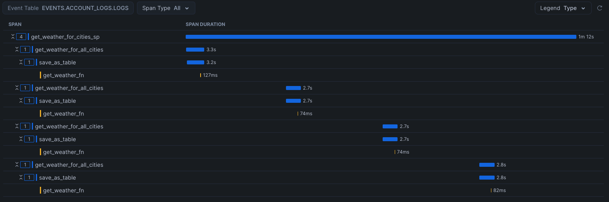

author: Brad Culberson
id: getting-started-with-traces
categories: snowflake-site:taxonomy/solution-center/certification/quickstart, snowflake-site:taxonomy/product/applications-and-collaboration
language: en
summary: Getting Started with Traces 
environments: web
status: Published 
feedback link: https://github.com/Snowflake-Labs/sfguides/issues

# Getting Started with Traces
<!-- ------------------------ -->
## Overview 

This guide will introduce you to Logs, Traces, and Metrics in Snowflake which can be used to optimize performance and find errors in UDFs and stored procedures.

This guide will use REST APIs from OpenWeather to showcase the fetch weather data as part of a pipeline.

### Prerequisites

- Familiarity with Python and SQL

### What you will Learn

* How to create a Notebook which incorporates Python and SQL cells
* How to build a Python UDF which pulls data from an external API
* How to create a procedure which will populates the bronze level data
* How to trace performance of the procedure and UDF
* How to get memory and cpu information from the procedure execution

### What you will Need

* Snowflake account with
 + Access to create a Database
 + Access to create an Integration
 + Account has accepted [external offering terms](https://docs.snowflake.com/en/developer-guide/udf/python/udf-python-packages#getting-started)
* Free API key from [OpenWeather](https://openweathermap.org/) (The steps to get an API key are covered later in this quickstart)

### What you will Build 

* A Notebook that can pull weather data into a bronze layer, as part of a [Medallion Architecture](https://dataengineering.wiki/Concepts/Medallion+Architecture)

<!-- ------------------------ -->
## Creating the Notebook

Login to Snowsight using your credentials in Snowflake.

You'll need a Database, Schema, and Warehouse to get started with the notebook.

Run the following SQL (in a worksheet) to create the warehouse, database, and schema with tracing on:

```sql
CREATE OR REPLACE WAREHOUSE TRACING_QUICKSTART_WH WAREHOUSE_SIZE=XSMALL, INITIALLY_SUSPENDED=TRUE;
CREATE OR REPLACE DATABASE TRACING_QUICKSTART;
CREATE OR REPLACE SCHEMA DATA;

ALTER DATABASE TRACING_QUICKSTART SET TRACE_LEVEL = ALWAYS;
ALTER SCHEMA DATA SET TRACE_LEVEL = ALWAYS;

```

Go to Projects > Notebooks in the left navigation. Click the + Notebook to create a new Notebook. Name the Notebook `TRACING_QUICKSTART` and Select the `TRACING_QUICKSTART` database and the `DATA` schema you created. Select the `TRACING_QUICKSTART_WH` that was just created, leave the default Run on warehouse selected and click Create.

<!-- ------------------------ -->
## Setup

The first notebook cell will be used to setup the notebook. These variables will be used in subsequent cells using the `{{variable_name}}` syntax in SQL cells, and by using the variable names in Python cells.

Paste this code into the first cell. If you'd like to pull data for other cities, edit the city_list.

```python
import streamlit as st

from snowflake.snowpark.context import get_active_session
session = get_active_session()

user_name = session.sql("SELECT current_user()").collect()[0][0]
schema_name = "DATA"
database_name = "TRACING_QUICKSTART"
event_table = session.sql("SHOW PARAMETERS LIKE 'event_table' IN ACCOUNT").collect()[0][2]

city_list = [(37.485318, -122.176482, 'Menlo Park'), (52.3368551, 4.8694973, 'Amsterdam'),(52.5100227, 13.3776724, 'Berlin'), (52.2299305,20.9764142, 'Warsaw'), (18.5645333,73.911966, 'Pune')]

api_key = st.text_input("Enter API key for openweathermap")
if api_key == "":
    raise Exception("Configuration needed")

```

When running this cell, it will prompt for entering an API key. This was done with the streamlit `text_input` widget. 

To get a free API key, sign up for an account on [OpenWeather](https://home.openweathermap.org/users/sign_up).

After signing up, add a new API key by going to [API keys](https://home.openweathermap.org/api_keys). Create a new key with name `snowflake_key` and click Generate, copy the API key to the clipboard.

After generating the key, go back to the Snowsight notebook and paste the key generated in the dialog and hit enter.

<!-- ------------------------ -->
## Confgure External API Access

In the second notebook cell you will configure a network rule, secret, and external access integration to allow outbound connectivity to the OpenWeather API. This is necessary because the Python Notebook is secure by default and does not allow network access. A stage is also created to store the permanent UDF and procedure. "Permanent" means that the UDF and stored procedure will be stored in the database so that they can be called from outside the Notebook in the future, such as from a SQL query.

Paste this code into the second cell, variables are automatically pulled in from the previous cell so no editing is needed.

```sql
USE DATABASE "{{database_name}}";
USE SCHEMA "{{schema_name}}";

CREATE OR REPLACE NETWORK RULE OPENWEATHERMAP_API_NETWORK_RULE
  MODE = EGRESS
  TYPE = HOST_PORT
  VALUE_LIST = ('api.openweathermap.org');

CREATE OR REPLACE SECRET OPENWEATHERMAP_API_KEY
    TYPE = GENERIC_STRING
    SECRET_STRING = "{{api_key}}";

CREATE OR REPLACE EXTERNAL ACCESS INTEGRATION OPENWEATHERMAP_ACCESS_INTEGRATION
  ALLOWED_NETWORK_RULES = (OPENWEATHERMAP_API_NETWORK_RULE)
  ALLOWED_AUTHENTICATION_SECRETS = (OPENWEATHERMAP_API_KEY)
  ENABLED = true;

CREATE STAGE IF NOT EXISTS EXEC_STORAGE;

```

Run this cell and verify it is successful.

<!-- ------------------------ -->
## Enabling Logging and Metrics

In order to get logs and metrics, levels need to be modified. This can easily be done in SQL.

Change the third notebook cell to SQL and paste this section into the body.

```sql
ALTER DATABASE "{{database_name}}" SET LOG_LEVEL = DEBUG;
ALTER SCHEMA "{{schema_name}}" SET LOG_LEVEL = DEBUG;

ALTER DATABASE "{{database_name}}" SET METRIC_LEVEL = ALL;
ALTER SCHEMA "{{schema_name}}" SET METRIC_LEVEL = ALL;

ALTER SESSION SET METRIC_LEVEL = ALL;

```

Run this cell and verify it is successful.

<!-- ------------------------ -->
## Create the UDF

A UDF will use the External Access and Secret created previously and pull data from the OpenWeather API using Python Requests library. It will pull the current weather for a specific latitude and longitude.

In order to populate the bronze layer, a stored procedure will call the UDF for every city in the city_list to get the current weather. This is done with a dataframe and will append the data to a table for usage in the future.

When calling to a 3rd party API like this, it is important to know the performance and potential errors coming from those calls. To trace this information, the function uses a custom span in OpenTelemetry. Review the tracer variable and how that is used. Without the custom span, it would be difficult to know which calls were erroring out to the API and what status code the API was returning.

The function will be stored in the database schema and can be used in the future from SQL or Python, as we will do in the next cell.

Create a new Python cell at the bottom of the notebook by clicking on + Python.

Paste this section into the new cell.

```python
import _snowflake
import requests
import json
import logging


rsession = requests.Session()
def get_weather(lat, lon):
  """
  A UDF handler. Given a latitude and longitude, this UDF will use external network access to get the 
  weather for that area from the OpenWeatherMap API.
  """
  api_key = _snowflake.get_generic_secret_string('api_key')
  url = f"https://api.openweathermap.org/data/2.5/weather?lat={lat}&lon={lon}&exclude=hourly,daily&appid={api_key}"
  response = rsession.get(url)
  logging.debug(f"Body from API: {response.text} in get_weather")
  if response.status_code != 200:
    logging.warn(f"Unexpected response from API: {response.status_code} in get_weather")
  return response.json()

# Register the UDF
from snowflake.snowpark.context import get_active_session
from snowflake.snowpark.types import VariantType, FloatType, IntegerType, StringType
session = get_active_session()

get_weather_fn = session.udf.register(get_weather,
                                   return_type=VariantType(),
                                   input_types=[FloatType(),FloatType()],
                                   name="get_weather_fn",
                                   replace=True,
                                   is_permanent=True,
                                   stage_location="EXEC_STORAGE",
                                   secrets={'api_key':'OPENWEATHERMAP_API_KEY'},
                                   external_access_integrations=["OPENWEATHERMAP_ACCESS_INTEGRATION"],
                                   packages=["snowflake-snowpark-python", "requests", "snowflake-telemetry-python"])

```

Run this cell and verify it is successful.

<!-- ------------------------ -->
## Test the UDF

Now that the UDF is stored in the database, it can easily be tested using SQL.

Create a new SQL cell at the bottom of the notebook by clicking on + SQL.

Paste this section into the new cell.

```sql
SELECT GET_WEATHER_FN(45.6783036,-111.0347646)

```

Run this cell and verify it is successful, it will return the current weather in Bozeman, MT.

<!-- ------------------------ -->
## Create the Procedure

A procedure will be used to pull the weather for all the cities in the city_list.

This python procedure needs the opentelemetry package. To add the package to the Notebook, click on Packages at the top. Under Anaconda Packages, add opentelemetry-api. Adding this package will take a minute as the package is downloaded and added to the running Notebook environment.

Create a new Python cell at the bottom of the notebook by clicking on + Python.

```python
import datetime 
import time
import snowflake.snowpark

from opentelemetry import trace
from snowflake.snowpark.functions import sproc


def get_weather_for_cities(session, to_table, minutes_to_run, seconds_to_wait):
    """
    A stored procedure handler that reads from the city_list table and calls the UDF to add the wather
    data as a new column
    """
    df = session.table("city_list")
    stop_time = datetime.datetime.utcnow() + datetime.timedelta(minutes = minutes_to_run)
    tracer = trace.get_tracer(__name__)
    while datetime.datetime.utcnow() < stop_time:
        with tracer.start_as_current_span(f"get_weather_for_all_cities") as p:
            pdf = df.select(get_weather_fn("lat", "lon").alias("current_weather"), "name")
            pdf.write.mode("append").save_as_table(to_table)
        time.sleep(seconds_to_wait)
    return "OK"

# Store the city_list for use in the procedure
df = session.create_dataframe(city_list).to_df("lat","lon","name")
df.write.mode("overwrite").save_as_table("city_list")

# Register the stored procedure
get_weather_for_cities_sp = session.sproc.register(get_weather_for_cities, 
                                                   name="get_weather_for_cities_sp",
                                                   return_type=StringType(),
                                                   input_types=[StringType(),IntegerType(),IntegerType()],
                                                   is_permanent=True,
                                                   replace=True,
                                                   packages=["snowflake-snowpark-python", "requests", "snowflake-telemetry-python", "opentelemetry-api"],
                                                   stage_location="EXEC_STORAGE")

```

Run this cell and verify it is successful, it will return the current weather in Bozeman, MT.

<!-- ------------------------ -->
## Run the Procedure

Create a new Python cell at the bottom of the notebook by clicking on + Python.

```python
from snowflake.snowpark.context import get_active_session

session = get_active_session()
session.sql("call get_weather_for_cities_sp('bronze_weather_api', 1, 15)").collect()
session.table("bronze_weather_api")

```

Verify it is successful. After running, the notebook will output the dataframe of bronze_weather_api which includes the current weather for all the cities in city_list.

<!-- ------------------------ -->
## Query the Data Ingested

Create a new SQL cell by clicking on + SQL.

Paste this section into the new cell.

```sql
SELECT NAME, 
       CURRENT_WEATHER['main']['temp']::float as KELVIN_TEMP, 
       CURRENT_WEATHER['weather'][0]['main']::varchar as CONDITIONS 
FROM bronze_weather_api
QUALIFY ROW_NUMBER() over (partition by NAME order by CURRENT_WEATHER['dt'] desc) = 1;

```

Run this cell to verify it is successful.

This will show the latest weather pulled by the notebook.


<!-- ------------------------ -->
## View the Traces

Click on the left navigation item "Monitoring" > "Traces & Logs".

Traces can take a minute to show up, so you may have to wait and refresh until they appear. You may have to filter using the `Database` filter and selecting `TRACING_QUICKSTART` if there are other traces in the account.

Look for the trace with the name `GET_WEATHER_FOR_CITIES_SP` and open to see the span details. Notice the `get_weather_for_all_cities` spans which are the more time consuming parts of the procedure. You can see fetching the data from the API and saving is only a few seconds, but the entire runtime of the procedure is over a minute.

If you expand the `get_weather_fn` entry under `get_weather_for_all_cities`, you can see the Debug Logs by clicking on Logs on the trace to see all the http request information.

This tracing information shows the entire execution timeline wsith information on every call.



<!-- ------------------------ -->
## Query the Metrics, Logs, and Trace Data

Memory and CPU metrics are also available because the session set the METRIC_LEVEL to all.

To get to this data, it is in the Events table.

Find your events table by running this SQL:

```sql
SHOW PARAMETERS LIKE 'event_table' IN ACCOUNT;
```

This table is where Snowflake stores all metrics, spans, and logs.

Query the memory and cpu metrics with this query:

```sql
SELECT *
FROM '{{event_table}}'
WHERE
    RECORD_TYPE = 'METRIC' 
    and RESOURCE_ATTRIBUTES['db.user'] = '{{user_name}}' 
    and RESOURCE_ATTRIBUTES['snow.database.name'] = '{{database_name}}' 
    and RESOURCE_ATTRIBUTES['snow.schema.name'] = '{{schema_name}}'
ORDER BY TIMESTAMP DESC;

```

Query the traces with this query:

```sql
SELECT *
FROM '{{event_table}}'
WHERE
    RECORD_TYPE = 'SPAN' 
    and RESOURCE_ATTRIBUTES['db.user'] = '{{user_name}}' 
    and RESOURCE_ATTRIBUTES['snow.database.name'] = '{{database_name}}' 
    and RESOURCE_ATTRIBUTES['snow.schema.name'] = '{{schema_name}}'
ORDER BY TIMESTAMP DESC;

```

Query the logs with this query:

```sql
SELECT *
FROM '{{event_table}}'
WHERE
    RECORD_TYPE = 'LOG' 
    and RESOURCE_ATTRIBUTES['db.user'] = '{{user_name}}' 
    and RESOURCE_ATTRIBUTES['snow.database.name'] = '{{database_name}}' 
    and RESOURCE_ATTRIBUTES['snow.schema.name'] = '{{schema_name}}'
ORDER BY TIMESTAMP DESC;

```

<!-- ------------------------ -->
## Disabling Traces and Metrics

Changing the level of tracing, metrics, and logs can be done similarly to how we enabled it, with SQL.

Add a new SQL Cell and paste in the following contents and run.

```sql
ALTER DATABASE "{{database_name}}" SET LOG_LEVEL = WARN;
ALTER SCHEMA "{{schema_name}}" SET LOG_LEVEL = WARN;

ALTER DATABASE "{{database_name}}" SET TRACE_LEVEL = OFF;
ALTER SCHEMA "{{schema_name}}" SET TRACE_LEVEL = OFF;

ALTER DATABASE "{{database_name}}" SET METRIC_LEVEL = NONE;
ALTER SCHEMA "{{schema_name}}" SET METRIC_LEVEL = NONE;

ALTER SESSION SET METRIC_LEVEL = NONE;

```

<!-- ------------------------ -->
## Cleanup

Run the following in a Worksheet to clean up all objects created in this quickstart, including the notebook.

```sql
DROP DATABASE TRACING_QUICKSTART;
DROP INTEGRATION OPENWEATHERMAP_ACCESS_INTEGRATION;
DROP WAREHOUSE TRACING_QUICKSTART_WH;

```

<!-- ------------------------ -->
## Conclusion

Traces and Metrics are a very powerful tool to develop, optimize, and debug jobs that run in Snowflake.

If you want to learn more, check out the docs on [Traces](https://docs.snowflake.com/en/LIMITEDACCESS/logging-tracing/tracing-accessing-events) and [Metrics](https://docs.snowflake.com/LIMITEDACCESS/snowpark-python-metrics).

Also checkout other related guides:
- [Event Tables and Alerts](/en/developers/guides/alert-on-events/)
- [Snowflake Notebooks](/en/developers/guides/getting-started-with-snowflake-notebooks/)

### What You Learned
- Creating a Notebook
- Creating a Network Rule, Secret and Access Integration to access 3rd party data
- Enabling & Configuring Tracing and Metrics
- Adding a custom span for easier debugging
- Viewing Traces and Querying Metric Data
