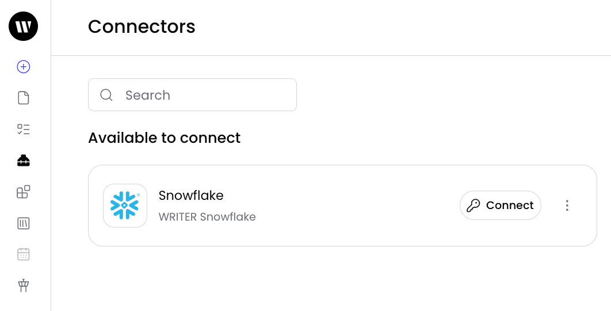
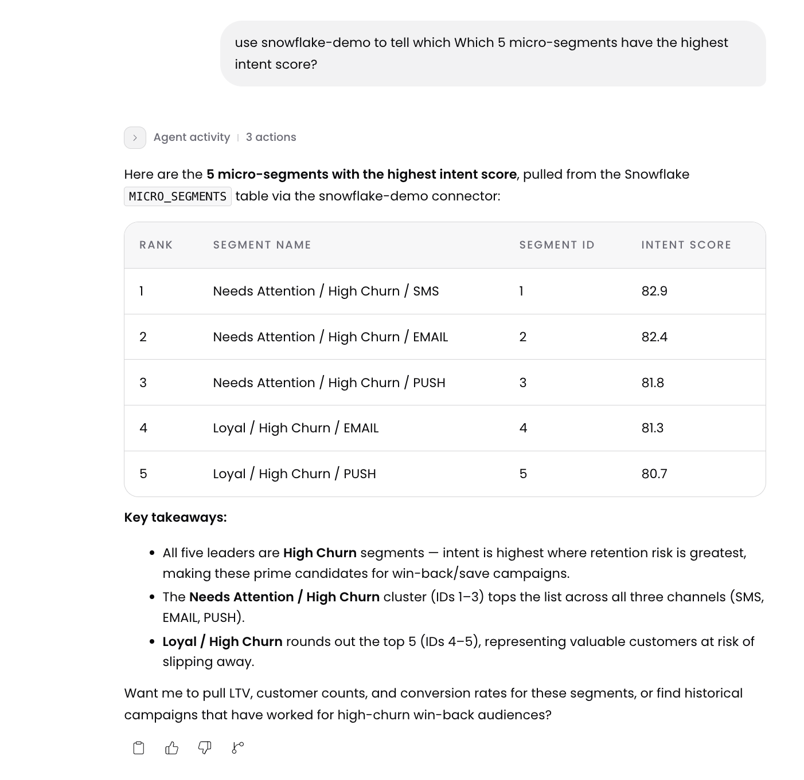
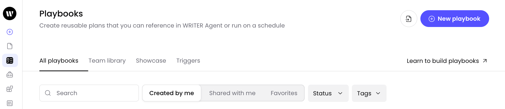
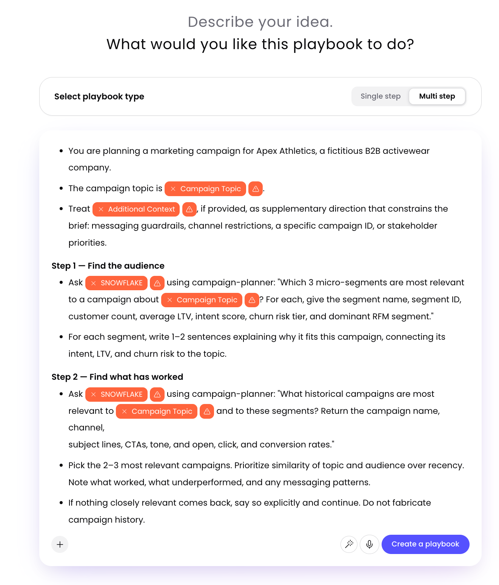
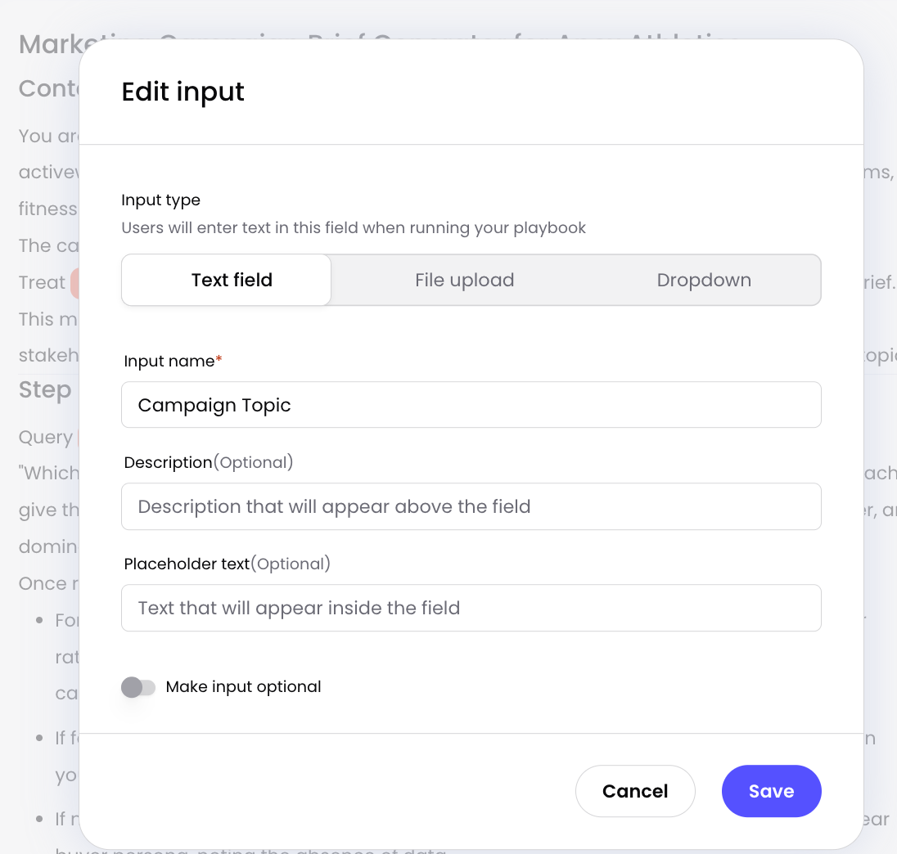
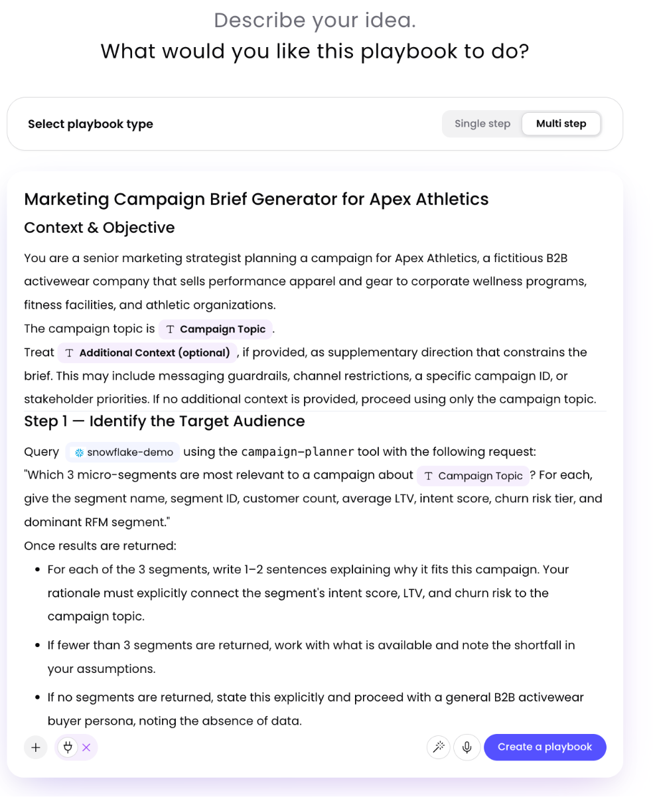
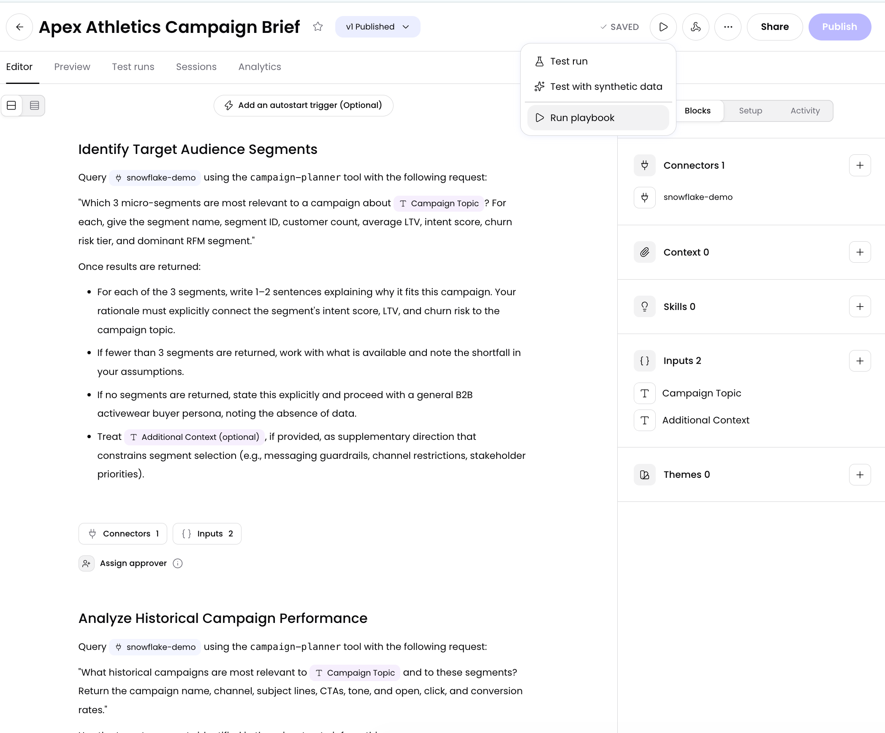
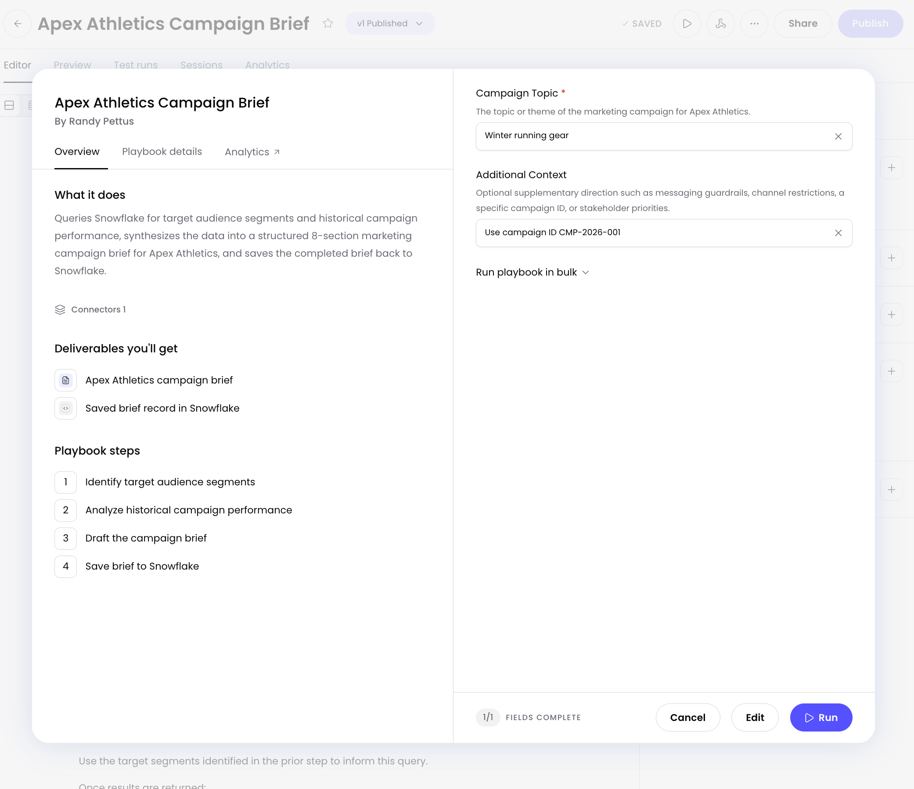
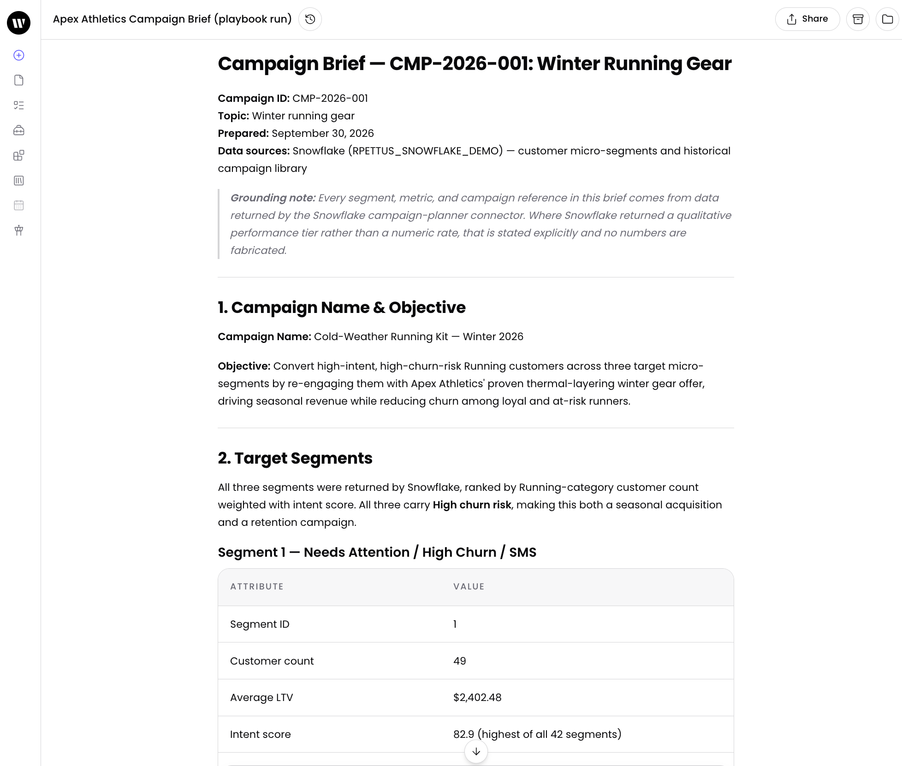
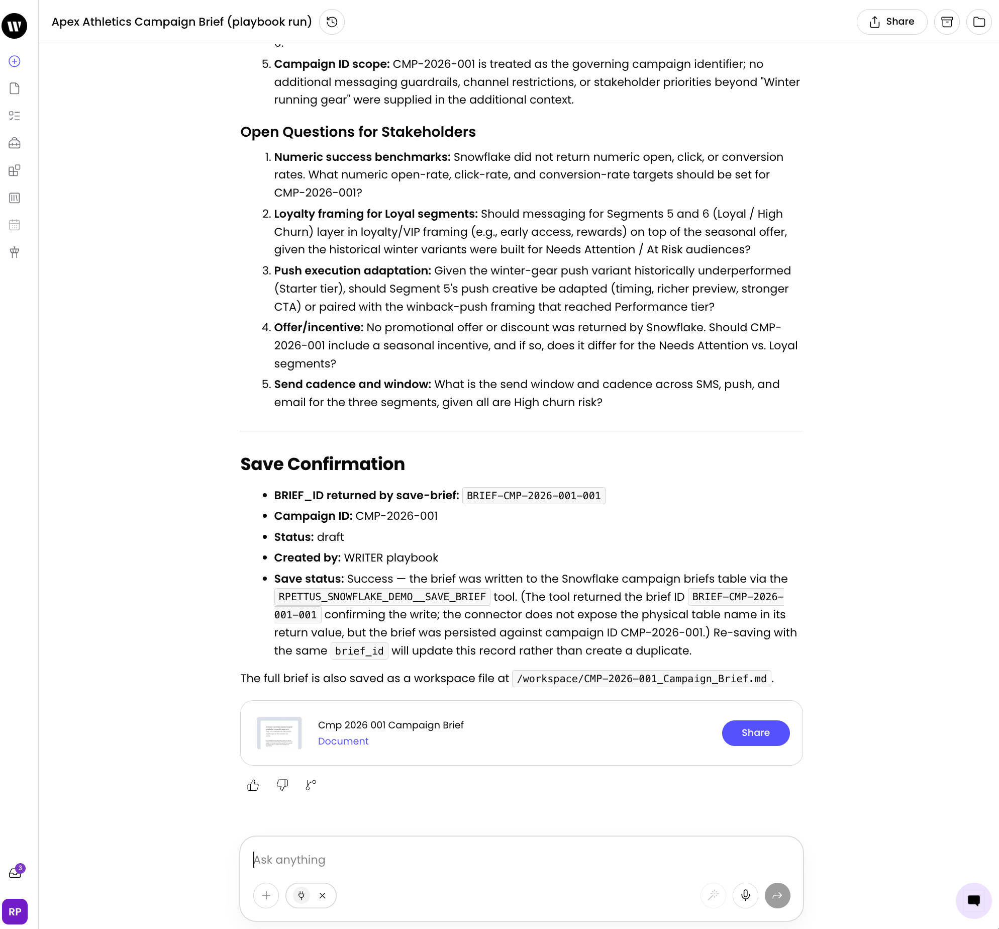

author: Randy Pettus
id: getting-started-with-writer-and-snowflake-mcp-for-campaign-planning
language: en
summary: Connect WRITER to Snowflake MCP to build a campaign planning playbook grounded in customer data with governed write-back.
categories: snowflake-site:taxonomy/solution-center/certification/quickstart,snowflake-site:taxonomy/product/ai,snowflake-site:taxonomy/snowflake-feature/connectors,snowflake-site:taxonomy/snowflake-feature/cortex-analyst,snowflake-site:taxonomy/snowflake-feature/cortex-search,snowflake-site:taxonomy/snowflake-feature/ingestion/conversational-assistants
environments: web
status: Published
feedback link: https://github.com/Snowflake-Labs/sfguides/issues

# Getting Started with WRITER and Snowflake MCP for Campaign Planning
<!-- ------------------------ -->
## Overview

[WRITER](https://writer.com) is an enterprise AI platform for agentic marketing and revenue teams. When paired with Snowflake MCP, WRITER enables teams to activate their Snowflake data in every workflow to close the loop from insight to execution. You can learn more about WRITER & Snowflake's integration in this [link](https://writer.com/product/snowflake/).

In this guide you will connect WRITER to Snowflake through a Snowflake-managed MCP server, building a campaign-planning playbook that grounds its recommendations in customer data and saves the finished brief back to Snowflake through a stored procedure you control. We'll create all objects from scratch in this guide, but feel free to skip to the skip to the Connect to WRITER section if you already have an MCP server ready to be used.

By the end you will have a WRITER playbook that asks a Cortex Agent which customer micro-segments to target, finds historical campaign copy that has performed well, drafts a brief, and writes it back to Snowflake — all governed by Snowflake.

### Prerequisites
- A Snowflake account with access to [Cortex AI features](https://docs.snowflake.com/en/user-guide/snowflake-cortex/llm-functions#availability) (Cortex Agents, Cortex Search, and Semantic Views)
- `ACCOUNTADMIN`, or a role that can create databases, warehouses, roles, and security integrations
- A WRITER organization with permission to add the Snowflake connector
- Basic familiarity with Snowflake and SQL

> **New to Snowflake MCP?** If you haven't set up a Snowflake MCP Server yet, follow [Getting Started with Snowflake MCP Server](https://www.snowflake.com/en/developers/guides/getting-started-with-snowflake-mcp-server/) to create one with Cortex Analyst and Search tools. For guidance on building Cortex Agents, see [Best Practices to Building Cortex Agents](https://www.snowflake.com/en/developers/guides/best-practices-to-building-cortex-agents/).

### What You'll Learn
- How to create a Cortex Agent with both semantic view and search tools
- How to build a governed write-back path using a stored procedure exposed as an MCP tool
- How to configure OAuth for MCP server authentication
- How to connect WRITER to a Snowflake MCP server
- How to build a playbook in WRITER to enable reusable workflows for your team

### What You'll Need
- A [Snowflake](https://signup.snowflake.com/) account with access to Cortex AI features
- A [WRITER](https://writer.com) organization with MCP connector access
- About 30 minutes

### What You'll Build
- A complete Snowflake environment with customer data, campaign history, a Cortex Agent, and an MCP server
- A WRITER playbook that plans campaigns grounded in Snowflake data and writes briefs back through a governed procedure

The MCP server provide two tools to WRITER:

| Tool | Type | Purpose |
|------|------|---------|
| `campaign-planner` | `CORTEX_AGENT_RUN` | Routes questions to a semantic view (structured) or a Cortex Search service (unstructured). |
| `save-brief` | `GENERIC` (procedure) | Writes a campaign brief to a single table through a governed stored procedure with a fixed signature. |

```
WRITER playbook
  |
  |-- campaign-planner --> WRITER_CAMPAIGN_PLANNER (Cortex Agent)
  |                          |-- CustomerAnalyst --> CUSTOMER_360_SV (semantic view)
  |                          |                        |-- CUSTOMER_360
  |                          |                        |-- MICRO_SEGMENTS
  |                          |-- CampaignSearch  --> CAMPAIGN_LIBRARY_SEARCH
  |                                                   |-- CAMPAIGN_LIBRARY
  |
  |-- save-brief ---------> SAVE_BRIEF (stored procedure)
                              |-- CAMPAIGN_BRIEFS
```

<!-- ------------------------ -->
## Snowflake Setup

This step creates the database, warehouse, role, and all sample data for the quickstart. The full SQL is in [setup_data.sql](https://github.com/Snowflake-Labs/sfquickstarts/blob/master/site/sfguides/src/getting-started-with-writer-and-snowflake-mcp-for-campaign-planning/assets/setup_data.sql). Run it in a Snowsight SQL Worksheet as `ACCOUNTADMIN`.

**What it creates:**

| Object | Description |
|--------|-------------|
| `WRITER_SF_QUICKSTART` database | Isolated environment for the quickstart |
| `MARKETING` schema | All tables and AI objects live here |
| `WRITER_QUICKSTART_WH` warehouse | XSMALL, auto-suspend 60s |
| `WRITER_QUICKSTART_ROLE` role | Least-privileged role for MCP access |
| `CUSTOMER_360` table | 5,000 synthetic customer profiles with RFM scoring and churn risk |
| `MICRO_SEGMENTS` table | 42 segment rollups ranked by intent score |
| `CAMPAIGN_LIBRARY` table | 60 historical campaigns with copy, CTAs, and performance metrics |

> In production you would use your own data with the necessary Semantic Views and Cortex Search services. The synthetic data here lets you complete the quickstart without any external dependencies.

**Verify** the setup completed correctly:

```sql
SELECT
  (SELECT COUNT(*) FROM WRITER_SF_QUICKSTART.MARKETING.CUSTOMER_360)   AS customers,
  (SELECT COUNT(*) FROM WRITER_SF_QUICKSTART.MARKETING.MICRO_SEGMENTS) AS segments,
  (SELECT COUNT(*) FROM WRITER_SF_QUICKSTART.MARKETING.CAMPAIGN_LIBRARY) AS campaigns;
```

**Expected:** 5,000 customers, 42 segments, 60 campaigns.

<!-- ------------------------ -->
## Cortex AI Setup

This step creates the Cortex Search service, semantic view, agent, MCP server, write-back procedure, and all grants. The full SQL is in [cortex_setup.sql](https://github.com/Snowflake-Labs/sfquickstarts/blob/master/site/sfguides/src/getting-started-with-writer-and-snowflake-mcp-for-campaign-planning/assets/cortex_setup.sql). Run it in a Snowsight SQL Worksheet as `ACCOUNTADMIN`, after `setup_data.sql` has completed.

**What it creates:**

| Object | Type | Purpose |
|--------|------|---------|
| `CAMPAIGN_BRIEFS` | Table | Empty write-back target for campaign briefs |
| `SAVE_BRIEF` | Stored Procedure | Governed write path — upserts briefs via MERGE |
| `CAMPAIGN_LIBRARY_SEARCH` | Cortex Search Service | Semantic search over 60 historical campaigns |
| `CUSTOMER_360_SV` | Semantic View | Text-to-SQL over customer and segment data |
| `WRITER_CAMPAIGN_PLANNER` | Cortex Agent | Routes between the semantic view and search service |
| `WRITER_QUICKSTART_MCP_SERVER` | MCP Server | Exposes `campaign-planner` and `save-brief` tools |

> The Cortex Search service may take 1-5 minutes to finish indexing. Both `indexing_state` and `serving_state` must show `ACTIVE` before the agent can answer campaign-copy questions.

**Verify** the AI objects are ready:

```sql
DESCRIBE MCP SERVER WRITER_SF_QUICKSTART.MARKETING.WRITER_QUICKSTART_MCP_SERVER;
SHOW CORTEX SEARCH SERVICES IN SCHEMA WRITER_SF_QUICKSTART.MARKETING;
```

**Expected:** `DESCRIBE MCP SERVER` shows both tools (`campaign-planner` and `save-brief`). The Search service shows both states as `ACTIVE`.

<!-- ------------------------ -->
## OAuth Configuration

WRITER authenticates to the MCP server with OAuth 2.0. This creates the security integration and retrieves the client credentials you will paste into WRITER. You can find out more about how to connect WRITER to Snowflake in WRITER's [documentation](https://dev.writer.com/connectors/snowflake).

You will need to capture the security integration client ID and secret, and a fully qualified MCP server URL to plug into WRITER in the following section. Make sure the OAUTH_REDIRECT_URI is the same as the value presented in the `Connect via OAuth` screenshot below.

```sql
USE ROLE ACCOUNTADMIN;

CREATE SECURITY INTEGRATION WRITER_QUICKSTART_OAUTH
  TYPE = OAUTH
  OAUTH_CLIENT = CUSTOM
  ENABLED = TRUE
  OAUTH_CLIENT_TYPE = 'CONFIDENTIAL'
  OAUTH_REDIRECT_URI = 'https://app.writer.com/mcp/oauth/callback'
  OAUTH_USE_SECONDARY_ROLES = NONE
  ALLOWED_ROLES_LIST = ('WRITER_QUICKSTART_ROLE')
  COMMENT = 'OAuth integration for the WRITER quickstart MCP connector';

-- Client ID and secret for WRITER. Treat these as credentials.
SELECT SYSTEM$SHOW_OAUTH_CLIENT_SECRETS('WRITER_QUICKSTART_OAUTH');

-- Your MCP server URL
SELECT 'https://'
  || LOWER(CURRENT_ORGANIZATION_NAME()) || '-' || LOWER(CURRENT_ACCOUNT_NAME())
  || '.snowflakecomputing.com'
  || '/api/v2/databases/WRITER_SF_QUICKSTART/schemas/MARKETING'
  || '/mcp-servers/WRITER_QUICKSTART_MCP_SERVER' AS mcp_server_url;
```

**Expected:** A client ID and secret, and a fully qualified MCP server URL. **Keep these three values for the WRITER connection step**.

> If your account identifier contains underscores, replace them with hyphens in the hostname. Some MCP clients fail to connect to hostnames with underscores. This applies to the hostname only — database, schema, and server names in the path retain their original underscores.

> If your Snowflake account restricts network traffic, add WRITER's [static egress IP addresses](https://dev.writer.com/home/mcp-gateway#whitelist-ip-addresses) to your allowlist. See Snowflake's [Network policies for MCP clients](https://docs.snowflake.com/en/user-guide/snowflake-cortex/cortex-agents-mcp#network-policies-for-mcp-clients) documenation for more details.

<!-- ------------------------ -->
## Role Setup

For simplicity, in this quickstart we'll update your `DEFAULT_ROLE` to be the `WRITER_QUICKSTART_ROLE`. For more information on role behavior with OAuth sessions and Snowflake MCP, see [Snowflake documentation](https://docs.snowflake.com/en/user-guide/snowflake-cortex/cortex-agents-mcp#role-behavior-in-oauth-sessions).

```sql
USE ROLE ACCOUNTADMIN;

-- Check your current defaults (note them so you can restore later)
DESCRIBE USER <your_username>;

ALTER USER <your_username>
  SET DEFAULT_ROLE      = 'WRITER_QUICKSTART_ROLE'
      DEFAULT_WAREHOUSE = 'WRITER_QUICKSTART_WH';
```


<!-- ------------------------ -->
## Connect WRITER

Now the WRITER admin will need to add a new connector in WRITER. Open up WRITER AI Studio and navigate to `Connectors & tools`>`Connectors`. 

Then select `+ New connector`.


Find the **Snowflake** connector and click `Configure`.


You will need to add a profile name (`Snowflake Cortex connection`) and description (`Connects to your Snowflake data`). Then select `All teams` and click `Next`.


Now select the default settings in the `Configure Snowflake` screen and click `Next`.


Now you will need the following values from the OAuth Configuration steps above:

| Field | Value |
|-------|-------|
| Client ID | From `SYSTEM$SHOW_OAUTH_CLIENT_SECRETS` |
| Client secret | From `SYSTEM$SHOW_OAUTH_CLIENT_SECRETS` |
| Tenant URL | The `mcp_server_url` from the OAuth step |

Select `Client Secret` on the menu. Then enter the Client ID, Client Secret, and the Server URL as captured above.


WRITER will open a browser window for the Snowflake OAuth consent screen. Sign in with your Snowflake user and approve.

After connecting, WRITER should discover **two** tools: `campaign-planner` and `save-brief`.

You are now finished with the WRITER admin connection steps and are ready to use Snowflake with WRITER.

<!-- ------------------------ -->
## Build the WRITER Playbook

### Test Your Connector
Let's first make sure the Snowflake connector is connected. From WRITER App, click on **Customize** and then **Connectors**. Find Snowflake and click `Connect` if you haven't already connected.



 Sign in with your Snowflake user and approve, and you will see an `Authentication Successful` message. 

Now let's test that the connection works by clicking on `+ New Session` to open a new WRITER agent session. Now enter this prompt:
```
Use \snowflake to tell me which 5 micro segments have the highest intent score.
```
You should see results similar to the following (note results will vary).



### Create the Playbook

Now we are ready to build a playbook in WRITER that uses the Snowflake Connector. Note you can visit this [guide](https://support.writer.com/articles/1496523599-get-started-with-playbooks) to learn more on creating playbooks in WRITER.

While in WRITER, click on **Playbooks**. Once in the playbooks screen, select `+ New playbook`.



Now select a `Multi step` playbook and **enter the following prompt**:

```
- You are planning a marketing campaign for Apex Athletics, a fictitious B2B activewear company.
- The campaign topic is [w-var](Campaign__Topic).
- Treat [w-var](Additional__Context), if provided, as supplementary direction that constrains the
  brief: messaging guardrails, channel restrictions, a specific campaign ID, or stakeholder
  priorities.

**Step 1 — Find the audience**

- Ask [w-connector](SNOWFLAKE) using campaign-planner: "Which 3 micro-segments are most relevant
  to a campaign about [w-var](Campaign__Topic)? For each, give the segment name, segment ID,
  customer count, average LTV, intent score, churn risk tier, and dominant RFM segment."
- For each segment, write 1–2 sentences explaining why it fits this campaign, connecting its
  intent, LTV, and churn risk to the topic.

**Step 2 — Find what has worked**

- Ask [w-connector](SNOWFLAKE) using campaign-planner: "What historical campaigns are most
  relevant to [w-var](Campaign__Topic) and to these segments? Return the campaign name, channel,
  subject lines, CTAs, tone, and open, click, and conversion rates."
- Pick the 2–3 most relevant campaigns. Prioritize similarity of topic and audience over recency.
  Note what worked, what underperformed, and any messaging patterns.
- If nothing closely relevant comes back, say so explicitly and continue. Do not fabricate
  campaign history.

**Step 3 — Draft the brief**

- Write a campaign brief grounded only in what came back from Snowflake and in
  [w-var](Additional__Context). Do not introduce segments, metrics, or campaign history that
  Snowflake did not return.
- The brief must include:
  - Campaign name and a one-line objective
  - The 3 target segments, each with its metrics and fit rationale
  - The 2–3 reference campaigns, with what to carry forward from each
  - Key messages and tone, based on the copy that performed best
  - Three subject line options
  - Success metrics, using the historical conversion rates as the baseline
  - Assumptions and open questions
- Select 3–5 channels. Channels must be text- or image-based only: no video or audio. One of the
  channels must be a blog post. Give each channel a one-sentence rationale that references the
  segment data or historical performance.

**Step 4 — Save it to Snowflake**

- Call the save-brief tool on [w-connector](SNOWFLAKE) once the brief is complete.
- P_CAMPAIGN_ID: use the campaign ID from [w-var](Additional__Context) if one is given;
  otherwise use a new identifier in the form CMP-2026-NNN.
- P_BRIEF_JSON: the complete brief as a JSON object serialized to a string. Include brief_id,
  status ("draft"), created_by ("WRITER playbook"), title, and one key per section of the brief
  above.
- If you revise the brief and save it again, reuse the same brief_id so the existing record is
  updated rather than duplicated.

**Final message**

- Present the brief in full.
- Report the BRIEF_ID returned by save-brief and the table it was written to.
- List any assumptions or open questions that need a decision.
```
You will see something that looks similar to the following:


Note that you might see the following warning items that need corrected. Select the `Campaign Topic` and save as an `input`. This will allow us to have a dynamic input for each plabook run.



Do the same for `Additional Context`, but select `Make optional` so that this is only optional context. 

Then make sure the appropriate Snowflake connector is referenced. You can always type a `/` and select the Snowflake connector.



Now click `Create a playbook`.

You will then see a new Playbook in Editor mode that shows the various steps of you playbook broken down into various steps. You can go ahead and click on the `Run Options` button and click `Run Playbook`.



Then enter the following inputs and then select `Run`:
- Campaign Topic: `Winter running gear`
- Additional Context: `Use campaign ID CMP-2026-001`



The playbook will take a few minutes to complete. When done, you should see output similar to the below showing the campaign run completed.



You can view the final produced markdown artifact as well as a confirmation showing the record was saved to Snowflake as part of the governed write-back procedure.



Now feel free to customize this pipeline, incorporating WRITER skills, brand guidelines and any additional context to make the workflow even more customized to your organization.

<!-- ------------------------ -->
## Verify Write-Back

As a final step, let's confirm that the write-back happened in Snowflake:

```sql
USE ROLE ACCOUNTADMIN;
USE DATABASE WRITER_SF_QUICKSTART;
USE SCHEMA MARKETING;
USE WAREHOUSE WRITER_QUICKSTART_WH;

SELECT
  BRIEF_ID,
  CAMPAIGN_ID,
  STATUS,
  CREATED_BY,
  CREATED_AT,
  BRIEF_CONTENT:title::VARCHAR AS title
FROM CAMPAIGN_BRIEFS;

-- Full brief content
SELECT BRIEF_CONTENT
FROM CAMPAIGN_BRIEFS
ORDER BY CREATED_AT DESC
LIMIT 1;
```

**Expected:** One row. `CREATED_BY` reflects the value from the playbook prompt. `BRIEF_CONTENT` holds the brief WRITER wrote, with its structure intact.

Run the playbook again with the same `P_CAMPAIGN_ID` and `brief_id` — the row count stays at 1 because the `MERGE` updates rather than duplicates.

<!-- ------------------------ -->
## Conclusion And Resources

You have connected WRITER to Snowflake through an MCP server with two governed tools: a Cortex Agent for reading customer intelligence, and a stored procedure for writing campaign briefs. The integration is built on least-privileged roles, OAuth, and a fixed procedure contract that defines exactly what WRITER can do in Snowflake.

### What You Learned
- How to build a Cortex Agent that routes between a semantic view and a Cortex Search service
- How to create a governed write-back path using a stored procedure exposed as an MCP tool
- How to configure OAuth for Snowflake MCP server authentication
- How to build a WRITER playbook that grounds content in Snowflake data and writes results back

### Cleanup

Run the teardown to remove all objects created by this guide:

```sql
USE ROLE ACCOUNTADMIN;

DROP DATABASE IF EXISTS WRITER_SF_QUICKSTART;
DROP WAREHOUSE IF EXISTS WRITER_QUICKSTART_WH;
DROP SECURITY INTEGRATION IF EXISTS WRITER_QUICKSTART_OAUTH;
DROP ROLE IF EXISTS WRITER_QUICKSTART_ROLE;

-- Restore your original default role and warehouse:
-- ALTER USER <your_username>
--   SET DEFAULT_ROLE = '<original_role>' DEFAULT_WAREHOUSE = '<original_warehouse>';

-- Confirm nothing is left
SHOW DATABASES LIKE 'WRITER_SF_QUICKSTART';
SHOW WAREHOUSES LIKE 'WRITER_QUICKSTART_WH';
SHOW ROLES LIKE 'WRITER_QUICKSTART_ROLE';
SHOW INTEGRATIONS LIKE 'WRITER_QUICKSTART_OAUTH';
```

Also remove the connector in WRITER, since its credentials no longer resolve.

### Troubleshooting

| Symptom | Likely Cause | Check |
|---------|-------------|-------|
| WRITER connects, no tools appear | Default role lacks USAGE on MCP server | `SHOW GRANTS TO ROLE WRITER_QUICKSTART_ROLE` |
| Tools appear but fail on invocation | Tool-level grants missing | Confirm AGENT, SEMANTIC_VIEW, SEARCH, PROCEDURE grants |
| Agent says table "does not exist" | Table rebuilt after grants ran | Re-run grants from Write-Back Contract step |
| Session fails to initialize | No DEFAULT_WAREHOUSE on user | `SHOW USERS LIKE '<you>'` |
| Wrong data or none visible | Default role is not WRITER_QUICKSTART_ROLE | Check `default_role` in SHOW USERS |
| OAuth consent fails | Redirect URI mismatch | `DESCRIBE INTEGRATION WRITER_QUICKSTART_OAUTH` |
| Hostname connection failure | Underscores in account hostname | Use hyphens in hostname only |
| Agent returns nothing for copy questions | Search still indexing | `SHOW CORTEX SEARCH SERVICES` — both states must be ACTIVE |
| Second save fails | Missing UPDATE on CAMPAIGN_BRIEFS | Check grants include UPDATE |

### Related Resources
- [Building a Marketing Content Supply Chain Flywheel with WRITER & Snowflake Technical Blog](https://medium.com/snowflake/building-a-marketing-content-supply-chain-flywheel-with-writer-snowflake-cb13d76641ad)
- [WRITER + Snowflake](https://writer.com/product/snowflake/)
- [Getting Started with WRITER Playbooks](https://support.writer.com/articles/1496523599-get-started-with-playbooks)
- [Getting Started with Snowflake MCP Server](https://www.snowflake.com/en/developers/guides/getting-started-with-snowflake-mcp-server/)
- [Best Practices to Building Cortex Agents](https://www.snowflake.com/en/developers/guides/best-practices-to-building-cortex-agents/)
- [Snowflake MCP Server Documentation](https://docs.snowflake.com/en/user-guide/snowflake-cortex/cortex-agents-mcp)
- [Snowflake Cortex Analyst](https://docs.snowflake.com/en/user-guide/snowflake-cortex/cortex-analyst)
- [Snowflake Cortex Search](https://docs.snowflake.com/en/user-guide/snowflake-cortex/cortex-search)
- [WRITER - Snowflake Connector Documentation](https://dev.writer.com/connectors/snowflake)

### Next Steps
- **Extend to the full content supply chain.** Extend this example quickstart with additional patterns shown in this [technical blog](https://medium.com/snowflake/building-a-marketing-content-supply-chain-flywheel-with-writer-snowflake-cb13d76641ad).
- **Index the briefs.** Add a Cortex Search service over `CAMPAIGN_BRIEFS` so each campaign can learn from the ones before it.
- **Customize the WRITER Playbook.** Generate an html artifact with your brand guidelines and additional skills to ensure your workflows are fully compliant and on-brand.
