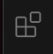
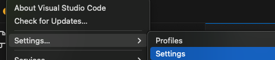
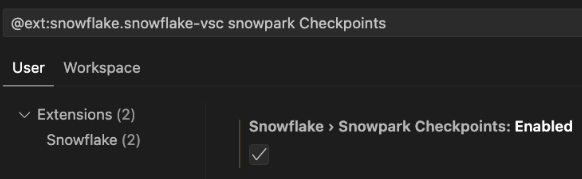
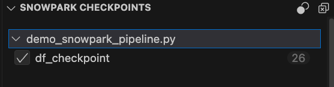
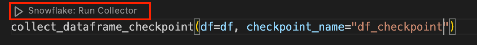
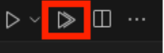

author: Andrei Paniagua
id: getting_started_checkpoint
summary: This is a Snowflake Guide for Snowpark Checkpoints
categories: Getting-Started
environments: web
status: Published 
feedback link: https://github.com/Snowflake-Labs/sfguides/issues
tags: Getting Started, Pyspark, Snowpark, Checkpoints,

# Getting started with Snowpark Checkpoints
<!-- ------------------------ -->
## Overview 
Duration: 5

By completing this guide, you will be able to use a testing component for validations of migrating Pyspark to Snowpark. This set of validations are called
Checkpoints and help to identify behavorial changes and differences in execution platforms that can cause issues.

Here is a summary of what you will be able to learn in each step by following this quickstart:

- **Setup Framework Environment**: Set up of Python environment to run checkpoints
- **Checkpoints uses**: Uses of collectors and validators
- **Setup Extension**: Install Snowflake VScode extension and how to work along with Checkpoints framework
- **Extension View**: Extension view with checkpoints option and how to run them


### Prerequisites
- A Snowflake account. If you do not have a Snowflake account, you can register for a [free trial account](https://signup.snowflake.com/?utm_cta=quickstarts_)
- The default connection needs to have a database and a schema. After running the app, a table called `SNOWPARK_CHECKPOINTS_REPORT` will be created
- Python 3.9, 3.10 or 3.11
- OpenJDK >= 17
- Snowflake CLI version 3.1.0
- Familiarity with Pyspark and Snowpark
#### Optional
- Visual Studio Code
- Snowflake VSCode extension

### What You'll Learn

- How to set the enviroment to run the collectors and validators
- How to collect information from a pyspark dataframe and validate againt a snowflake dataframe
- How to use VSCode Snowflake extension with the framework

### What You'll Need

- [VSCode](https://code.visualstudio.com/download) Installed
- [NodeJS](https://nodejs.org/en/download/) Installed
- [OpenJDK 17.0.0](https://jdk.java.net/17/) or above Installed
- [Python 3.9](https://www.python.org/downloads/release/python-3900/) Installed
- [Snowflake CLI version 3.1.0](https://docs.snowflake.com/en/user-guide/snowsql-install-config.html) Installed
- [Snowflake](https://signup.snowflake.com/?utm_cta=quickstarts_) Account 

### Problem to solve
- Identify behavioral changes and differences in execution platforms that can cause issues even after code porting and unit tests.

> aside positive
> IMPORTANT: You can access [here](https://docs.snowconvert.com/sma/use-cases/assessment-walkthrough/walkthrough-setup) to migrate 
> you Pyspark code to Snowpark using SMA tool.

<!-- ------------------------ -->
## Setup Framework Environment
### Setting Up Your Python Environment

Duration: 2

To run the collectors and validators, you need to set up a python environment. You can do this by running the following commands:

```bash
python3 -m venv .venv
source .venv/bin/activate
```

Then, install the required packages:

```bash
pip install snowpark-checkpoints
```
### Setting up the Snowflake CLI

To create a session with the [Snowflake CLI](https://docs.snowflake.com/en/developer-guide/snowflake-cli/connecting/configure-cli), you need to set up the default connection. You can do this by running the following command:

```bash
snow connection add --connection-name=<connection_name> --account=<account_name> --user=<user_name> --password=<password> --role=<role_name> --region=<region_name> --warehouse=<warehouse_name> --database=<database_name> --schema=<schema_name> --default
```

Test the connection by running the following command:

```bash
snow connection test
```

> aside positive
> You can access [here](https://docs.snowflake.com/en/developer-guide/snowflake-cli/connecting/configure-cli) for more information about Snowflake CLI

<!-- ------------------------ -->
## Using Collectors
### Python script

Duration: 5

Create a python script with Pyspark code to collect the data from the dataframe, this will collect the schema information from the dataframe, and the next steps it will use it to validate a Snowpark dataframe.

```python
from datetime import date

from pyspark.sql import Row, SparkSession
from pyspark.sql.types import BooleanType, DateType, IntegerType, StringType, StructField, StructType

from snowflake.snowpark_checkpoints_collector import collect_dataframe_checkpoint


# Initialize Spark session
spark = SparkSession.builder.appName("quickstart_sample").getOrCreate()

# Define schema for the DataFrame
schema = StructType(
    [
        StructField("integer", IntegerType(), True),
        StructField("string", StringType(), True),
        StructField("boolean", BooleanType(), True),
        StructField("date", DateType(), True),
    ]
)

# Define date and timestamp formats
date_format = "%Y-%m-%d"

# Sample data
data = [
    Row(
        integer=13579,
        string="red",
        boolean=True,
        date=date.fromisoformat("2023-03-01"),
    ),
    Row(
        integer=24680,
        string="red",
        boolean=False,
        date=date.fromisoformat("2023-04-01"),
    ),
    # Add more rows as needed
]

# Create DataFrame
df = spark.createDataFrame(data, schema)

# Collect initial schema and statistics
collect_dataframe_checkpoint(
    df, "demo_initial_creation_checkpoint" 
)

df.show()
```

Then you can run the script by executing the following command:

```bash
python3 <script_name>.py
```

#### Output
```bash
+-------+------+-------+----------+
|integer|string|boolean|      date|
+-------+------+-------+----------+
|  13579|   red|   true|2023-03-01|
|  24680|   red|  false|2023-04-01|
+-------+------+-------+----------+
```

#### Generated files

After running the script, you will see the following files in the `snowpark-checkpoints-output` directory:

- `demo_initial_creation_checkpoint.json`: Contains the schema of the DataFrame and the statistics of the columns
- `checkpoint_collection_results.json`: Contains the information of the results of the collection. It will show the checkpoint name, the result of the collection, the file where the collection was run, and the line of code where the collection was run

<!-- ------------------------ -->
## Using validators
### Run python script with validators

Duration: 5

After the migration is done, you can run the script with the validators. The script will validate the schema of the Snowflake dataframe against the schema collected in the previous step.

```python
from datetime import date

from snowflake.snowpark_checkpoints import validate_dataframe_checkpoint
from snowflake.snowpark import Session
from pyspark.sql import SparkSession
from snowflake.snowpark.types import (
    IntegerType,
    StringType,
    StructField,
    StructType,
    BooleanType,
    DateType,
)
from snowflake.snowpark_checkpoints.job_context import SnowparkJobContext

# Define schema for the DataFrame
schema = StructType(
    [
        StructField("integer", IntegerType(), True),
        StructField("string", StringType(), True),
        StructField("boolean", BooleanType(), True),
        StructField("date", DateType(), True),
    ]
)

# Sample data
data = [
    [
        13579,
        "red",
        True,
        date.fromisoformat("2023-03-01"),
    ],
    [
        24680,
        "red",
        False,
        date.fromisoformat("2023-04-01"),
    ],
    # Add more rows as needed
]

# Create DataFrame
session = Session.builder.getOrCreate()
job_context = SnowparkJobContext(
    session, SparkSession.builder.getOrCreate(), "quickstart_sample", True
)
df = session.createDataFrame(data, schema)

# Validate DataFrame
all_data_is_valid, df_result = validate_dataframe_checkpoint(
    df,
    "demo_initial_creation_checkpoint",
    job_context=job_context,
)

# Print the result
if all_data_is_valid:
    print("All data is valid")

else:
    print("Invalid data:")

print(df_result[df_result["quality_status"] == "invalid"])
```

Then you can run the script by executing the following command:

```bash
python3 <script_name>.py
```

#### Output

```bash
All data is valid
   INTEGER  ... quality_status
1    13579  ...          Valid
1    24680  ...          Valid
[2 rows x 6 columns]
```

### Table with the results

- The result of the validation will be saved in the `SNOWPARK_CHECKPOINTS_REPORT` table in the Snowflake account.

#### Generated files

- `checkpoint_validation_results.json`: Contains the information of the results of the validation. It will show the checkpoint name, the result of the validation, the file where the validation was run, and the line of code where the validation was run

<!-- ------------------------ -->
## Setup extension 
Duration: 5

You can also use snowflake extension in Visual Studio to run and visualize your Checkpoints.

**Step 1.** Download [VSCode](https://code.visualstudio.com/download) in case you don't have it

**Step 2.** Once you have VSCode open, click in the extension icon



**Step 3.** Search for the Snowflake extension and download it


**Step 4.** Select on Code option in the upper part, click Settings -> Settings



**Step 5.** Click Extension then search for Snowflake and click it

**Step 6.** Activate `Snowflake > Snowpark Checkpoints: Enabled`



## Checkpoints View
After activating the Snowpark Checkpoints flag, you can see, in the Snowflake extension tab, a new panel called `SNOWPARK CHECKPOINTS`. There you can find the checkpoints by file, and also two buttons: the left one to activate or deactivate all checkpoints, and the other to delete all of them. Double-clicking a checkpoint in the view will take you to it in the corresponding file.



### Run checkpoints
There are two ways of running checkpoints:

**1.** Run a single checkpoint. This option will appear above each one.



**2.** Run all checkpoints in a file. This option is at the top right corner of each file.



<!-- ------------------------ -->
## Conclusion And Resources
Duration: 2

Congratulations! You've successfully completed the Getting started with Checkpoints guide.

### What You Learned
- What Checkpoints are
- Uses of Checkpoints (Collectors and Validators)
- Use VScode Snowflake extension with Checkpoints

### Related Resources
- [Snowpark checkpoints package](https://pypi.org/project/snowpark-checkpoints/)
- [Checkpoints documentation](https://docs.snowflake.com/en/developer-guide/snowpark/python/snowpark-checkpoints-library)
