author: seb_froh
id: getting_started_datameer
summary: This is a broad introduction of Datameer and covers how to start, load and transform data, and share insights.
categories: getting-started,partner-integrations
environments: web
status: Published
feedback link: https://github.com/Snowflake-Labs/sfguides/issues
tags: Getting Started, Tranformation, Exploration, Visualisation, Cataloging

# Getting Started with Datameer


## Overview

Duration: 2

Datameer provides users with data discovery & transformation capabilities to visually explore and transform their data to identify the key insights for improving data driven decisions. Users can transform their data using a variety of no-code, low-code and SQL transformation recipes and then quickly publish this data back into Snowflake to support the development of BI dashboards, reports and data science driven insights in your organization. All this can be delivered without the need for IT assistance or formal training and without leaving a single user interface.  


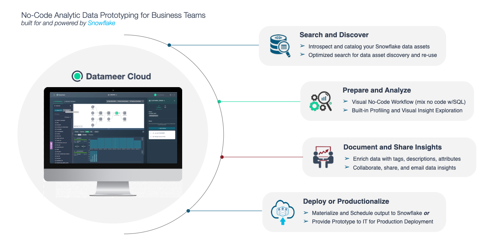


In this training lab you will learn how to model and transform your data, create highly valuable datasets, and publish the data into Snowflake. No coding skills are necessary using our no-code tools or writing code using our SQL toolset. Or even use both! We will provide you with a test Datameer & Snowflake instance for this hands-on lab.

### Lab Overview

This entry-level lab introduces you to the user interface and basic capabilities of Datameer. When done with the lab you should be ready to create your own data transformations against your own Snowflake data.

### Target Audience

Anyone who will be exploring & transforming data in Snowflake. Includes technical roles like members of an Analytics & BI team, data engineers to non-technical business users in the various lines of business. No SQL or technical skills are needed to do this lab.

### What You'll learn

In this workshop lab, you will experience the following capabilities in Datameer: 

* Search and discover your Snowflake inventory
* Prepare and curate your data sets
* Explore and analyze your data sets 
* Share and deploy your data sets 
* Document and catalog your new datasets


### Business Use Case

For the purposes of this workshop, you play the role of a loans analyst. Throughout this lab we will be working with some current and historical loans data from our fictitious loans company. We will begin with looking at our current loans data only, but throughout the course of the lab will incorporate some geographical information to transform & understand our loan portfolio by state/region being able to spot business opportunities in these regions.


## Prepare Your Lab Environment

Duration: 2

Click the link below to get to the trial setup:

[Datameer Trial](https://www.datameer.com/trial)

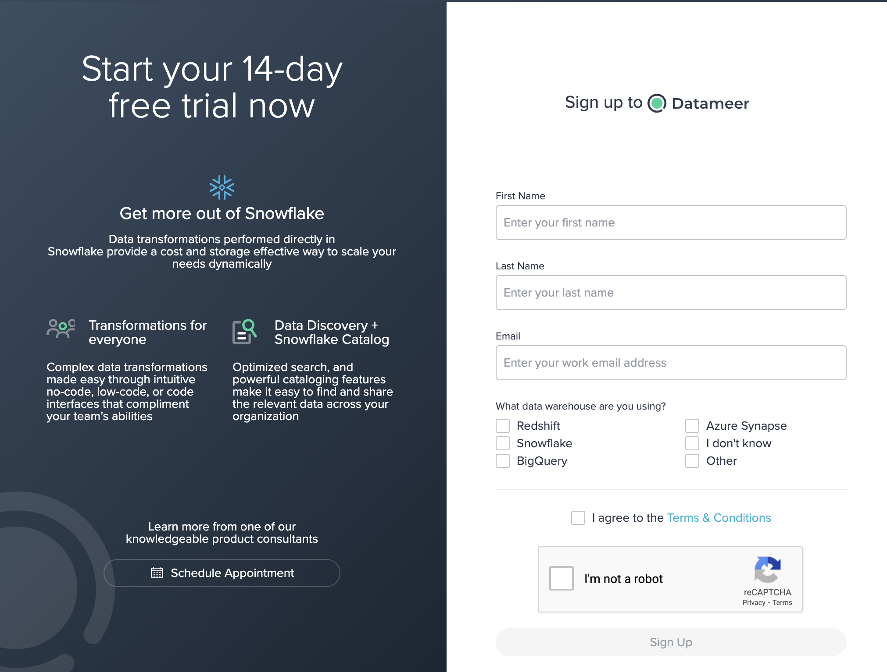

The first time you login to Datameer you can choose to be taken directly to a Project, supported by an onboarding checklist which guides you though essential Datameer features. We will begin exploring and transforming data in the next module.

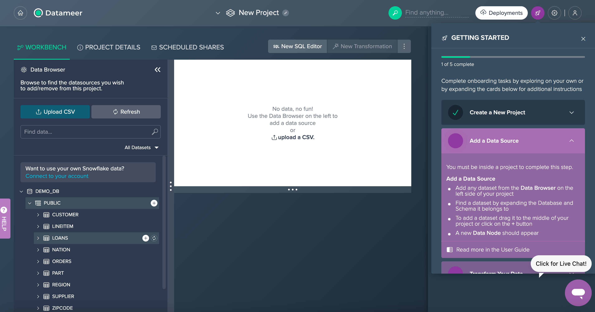

But before, let's have a quick look at the Datameer Workbench UI:

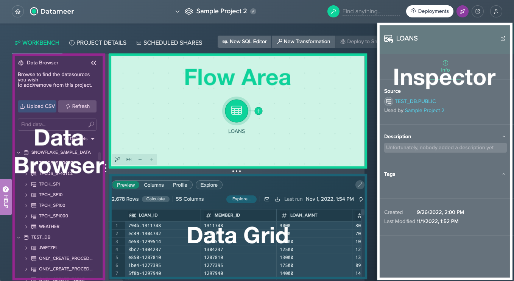

* **Data Browser** - provides all available Snowflake schemas and datasets, and the 'File Upload' feature as well as browsing your data
* **Flow Area** - visually represents your whole transformation pipeline, including data sources, transformations as well as deployed data sets
* **Data Grid** - provides a data preview, allows you to explore columns of a dataset, calculates column metrics, and provides SQL query for further usage; individual explorations can be executed to visualize your data
* **Inspector** - presents all information such as 'Source', 'Description' or 'Owner' about the currently selected dataset/ Project or schema that is selected


## Data Exploration

Duration: 8

Let’s add our first data source by clicking the **+** button next to the `LOANS` table from the Data Browser. This will add the table to our Workbench for discovery and transformation. 


We can explore this dataset in three different ways:

* **Preview** - Under the ´Preview´ tab you can see the actual data values and total number of records.  Datameer also utilizes Snowflake’s native sampling when transforming large tables. This will be indicated in the ´Preview´ tab with the ‘Sampled’ label.
* **Columns** - This tab contains the column names, data types, and descriptions.
* **Profile** - You can view column metrics within this tab, by clicking on the ´Calculate´ button for the desired column. Click on the  **Calculate** button for the `GRADE` column, and you can see the number of values, empty values, uniques, nulls, and the distribution of values. 


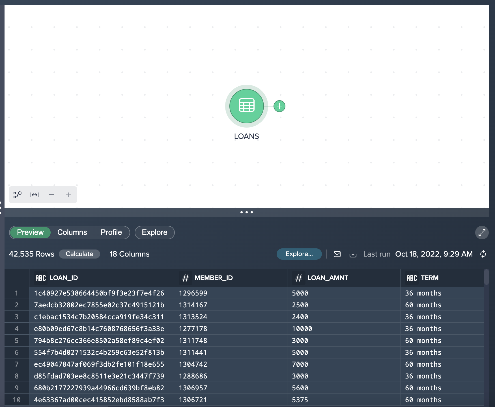


Let’s now add another dataset to this Project - this time by adding the `ZIPCODE` dataset by selecting the **+** button next to the table. You should see both added datasets in your Flow Area.


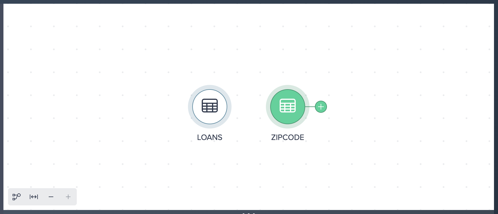


## No-Code Transformations

Duration: 10

Click on the **LOANS** node and select the **+** button to bring up the list of no-code transformations.


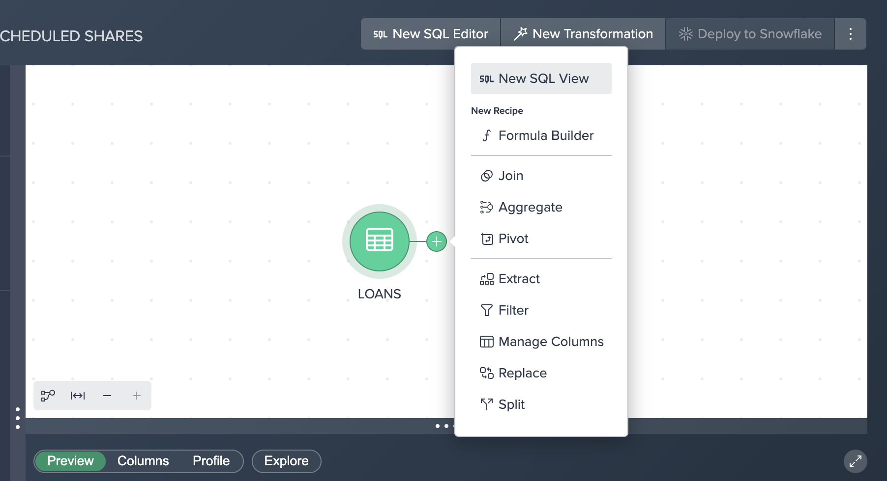


Let’s apply a filter by doing the following:

1. Click **Filter** in the popup context menu.
2. Select **LOAN_STATUS** as the column to filter by.
3. Leave **Equals** as the operator.
4. Enter **Current** (case sensitive) as the value to search by.
5. Click **Apply**.


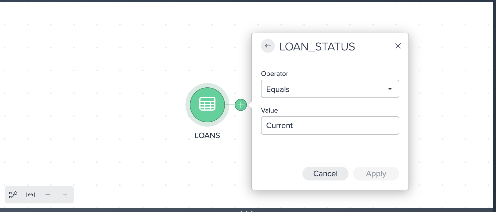


Here we can see a Filter condition in the UI with a Recipe step on the right hand side. You may see another purple hint appear on the screen informing you that you have created your first Receipe.

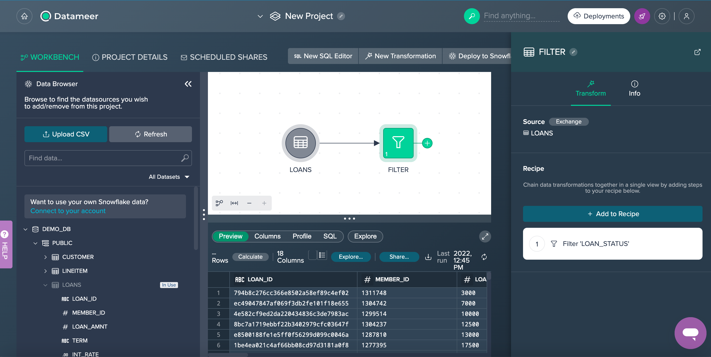

Let’s apply another transformation. The ´Extract´ operation allows us to extract a certain number of characters from one field to a new column name. In our example we want to extract the first 3 digits from our `ZIP_CODE` column and populate this in a new column name called `ZIP`.  (Please note we use an INDEX value starting at 0 and extract 3 characters from this position to get the first 3 characters from this column.)  

Here are the steps for an Extract:

1. Click the **+** button next to the ´Filter´ node and select **Extract**.
2. Select **ZIP_CODE** for the source column.
3. Enter **ZIP** for the new column name.
4. Enter **0** for a start index and **3** for length.
5. Click **Apply**. 


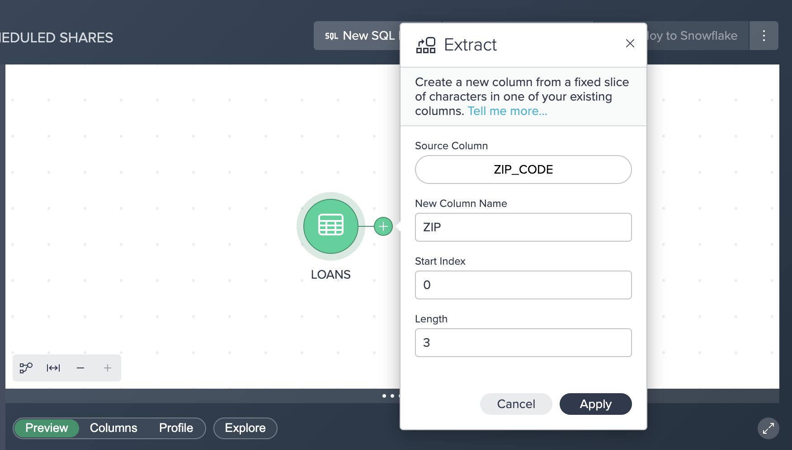


You should now see the following flow:

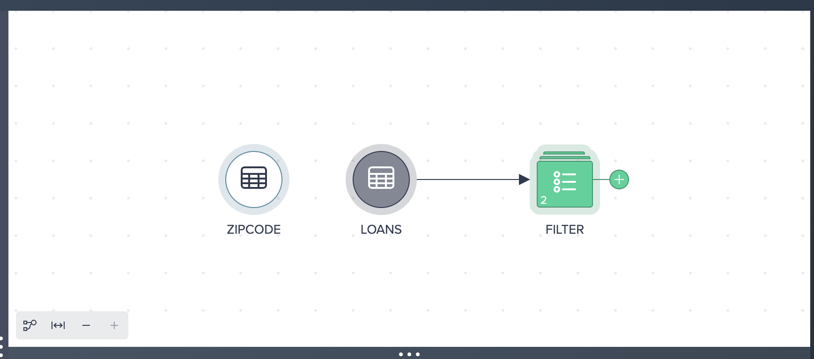


## Low-Code Transformations 

Duration: 17

The Formula Builder can be used to enter low-code formulas on a columnar basis. All functions can be found on the right hand side, grouped together by different categories (STRING, NUMERIC, DATE & TIME, CONVERSION, CONTEXT & CONDITIONAL) - selecting a category allows you to browse the Snowflake functions and obtain help on how to use these against your data. Inside the Formula Builder we can select a field to transform using a variety of functions or we can select the **+** button to add a new column. 

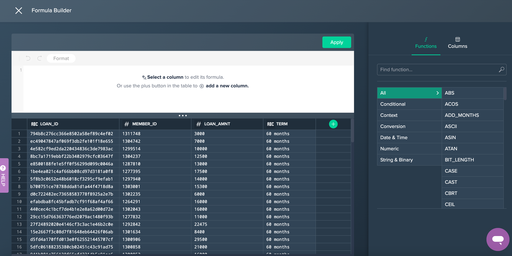

Let’s apply a formula to concatenate the first 4 characters from the `LOAD_ID` column with the `MEMBER_ID` column and put a `-` separator between the two values:

1. Click on the **+** button next to the Extract node, and select the **Formula Builder** option.
2. Select the **LOAN_ID** column.
3. Enter the following formula:

	```sql  
	CONCAT(LEFT(Source.LOAN_ID,4),'-',MEMBER_ID) 
	```  

4. Click **Apply Formula** to validate the formula, and then **Apply**.


You will see the following screen after entering the formula described in Step 3 above.

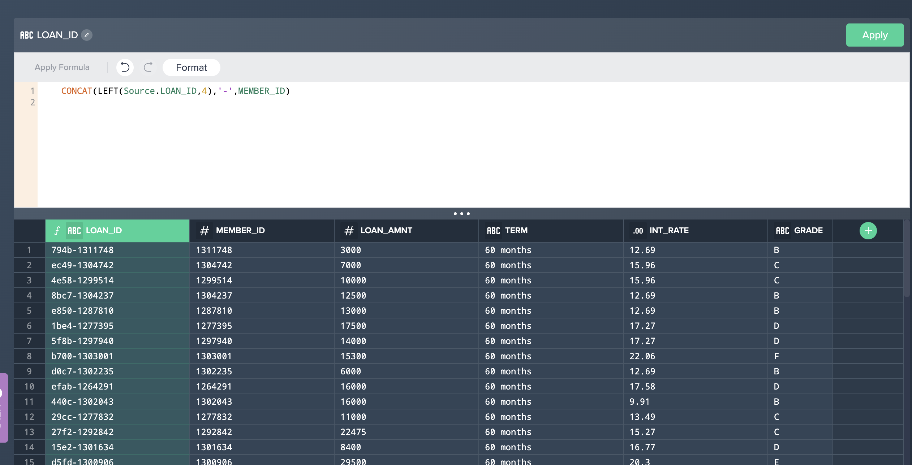


## Joining Data Together

Duration: 11
The third Recipe step is complete and now we want to join our `LOANS` data with our `ZIPCODE` (POSTCODE) dataset. Let’s apply a join:

1. Click the **+** button next to the ´Formula node and select **Join**.
2. Select the **ZipCode** dataset in the ´Source´ dropdown.
3. Leave Join Mode as it is as ´Outer Left´.
4. Click **Get Suggestions**.
5. Select the **Zip-Zip** suggestion.
6. Click **Apply** Button.

Join configuration:

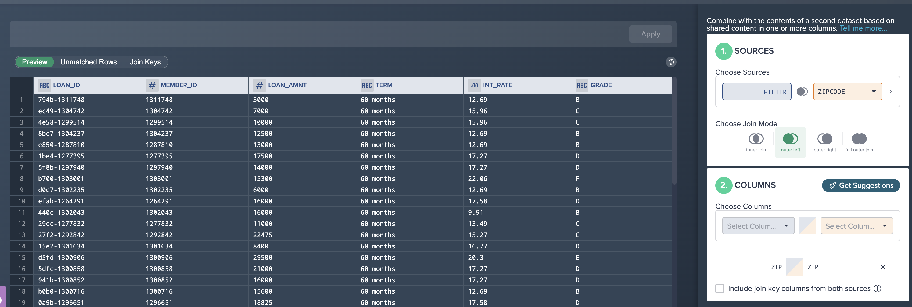

The resultant flow:


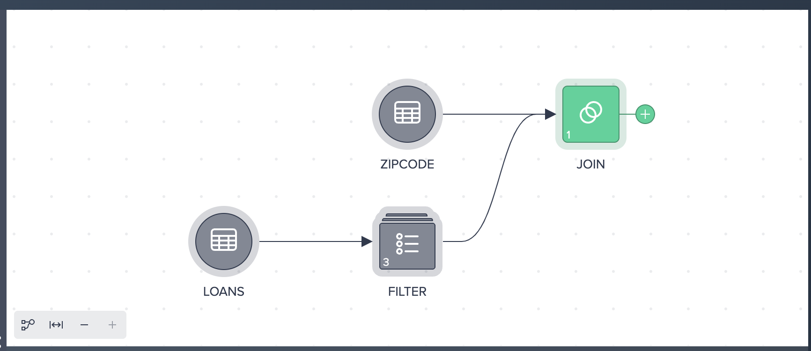

## Exploring the Data

Duration: 16

Datameer provides functionality to perform exploration of datasets through dimensions and measures without having to export to a BI tool. For example, to calculate the average interest rate by loan grade and purpose, perform the following steps:

1. Click the **Join** node.
2. Select the **Explore** tab in the ´Data Grid´ and click on **Explore**.
3. Click **Aggregate**.
4. Choose **GRADE** for the dimension column.
5. Add a second dimension **PURPOSE**.
6. For Measure, choose **INT_RATE**.
7. For Function, select **AVERAGE**.
8. Click **OK**.


You will then see the aggregated results, which are always calculated based on the full data set. Additionally users can filter and sort the explorations. The explorations are tied to the nodes, and can be retrieved by clicking on the saved **Explore** tab. Currently the explorations are saved in the browser's cache, with future plans to persist them as nodes, as well as to provide visual exploration. You can also visualize the results by clicking on the bar chart icon.


## Aggregating Data

Duration: 10

Users can create persistent aggregation and pivot nodes. For example, we can create an aggregation of the interest rate by the state:  

1. Click the **+** button next to the ´Join´ node and select **Aggregate**.
2. Select **ADDR_STATE** for the ´Group By´ field.
3. Select **INT_RATE** for the ´Measure´.
4. Select **Average** for the ´Aggregation Function´.
5. Click the **Apply** button.

Aggregate configuration:

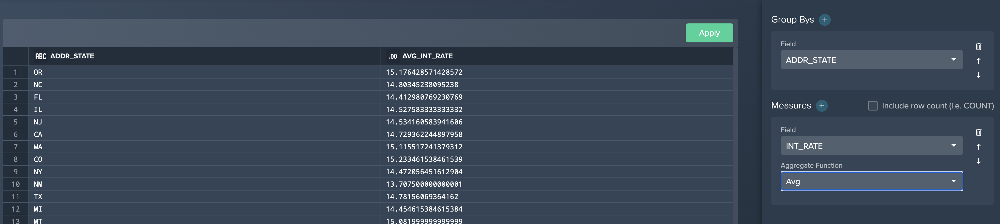

The updated pipeline flow:


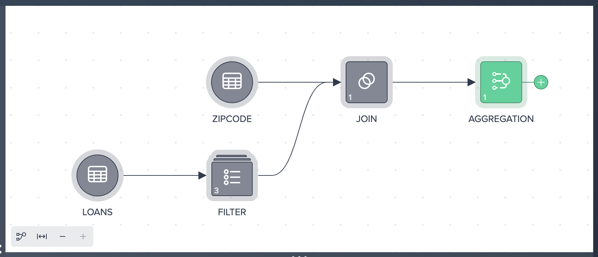


## Deploying Assets

Duration: 8

We now want to deploy our newly transformed joined and aggregated data back into Snowflake:

1. Select the **AGGREGATION** node and click **DEPLOY TO SNOWFLAKE**.
2. Select the **Table** option.
3. Name the table **LOAN_AGGREGATION**.
4. Select the **PUBLIC** schema under **PRIVATE\_DB\_\<DB_NAME\>**.
5. Select **Deploy Data**.


Your transformations are now deployed to Snowflake as a table!


## Uploading Files

Duration: 5

Users can upload files through Datameer which are then materialized as Snowflake tables. You can download a sample CSV file [here](https://datameer.box.com/s/0wfvv4gue31ng2311c81i6fq8lzivfzk).

To upload a file, perform the following:

1. Click **Upload CSV** in the ´Data Browser´.
2. Drag **loans.csv** into the upload window (or browse to the file).
3. Name the new table **LOAN_GRADES**.
4. Select the **PUBLIC** schema under **PRIVATE\_DB\_\<DB_NAME\>**.
5. Click **Upload**.

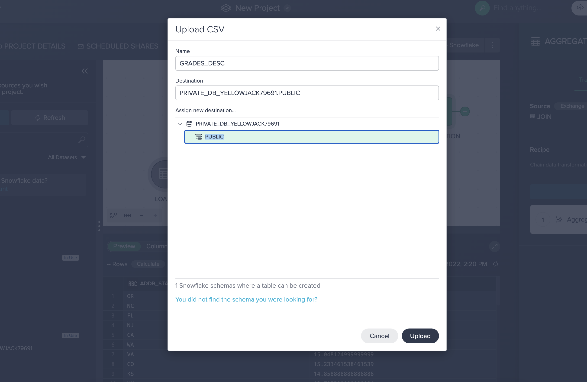

The file is now materialized as a table.

## SQL Transformations

Duration: 10

Users can also add SQL nodes as part of the overall transformation process. SQL nodes can be combined with no- or low-code nodes. We can try the following to insert a SQL node into our pipeline:


1. Click the **LOANS** node.
2. Click **New SQL Editor**.
3. Enter the following SQL:

	```SQL  
	        SELECT 
		        LOAN_ID, MEMBER_ID, LOAN_AMNT, LEFT(TERM, 2)   
		    FROM LOANS 
		    WHERE  
			    LOAN_AMNT < 10000 AND LOAN_STATUS = 'Current'  
	```  

4. Click **Apply**.

You can now see the SQL node in your Flow Area:


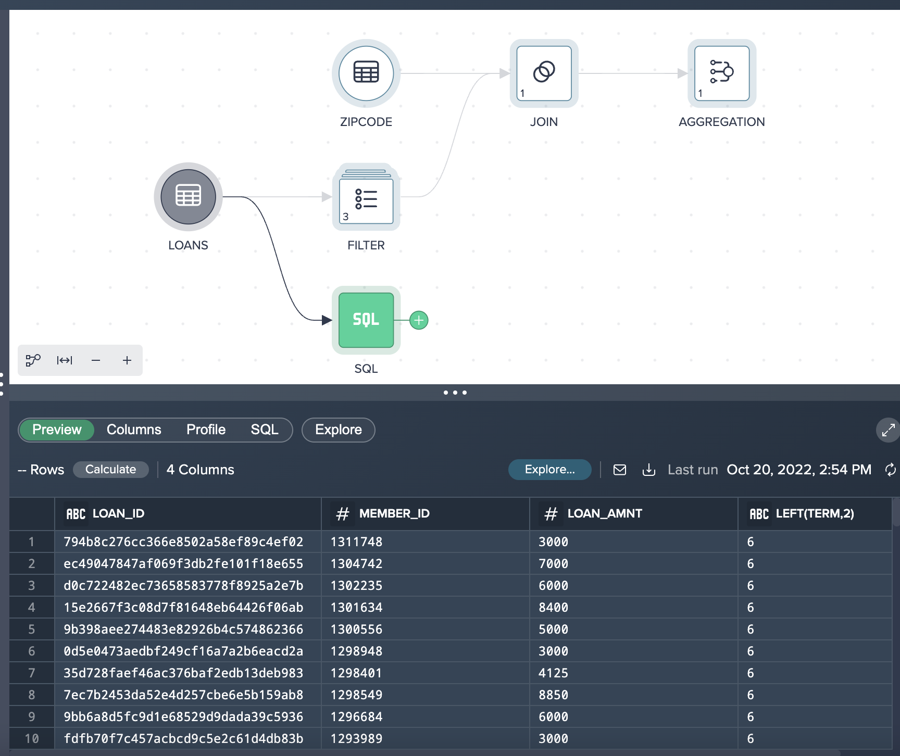


## Conclusion and Next Steps

Duration: 2

### Summary

This training was designed to be an introduction in how to use Datameer for data transformation geared towards a business user or analyst. Through this lab we have walked through how the Datameer Project Workbench enables us to quickly explore & transform Snowflake data in a self-service manner using a no-code, low-code and SQL based approach. Because Datameer is SaaS and pushes all queries to Snowflake for execution, Datameer can combine its user interface and the unlimited power of Snowflake to give users a quick & easy way to transform your data, but with no limit on the amount of data you wish to analyze. Unlock the value of all your data and users!

### Still have Questions?

We're happy to help with whatever questions you have! Reach out to us using our support address at support@datameer.com

### Other Resources

Documentation: 		         [https://documentation.datameer.com/datameer/](https://documentation.datameer.com/datameer/) 

Knowledge Base:		         [https://help.datameer.com/hc/en-us](https://help.datameer.com/hc/en-us)

Datameer Blog: 		         [https://www.datameer.com/blog/](https://www.datameer.com/blog/) 

Resources/Case Studies:         [https://www.datameer.com/resources/](https://www.datameer.com/resources/) 
