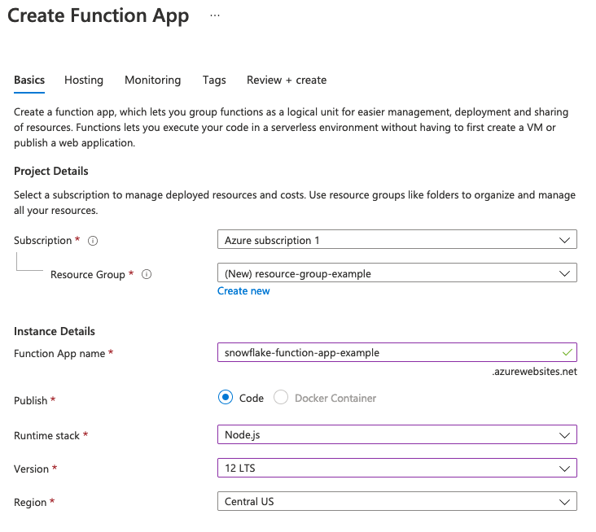
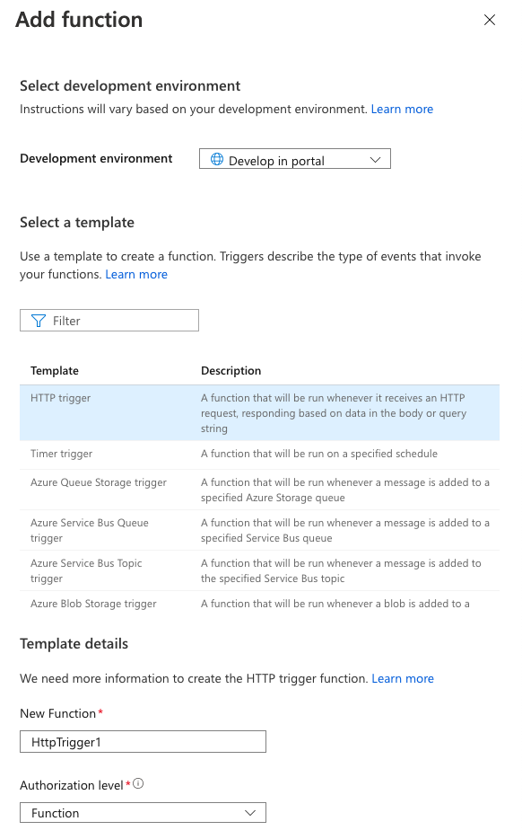
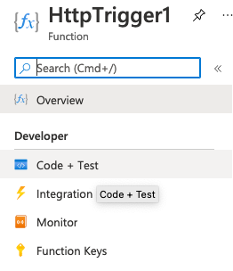
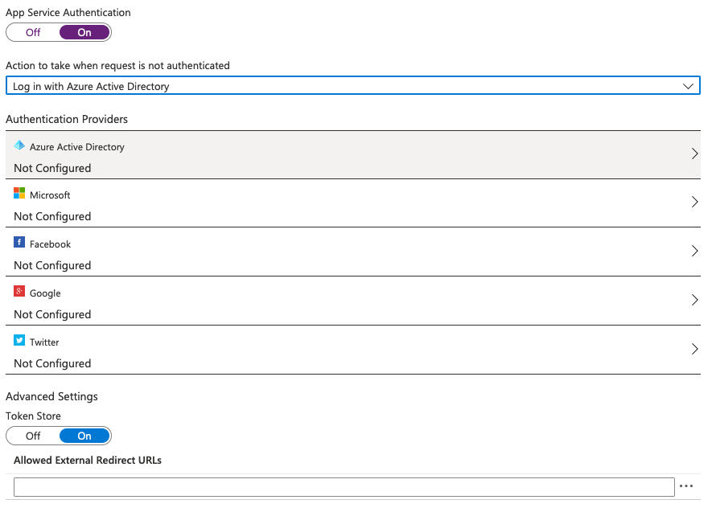
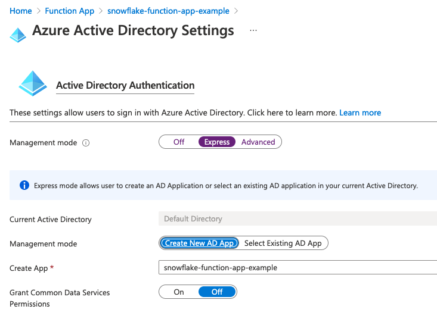
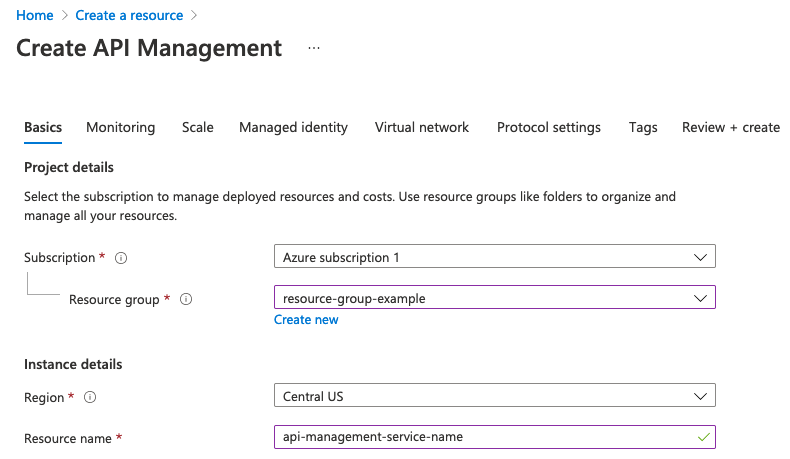
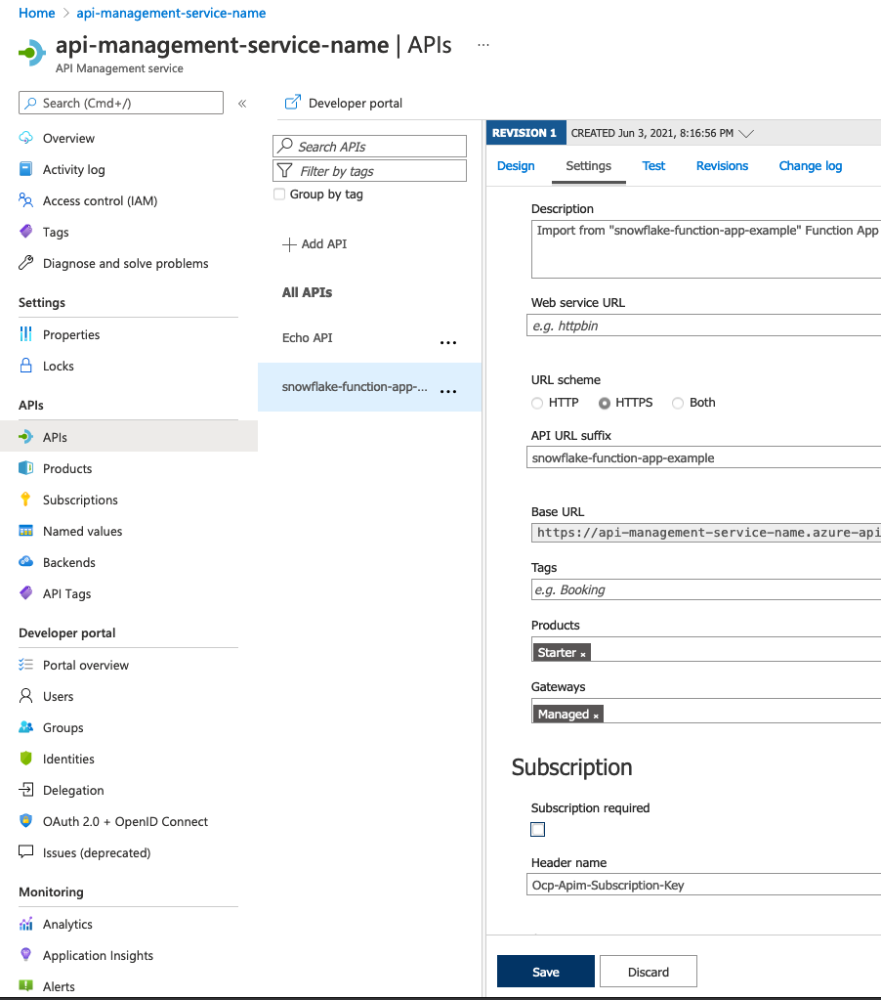

id: getting_started_external_functions_azure
summary: Getting Started With External Functions on Azure
categories: Getting Started
environments: web
status: Published
feedback link: https://github.com/Snowflake-Labs/sfguides/issues
tags: Getting Started, Data Science, Data Engineering, Azure

# Getting Started With External Functions on Azure

<!-- ------------------------ -->

## Overview

Duration: 1

This guide provides an introduction to external functions created in Azure for use in Snowflake. You will learn how you can use Snowflake’s external functions to call endpoints through Azure API management.

### Prerequisites

- Some familiarity with Azure.

### What You'll Learn

- How to create an Azure function
- How to use Snowflake's external functions
- How to call an external function through Azure API Management.

### What You'll Need

- An Azure AD (Active Directory) tenant.
- An account in that Azure AD tenant, with privileges to:
  - create an Azure Function app.
  - create a service endpoint using Azure API Management service.
  - register an Azure AD Application.
- A Snowflake account in which you have `ACCOUNTADMIN` privileges or a role with the `CREATE INTEGRATION` privilege.

### What You'll Build

- A sample external function using Azure

Negative

: There are two ways to create an external function on Azure with Snowflake. This tutorial is going over how to do so with the Azure Portal web interface. The other option is using an [Azure Resource Manager template](https://docs.snowflake.com/en/sql-reference/external-functions-creating-azure-template.html) provided by Snowflake.

<!-- ------------------------ -->

## Prepare the Tracking Worksheet

Duration: 3

Progressing through this guide will be substantially more manageable if you make a note of specific values. We've provided the following worksheet to help you organize those pieces of information. We highly recommend you use it.

```
TRACKING WORKSHEET: AZURE PORTAL

****** Azure Function (Remote Service) Info ****************************

Azure Function app name: __________________________________________________
HTTP-Triggered Function name: __________________________________________________
Azure Function AD app registration name: _______________________________________
Azure Function App AD Application ID: __________________________________________

****** Azure API Management Service (Proxy Service) Info ***************

API Management service name: ___________________________________________________
API Management API URL suffix: _________________________________________________

****** API Integration & External Function Info *********************

API Integration Name: __________________________________________________________
AZURE_MULTI_TENANT_APP_NAME: ___________________________________________________
AZURE_CONSENT_URL: _____________________________________________________________

External Function Name: ________________________________________________________
```

Once you've stashed this worksheet somewhere handy, you are ready to begin!

<!-- ------------------------ -->

## Create a New Azure Function App

Duration: 5

The first step in creating an Azure Function is to create an Azure Function app. This app will serve as a container for your function. Log into the Azure Portal, and follow the steps in the Microsoft documentation for creating an [Azure Function App](https://docs.microsoft.com/en-us/azure/azure-functions/functions-create-function-app-portal).

As you make your way through their instructions, make sure to do the following:

* When you enter a name in the **Function App Name** field, also record the name in the “Azure Function app name” field in your tracking worksheet.

* When asked to choose how to **Publish**, choose **Code**.
* When asked for the `Runtime stack`, select Node.js.
* When asked for the version of Node.js, select version 12.
* When asked which OS to run the function on, choose “Windows.”

Your information should look similar to this:



Negative

: We've selected a Node.js runtime because it allows for in-portal editing. Some languages, like Python, must be developed [locally](https://docs.microsoft.com/en-us/azure/azure-functions/functions-develop-local#local-development-environments).

Once you **create** your Azure function app, you can move on to creating an Azure Function to put in it.

<!-- ------------------------ -->

## Create an HTTP-Triggered Function

Duration: 5

You can call Azure Functions in a few ways with Azure. That being said, a Snowflake external function invokes a remote service via an HTTP POST command, so the Azure Function you create must be an “HTTP-triggered function.”

Wait until your Function App screen is displaying "Your deployment is complete." Underneath that, you'll see a dropdown called "Next Steps.” Select **Add a function** within that.

From here, you can select your development environment, which for this guide is **Develop in portal**. You're going to create an **HTTP Trigger** function, so select that template.

Then it's time to give the function a name. Record this in your tracking worksheet as "HTTP-Triggered Function Name."

And finally, enter the Authorization level. We recommend choosing **Function.**

Negative

: For more information about possible authorization levels, see the Microsoft documentation on [HTTP-triggered functions](https://docs.microsoft.com/en-us/azure/azure-functions/functions-bindings-http-webhook-trigger?tabs=csharp#configuration).

Altogether, your screen should look like this:



If it does, click **Add** at the bottom. You'll be directed to the page for that Function. In the tree menu on the left of your screen, click on **Code + Test**.



From here, you'll see the default code. Replace it with the following:

```
module.exports = async function(context, request) {
    context.log('JavaScript HTTP trigger function processed a request.');

    if (request.body) {
        var rows = request.body.data;
        var results = [];
        rows.forEach(row => {
            results.push([row[0], row]);
        });

        results = {data: results}
        context.res = {
            status: 200,
            body: JSON.stringify(results)
        };
   }
   else {
       context.res = {
           status: 400,
           body: "Please pass data in the request body."
       };
   }
};

```

Be sure to save your changes! Now let's test out what this code does.

<!-- ------------------------ -->

## Test the Function

Duration: 1

You should still be in the **Code + Test** section. From there, click **Test/Run** above your code. You can then specify the input parameters of your test.

Paste the following data into the **Body** field and click **Run**:

```
{
    "data": [ [ 0, 43, "page" ], [ 1, 42, "life, the universe, and everything" ] ]
}
```

If successful, you'll get an HTTP response code of 200 and content similar to the following:

```
{
  "data": [
    [
      0,
      [
        0,
        43,
        "page"
      ]
    ],
    [
      1,
      [
        1,
        42,
        "life, the universe, and everything"
      ]
    ]
  ]
}
```

Great! Our HTTP-triggered function is successfully created and tested in Azure. Now let's move onto the steps you need to take to integrate it with Snowflake.

<!-- ------------------------ -->

## Configure Azure AD Authentication

Duration: 10

There are a few steps that take place when an external function is called. First, Snowflake sends an HTTP POST command to a proxy service, and then that relays the command to the remote service.

In Azure's case, the proxy service is the Azure API management service, and the remote service is the Azure Function. Both of these services have authorization requirements.

For now, we'll be focusing on setting up authorization for your Azure Function App. When Snowflake authenticates with your Azure Function app, Snowflake uses OAuth [client credential](https://docs.microsoft.com/en-us/azure/active-directory/azuread-dev/v1-oauth2-client-creds-grant-flow) grant flow with Azure AD. This requires an Azure AD app registration to represent your Azure Function app.

### Enable App Service Authentication for the Azure Function App

Navigate to the **Function App** screen by searching for "Function app" in the top search bar of any Azure page. From there, click into the specific function app you're using for this guide.

There is a section labeled **Settings** with an **Authentication (classic)** option within it on the left side of your screen. Click into that.

You'll see a page with just a single option: A toggle for **App Service Authentication.** Change it from **Off** to **On**. Right below the toggle, you'll see a dropdown labeled **Action to take when request is not authenticated**. Find and select **Log in with Azure Active Directory**

Under that dropdown, you'll see a list of **Authentication Providers**. Select **Azure Active Directory.**



### Register the Azure AD App

You should have been redirected to the **Azure Active Directory Settings** screen. This is where you'll register the AD app for your Azure Function App.

For this guide, you'll be using the **Management Mode** called **Express**. Select it. After doing so, more options will appear. One will be a second **Management mode** toggle. The toggle should be on **Create New AD App**.

By default, the Azure AD app registration name in the **Create App** field is the same as the Azure Function app name. You can change this name if you want. Regardless of if you change the name or not, record the Azure AD app registration name in the “Azure Function AD app registration name” field in your tracking worksheet.



Click okay to be returned to the **Authentication (classic)** screen. Verify that the **App Service Authentication** button is **On**, then click the **Save** button at the top of the screen.

### Verify the Azure AD App

Now that your Azure AD app is registered, the last step is to verify that the app is listed under App registrations.

Get another tab in your browser opened to the [Azure Portal](http://portal.azure.com). Search for **App Registrations** in the search bar at the top of the screen.

From the **App registrations** screen, select the **All applications** tab if it is not already selected. You should see the name of the Azure AD app registration that you just created.

Positive

: You can also use the search bar to search for your Azure AD app by name. To do so, enter the first few characters of the name. The search bar assumes that you are typing the leading part of the name; it does not search for the specified substring everywhere in the function names.

You should now be at the **App registrations** screen for your Azure AD app. You need to grab a piece of information from here: the **Application (client) ID** field. Record this as the **Azure Function App AD Application ID** field in your tracking worksheet.

Negative

: Make sure you copy the ID, not the Azure AD application name. The ID should contain a UUID.

Once you have that information recorded, you're good to move on to the next step.

<!-- ------------------------ -->

## Create the Azure API Management Service

Duration: 30

Now you need to [create the API Management service](https://docs.microsoft.com/en-us/azure/api-management/get-started-create-service-instance) in the Azure Portal. You can find the correct screen by searching for **Create API Management** in the search bar.



As you create the API Management service, record the name you set as **Resource name** in the “API Management service name” field in your tracking worksheet.

Once you click **Create**, your Azure API Management service will be deployed.

Negative

: It may take upwards of a half-hour for the API management service to be created and activated. You will get an email when the process is completed.

Wait until the process is completed, and then move on to the next step.

<!-- ------------------------ -->

## Import the API Containing the Azure Function

Duration: 10

After you create the API Management service, the next step is to import and publish the Azure Function app that you'll call through that API Management service.

Microsoft has detailed instructions for [importing a function app]((https://docs.microsoft.com/en-us/azure/api-management/import-function-app-as-api). Follow their instructions with screenshots that will update as the portal changes.

They'll instruct you to navigate to the API Management Service you just created and then navigate to the **APIs** section in the menu on the left of your screen. Then you'll select **Function App** from the **Add a new API** page. Make sure to record the API URL suffix in the “API Management API URL suffix” field in your tracking worksheet.

After completing the tasks to import an Azure Function app, you should be back on the API Management service page, viewing the APIs. Click into the API you just created, and click on the **Settings** tab. There are two things to check here:

* Under **Products**, select **Starter**. For a production system, you might make a different selection.

* Under **Subscription Required**,  you can uncheck the checkbox unless you want to require a subscription.



Make sure to click the Save button.

Negative

: Snowflake strongly recommends [creating a security policy on the Azure API Management service](https://docs.snowflake.com/en/sql-reference/external-functions-creating-azure-ui-security-policy.html).

That's all you need to do in the Azure portal! The next steps will be in a Snowflake worksheet.

<!-- ------------------------ -->

## Create an API integration in Snowflake

Duration: 5

After setting up and configuring resources on Azure, you'll enable Snowflake to securely access the Azure API Management endpoint by using the following code to create the API integration.

But first, you need to have the proper permissions. Execute the USE ROLE command to use the ACCOUNTADMIN role or a role with the CREATE INTEGRATION privilege. For example:

```
use role accountadmin;
```

Now that you have the proper permissions, you can enter a [CREATE API INTEGRATION](https://docs.snowflake.com/en/sql-reference/sql/create-api-integration.html) statement. The statement should take this form:

```
create or replace api integration <integration_name>
  api_provider = azure_api_management
  azure_tenant_id = '<tenant_id>'
  azure_ad_application_id = '<azure_application_id>'
  api_allowed_prefixes = ('<url>')
  enabled = true;
```

In the statement:

* Replace `< integration_name >` with a unique integration name (e.g. `my_api_integration_name`). The name must follow the rules for [Object Identifiers](https://docs.snowflake.com/en/sql-reference/identifiers.html). Record this name in your tracking worksheet's "API Integration Name" field.

* Replace `< tenant_id >` with your Azure AD Tenant ID. As an alternative, you can use your domain (e.g. `my_company.onmicrosoft.com`). You can find your Tenant ID on the "Azure Active Directory" page.

* Replace `< azure_application_id >` with the value from your tracking worksheet's “Azure Function App AD Application ID” field.

* Replace `< url >` with the appropriate URL. Use the value in your tracking worksheet's "API Management service name" field in the following format:

```
https://<api_management_service_name>.azure-api.net
```

Positive

: You can restrict the URLs to which this API integration can be applied by appending an appropriate suffix, (from the “API Management API URL suffix” field in your tracking worksheet) in which case the URL has the following format:

```
https://<api_management_service_name>.azure-api.net/<api_url_suffix>
```

You can confirm these are the correct URLs by checking the API Management service **Settings** tab for your imported API; they should match the base URL and suffix.

Then execute the CREATE API INTEGRATION statement you entered.

<!-- ------------------------ -->

## Link the API Integration for Azure to the Proxy Service

Duration: 5

Before you can call the external function, you need to link the Snowflake API Integration to the Azure API Management Service. But first, you'll need to access some information about the API integration to create a service principal.

You can find that by using the DESCRIBE API integration command:

```
describe api integration <integration_name>;
```

From the DESCRIBE results:

- Record the name of the AZURE_MULTI_TENANT_APP_NAME column in the corresponding field in your tracking worksheet.

- Record the name of the AZURE_CONSENT_URL column in the corresponding field in your tracking worksheet.

  The URL looks similar to the following:

```
https://login.microsoftonline.com/<tenant_id>/oauth2/authorize?client_id=<snowflake_application_id>&response_type=code
```

Open the consent URL in your browser. When your browser resolves this URL, Azure automatically creates a service principal that represents Snowflake in the tenant. If Snowflake has not yet been granted access, you should see a Microsoft Permissions requested page, and you should continue to the next task.

Positive

: **You do not need to grant access again for each new external function you create for Azure.** <br> You only need to create a service principal for Snowflake once per tenancy. After Snowflake has been granted access, access does not need to be granted again.

Then click the **Accept** button. This allows the Azure service principal created for your Snowflake account to obtain an access token on any resource inside your Azure AD tenant.

Negative

: To enhance security, you should ensure that only authorized clients can access your Azure Function. You can do this after completing this lab.

At this point, you have finished creating a service principal in your tenant to represent Snowflake.

<!-- ------------------------ -->

## Create the External Function

Duration: 5

Now let's finally create the external function in Snowflake. You'll do this using a  [CREATE EXTERNAL FUNCTION](https://docs.snowflake.com/en/sql-reference/sql/create-external-function.html) statement. The statement should take the following form:

```
create or replace external function <external_function_name>(<parameters>)
    returns variant
    api_integration = <api_integration_name>
    as '<invocation_url>';
```

In the statement:

* Replace `< external_function_name >` with a unique function name (e.g. `echo`). This name must follow the rules for [Object Identifiers](https://docs.snowflake.com/en/sql-reference/identifiers.html). Record the function name in the “External Function Name” field in your tracking worksheet.
* Replace `< parameters >` with the names and SQL data types of the parameters for the function. In our example, this is `a integer, b varchar`. Record the parameter names and data types in your tracking worksheet’s “External Function Name” field.

Negative

: The parameters must correspond to the parameters expected by the remote service. The parameter names do not need to match, but the data types need to be compatible.

* Replace `< api_integration_name >` with the value from the “API Integration Name” field in your tracking worksheet.

* Replace `< invocation_url >` with the appropriate URL. This is the URL to which Snowflake sends the HTTP POST command in order to call the remote service. Use the values from the “API Management service name”, “API Management API URL suffix”, and “HTTP-Triggered Function name” fields in your tracking worksheet. It should take this form:

```
https://<api_management_service_name>.azure-api.net/<api_url_suffix>/<http_triggered_function_name>
```

After making those adjustments, execute the CREATE EXTERNAL FUNCTION command that you entered.

<!-- ------------------------ -->

## Calling the External Function

Duration: 1

At last, you have everything in place to invoke the external function in Snowflake.

Negative

: **A role must have USAGE or OWNERSHIP privileges on that external function.** <br>If appropriate, grant USAGE privilege on the external function to one or more Snowflake roles so that the roles can call the external function.

You can call your external function as you would execute any UDF. For our specific example function, the command looks like this:

```
SELECT my_external_function(42, 'Adams');
```

The returned value should be similar to:

```
[0, 42, "Adams"]
```

And just like that, you've successfully called the external function!

<!-- ------------------------ -->

## Conclusion and Next Steps

Duration: 1

Over the period of this lab, you created an Azure Function that you accessed from Snowflake. That being said, any authenticated clients can call that function as well. If you'd like to restrict the use to only Snowflake, check out our documentation on [Creating the Azure Security Policy for the Proxy Service in the Portal](https://docs.snowflake.com/en/sql-reference/external-functions-creating-azure-ui-security-policy.html).

As you explore the vast amount of options with Snowflake and Azure, you may run into complications. If you do, please turn to our [Troubleshooting External Functions for Azure](https://docs.snowflake.com/en/sql-reference/external-functions-creating-azure-troubleshooting.html) guide.

This guide is meant as merely a jumping-off point for using external functions on Azure. Be sure to check out the [detailed documentation](https://docs.snowflake.com/en/sql-reference/external-functions-creating-azure.html).