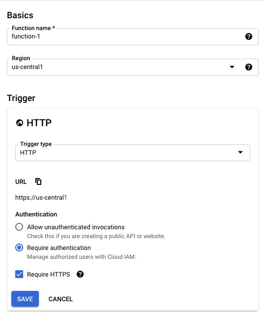
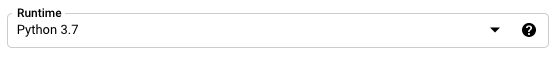
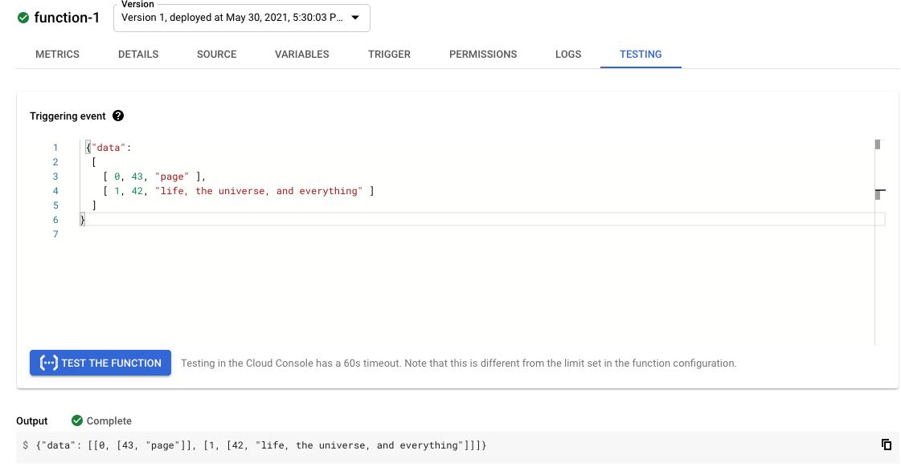
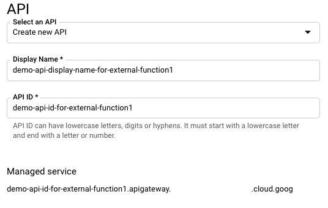
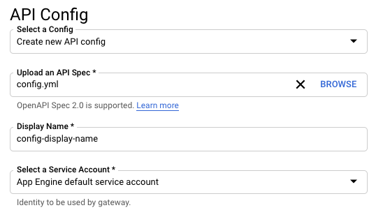
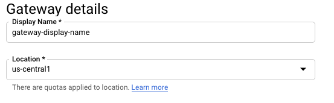

summary: Getting Started With External Functions Using the Google Cloud Console
id: getting_started_external_functions_gcc
categories: getting-started,partner-integrations
status: Published
Feedback Link: https://github.com/Snowflake-Labs/sfguides/issues
tags: Getting Started, SQL, Data Engineering, GCC, External Functions

# Getting Started With External Functions Using the Google Cloud Console

<!-- ------------------------ -->

## Overview

Duration: 1

This guide provides detailed instructions for using the Google Cloud Console user interface to create an external function hosted on GCP (Google Cloud Platform). You can use this guide either to create the sample external function we'll use or as a guide to create your own external function.

Positive

: Google also provides a command-line interface that you can use for many of these steps. For more details, see the GCP [gcloud documentation](https://cloud.google.com/api-gateway/docs/quickstart).

### Prerequisites

- Some familiarity with Google Cloud Console.

### What You'll Learn

- How to create and test a Google Cloud Function
- How to create an API integration and the external function itself in Snowflake.
- How to call an external function for GCP

### What You'll Need

- A Google Cloud [project](https://console.cloud.google.com/projectselector2/home/dashboard) ID.
- [Billing enabled](https://cloud.google.com/billing/docs/how-to/modify-project) for your Cloud Project
- The correct [services](https://cloud.google.com/functions/docs/quickstart-python#before-you-begin) enabled for your Google Cloud Project.
- A Snowflake account in which you have `ACCOUNTADMIN` privileges or a role with the `CREATE INTEGRATION` privilege.

### What You'll Build

- A sample external function with the Google Cloud Console

<!-- ------------------------ -->

## Prepare the Tracking Worksheet

Duration: 2

As you progress through this guide, you'll have to insert your own specific values to move on. To keep track of all the information you'll, we recommend you use this worksheet with fields for each of the required values:

```
================================================================================
=================== TRACKING WORKSHEET: GOOGLE CLOUD CONSOLE ===================
================================================================================

****** Cloud Function (Remote Service) Info ************************************

Cloud Function Trigger URL: ____________________________________________________


****** API Config File Info ****************************************************

Path Suffix: ___________________________________________________________________
Configuration File Name: _______________________________________________________


****** API Gateway (Proxy Service) Info ****************************************

Managed Service Identifier: ____________________________________________________
Gateway Base URL : _____________________________________________________________


****** API Integration & External Function Info ********************************

API Integration Name: __________________________________________________________
API_GCP_SERVICE_ACCOUNT: _______________________________________________________

External Function Name: ________________________________________________________


****** Security Info ***********************************************************

Security Definition Name: ______________________________________________________
```

Now that you have this worksheet by your side, we can begin!

<!-- ------------------------ -->

## Create the Google Cloud Function

Duration: 5

First, you need to create a Google Cloud function. The easiest way to do so is to use Google's [Cloud Console Quickstart](https://cloud.google.com/functions/docs/quickstarts) guide found in their documentation.

Below we will tell you what options to select when setting up the Cloud Function through Google Cloud. This guide will be using a function written in Python, so our specific instructions are based on the **Python Quickstart**.

Positive

: The Google Cloud Console also has quickstarts for other languages, such as Node.js, Go, and Java.

When you go through the Quickstart, make sure to do the following:

* Specify that the trigger for the function is HTTP.

* Copy the trigger **URL** to the “Cloud Function Trigger URL” field in your tracking worksheet.
* If **Require HTTPS** is not already enabled, then enable it.
* Click **Save**.
* Click **Next**.



Negative

: The GCP instructions say to select **Allow unauthenticated invocations**. That is acceptable for sample functions, including the one in this guide, but most production systems should require authentication. We recommend you select "Require authentication."

Before pasting in any code, select an appropriate **Runtime**. For this guide's example, choose the Python 3.7 runtime.



Then, replace the default code with this sample code:

```python
import json

HTTP_SUCCESS = 200
HTTP_FAILURE = 400

def echo(request):
    try:
        # The list of rows to return.
        return_value = []

        payload = request.get_json()
        rows = payload["data"]

        # For each input row
        for row in rows:
            # Include the row number.
            row_number = row[0]
            # Combine the value(s) in the row into a Python list that will be treated as an SQL VARIANT.
            row_value = row[1:]
            row_to_return = [row_number, row_value]
            return_value.append(row_to_return)

        json_compatible_string_to_return = json.dumps( { "data" : return_value } )
        return (json_compatible_string_to_return, HTTP_SUCCESS)

    except:
        return(request.data, HTTP_FAILURE)
```

This code combines the input parameter values into a single list (array) and returns that list as a single value of SQL type VARIANT.

Negative

: Ensure that the **Entry point** matches the function’s name (in this case, `echo`).

Then click **Deploy** to finalize the creation. Now let's test the function out.

<!-- ------------------------ -->

## Test the Google Cloud Function

Duration: 2

After you finish creating the Google Cloud Function, use the **Testing** tab in the console to call the function to make sure that it works as expected. You can also access this tab by clicking the three dots for the function and selecting **Test function**.

For our example, replace any default data in the **Testing** tab with the following test data:

```
{ "data":
 [
  [ 0, 43, "page" ],
  [ 1, 42, "life, the universe, and everything" ]
 ]
}
```

The execution results should be similar to:

```
{"data":
 [
  [0, [43, "page"] ],
  [1, [42, "life, the universe, and everything"] ]
 ]
}
```

Negative

: The results might be displayed in a different format from the example shown above.



If the test succeeded, congratulations! You now have a Google Cloud Function that you can use as the remote service for your external function.

<!-- ------------------------ -->

## Create an API Definition

Duration: 5

Snowflake does not send data (HTTP POST requests) directly to a remote service. Instead, Snowflake sends the data to a proxy service that relays the data from Snowflake to the remote service (i.e., GCP Cloud Function) and back again.

Positive

: **Links to Related Google Documentation** <br> For more detailed information about using the Google Cloud Console to perform the tasks described in this guide, see the sections on [creating an API definition](https://cloud.google.com/api-gateway/docs/quickstart-console#creating_an_api_definition) and [creating a gateway](https://cloud.google.com/api-gateway/docs/quickstart-console#creating_a_gateway) in the [Quickstart for Deploying an API/API Gateway using the Google Cloud Console](https://cloud.google.com/api-gateway/docs/quickstart-console).

Create and customize a YAML-formatted configuration file that specifies the API you are creating on your local file system. The file should have the `.yaml` or `.yml` extension. Use this template:

```
swagger: '2.0'
info:
 title: API Gateway config for Snowflake external function.
 description: This configuration file connects the API Gateway resource to the remote service (Cloud Function).
 version: 1.0.0
schemes:
 - https
produces:
 - application/json
paths:
 /<PATH>:
  post:
   summary: Echo the input.
   operationId: echo
   x-google-backend:
    address: <HTTP ENDPOINT TO ROUTE REQUEST TO>
    protocol: h2
   responses:
    '200':
     description: <DESCRIPTION>
     schema:
      type: string
```

There are a few fields that you need to fill in or update. Let's go through those now.

First, replace `&lt; PATH >` with a unique name. This will be incorporated into URLs, so use only characters that are valid in URLs. For our example, you can enter `demo-func-resource`.

Unlike the other fields in this configuration file, the `&lt; PATH >` value is entered *before* the colon. This the correct format:

```
paths:
 /demo-func-resource:
```

The pathname should **not** contain any [path parameters](https://swagger.io/docs/specification/2-0/describing-parameters/#path-parameters). While Google does support path parameters when setting the path to a URL, Snowflake does **not** support path parameters in the corresponding URL specified in the `CREATE EXTERNAL FUNCTION` statement.

Then copy the path (e.g. `demo-func-resource`) you just named to the “Path Suffix” field in your tracking worksheet.

Next, find the `address` field under the `x-google-backend` field, and replace `<HTTP ENDPOINT TO ROUTE REQUEST TO>` with the value from the “Cloud Function Trigger URL” field in your tracking worksheet. The result should look similar to:

```
x-google-backend:
 address: https:// ...
```

The URL should not be enclosed in quotation marks. Since you selected **Require HTTPS** when creating the Google Cloud Function, ensure that the URL you enter into the address field starts with `https`.

Positive

: The URL does not need to be an endpoint hosted by Google; it can be the path to any HTTP endpoint.

Optionally, you can also update any of the following values:

- `title` in the `info` section.

- `description` in the `info` section.

- `operationId` in the `post` subsection of the `paths` section.

- `summary` in the `post` subsection of the `paths` section.

Review your sample configuration file. It should look similar to the following:

```
swagger: '2.0'
info:
 title: "API Gateway config for Snowflake external function"
 description: "This configuration file connects the API Gateway resource to the remote service (Cloud Function)."
 version: 1.0.0
schemes:
 - https
produces:
 - application/json
paths:
 /demo-func-resource:
  post:
   summary: "echo the input"
   operationId: echo
   x-google-backend:
    address: https://my_dev.cloudfunctions.net/demo-cloud-function-01
    protocol: h2
   responses:
    '200':
     description: echo result
     schema:
      type: string
```

Once you've made all the changes, be sure to save the configuration file. Then, record the file path and name in the “Configuration File Name” field in your tracking worksheet.

<!-- ------------------------ -->

## Create an API Gateway

Duration: 10

Three steps together make up creating an API Gateway. Let's walk you through them now.

### Create a GCP API

First, you need to create a *GCP API*, a container containing one or more API Gateways and one or more configuration files.

Go to the **Google Cloud API Gateway** screen by clicking on the GCP menu and selecting **API Gateway**. You can also search for it in the search bar at the top of any Google Cloud Platform page. Then:

1. Click on **CREATE GATEWAY.**

2. Enter the **Display Name** and the **API ID** (e.g. `demo-api-display-name-for-external-function1` and `demo-api-id-for-external-function1`).



Positive

: You do not need to record these values in your tracking worksheet. However, you might want to record the API ID so you can delete it when you are done with it.

### Create an API Config

After creating a GCP API, you need to create an API Config. You create an API config when you upload your configuration file to the console.

Scroll to the **API Config** section of the screen and search for the field that contains **Upload an API Spec**. Click on **BROWSE** and select your configuration file.

Positive

: The name of your configuration file was recorded in the “Configuration File Name” field in your tracking worksheet.

Enter a display name into the field that contains **Display Name**.

Finally, **select a service account**. For this example, select **App Engine default service account**. If you are creating a function to use in production (rather than as a sample), you might choose a different service account.



Negative

: The selected service account must have appropriate privileges, including privileges to call the Cloud Function.

### Create a Gateway with the API Config

Scroll to the **Gateway details** section of the screen and enter the **Display Name** of the new API Gateway.

Then, click in the **Location** field and select the appropriate region (e.g. `us-central1`).



Click on **CREATE GATEWAY**. This will take you to the **APIs** screen and shows you a list of your APIs.

Negative

: If your new API is not visible immediately, wait a few minutes, then click the **Refresh** button.

You'll need to copy the value of the API’s **Managed Service** to the “Managed Service Identifier” field in your tracking worksheet.

Once you've copied that down, click on the name of the API. You should see four tabs:

* **OVERVIEW**
* **DETAILS**
* **CONFIGS**
* And **GATEWAYS**

Click on the **GATEWAYS** tab; You'll want to copy the **Gateway URL** to the “Gateway Base URL” field in your tracking worksheet.

<!-- ------------------------ -->

## Create the API Integration

Duration: 3

Now let's go over how to create an API integration object in Snowflake to work with your proxy service (i.e., Google Cloud API Gateway).

You can create the API integration object using the  [CREATE API INTEGRATION](https://docs.snowflake.com/en/sql-reference/sql/create-api-integration.html) command within Snowflake. To do so, first, you'll need to be logged into the Snowflake web interface and on the Worksheets page.

From the Worksheets page, execute the USE ROLE command to use the ACCOUNTADMIN role or a role with the CREATE INTEGRATION privilege. For example:

```
use role accountadmin;
```

Once you are using the necessary role, you can create the API integration object. Enter a CREATE API INTEGRATION statement that takes this form:

```
create or replace api integration <integration_name>
  api_provider = google_api_gateway
  google_audience = '<google_audience_claim>'
  api_allowed_prefixes = ('<url>')
  enabled = true;
```

In the statement:

* Replace `&lt; integration_name >` with a unique integration name (e.g. `my_api_integration_name`). The name must follow the rules for [Object Identifiers](https://docs.snowflake.com/en/sql-reference/identifiers.html). Be sure to record the integration name in your tracking worksheet’s “API Integration Name” field.

* For `google_audience`, replace `&lt; google_audience_claim >` with the value from the “Managed Service Identifier” field in your tracking worksheet.

Positive

: During authentication, Snowflake passes a JWT (JSON Web Token) to Google. The JWT contains an “aud” (“audience”) claim, which Snowflake sets to the value for `google_audience`. For more information about authenticating with Google, see the Google service account [authentication documentation](https://cloud.google.com/api-gateway/docs/authenticate-service-account#configure_auth).

* For `api_allowed_prefixes`, replace `&lt; url >` with the value from the “Gateway Base URL” field in your tracking worksheet. This field allows you to restrict the URLs to which this API integration can be applied.

Once you've made the necessary adjustments to the statement, execute the CREATE API INTEGRATION statement.

After executing, we'll need to grab some additional information. Execute the [DESCRIBE INTEGRATION](https://docs.snowflake.com/en/sql-reference/sql/desc-integration.html) command:

```
describe integration <integration_name>;
```

Look at the results; Record the value for `API_GCP_SERVICE_ACCOUNT` in the “API_GCP_SERVICE_ACCOUNT” field in your tracking worksheet.

Now we have everything we need to create the external function!

<!-- ------------------------ -->

## Create the External Function

Duration: 3

Now it's time to discuss how to create an external function object in Snowflake. This object stores information about the remote service, such as the parameters that the remote service accepts.

Negative

: External functions in Snowflake are database objects, meaning they must be created in a schema in a database. To create an external function, you must have the appropriate privileges on the database and schema where you are creating the function. For more details, see [Access Control Privileges](https://docs.snowflake.com/en/user-guide/security-access-control-privileges.html).

You should still be on the Worksheets page of the Snowflake web interface. From there, you will enter a [CREATE EXTERNAL FUNCTION](https://docs.snowflake.com/en/sql-reference/sql/create-external-function.html) statement that takes the following form:

```
create or replace external function <external_function_name>(<parameters>)
  returns variant
  api_integration = <api_integration_name>
  as '<function_url>';
```

Again, you'll need to modify the function to have your own specific parameters:

* Replace `&lt; external_function_name >` with a unique function name (e.g. `echo`). This name must follow the rules for [Object Identifiers](https://docs.snowflake.com/en/sql-reference/identifiers.html). Record this name in the “External Function Name” field in your tracking worksheet.

* Replace `&lt; parameters >` with the names and SQL data types of the parameters for the function, if any. Record the parameter names and data types in your tracking worksheet’s “External Function Name” field. For our example:

```
a integer, b varchar
```

Negative 

: The parameters must correspond to the parameters expected by the remote service. The parameter names do not need to match, but the data types need to be compatible. 

* Replace `&lt; api_integration_name >` with the value from the “API Integration Name” field in your tracking worksheet.

* Replace `&lt; function_URL >` with the values from the “Gateway Base URL” and “Path Suffix” fields, separated by a forward slash (`/`). The URL should look similar to:

```
https://<gateway-base-url>/<path-suffix>
```

After making those changes, execute the CREATE EXTERNAL FUNCTION command.

You should now be able to call your external function. Let's go over how to do that next.

<!-- ------------------------ -->

## Calling the External Function

Duration: 1

Now it's finally time to call the external function!

Negative

: **A role must have USAGE or OWNERSHIP privileges on that external function.** <br> If appropriate, grant USAGE privilege on the external function to one or more Snowflake roles so that the roles can call the external function.

You can call your external function as you would execute any UDF. For our specific example function, the command looks like this:

```
select <external_function_name>(42, 'Life, the Universe, and Everything');
```

The returned value should be similar to:

```
[42, "Life, the Universe, and Everything"]
```

Negative

: External functions are schema objects, so the schema containing the function must be in use in your session, or you must specify the fully qualified name of the function when calling it.

Great! You've successfully created and called an external function for GCP!

<!-- ------------------------ -->

## Conclusion & Next Steps

Duration: 1

In the previous steps, you created a Google Cloud Function that can be called by anyone who has the correct Google Cloud API Gateway endpoint.

Unless you want the endpoint to be open to the public, you should secure it by creating a security policy on the Google Cloud API Gateway. The Snowflake [documentation](https://docs.snowflake.com/en/sql-reference/external-functions-creating-gcp-ui-security-policy.html) provides instructions for creating a security policy for the API Gateway by adding a customized `securityDefinitions` section to the configuration file for the API definition.

As you delve into creating a function on GCP, you may need to troubleshoot specific issues. If you do, be sure to turn to our [Troubleshooting External Functions for GCP](https://docs.snowflake.com/en/sql-reference/external-functions-creating-gcp-troubleshooting.html) guide to help you in that process.