author: Scott Teal, Brad Culberson, Vino Duraisamy
id: getting_started_iceberg_tables
summary: This is a sample Snowflake Guide
categories: Getting-Started
environments: web
status: Published 
feedback link: https://github.com/Snowflake-Labs/sfguides/issues
tags: Getting Started, Data Lake, Iceberg

# Getting Started with Iceberg Tables
<!-- ------------------------ -->
## Overview 
Duration: 1

This guide is designed to help you understand the capabilities included in Snowflake’s support for Apache Iceberg. Iceberg Tables, a new type of Snowflake table in public preview, bring Snowflake’s easy platform management and great performance to data stored externally in the open source Apache Iceberg format.

> aside negative
> 
>  Iceberg Tables are currently in public preview.

### Prerequisites
- Familiarity with Snowflake
- Familiarity with cloud object storage
- Familiarity with SQL
- Familiarity with Apache Iceberg
- Familiarity with Apache Spark

### What You’ll Learn 
- How to create a Snowflake-managed Iceberg Table
- How to apply governance policies on an Iceberg Table
- How Snowpark can be used for Iceberg Table pipelines
- How to share an Iceberg Table
- How to access a Snowflake-managed Iceberg Table from Apache Spark

### What You’ll Need 
- A Snowflake account. A [free trial](https://signup.snowflake.com/) will suffice. [Standard Edition](https://docs.snowflake.com/en/user-guide/intro-editions#standard-edition) will work for most of this lab, but if you’d like to try governance features covered in section 4, you will need [Enterprise](https://docs.snowflake.com/en/user-guide/intro-editions#enterprise-edition) or [Business Critical Edition](https://docs.snowflake.com/en/user-guide/intro-editions#business-critical-edition).
- A storage bucket with the same cloud provider in the same region that hosts your Snowflake account above. Direct credential access required as storage integrations are not supported for External Volumes.

### What You’ll Build 
- A simple, open data lakehouse with Snowflake, Iceberg, and your cloud of choice

<!-- ------------------------ -->
## Setup your Environment
Duration: 10

### Install Conda, Spark, Jupyter

In this quickstart, you can use Conda to easily create a development environment and download necessary packages. This is only needed if you choose to follow the last section for using Spark to read Snowflake-managed Iceberg Tables. This is not required to create or use Iceberg Tables on Snowflake. Here are instructions for installing Conda:
- [Mac](https://docs.conda.io/projects/conda/en/latest/user-guide/install/macos.html)
- [Windows](https://docs.conda.io/projects/conda/en/stable/user-guide/install/linux.html)
- [Linux](https://docs.conda.io/projects/conda/en/stable/user-guide/install/linux.html)

Either download [this file](https://github.com/Snowflake-Labs/sfguide-getting-started-with-iceberg-tables/blob/main/environment.yml), or create a file named environment.yml with the following contents.

```yaml
name: iceberg-lab
channels:
  - conda-forge
dependencies:
  - findspark=2.0.1
  - jupyter=1.0.0
  - pyspark=3.5.0
  - openjdk=11.0.13
```

To create the environment needed, run the following in your shell.

```
conda env create -f environment.yml
```

### Setup Snowflake

Create a database, schema, warehouse, role, and user called `ICEBERG_LAB` in your Snowflake account.

```sql
CREATE WAREHOUSE iceberg_lab;
CREATE ROLE iceberg_lab;
CREATE DATABASE iceberg_lab;
CREATE SCHEMA iceberg_lab;
GRANT ALL ON DATABASE iceberg_lab TO ROLE iceberg_lab WITH GRANT OPTION;
GRANT ALL ON SCHEMA iceberg_lab.iceberg_lab TO ROLE iceberg_lab WITH GRANT OPTION;;
GRANT ALL ON WAREHOUSE iceberg_lab TO ROLE iceberg_lab WITH GRANT OPTION;;

CREATE USER iceberg_lab
    PASSWORD='<your desired password>',
    LOGIN_NAME='ICEBERG_LAB',
    MUST_CHANGE_PASSWORD=FALSE,
    DISABLED=FALSE,
    DEFAULT_WAREHOUSE='ICEBERG_LAB',
    DEFAULT_NAMESPACE='ICEBERG_LAB.ICEBERG_LAB',
    DEFAULT_ROLE='ICEBERG_LAB';

GRANT ROLE iceberg_lab TO USER iceberg_lab;
GRANT ROLE iceberg_lab TO USER <your username>;
GRANT ROLE accountadmin TO USER iceberg_lab;
```

### Generate Public and Private Keys

Your local Spark client will connect to Snowflake via the [JDBC driver](https://docs.snowflake.com/en/developer-guide/jdbc/jdbc). For mac, open a terminal window, navigate to your working directory, then run these two commands. For PC, you can use [this tool](https://www.cryptool.org/en/cto/openssl) to run the same commands below, and download the `/rsa_key.p8` and `/rsa_key.pub` files from the Files tab.

```bash
openssl genrsa 2048 | openssl pkcs8 -topk8 -inform PEM -out rsa_key.p8 -nocrypt
openssl rsa -in rsa_key.p8 -pubout -out rsa_key.pub
```

Open file rsa_key.pub with a simple text editor copy your key, which is everything in-between the "- - - -" lines. If ‘openssl' command is not found, you need to review your Java installation before proceeding.

Now in a Snowflake SQL worksheet, run the command below after pasting your username and key.

```sql
USE ROLE accountadmin;
ALTER USER iceberg_lab SET rsa_public_key='<paste your public key here>';
```

<!-- ------------------------ -->
## Create an Iceberg Table
Duration: 10

### Create an External Volume

Before you create an Iceberg table, you must have an external volume. An external volume is a Snowflake object that stores information about your cloud storage locations and identity and access management (IAM) entities (for example, IAM roles). Snowflake uses an external volume to establish a connection with your cloud storage in order to access Iceberg metadata and Parquet table data.

To create an external volume, complete the instructions for your cloud storage service:
- [Accessing Amazon S3 using external volumes](https://docs.snowflake.com/en/user-guide/tables-iceberg-configure-external-volume#configure-an-external-volume-for-amazon-s3)
- [Accessing Google Cloud Storage using external volumes](https://docs.snowflake.com/en/user-guide/tables-iceberg-configure-external-volume#configure-an-external-volume-for-google-cloud-storage)
- [Accessing Microsoft Azure Storage using external volumes](https://docs.snowflake.com/en/user-guide/tables-iceberg-configure-external-volume#configure-an-external-volume-for-azure-storage)

Prior to creating the external volume, be sure to use the `ACCOUNTADMIN` role.

```sql
USE ROLE accountadmin;
```

Name the external volume you create `iceberg_lab_vol`.

After the external volume is created, use the `ACCOUNTADMIN` role to grant usage to the `ICEBERG_LAB` role.

```sql
GRANT ALL ON EXTERNAL VOLUME iceberg_lab_vol TO ROLE iceberg_lab WITH GRANT OPTION;
```

### Create a Snowflake-managed Iceberg Table

Iceberg Tables can either use Snowflake, AWS Glue, or object storage as the catalog. In this quickstart, we use Snowflake as the catalog to allow read and write operations to tables. More information about integrating catalogs can be found [here](https://docs.snowflake.com/en/user-guide/tables-iceberg-configure-catalog-integration).

Create an Iceberg Table referencing the external volume you just created. You can specify `BASE_LOCATION` to instruct Snowflake where to write table data and metadata, or leave empty to write data and metadata to the location specified in the external volume definition.

```sql
USE ROLE iceberg_lab;
USE DATABASE iceberg_lab;
USE SCHEMA iceberg_lab;
CREATE OR REPLACE ICEBERG TABLE customer_iceberg (
    c_custkey INTEGER,
    c_name STRING,
    c_address STRING,
    c_nationkey INTEGER,
    c_phone STRING,
    c_acctbal INTEGER,
    c_mktsegment STRING,
    c_comment STRING
)  
    CATALOG='SNOWFLAKE'
    EXTERNAL_VOLUME='iceberg_lab_vol'
    BASE_LOCATION='';
```

### Load Data

There are multiple ways to load new data into Snowflake-managed Iceberg Tables including INSERT, [COPY INTO](https://docs.snowflake.com/en/sql-reference/sql/copy-into-table), and [Snowpipe](https://docs.snowflake.com/en/user-guide/data-load-snowpipe-auto).

For this quickstart, we will INSERT data from the sample tables in your Snowflake account to an Iceberg Table. This will write Parquet files and Iceberg metadata to your external volume.

```sql
INSERT INTO customer_iceberg
  SELECT * FROM snowflake_sample_data.tpch_sf1.customer;
```

If you check your cloud storage bucket, you should now see files that Snowflake has written as part of table creation. While Snowflake writes these files automatically, you can also use a [function](https://docs.snowflake.com/en/sql-reference/functions/system_get_iceberg_table_information) to generate table metadata files that capture any data manipulation language (DML) changes that have been made since the last time Iceberg metadata was generated.

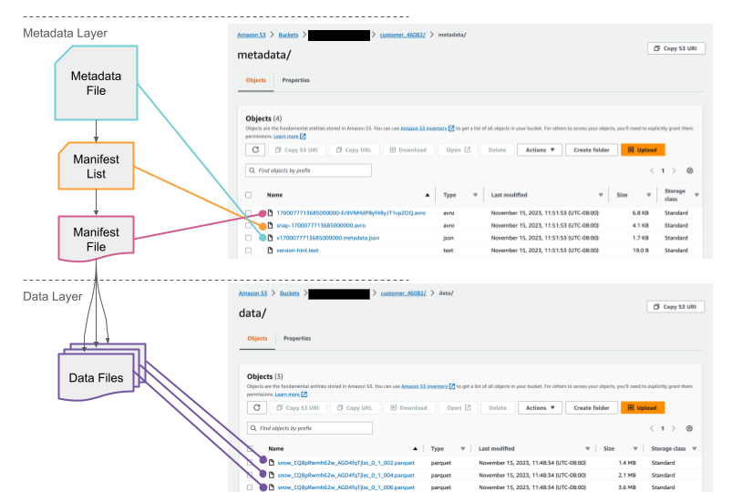

### Query and Time Travel

Iceberg Tables are treated much like other tables in Snowflake. For example, you can read different table types in a single query. This query is joining an Iceberg Table with a traditional Snowflake Table.

```sql
SELECT
    *
FROM customer_iceberg c
INNER JOIN snowflake_sample_data.tpch_sf1.nation n
    ON c.c_nationkey = n.n_nationkey;
```

Benefits of the additional metadata that table formats like Iceberg and Snowflake’s provide are, for example, time travel.

Let’s first make a simple update to the table. Then, you can see that the row count has increased compared to the previous version of the table.

```sql
INSERT INTO customer_iceberg
    SELECT
        *
    FROM snowflake_sample_data.tpch_sf1.customer
    LIMIT 5;


SELECT
    count(*) AS after_row_count,
    before_row_count
FROM customer_iceberg
JOIN (
        SELECT count(*) AS before_row_count
        FROM customer_iceberg BEFORE(statement => LAST_QUERY_ID())
    )
    ON 1=1
GROUP BY 2;
```

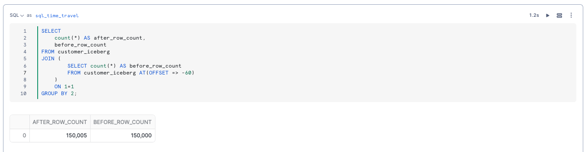

<!-- ------------------------ -->
## Governance on Iceberg Tables
Duration: 7

Governance and access controls work on Iceberg Tables just like internal tables. As described in the overview section, all of these features require Enterprise or Business Critical Edition of Snowflake.

### Row-level Security

Suppose you need to control row-level access to an Iceberg Table for users having different roles. In this example, let's have a role that can see the US customers and one that only sees the non-US customers.

This can be done with a [row access policy](https://docs.snowflake.com/en/user-guide/security-row-using) on the Iceberg Table.

```sql
USE ROLE accountadmin;
CREATE ROLE tpch_us;
GRANT ROLE tpch_us TO USER <your username>;
CREATE ROLE tpch_intl;
GRANT ROLE tpch_intl TO USER <your username>;

USE ROLE iceberg_lab;
USE DATABASE iceberg_lab;
USE SCHEMA iceberg_lab;

CREATE OR REPLACE ROW ACCESS POLICY rap_nation
AS (nation_key number) RETURNS BOOLEAN ->
  ('TPCH_US' = current_role() and nation_key = 24) OR
  ('TPCH_INTL' = current_role() and nation_key != 24)
;

ALTER ICEBERG TABLE customer_iceberg
ADD ROW ACCESS POLICY rap_nation ON (c_nationkey);

GRANT ALL ON DATABASE iceberg_lab TO ROLE tpch_intl;
GRANT ALL ON SCHEMA iceberg_lab.iceberg_lab TO ROLE tpch_intl;
GRANT ALL ON ICEBERG TABLE iceberg_lab.iceberg_lab.customer_iceberg TO ROLE tpch_intl;
GRANT ALL ON DATABASE iceberg_lab TO ROLE tpch_us;
GRANT ALL ON SCHEMA iceberg_lab.iceberg_lab TO ROLE tpch_us;
GRANT ALL ON ICEBERG TABLE iceberg_lab.iceberg_lab.customer_iceberg TO ROLE tpch_us;
GRANT USAGE ON EXTERNAL VOLUME iceberg_lab_vol TO ROLE tpch_intl;
GRANT USAGE ON EXTERNAL VOLUME iceberg_lab_vol TO ROLE tpch_us;
GRANT USAGE ON WAREHOUSE iceberg_lab TO ROLE tpch_us;
GRANT USAGE ON WAREHOUSE iceberg_lab TO ROLE tpch_intl;
```

There are two separate roles to grant to Snowflake users, which allow them to see a subset of customers, either international or us.

```sql
USE ROLE tpch_intl;
USE WAREHOUSE iceberg_lab;
SELECT
    count(*)
FROM iceberg_lab.iceberg_lab.customer_iceberg;
```

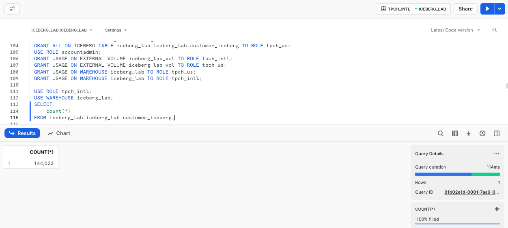

```sql
USE ROLE tpch_us;
USE WAREHOUSE iceberg_lab;
SELECT
    count(*)
FROM iceberg_lab.iceberg_lab.customer_iceberg;
```

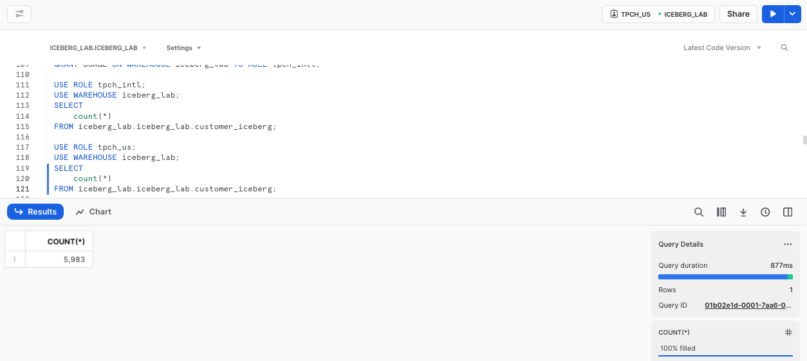


### Column-level Security

We want the team of analysts to be able to query the customer table but not see their name(c_name), address (c_address), or phone number(c_phone). To do so, we need to grant them access to all the rows but mask those fields. 

We can do that with a [masking policy](https://docs.snowflake.com/en/user-guide/security-column-ddm-use).

```sql
USE ROLE accountadmin;
CREATE ROLE tpch_analyst;
GRANT ROLE tpch_analyst TO USER <your username>;

USE ROLE iceberg_lab;
ALTER ROW ACCESS POLICY rap_nation
SET body ->
  ('TPCH_US' = current_role() and nation_key = 24) or
  ('TPCH_INTL' = current_role() and nation_key != 24) or
  ('TPCH_ANALYST' = current_role()) or 
  ('ICEBERG_LAB' = current_role())
;

GRANT ALL ON DATABASE iceberg_lab TO ROLE tpch_analyst;
GRANT ALL ON SCHEMA iceberg_lab.iceberg_lab TO ROLE tpch_analyst;
GRANT ALL ON TABLE iceberg_lab.iceberg_lab.customer_iceberg TO ROLE tpch_analyst;
GRANT USAGE ON WAREHOUSE iceberg_lab TO ROLE tpch_analyst;
GRANT USAGE ON EXTERNAL VOLUME iceberg_lab_vol TO ROLE tpch_analyst;
USE ROLE iceberg_lab;

CREATE OR REPLACE MASKING POLICY pii_mask AS (val string) RETURNS string ->
    CASE
        WHEN 'TPCH_ANALYST' = current_role() THEN '*********'
        ELSE val
    END;

ALTER ICEBERG TABLE customer_iceberg MODIFY COLUMN c_name SET MASKING POLICY pii_mask;
ALTER ICEBERG TABLE customer_iceberg MODIFY COLUMN c_address SET MASKING POLICY pii_mask;
ALTER ICEBERG TABLE customer_iceberg MODIFY COLUMN c_phone SET MASKING POLICY pii_mask;

USE ROLE tpch_analyst;
SELECT
    *
FROM customer_iceberg;
```

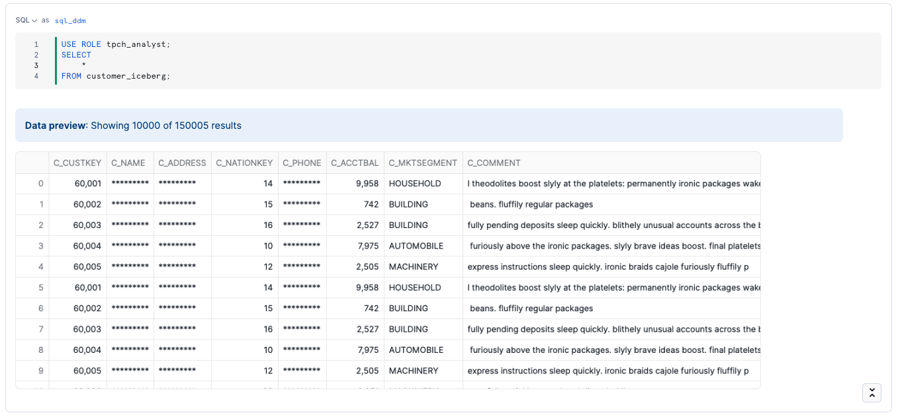

Other governance features can be applied to Iceberg Tables, including [object tagging](https://docs.snowflake.com/en/user-guide/object-tagging), and [tag-based masking](https://docs.snowflake.com/en/user-guide/tag-based-masking-policies).

### Monitor Governance in Snowsight

As a data administrator, you can use the built-in Dashboard and Tagged Objects interfaces to monitor and report on the usage of policies and tags with tables, views, and columns. This includes policies and tags applied to Iceberg Tables.

Using the `ACCOUNTADMIN` role, or an account role that is granted the `GOVERNANCE_VIEWER` and `OBJECT_VIEWER` database roles, click **Data » Governance** to navigate to these interfaces. You can see the policies applied to the Iceberg Table.

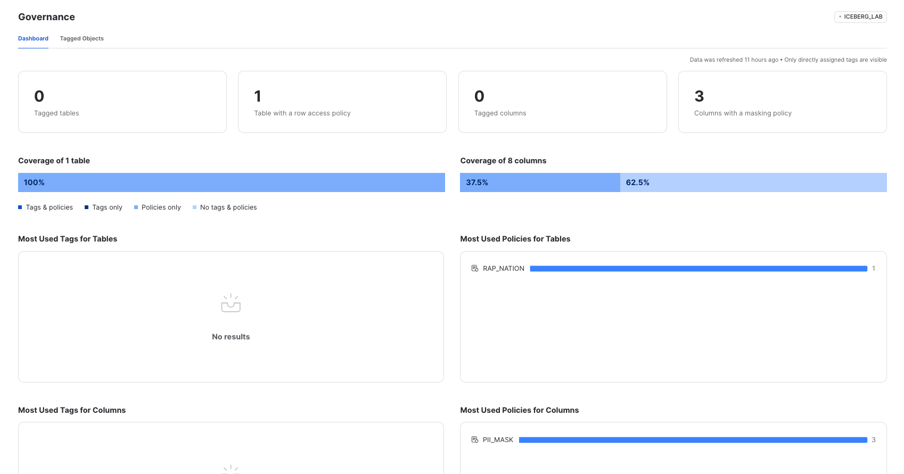

And if you notice certain tables are missing tags or policies, you can modify, create, and apply them directly from the interface.

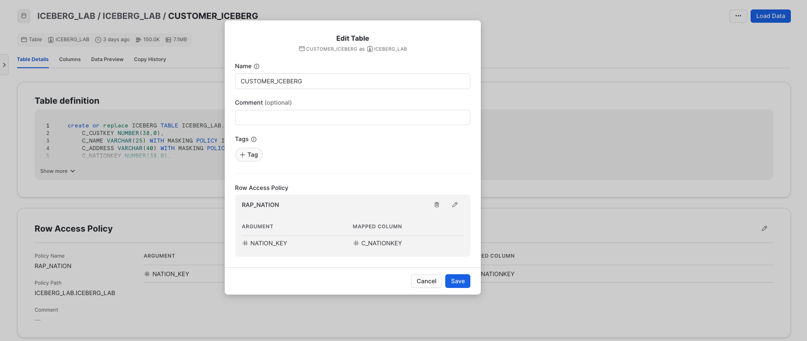

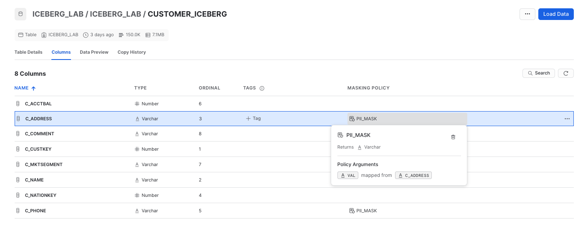

<!-- ------------------------ -->
## Processing Iceberg Tables with Snowpark
Duration: 3

Snowpark is a set of libraries and runtimes in Snowflake that securely deploy and process non-SQL code, including Python, Java and Scala. Snowpark can be used for data science and data engineering pipelines, with key benefits including:
- Support for pushdown for all operations, leaving heavy lifting up to Snowflake and allowing you to efficiently work with data of any size.
- All of the computations are done within Snowflake – no separate cluster provision, scale, and secure.

You can interact with Iceberg Tables using [DataFrames](https://docs.snowflake.com/en/developer-guide/snowpark/python/working-with-dataframes) that are lazily executed. Let’s try this by first creating an empty Iceberg table.

```sql
USE ROLE iceberg_lab;
USE DATABASE iceberg_lab;
USE SCHEMA iceberg_lab;
CREATE OR REPLACE ICEBERG TABLE nation_orders_iceberg (
    regionkey INTEGER,
    nationkey INTEGER,
    nation STRING,
    custkey INTEGER,
    order_count INTEGER,
    total_price INTEGER
)
    CATALOG = 'SNOWFLAKE'
    EXTERNAL_VOLUME = 'iceberg_lab_vol'
    BASE_LOCATION = '';
```

Now create a new Python worksheet. Ensure ICEBERG_LAB role and warehouse are selected in the top-right, and ICEBERG_LAB database and schema are selected in your worksheet. After running the worksheet, you will see the data that was saved to the NATION_ORDERS_ICEBERG table.

```python
import snowflake.snowpark as snowpark
from snowflake.snowpark import functions as sf

def main(session: snowpark.Session): 
    # Create a DataFrame representing the 'orders' table
    df_orders = session.read.table("SNOWFLAKE_SAMPLE_DATA.TPCH_SF1.ORDERS")

    # Perform aggregation on the DataFrame
    df_orders_agg = (
        df_orders
        .groupBy(df_orders.o_custkey)
        .agg(
            sf.count(df_orders.o_orderkey).alias("order_count"),
            sf.sum(df_orders.o_totalprice).alias("total_price")
        )
    )

    df_orders_agg = df_orders_agg.select("o_custkey", "order_count", "total_price")

    df_customer = session.read.table("ICEBERG_LAB.ICEBERG_LAB.CUSTOMER_ICEBERG")    
    df_nation = session.read.table("SNOWFLAKE_SAMPLE_DATA.TPCH_SF1.NATION")

    df_nation_customer = df_customer.join(df_nation, df_customer.col("c_nationkey") == df_nation.col("n_nationkey")).select("c_custkey", df_nation["n_nationkey"].as_("nationkey"), df_nation["n_name"].as_("nation"), df_nation["n_regionkey"].as_("regionkey"))
    df_nation_customer_orders_agg = df_nation_customer.join(df_orders_agg, df_nation_customer.col("c_custkey") == df_orders_agg.col("o_custkey")).select("regionkey", "nationkey", "nation", df_nation_customer["c_custkey"].as_("custkey"), "order_count", "total_price")

    df_nation_customer_orders_agg = df_nation_customer_orders_agg.select("regionkey", "nationkey", "nation", "custkey", "order_count", "total_price")

    # Save result to iceberg table
    df_nation_customer_orders_agg.write.mode("append").save_as_table("nation_orders_iceberg")
    return df_nation_customer_orders_agg
```

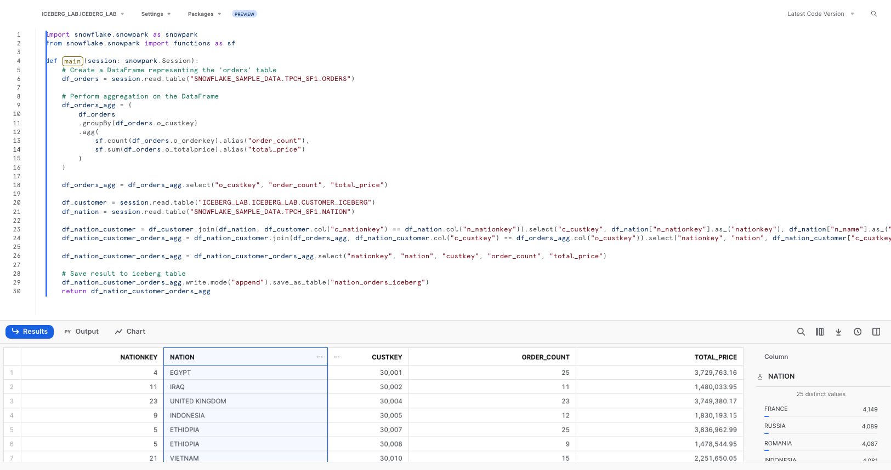

For a deeper dive on Snowpark for data engineering pipelines, try [this quickstart](https://quickstarts.snowflake.com/guide/data_engineering_pipelines_with_snowpark_python/index.html).

<!-- ------------------------ -->
## Sharing Iceberg Tables
Duration: 10

Iceberg Tables can be securely shared with consumers either through their own Snowflake account or a provisioned Snowflake Reader account. The consumer can be an external entity or a different internal business unit that is required to have its own unique Snowflake account.

> aside negative
> 
>  Cross-cloud and cross-region sharing of Iceberg Tables is not currently supported. The provider’s external volume, Snowflake account, and consumer’s Snowflake account must all be in the same cloud region.

With data sharing, including Iceberg Tables:
- There is only one copy of the data that’s stored in the data provider's cloud storage account.
- The latest snapshot available in the producer account is always live, real-time, and immediately available to consumers.
- Providers can establish revocable, fine-grained access to shares.
- Data sharing is simple and safe, especially compared to older data sharing methods, which were often manual and insecure, such as transferring large .csv files across the internet.

Suppose you have a partner who wants to analyze the data in your ICEBERG_LAB database on a near real-time basis. This partner also has their own Snowflake account in the same region as our account. Data sharing is an easy, secure solution to allow them to access this information.

### Creating a Reader Account

For the purposes of this lab, we’ll share data with a provisioned reader account. Return to your SQL worksheet, and grant the ICEBERG_LAB role the ability to create a reader account.

```sql
USE ROLE accountadmin;
GRANT CREATE ACCOUNT ON ACCOUNT TO ROLE iceberg_lab;
USE ROLE ICEBERG_LAB;
```

Exit your SQL worksheet and navigate to **Private Sharing**, then click the tab **Reader Accounts** near the top of your window, then click **+ New**. Use ICEBERG_LAB_READER as the Account Name, READER_ADMIN as the User Name, and provide a password. Then click **Create Account**. You’ll see the reader account now listed.

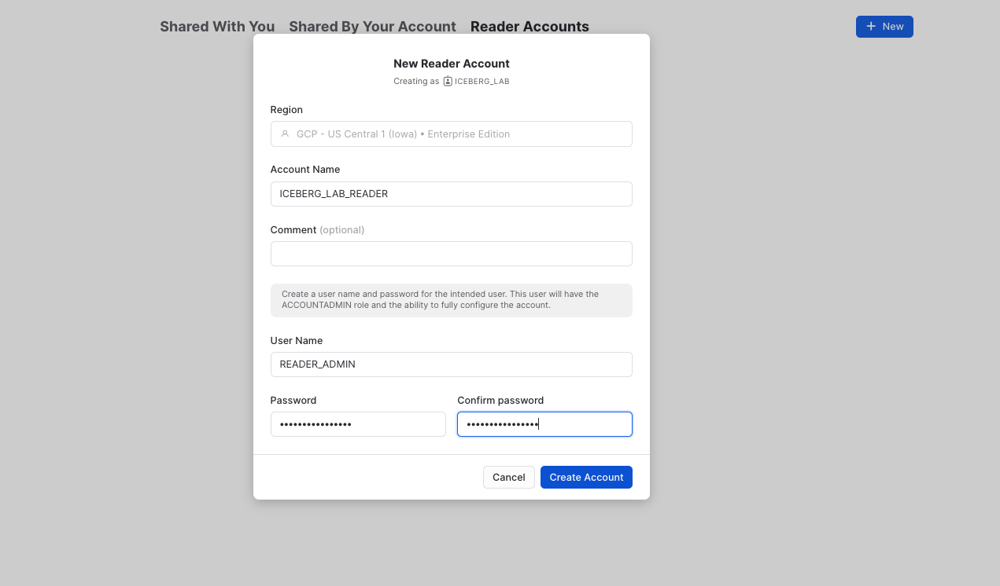

### Create a Secure View

Now create a secure view which is what will eventually be shared with the ICEBERG_LAB_READER account.

```sql
USE ROLE iceberg_lab;
CREATE OR REPLACE SECURE VIEW nation_orders_v AS
SELECT
    nation,
    SUM(order_count) as order_count,
    SUM(total_price) as total_price
FROM nation_orders_iceberg
GROUP BY nation;
```

### Create an Outbound Share

By default, ACCOUNTADMIN is the only role that can create shares. From your SQL worksheet, grant the ICEBERG_LAB role to create a share, then use this role.

```sql
USE ROLE accountadmin;
GRANT ON ACCOUNT CREATE SHARE TO ROLE iceberg_lab;
USE ROLE iceberg_lab;
```

Exit the SQL worksheet and navigate to **Data » Private Sharing**, then click on the **Shared by My Account** tab near the top of your window, then click the **Share** button in the top-right corner and select **Create a Direct Share**.

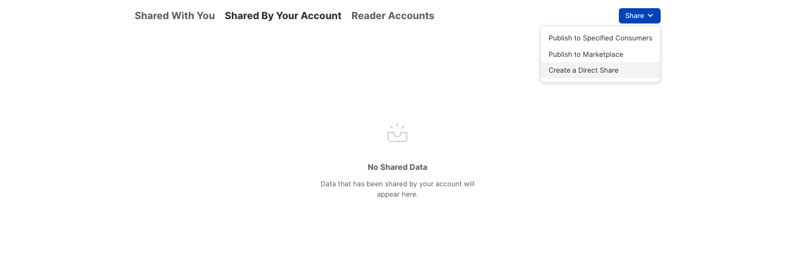

Click **+ Select Data** and navigate to the ICEBERG_LAB database and schema. Select the NATION_ORDERS_V view you created in the schema and click the **Done** button. Edit the default name to a more descriptive value that will help identify the share in the future (e.g. ICEBERG_LAB_NATION_ORDERS_SHARED_DATA). You can also add a comment.

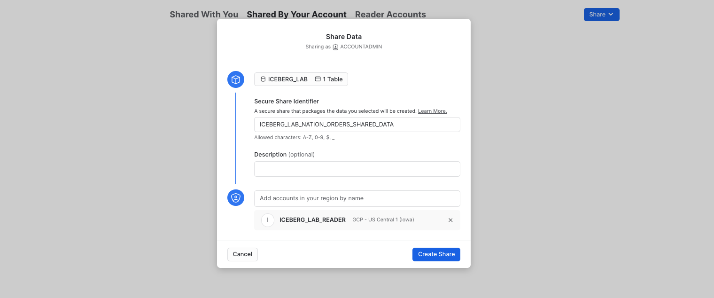

### Accessing Shared Data

In a separate browser tab, login to the reader account previously created. After logging in, as this is a new account, create a new SQL worksheet..

```sql
USE ROLE accountadmin;

CREATE OR REPLACE WAREHOUSE iceberg_lab_reader 
    WAREHOUSE_SIZE = XSMALL
    AUTO_SUSPEND = 1
    AUTO_RESUME = 1
    INITIALLY_SUSPENDED = TRUE;
```

Now let's view the shared data. Exit the worksheet, and in the pane on the left, click on on **Data » Private Sharing**. You will see ICEBERG_LAB_NATION_ORDERS_SHARED_DATA listed under Direct Shares. Select **Get Data** and name it READER_ICEBERG_LAB_NATION_ORDERS_SHARED_DATA. Make it available to the PUBLIC role, then click **Get Data**, then click **View Database**.

You can now query the shared data, which is a view on top of an Iceberg table. Run the queries below in a SQL worksheet to create a warehouse and see which countries had the most orders.

```sql
SELECT *
FROM reader_iceberg_lab_nation_orders_shared_data.iceberg_lab.nation_orders_v
ORDER BY order_count DESC;
```

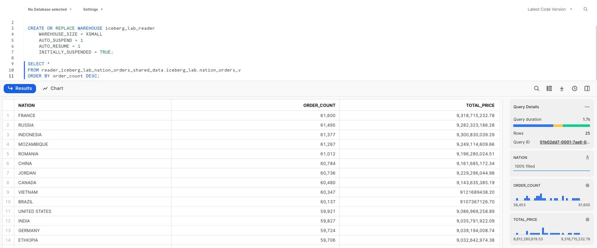

As changes are made to the Iceberg Table from the producer’s account, those changes are available nearly instantly in the reader account. No copying or transferring of data required! The single copy of data is stored in your cloud storage.

<!-- ------------------------ -->
## Access Iceberg Tables from Apache Spark
Duration: 10

Suppose another team that uses Spark wants to read the Snowflake-managed Iceberg Table using their Spark clusters. They can use the Snowflake Iceberg Catalog SDK to access snapshot information, and directly access data and metadata in object storage, all without using any Snowflake warehouses.

From your terminal, run the following commands to activate the virtual environment you created in the setup, and open jupyter notebooks.

```
conda activate iceberg-lab
jupyter notebook
```

Download the notebook [iceberg_lab.ipynb provided here](https://github.com/Snowflake-Labs/sfguide-getting-started-with-iceberg-tables/blob/main/iceberg_lab.ipynb), then open from Jupyter. Update and run the cells that are applicable to the cloud in which your Snowflake account is located.

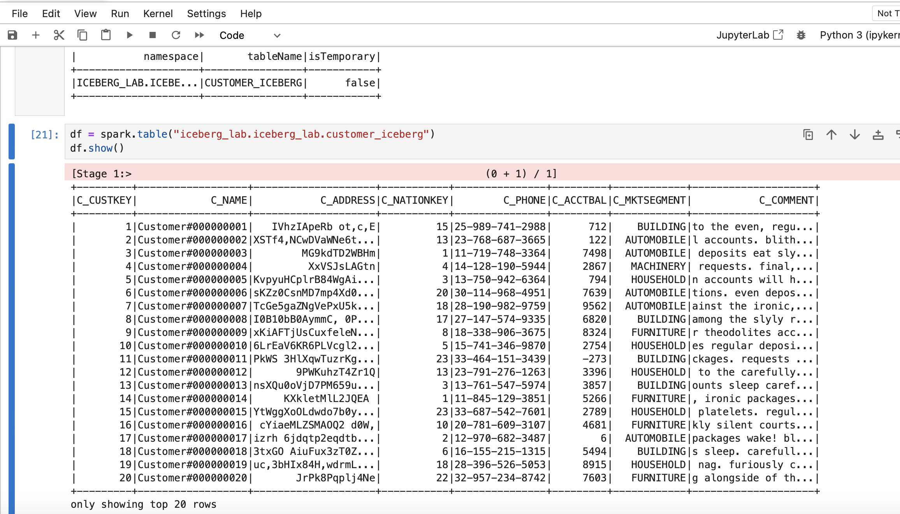

<!-- ------------------------ -->
## Cleanup
Duration: 1

To delete all of the objects created in this guide, you can drop the user, role, database, and warehouse.

```sql
USE ROLE iceberg_lab;
DROP SHARE iceberg_lab_nation_orders_shared_data;
DROP DATABASE iceberg_lab;
USE ROLE accountadmin;
DROP EXTERNAL VOLUME iceberg_lab_vol;
DROP USER iceberg_lab;
DROP ROLE iceberg_lab;
DROP ROLE tpch_us;
DROP ROLE tpch_intl;
DROP ROLE tpch_analyst;
DROP WAREHOUSE iceberg_lab;
```

To delete the Conda environment, run the following in your shell.

```
conda deactivate
conda remove -n iceberg-lab --all
```

<!-- ------------------------ -->
## Conclusion
Duration: 1

Congratulations! You've successfully created an open data lakehouse on Snowflake with Iceberg.

### What You Learned
- How to create a Snowflake-managed Iceberg Table
- How to apply governance policies on an Iceberg Table
- How Snowpark can be used for Iceberg Table pipelines
- How to share an Iceberg Table
- How to access a Snowflake-managed Iceberg Table from Apache Spark

### Related Resources
- [Snowflake Documentation for Iceberg Tables](https://docs.snowflake.com/en/user-guide/tables-iceberg)
- [Apache Iceberg Documentation](https://iceberg.apache.org/)
