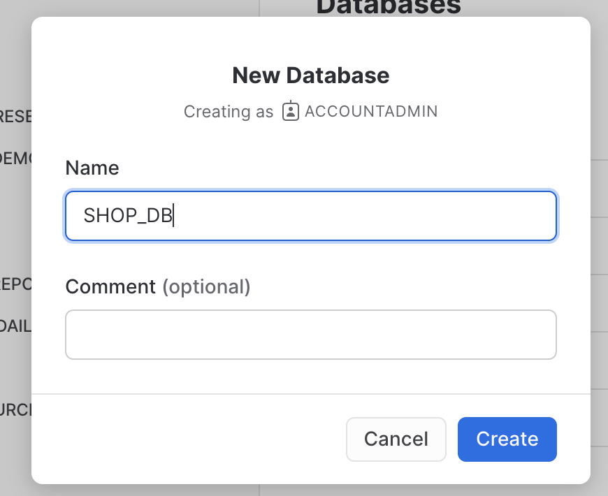
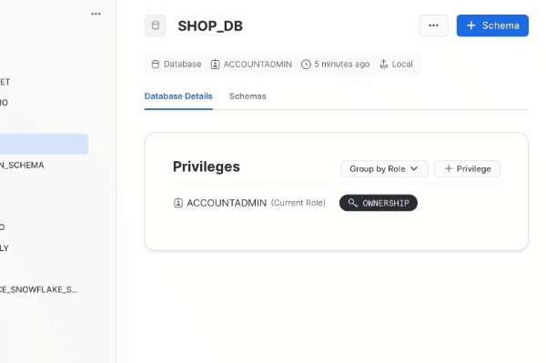
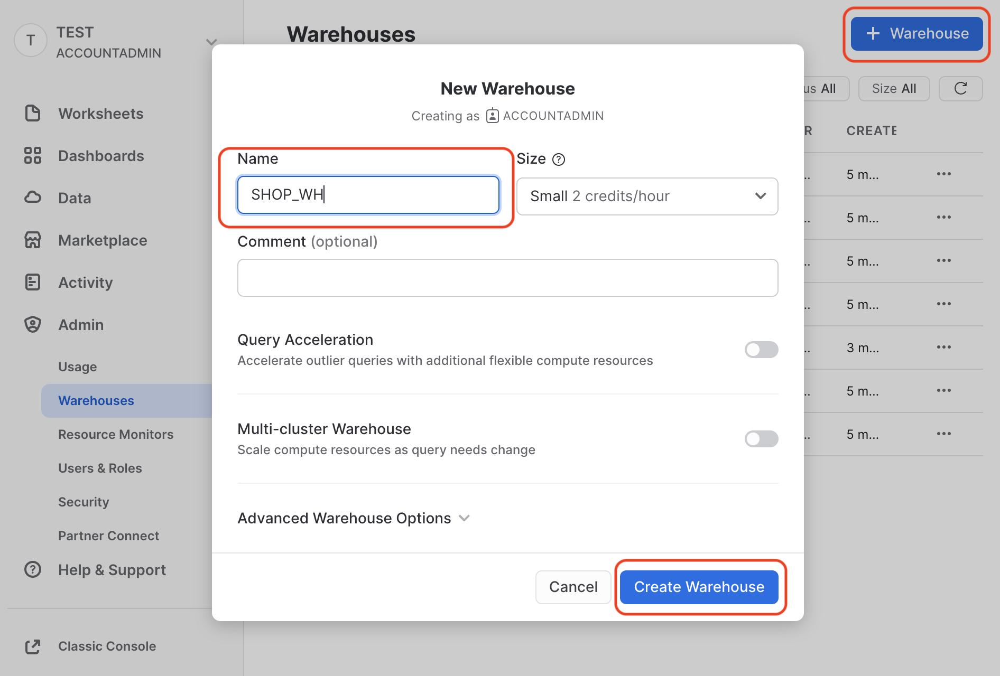
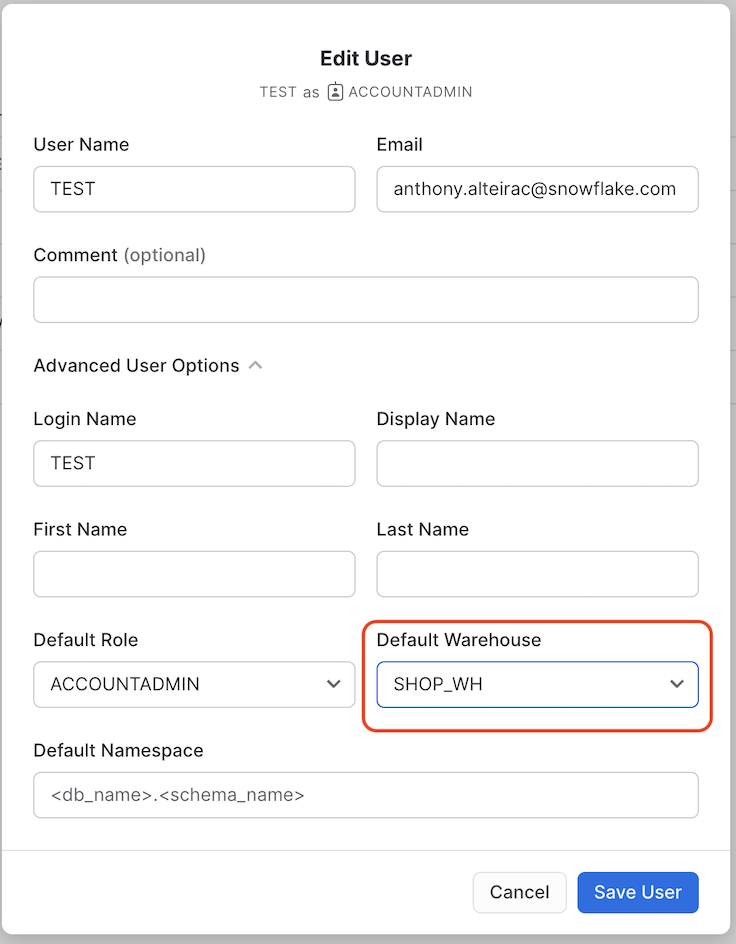
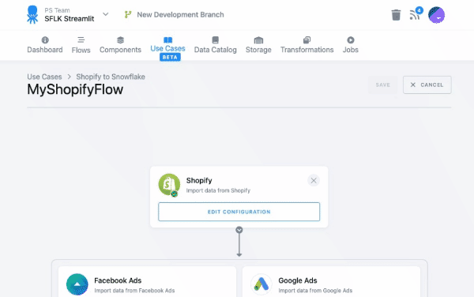
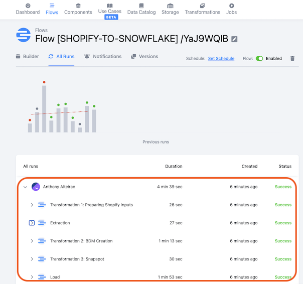
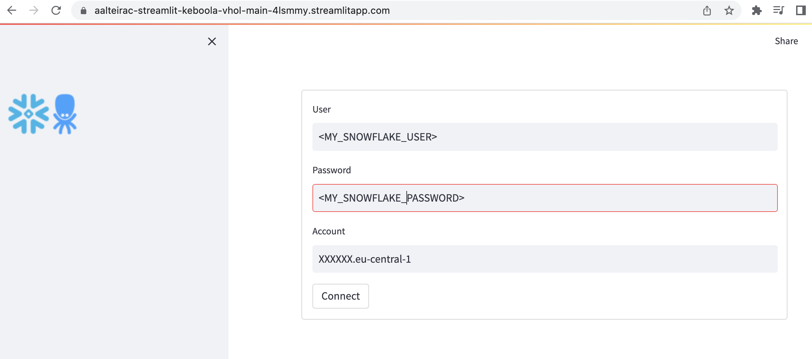

author: Anthony Alteirac
id: getting_started_keboola
summary: Getting Started With Keboola
categories: Getting Started
environments: web
status: Draft 
feedback link: https://github.com/aalteirac/sfguides/issues
tags: Getting Started, Data Engineering 

# Getting Started with Keboola 
<!-- ------------------------ -->
## Overview 
Duration: 2

Modern Data Stack requires setup and maintenance and Snowflake goes a long way to lowering the bar.

Our Powered By Snowflake partner Keboola offers Data Platform as a Service, helping users further accelerate data projects by delivering a ready-to-use managed platform. It includes all the technologies a data team needs. Therefore enabling everyone to capitalize on Snowflake’s capabilities and acting as an avenue to the incredible modern no-maintenance and no-code solution.

This Quickstart will guide you to build a complete data pipeline from ingestion, transformation, orchestration to presentation in a Streamlit application.

### Prerequisites
- Familiarity with Snowflake
 
### What You’ll Learn 
* How to start working with Keboola
* How to create a flow based on Keboola template
* How to configure Keboola template 
* How to work with SQL transformation in Snowflake
* How to run Keboola flow
* How to visualize data with Streamlit
 
###  What You’ll Need 
- A [Snowflake](https://trial.snowflake.com/) account or free trial
* A [Keboola](https://connection.north-europe.azure.keboola.com/wizard) account or free trial

### What You’ll Build 
- A complete data pipeline from Shopify and FaceBook Ads. The Keboola template will automatically join, clean and transform data into Snowflake. Within few clicks, Keboola will generates RFM segmentation to optimize the monetization of your online traffic. A predefined Streamlit "Connected application" closes the loop to visualise data, create marketing discount simulations and write back results into Snowflake. 

 

## Setup Snowflake Account
Duration: 5

Here we'll prepare everything for Keboola to write into Snowflake account:

- Get hostname information
- Create DB
- Create Schema
- Create Warehouse
- Set default Warehouse for User

Login to Snowflake trial account

- Get host name:

At the left bottom of the screen, hover the account and click on "Copy account URL".

Paste the content in safe place to reuse later.

- Create a new Database:

Click the blue button to create the new database

 
 PLEASE USE THE NAME "SHOP_DB" FOR LATER INSTRUCTIONS

- Create a new Schema:

Select the "SHOP_DB" and create a new schema:

 PLEASE USE THE NAME "SHOP_SC" FOR LATER INSTRUCTIONS

- Create Warehouse:

Navigate to the "Warehouses" section in Admin, click "+ Warehouse"

Select X-Small size

Enter the name (SHOP_WH) and click "Create Warehouse"

  

- Set default Warehouse:

Navigate to the "Users & Roles" section in Admin, select the ... on your user and click "Edit"

  

Select the warehouse previously created (SHOP_WH)

  

Click "Save User"

## Instantiate the Template
Duration: 2

Let's move to Keboola platform, after you have created your Keboola trial account, login to the platform and navigate to the "Use Cases" tabs. 

In the searchbar, type "virtual"

 Be sure you select the correct template "Snowflake Virtual Hands on Lab".

Click the green button "+ USE TEMPLATE"

You'll see more details on the template, click the top right green button "+ USE TEMPLATE"

Enter a name and click " -> NEXT STEP"

## Configure the Template
Duration: 5

For this lab, we'll use dummy Shopify data so we don't need to configure the Shopify Component.

The template configuration constists in setting-up connection information to each component needed to run the flow.

For our lab, we'll need to setup only Snowflake.

We need to enter Snowflake information in the last step of the flow:

Click on "Edit Configuration"

Add the information we created during step 1

 Hostname is the URL you copied in Snowflake WITHOUT "https://"

 Port is "443"

 Username is your Snowflake user name

 Password is your Snowflake password

 Database Name is "SHOP_DB"

 Scheam Name is "SHOP_SC"

 Warehouse is "SHOP_WH"

Save the template: 

 

## Run the Flow
Duration: 10

The template generated a Keboola Flow. A flow is a sequence of actions.

Navigate to the generated flow:

We are now ready to run it!

The run will last about 10mn for the first time, about 5mn for subsequent, you can track the progress:

Success!

## See results in Snowflake
Duration: 2

Open your Snowflake web tab and check the SHOP_DB content.

You should see the tables created:

## Get information for Streamlit connection
Duration: 5

### Get Keboola token:

From the Streamlit application, we can write back data thanks to Keboola API.

We need first to get an API token. Follow the steps to generate this token.

Navigate to token page in Keboola:

Generate the token, do not forget to set "Full Access" and to copy the value !

### Get Snowflake account name:

At the left bottom of the screen, hover the account and click on "Copy account URL".

The URL is: 

https://_XXXXXX.eu-central-1_.snowflakecomputing.com

The pattern is [protocol][locator][region].snowflakecomputing.com

 We need only [locator][region]

**Our account ID to connect Streamlit application will be:**

***XXXXXX.eu-central-1***

 Change the region accordingly !

## Connect with Streamlit
Duration: 5

We have seen Keboola Shopify template in action. We have now a complete set of tables in Snowflake with Shopify sales data including an RFM segmentation, ready to use!

_RFM stands for Recency, Frequency, and Monetary value, each corresponding to some key customer charasteritics. These RFM metrics are important indicators of a customer’s behavior because frequency and monetary value affects a customer’s lifetime value, and recency affects retention, a measure of engagement_

In this section, we'll leverage this segmentation in a Streamlit application.

This application will :

- Connect to your Snowflake account
- Connect to your Keboola project
- Give you an overview of the generated RFM Segmentation
- Simulate Revenue impact of discount on targeted segment(s)
- Get targeted customer list and expected discount to trigger a marketing campaign
- Write back this information in Keboola for a next flow to create the campaign

From the previous step, you have now your Snowflake credentials, account information and Keboola token.

### Connect the Streamlit Application:

Navigate to application: [Link](https://aalteirac-streamlit-keboola-vhol-main-4lsmmy.streamlitapp.com/)

Click "Connect" to validate.

Select the Keboola region (you can check with your browser in the keboola tab) end enter the Keboola token

You are now connected !

## Play with Data
Duration: 8

If your Snowflake information are correct, after clicking "Connect" you should see:

### RFM Segmentation Overview

You see here the generated segmentation and the number of customers assigned to.

### Simulate discount

You can select the segment(s) you want to assign discount:

You can then adjust discount level and expected revenue increase. 

This will calculate the impact on the total revenue

### Generated list of targeted customers

Scrolling down the page, you'll find an always adjusted list of customers (based on selected segments) and the level of discount.

This list can be used to trigger a marketing campaign:

### Write the table back into Keboola

Finally press the "UPLOAD" button:

Wait until the upload is finished:

Check the table in Keboola:

YOU'RE DONE WITH THE LAB !!  🍾

## Troubleshooting
Duration: 0

### You choose the wrong template

Delete the associated Flow

Delete the Components

Delete the Storage

Same player, start again :-)

### Your Snowflake credentials are wrong

Navigate to the Components tab, click on the Snowflake Data Destination:

Select "Database Credentials" on the right:

Udpate and test your credentials:

### Your DB name, schema, warehouse name are wrong

Navigate to the Components tab, click on the Snowflake Data Destination:

Select "Database Credentials" on the right:

Check the DB, Schema, Warehouse:

## Conclusion
Duration: 1

Congratulations! You've successfully built a complete data pipeline from ingestion, transformation, orchestration, to presentation in a Streamlit application!

### What You Learned
 - Connect to your Snowflake account to Keboola project
 - Instanciate Keboola template
 - Automatically generate RFM segmentation
 - Connect Snowflake and Keboola to Streamlit application
 - Write back data from Streamlit to Keboola 

### Related Resources

  - [Keboola documentation](https://help.keboola.com/)
  - [Github Streamlit source code](https://github.com/aalteirac/streamlit_keboola_vhol)
  - [Keboola Streamlit Component](https://pypi.org/project/streamlit-keboola-api/)
  - [Keboola Streamlit Component source code](https://github.com/aalteirac/streamlit_keboola_api)
