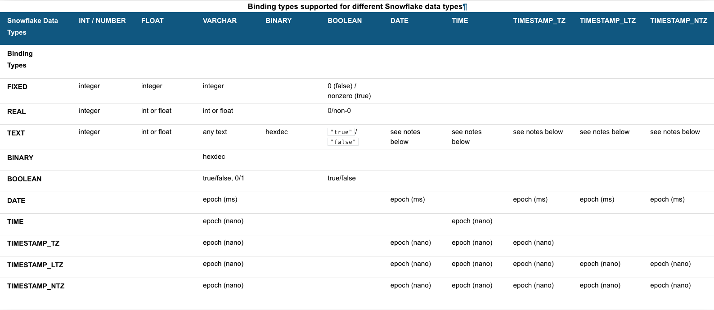

summary: Getting Started With Snowflake SQL API
id: getting_started_snowflake_sql_api
categories: Getting Started
environments: web
status: Draft
feedback link: https://github.com/Snowflake-Labs/sfguides/issues
tags: Getting Started, SQL, Data Engineering

# Getting Started With Snowflake SQL API

<!-- ------------------------ -->
## Overview
Duration: 1

Welcome! The Snowflake SQL API is a [REST API](https://en.wikipedia.org/wiki/Representational_state_transfer) that you can use to access and update data in a Snowflake database. You can use this API to execute [standard queries](https://docs.snowflake.com/en/sql-reference/constructs.html) and most [DDL](https://docs.snowflake.com/en/sql-reference/sql-ddl-summary.html) and [DML](https://docs.snowflake.com/en/sql-reference/sql-dml.html) statements.

This getting started guide will walk you through executing a SQL statement with the API and retrieving the results. 

Negative
: Support for the Snowflake SQL API is currently not in production.


### Prerequisites

- A familiarity with [Snowflake](https://www.youtube.com/watch?v=fEtoYweBNQ4)
- A familiarity with SQL

### What You'll Learn
- Perform simple queries
- Manage your deployment (e.g., provision users and roles, create tables, etc.)
- Submit one SQL statement for execution per API call.
- Check the status of the execution of a statement.
- Cancel the execution of a statement.


### What You'll Need

- A Snowflake Account with an accessible warehouse, database, schema, and role
- SnowSQL 1.2.17 or higher
- Working [Key-Pair authentication](https://docs.snowflake.com/en/user-guide/key-pair-auth.html#configuring-key-pair-authentication)

### What You'll Build

- An execution of a statement using the Snowflake SQL API

<!-- ------------------------ -->
## Introducing the API
Duration: 3

Head to the SQL API by navigating to your version of the following URL, replacing  `*account_locator*` with the account locator for your own Snowflake account: 

```
https://*account_locator*.snowflakecomputing.com/api/v2
```

Negative
: Note that the account locator might include additional segments for your region and cloud provider. See [Specifying Region Information in Your Account Hostname](https://docs.snowflake.com/en/user-guide/intro-regions.html#label-region-ids) for details.

Now let's break down the parts of the API before we begin using it. The API consists of the `/api/v2/statements/` resource and provides the following endpoints:

* `/api/v2/statements`: You'll use this endpoint to [submit a SQL statement for execution](https://docs.snowflake.com/en/developer-guide/sql-api/reference.html#post-api-v2-statements).
* `/api/v2/statements/*statementHandle*`: You'll use this endpoint to [check the status of the execution of a statement](https://docs.snowflake.com/en/developer-guide/sql-api/reference.html#get-api-v2-statements-statementhandle).
* `/api/v2/statements/*statementHandle*/cancel`: You'll use this endpoint to [cancel the execution of a statement](https://docs.snowflake.com/en/developer-guide/sql-api/reference.html#post-api-v2-statements-statementhandle-cancel).

In the steps to come, you shall use all these endpoints to familiarize yourself with the API. 

Positive
: You can use development tools and libraries for REST APIs (e.g., Postman) to send requests and handle responses.

### Limitations of the SQL API

It's important to be aware of the [limitations that the SQL API] (https://docs.snowflake.com/en/developer-guide/sql-api/guide.html#limitations-of-the-sql-api) currently has.  In particular noting that `GET` and `PUT` are not supported.  


<!-- ------------------------ -->
## Assigning a Unique Request ID for Resubmitting Requests
Duration: 1

In some cases, it might not be clear if Snowflake executed the SQL statement in an API request (e.g., due to a network error or a timeout). You might choose to resubmit the same request to Snowflake again in case Snowflake did not execute the statement.

If Snowflake already executed the statement in the initial request and you resubmit the request again, the statement is executed twice. For some types of requests, repeatedly executing the same statement can have unintended consequences (e.g., inserting duplicate data into a table).

To prevent Snowflake from executing the same statement twice when you resubmit a request, you can use a request ID to distinguish your request from other requests. Suppose you specify the same request ID in the initial request and in the resubmitted request. In that case, Snowflake does not execute the statement again if the statement has already executed successfully.

To specify a request ID, generate a [universally unique identifier (UUID)](https://en.wikipedia.org/wiki/Universally_unique_identifier) and include this identifier in the `requestId` query parameter:

```
POST /api/v2/statements?requestId=<UUID> HTTP/1.1
```

If Snowflake fails to process a request, you can submit the same request again with the same request ID. Using the same request ID indicates to the server that you are submitting the same request again.

Now let's move on to additional information you need to include in requests: authentication parameters.

<!-- ------------------------ -->
## Authenticating to the Server
Duration: 3

When you send a request, the request must include authentication information. There are two options for providing authentication: OAuth and JWT key pair authentication. You can use whichever one you have previously implemented or whichever one you are most comfortable with. This example will be detailing authentication with [JWT](https://jwt.io/). 

If you haven't done so already, make sure you have [key pair authentication](https://docs.snowflake.com/en/user-guide/key-pair-auth.html#configuring-key-pair-authentication) working with Snowflake already.

You can test to make sure you can successfully connect to Snowflake Key Pairs using the following command:

```
$ snowsql -a <account> -u <user> --private-key-path <path to private key>
```

Negative
: If you'd rather authenticate with OAuth, please visit our documentation on authenticating with [OAuth](https://docs.snowflake.com/en/developer-guide/sql-api/guide.html#using-oauth). 

After you've verified you can connect to Snowflake using key-pair authentication, you'll need to generate a JWT token.  This JWT token is time limited token which has been signed with your key and Snowflake will know that you authorized this token to be used to authenticate as you for the SQL API.

```
$ snowsql -a <account> -u <user> --private-key-path <path to private key> --generate-jwt
<returns JWT token>
```

You'll need the JWT token generated to be used for using the SQL API. The following headers need be set in each API request that you send within your application code:

- `Authorization: Bearer *jwt_token*` where `*jwt_token*` is the generated JWT token from SnowSQL

- `X-Snowflake-Authorization-Token-Type: KEYPAIR_JWT`

Altogether, your request query and header will take the following form:

```
POST /api/v2/statements?requestId=<UUID> HTTP/1.1
Authorization: Bearer <jwt_token>
Content-Type: application/json
Accept: application/json
User-Agent: myApplication/1.0
X-Snowflake-Authorization-Token-Type: KEYPAIR_JWT
```

Now that you have been introduced to authentication and unique request IDs, you can now move to actually making a request to execute a SQL statement. 

<!-- ------------------------ -->
## Submitting a Request to Execute a SQL Statement
Duration: 3

To submit a SQL statement for execution, send a [POST request to the /api/v2/statements/ endpoint](https://docs.snowflake.com/en/developer-guide/sql-api/reference.html#post-api-v2-statements):

```
POST /api/v2/statements?requestId=<UUID> HTTP/1.1
Authorization: Bearer <jwt_token>
Content-Type: application/json
Accept: application/json
User-Agent: myApplication/1.0
X-Snowflake-Authorization-Token-Type: KEYPAIR_JWT

(request body)
```

In the request URL, you can also set query parameters to:

- Execute the statement asynchronously: `async=true`

For the [body of the request](https://docs.snowflake.com/en/developer-guide/sql-api/reference.html#body-of-the-post-request-to-api-v2-statements), set the following fields:

- Set the `statement` field to the SQL statement that you want to execute.

- To specify the warehouse, database, schema, and role to use, set the `warehouse`, `database`, `schema`, and `role` fields.

Negative
: Note: the values in these fields are case-sensitive.

- To set a timeout for the statement execution, set the `timeout` field to the maximum number of seconds to wait. If the `timeout` field is not set, the timeout specified by the [STATEMENT_TIMEOUT_IN_SECONDS](https://docs.snowflake.com/en/sql-reference/parameters.html#label-statement-timeout-in-seconds) parameter is used.


```
POST /api/statements HTTP/1.1
Authorization: Bearer <jwt_token>
Content-Type: application/json
Accept: application/json
User-Agent: myApplication/1.0
X-Snowflake-Authorization-Token-Type: KEYPAIR_JWT

{
"statement": "select * from T",
"timeout": 60,
"database": "<your_database>",
"schema": "<your_schema>",
"warehouse": "<your_warehouse>",
"role": "<your_role>"
}
```

Let's go over some specific fields in this request:

- The `statement` field specifies the SQL statement to execute.

- The `timeout` field specifies that the server allows 60 seconds for the statement to be executed.

If the statement was executed successfully, Snowflake returns the HTTP response code 200 and the first results in a [ResultSet](https://docs.snowflake.com/en/developer-guide/sql-api/reference.html#resultset) object. We'll go over how to check the status and retrieve the results after we look at including bind variables.

Now we'll look at how you can include bind variables (`?` placeholders) in the statement and set the `bindings` field to an object that specifies the corresponding Snowflake data types and values for each variable.

<!-- ------------------------ -->
## Using Bind Variables in a Statement
Duration: 5

If you want to use bind variables (`?` placeholders) in the statement, use the `bindings` field to specify the values that should be inserted.

Set this field to a JSON object that specifies the [Snowflake data type](https://docs.snowflake.com/en/sql-reference/intro-summary-data-types.html) and value for each bind variable.

```
...
"statement": "select * from T where c1=?",
...
"bindings": {
"1": {
"type": "FIXED",
"value": "123"
}
},
...
```

Choose the binding type that corresponds to the type of the value that you are binding. For example, if the value is a string representing a date (e.g. `2021-04-15`) and you want to insert the value into a DATE column, use the `TEXT` binding type.

The following table specifies the values of the `type` field that you can use to bind to different [Snowflake data types](https://docs.snowflake.com/en/sql-reference/data-types.html) for this preview release.

- The first column on the left specifies the binding types that you can use.

- The rest of the columns specify the Snowflake data type of the column where you plan to insert the data.

- Each cell specifies the type of value that you can use with a binding type to insert data into a column of a particular Snowflake data type.

Negative
: If the cell for a binding type and Snowflake data type is empty, you cannot use the specified binding type to insert data into a column of that Snowflake data type.



For additional information on binding specific data types, see the documentation's section on [Using Bind Variables in a Statement](https://docs.snowflake.com/en/developer-guide/sql-api/reference.html#resultset)

If the value is in a format not supported by Snowflake, the API returns an error:

```
{
code: "100037",
message: "<bind type> value '<value>' is not recognized",
sqlState: "22018",
statementHandle: "<ID>"
}
```

Whether you use bind variables or not, you'll want to check the status of your statements. Let's look at that next.

<!-- ------------------------ -->
## Checking the Status of the Execution of the Statement
Duration: 1

When you submit a SQL statement for execution, Snowflake returns a 202 response code if the execution of the statement has not yet been completed or if you submitted an asynchronous query.

In the body of the response, Snowflake includes a [QueryStatus](https://docs.snowflake.com/en/developer-guide/sql-api/reference.html#querystatus) object. The `statementStatusUrl` field in this object specifies the URL to the [/api/v2/statements/<statementHandle> endpoint](https://docs.snowflake.com/en/developer-guide/sql-api/reference.html#get-api-v2-statements-statementhandle) that you can use to check the execution status:

```
{
"code": "090001",
"sqlState": "00000",
"message": "successfully executed",
"statementHandle": "e4ce975e-f7ff-4b5e-b15e-bf25f59371ae",
"statementStatusUrl": "/api/statements/e4ce975e-f7ff-4b5e-b15e-bf25f59371ae"
}
```

As illustrated by the URL above, in requests to check the status of a statement and cancel the execution of a statement, you specify the statement handle (a unique identifier for the statement) as a path parameter in order to identify the statement to use.

Note that the `QueryStatus` object also provides the statement handle as a separate value in the `statementHandle` field.

To check the status of the execution of the statement, send a GET request using this URL:

```
GET /api/v2/statements/{statementHandle}
```

For example, the following request checks the execution status of the statement with the handle `e4ce975e-f7ff-4b5e-b15e-bf25f59371ae`:

```
GET /api/v2/statements/e4ce975e-f7ff-4b5e-b15e-bf25f59371ae HTTP/1.1
Authorization: Bearer <jwt_token>
Content-Type: application/json
Accept: application/json
User-Agent: myApplication/1.0
X-Snowflake-Authorization-Token-Type: KEYPAIR_JWT
```

If the statement has finished executing successfully, Snowflake returns the HTTP response code 200 and the first results in a [ResultSet](https://docs.snowflake.com/en/developer-guide/sql-api/reference.html#resultset) object. However, if an error occurred when executing the statement, Snowflake returns the HTTP response code 422 with a [QueryFailureStatus](https://docs.snowflake.com/en/developer-guide/sql-api/reference.html#queryfailurestatus) object.

Once the statement has executed successfully, you can then retrieve the results, detailed in the next step.

### Cancelling the Execution of a SQL Statement

To cancel the execution of a statement, send a POST request to the [cancel endpoint](https://docs.snowflake.com/en/LIMITEDACCESS/sql-api-reference.html#label-sql-api-reference-post-statements-cancel).

```
POST /api/v2/statements/{statementHandle}/cancel
```

<!-- ------------------------ -->
## Retrieving the Results
Duration: 1

If you [submit a SQL statement for execution](https://docs.snowflake.com/en/developer-guide/sql-api/guide.html#label-sql-api-executing-multiple-statements) or [check the status of statement execution](https://docs.snowflake.com/en/developer-guide/sql-api/guide.html#checking-the-status-of-the-statement-execution-and-retrieving-the-data), Snowflake returns a [ResultSet](https://docs.snowflake.com/en/developer-guide/sql-api/guide.html#checking-the-status-of-the-statement-execution-and-retrieving-the-data) object in the body of the response if the statement was executed successfully.

The following is an example of a `ResultSet` object that is returned for a query. The query specifies that the results should be paginated with 10 results per page. The `numPages` field in the `resultSetMetaData` object indicates that there are 10 pages of results, and the `numRows` field indicates that the query finds a total of 100 rows.

```
{
"code": "090001",
"statementHandle": "536fad38-b564-4dc5-9892-a4543504df6c",
"sqlState": "00000",
"message": "successfully executed",
"createdOn": 1597090533987,
"statementStatusUrl": "/api/statements/536fad38-b564-4dc5-9892-a4543504df6c",
"resultSetMetaData": {
"page": 1,
"pageSize": 10,
"numPages": 10,
"numRows": 100,
"format": "json",
"rowType": [
{
"name":"ROWNUM",
"type":"FIXED",
"length":0,
"precision":38,
"scale":0,
"nullable":false
}, {
"name":"ACCOUNT_NAME",
"type":"TEXT",
"length":1024,
"precision":0,
"scale":0,
"nullable":false
}, {
"name":"ADDRESS",
"type":"TEXT",
"length":16777216,
"precision":0,
"scale":0,
"nullable":true
}, {
"name":"ZIP",
"type":"TEXT",
"length":100,
"precision":0,
"scale":0,
"nullable":true
}, {
"name":"CREATED_ON",
"type":"TIMESTAMP_NTZ",
"length":0,
"precision":0,
"scale":3,
"nullable":false
}
]
},
"data": [
["0","customer1","1234 A Avenue","98765","1565481394123000000"],
["1","customer2","987 B Street","98765","1565516712912012345"],
["2","customer3","8777 C Blvd","98765","1565605431999999999"],
["3","customer4","64646 D Circle","98765","1565661272000000000"]
...
]
}
```

### Determining If the Result Set Page Size Exceeds the Limit

The SQL API can return a result set page that has [a maximum size of approximately 10 MB](https://docs.snowflake.com/en/LIMITEDACCESS/sql-api.html#label-sql-api-limitations). If the result set page exceeds this size, the endpoint returns an HTTP response with a truncated result set in the body and the `code` field set to `391908`:

```
HTTP/1.1 200 OK
...
{
"code": "391908",
...
```

If this occurs, send the request again with the `pageSize` parameter set to a smaller value that fits within the maximum size of a page.

Negative
: Currently, Snowflake returns an HTTP 200 response code when this occurs, but this is subject to change.


### Getting Metadata About the Results

In the `ResultSet` object returned in the response, the `resultSetMetaData` field contains a [`ResultSet_resultSetMetaData`](https://docs.snowflake.com/en/LIMITEDACCESS/sql-api-reference.html#label-sql-api-reference-resultset-resultsetmetadata) object that describes the result set (for example, the format of the results, the number of pages of results, etc.).

In this object, the `rowType` field contains an array of [ResultSet_resultSetMetaData_rowType](https://docs.snowflake.com/en/LIMITEDACCESS/sql-api-reference.html#label-sql-api-reference-resultset-resultsetmetadata-rowtype) objects. Each object describes a column in the results. The `type` field specifies the Snowflake data type of the column.

```
{
"resultSetMetaData": {
"rowType": [
{
"name":"ROWNUM",
"type":"FIXED",
"length":0,
"precision":38,
"scale":0,
"nullable":false
}, {
"name":"ACCOUNT_NAME",
"type":"TEXT",
"length":1024,
"precision":0,
"scale":0,
"nullable":false
}, {
"name":"ADDRESS",
"type":"TEXT",
"length":16777216,
"precision":0,
"scale":0,
"nullable":true
}, {
"name":"ZIP",
"type":"TEXT",
"length":100,
"precision":0,
"scale":0,
"nullable":true
}, {
"name":"CREATED_ON",
"type":"TIMESTAMP_NTZ",
"length":0,
"precision":0,
"scale":3,
"nullable":false
}
]
},
}
```


### Getting the Data From the Results

In the `ResultSet` object in the response, the results are in the `data` field. The `data` field contains an array of arrays in JSON. For example:

```
{
"data": [
["0","customer1","1234 A Avenue","98765","1565481394123000000"],
["1","customer2","987 B Street","98765","1565516712912012345"],
["2","customer3","8777 C Blvd","98765","1565605431999999999"],
["3","customer4","64646 D Circle","98765","1565661272000000000"]
],
}
```

Each array within the array contains the data for a row:

- The first element in each array is a JSON string containing a sequence ID that starts from 0.
- The rest of the elements in each array represent the data in a row.

The data in the result set is encoded in JSON v1.0, which means that all data is expressed as strings, regardless of the Snowflake data type of the column.

For example, the value `1.0` in a `NUMBER` column is returned as the string `" 1.0"`. As another example, timestamps are returned as the number of nanoseconds since the epoch. For example, the timestamp for Thursday, January 28, 2021 10:09:37.123456789 PM is returned as `"1611871777123456789"`.

You are responsible for converting the strings to the appropriate data types.

### Retrieving Additional Pages of Results

If you set the `pageSize` request parameter to paginate the results, Snowflake returns the first page of results in the response. You can use the `numPages` field in the [ResultSet_resultSetMetaData](https://docs.snowflake.com/en/LIMITEDACCESS/sql-api-reference.html#label-sql-api-reference-resultset-resultsetmetadata) object in the `ResultSet` object to determine the total number of pages of results.

To get the next page of results or other pages of results, use the URLs provided in the [Link header](https://docs.snowflake.com/en/LIMITEDACCESS/sql-api-reference.html#label-sql-api-reference-response-headers) in the HTTP response. The `Link` header specifies the URLs for retrieving the first, next, previous, and last page of the results:

```
HTTP/1.1 200 OK
Link: </api/statements/e127cc7c-7812-4e72-9a55-3b4d4f969840?page=1>;rel="last",
</api/statements/e127cc7c-7812-4e72-9a55-3b4d4f969840?page=1>;rel="next",
</api/statements/e127cc7c-7812-4e72-9a55-3b4d4f969840512c?page=0>;rel="first"
...
```

Each URL in the header has a `rel` attribute with one of the following values:

- `first`: The first page of results.
- `next`: The next page of results.
- `prev`: The previous page of results.
- `last`: The last page of results.

With the knowledge of retrieving results, you can now begin to use the SQL API for your own use cases. 
<!-- ------------------------ -->
## Conclusion & Next Steps

Duration: 1

This tutorial was designed as a hands-on introduction to the Snowflake SQL API. To see what else you can do with the API, check out the [Snowflake SQL API Reference](https://docs.snowflake.com/en/LIMITEDACCESS/sql-api-reference.html).

If you've completed this lab using the Snowflake free trial, we encourage you to continue exploring what Snowflake can help you accomplish. There are several ways Snowflake can help you with this:

- At the very top of the UI, click on the "Partner Connect" icon to get access to trial/free ETL and BI tools to help you analyze your data with Snowflake
- Read the "[Definitive Guide to Maximizing Your Free Trial](https://www.snowflake.com/test-driving-snowflake-the-definitive-guide-to-maximizing-your-free-trial/)"
- Attend a Snowflake virtual or in-person [event](https://www.snowflake.com/about/webinars/) to learn more about our capabilities and how customers use us
- Contact [Sales](https://www.snowflake.com/free-trial-contact-sales/) to learn more
