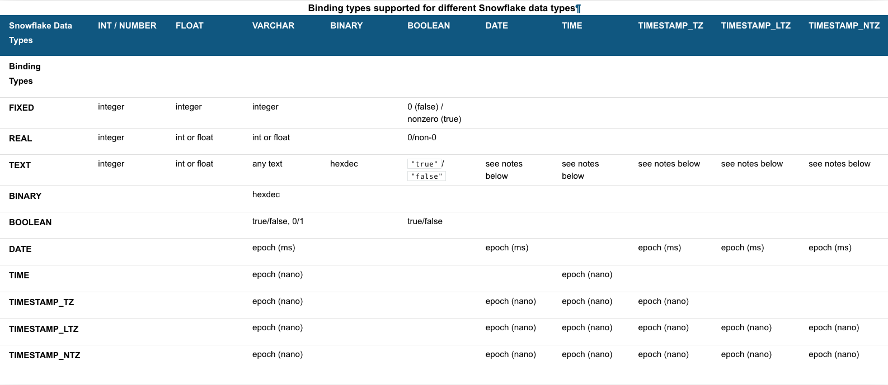

id: getting_started_snowflake_sql_api_kr
summary: Snowflake SQL API 시작하기
categories: Getting Started
environments: web
status: Hidden
feedback link: https://github.com/Snowflake-Labs/sfguides/issues
tags: 스노우플레이크 시작하기, SQL, 데이터 엔지니어링, kr

# Snowflake SQL API 시작하기

<!-- ------------------------ -->
## 개요

Duration: 1

환영합니다! Snowflake SQL API는 Snowflake 데이터에 있는 데이터에 액세스하고 업데이트하는 데 사용할 수 있는 [REST API](https://en.wikipedia.org/wiki/Representational_state_transfer)입니다. 이 API를 사용하여 [표준 쿼리](https://docs.snowflake.com/ko/sql-reference/constructs.html)와 대부분의 [DDL](https://docs.snowflake.com/ko/sql-reference/sql-ddl-summary.html) 및 [DML](https://docs.snowflake.com/ko/sql-reference/sql-dml.html) 문을 실행할 수 있습니다.

이 시작하기 가이드는 API를 통해 SQL 문을 실행하고 결과를 검색하는 것을 안내합니다.

### 사전 필요 조건 및 지식

- [Snowflake](https://www.youtube.com/watch?v=fEtoYweBNQ4)에 대한 이해
- SQL에 대한 이해

### 학습할 내용

- 단순한 쿼리 수행
- 배포(예: 사용자 및 역할 프로비저닝, 테이블 생성 등) 관리
- API 호출당 실행을 위해 하나의 SQL 문 제출
- 문 실행 상태 확인
- 문 실행 취소

### 필요한 것

- 접근 가능한 웨어하우스, 데이터베이스, 스키마 및 역할을 포함한 Snowflake 계정
- SnowSQL 1.2.17 이상
- 작동하는 [키 쌍 인증](https://docs.snowflake.com/ko/user-guide/key-pair-auth.html#configuring-key-pair-authentication)

### 구축할 것

- Snowflake SQL API를 사용하여 문 실행

<!-- ------------------------ -->
## API 소개

Duration: 3

다음 URL의 버전을 탐색하여 SQL API로 이동합니다. 여러분의 Snowflake 계정을 위한 계정 로케이터로 `*account_locator*`를 대체합니다.

```
https://*account_locator*.snowflakecomputing.com/api/v2
```

Negative : 계정 로케이터에는 여러분의 지역 및 클라우드 공급자를 위한 추가 세그먼트가 포함되어 있을 수 있습니다. 자세한 사항은 [계정 호스트 이름에 지역 정보 지정](https://docs.snowflake.com/ko/user-guide/intro-regions.html#label-region-ids)을 확인하십시오.

사용을 시작하기 전에 이제 API의 각 부분을 분석해 보겠습니다. API는 `/api/v2/statements/` 리소스로 구성되어 있으며 다음 엔드포인트를 제공합니다.

* `/api/v2/statements`: 이 엔드포인트는 [실행을 위한 SQL 문을 제출](https://docs.snowflake.com/ko/developer-guide/sql-api/reference.html#post-api-v2-statements)하기 위해 사용합니다.
* `/api/v2/statements/*statementHandle*`: 이 엔드포인트는 [문의 실행 상태를 확인](https://docs.snowflake.com/ko/developer-guide/sql-api/reference.html#get-api-v2-statements-statementhandle)하기 위해 사용합니다.
* `/api/v2/statements/*statementHandle*/cancel`: 이 엔드포인트는 [문의 실행을 취소](https://docs.snowflake.com/ko/developer-guide/sql-api/reference.html#post-api-v2-statements-statementhandle-cancel)하기 위해 사용합니다.

다음 단계에서는 이러한 모든 엔드포인트를 사용하여 여러분이 API에 익숙해질 수 있도록 합니다.

Positive : REST API(예: Postman)를 위한 개발자 도구 및 라이브러리를 사용하여 요청을 전송하고 응답을 처리할 수 있습니다.

### SQL API의 한계

현존하는 [SQL API의 한계](https://docs.snowflake.com/ko/developer-guide/sql-api/guide.html#limitations-of-the-sql-api)를 인지하고 있는 것이 중요합니다.  특히나 `GET` 및 `PUT`은 지원되지 않습니다.

<!-- ------------------------ -->
## 요청 재제출을 위해 고유한 요청 ID 할당

Duration: 1

일부 경우 Snowflake가 API 요청에서 SQL 문을 실행했는지가 확실하지 않을 수 있습니다(예: 네트워크 오류 또는 시간제한으로 인해). Snowflake가 문을 실행하지 않았을 경우 Snowflake에 동일한 요청을 재제출하기로 결정할 수 있습니다.

Snowflake가 이미 초기 요청에서 문을 실행했는데 여러분이 요청을 재제출한다면 문은 두 번 실행됩니다. 일부 요청 유형의 경우 반복적으로 동일한 문을 실행하면 의도하지 않은 결과(예: 테이블에 중복 데이터 삽입)가 나타날 수 있습니다.

여러분이 요청을 재제출할 때 Snowflake가 동일한 문을 두 번 실행하는 것을 방지하기 위해 요청 ID를 사용하여 여러분의 요청을 다른 요청과 구별할 수 있습니다. 여러분이 초기 실행과 재제출 요청에 동일한 요청 ID를 지정했다고 가정하겠습니다. 이러한 경우 해당 문이 이미 성공적으로 실행되었다면 Snowflake는 문을 다시 실행하지 않습니다.

요청 ID를 지정하려면 [UUID(Universally Unique Identifier)](https://en.wikipedia.org/wiki/Universally_unique_identifier)를 생성하고 이 식별자를 `requestId` 쿼리 매개 변수에 포함합니다.

```
POST /api/v2/statements?requestId=<UUID> HTTP/1.1
```

Snowflake가 요청을 처리하는 데 실패하면 동일한 요청 ID로 동일한 요청을 다시 제출할 수 있습니다. 동일한 요청 ID를 사용하는 것은 서버에 여러분이 동일한 요청을 다시 제출하고 있음을 알립니다.

이제 요청에 포함해야 하는 추가 정보인 인증 매개 변수에 대해 알아보겠습니다.

<!-- ------------------------ -->
## 서버에 인증

Duration: 3

요청을 전송할 때 요청에는 인증 정보가 반드시 포함되어야 합니다. 인증을 제공하는 2가지 옵션은 OAuth 및 JWT 키 쌍 인증입니다. 둘 중 이전에 구현했던 것이나 가장 익숙한 것을 사용할 수 있습니다. 이 예에서는 [JWT](https://jwt.io/)로 인증하는 것을 상세하게 설명합니다.

아직 준비하지 않았다면 Snowflake와 이미 작동하고 있는 [키 쌍 인증](https://docs.snowflake.com/ko/user-guide/key-pair-auth.html#configuring-key-pair-authentication)을 준비하십시오.

다음 명령을 사용하여 Snowflake 키 쌍과 성공적으로 연결할 수 있는지 확인하기 위해 테스트할 수 있습니다.

```
$ snowsql -a <account> -u <user> --private-key-path <path to private key>
```

Negative : OAuth로 인증하고자 한다면 [OAuth](https://docs.snowflake.com/ko/developer-guide/sql-api/guide.html#using-oauth)로 인증하는 것에 대한 Snowflake 설명서를 방문하십시오.

키 쌍 인증을 사용하여 Snowflake와 연결할 수 있음을 확인한 후 JWT 토큰을 생성해야 합니다.  이 JWT 토큰은 여러분의 키로 서명된 시간제한 토큰입니다. 또한 Snowflake는 여러분이 SQL API를 위해 이 토큰을 인증에 사용할 수 있도록 인가했음을 알게 됩니다.

```
$ snowsql -a <account> -u <user> --private-key-path <path to private key> --generate-jwt
<returns JWT token>
```

생성된 JWT 토큰이 SQL API 사용에 사용되어야 합니다. 다음 헤더는 여러분의 애플리케이션 코드 내에서 전송하는 각 API 요청에 설정되어야 합니다.

- `*jwt_token*`이 SnowSQL에서 생성된 JWT 토큰인 경우 `Authorization: Bearer *jwt_token*`

- `X-Snowflake-Authorization-Token-Type: KEYPAIR_JWT`

전체적으로 여러분의 요청 쿼리와 헤더는 다음과 같은 형식입니다.

```
POST /api/v2/statements?requestId=<UUID> HTTP/1.1
Authorization: Bearer <jwt_token>
Content-Type: application/json
Accept: application/json
User-Agent: myApplication/1.0
X-Snowflake-Authorization-Token-Type: KEYPAIR_JWT
```

인증과 고유한 요청 ID에 대해 알아보았으니 이제 실질적으로 SQL 문 실행을 위해 요청을 하는 방법을 알아보겠습니다.

<!-- ------------------------ -->
## SQL 문 실행을 위해 요청 제출

Duration: 3

실행을 위해 SQL 문을 제출하려면 [POST 요청을 /api/v2/statements/ endpoint](https://docs.snowflake.com/ko/developer-guide/sql-api/reference.html#post-api-v2-statements)로 전송합니다.

```
POST /api/v2/statements?requestId=<UUID> HTTP/1.1
Authorization: Bearer <jwt_token>
Content-Type: application/json
Accept: application/json
User-Agent: myApplication/1.0
X-Snowflake-Authorization-Token-Type: KEYPAIR_JWT

(request body)
```

요청 URL에서 쿼리 매개 변수를 다음과 같이 설정할 수 있습니다.

- 비동기로 문 실행: `async=true`

[요청 본문](https://docs.snowflake.com/ko/developer-guide/sql-api/reference.html#body-of-the-post-request-to-api-v2-statements)을 위해 다음 필드를 설정합니다.

- 실행하고 싶은 SQL 문에 `statement` 필드를 설정합니다.

- 웨어하우스, 데이터베이스, 스키마 및 역할을 사용에 지정하기 위해 `warehouse`, `database`, `schema` 및 `role` 필드를 설정합니다.

Negative : 참고: 이러한 필드에 있는 값은 대/소문자를 구분합니다.

- 문 실행에 시간제한을 설정하려면 `timeout` 필드를 최대 대기 시간(초)으로 설정합니다. `timeout` 필드가 설정되어 있지 않다면 [STATEMENT_TIMEOUT_IN_SECONDS](https://docs.snowflake.com/ko/sql-reference/parameters.html#label-statement-timeout-in-seconds) 매개 변수에 의해 지정된 시간제한이 사용됩니다.

```
POST /api/v2/statements HTTP/1.1
Authorization: Bearer <jwt_token>
Content-Type: application/json
Accept: application/json
User-Agent: myApplication/1.0
X-Snowflake-Authorization-Token-Type: KEYPAIR_JWT

{
"statement": "select * from T",
"timeout": 60,
"database": "<your_database>",
"schema": "<your_schema>",
"warehouse": "<your_warehouse>",
"role": "<your_role>"
}
```

이 요청의 몇몇 특정 필드를 알아보겠습니다.

- `statement` 필드는 실행할 SQL 문을 지정합니다.

- `timeout` 필드는 서버가 문 실행 시간을 60초까지 허용하도록 지정합니다.

문이 성공적으로 실행되었다면 Snowflake는 HTTP 응답 코드 200을 반환하며 첫 결과를 [ResultSet](https://docs.snowflake.com/ko/developer-guide/sql-api/reference.html#resultset) 오브젝트로 반환합니다. 바인드 변수를 포함하는 방법을 알아본 다음 상태를 확인하고 결과를 검색하는 방법을 알아보겠습니다.

이제 바인드 변수(`?` 자리 표시자)를 문에 포함하고 각 변수에 해당하는 Snowflake 데이터 형식과 값을 지정하는 오브젝트에 `bindings` 필드를 설정할 수 있는 방법을 알아보겠습니다.

<!-- ------------------------ -->
## 문에 바인드 변수 사용

Duration: 5

바인드 변수(`?` 자리 표시자)를 문에 사용하고 싶다면 `bindings` 필드를 사용하여 삽입되어야 하는 값을 지정합니다.

이 필드를 각 바인드 변수의 [Snowflake 데이터 형식](https://docs.snowflake.com/ko/sql-reference/intro-summary-data-types.html)과 값을 지정하는 JSON 오브젝트에 설정합니다.

```
...
"statement": "select * from T where c1=?",
...
"bindings": {
"1": {
"type": "FIXED",
"value": "123"
}
},
...
```

바인딩하는 값의 형식과 일치하는 바인딩 형식을 선택합니다. 예를 들어 값이 날짜(예: `2021-04-15`)를 나타내는 문자열이고 값을 DATE 열에 삽입하고 싶다면 `TEXT` 바인딩 형식을 사용합니다.

다음 테이블은 이 미리 보기 릴리스를 위해 다양한 [Snowflake 데이터 형식](https://docs.snowflake.com/ko/sql-reference/data-types.html)을 바인딩하는 데 사용할 수 있는 `type` 필드의 값을 지정합니다.

- 왼쪽에 있는 첫 열은 사용할 수 있는 바인딩 형식을 지정합니다.

- 나머지 열은 데이터 삽입을 계획하는 열의 Snowflake 데이터 형식을 지정합니다.

- 각 셀은 특정 Snowflake 데이터 형식의 열에 데이터를 삽입하기 위해 바인딩 형식과 함께 사용할 수 있는 값의 형식을 지정합니다.

Negative : 바인딩 형식과 Snowflake 데이터 형식을 위한 셀이 비어 있다면 지정된 바인딩 형식을 사용하여 데이터를 해당 Snowflake 데이터 형식 열에 삽입할 수 없습니다.



바인딩 전용 데이터 형식에 대한 추가 정보는 설명서의 [문에 바인드 변수 사용](https://docs.snowflake.com/ko/developer-guide/sql-api/reference.html#resultset) 섹션을 확인하십시오.

값이 Snowflake에서 지원하지 않는 형식이라면 API는 오류를 반환합니다.

```
{
code: "100037",
message: "<bind type> value '<value>' is not recognized",
sqlState: "22018",
statementHandle: "<ID>"
}
```

바인드 변수 사용 여부에 관계없이 문 상태를 확인하는 것이 좋습니다. 다음 단계에서 이를 살펴보겠습니다.

<!-- ------------------------ -->
## 문 실행 상태 확인

Duration: 1

실행을 위해 SQL 문을 제출할 때 문 실행이 아직 완료되지 않았거나 비동기 쿼리를 제출했을 경우 Snowflake는 202 응답 코드를 반환합니다.

응답 본문에서 Snowflake는 [QueryStatus](https://docs.snowflake.com/ko/developer-guide/sql-api/reference.html#querystatus) 오브젝트를 포함합니다. 이 오브젝트의 `statementStatusUrl` 필드는 실행 상태를 확인하기 위해 사용할 수 있는 [/api/v2/statements/<statementHandle> endpoint](https://docs.snowflake.com/ko/developer-guide/sql-api/reference.html#get-api-v2-statements-statementhandle) URL을 지정합니다.

```
{
"code": "090001",
"sqlState": "00000",
"message": "successfully executed",
"statementHandle": "e4ce975e-f7ff-4b5e-b15e-bf25f59371ae",
"statementStatusUrl": "/api/v2/statements/e4ce975e-f7ff-4b5e-b15e-bf25f59371ae"
}
```

위 URL에서 묘사하는 것처럼 문 상태를 확인하고 문 실행을 취소하는 요청에서는 사용할 문을 식별하기 위해 문 핸들(문을 위한 고유한 식별자)을 경로 매개 변수로 지정합니다.

`QueryStatus` 오브젝트 또한 문 핸들을 `statementHandle` 필드에서 별도의 값으로 제공합니다.

문 실행 상태를 확인하려면 다음 URL을 사용하여 GET 요청을 전송합니다.

```
GET /api/v2/statements/{statementHandle}
```

예를 들어 다음 요청은 `e4ce975e-f7ff-4b5e-b15e-bf25f59371ae` 핸들로 문 실행 상태를 확인합니다.

```
GET /api/v2/statements/e4ce975e-f7ff-4b5e-b15e-bf25f59371ae HTTP/1.1
Authorization: Bearer <jwt_token>
Content-Type: application/json
Accept: application/json
User-Agent: myApplication/1.0
X-Snowflake-Authorization-Token-Type: KEYPAIR_JWT
```

문이 성공적인 실행되었다면 Snowflake는 HTTP 응답 코드 200을 반환하며 첫 결과를 [ResultSet](https://docs.snowflake.com/ko/developer-guide/sql-api/reference.html#resultset) 오브젝트로 반환합니다. 그러나 문 실행 시 오류가 발생했다면 Snowflake는 HTTP 응답 코드 422와 더불어 [QueryFailureStatus](https://docs.snowflake.com/ko/developer-guide/sql-api/reference.html#queryfailurestatus) 오브젝트를 반환합니다.

문이 성공적으로 실행된 다음 결과를 검색할 수 있습니다. 이는 다음 단계에서 자세히 설명합니다.

### SQL 문 실행 취소

문 실행을 취소하려면 POST 요청을 [cancel endpoint](https://docs.snowflake.com/ko/developer-guide/sql-api/guide.html#cancelling-the-execution-of-a-sql-statement)로 전송합니다.

```
POST /api/v2/statements/{statementHandle}/cancel
```

<!-- ------------------------ -->
## 결과 검색

Duration: 1

[실행을 위해 SQL 문을 제출](https://docs.snowflake.com/ko/developer-guide/sql-api/guide.html#label-sql-api-executing-multiple-statements)하거나 [문 실행 상태를 확인](https://docs.snowflake.com/ko/developer-guide/sql-api/guide.html#checking-the-status-of-the-statement-execution-and-retrieving-the-data)한다면, 문이 성공적으로 실행되었을 경우 Snowflake는 [ResultSet](https://docs.snowflake.com/ko/developer-guide/sql-api/guide.html#checking-the-status-of-the-statement-execution-and-retrieving-the-data) 오브젝트를 응답 본문에서 반환합니다.

다음은 쿼리를 대상으로 반환된 `ResultSet` 오브젝트의 예입니다. 이는 간결성을 위해 잘렸습니다.

```
{
  "code" : "090001",
  "statementStatusUrl" : "/api/v2/statements/01a288b9-0603-af68-0000-328502422e7e?requestId=f8ccd534-7cd5-4c06-b673-f25361e96d7f",
  "requestId" : "f8ccd534-7cd5-4c06-b673-f25361e96d7f",
  "sqlState" : "00000",
  "statementHandle" : "01a288b9-0603-af68-0000-328502422e7e",
  "message" : "Statement executed successfully.",
  "createdOn" : 1645742998434,
  "resultSetMetaData" : {
    "rowType" : [ {
      "name" : "HIGH_NDV_COLUMN",
      "database" : "",
      "schema" : "",
      "table" : "",
      "type" : "fixed",
      "scale" : 0,
      "precision" : 19,
      "byteLength" : null,
      "nullable" : false,
      "collation" : null,
      "length" : null
    }, {
      "name" : "LOW_NDV_COLUMN",
      "database" : "",
      "schema" : "",
      "table" : "",
      "type" : "fixed",
      "scale" : 0,
      "precision" : 2,
      "byteLength" : null,
      "nullable" : false,
      "collation" : null,
      "length" : null
    }, {
      "name" : "CONSTANT_COLUM",
      "database" : "",
      "schema" : "",
      "table" : "",
      "type" : "fixed",
      "scale" : 0,
      "precision" : 1,
      "byteLength" : null,
      "nullable" : false,
      "collation" : null,
      "length" : null
    } ],
    "numRows" : 100000000,
    "format" : "jsonv2",
    "partitionInfo" : [ {
      "rowCount" : 8192,
      "uncompressedSize" : 152879,
      "compressedSize" : 22412
    }, {
      "rowCount" : 53248,
      "uncompressedSize" : 1048161,
      "compressedSize" : 151251
    }, {
      "rowCount" : 86016,
      "uncompressedSize" : 1720329,
      "compressedSize" : 249447
    }, {
```

`partitionInfo` 오브젝트의 `ARRAY`가 있다는 것을 확인하십시오.  이러한 파티션 오브젝트는 검색에 사용 가능한 파티션에 대한 rowCount 및 사이즈와 같은 일부 정보를 제공합니다.  API는 첫 파티션의 JSON에서 데이터 인라인을 반환합니다. 또는 응답을 포함한 `0` 파티션을 반환합니다. 추후 섹션에서는 후속 파티션을 검색하는 방법을 알아보겠습니다.

### 결과에 대한 메타데이터 가져오기

쿼리에서 반환된 데이터 형식 및 데이터 이름에 대한 추가 메타데이터를 제공하는 `rowType` 응답에도 포함되어 있습니다.  이 메타데이터는 초기 응답에만 포함되며 후속 파티션을 검색할 때 반환되는 메타데이터는 없습니다.

응답에서 반환된 `ResultSet` 오브젝트에서 `resultSetMetaData` 필드는 결과 세트(예: 결과 형식 등)를 설명하는 [`ResultSet_resultSetMetaData`](https://docs.snowflake.com/ko/developer-guide/sql-api/guide.html#getting-metadata-about-the-results) 오브젝트를 포함합니다.

이 오브젝트에서 `rowType` 필드는 [ResultSet_resultSetMetaData_rowType](https://docs.snowflake.com/ko/developer-guide/sql-api/reference.html#label-sql-api-reference-resultset-resultsetmetadata-rowtype) 오브젝트의 배열을 포함합니다. 각 오브젝트는 결과에서 열을 설명합니다. `type` 필드는 열의 Snowflake 데이터 형식을 지정합니다.

```
{
"resultSetMetaData": {
"rowType": [
{
"name":"ROWNUM",
"type":"FIXED",
"length":0,
"precision":38,
"scale":0,
"nullable":false
}, {
"name":"ACCOUNT_NAME",
"type":"TEXT",
"length":1024,
"precision":0,
"scale":0,
"nullable":false
}, {
"name":"ADDRESS",
"type":"TEXT",
"length":16777216,
"precision":0,
"scale":0,
"nullable":true
}, {
"name":"ZIP",
"type":"TEXT",
"length":100,
"precision":0,
"scale":0,
"nullable":true
}, {
"name":"CREATED_ON",
"type":"TIMESTAMP_NTZ",
"length":0,
"precision":0,
"scale":3,
"nullable":false
}
]
},
}
```

### 결과 파티션 검색

파티션은 `/api/v2/statements/<handle>?partition=<partition_number>` 엔드포인트에서 `partition=n` 쿼리 매개 변수를 사용하여 [검색](https://docs.snowflake.com/ko/developer-guide/sql-api/guide.html#retrieving-additional-partitions)됩니다.  이는 SQL API 호출에서 가져온 결과를 반복하거나 동시에 검색하기 위해 사용될 수 있습니다.

```
GET /api/v2/statements/e4ce975e-f7ff-4b5e-b15e-bf25f59371ae?partition=1 HTTP/1.1
Authorization: Bearer <jwt_token>
Content-Type: application/json
Accept: application/json
User-Agent: myApplication/1.0
X-Snowflake-Authorization-Token-Type: KEYPAIR_JWT
```

`partition=1`을 포함한 위 쿼리 호출은 아래 데이터만 반환합니다.  `data` 오브젝트에는 결과에 대한 어떠한 추가 메타데이터도 포함되지 않습니다.  압축을 풀어야 하는 GZIP 형식의 데이터만 반환됩니다.

```
{"data": [
["32768","3","5"],
["32772","4","5"],
["32776","3","5"],
["32780","3","5"],
["32784","2","5"],
....
]}
```

배열 내 각 배열에는 행을 위한 데이터가 포함되어 있습니다.

- 각 배열의 첫 요소는 0부터 시작하는 후속 ID를 포함하는 JSON 문자열입니다.
- 각 배열의 나머지 요소는 행에 있는 데이터를 나타냅니다.

결과 세트에 있는 데이터는 JSON v1.0로 인코딩되어 있습니다. 이는 열의 Snowflake 데이터 형식에 관계없이 모든 데이터가 문자열로 표현됨을 의미합니다.

예를 들어 `NUMBER` 열에서 `1.0` 값이 `" 1.0"` 문자열로 반환됩니다. 또 다른 예는 타임스탬프가 에포크 이후로 나노초 숫자로 반환되는 것입니다. 예를 들어 2021년 1월 28일 목요일 10:09:37.123456789 PM의 타임스탬프는 `"1611871777123456789"`로 반환됩니다.

문자열을 적절한 데이터 형식으로 변환하는 것은 여러분의 책임입니다.

### 파티션 반복 및 검색을 위한 유용한 URL

여러분의 결과에 많은 수의 파티션이 포함되어 있을 수 있기에 Snowflake SQL API는 특수 헤더(`Link`)를 제공합니다. 이는 클라이언트가 이러한 결과를 트래버스하고 검색하는 데 도움을 줍니다.

결과의 다음 파티션 또는 기타 파티션을 가져오려면 HTTP 응답의 [Link 헤더](https://docs.snowflake.com/ko/developer-guide/sql-api/reference.html#response-headers-for-all-operations)에서 제공된 URL을 사용합니다. `Link` 헤더는 결과의 첫 번째, 다음, 이전 및 마지막 파티션을 검색하기 위한 URL을 지정합니다.

```
HTTP/1.1 200 OK
Link: </api/v2/statements/01a288b9-0603-af68-0000-328502422e7e?requestId=918e2211-d1d6-4c53-bec3-457d047651f7&partition=0>; rel="first"
,</api/v2/statements/01a288b9-0603-af68-0000-328502422e7e?requestId=51ad0c0a-e514-4d8a-9cf2-cf537d439e39&partition=1>; rel="next"
,</api/v2/statements/01a288b9-0603-af68-0000-328502422e7e?requestId=c6a17bb3-7593-489d-bbac-5e3b268bc6da&partition=47>; rel="last"
...
```

<!-- ------------------------ -->
## 종료 및 다음 단계

Duration: 1

이 자습서는 Snowflake SQL API에 대한 실습 소개로 설계되었습니다. API로 수행할 수 있는 작업을 보려면 [Snowflake SQL API 참조](https://docs.snowflake.com/ko/developer-guide/sql-api/reference.html)를 확인하십시오.

Snowflake 무료 평가판을 사용하여 이 랩을 완료했다면 Snowflake로 수행할 수 있는 작업을 계속해서 탐색하는 것을 권장합니다. Snowflake는 다음을 통해 여러 방법으로 도움을 줄 수 있습니다.

- Snowflake를 통해 여러분의 데이터를 분석하는 데 도움을 받기 위해 평가판/무료 ETL 및 BI 도구에 대한 액세스를 얻으려면 UI 맨 위에 있는 'Partner Connect' 아이콘을 클릭하십시오
- '[무료 평가판 극대화를 위한 가이드](https://www.snowflake.com/test-driving-snowflake-the-definitive-guide-to-maximizing-your-free-trial/)' 문서를 확인하십시오
- Snowflake 가상 또는 현장 [이벤트](https://www.snowflake.com/about/webinars/)에 참석하여 Snowflake의 기능 및 고객에 관해 자세히 알아보십시오.
- 더 자세한 내용은 [영업 팀](https://www.snowflake.com/free-trial-contact-sales/)에 문의하시기 바랍니다