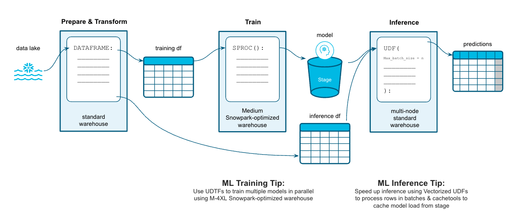

author: Michael Gorkow
id: getting_started_snowpark_machine_learning
summary: Machine Learning with Snowpark Python for Credit Card Approval Prediction
categories: Getting Started
environments: web
status: Published 
feedback link: https://github.com/Snowflake-Labs/sfguides/issues
tags: Getting Started, Data Science, Data Engineering, Machine Learning, Snowpark 

# Machine Learning with Snowpark Python: - Credit Card Approval Prediction
<!-- ------------------------ -->
## Overview 
Duration: 5

Python is the language of choice for Data Science and Machine Learning workloads. Snowflake has long supported Python via the Python Connector, allowing data scientists to interact with data stored in Snowflake from their preferred Python environment. This did, however, require data scientists to write verbose SQL queries. To provide a more friendly, expressive, and extensible interface to Snowflake, we built **Snowpark Python**, a native Python experience with a pandas and PySpark-like API for data manipulation. This includes a client-side API to allow users to write Python code in a Spark-like API without the need to write verbose SQL. Python UDF and Stored Procedure support also provides more general additional capabilities for compute pushdown.

Snowpark includes client-side APIs and server-side runtimes that extends Snowflake to popular programming languages including Scala, Java, and Python. Ultimately, this offering provides a richer set of tools for Snowflake users (e.g. Python’s extensibility and expressiveness) while still leveraging all of Snowflake’s core features, and the underlying power of SQL, and provides a clear path to production for machine learning products and workflows.

A key component of Snowpark for Python is that you can "Bring Your Own IDE"- anywhere that you can run a Python kernel, you can run client-side Snowpark Python. You can use it in your code development the exact same way as any other Python library or module. In this quickstart, we will be using Jupyter Notebooks, but you could easily replace Jupyter with any IDE of your choosing.

Throughout this quickstart, we will specifically explore the power of the Snowpark Python Dataframe API, as well as server-side Python runtime capabilities, and how Snowpark Python can enable and accelerate end-to-end Machine Learning workflows.

The source code for this quickstart is available on [GitHub](https://github.com/Snowflake-Labs/sfguide-getting-started-machine-learning).

### Prerequisites
- Working knowledge of [Python](https://www.udemy.com/course/data-analysis-with-python-and-pandas/)
- Familiarity with [Snowflake](https://quickstarts.snowflake.com/guide/getting_started_with_snowflake/index.html#0)

### What You’ll Learn 
- Loading and transforming data via Snowpark
- Defining Stored Procedures for non-SQL-based Data Transformations
- Defining Stored Procedures for training different machine learning models
- Defining User Defined Functions for distributed scoring of machine learning models
- Using hyper paratemer tuning in Stored Procedures

### What You’ll Need 
- A free [Snowflake Trial Account](https://signup.snowflake.com/) 
- [Anaconda Integration enabled by ORGADMIN](https://docs.snowflake.com/en/developer-guide/udf/python/udf-python-packages.html#using-third-party-packages-from-anaconda)
- Python 3.8
- Jupyter Notebook

### What You’ll Build 
You will build an end-to-end data science workflow leveraging Snowpark for Python
- to load, clean and prepare data
- to train different machine learning models using Python Stored Procedures
- to deploy the trained models in Snowflake using Python User Defined Functions (UDFs)

The end-to-end workflow will look like this:



<!-- ------------------------ -->
## Use-Case: Credit Card Approval Prediction
Duration: 3

You are part of a team of data engineers and data scientists at a banking company that has been tasked to identify high-risk customers using a machine learning based solution. The goal is to give a recommendation to either approve or reject the issueing of a credit card.

To build this, you have access to customer demographic and credit history data. Using Snowpark, we will ingest, analyze and transform this data to train a model that will then be deployed inside Snowflake to score new data.

The dataset you are using is part of a Kaggle competition that can be found here:  
[Kaggle: Credit Card Approval Prediction](https://www.kaggle.com/datasets/rikdifos/credit-card-approval-prediction)

<!-- ------------------------ -->
## Python Environment Setup 
Duration: 5

Let's set up the Python environment necessary to run this quickstart:

First, clone the source code for this repo to your local environment:
```bash
git clone git@github.com:Snowflake-Labs/sfguide-getting-started-snowpark-python.git
cd getting-started-snowpark-python/customer-churn-prediction
```

### Snowpark Python via Anaconda
If you are using [Anaconda](https://www.anaconda.com/products/distribution) on your local machine, create a conda env for this quickstart:
```bash
conda env create -f conda_env.yml
conda activate pysnowpark
```

Conda will automatically install `snowflake-snowpark-python==0.10.0` and all other dependencies for you.

Now, launch Jupyter Notebook on your local machine:
```bash
jupyter notebook
```

### Snowpark with your own Environment
If you decide to bring your own Python environment, please make sure to have the following packages installed:
- [Snowpark](https://pypi.org/project/snowflake-snowpark-python/)
- [Pandas](https://pypi.org/project/snowflake-snowpark-python/)
- [NumPy](https://pypi.org/project/numpy/)
- [scikit-learn](https://pypi.org/project/scikit-learn/)
- [LightGBM](https://pypi.org/project/lightgbm/)
- [XGBoost](https://pypi.org/project/xgboost/)
- [SciPy](https://pypi.org/project/scipy/)
- [Seaborn](https://pypi.org/project/seaborn/)
- [cloudpickle](https://pypi.org/project/cloudpickle/)
- [cachetools](https://pypi.org/project/cachetools/)
- [imbalanced-learn](https://pypi.org/project/imbalanced-learn/)
- [optuna](https://pypi.org/project/optuna/)

<!-- ------------------------ -->
## Snowflake Environment Setup
Duration: 5

**What You'll Do**: 
- Establish the Snowpark Python session
- Create the database, schema, and warehouses needed for the remainder of the lab
- Load raw csv data into Snowflake
- Accept Anaconda terms & conditions to enable 3rd-Party packages

First of all, locate the following information:
- Username
- Password
- [Organization- and Accountname](https://docs.snowflake.com/en/user-guide/organizations-gs.html#viewing-the-name-of-your-organization-and-its-accounts)

You'll need these values to connect to your Snowflake Account via Snowpark.

After that, open up the [`0_setup_environment`](https://github.com/Snowflake-Labs/sfguide-getting-started-machine-learning/blob/main/hol/0_setup_environment.ipynb) Jupyter notebook and run each of the cells to setup your Snowflake Account and load the required datasets into Snowflake.

<!-- ------------------------ -->
## Data Exploration and Transformation
Duration: 20

### Demo
**What You'll Do**: 
- Understand the difference between Snowpark DataFrames and Pandas DataFrames
- Performing simple data transformations
- Performing simple data analysis
- Persist your analysis results

Open up the [`1_1_DEMO_basic_data_exploration_transformation`](https://github.com/Snowflake-Labs/sfguide-getting-started-machine-learning/blob/main/hol/1_1_DEMO_basic_data_exploration_transformation.ipynb) Jupyter notebook and run each of the cells.

### Excercise
**What You'll Do**: 
- Test your understanding of working with Snowpark DataFrames
- Answer basic questions about your data by using the Snowpark-API
- Create a new feature variable

Open up the [`1_2_EXERCISE_basic_data_exploration_transformation`](https://github.com/Snowflake-Labs/sfguide-getting-started-machine-learning/blob/main/hol/1_2_EXERCISE_basic_data_exploration_transformation.ipynb) Jupyter notebook and develop/adjust the code to solve the tasks.

### Solution
You can verify your excercise results by having a look at the solution provided in the  [`1_2_SOLUTION_basic_data_exploration_transformation`](https://github.com/Snowflake-Labs/sfguide-getting-started-machine-learning/blob/main/hol/1_2_SOLUTION_basic_data_exploration_transformation.ipynb) Jupyter notebook.

### Demo
**What You'll Do**: 
- Transform the data into a final dataset ready to be used as input for machine learning models
- Variable analysis
- Missing value imputation
- Create the target variable
- Variable encoding
- Synthetic Minority Oversampling via Snowflake Stored Procedure

Open up the [`1_3_DEMO_full_data_exploration_transformation`](https://github.com/Snowflake-Labs/sfguide-getting-started-machine-learning/blob/main/hol/1_3_DEMO_full_data_exploration_transformation.ipynb) Jupyter notebook and run each of the cells.

<!-- ------------------------ -->
## Model Building & Deployment
Duration: 15

### Demo
**What You'll Do**: 
- Develop a Stored Procedure to train a simple logistic regression model with [scikit-learn](https://scikit-learn.org/stable/modules/generated/sklearn.linear_model.LogisticRegression.html)
- Deploy the trained model as a User Defined Function
- Score the model on unseen data and evaluate model metrics 

Open up the [`2_1_DEMO_model_building_scoring`](https://github.com/Snowflake-Labs/sfguide-getting-started-machine-learning/blob/main/hol/2_1_DEMO_model_building_scoring.ipynb) Jupyter notebook and run each of the cells.

<!-- ------------------------ -->
## Vectorizing & Caching for UDFs
Duration: 10

### Demo
**What You'll Do**: 
- Improve the performance of your existing User Defined Function with vectorization and caching
- Understand how caching and vectorization work

Open up the [`3_1_DEMO_vectorized_cached_scoring`](https://github.com/Snowflake-Labs/sfguide-getting-started-machine-learning/blob/main/hol/3_1_DEMO_vectorized_cached_scoring.ipynb) Jupyter notebook and run each of the cells.

<!-- ------------------------ -->
## Building Additional Models
Duration: 20

### Excercise
**What You'll Do**: 
- Apply your knowledge of Stored Procedures and User Defined Functions to develop additional models
- You can choose between [XGBoost](https://github.com/dmlc/xgboost) or [LightGBM](https://github.com/microsoft/LightGBM) as your additional model

**For XGBoost:**  
Open up the [`4_1_EXERCISE_additional_models_xgboost`](https://github.com/Snowflake-Labs/sfguide-getting-started-machine-learning/blob/main/hol/4_1_EXERCISE_additional_models_xgboost.ipynb) Jupyter notebook and develop/adjust the code to solve the tasks.

**For LightGBM:**  
Open up the [`4_2_EXERCISE_additional_models_lightgbm`](https://github.com/Snowflake-Labs/sfguide-getting-started-machine-learning/blob/main/hol/4_2_EXERCISE_additional_models_lightgbm.ipynb) Jupyter notebook and develop/adjust the code to solve the tasks.

### Solution
**For XGBoost:**  
You can verify your excercise results by having a look at the solution provided in the  [`4_1_SOLUTION_additional_models_xgboost`](https://github.com/Snowflake-Labs/sfguide-getting-started-machine-learning/blob/main/hol/4_1_SOLUTION_additional_models_xgboost.ipynb) Jupyter notebook.

**For LightGBM:**  
You can verify your excercise results by having a look at the solution provided in the  [`4_2_SOLUTION_additional_models_lightgbm`](https://github.com/Snowflake-Labs/sfguide-getting-started-machine-learning/blob/main/hol/4_2_SOLUTION_additional_models_lightgbm.ipynb) Jupyter notebook.

<!-- ------------------------ -->
## Hyperparameter Tuning with Optuna
Duration: 10

### Demo
**What You'll Do**: 
- Utilize [Optuna](https://github.com/optuna/optuna) to perform hyper parameter tuning inside a Stored Procedure
- Deploy the optimized model with a User Defined Function
- Evaluate the resulting model

Open up the [`5_1_DEMO_hyperparameter_tuning_optuna`](https://github.com/Snowflake-Labs/sfguide-getting-started-machine-learning/blob/main/hol/5_1_DEMO_hyperparameter_tuning_optuna.ipynb) Jupyter notebook and run each of the cells.

<!-- ------------------------ -->
## Conclusion
Duration: 2

Through this Quickstart we were able to experience how Snowpark for Python enables you to use familiar syntax and constructs to process data where it lives with Snowflake’s elastic, scalable and secure engine, accelerating the path to production for data pipelines and ML workflows. Here’s what you were able to complete:

- Loading and transforming data via Snowpark
- Defining Stored Procedures for non-SQL-based Data Transformations
- Defining Stored Procedures for training different machine learning models
- Defining User Defined Functions for distributed scoring of machine learning models
- Using hyper paratemer tuning in Stored Procedures

For more information on Snowpark Python, and Machine Learning in Snowflake, check out the following resources:
- [Snowpark Python Developer Guide](https://docs.snowflake.com/en/developer-guide/snowpark/python/index.html)
- [Snowpark Python API Docs](https://docs.snowflake.com/en/developer-guide/snowpark/reference/python/index.html)