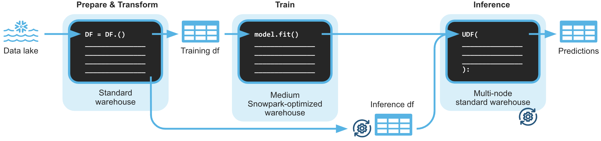

author: Michael Gorkow
id: getting_started_snowpark_machine_learning
summary: Machine Learning with Snowpark Python for Credit Card Approval Prediction
categories: data-science-&-ml,app-development,architecture-patterns,solution-examples
environments: web
status: Published 
feedback link: https://github.com/Snowflake-Labs/sfguides/issues
tags: Getting Started, Data Science, Data Engineering, Machine Learning, Snowpark 

# Machine Learning with Snowpark Python: - Credit Card Approval Prediction
<!-- ------------------------ -->
## Overview 
Duration: 5

### What is Snowpark?

The set of libraries and runtimes in Snowflake that securely deploy and process non-SQL code, including Python, Java and Scala.

**Familiar Client Side Libraries** - Snowpark brings deeply integrated, DataFrame-style programming and OSS compatible APIs to the languages data practitioners like to use. It also includes the Snowpark ML API for more efficient ML modeling (public preview) and ML operations (private preview).

**Flexible Runtime Constructs** - Snowpark provides flexible runtime constructs that allow users to bring in and run custom logic. Developers can seamlessly build data pipelines, ML models, and data applications with User-Defined Functions and Stored Procedures.

Learn more about [Snowpark](https://www.snowflake.com/snowpark/).


### What is Snowpark ML?

Snowpark ML is a new library for faster and more intuitive end-to-end ML development in Snowflake. Snowpark ML has 2 APIs: Snowpark ML Modeling (in Public Preview) for model development and Snowpark ML Operations (in Private Preview) for model deployment.

This quickstart will focus on the Snowpark ML Modeling API, which scales out feature engineering and simplifies ML training execution in Snowflake.

The source code for this quickstart is available on [GitHub](https://github.com/Snowflake-Labs/sfguide-getting-started-machine-learning).

### Prerequisites
- Working knowledge of [Python](https://www.udemy.com/course/data-analysis-with-python-and-pandas/)
- Familiarity with [Snowflake](https://quickstarts.snowflake.com/guide/getting_started_with_snowflake/index.html#0)

### What You’ll Learn 
- Loading and transforming data via Snowpark
- Apply scalable data transformations with Snowpark ML
- Train, score and evaluate models with Snowpark ML
- Hyperparameter Tuning with Snowpark ML

### What You’ll Need 
- A free [Snowflake Trial Account](https://signup.snowflake.com/) 
- [Anaconda Integration enabled by ORGADMIN](https://docs.snowflake.com/en/developer-guide/udf/python/udf-python-packages.html#using-third-party-packages-from-anaconda)
- Python 3.9
- Jupyter Notebook

### What You’ll Build 
You will build an end-to-end data science workflow
- to load, clean and prepare data
- to train different machine learning models
- to tune hyper parameters

The end-to-end workflow will look like this:



<!-- ------------------------ -->
## Use-Case: Credit Card Approval Prediction
Duration: 3

You are part of a team of data engineers and data scientists at a banking company that has been tasked to identify high-risk customers using a machine learning based solution. The goal is to give a recommendation to either approve or reject the issueing of a credit card.

To build this, you have access to customer demographic and credit history data. Using Snowpark, we will ingest, analyze and transform this data to train a model that will then be deployed inside Snowflake to score new data.

The dataset you are using is part of a Kaggle competition that can be found here:  
[Kaggle: Credit Card Approval Prediction](https://www.kaggle.com/datasets/rikdifos/credit-card-approval-prediction)

<!-- ------------------------ -->
## Python Environment Setup 
Duration: 5

Let's set up the Python environment necessary to run this quickstart:

First, clone the source code for this repo to your local environment:
```bash
git clone https://github.com/Snowflake-Labs/sfguide-getting-started-machine-learning.git
cd sfguide-getting-started-machine-learning/
```

### Snowpark Python via Anaconda
If you are using [Anaconda](https://www.anaconda.com/products/distribution) on your local machine, create a conda env for this quickstart:
```bash
conda env create -f conda_env.yml
conda activate pysnowpark
```

Conda will automatically install `snowflake-snowpark-python` and all other dependencies for you.

Now, launch Jupyter Notebook on your local machine:
```bash
jupyter notebook
```

### Snowpark with your own Environment
If you decide to bring your own Python environment, please make sure to install all of the required packages from the conda_env.yml

> aside positive
> There is a known issue with running Snowpark Python on Apple M1 chips due to memory handling in pyOpenSSL.
> Please refer to the Snowpark documentation to solve this issue:
> [Issue with running Snowpark Python on Apple M1 chips](https://docs.snowflake.com/en/developer-guide/snowpark/python/setup.html#prerequisites)

<!-- ------------------------ -->
## Snowflake Environment Setup
Duration: 5

**What You'll Do**: 
- Establish the Snowpark Python session
- Create the database, schema, and warehouses needed for the remainder of the lab
- Load raw csv data into Snowflake
- Accept Anaconda terms & conditions to enable 3rd-Party packages

First of all, locate the following information:
- Username
- Password
- [Organization- and Accountname](https://docs.snowflake.com/en/user-guide/organizations-gs.html#viewing-the-name-of-your-organization-and-its-accounts)

You'll need these values to connect to your Snowflake Account via Snowpark.

After that, open up the [`0_setup_environment`](https://github.com/Snowflake-Labs/sfguide-getting-started-machine-learning/blob/main/hol/0_setup_environment.ipynb) Jupyter notebook and run each of the cells to setup your Snowflake Account and load the required datasets into Snowflake.

<!-- ------------------------ -->
## Data Exploration and Transformation
Duration: 20

### Demo
**What You'll Do**: 
- Understand the difference between Snowpark DataFrames and Pandas DataFrames
- Performing simple data transformations
- Performing simple data analysis
- Persist your analysis results

Open up the [`1_1_DEMO_basic_data_exploration_transformation`](https://github.com/Snowflake-Labs/sfguide-getting-started-machine-learning/blob/main/hol/1_1_DEMO_basic_data_exploration_transformation.ipynb) Jupyter notebook and run each of the cells.

### Excercise
**What You'll Do**: 
- Test your understanding of working with Snowpark DataFrames
- Answer basic questions about your data by using the Snowpark-API
- Create a new feature variable

Open up the [`1_2_EXERCISE_basic_data_exploration_transformation`](https://github.com/Snowflake-Labs/sfguide-getting-started-machine-learning/blob/main/hol/1_2_EXERCISE_basic_data_exploration_transformation.ipynb) Jupyter notebook and develop/adjust the code to solve the tasks.

### Solution
You can verify your excercise results by having a look at the solution provided in the  [`1_2_SOLUTION_basic_data_exploration_transformation`](https://github.com/Snowflake-Labs/sfguide-getting-started-machine-learning/blob/main/hol/1_2_SOLUTION_basic_data_exploration_transformation.ipynb) Jupyter notebook.

### Demo
**What You'll Do**: 
- Transform the data into a final dataset ready to be used as input for machine learning models
- Variable analysis
- Perform value imputation & variable encoding using scalable Snowpark ML functions
- Create the target variable
- Synthetic Minority Oversampling via Snowflake Stored Procedure

Open up the [`1_3_DEMO_full_data_exploration_transformation`](https://github.com/Snowflake-Labs/sfguide-getting-started-machine-learning/blob/main/hol/1_3_DEMO_full_data_exploration_transformation.ipynb) Jupyter notebook and run each of the cells.

<!-- ------------------------ -->
## Model Building & Deployment
Duration: 15

### Demo
**What You'll Do**:  
- Train, score and evaluate a simple logistic regression model with Snowpark ML that is based on [scikit-learn](https://scikit-learn.org/stable/modules/generated/sklearn.linear_model.LogisticRegression.html)

Open up the [`2_1_DEMO_model_building_scoring`](https://github.com/Snowflake-Labs/sfguide-getting-started-machine-learning/blob/main/hol/2_1_DEMO_model_building_scoring.ipynb) Jupyter notebook and run each of the cells.

<!-- ------------------------ -->
## Building Additional Models
Duration: 20

### Excercise
**What You'll Do**: 
- Apply your knowledge of Snowpark ML to train, score and evaluate additional models
- You can choose between [XGBoost](https://github.com/dmlc/xgboost) or [LightGBM](https://github.com/microsoft/LightGBM) as your additional model

**For XGBoost:**  
Open up the [`3_1_EXERCISE_additional_models_xgboost`](https://github.com/Snowflake-Labs/sfguide-getting-started-machine-learning/blob/main/hol/3_1_EXERCISE_additional_models_xgboost.ipynb) Jupyter notebook and develop/adjust the code to solve the tasks.

**For LightGBM:**  
Open up the [`3_2_EXERCISE_additional_models_lightgbm`](https://github.com/Snowflake-Labs/sfguide-getting-started-machine-learning/blob/main/hol/3_2_EXERCISE_additional_models_lightgbm.ipynb) Jupyter notebook and develop/adjust the code to solve the tasks.

### Solution
**For XGBoost:**  
You can verify your excercise results by having a look at the solution provided in the  [`3_1_SOLUTION_additional_models_xgboost`](https://github.com/Snowflake-Labs/sfguide-getting-started-machine-learning/blob/main/hol/3_1_SOLUTION_additional_models_xgboost.ipynb) Jupyter notebook.

**For LightGBM:**  
You can verify your excercise results by having a look at the solution provided in the  [`3_2_SOLUTION_additional_models_lightgbm`](https://github.com/Snowflake-Labs/sfguide-getting-started-machine-learning/blob/main/hol/3_2_SOLUTION_additional_models_lightgbm.ipynb) Jupyter notebook.

<!-- ------------------------ -->
## Hyperparameter Tuning with Snowpark ML and GridSearchCV
Duration: 10

### Demo
**What You'll Do**: 
- Tune the parameters of an XGBoost model with [GridSearchCV](https://scikit-learn.org/stable/modules/generated/sklearn.model_selection.GridSearchCV.html) using the Snowpark ML API
- Evaluate the parameter tuning process

Open up the [`4_1_DEMO_hyperparameter_tuning_gridsearch`](https://github.com/Snowflake-Labs/sfguide-getting-started-machine-learning/blob/main/hol/4_1_DEMO_hyperparameter_tuning_gridsearch.ipynb) Jupyter notebook and run each of the cells.

<!-- ------------------------ -->
## Conclusion
Duration: 2

Through this Quickstart we were able to experience how Snowpark for Python enables you to use familiar syntax and constructs to process data where it lives with Snowflake’s elastic, scalable and secure engine, accelerating the path to production for data pipelines and ML workflows. Here’s what you were able to complete:

- Loading and transforming data via Snowpark
- Apply scalable data transformations with Snowpark ML
- Train, score and evaluate models with Snowpark ML
- Hyperparameter Tuning with Snowpark ML

For more information on Snowpark Python, and Machine Learning in Snowflake, check out the following resources:
- [Snowpark Python Developer Guide](https://docs.snowflake.com/en/developer-guide/snowpark/python/index.html)
- [Snowpark Python API Docs](https://docs.snowflake.com/en/developer-guide/snowpark/reference/python/index.html)
- [Snowpark ML Docs](https://docs.snowflake.com/en/developer-guide/snowpark-ml/index)