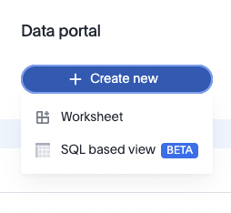
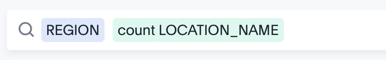
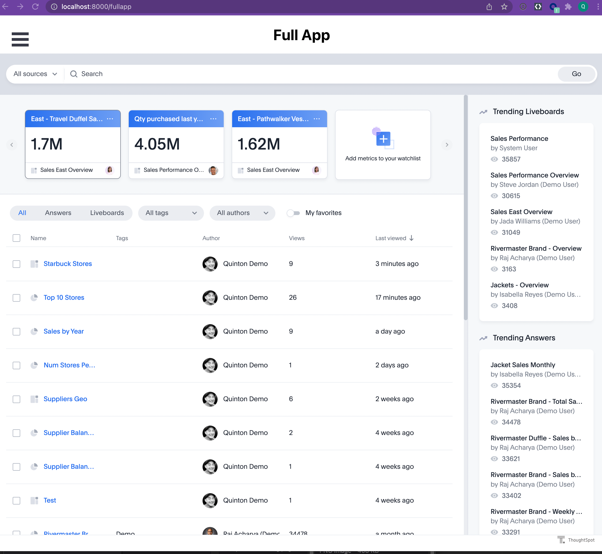

author: Thoughtspot
id: getting_started_thoughtspot
summary: Build an interactive react app with ThoughtSpot and Snowflake
categories: Getting Started
environments: web
status: Published
feedback link: https://github.com/Snowflake-Labs/sfguides/issues
tags: Getting Started, Data Science, Data Engineering, Twitter

# Build a ReactJS app with ThoughtSpot and Snowflake


# Overview

With massive amounts of data being generated every day, it is no surprise that the need to store and make sense of all this data is critical to business success. To store data, Snowflake has emerged as one of the leading Cloud Data Platforms for its ease of setup, maintenance and speed. Alongside Snowflake, ThoughtSpot follows a similar mentality of ease of use with powerful AI-based search and analytics tools. This tutorial will teach you how to use ThoughtSpot to connect to Snowflake and, using the ThoughtSpot Everywhere developer tools, add insights into a React-based web app.

Whilst we are using React for this tutorial, similar techniques can be used to add ThoughtSpot to any app, regardless of platform, thanks to the open API approach ThoughtSpot delivers. You can use scalable RESTful APIs or SDKs in major programming languages. The choice is yours.


# Getting Started

Duration: 0:10:00

To get started, we are going to need a few cloud environments, one for Snowflake and another for ThoughtSpot. Thankfully, both platforms offer free trials you can sign up for online. This tutorial will use sample datasets in each environment. If you already have an existing Snowflake or ThoughtSpot instance, it is recommended to create a new free trial instance.


## Sign up for a Snowflake Free Trial

Jump over to the [Snowflake Free Trial signup page](https://signup.snowflake.com/?utm_source=tsquickstart), enter the details required, and tap continue. Follow the steps required and check your email for an Activation link. Once you are logged in, tap on **Marketplace**. We will take advantage of the Snowflake Data Marketplace and add a sample dataset which we want to derive analytics from. Select _SafeGraph_ from the **Providers** dropdown, then tap on _Free Foot Traffic Data Sample: SafeGraph Patterns - Starbucks**.**_ Tap **Get Data** and follow the steps to add the dataset to your account.  We will use the ACCOUNTADMIN role for the tutorial.


Once your data has loaded, tap Query Data. This will take you to a worksheet where you can write SQL statements to interrogate data. The Data Marketplace wizard will pre-populate the worksheet with a few queries for you to test. Once you are happy that everything has been installed correctly, take note of the database settings. We will need these to create the connection in ThoughtSpot.  


<table>
  <tr>
   <td>Snowflake URL
   </td>
   <td>This is the first part of the snowflake instance URL, right before .snowflakecomputing.com. The easiest place to grab this is from your activation email. This email will contain a URL that looks like <a href="https://urldefense.com/v3/__https://TNA40119.snowflakecomputing.com/console/login__;!!MZ3Fw45to5uY!YA_pi89aThf5uUFz4vKD4rcmQ3T--cBsJc3wr20V-fslV_mW-3QB-q3tuT1MjF0BEhU0Ozw$">https://TNA40119.snowflakecomputing.com/console/login</a>. In this example, the value you want is TNA40119. Yours will be different, of course.
   </td>
  </tr>
  <tr>
   <td>Username
   </td>
   <td>This is your username assigned to you by Snowflake. Check your Activation email if you forgot it.
   </td>
  </tr>
  <tr>
   <td>Password
   </td>
   <td>The password you created upon signup
   </td>
  </tr>
  <tr>
   <td>Role
   </td>
   <td>In our tutorial we will use ACCOUNTADMIN
   </td>
  </tr>
  <tr>
   <td>Warehouse
   </td>
   <td>COMPUTE_WH
   </td>
  </tr>
  <tr>
   <td>Database
   </td>
   <td>STARBUCKS_PATTERNS_SAMPLE
   </td>
  </tr>
  <tr>
   <td>Schema
   </td>
   <td>PUBLIC
   </td>
  </tr>
</table>


## Sign up for a ThoughtSpot Free Trial

Next, let’s sign-up for a ThoughtSpot Free Trial. Head over to the [sign-up page](https://www.thoughtspot.com/trial?utm=snowtstutorial) and complete the required fields. Select Snowflake as your Cloud Data Warehouse provider. This is not necessary, but does help us better understand trends in customer data usage. In a few minutes you should receive an activation email. Follow the instructions included to finish creating your Trial account.


# Create A Connection

Duration: 0:10:00

Now that we have our cloud environments setup, it is time to create the connection from ThoughtSpot to Snowflake. If you haven’t done so already, go ahead and log into your ThoughtSpot account. From the top menu, select Data, then Connections from the left hand menu, tap Snowflake, give your connection the name `SnowflakeStarbucks`, and tap continue.


After tapping Continue, you will be prompted to enter Snowflake connection details. These are the details you collected earlier from the Snowflake Worksheet Context. Copy these into the form, paying careful attention to the case. Connection details are case sensitive and need to appear exactly as they appear in Snowflake. Once you have entered your details, tap **Continue** to select the tables we want to connect to.

To keep things simple, we will use a single table, `Patterns`, in this tutorial. Patterns contain information about store geography, number of visitors per store, other brands they shopped for on the same day, and more.

Go ahead and map all the fields for the patterns table.


Once you have selected all the appropriate fields, tap **Create Connection**.


# Search Data

Duration: 0:05:00

ThoughtSpot makes it incredibly easy for anyone to search data. Using powerful AI, users can type natural language searches to find and save the answers they need. Let’s start by finding the answer to “_what are the top 10 most visited Starbucks locations?_”.

Tap on Search Data in the top navigation bar, select Patterns as our data source, and add the following search criteria.


 Once you are done, tap go to see the results.


The great thing about ThoughtSpot is the notion of live data. Currently, we have our basic results, but we want to do further analysis, like find the top 10 stores. To do this, simply type top 10 into your query, then tap the ellipsis in the RAW_VISITS_COUNTS and Sort by Descending.


Next, let’s add a Pie chart visualization. Tap the Chart icon on the right hand side, and select Pie Chart. Then, tap the Cog icon and configure your chart like the image below.


Now things are starting to look good. Rename the search to “Top 10 Stores” by tapping on the current name.

Go ahead and save this search and visualization.. You can save the search by tapping on the ellipsis and selecting Save.  by pinning it to a liveboard. Then, add it to a liveboard To do so, tap the Pin button. You can think of a liveboard as a dynamic workspace similar to a traditional dashboard, but with a critical difference - your data is always live and you can drill into it at any time, analyzing it in any way to find the answers you want. Since this is your first time pinning, you will need to create a new Liveboard. Give it a name like “Starbucks Stores.” It is important to save your search separately from adding to a pinboard. Only then, will you be able access this search by name in the Developer Playground, which we will use later.

In this step, you have created your first answer. You can access this at any time via the Answers tab, or in the Liveboard you created.


# Create Worksheet using Data Workspace

Duration: 0:05:00

So far we have used the visual designers to create an answer. If you are more familiar with, or have an existing, SQL statement, you can also use this to create a Worksheet using the new SQL based view feature currently available in Beta. To do so, select SQL based view from the Data tab, and choose the SnowflakeStarbucks connection. If you do not see this option in the Data tab, don’t worry. In the current release, this feature needs to be enabled by contacting ThoughtSpot support. In the next release, it will be automatically provisioned for you.





From here, you can write your query using familiar SQL syntax. For example, if we wanted to create a similar Worksheet from the tutorial steps above, we could write the following statement.


```

SELECT PLACEKEY, LOCATION_NAME, CITY, REGION, POSTAL_CODE, RAW_VISIT_COUNTS FROM PUBLIC.PATTERNS ORDER BY RAW_VISIT_COUNTS DESC LIMIT 10;
```


Go ahead and run the statement to see the results. From here, give your Worksheet a name and tap Save to create a Worksheet your users can use to analyze data. The great thing too, is that now that my Worksheet has been created within ThoughtSpot, you can customize it using the visual designer tools as well.

This hybrid approach to Worksheet creation works very well for the typical developer who is comfortable with typical sql, but may not be an expert in more advanced grouping, and functions. You can quickly create a worksheet from an existing SQL statement, then tweak the aggregate functions using the visual designer.


# Top Stores By State Using Geo Fields

Duration: 0:10:00

Let’s create another answer for “how many stores are in each state?”. Tap on Search data again, enter the following criteria. This time we are taking advantage of the count keyword.





Next, tap the change visualization button on the right. We want to use a Geo Bubble map to plot the results on a map showing store concentrations by the size of a bubble. You will notice that the Geo charts are disabled. This is because the Patterns table which we mapped previously did not include any Geo fields. We need to fix this first. Quickly save your answer without a chart calling it “Num Stores by State”, then tapping on the **Data** tab.

Once in the data table, make sure you have selected **Data Objects**, then choose **PATTERNS** and find the **REGION** Field. Scroll to the right until you find the column name **Geo Config**. Change the value from None to Sub-nation / State and tap **OK. **Then, tap **Save**.

Tap Answers in the top navigation and select the _Num Stores By State _answer you started previously. You may notice that a Geo Area chart type has now automatically been associated with your answer. Tap on the change visualization button and choose Geo Bubble.  


Go ahead and Pin this answer and visualization to the Starbuck Stores Liveboard we created earlier.

Tapping on the Liveboard now shows our two visualizations.


At this point, we have two answers and a liveboard which team members can use and expand upon. We have only scratched the surface of what is possible with ThoughtSpot’s AI-powered analytics, but it should give you a brief introduction into how ThoughtSpot can be used with Snowflake data. In the next section, we will show how you can embed these visualizations into your existing apps.


# Embed Analytics with ThoughtSpot Everywhere

Duration: 0:15:00

One of the major benefits of the ThoughtSpot Platform is the ability to a spectrum of development processes. So far during this tutorial we have utilized the visual tools. Now it is time to write some code. ThoughtSpot provides a complete set of RESTful APIs, and SDKs to allow you to embed analytics into any application. Collectively, these developer tools are called ThoughtSpot Everywhere.

For this tutorial weThoughtSpot Everywhere Visual Embed SDK to take the Liveboard we just created and embed it into a REACT-based web application. This is a very typical scenario where a business may have an existing portal employees or customers use to track orders, sales, or whatever they need. With ThoughtSpot Everywhere, adding analytics is incredibly easy. Let’s get started.


## Set up your Local Development Environment

We are going to use React to build our web application. Installing and configuring React, and it’s dependencies is different for each environment. This tutorial will use Mac OS as the example development environment. You can find steps to install React for Windows [here](https://docs.microsoft.com/en-us/windows/dev-environment/javascript/react-on-windows). For the Mac, you will need the following:


### Node.js & NPM

NPM, is a very popular package management solution built with Node.js (thus the name, Node Package Manager). This tutorial will use NPM to install the React.js framework. Many Macs have Node and NPM already installed. You can check this by opening a terminal window and typing `$ node -v` If you do not see a successful response, go ahead and [download the installer](https://nodejs.org/en/download/) for your platform. (Please use the LTS version. Occasionally the latest release has minor bugs). Once downloaded, double-click and follow the prompts to install.


### VSCode

Whilst not required, a good IDE is certainly a productivity booster for many developers. Everyone has their own preference. Feel free to use your IDE of choice. For the examples within this tutorial, we will use VSCode. If you like it, you can [download it for free](https://code.visualstudio.com/download) for your preferred platform.


# Create the React webapp

Duration: 0:20:00


## Step 1: Create app

With your terminal window still open, let’s get started creating the React app. Enter the following command:


```
$ npx create-react-app snowspot-app
```


Open your favorite IDE to the `snowspot-app` folder. By default, React uses localhost:3000. We need to change this to `localhost:8000`. This host and port name are pre-configured within ThoughtSpot’s Content Security Policy settings to allow local development. Within your project’s root directory open package.json and change the scripts start value to the following:


```
"scripts": {
   "start": "PORT=8000 react-scripts start",
   "build": "react-scripts build",
   "test": "react-scripts test",
   "eject": "react-scripts eject"
 },
```


Change the name of Replace the contents of `App.js` to `App.jsx`, then replace the context with the following code:


```
import './App.css';

function App() {
 return (
   <div className="App">


   </div>
 );
}
export default App;
```


## Step 2: Add sub-pages

Next, we are going to set up routing to support navigating through our app. We will be creating a multi-page page app, with separate pages designed to encapsulate different features of our app. Whether you decide to build a single page or multi-page app really comes down to personal preference.

Create a new folder `Components` in the src directory, then create 2 additional pages:


* storesales.js
* about.js


## Step 3: Add Routing support to your project

From the terminal, make sure you `cd` into `snowspot-app` folder, then execute the following command.


```
$snowspot-app> npm add react-router-dom@6
```


Once the command completes, replace the contents of index.js with the following:


```
import React from 'react';
import ReactDOM from 'react-dom';
import { BrowserRouter as Router } from 'react-router-dom';
import './index.css';
import App from './App';

ReactDOM.render(
 <Router>
   <App />
 </Router>
 ,
 document.getElementById('root')
);
```


Then add the following import line to the top of `App.jsx`, directly below the import statement for `App.css`:


```
import { Route, Routes} from "react-router-dom";
```


## Step 4: Configure the subpages

Copy the following code into the relevant subpages. We will add more to these pages later, but for now, we just want to get everything set up to support navigation


### storesales.js


```
import React from 'react'

export default function StoreSales() {
   return (
       <div>
           <h1>Top 10 Stores</h1>
       </div>
   )
}
```


### about.js \


```
import React from 'react'

export default function About() {
   return (
       <div>
           <h1>About</h1>
              <p> ThoughtSpot and Snowflake Sample App</p>
       </div>
   )
}
```


## Step 5: Add a hamburger menu

Currently, our app isn’t very useful. There is no navigation. Let’s go ahead and fix that by adding a hamburger menu using [react-burger-menu](https://github.com/negomi/react-burger-menu). Add it to your project:


```
$snowspot-app> npm add react-burger-menu
```


Then, create a new folder, `Components`, with a subfolder, `Burger`, and two files, `burger.css` and `BurgerMenu.js`. Once complete, your app structure should look like this:


Then, add the following code:


### BurgerMenu.js


```
import React from "react";
import { slide as Menu } from "react-burger-menu";
import "./burger.css";

const toggleMenu = ({ isOpen }) => {
 const menuWrap = document.querySelector(".bm-menu-wrap");
 isOpen
   ? menuWrap.setAttribute("aria-hidden", false)
   : menuWrap.setAttribute("aria-hidden", true);
};

const BurgerMenu = () => {
 return (
   <Menu noOverlay onStateChange={toggleMenu}>     
       <a className="bm-item" href="/">Home</a>
       <a className="bm-item" href="/storesales">Top 10</a>
       <a className="bm-item" href="/about">About</a>     
   </Menu>
 );
};
export default BurgerMenu;
```


### burger.css


```
/* Position and sizing of burger button */
.bm-burger-button {
   position: fixed;
   width: 36px;
   height: 30px;
   left: 36px;
   top: 36px;
 }
  /* Color/shape of burger icon bars */
 .bm-burger-bars {
   background: #373a47;
 }
  /* Color/shape of burger icon bars on hover*/
 .bm-burger-bars-hover {
   background: #a90000;
 }
  /* Position and sizing of clickable cross button */
 .bm-cross-button {
   height: 24px;
   width: 24px;
 }
  /* Color/shape of close button cross */
 .bm-cross {
   background: #bdc3c7;
 }
  /*
 Sidebar wrapper styles
 Note: Beware of modifying this element as it can break the animations - you should not need to touch it in most cases
 */
 .bm-menu-wrap {
   position: fixed;
   height: 100%;
 }
  /* General sidebar styles */
 .bm-menu {
   background: #373a47;
   padding: 2.5em 1.5em 0;
   font-size: 1.15em;
 }
  /* Morph shape necessary with bubble or elastic */
 .bm-morph-shape {
   fill: #373a47;
 }
  /* Wrapper for item list */
 .bm-item-list {
   color: #b8b7ad;
   padding: 0.8em;
 }
  /* Individual item */
 .bm-item {
   display: inline-block;
   color: #b8b7ad;
 }
  /* Styling of overlay */
 .bm-overlay {
   background: rgba(0, 0, 0, 0.3);
 }
```


## Step 6: Create route navigation

All that is left for us to do is create the React routes, and add the Hamburger menu to our app. To finish wiring everything up, add the following imports to your App.jsx. You can add these directly below the `react-router-dom` import.


```
import BurgerMenu from './Components/Burger/BurgerMenu';
import StoreSales from './Components/storesales'
import About from './Components/about';
```


Then, within `&lt;div className="App">` element add our routing logic, and the hamburger menu component.


```
<div className="App">
     <header>
       <BurgerMenu/>
     </header>

     <Routes>
       <Route path="/" element={<h1>Home</h1>} />
       <Route path="/storesales" element={<StoreSales />} />
       <Route path="/about" element={<About />} />
     </Routes>
 </div>

```


Your complete App.jsx page should look like this:


```
import './App.css';
import React from 'react';
import BurgerMenu from './Components/Burger/BurgerMenu';
import { Route, Routes} from 'react-router-dom';
import StoreSales from './Components/storesales'
import About from './Components/about';
function App() {

 return (
   <div className="App">
     <header>
       <BurgerMenu/>
     </header>

     <Routes>
       <Route path="/" element={<h1>Home</h1>} />
       <Route path="/storesales" element={<StoreSales />} />
       <Route path="/about" element={<About />} />
     </Routes>
 </div>
  );
}
export default App;
```


# Run the app

Duration: 0:05:00

It’s time to test your app out. From the terminal, execute the following command from within your app directory


```
$snowspot-app> npm start
```


You should see an app like below. Try tapping on the hamburger and testing out the links.


For extra style credits, you can also change the animation import from slide to [another supported animation](https://www.npmjs.com/package/react-burger-menu). For example, let’s say I prefer the bubble animation, my import line in `BurgerMenu.js` would look like this:


```
import { bubble as Menu } from "react-burger-menu";
```


If you receive an error message that starts with **Error: Invalid Hook Call Warning**, you may need to explicitly set the react-router-dom version. If so, open `package.json` and add the following to the dependencies array:


```
"react-router-dom": "^6.0.2",
```


Save the file, and execute the following from the command line, then run your project again:


```
$snowspot-app> npm install
```


# Use the Developer Playground

Duration: 0:10:00

With our basic app up and running, it is time to start adding ThoughtSpot components to it. The ThoughtSpot platform gives developers the freedom to choose how they prefer to work. Many like to jump in and write all the code, while others may want to use a visual tool to iterate and experiment. For low-code development, ThoughtSpot provides a really handy Developer Playground for iterating and experimenting with embedded components.

We are going to use the Developer Playground to generate a lot of the boilerplate code we need, then when everything is configured correctly, we will jump into some more fine tuning. This hybrid approach to developing with ThoughtSpot is a great way to quickly create your app without having to spend a lot of time searching documentation for all the parameters and configurations you need.

From within Thoughtspot, Tap **Develop** in the top navigation, then **Search** from the left hand navigation. You are now in the Playground. On the left of the screen is the selector of the feature or component you want to embed, and its configurable parameters. As you change the configuration, it dynamically changes the code for you. Tapping on run then renders the results on the right hand side.

We want to start by embedding the Answer we created earlier. Tap **Select saved search** and choose Top 10 Stores from the dropdown list. Once selected, tap run to see your answer render on the right hand side.


You will notice that the code block on the lower left automatically updates. In this case, the answerId is populated for you. Go ahead and copy this to your clipboard. We will need this later in the tutorial to pass to the search react component.


# Add ThoughtSpot React Components

Duration: 0:15:00

Now that we have our app structure, and have played with configurations through the Playground, let’s go ahead and add the ThoughtSpot Everywhere Embed SDK. This SDK gives you access to the ThoughtSpot Everywhere platform components such as Liveboards, Visualizations, and Search. We will be using the Liveboard component in this tutorial. Change directory to `snowsspot-app`, then enter the following command:


```
$ npm i @thoughtspot/visual-embed-sdk
```


Then, in` App.jsx`, add the following directly after the existing imports.


```
// ThoughtSpot
import {
 AuthType,
 init,
 Page,
} from "@thoughtspot/visual-embed-sdk";

const TSURL = "https://try.thoughtspot.cloud";
```


And, initialize the connection within the App() function. ThoughtSpot Everywhere supports a [number of different authentication mechanisms](https://docs.thoughtspot.com/visual-embed-sdk/release/en/?pageid=search-embed#_add_the_embed_domain). For this tutorial, we are using `AuthType.None`. `AuthType.None` will prompt you for login credentials at runtime and store it as a session cookie.` AuthType.None` is not recommended for production use but works fine for our demo app.


```
init({
   thoughtSpotHost: TSURL,
   authType: AuthType.None
 });
```


Next, we will update storesales.js to embed the Answer we created earlier. This is where we can take advantage of the Visual Embed SDK. There are a number of approaches you can use via the SDK. We are going to use the React components for adding ThoughtSpot services. Go ahead and replace the contents with the following code:


```
import { SearchEmbed } from "@thoughtspot/visual-embed-sdk/react";

export default function StoreSales() {
   return (
       <div>
           <h1>Top 10 Stores</h1>
           <SearchEmbed frameParams={{height: "80vw"}}
                       answerId={"YOUR-ANSWERID-HERE"}/>
       </div>    
   );
}

```


Save your changes, and run your app. Tap on the hamburger icon, then Store Sales. You will now be presented with a login to your ThoughtSpot instance. Enter your details, and the Liveboard shall be rendered within your app. Tap around and see how you can interact with the data. Cool huh?


If you remember from the Developer Playground, there were also a number of configuration parameters you could set, one of these is to automatically collapse or disable the data panel on the left. We can easily add that to our SearchEmbed component to clean up the UX.


```

           <SearchEmbed frameParams={{height: "80vw"}}
                       collapseDataSources={true}
                       answerId={"YOUR-ANSWERID-HERE"}/>

```


```
Information: if you are using webpack 4, which is the default when using create-react-app v4, you will need to use the following import statement for the Visual Embed SDK

import { SearchEmbed } from "@thoughtspot/visual-embed-sdk/lib/src/react";
```


# Add Liveboard Component

Duration: 0:10:00


## Step 1: Get Liveboard Id

Adding a Liveboard is very similar to how we added a Search component. Let’s start by grabbing the `liveboardId` from the Developer Playground and copying it to the clipboard. If you are still in the Developer Playground, choose Liveboard from the Select feature to embed dropdown, then select Starbucks Stores and tap run, then copy the value from the code window on the left.


## Step 2: Add liveboard.js

Create a new file, `liveboard.js` in the Components folder of your project


```
import { LiveboardEmbed } from "@thoughtspot/visual-embed-sdk/react"


export default function Liveboard() {
   return (
       <div>
           <h1>Liveboard</h1>
           <LiveboardEmbed frameParams={{height: "80vw"}}
                liveboardId={"YOUR-LIVEBOARD-ID"} />

       </div>    
   );
}

```


## Step 3: Add Routes

Within App.jsx, add the import for fullapp.


```
import Liveboard from './Components/liveboard;
```


Then, add the path to the Routes element


```
<Routes>
       <Route path="/" element={<h1>Home</h1>} />
       <Route path="/storesales" element={<StoreSales />} />
       <Route path="/liveboard" element={<Liveboard />} />
       <Route path="/about" element={<About />} />
</Routes>
```


## Step 4: Add to Burger Menu

Now, add a link to `BurgerMenu.js` to allow users to navigate to the new page. Your links should now look like this.


```
<Menu noOverlay onStateChange={toggleMenu}>


       <a className="bm-item" href="/">Home</a>
       <a className="bm-item" href="/storesales">Top 10</a>
       <a className="bm-item" href="/liveboard">Liveboard</a>
       <a className="bm-item" href="/about">About</a>


 </Menu>
```


Save everything and run your app. You should now have your Liveboard embedded successfully.


# Add FullApp Component

Duration: 0:10:00

So far we have embedded individual components: Answers and Liveboards,  into our React app. If you want to embed the entire ThoughtSpot experience, you can achieve this using the FullApp React component. By now the process should be pretty familiar. Let’s jump in.


## Step 1: Add fullapp.js

Create a new file, `fullapp.js` in the Components folder of your project. This time we do not need a unique identifier to tell the SDK which component to embed. We can use the Page enumeration. We will use Page.Home, but other available options include Answers, Data, Liveboards, and Search. These relate to the tabs in the ThoughtSpot UI.


```
import { AppEmbed } from "@thoughtspot/visual-embed-sdk/react";
import "../index.css";

export default function FullApp() {
 return (
     <div>
         <h1>Full App</h1>
         <AppEmbed frameParams={{height: "80vw"}} fullHeight="true"
                     pageId="Page.Home" />
     </div>
 );
}
```


## Step 2: Add Routes

Within App.jsx, add the import for fullapp.


```
import FullApp from './Components/fullapp';
```


Then, add the path to the Routes element


```
<Routes>
       <Route path="/" element={<h1>Home</h1>} />
       <Route path="/storesales" element={<StoreSales />} />
       <Route path="/liveboard" element={<Liveboard />} />
       <Route path="/fullapp" element={<FullApp />} />
       <Route path="/about" element={<About />} />
</Routes>
```


## Step 3: Add to the Burger Menu

Now, add a link to `BurgerMenu.js` to allow users to navigate to the new page. Your links should now look like this.


```
<Menu noOverlay onStateChange={toggleMenu}>


       <a className="bm-item" href="/">Home</a>
       <a className="bm-item" href="/storesales">Top 10</a>
       <a className="bm-item" href="/liveboard">Liveboard</a>
       <a className="bm-item" href="/fullapp">Full App</a>
       <a className="bm-item" href="/about">About</a>


 </Menu>
```


That’s it. Go ahead and run the app, navigate to the Full App page, and check out all of your hard work. Nice job! If you want to modify aspects of the full app experience, there are a number of parameters you can configure in the `AppEmbed` component. The best way to learn what you can change is by jumping into the Developer Playground and experimenting with the options.





# Summary

Duration: 0:02:00

During this tutorial you created an app which utilizes two fundamental components of the Modern Data Stack: a cloud data platform with Snowflake, and an Analytics platform with ThoughtSpot. What’s more, you combined both platforms and embedded the insights into a React-based application using ThoughtSpot Everywhere. We only demonstrated a small portion of what’s possible, whether it is embedding other ThoughtSpot components like Search, or even the full ThoughtSpot experience, or leveraging the powerful APIs for sharing and interrogating data. You can download the complete app to jumpstart your own app development. If you want to learn more about how you can take advantage of everything you can do with ThoughtSpot, check out [developers.thoughtspot.com](https://github.com/thoughtspot/quickstarts/blob/main/snowflake%2Bthoughtspot-everywhere/developers.thoughtspot.com).
