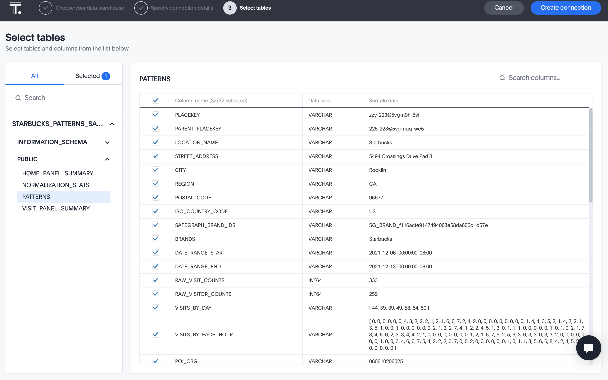

author: Thoughtspot
id: getting_started_thoughtspot
summary: Build an interactive react app with ThoughtSpot and Snowflake
categories: Getting Started
environments: web
status: Published 
feedback link: https://github.com/Snowflake-Labs/sfguides/issues
tags: Getting Started, Data Science, Data Engineering, Twitter 

# Build a ReactJS app with ThoughtSpot and Snowflake

## Overview

With massive amounts of data being generated every day, it is no surprise that the need to store and make sense of all this data is critical to business success. To store data, Snowflake has emerged as one of the leading Cloud Data Platforms for its ease of setup, maintenance and speed. Alongside Snowflake, ThoughtSpot follows a similar mentality of ease of use with powerful AI-based search and analytics tools. This tutorial will teach you how to use ThoughtSpot to connect to Snowflake and, using the ThoughtSpot Everywhere developer tools, add insights into a React-based web app. 

Whilst we are using React for this tutorial, similar techniques can be used to add ThoughtSpot to any app, regardless of platform, thanks to the open API approach ThoughtSpot delivers. You can use scalable RESTful APIs or SDKs in major programming languages. The choice is yours.


### Prerequisites
- Familiarity with Snowflake and React

### What You’ll Learn 
- how to connect Snowflake and ThoughtSpot together
- how to add ThoughtSpot to a React app

### What You’ll Need 
- A [Snowflake](https://trial.snowflake.com/) Account 
- A [ThoughtSpot](https://www.thoughtspot.com/trial?utm=snowtstutorial) Account 
- [NodeJS](https://nodejs.org/en/download/) Installed

### What You’ll Build 
- A React web app with ThoughtSpot Everywhere insights backed by Snowflake


## Getting Started

To get started, we are going to need a few cloud environments, one for Snowflake and another for ThoughtSpot. Thankfully, both platforms offer free trials you can sign up for online. This tutorial will use sample datasets in each environment. If you already have an existing Snowflake or ThoughtSpot instance, it is recommended to create a new free trial instance. 


### Sign up for a Snowflake Free Trial

Jump over to the [Snowflake Free Trial signup page](https://signup.snowflake.com/?utm_source=tsquickstart), enter the details required, and tap continue. Follow the steps required and check your email for an Activation link. Once you are logged in, tap on the Worksheets icon and click the + tag to create a new worksheet. Go ahead and name it Snowflake+ThoughtSpot Tutorial.

A worksheet is a space where you can write SQL statements to interrogate data. We can use this to test our setup. First, we need to select the database and schema we want to use. Tap on the Context dropdown and select the following values:


<table>
  <tr>
   <td><strong>Warehouse</strong>
   </td>
   <td>COMPUTE_WH(XS)
   </td>
  </tr>
  <tr>
   <td><strong>Database</strong>
   </td>
   <td>SNOWFLAKE_SAMPLE_DATA
   </td>
  </tr>
  <tr>
   <td><strong>Schema</strong>
   </td>
   <td>TPCDS_SF10TCL
   </td>
  </tr>
</table>


Let’s go ahead and test that everything is configured correctly. WIthin the query editor, execute the following statement. You should see results populate below. 


```
select s_store_name, s_hours, s_Manager, s_street_number, s_street_name, s_city, s_county, s_state, s_country from store
```


That’s it. You’ve set up your Snowflake instance. Throughout the tutorial we are going to use this store data within ThoughtSpot to analyse sales trends. Before we switch gears and set up ThoughtSpot, we want to note down a few configuration items which we will need to create the connection within ThoughtSpot. Take a note of the following items:


<table>
  <tr>
   <td>Snowflake URL
   </td>
   <td>This is the first part of the snowflake instance URL, right before <code>.snowflakecomputing.</code> In the screenshot above, it is <code>mxa45427</code>. Yours will be different, but take a note of it here.
   </td>
  </tr>
  <tr>
   <td>Username
   </td>
   <td>This is your username assigned to you by Snowflake. Check your Activation email if you forgot it.
   </td>
  </tr>
  <tr>
   <td>Password
   </td>
   <td>The password you created upon signup
   </td>
  </tr>
  <tr>
   <td>Role
   </td>
   <td>In our tutorial we will use SYSADMIN
   </td>
  </tr>
  <tr>
   <td>Warehouse
   </td>
   <td>COMPUTE_WH
   </td>
  </tr>
  <tr>
   <td>Database
   </td>
   <td>SNOWFLAKE_SAMPLE_DATA
   </td>
  </tr>
  <tr>
   <td>Schema
   </td>
   <td>TPCDS_SF10TCL
   </td>
  </tr>
</table>


### Sign up for a ThoughtSpot Free Trial

Next, let’s sign-up for a ThoughtSpot Free Trial. Head over to the [sign-up page](https://www.thoughtspot.com/trial?utm=snowtstutorial) and complete the required fields. Select Snowflake as your Cloud Data Warehouse provider. This is not necessary, but does help us better understand trends in customer data usage. If you have already signed up with ThoughtSpot previously, but want to use the same email address, you can add a +1 to your email name, and still have it registered to your existing email. For example, let’s say I previously signed up with my work email address of [quinton.wall@acmecorp.com](mailto:quinton.wall@acmecorp.com). I could use [quinton.wall+1@acmecorp.com](mailto:quinton.wall+1@acmecorp.com) to satisfy the sign-up requirements and receive activation emails to my original email address. 

In a few minutes you should receive an activation email. Follow the instructions included to finish creating your Trial account. 

## Create A Connection

Now that we have our cloud environments setup, it is time to create the connection from ThoughtSpot to Snowflake. If you haven’t done so already, go ahead and log into your ThoughtSpot account. From the top menu, select **Data**, then **Connections** from the left hand menu, tap **Snowflake**, give your connection the name `TutorialSnowStore`, and tap continue. 


After tapping **Continue**, you will be prompted to enter Snowflake connection details. These are the details you collected earlier from the Snowflake Worksheet Context. Copy these into form, paying careful attention to case. Connection details are case sensitive and need to appear exactly as they appear in Snowflake. Once you have entered your details, tap **Continue **to select the tables we want to connect to. 

We will use three tables throughout this tutorial: store, item, and store_sales. Store and item are pretty self-explanatory, containing data related to products and physical stores in the sample database. Store_sales is the junction of the two, containing information on which products were sold in which store. In database terms, this is a many-to-many relationship: one store can sell many products, and a product can be sold at many store. 

Go ahead and map the following fields from each table.


<table>
  <tr>
   <td><strong>Table</strong>
   </td>
   <td><strong>Field</strong>
   </td>
  </tr>
  <tr>
   <td>Store
   </td>
   <td>s_store_sk
   </td>
  </tr>
  <tr>
   <td>Store
   </td>
   <td>s_store_id
   </td>
  </tr>
  <tr>
   <td>Store
   </td>
   <td>s_store_name
   </td>
  </tr>
  <tr>
   <td>Store
   </td>
   <td>s_hours
   </td>
  </tr>
  <tr>
   <td>Store
   </td>
   <td>s_Manager
   </td>
  </tr>
  <tr>
   <td>Store
   </td>
   <td>s_street_number
   </td>
  </tr>
  <tr>
   <td>Store
   </td>
   <td>s_street_name
   </td>
  </tr>
  <tr>
   <td>Store
   </td>
   <td>s_city
   </td>
  </tr>
  <tr>
   <td>Store
   </td>
   <td>s_county
   </td>
  </tr>
  <tr>
   <td>Store
   </td>
   <td>s_state
   </td>
  </tr>
  <tr>
   <td>Store
   </td>
   <td>s_country
   </td>
  </tr>
  <tr>
   <td>Item
   </td>
   <td>i_item_sk
   </td>
  </tr>
  <tr>
   <td>Item
   </td>
   <td>i_item_desc
   </td>
  </tr>
  <tr>
   <td>Item
   </td>
   <td>i_size
   </td>
  </tr>
  <tr>
   <td>Item
   </td>
   <td>i_color
   </td>
  </tr>
  <tr>
   <td>Item
   </td>
   <td>i_product_name
   </td>
  </tr>
  <tr>
   <td>Store_sales
   </td>
   <td>ss_item_sk
   </td>
  </tr>
  <tr>
   <td>Store_sales
   </td>
   <td>ss_quantity
   </td>
  </tr>
  <tr>
   <td>Store_sales
   </td>
   <td>ss_net_paid
   </td>
  </tr>
  <tr>
   <td>Store_sales
   </td>
   <td>ss_store_sk
   </td>
  </tr>
</table>


Once you have selected all the appropriate fields, tap Create Connection. To confirm you created everything, tap Data from the top menu, then Connections. You should see a tile like the one below.


### Model the Data

Now that we have the connection to Snowflake completed, it is time to model the data. Data modeling in ThoughtSpot is similar to how you would go about it in a traditional database. We want to establish relationships between data, the joins, and create some sort of view to make it easier for users to work with the data. Within ThoughtSpot, a view is called a `Worksheet`. Don’t get confused with Snowflake’s definition of worksheets. They are different. If you are more familiar with databases, just remember that a Worksheet in ThoughtSpot is similar to a materialized view in a database. Let’s start by creating ours. 

If you remember from above, one of the tables we connected to was `Store_sales`. This junction object contains the relationship between stores and items sold. We need to tell ThoughtSpot which fields are the foreign keys in this table. To do so, tap on the `TutorialSnowStore` tile, select `Store_Sales`, then **Joins** from the navigation. We need to create two joins, one from `Store_Sales` to `Sales`, and the other from `Store_Sales` to `Item`. Create your connections like the images below, remembering to set the cardinality field. 


#### Join 1: Store_Sales to Store


#### Join 2: Store_Sales to Item


Once you are done, you should see a final configuration like this, with a handy visual ERD for your reference. That’s it. No need to write SQL statements. ThoughtSpot takes care of all the syntax and optimization for you. 


## Create the Worksheet


### Using the Visual Designer

Now, it is time to create the worksheet that user’s will interact with. Just remember, a worksheet in ThoughtSpot functions very similar to a database view. The good news is that now that we have our modeling complete, creating a Worksheet is really simple. From the top navigation, select **Data**, then **Worksheets**, and finally **New Worksheet**. Select the three tables from Snowflake, using the **Filter by name** box to quickly locate the tables we need. Once select, tap **Close.**


With the tables selected, we can create the worksheet by expanding the **Sources** tree on the left, and selecting the columns we need. To keep things simple, we are just going to select them all. If you don’t want to select individual columns, you can also tap on the name of the table, the tap **Add Columns** to add all the columns at once.


### Using SQL

So far we have used the visual designers to create an answer. If you are more familiar with, or have an existing, SQL statement, you can also use this to create a Worksheet using the new SQL based view feature currently available in Beta. To do, select SQL based view from the Data tab, and choose the TutorialSnowStore connection. 


From here, you can write your query using familiar SQL syntax. For example, if we wanted to create a similar Worksheet from the tutorial steps above, we could write the following statement.


```
SELECT i.i_product_name, s.s_store_name, s.s_state, s.s_country, sales.ss_quantity, sales.ss_net_paid
FROM TPCDS_SF10TCL.STORE as s, TPCDS_SF10TCL.item as i, TPCDS_SF10TCL.STORE_SALES as sales
WHERE sales.ss_store_sk = s.s_store_sk
AND sales.ss_item_sk = i.i_item_sk
```


Go ahead and run the statement to see the results. From here, give your Worksheet a name and tap **Save** to create a Worksheet your users can use to analyze data. The great thing too, is that now that my Worksheet has been created within ThoughtSpot, you can customize it using the visual designer tools as well. This hybrid approach to Worksheet creation works very well for the typical developer who is comfortable with typical sql, but may not be an expert in more advanced grouping, and functions. You can quickly create a worksheet from an existing SQL statement, then tweak the aggregate functions using the visual designer. 


## Visualize the Data with Liveboards

For many users, viewing data in charts is the most efficient way of analysing data. The trouble with most charting solutions is that the results is very static. Consider a traditional dashboard to view daily sales. Charts on these dashboards are effectively pre-defined queries. With ThoughtSpot however, charts and dashboards are fully dynamic; they are alive. You can modify the filters with natural language, tap and drill in to view deeper insights, and more. For this tutorial, we are going to create a Liveboard, a dynamic dashboard, to represent product sales by store.  Let’s get started.

From the top navigation, select **Liveboards**, then tap the **+Liveboard** button in the top right, and name your Liveboard `Snow - Store Sales`. Click **Create**. Your Liveboard is now available alongside any other Liveboards you may have in your environment. Go ahead and tap on `Snow - Store Sales` to open it. 


### Add a Stacked Column Chart

Our Liveboard isn’t terribly exciting right now. We can fix that easily by creating an Answer and a Chart to represent the results. You can think of an Answer as just that, an answer to a question about data. For our tutorial, this question is “show me all the product sales for all stores”. The ThoughtSpot platform let’s you pose this question using natural language. But don’t worry, if you prefer to use SQL, you can do that too. We will get to that in a moment. Right now, we will use the ThoughtSpot platform to do the work for us. 

Go ahead and tap on the **Start Searching** button. You will be presented with a familiar interface show data sources on the left. We are going to leverage the StoreSales worksheet we created previously. Tap on the small 


icon and type StoreSales in the filter dialog, then select StoreSales. Be careful not to select STORE_SALES. This is the junction object from Snowflake, and not the materialized View or Worksheet we created during this tutorial. 

Now that we have our data source selected, add the following columns to our search criteria. Here is where you see the work we did creating the Worksheet start to pay off. A user doesn’t need to understand the underlying data structure or master complex sql statements like joins and aggregate functions, everything is taken care of for you. And, best of all, users can simply type questions to retrieve the answers they need. Go ahead add the following fields by typing  into the query box. The results will update in real time.Tap **Enter** when complete.  


```
S_Store_Name, I_Product_Name, Ss_Quantity, S_Country, S_State, S_Net_Paid
```


Next, we will add our chart. Thoughtspot provides many typical charting options likes line, donuts, and column charts. We are going to use a stacked column chart to group sales by state and stack product types to give the end user an easy way to visualize the results.  Tap the chart icon on the right of the screen and select Stacked Column


At first, the chart layout isn't exactly what we are looking for. Tap the **Cog** icon, directly under the chart icon you just tapped, and configure you chart using the settings below. When you are done, tap **Pin** to save your chart to the Liveboard.


## Embed Analytics with ThoughtSpot Everywhere

One of the major benefits of the ThoughtSpot Platform is the ability to a spectrum of development processes. So far during this tutorial we have utilized the visual tools. Now it is time to write some code. ThoughtSpot provides a complete set of RESTful APIs, and SDKs to allow you to embed analytics into any application. Collectively, these developer tools are called ThoughtSpot Everywhere.

For this tutorial weThoughtSpot Everywhere Visual Embed SDK to take the Liveboard we just created and embed it into a REACT-based web application. This is a very typical scenario where a business may have an existing portal employees or customers use to track orders, sales, or whatever they need. With ThoughtSpot Everywhere, adding analytics is incredibly easy. Let’s get started.


### Set up your Local Development Environment

We are going to use React to build our web application. Installing and configuring React, and it’s dependencies is different for each environment. This tutorial will use Mac OS as the example development environment. You can find steps to install React for Windows [here](https://docs.microsoft.com/en-us/windows/dev-environment/javascript/react-on-windows). For the Mac, you will need the following:


#### Node.js & NPM

NPM, is a very popular package management solution built with Node.js (thus the name, Node Package Manager). This tutorial will use NPM to install the React.js framework. Many Macs have Node and NPM already installed. You can check this by opening a terminal window and typing `$ node -v` If you do not see a successful response, go ahead and [download the installer](https://nodejs.org/en/download/) for your platform. (Please use the LTS version. Occasionally the latest release has minor bugs). Once downloaded, double-click and follow the prompts to install. 


#### React Framework

With NPM installed, installing the React Framework is simple. Enter the following command in your terminal window:


```
$ sudo npm install -g create-react-app
```


You can verify the installation by typing:


```
$ npm -v$create-react-app — version
```


#### VSCode

Whilst not required, a good IDE is certainly a productivity booster for many developers. Everyone has their own preference. Feel free to use your IDE of choice. For the examples within this tutorial, we will use VSCode. If you like it, you can [download it for free](https://code.visualstudio.com/download) for your preferred platform. 


### Create the React webapp


#### Step 1: Create app

With your terminal window still open, let’s get started creating the React app. Enter the following command:


```
$ npx create-react-app snowsales-app
```


Open your favorite IDE to the `snowsales-app` folder. By default, React uses localhost:3000. We need to change this to `localhost:8000`. This host and port name are pre-configured within ThoughtSpot’s Content Security Policy settings to allow local development. Within your project’s root directly open package.json and change the scripts start value to the following:


```
 "scripts": {
   "start": "PORT=8000 react-scripts start",
   "build": "react-scripts build",
   "test": "react-scripts test",
   "eject": "react-scripts eject"
 },
```


 

Change the name of Replace the contents of `App.js` to `App.jsx`, then replace the context with the following code:


```
import './App.css';

function App() {
 return (
   <div className="App">


   </div>
 );
}
export default App;
```


#### Step 2: Add sub-pages

Next, we are going to set up routing to support navigating through our app. We will be creating a multi-page page app, with separate pages designed to encapsulate different features of our app. Whether you decide to build a single page or multi-page app really comes down to personal preference. 

Create a new folder Components in the src directory, then create 2 additional pages:


* storesales.js
* About.js

    



#### Step 3: Add Routing support to your project

From the terminal, make sure you `cd` into `snowsales-app` folder, then execute the following command. 


```
$snowsales-app> npm add react-router-dom@6
```


Once the command completes, replace the contents of index.js with the following:


```
import React from 'react';
import ReactDOM from 'react-dom';
import { BrowserRouter as Router } from 'react-router-dom';
import './index.css';
import App from './App';

ReactDOM.render(
 <Router>
   <App />
 </Router> 
 ,
 document.getElementById('root')
);
```


Then add the following import line to the top of `App.jsx`, directly below the import statement for `App.css`:


```
import { Route, Routes} from "react-router-dom";
```


#### Step 4: Configure the subpages

Copy the following code into the relevant subpages. We will add more to these pages later, but for now, we just want to get everything set up to support navigation


* storesales.jsx

    ```
    import React from 'react'

    export default function StoreSales() {
       return (
           <div>
               <h1>Store Sales</h1>
           </div>
       )
    }
    ```


* about.jsx

    ```
    import React from 'react'

    export default function About() {
       return (
           <div>
               <h1>About</h1>
           </div>
       )
    }

    ```


#### Step 5: Add a hamburger menu

Currently, our app isn’t very useful. There is no navigation. Let’s go ahead and fix that by adding a hamburger menu using [react-hamburger-menu](https://github.com/negomi/react-burger-menu). Add it to your project:


```
$snowsales-app> npm add react-hamburger-menu
```


Then, create a new folder, `Components`, with a subfolder, `Burger`, and two files, `burger.css` and `BurgerMenu.js`. Once complete, your app structure should look like this:


Then, add the following code:


##### BurgerMenu.js


```
import React from "react";
import { slide as Menu } from "react-burger-menu";
import "./burger.css";

const toggleMenu = ({ isOpen }) => {
 const menuWrap = document.querySelector(".bm-menu-wrap");
 isOpen
   ? menuWrap.setAttribute("aria-hidden", false)
   : menuWrap.setAttribute("aria-hidden", true);
};

const BurgerMenu = () => {
 return (
   <Menu noOverlay onStateChange={toggleMenu}>     
       <a className="bm-item" href="/">Home</a>
       <a className="bm-item" href="/storesales">Store Sales</a>
       <a className="bm-item" href="/about">About</a>     
   </Menu>
 );
};
export default BurgerMenu;
```


##### burger.css


```
/* Position and sizing of burger button */
.bm-burger-button {
   position: fixed;
   width: 36px;
   height: 30px;
   left: 36px;
   top: 36px;
 }
  /* Color/shape of burger icon bars */
 .bm-burger-bars {
   background: #373a47;
 }
  /* Color/shape of burger icon bars on hover*/
 .bm-burger-bars-hover {
   background: #a90000;
 }
  /* Position and sizing of clickable cross button */
 .bm-cross-button {
   height: 24px;
   width: 24px;
 }
  /* Color/shape of close button cross */
 .bm-cross {
   background: #bdc3c7;
 }
  /*
 Sidebar wrapper styles
 Note: Beware of modifying this element as it can break the animations - you should not need to touch it in most cases
 */
 .bm-menu-wrap {
   position: fixed;
   height: 100%;
 }
  /* General sidebar styles */
 .bm-menu {
   background: #373a47;
   padding: 2.5em 1.5em 0;
   font-size: 1.15em;
 }
  /* Morph shape necessary with bubble or elastic */
 .bm-morph-shape {
   fill: #373a47;
 }
  /* Wrapper for item list */
 .bm-item-list {
   color: #b8b7ad;
   padding: 0.8em;
 }
  /* Individual item */
 .bm-item {
   display: inline-block;
   color: #b8b7ad;
 }
  /* Styling of overlay */
 .bm-overlay {
   background: rgba(0, 0, 0, 0.3);
 }
```


#### Step 6: Create route navigation

All that is left for us to do is create the React routes, and add the Hamburger menu to our app. To finish wiring everything up, add the following imports to your App.jsx.


```
import BurgerMenu from './Components/Burger/BurgerMenu';
import { Route, Routes} from 'react-router-dom';
import StoreSales from './Components/storesales'
import About from './Components/about';
```


Then, within `&lt;div className="App">` element add our routing logic, and the hamburger menu component. 


```
<div className="App">
     <header>
       <BurgerMenu/> 
     </header>

     <Routes>
       <Route path="/" element={<h1>Home</h1>} />
       <Route path="/storesales" element={<StoreSales />} />
       <Route path="/about" element={<About />} />
     </Routes>
 </div> 
```


Your complete App.jsx page should look like this:


```
import './App.css';
import React from 'react';
import BurgerMenu from './Components/Burger/BurgerMenu';
import { Route, Routes} from 'react-router-dom';
import StoreSales from './Components/storesales'
import About from './Components/about';
function App() {

 return (
   <div className="App">
     <header>
       <BurgerMenu/> 
     </header>

     <Routes>
       <Route path="/" element={<h1>Home</h1>} />
       <Route path="/storesales" element={<StoreSales />} />
       <Route path="/about" element={<About />} />
     </Routes>
 </div>
  );
}
export default App;
```


#### Step 7: Run the app

It’s time to test your app out. From the terminal, execute the following command from within your app directory


```
$snowsales-app> npm start
```


You should see an app like below. Try tapping on the hamburger and testing out the links. For extra style credits, you can also change the animation import from slide to [another supported animation](https://www.npmjs.com/package/react-burger-menu). For example, let’s say I prefer the bubble animation, my import line in BurgerMenu.js would look like this:


```
import { bubble as Menu } from "react-burger-menu";
```


If you receive an error message that starts with Error: Invalid Hook Call Warning, you may need to explicitly set the react-router-dom version. If so, open `package.json` and add the following to the dependencies array:


```
"react-router-dom": "^6.0.2",
```


Save the file, and execute the following from the command line, then run your project again:


```
$snowsales-app> npm install
```


### Use the Developer Playground

With our basic app up and running, it is time to start adding ThoughtSpot components to it. Similar to when we created our Worksheet, the ThoughtSpot platform gives developers the freedom to choose how they work. Many like to jump in and write all the code, while others may want to use a visual tool to iterate and experiment. ThoughtSpot provides a really handy Developer Playground for iterating and experimenting with embedded components. We are going to use the Playground to generate a lot of the boilerplate code we need, then when everything is configured correctly, we will jump into some more fine tuning. This hybrid approach to developing with ThoughtSpot is a great way to quickly create your app without having to spend a lot of time searching documentation for all the parameters and configurations you need.

From within Thoughtspot, Tap Develop in the top navigation, then Liveboard from the left hand navigation. You are now in the Playground. On the left of the screen is the selector of the feature or component  you want to embed, and its configurable parameters. As you change the configuration, it dynamically changes the code for you. Tapping on run then renders the results on the right hand side.


We want to start by embedding the Liveboard we created earlier. From the Liveboard selector, select **Snow - Store Sales**. You will immediately see that the code has been updated to include the unique identifier of the Liveboard. Tap run to render the Liveboard. Before we move on, find the `pinboardId` in the generated code, and copy this. We will use it later in the tutorial. The actual id gets dynamically selected when you change the component you want to render in the Playground.  


```
Information: Pinboards have recently been replaced by Liveboards. This change is taking place in phases. The first phase will be deployed December 2021 and will include product naming, navigation, and UI. Phase two, available in 2022 will update API paths, parameters and SDKs. Until Phase two is deployed, you will still need to refer to pinboards within any code related development. 
```


### Add ThoughtSpot React Components

Now that we have our app structure, and have played with configurations through the Playground, let’s go ahead and add the ThoughtSpot Everywhere Embed SDK. This SDK gives you access to the ThoughtSpot Everywhere platform components such as Liveboards, Visualizations, and Search. We will be using the Liveboard component in this tutorial. Change directory to `snowsales-app`, then enter the following command:


```
$ npm i @thoughtspot/visual-embed-sdk
```


Then, in` App.jsx`, add the following directly after the existing imports.


```
// ThoughtSpot
import {
 AuthType,
 init,
 Page,
} from "@thoughtspot/visual-embed-sdk";

const TSURL = "https://try.thoughtspot.cloud";
```


And, initialize the connection within the App() function. ThoughtSpot Everywhere supports a [number of different authentication mechanisms](https://docs.thoughtspot.com/visual-embed-sdk/release/en/?pageid=search-embed#_add_the_embed_domain). For this tutorial, we are using `AuthType.None`. `AuthType.None` will prompt you for login credentials at runtime and store it as a session cookie.` AuthType.None` is not recommended for production use but works fine for our demo app. 

 


```
 init({
   thoughtSpotHost: TSURL,
   authType: AuthType.None
 });
```


Next, we will update storesales.js to embed the Liveboard we created earlier. This is where we can take advantage of the Visual Embed SDK. There are a number of approaches you can use via the SDK. We are going to use the React components for adding Live services. Go ahead and replace the contents with the following code:


```
import { PinboardEmbed } from "@thoughtspot/visual-embed-sdk/lib/src/react";
export default function StoreSales() {
   return (
       <div>
           <h1>Store Sales</h1>
           <PinboardEmbed frameParams={{height: "80vw"}}
                       pinboardId={"YOUR-LIVEBOARDID-HERE"}/>
       </div>    
   );
}
```


Save your changes, and run your app. Tap on the hamburger icon, then Store Sales. You will now be presented with a login to your ThoughtSpot instance. Enter your details, and the Liveboard shall be rendered within your app. Tap around and see how you can interact with the data. Cool huh?


### Adding Additional Live Components

So far we have embedded a Liveboard into our React app. You can also embed Search, other Visualization components, or even the full ThoughtSpot app, just as easily. To demonstrate, we will create a new page and add the full app using a React component.


#### Step 1: Add fullapp.js

Create a new file, `fullapp.js` in the **Components** folder of your project


```
export default function FullApp() {
   return (
       <div>
           <h1>FullApp</h1>
       </div>
   );
}
```


#### Step 2: Add Routes

Within App.jsx, add the import for fullapp.


```
import FullApp from './Components/fullapp';
```


Then, add the path to the Routes element


```
<Routes>
       <Route path="/" element={<h1>Home</h1>} />
       <Route path="/storesales" element={<StoreSales />} />
       <Route path="/fullapp" element={<FullApp />} />
       <Route path="/about" element={<About />} />
     </Routes>
```


#### Step 3: Add to the Burger Menu

Now, add a link  to `BurgerMenu.js` to allow users to navigate to the new page. Your links should now look like this.


```
<Menu noOverlay onStateChange={toggleMenu}>


       <a className="bm-item" href="/">Home</a>
       <a className="bm-item" href="/storesales">Store Sales</a>
       <a className="bm-item" href="/fullapp">Full App</a>
       <a className="bm-item" href="/about">About</a> 


 </Menu>
```


#### Step 4: Add Component

Go ahead and replace the contents of fullapp.js with the following code. 


```
import { AppEmbed } from "@thoughtspot/visual-embed-sdk/lib/src/react";
import "../index.css";

export default function FullApp() {
 return (
     <div>
         <h1>Full App</h1>
         <AppEmbed frameParams={{height: "80vw"}} fullHeight="true"
                     pageId="Page.Home" />
     </div>


 );
}
```


That’s it. Go ahead and run the app, navigate to the Full App page, and check out all of your hard work. Nice job! If you want to modify aspects of the full app experience, there are a number of parameters you can configure in the `AppEmbed` component. The best way to learn what you can change is by jumping into the Developer Playground and experimenting with the options.


## Summary

During this tutorial you created an app which utilizes two fundamental components of the Modern Data Stack: a cloud data platform with Snowflake, and an Analytics platform with ThoughtSpot. What’s more, you combined both platforms and embedded the insights into a React-based application using ThoughtSpot Everywhere. We only demonstrated a small portion of what’s possible, whether it is embedding other ThoughtSpot components like Search, or even the full ThoughtSpot experience, or leveraging the powerful APIs for sharing and interrogating data. You can download the complete app to jumpstart your own app development. If you want to learn more about how you can take advantage of everything you can do with ThoughtSpot, check out [developers.thoughtspot.com](developers.thoughtspot.com). 