author: Susan Devitt
id: getting_started_with_Horizon_for_Data_Governance
summary: This guide is used to demonstrate the capabilities of Horizon for Data Governance. The walk-through consists of being able to ingest and monitor data pipelines in your organization, how to actively govern data including lineage and masking, and how Horizon can help with monitoring data in Snowflake using Snowsight.
categories: Data governance, data engineering
environments: web
status: Unpublished 
feedback link: https://github.com/Snowflake-Labs/sfguides/issues
tags: Horizon, Data Intelligence, Data Engineering, Data Governance, Observability, Getting Started

# Learn How Horizon Powers Data Observability on Snowflake
<!-- ------------------------ -->
## Overview 
Duration: 1

Horizon is a suite of native Snowflake features that allow people easily find, understand, and trust data. In this lab you'll learn how Horizon ensures people have reliable and trustworthy data to make confident, data-driven decisions while ensuring observability and security of data assets.

In this expert-led, hands-on lab, you will follow a step-by-step guide utilizing a provided sample database of synthetic customer orders. Using this example data, you will learn how Horizon can monitor and provide visibility into your data within Snowflake. We will examine Horizon features from three different personas within Snowflake 
 - a Data Engineer monitoring pipelines
 - a Data Governor monitoring and masking PII
 - a finally an IT Administrator

During the lab, you’ll use a 30-day free trial of Snowflake — to which you can continue to explore the capabilities and features. 

### - What You’ll Learn 
- How to protect sensitive data using Snowflake's role-based masking policies
- How to visualize column-level lineage for impact analysis
- How to create a Horizon dashboard in Snowsight to monitor your data and policies

### - What You’ll Need 
- A trial [Snowflake](https://signup.snowflake.com/) Account with ACCOUNTADMIN access (recommended) or an existing Snowflake accoount (with ACCOUNTADMIN access)
 

<!-- ------------------------ -->
## Getting Your Snowflake Trial Account
Duration: 10

- To create a Snowflake trial account, follow [this link](https://signup.snowflake.com) and fill out the form before clicking Continue. You'll be asked to choose a cloud provider and for the purposes of this workshop any of them will do. After checking the box to agree to the terms, click: ``` Get Started ```

- Next you will be prompted for the reason you are signing up for a Snowflake trial account. Choose "Virtual hands-on lab or demo" and any other ones that apply. Click: ``` Submit ```


<!-- ------------------------ -->
## Set Up Script
Duration: 10

All the scripts for this lab are available at XXXXXX for later use. We recommend that you first run through this lab step by step with the explantation. However the scripts and data are available for you as a resource.

Let's get started! First we will run the script 0_lab_setup.sql (provided below)


**1. Create a new worksheet titled 0_lab_setup**

In Snowsight create a new worksheet and rename it 0_lab_setup.

**2. Copy the below script in its entirety and paste into.**

This script will create the objects needed to run the lab. More explanation on these objects and how they are used will be provided in later steps.
```
/***************************************************************************************************
| H | O | R | I | Z | O | N |   | L | A | B | S | 

Demo:         Horizon Lab
Version:      HLab v1
Create Date:  Apr 17, 2024
Author:       Ravi Kumar
Co-Authors:    Ben Weiss, Susan Devitt
Copyright(c): 2024 Snowflake Inc. All rights reserved.
****************************************************************************************************/

USE ROLE SECURITYADMIN;
CREATE ROLE HRZN_DATA_ENGINEER;
CREATE ROLE HRZN_DATA_GOVERNOR;
CREATE ROLE HRZN_DATA_USER;
CREATE ROLE HRZN_IT_ADMIN;

GRANT ROLE HRZN_DATA_ENGINEER TO ROLE SYSADMIN;
GRANT ROLE HRZN_DATA_GOVERNOR TO ROLE SYSADMIN;
GRANT ROLE HRZN_DATA_USER TO ROLE SYSADMIN;
GRANT ROLE HRZN_IT_ADMIN TO ROLE SYSADMIN;

SET MY_USER_ID  = CURRENT_USER();
SELECT ($MY_USER_ID);
GRANT ROLE HRZN_DATA_ENGINEER TO USER identifier($MY_USER_ID);
GRANT ROLE HRZN_DATA_GOVERNOR TO USER identifier($MY_USER_ID);
GRANT ROLE HRZN_DATA_USER TO USER identifier($MY_USER_ID);
GRANT ROLE HRZN_IT_ADMIN TO USER identifier($MY_USER_ID);


USE ROLE SYSADMIN;
CREATE WAREHOUSE HRZN_WH WITH WAREHOUSE_SIZE='X-SMALL';
GRANT USAGE ON WAREHOUSE HRZN_WH TO ROLE HRZN_DATA_ENGINEER;
GRANT USAGE ON WAREHOUSE HRZN_WH TO ROLE HRZN_DATA_GOVERNOR;
GRANT USAGE ON WAREHOUSE HRZN_WH TO ROLE HRZN_DATA_USER;
GRANT USAGE ON WAREHOUSE HRZN_WH TO ROLE HRZN_IT_ADMIN;

GRANT  CREATE DATABASE ON ACCOUNT TO ROLE HRZN_DATA_ENGINEER;

USE ROLE HRZN_DATA_ENGINEER;
CREATE DATABASE HRZN_DB;
CREATE SCHEMA HRZN_SCH;

GRANT USAGE ON DATABASE HRZN_DB TO ROLE HRZN_DATA_GOVERNOR;
GRANT USAGE ON SCHEMA HRZN_DB.HRZN_SCH TO ROLE HRZN_DATA_GOVERNOR;
GRANT CREATE SCHEMA ON DATABASE HRZN_DB TO ROLE HRZN_DATA_GOVERNOR;

GRANT USAGE ON ALL SCHEMAS IN DATABASE HRZN_DB TO ROLE HRZN_DATA_GOVERNOR;
GRANT SELECT, INSERT, UPDATE, DELETE ON ALL TABLES IN DATABASE HRZN_DB TO ROLE HRZN_DATA_GOVERNOR;

GRANT SELECT ON ALL TABLES IN SCHEMA HRZN_DB.HRZN_SCH TO ROLE HRZN_DATA_GOVERNOR;
GRANT SELECT ON ALL VIEWS IN SCHEMA HRZN_DB.HRZN_SCH TO ROLE HRZN_DATA_GOVERNOR;

GRANT USAGE ON DATABASE HRZN_DB TO ROLE HRZN_IT_ADMIN;
GRANT USAGE ON SCHEMA HRZN_DB.HRZN_SCH TO ROLE HRZN_IT_ADMIN;
GRANT CREATE SCHEMA ON DATABASE HRZN_DB TO ROLE HRZN_IT_ADMIN;


GRANT USAGE ON DATABASE HRZN_DB TO ROLE HRZN_DATA_USER;
GRANT USAGE ON SCHEMA HRZN_DB.HRZN_SCH TO ROLE HRZN_DATA_USER;
GRANT USAGE ON ALL SCHEMAS IN DATABASE HRZN_DB TO ROLE HRZN_DATA_USER;
GRANT SELECT ON ALL TABLES IN DATABASE HRZN_DB TO ROLE HRZN_DATA_USER;

USE ROLE HRZN_DATA_GOVERNOR;

-- Create a  Schema to contain classifiers
CREATE SCHEMA HRZN_DB.CLASSIFIERS
COMMENT = 'Schema containing Classifiers';

-- Create a Schema to contain Tags
CREATE SCHEMA HRZN_DB.TAG_SCHEMA
COMMENT = 'Schema containing Tags';

CREATE OR REPLACE TABLE HRZN_DB.TAG_SCHEMA.ROW_POLICY_MAP
    (role STRING, state_visibility STRING);

-- with the table in place, we will now INSERT the relevant Role to City Permissions mapping to ensure
-- our Test only can see Tokyo customers
INSERT INTO HRZN_DB.TAG_SCHEMA.ROW_POLICY_MAP
    VALUES ('HRZN_DATA_USER','MA'); 

    
-- Create a Schema to contain Security Policies
CREATE SCHEMA SEC_POLICIES_SCHEMA
COMMENT = 'Schema containing Security Policies';

USE ROLE SECURITYADMIN;
GRANT SELECT, INSERT, UPDATE, DELETE ON FUTURE TABLES IN SCHEMA HRZN_DB.HRZN_SCH TO ROLE HRZN_DATA_GOVERNOR;
GRANT SELECT, INSERT, UPDATE, DELETE ON FUTURE TABLES IN DATABASE HRZN_DB TO ROLE HRZN_DATA_GOVERNOR;

GRANT SELECT ON FUTURE TABLES IN SCHEMA HRZN_DB.HRZN_SCH TO ROLE HRZN_DATA_USER;
GRANT SELECT ON FUTURE TABLES IN DATABASE HRZN_DB TO ROLE HRZN_DATA_USER;

GRANT SELECT ON FUTURE TABLES IN SCHEMA HRZN_DB.HRZN_SCH TO ROLE HRZN_IT_ADMIN;
GRANT SELECT ON FUTURE TABLES IN DATABASE HRZN_DB TO ROLE HRZN_IT_ADMIN;

GRANT USAGE ON ALL SCHEMAS IN DATABASE HRZN_DB TO ROLE HRZN_IT_ADMIN;
GRANT SELECT, INSERT, UPDATE, DELETE ON ALL TABLES IN DATABASE HRZN_DB TO ROLE HRZN_IT_ADMIN;
GRANT SELECT ON ALL VIEWS IN DATABASE HRZN_DB TO ROLE HRZN_IT_ADMIN;
GRANT SELECT ON ALL TABLES IN SCHEMA HRZN_DB.HRZN_SCH TO ROLE HRZN_IT_ADMIN;
GRANT SELECT ON ALL VIEWS IN SCHEMA HRZN_DB.HRZN_SCH TO ROLE HRZN_IT_ADMIN;


USE ROLE ACCOUNTADMIN;
GRANT DATABASE ROLE SNOWFLAKE.DATA_METRIC_USER TO ROLE HRZN_DATA_ENGINEER;
GRANT EXECUTE DATA METRIC FUNCTION ON ACCOUNT TO ROLE HRZN_DATA_ENGINEER;
GRANT APPLICATION ROLE SNOWFLAKE.DATA_QUALITY_MONITORING_VIEWER TO ROLE HRZN_DATA_ENGINEER;

GRANT DATABASE ROLE SNOWFLAKE.GOVERNANCE_VIEWER TO ROLE HRZN_DATA_GOVERNOR;
GRANT DATABASE ROLE SNOWFLAKE.OBJECT_VIEWER TO ROLE HRZN_DATA_GOVERNOR;
GRANT DATABASE ROLE SNOWFLAKE.USAGE_VIEWER TO ROLE HRZN_DATA_GOVERNOR;
GRANT DATABASE ROLE SNOWFLAKE.DATA_METRIC_USER TO ROLE HRZN_DATA_GOVERNOR;
GRANT EXECUTE DATA METRIC FUNCTION ON ACCOUNT TO ROLE HRZN_DATA_GOVERNOR;
GRANT APPLICATION ROLE SNOWFLAKE.DATA_QUALITY_MONITORING_VIEWER TO ROLE HRZN_DATA_GOVERNOR;


GRANT DATABASE ROLE SNOWFLAKE.GOVERNANCE_VIEWER TO ROLE HRZN_IT_ADMIN;
GRANT DATABASE ROLE SNOWFLAKE.OBJECT_VIEWER TO ROLE HRZN_IT_ADMIN;
GRANT DATABASE ROLE SNOWFLAKE.USAGE_VIEWER TO ROLE HRZN_IT_ADMIN;
GRANT DATABASE ROLE SNOWFLAKE.DATA_METRIC_USER TO ROLE HRZN_IT_ADMIN;
GRANT EXECUTE DATA METRIC FUNCTION ON ACCOUNT TO ROLE HRZN_IT_ADMIN;
GRANT APPLICATION ROLE SNOWFLAKE.DATA_QUALITY_MONITORING_VIEWER TO ROLE HRZN_IT_ADMIN;
/***** C R E A T E   T A B L E *******/

USE ROLE HRZN_DATA_ENGINEER;
CREATE TABLE HRZN_DB.HRZN_SCH.CUSTOMER (
	ID FLOAT,
	FIRST_NAME VARCHAR,
	LAST_NAME VARCHAR,
	STREET_ADDRESS VARCHAR,
	STATE VARCHAR,
	CITY VARCHAR,
	ZIP VARCHAR,
	PHONE_NUMBER VARCHAR,
	EMAIL VARCHAR,
	SSN VARCHAR,
	BIRTHDATE VARCHAR,
	JOB VARCHAR,
	CREDITCARD VARCHAR,
	COMPANY VARCHAR,
	OPTIN VARCHAR
);
CREATE TABLE HRZN_DB.HRZN_SCH.CUSTOMER_ORDERS (
    CUSTOMER_ID VARCHAR,	
    ORDER_ID VARCHAR,	
    ORDER_TS DATE,	
    ORDER_CURRENCY VARCHAR,	
    ORDER_AMOUNT FLOAT,	
    ORDER_TAX FLOAT,	
    ORDER_TOTAL FLOAT
);


GRANT ALL ON TABLE HRZN_DB.HRZN_SCH.CUSTOMER TO ROLE HRZN_DATA_GOVERNOR;
GRANT SELECT ON TABLE HRZN_DB.HRZN_SCH.CUSTOMER TO ROLE HRZN_DATA_USER;
GRANT SELECT ON TABLE HRZN_DB.HRZN_SCH.CUSTOMER TO ROLE HRZN_IT_ADMIN;

GRANT ALL ON TABLE HRZN_DB.HRZN_SCH.CUSTOMER_ORDERS TO ROLE HRZN_DATA_GOVERNOR;
GRANT SELECT ON TABLE HRZN_DB.HRZN_SCH.CUSTOMER_ORDERS TO ROLE HRZN_DATA_USER;
GRANT SELECT ON TABLE HRZN_DB.HRZN_SCH.CUSTOMER_ORDERS TO ROLE HRZN_IT_ADMIN;


USE ROLE ACCOUNTADMIN;
GRANT APPLY TAG on ACCOUNT to ROLE HRZN_DATA_GOVERNOR;
GRANT APPLY MASKING POLICY on ACCOUNT to ROLE HRZN_DATA_GOVERNOR;
GRANT APPLY ROW ACCESS POLICY ON ACCOUNT TO ROLE HRZN_DATA_GOVERNOR;
GRANT APPLY AGGREGATION POLICY ON ACCOUNT TO ROLE HRZN_DATA_GOVERNOR;
GRANT APPLY PROJECTION POLICY ON ACCOUNT TO ROLE HRZN_DATA_GOVERNOR;

GRANT DATABASE ROLE SNOWFLAKE.CLASSIFICATION_ADMIN TO ROLE HRZN_DATA_GOVERNOR;
```

## Horizon as a Data Engineer
Duration: 20

### Overview
Data Governance doesn't need to be a daunting undertaking.This section is all about how to get started ingesting data into Snowflake and starting with curating assets to understanding common problems that most data organizations want to solve such as data quality monitoring. We will show you how easily **all roles** benefit from Horizon and Snowflake's RBAC Framework. 

Before we begin, the Snowflake Access Control Framework is based on:
- Role-based Access Control (RBAC): Access privileges are assigned to roles, which 
    are in turn assigned to users.
- Discretionary Access Control (DAC): Each object has an owner, who can in turn 
    grant access to that object.

>The key concepts to understanding access control in Snowflake are:
>- Securable Object: An entity to which access can be granted. Unless allowed by a 
    grant, access is denied. Securable Objects are owned by a Role (as opposed to a User)
>>- Examples: Database, Schema, Table, View, Warehouse, Function, etc
>- Role: An entity to which privileges can be granted. Roles are in turn assigned 
    to users. Note that roles can also be assigned to other roles, creating a role 
    hierarchy.
>- Privilege: A defined level of access to an object. Multiple distinct privileges 
    may be used to control the granularity of access granted.
 >- User: A user identity recognized by Snowflake, whether associated with a person 
    or program.

In Summary:
- In Snowflake, a Role is a container for Privileges to a Securable Object.
- Privileges can be granted Roles
- Roles can be granted to Users
- Roles can be granted to other Roles (which inherit that Roles Privileges)
- When Users choose a Role, they inherit all the Privileges of the Roles in the hierarchy.


### Step 1 - System Defined Roles and Privileges

 >Before beginning to deploy Role Based Access Control (RBAC) for Horizon HOL,
 let's first take a look at the Snowflake System Defined Roles and their privileges

In Snowsight create a new worksheet and rename it 1_Data_Engineer. Copy and paste each code block below and execute. 

Let's start by assuming the Accountadmin role and our Snowflake Development Warehouse (synonymous with compute). 
```
USE ROLE HRZN_DATA_ENGINEER;
USE WAREHOUSE HRZN_WH;
USE DATABASE HRZN_DB;
USE SCHEMA HRZN_SCH;
```

To follow best practices we will begin to investigate and deploy RBAC (Role-Based Access Control)

First, let's take a look at the Roles currently in our account
```
SHOW ROLES;
```

This next query, will turn the output of our last SHOW command and allow us to filter on the Snowflake System Roles provided by default in all Snowflake Accounts
  > Note: Depending on your permissions you may not see a result for every Role in the Where clause below.
```
SELECT
    "name",
    "comment"
FROM TABLE(RESULT_SCAN(LAST_QUERY_ID()))
WHERE "name" IN ('ORGADMIN','ACCOUNTADMIN','SYSADMIN','USERADMIN','SECURITYADMIN','PUBLIC');
```

#### Snowflake System Defined Role Definitions:
1. **ORGADMIN**: Role that manages operations at the organization level.
2. **ACCOUNTADMIN**: Role that encapsulates the SYSADMIN and SECURITYADMIN system-defined roles.
            It is the top-level role in the system and should be granted only to a limited/controlled number of users
            in your account.
3. **SECURITYADMIN**: Role that can manage any object grant globally, as well as create, monitor,
          and manage users and roles.
4. **USERADMIN**: Role that is dedicated to user and role management only.
5. **SYSADMIN**: Role that has privileges to create warehouses and databases in an account.
>If, as recommended, you create a role hierarchy that ultimately assigns all custom roles to the SYSADMIN role, this role also has the ability to grant privileges on warehouses, databases, and other objects to other roles.
6. PUBLIC: Pseudo-role that is automatically granted to every user and every role in your account. The PUBLIC role can own securable objects, just like any other role; however, the objects owned by the role are available to every other user and role in your account.
 # Add SCREENSHOT OF ROLE HIERARCHY
 
                       
### Step 2 - Role Creation, GRANTS and SQL Variables

Now that we understand System Defined Roles, let's begin leveraging them to create a Test Role and provide it access to the Customer Loyalty data we will deploy our initial Snowflake Horizon Governance features against.

We will use the Useradmin Role to create a Test Role
```
USE ROLE USERADMIN;

CREATE OR REPLACE ROLE HRZN_DATA_ANALYST
    COMMENT = 'Analyst Role';
```

Now we will switch to Securityadmin to handle our privilege GRANTS
```
USE ROLE SECURITYADMIN;
```
First we will grant ALL privileges on the Development Warehouse to our Sysadmin
```
GRANT ALL ON WAREHOUSE HRZN_WH TO ROLE HRZN_DATA_ANALYST;
```

Next we will grant only OPERATE and USAGE privileges to our Test Role
```
GRANT OPERATE, USAGE ON WAREHOUSE HRZN_WH TO ROLE HRZN_DATA_ANALYST;
```


>**Snowflake Warehouse Privilege Grants**
>1. MODIFY: Enables altering any properties of a warehouse, including changing its size.
>2. MONITOR: Enables viewing current and past queries executed on a warehouse as well as usage statistics on that warehouse.
>3. OPERATE: Enables changing the state of a warehouse (stop, start, suspend, resume). In addition,enables viewing current and past queries executed on a warehouse and aborting any executing queries.
>4. USAGE: Enables using a virtual warehouse and, as a result, executing queries on the warehouse.
If the warehouse is configured to auto-resume when a SQL statement is submitted to it, the warehouse resumes automatically and executes the statement.
>5. ALL: Grants all privileges, except OWNERSHIP, on the warehouse.

Now we will grant USAGE on our Database and all Schemas within it
```
GRANT USAGE ON DATABASE HRZN_DB TO ROLE HRZN_DATA_ANALYST;
GRANT USAGE ON ALL SCHEMAS IN DATABASE HRZN_DB TO ROLE HRZN_DATA_ANALYST;
```

> **Snowflake Database and Schema Grants**
>1. MODIFY: Enables altering any settings of a database.
>2. MONITOR: Enables performing the DESCRIBE command on the database.
>3. USAGE: Enables using a database, including returning the database details in the SHOW DATABASES command output. Additional privileges are required to view or take actions on objects in a database.
>4. ALL: Grants all privileges, except OWNERSHIP, on a database.

We are going to test Data Governance features as our Test Role, so let's ensure it can run SELECT statements against our Data Model
```
GRANT SELECT ON ALL TABLES IN SCHEMA HRZN_DB.HRZN_SCH TO ROLE HRZN_DATA_ANALYST;
GRANT SELECT ON ALL VIEWS IN SCHEMA HRZN_DB.HRZN_SCH TO ROLE HRZN_DATA_ANALYST;
```

>**Snowflake View and Table Privilege Grants**
>1. SELECT: Enables executing a SELECT statement on a table/view.
>2. INSERT: Enables executing an INSERT command on a table. 
>3. UPDATE: Enables executing an UPDATE command on a table.
>4. TRUNCATE: Enables executing a TRUNCATE TABLE command on a table.
>5. DELETE: Enables executing a DELETE command on a table.
    **/

Before we proceed, let's SET a SQL Variable to equal our CURRENT_USER()
```
SET MY_USER_ID  = CURRENT_USER();
```

Now we can GRANT our Role to the User we are currently logged in as and use that role
```
GRANT ROLE HRZN_DATA_ANALYST TO USER identifier($MY_USER_ID);

USE ROLE HRZN_DATA_ENGINEER;
```


### Load the Data into the table
The first Governance feature set we want to deploy and test will be Snowflake Tag Based Dynamic Data Masking. This will allow us to mask PII data in columns from our Test Role but not from more privileged Roles.


Load the file Customer_HorizonLab.csv into the HRZN_DB.HRZN_SCH.CUSTOMER table via the snowsight UI
## need screenshot of DataLoader

Load the file CustomeOrders.csv into the HRZN_DB.HRZN_SCH.CUSTOMER_ORDERS table via the snowsight UI

 
>Data 
>  - Databases 
>       - HRZN_DB 
>            - HRZN_SCH 
>               - Tables 
>                   - CUSTOMER
>                   - CUSTOMER_ORDERS


### Step 3 - Data Quality Monitoring 

Within Snowflake, you can measure the quality of your data by using Data Metric Functions. Using these, we want to ensure that there are not duplicate or invalid Customer Email Addresses present in our system. While our team works to resolve any existing bad records, we will work to monitor these occuring moving forward.

#### Creating Data Metric functions
Within this step, we will walk through adding Data Metric Functions to our Customer Loyalty Table to capture Duplicate and Invalid Email Address counts everytime data is updated.

Creating a System DMF by first setting a schedule on the table and then setting the metrics
```
--Schedule
ALTER TABLE HRZN_DB.HRZN_SCH.CUSTOMER SET DATA_METRIC_SCHEDULE = 'TRIGGER_ON_CHANGES';

--Accuracy
ALTER TABLE HRZN_DB.HRZN_SCH.CUSTOMER ADD DATA METRIC FUNCTION SNOWFLAKE.CORE.NULL_COUNT on (EMAIL);

--Uniqueness
ALTER TABLE HRZN_DB.HRZN_SCH.CUSTOMER ADD DATA METRIC FUNCTION SNOWFLAKE.CORE.UNIQUE_COUNT on (EMAIL);
ALTER TABLE HRZN_DB.HRZN_SCH.CUSTOMER ADD DATA METRIC FUNCTION SNOWFLAKE.CORE.DUPLICATE_COUNT on (EMAIL);;

--Volume
ALTER TABLE HRZN_DB.HRZN_SCH.CUSTOMER ADD DATA METRIC FUNCTION SNOWFLAKE.CORE.ROW_COUNT on ();


--Review Counts
SELECT SNOWFLAKE.CORE.NULL_COUNT(SELECT EMAIL FROM HRZN_DB.HRZN_SCH.CUSTOMER);
SELECT SNOWFLAKE.CORE.UNIQUE_COUNT(SELECT EMAIL FROM HRZN_DB.HRZN_SCH.CUSTOMER);
SELECT SNOWFLAKE.CORE.DUPLICATE_COUNT (SELECT EMAIL FROM HRZN_DB.HRZN_SCH.CUSTOMER) AS duplicate_count;
```

Before moving on, let's validate Trigger on Changes Schedule is in place
```
SHOW PARAMETERS LIKE 'DATA_METRIC_SCHEDULE' IN TABLE HRZN_DB.HRZN_SCH.CUSTOMER;
```

#### Creating a custom DMF
To accompany the Duplicate Count DMF, let's also create a Custom Data Metric Function that uses Regular Expression (RegEx) to Count Invalid Email Addresses
```
CREATE DATA METRIC FUNCTION HRZN_DB.HRZN_SCH.INVALID_EMAIL_COUNT(IN_TABLE TABLE(IN_COL STRING))
RETURNS NUMBER 
AS
'SELECT COUNT_IF(FALSE = (IN_COL regexp ''^[A-Za-z0-9._%+-]+@[A-Za-z0-9.-]+\.[A-Za-z]{2,4}$'')) FROM IN_TABLE';
```

For demo purposes, let's grant this to everyone
```
GRANT ALL ON FUNCTION HRZN_DB.HRZN_SCH.INVALID_EMAIL_COUNT(TABLE(STRING)) TO ROLE PUBLIC;
```

As we did above, let's see how many Invalid Email Addresses currently exist
```
SELECT HRZN_DB.HRZN_SCH.INVALID_EMAIL_COUNT(SELECT EMAIL FROM HRZN_DB.HRZN_SCH.CUSTOMER) AS INVALID_EMAIL_COUNT;
```

Before we can apply our DMF's to the table, we must first set the Data Metric Schedule. For our demo we will Trigger this to run every 5 minutes
```
ALTER TABLE HRZN_DB.HRZN_SCH.CUSTOMER SET DATA_METRIC_SCHEDULE = '5 minute'; 
```

>Data Metric Schedule specifies the schedule for running Data Metric Functions
for tables and can leverage MINUTE, USING CRON or TRIGGER_ON_CHANGES

Now we will add our Invalid Email Count Data Metric Function (DMF) to our table
```
ALTER TABLE HRZN_DB.HRZN_SCH.CUSTOMER 
    ADD DATA METRIC FUNCTION HRZN_DB.HRZN_SCH.INVALID_EMAIL_COUNT ON (EMAIL);
```

Before moving on, let's validate the Schedule is in place
```
SHOW PARAMETERS LIKE 'DATA_METRIC_SCHEDULE' IN TABLE HRZN_DB.HRZN_SCH.CUSTOMER;
```

Review the schedule
by selecting metric_name, ref_entity_name, schedule, schedule_status from table(information_schema.data_metric_function_references(
    ref_entity_name => 'HRZN_DB.HRZN_SCH.CUSTOMER', 
    ref_entity_domain => 'TABLE'));


The results our Data Metric Functions are written to an Event table, let's start by taking a look at the Raw output
> Note: Latency can be up to a few minutes. If the queries below are empty please wait a few minutes.

For ease of use, a flattened View is also provided so let's take a look at this as well
```
SELECT 
    change_commit_time,
    measurement_time,
    table_schema,
    table_name,
    metric_name,
    value
FROM SNOWFLAKE.LOCAL.DATA_QUALITY_MONITORING_RESULTS
WHERE table_database = 'HRZN_DB'
ORDER BY change_commit_time DESC;
```


 With the Data Quality metrics being logged everytime our table changes we will be able to
 monitor the counts as new data flows in and existing e-mail updates are run.

 In a production scenario a logical next step would be to configure alerts to notify you
 when changes to data quality occur. By combining the DMF and alert functionality, you can
 have consistent threshold notifications for data quality on the tables that you measure. 


<!-- ------------------------ -->
## Data Governor - Search & Discovery
Duration: 20

**Overview**

In today's world of data management, it is common to have policies and procedures that range from data quality and retention to personal data protection. A Data Governor within an organization defines and applies data policies. Here we will explore Horizon features such as **universal search** that makes it easier to find Account objects,Snowflake Marketplace listings, relevant Snowflake Documentation and Snowflake Community Knowledge Base articles.

>Note: Universal Search understands your query and information about your database
 objects and can find objects with names that differ from your search terms.
>Even if you misspell or type only part of your search term, you can still see
useful results.

To leverage Universal Search in Snowsight:
- Use the Left Navigation Menu 
- Select "Search" (Magnifying Glass)
- Enter Search criteria such as:
    - Snowflake Best Practices
    - How to use Snowflake Column Masking

**** here  Snowsight create a new worksheet and rename it 1_Data_Engineer. Copy and paste each code block below and execute. 

Let's start by assuming the Accountadmin role and our Snowflake Development Warehouse (synonymous with compute). 

Now, Let’s look at the customer details
SELECT FIRST_NAME, LAST_NAME, STREET_ADDRESS, STATE, CITY, ZIP, PHONE_NUMBER, EMAIL, SSN, BIRTHDATE, CREDITCARD
FROM HRZN_DB.HRZN_SCH.CUSTOMER
SAMPLE (100 ROWS);

-- there is a lot of PII and sensitive data that needs to be protected
-- Further, there is no understanding of what fields contain the sensitive data.
-- To set this straight, we need to ensure that the right fields are classified and tagged properly.
-- Further, we need to mask PII and other senstive data.


/*************************************************/
/*************************************************/
/* D A T A      G O V E R N O R      R O L E */
/*************************************************/
/*************************************************/
USE ROLE HRZN_DATA_GOVERNOR;

/*----------------------------------------------------------------------------------
Step 7 - Sensitive Data Classification

 In some cases, you may not know if there is sensitive data in a table.
 Snowflake Horizon provides the capability to attempt to automatically detect
 sensitive information and apply relevant Snowflake system defined privacy tags. 

 Classification is a multi-step process that associates Snowflake-defined system
 tags to columns by analyzing the fields and metadata for personal data. Data 
 Classification can be done via SQL or the Snowsight interface.

 Within this step we will be using SQL to classify a single table as well as all
 tables within a schema.

 To learn how to complete Data Classification within the Snowsight interface,
 please see the following documentation: 

 Using Snowsight to classify tables in a schema 
  • https://docs.snowflake.com/en/user-guide/governance-classify-using#using-sf-web-interface-to-classify-tables-in-a-schema
----------------------------------------------------------------------------------*/

/****************************************************/
-- A U T O.  C L A S S I F I C A T I O N --
/****************************************************/
--OPTIONAL: You can perform classification through the UI as well.
--Databases -> HRZN_DB -> HRZN_SCH --> Click "..." -> Classify and Tag Sensitive Data

-- as our Raw Customer Schema only includes one table, let's use SYSTEM$CLASSIFY against it
CALL SYSTEM$CLASSIFY('HRZN_DB.HRZN_SCH.CUSTOMER', {'auto_tag': true});


-- now let's view the new Tags Snowflake applied automatically via Data Classification
SELECT TAG_DATABASE, TAG_SCHEMA, OBJECT_NAME, COLUMN_NAME, TAG_NAME, TAG_VALUE
FROM TABLE(
  HRZN_DB.INFORMATION_SCHEMA.TAG_REFERENCES_ALL_COLUMNS(
    'HRZN_DB.HRZN_SCH.CUSTOMER',
    'table'
));


--OPTIONAL You can perform classification through the UI as well.
--Databases -> HRZN_DB -> HRZN_SCH --> Click "..." -> Classify and Tag Sensitive Data

-- as our Raw Point-of-Sale Schema includes numerous tables, let's use SYSTEM$CLASSIFY_SCHEMA against it
CALL SYSTEM$CLASSIFY_SCHEMA('HRZN_DB.HRZN_SCH', {'auto_tag': true});


-- once again, let's view the Tags applied using the Franchise table within the Schema
    SELECT * FROM TABLE(HRZN_DB.information_schema.tag_references_all_columns('HRZN_DB.HRZN_SCH.CUSTOMER','table'));


/*----------------------------------------------------------------------------------
Step 8 - Sensitive Custom Classification

 Snowflake provides the CUSTOM_CLASSIFIER class in the SNOWFLAKE.DATA_PRIVACY schema
 to enable Data Engineers / Governors to extend their Data Classification capabilities based
 on their own knowledge of their data.
---------------------------------------------------------------------------------*/

/****************************************************/
-- C U S T O M   C L A S S I F I C A T I O N --
/****************************************************/
USE SCHEMA HRZN_DB.CLASSIFIERS;

create or replace snowflake.data_privacy.custom_classifier CREDITCARD();

Show snowflake.data_privacy.custom_classifier;

Call creditcard!add_regex('MC_PAYMENT_CARD','IDENTIFIER','^(?:5[1-5][0-9]{2}|222[1-9]|22[3-9][0-9]|2[3-6][0-9]{2}|27[01][0-9]|2720)[0-9]{12}$');
Call creditcard!add_regex('AMX_PAYMENT_CARD','IDENTIFIER','^3[4-7][0-9]{13}$');

Select creditcard!list();

select CREDITCARD from HRZN_DB.HRZN_SCH.CUSTOMER where CREDITCARD regexp '^3[4-7][0-9]{13}$';

CALL SYSTEM$CLASSIFY('HRZN_DB.HRZN_SCH.CUSTOMER',{'auto_tag': true, 'custom_classifiers': ['HRZN_DB.CLASSIFIERS.CREDITCARD']});

--This statement shows if a column is classified as a purticular tag
Select SYSTEM$GET_TAG('snowflake.core.semantic_category','HRZN_DB.HRZN_SCH.CUSTOMER.CREDITCARD','column');


/**
 Moving forward as Schemas or Tables are created and updated we can use this exact
 process of Automatic and Custom Classification to maintain a strong governance posture 
 and build rich semantic-layer metadata.
**/


/********************/
-- T A G G I N G --
/********************/


    /**
     A tag-based masking policy combines the object tagging and masking policy features
     to allow a masking policy to be set on a tag using an ALTER TAG command. When the data type in
     the masking policy signature and the data type of the column match, the tagged column is
     automatically protected by the conditions in the masking policy.
    **/

USE SCHEMA TAG_SCHEMA;

--Step 1: Create TAGS
--Create cost_center tag and add comment
create tag HRZN_DB.TAG_SCHEMA.cost_center allowed_values 'Sales','Marketing','Support';
alter tag HRZN_DB.TAG_SCHEMA.cost_center set comment = 'Respective Cost center for chargeback';

--Create on sensitive datasets and add comments
create tag HRZN_DB.TAG_SCHEMA.confidential allowed_values 'Sensitive','Restricted','Highly Confidential';
alter tag HRZN_DB.TAG_SCHEMA.confidential set comment = 'Confidential information';
                                      
create tag HRZN_DB.TAG_SCHEMA.pii_type allowed_values 'Email','Phone Number','Last Name';
alter tag HRZN_DB.TAG_SCHEMA.pii_type set comment = 'PII Columns';


--Step 2: Apply tags
--Apply tag on warehouse dev_demo_wh
alter warehouse HRZN_WH set tag cost_center = 'Sales';

--Apply tags at the table and column level
--Table Level
alter table HRZN_DB.HRZN_SCH.customer set tag HRZN_DB.TAG_SCHEMA.confidential ='Sensitive';  
alter table HRZN_DB.HRZN_SCH.customer set tag HRZN_DB.TAG_SCHEMA.cost_center ='Sales';  

--Column Level
alter table HRZN_DB.HRZN_SCH.customer modify email set tag HRZN_DB.TAG_SCHEMA.pii_type ='Email';
alter table HRZN_DB.HRZN_SCH.customer modify phone_number set tag HRZN_DB.TAG_SCHEMA.pii_type ='Phone Number';
alter table HRZN_DB.HRZN_SCH.customer modify last_name set tag HRZN_DB.TAG_SCHEMA.pii_type ='Last Name';


-- Query account usage view to check tags and reference
--Has a latency 
select * from snowflake.account_usage.tag_references where tag_name ='CONFIDENTIAL' ;
select * from snowflake.account_usage.tag_references where tag_name ='PII_TYPE' ;
select * from snowflake.account_usage.tag_references where tag_name ='COST_CENTER' ;


-- now we can use the TAG_REFERENCE_ALL_COLUMNS function to return the Tags associated with our Customer Loyalty table
SELECT
    tag_database,
    tag_schema,
    tag_name,
    column_name,
    tag_value
FROM TABLE(information_schema.tag_references_all_columns
    ('HRZN_DB.HRZN_SCH.customer','table'));


/****************************************************/
--  D Y N A M I C  D A T A  M A S K I N G  = 
-- Column-Level Security  to mask dynamically  --
/****************************************************/


/****************************************************/
-- C O N D I T I O N A L  P O L I C Y = 
-- Column-Level Security + Dynamic Data Masking  --
/****************************************************/
--Create masking policy for PII
CREATE OR REPLACE MASKING POLICY HRZN_DB.TAG_SCHEMA.MASK_PII AS
  (VAL CHAR) RETURNS CHAR ->
  CASE
    WHEN CURRENT_ROLE() IN ('ACCOUNTADMIN', 'HRZN_DATA_GOVERNOR') THEN VAL
      ELSE '***PII MASKED***'
    END;


 CREATE OR REPLACE MASKING POLICY HRZN_DB.TAG_SCHEMA.MASK_SENSITIVE AS
  (VAL CHAR) RETURNS CHAR ->
  CASE
    WHEN CURRENT_ROLE() IN ('ACCOUNTADMIN', 'HRZN_DATA_GOVERNOR') THEN VAL
      ELSE '***SENSITIVE***'
    END;

--Apply policies to specific columns
ALTER TABLE HRZN_DB.HRZN_SCH.CUSTOMER MODIFY COLUMN SSN SET MASKING POLICY HRZN_DB.TAG_SCHEMA.MASK_PII;
ALTER TABLE HRZN_DB.HRZN_SCH.CUSTOMER MODIFY COLUMN CREDITCARD SET MASKING POLICY HRZN_DB.TAG_SCHEMA.MASK_SENSITIVE;


SELECT SSN,CREDITCARD FROM HRZN_DB.HRZN_SCH.CUSTOMER;


/*************************************************/
/*************************************************/
/* D A T A      U S E R      R O L E */
/*************************************************/
/*************************************************/
USE ROLE HRZN_DATA_USER;
USE WAREHOUSE HRZN_WH;
SELECT SSN,CREDITCARD FROM HRZN_DB.HRZN_SCH.CUSTOMER;


/*************************************************/
/*************************************************/
/* D A T A      G O V E R N O R      R O L E */
/*************************************************/
/*************************************************/
use role HRZN_DATA_GOVERNOR;
USE SCHEMA HRZN_DB.TAG_SCHEMA;

--Opt In masking based on condition
create or replace masking policy HRZN_DB.TAG_SCHEMA.conditionalPoilcyDemo 
   as (phone_nbr string, optin string) returns string ->
   case
      when optin = 'Y' then phone_nbr
      else '***OPT OUT***'
   end;

alter table HRZN_DB.HRZN_SCH.CUSTOMER modify column PHONE_NUMBER set
   masking policy HRZN_DB.TAG_SCHEMA.conditionalPoilcyDemo  using (PHONE_NUMBER, OPTIN);

SELECT PHONE_NUMBER,OPTIN FROM HRZN_DB.HRZN_SCH.CUSTOMER;


/****************************************************/
-- T A G   B A S E D   P O L I C I E S  --
-- Streamline process by grouping all these sensitive 
-- or PII columns under a common tag and apply masking for that tag.
/****************************************************/

--Create a Tag
CREATE OR REPLACE TAG HRZN_DB.TAG_SCHEMA.PII_COL ALLOWED_VALUES 'PII-DATA','NON-PII';

--Apply to the table
ALTER TABLE HRZN_DB.HRZN_SCH.CUSTOMER MODIFY COLUMN LAST_NAME SET TAG  HRZN_DB.TAG_SCHEMA.PII_COL = 'PII-DATA';
ALTER TABLE HRZN_DB.HRZN_SCH.CUSTOMER MODIFY COLUMN BIRTHDATE SET TAG  HRZN_DB.TAG_SCHEMA.PII_COL = 'PII-DATA';
ALTER TABLE HRZN_DB.HRZN_SCH.CUSTOMER MODIFY COLUMN STREET_ADDRESS SET TAG  HRZN_DB.TAG_SCHEMA.PII_COL = 'PII-DATA';
ALTER TABLE HRZN_DB.HRZN_SCH.CUSTOMER MODIFY COLUMN CITY SET TAG  HRZN_DB.TAG_SCHEMA.PII_COL = 'PII-DATA';
ALTER TABLE HRZN_DB.HRZN_SCH.CUSTOMER MODIFY COLUMN STATE SET TAG  HRZN_DB.TAG_SCHEMA.PII_COL = 'PII-DATA';
ALTER TABLE HRZN_DB.HRZN_SCH.CUSTOMER MODIFY COLUMN ZIP SET TAG  HRZN_DB.TAG_SCHEMA.PII_COL = 'PII-DATA';


--Create Masking Policy
CREATE OR REPLACE MASKING POLICY HRZN_DB.TAG_SCHEMA.PII_DATA_MASK AS (VAL string) RETURNS string ->
CASE
WHEN SYSTEM$GET_TAG_ON_CURRENT_COLUMN('HRZN_DB.TAG_SCHEMA.PII_COL') = 'PII-DATA' 
    AND CURRENT_ROLE() NOT IN ('HRZN_DATA_GOVERNOR','ACCOUNTADMIN') 
    THEN '**PII TAG MASKED**'
ELSE VAL
END;


--Apply Masking policy to the tag
ALTER TAG HRZN_DB.TAG_SCHEMA.PII_COL SET MASKING POLICY HRZN_DB.TAG_SCHEMA.PII_DATA_MASK;


/*************************************************/
/*************************************************/
/* D A T A      U S E R      R O L E */
/*************************************************/
/*************************************************/
--Lets switch roles to the user and Check if phone is visible
USE ROLE HRZN_DATA_USER;
SELECT FIRST_NAME, LAST_NAME, STREET_ADDRESS, CITY, STATE, ZIP 
FROM HRZN_DB.HRZN_SCH.CUSTOMER;


/*************************************************/
/*************************************************/
/* D A T A      G O V E R N O R      R O L E */
/*************************************************/
/*************************************************/
--Switch roles back to Governor
USE ROLE HRZN_DATA_GOVERNOR;
SELECT FIRST_NAME, LAST_NAME, STREET_ADDRESS, CITY, STATE, ZIP 
FROM HRZN_DB.HRZN_SCH.CUSTOMER;


/****************************************************/
-- R O W   A C C E S S     P O L I C I E S  --
/****************************************************/

/*----------------------------------------------------------------------------------
Step 4 - Row-Access Policies

 Happy with our Tag Based Dynamic Masking controlling masking at the column level,
 we will now look to restrict access at the row level for our test role.

 Within our Customer  table, our role should only see Customers who are
 based in Massachussets(MA)
----------------------------------------------------------------------------------*/
--We need to unset any exising masking poilcies on the column
USE ROLE HRZN_DATA_GOVERNOR;
ALTER TABLE HRZN_DB.HRZN_SCH.CUSTOMER MODIFY COLUMN STATE UNSET TAG  HRZN_DB.TAG_SCHEMA.PII_COL;


/*************************************************/
/*************************************************/
/* D A T A      U S E R      R O L E */
/*************************************************/
/*************************************************/
USE ROLE HRZN_DATA_USER;
SELECT FIRST_NAME, STREET_ADDRESS, STATE, OPTIN, PHONE_NUMBER, EMAIL, JOB, COMPANY FROM HRZN_DB.HRZN_SCH.CUSTOMER;


/*************************************************/
/*************************************************/
/* D A T A      G O V E R N O R      R O L E */
/*************************************************/
/*************************************************/
USE ROLE HRZN_DATA_GOVERNOR;
--The mapping for the user is in the table ROW_POLICY_MAP
SELECT * FROM HRZN_DB.TAG_SCHEMA.ROW_POLICY_MAP; 


/**
 Snowflake supports row-level security through the use of Row Access Policies to
 determine which rows to return in the query result. The row access policy can be relatively
 simple to allow one particular role to view rows, or be more complex to include a mapping
 table in the policy definition to determine access to rows in the query result.
**/

CREATE OR REPLACE ROW ACCESS POLICY HRZN_DB.TAG_SCHEMA.CUSTOMER_STATE_RESTRICTIONS
    AS (STATE STRING) RETURNS BOOLEAN ->
       CURRENT_ROLE() IN ('ACCOUNTADMIN','HRZN_DATA_ENGINEER','HRZN_DATA_GOVERNOR') -- list of roles that will not be subject to the policy
        OR EXISTS -- this clause references our mapping table from above to handle the row level filtering
            (
            SELECT rp.ROLE
                FROM HRZN_DB.TAG_SCHEMA.ROW_POLICY_MAP rp
            WHERE 1=1
                AND rp.ROLE = CURRENT_ROLE()
                AND rp.STATE_VISIBILITY = STATE
            )
COMMENT = 'Policy to limit rows returned based on mapping table of ROLE and STATE: governance.row_policy_map';


 -- let's now apply the Row Access Policy to our City column in the Customer Loyalty table
ALTER TABLE HRZN_DB.HRZN_SCH.CUSTOMER
    ADD ROW ACCESS POLICY HRZN_DB.TAG_SCHEMA.CUSTOMER_STATE_RESTRICTIONS ON (STATE);


/*************************************************/
/*************************************************/
/* D A T A      U S E R      R O L E */
/*************************************************/
/*************************************************/
-- with the policy successfully applied, let's test it using the Test Role
USE ROLE HRZN_DATA_USER;
SELECT FIRST_NAME, STREET_ADDRESS, STATE, OPTIN, PHONE_NUMBER, EMAIL, JOB, COMPANY FROM HRZN_DB.HRZN_SCH.CUSTOMER;


/*************************************************/
/*************************************************/
/* D A T A      G O V E R N O R      R O L E */
/*************************************************/
/*************************************************/
USE ROLE HRZN_DATA_GOVERNOR;


/****************************************************/
-- A G G R E G A T I O N     P O L I C I E S  --
/****************************************************/

/*----------------------------------------------------------------------------------
Step 5 - Aggregation Policies

 Outside of the Data Access Policies (Masking and Row Access) we have covered,
 Snowflake Horizon also provides Privacy Policies. In this section we will cover
 the ability to set Aggregation Policies on Database Objects which can restrict
 certain roles to only aggregate data by only allowing for queries that aggregate
 data into groups of a minimum size versus retrieving individual roles.

 For Tasty Bytes and the Test role we have created, let's test an Aggregation Policy
 out against our Raw Order Header table.
----------------------------------------------------------------------------------*/

/**
 An Aggregation Policy is a schema-level object that controls what type of
 query can access data from a table or view. When an aggregation policy is applied to a table,
 queries against that table must aggregate data into groups of a minimum size in order to return results,
 thereby preventing a query from returning information from an individual record.
**/

-- for our use case, we will create a Conditional Aggregation Policy in our Governance
-- Schema that will only allow queries from non-admin users to return results for queries 
-- that aggregate more than 1000 rows
USE ROLE HRZN_DATA_GOVERNOR;

CREATE OR REPLACE AGGREGATION POLICY HRZN_DB.TAG_SCHEMA.aggregation_policy
  AS () RETURNS AGGREGATION_CONSTRAINT ->
    CASE
      WHEN CURRENT_ROLE() IN ('ACCOUNTADMIN','HRZN_DATA_ENGINEER','HRZN_DATA_GOVERNOR')
      THEN NO_AGGREGATION_CONSTRAINT()  
      ELSE AGGREGATION_CONSTRAINT(MIN_GROUP_SIZE => 100) -- atleast 100 rows in aggregate
    END;

-- with the Aggregation Policy created, let's apply it to our Order Header table
ALTER TABLE HRZN_DB.HRZN_SCH.CUSTOMER_ORDERS
    SET AGGREGATION POLICY HRZN_DB.TAG_SCHEMA.aggregation_policy;
    

-- can we run a simple SELECT *?
SELECT TOP 10 * FROM HRZN_DB.HRZN_SCH.CUSTOMER_ORDERS;

-- what if we include over 100 rows?
SELECT TOP 101 * FROM HRZN_DB.HRZN_SCH.CUSTOMER_ORDERS;


/*************************************************/
/*************************************************/
/* D A T A      U S E R      R O L E */
/*************************************************/
/*************************************************/

USE ROLE HRZN_DATA_USER;
-- can we run a simple SELECT *?
SELECT TOP 10 * FROM HRZN_DB.HRZN_SCH.CUSTOMER_ORDERS;

-- what if we include over 100 rows?
SELECT TOP 201 * FROM HRZN_DB.HRZN_SCH.CUSTOMER_ORDERS;


/**
 Bringing in the Customer Loyalty table that we have previously:
    1) Deployed Masking against PII columns
    2) Deployed Row Level Security to restrict our Test Role to only Tokyo results

 Let's answer a few aggregate business questions.
**/

-- what are the total order amounts
SELECT 
    cl.state,
    cl.city,
    COUNT(oh.order_id) AS count_order,
    SUM(oh.order_amount) AS order_total
FROM HRZN_DB.HRZN_SCH.CUSTOMER_ORDERS oh
JOIN HRZN_DB.HRZN_SCH.CUSTOMER cl
    ON oh.customer_id = cl.id
GROUP BY ALL
ORDER BY order_total DESC;

SELECT 
    cl.state,
    cl.city,
    COUNT(oh.order_id) AS count_order,
    SUM(oh.order_amount) AS order_total
FROM HRZN_DB.HRZN_SCH.CUSTOMER_ORDERS oh
JOIN HRZN_DB.HRZN_SCH.CUSTOMER cl
    ON oh.customer_id = cl.id
WHERE oh.order_amount > 64
GROUP BY ALL
ORDER BY order_total DESC;

SELECT 
    cl.state,
    cl.city,
    COUNT(oh.order_id) AS count_order,
    SUM(oh.order_amount) AS order_total
FROM HRZN_DB.HRZN_SCH.CUSTOMER_ORDERS oh
JOIN HRZN_DB.HRZN_SCH.CUSTOMER cl
    ON oh.customer_id = cl.id
WHERE oh.order_amount > 65
GROUP BY ALL
ORDER BY order_total DESC;


-- what are the total order amounts by company and job
    --> Note: If the query returns a group that contains fewer records than the minimum group size of the policy,
    --> then Snowflake combines those groups into a remainder group.
SELECT 
    cl.company,
    cl.job,
    COUNT(oh.order_id) AS count_order,
    SUM(oh.order_amount) AS order_total
FROM HRZN_DB.HRZN_SCH.CUSTOMER_ORDERS oh
JOIN HRZN_DB.HRZN_SCH.CUSTOMER cl
    ON oh.customer_id = cl.id
GROUP BY ALL
ORDER BY order_total DESC;


/*************************************************/
/*************************************************/
/* D A T A      G O V E R N O R      R O L E */
/*************************************************/
/*************************************************/
-- switching to our HRZN_DATA_GOVERNOR Role, let's now run that same query to see what the results
-- look like in a privileged Role not restricted by Row Access and Aggregation policies.
USE ROLE HRZN_DATA_GOVERNOR;
USE SCHEMA HRZN_DB.TAG_SCHEMA;

SELECT 
    cl.company,
    cl.job,
    COUNT(oh.order_id) AS count_order,
    SUM(oh.order_amount) AS order_total
FROM HRZN_DB.HRZN_SCH.CUSTOMER_ORDERS oh
JOIN HRZN_DB.HRZN_SCH.CUSTOMER cl
    ON oh.customer_id = cl.id
GROUP BY ALL
ORDER BY order_total DESC;


/****************************************************/
-- P R O J E C T I O N     P O L I C I E S  --
/****************************************************/
/*----------------------------------------------------------------------------------
Step 6 - Projection Policies

 Within this step, we will cover another Privacy Policy framework provided by Snowflake
 Horizon this time diving into Projection Policies which in short will prevent queries
 from using a SELECT statement to project values from a column.
----------------------------------------------------------------------------------*/

/**
  A projection policy is a first-class, schema-level object that defines
  whether a column can be projected in the output of a SQL query result. A column
  with a projection policy assigned to it is said to be projection constrained.
**/


-- for our use case, we will create a Conditional Projection Policy in our Governance Schema
-- that will only allow our Admin Roles to project the columns we will assign it to
CREATE OR REPLACE PROJECTION POLICY HRZN_DB.TAG_SCHEMA.projection_policy
  AS () RETURNS PROJECTION_CONSTRAINT -> 
  CASE
    WHEN CURRENT_ROLE() IN ('ACCOUNTADMIN','HRZN_DATA_ENGINEER', 'HRZN_DATA_GOVERNOR')
    THEN PROJECTION_CONSTRAINT(ALLOW => true)
    ELSE PROJECTION_CONSTRAINT(ALLOW => false)
  END;

--We need to unset any exising masking poilcies on the column
ALTER TABLE HRZN_DB.HRZN_SCH.CUSTOMER MODIFY COLUMN ZIP UNSET TAG  HRZN_DB.TAG_SCHEMA.PII_COL;

-- with the Projection Policy in place, let's assign it to our Postal Code column
ALTER TABLE HRZN_DB.HRZN_SCH.CUSTOMER
 MODIFY COLUMN ZIP
 SET PROJECTION POLICY HRZN_DB.TAG_SCHEMA.projection_policy;


 
/*************************************************/
/*************************************************/
/* D A T A      U S E R      R O L E */
/*************************************************/
/*************************************************/
 USE ROLE HRZN_DATA_USER;
-- what does a SELECT * against the table yield?
SELECT TOP 100 * FROM HRZN_DB.HRZN_SCH.CUSTOMER;


-- what if we EXCLUDE the postal_code column?
SELECT TOP 100 * EXCLUDE ZIP FROM HRZN_DB.HRZN_SCH.CUSTOMER;

/**
 Although our Projection Policy blocks our Test Role from including the Postal Code column
 in the SELECT clause it can still be used in the WHERE clause to assist with analysis

 Knowing this, let's now help our marketing team by addressing a few of their questions
**/

-- which CUSTOMERS from postal_code other than 97135 AND 95357 should recieve a program anniversary promotion this month? ;
SELECT 
* EXCLUDE ZIP
FROM HRZN_DB.HRZN_SCH.CUSTOMER
WHERE ZIP NOT IN ('97135', '95357');


-- which members from postal_code 97135 AND 95357 have have opted in for text messages
SELECT 
    ID,FIRST_NAME,PHONE_NUMBER,EMAIL, COMPANY
FROM HRZN_DB.HRZN_SCH.CUSTOMER
WHERE ZIP IN ('97135', '95357')
    AND OPTIN = 'Y';


<!-- ------------------------ -->
## Search & Discovery
Duration: 10

**Overview**

Every organization wants to make data-driven decisions. For this to become a reality, all employees must have the ability to quickly search data assets (databases, files, reports, etc.) to discover trusted data they can understand and use. 

Alation creates an experience that allows users to expand their world of knowledge through curation and collaboration. A community of technical and non-technical producers and consumers helps drive data literacy, leading to better business decisions and success.

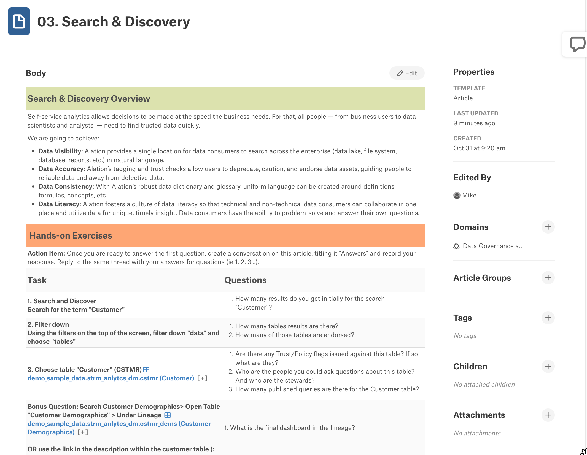


<table>   
    <thead>
        <tr>
            <th colspan="2"> </th>
    </tr>
    </thead>
    <tbody>
        <tr>
            <td></td>
            <td><b>Exercise Guidance</b></td>
        </tr>
    </tbody>
</table>

1. The Alation Search bar is always present on the home page in the header and at the top of the other pages.


2. As you start to type what you want to search for, Alation provides suggestions.
3. Click on All Results to see what the search has found and to filter the results to find what you are looking for quickly.

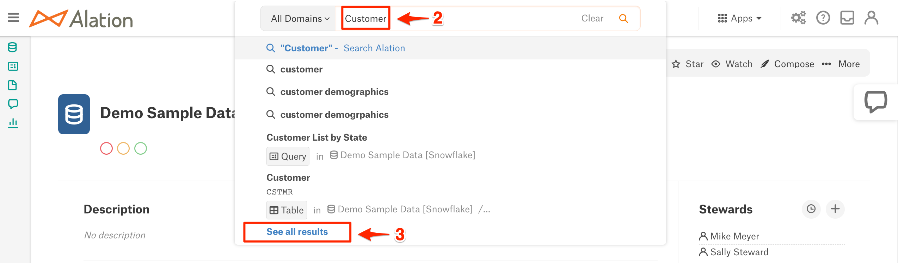

4. The top filters let you narrow your search by object type like column, articles, terms, etc.
5. The left-hand side of the screen has additional filters based on tags, custom fields, and more. This is a compelling way to look for specific items like PII Data Classification.
6. Search provides the trust flags to tell if the result item has been endorsed, warned, or deprecated. The star indicates this is an item you marked as one of your favorites.

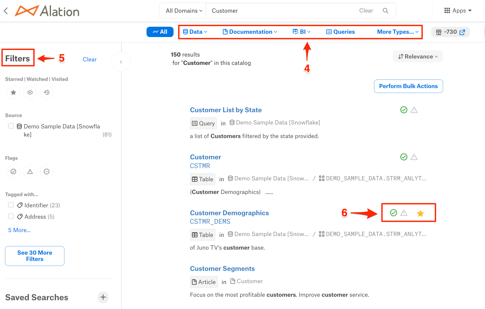


<table>   
    <thead>
        <tr>
            <th colspan="2"> </th>
    </tr>
    </thead>
    <tbody>
        <tr>
            <td></td>
            <td><b>Benefits</b></td>
        </tr>
    </tbody>
</table>

Search is core to increasing productivity and data literacy. Spend minutes instead of days finding the data that you need.

Now it is time to move on to Compose, Alation's SQL editor!


<!-- ------------------------ -->
## Compose 
Duration: 15

**Overview**

In addition to the rich cataloging and governance capabilities, Alation enables users to interact with data stored in cataloged sources. This capability is called Compose and provides a fully integrated and governed SQL development environment. 

Compose is more than your typical SQL editor. Because it is integrated with the catalog, the editor's IntelliSense can provide suggestions as you type for tables, columns, joins, etc. Another advantage is that active governance will show you when an item is deprecated, so you are not using bad data.

Queries can be developed by those who know SQL and shared with others in the organization. No worries if you don’t know how to read or write SQL. Queries can be published as forms that allow the business user to fill out some prompts and get answers to the questions they need to be answered.

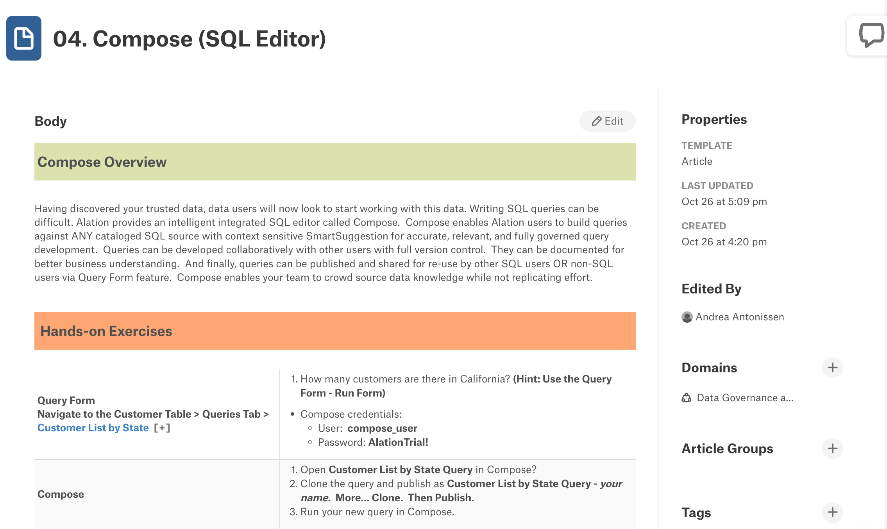


<table>   
    <thead>
        <tr>
            <th colspan="2"> </th>
    </tr>
    </thead>
    <tbody>
        <tr>
            <td></td>
            <td><b>Exercise Guidance</b></td>
        </tr>
    </tbody>
</table>

Queries and Compose are accessible from several places in the application. The following shows how you can navigate to them.

1. When viewing a table, you can click on the Queries tab to see all of the queries associated with this table.
2. The Compose link is in the upper right of the table view page. 

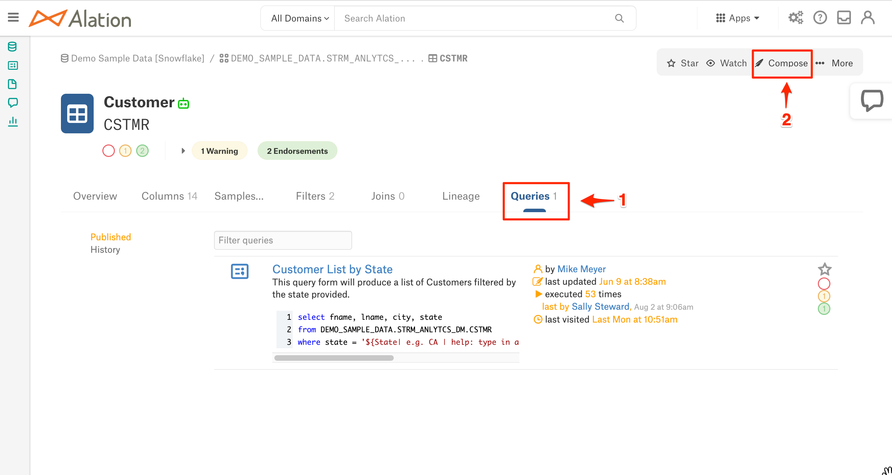

3. The left-hand navigation provides a Queries selection that can be expanded to see current queries.
4. You can click on the arrow to see additional queries and filters.
5. You can click on this link to launch the Compose SQL editor application, which will appear in a new tab.

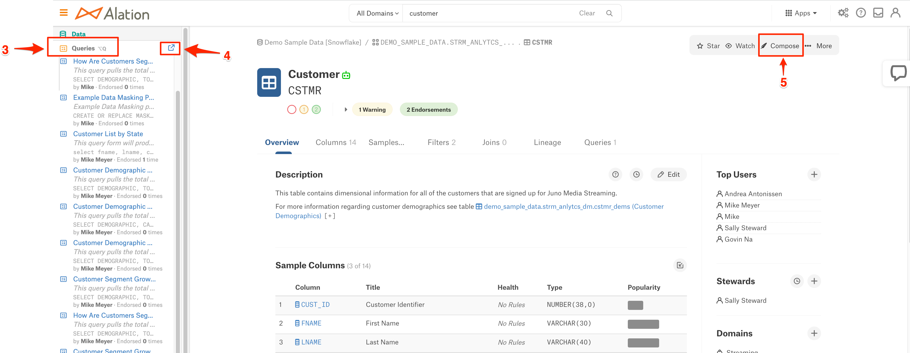

6. Since Compose was launched from a table view, a select statement with that table appears. If you were coming to Compose from a query, the query would appear.
7. The Connection Settings is where you provide your credentials to connect to the Alation provided Demo Sample Data - data source.

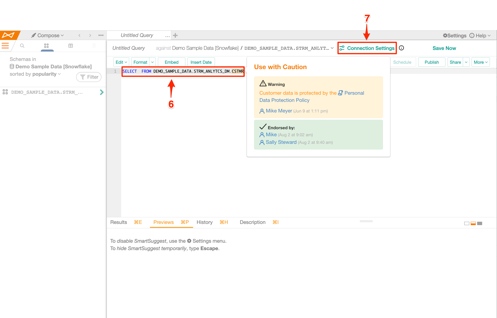


<table>   
    <thead>
        <tr>
            <th colspan="2"> </th>
    </tr>
    </thead>
    <tbody>
        <tr>
            <td></td>
            <td><b>Benefits</b></td>
        </tr>
    </tbody>
</table>

Compose helps spread data literacy in the organization by allowing users to build and share queries that help answer business questions.

Now it is time to wrap this up; let’s finish with a quick summary!

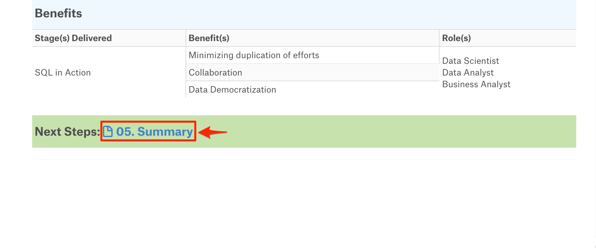

## Optional Tasty Bytes Setup
Duration: 20

**Overview**

If you would like another sample database to explore and work within Alation, Snowflake provides a database for the fictitious food truck brand of Tasty Bytes. 

This is entirely optional. If you are not interested, simply click on the Next button.


<table>   
    <thead>
        <tr>
            <th colspan="2"> </th>
    </tr>
    </thead>
    <tbody>
        <tr>
            <td></td>
            <td><b>Exercise Guidance</b></td>
        </tr>
    </tbody>
</table>

- Install Tasty Bytes from this [link](https://quickstarts.snowflake.com/guide/tasty_bytes_introduction/index.html#0/).
- Return to the Alation web page.

1. Click the down arrow next to Apps.
2. Click on Sources.

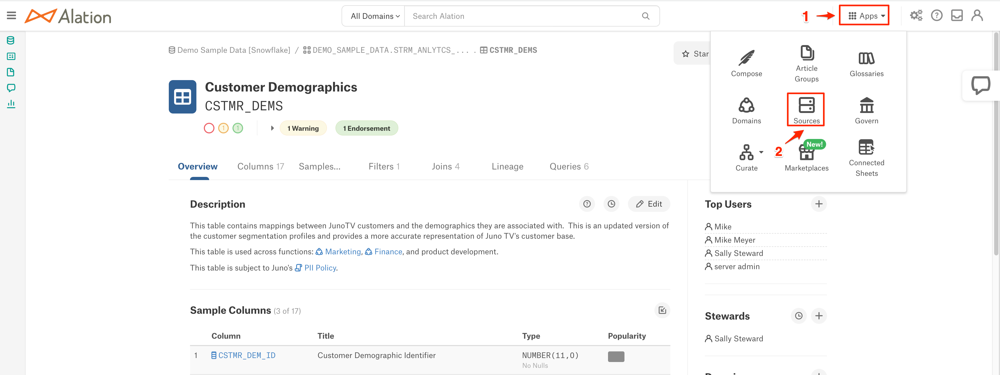

3. Click on the Add button.

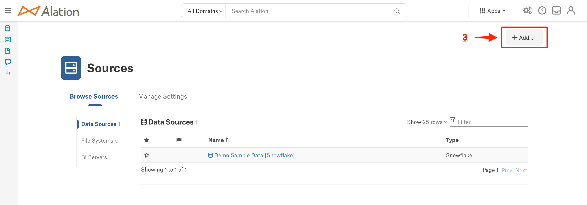

4. Click on the Data Source.

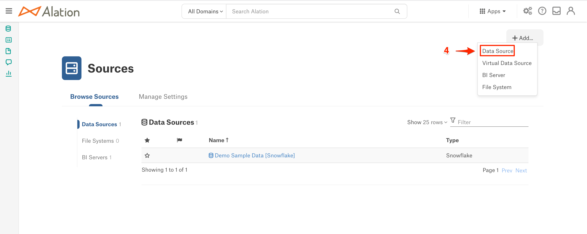

5. Enter Tasty Bytes for the Data Source Title.
6. Click on the Continue Setup button.

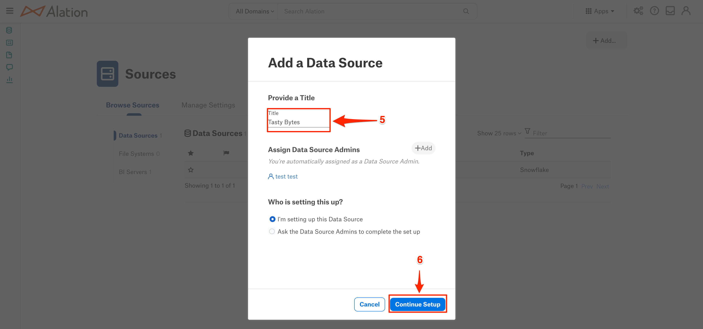

7. Click on the down arrow next to Database Type and select Snowflake OCF connector.

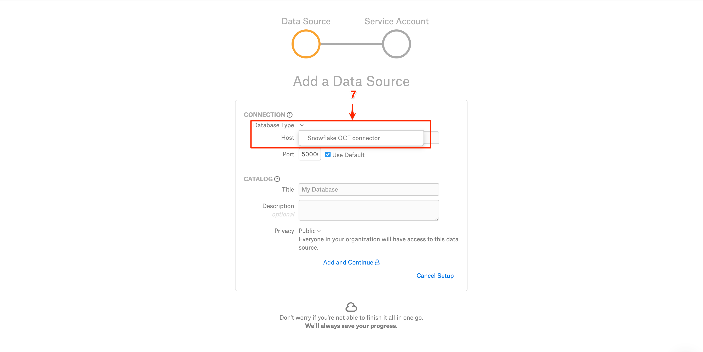

8. Click on the General Settings tab.

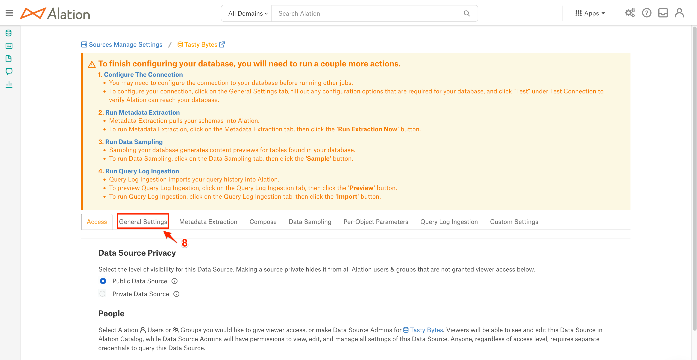

9. Scroll to Connector Settings and enter the JDBC URI. The format is:
snowflake://**Your Snowflake Account**.snowflakecomputing.com:443/?warehouse=**YOUR WAREHOUSE**&db=FROSTBYTE_TASTY_BYTES

10. Enter an administrative user with permission to access metadata - see the [link](https://docs2.alationdata.com/en/latest/sources/OpenConnectorFramework/Snowflake/SnowflakeOCFConnectorOverview.html) for more details.

11. Enter the password of the user entered above.

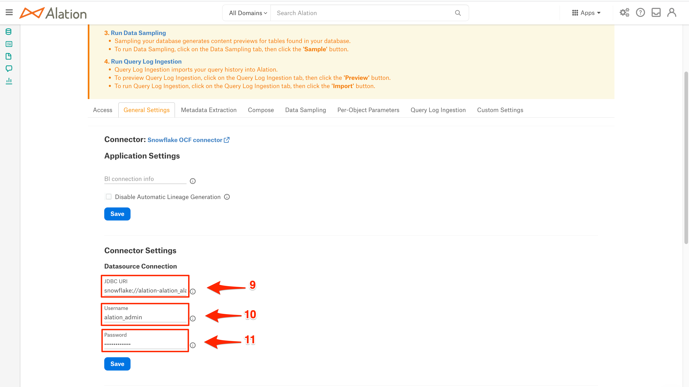

12. Click on the Save button. A "Success" message should appear.

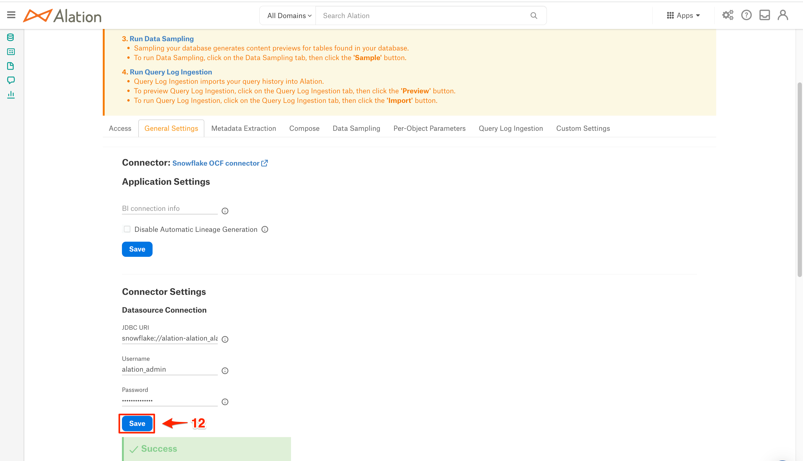

13. Scroll toward the bottom of the screen and click on the Test button. If you receive the message "Network connection successful", then you are finished. If not, check your password to ensure it is correct and try again.

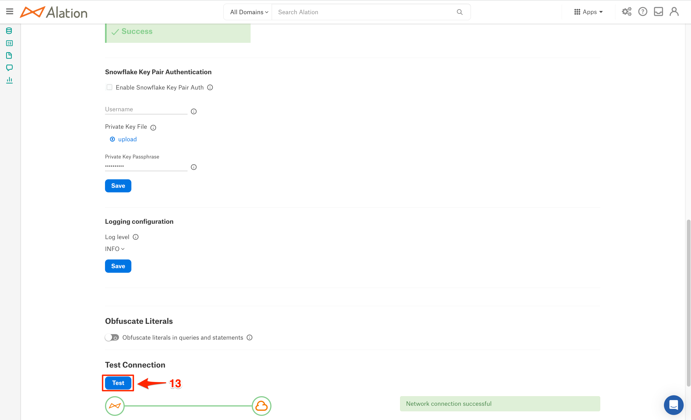

14. Scroll up and click on the Metadata Extraction tab.

15. If you are already using a user with the ACCOUNT_ADMIN role, then please continue with Step 16. If your user is not part of the ACCCOUNT_ADMIN role, then Click on Setup Help for instructions on the permissions needed in Snowflake to run Metadata Extraction. This is a checklist of the required items focusing on the SNOWFLAKE.ACCOUNT_USAGE objects. 


16. Scroll down until you see the Run Extraction Now button, and click on it. This will submit the metadata extraction job.

17. Once the job completes, the status should appear as "Succeeded." If you receive an error instead, make sure to check the permissions from Step 15 and try again.

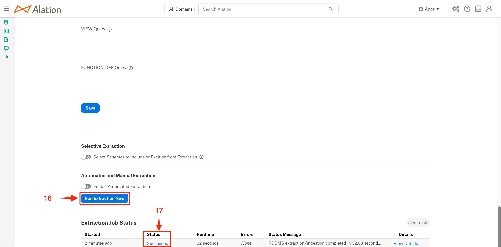

18. You should now see the Tasty Bytes data source in the left-hand navigation under Data. Click on it.

19. The list of the five schemas will appear.

20. The number of tables will be displayed for each schema, showing us that Metadata Extraction worked! Feel free to explore further on your own.

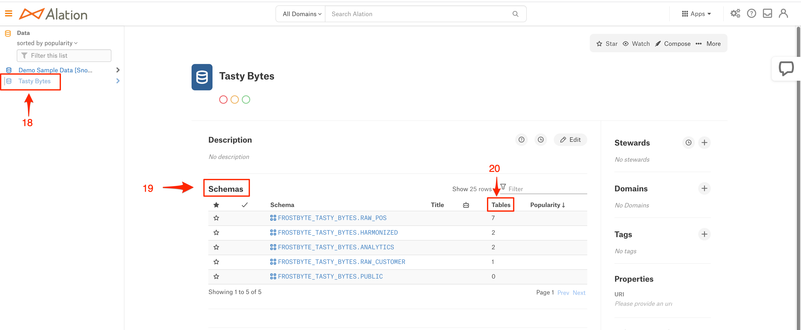

## Summary
Duration: 3

You did it! In this short period, you have seen how Alation:
- Improves productivity through self-service analytics
- Guides users to make better business decisions with trusted data
- Empowers organizations to continuously improve their data culture


### Continue your Alation Journey

To get the most out Alation during your trial.

1. The Quick Start Tour has self-guided demos on Self-service Analytics, Data Governance, and Compose. In addition, there are some how-to vides.
2. Our chat bot allows you to converse with a product specialist on questions you have, set up appointments with a product specialist, and search documentation for questions you have.

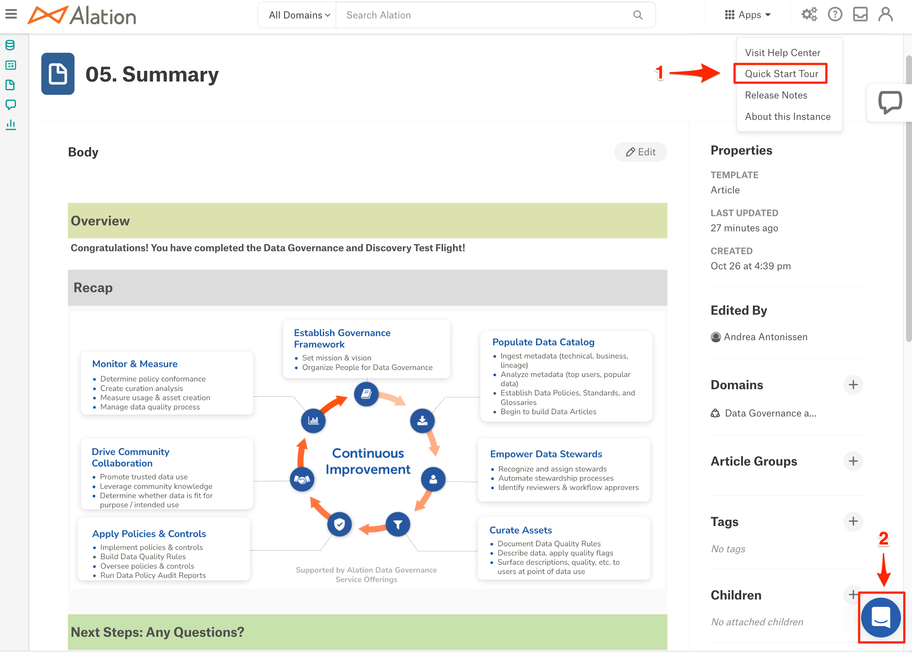

3. Click on this link to see how to connect your own Snowflake data sources.


4. For additional guided demos and product information, please go to [Alation.com](https://www.alation.com/).


Last but not least, please check your email for continued guidance and tips throughout your trial. 

Thanks again for your interest in Alation; we are here for you!