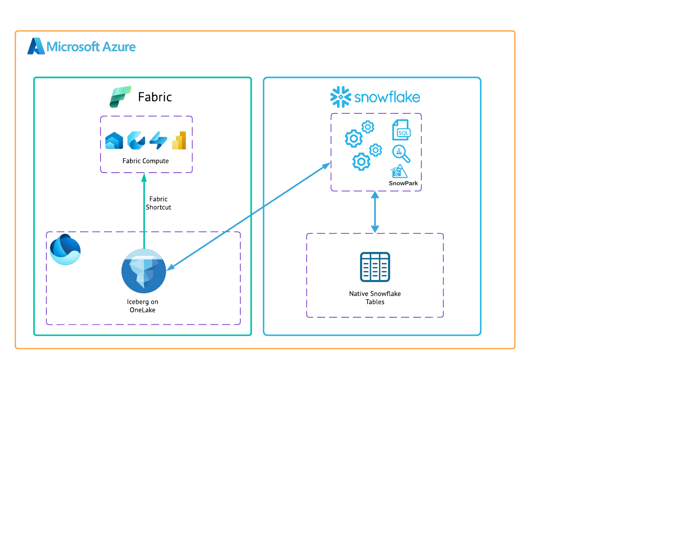
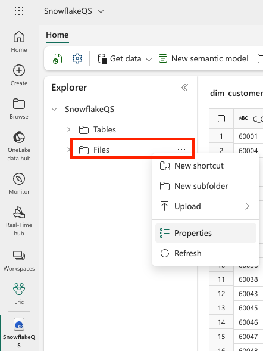
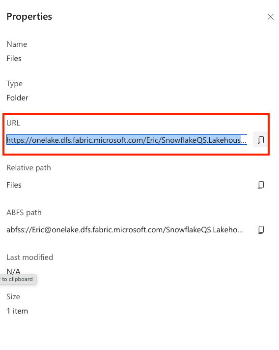
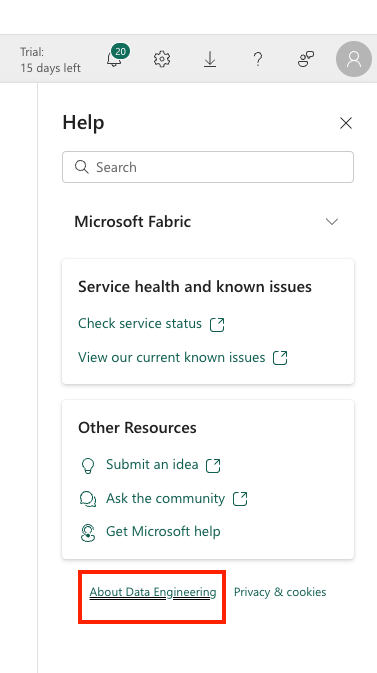
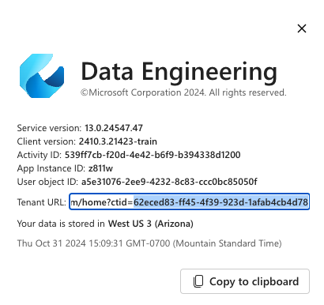
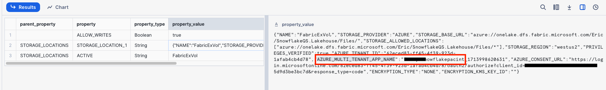
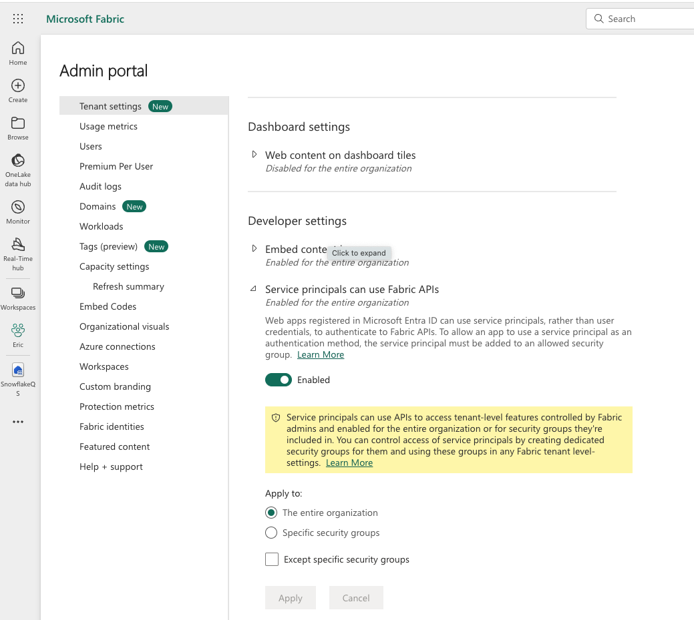
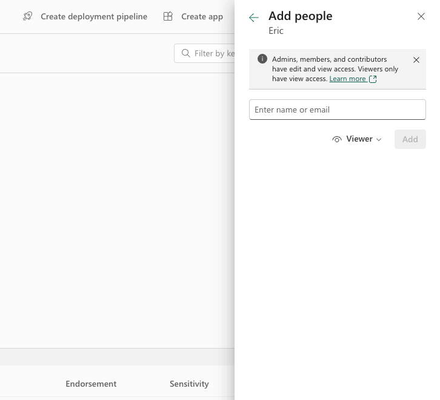
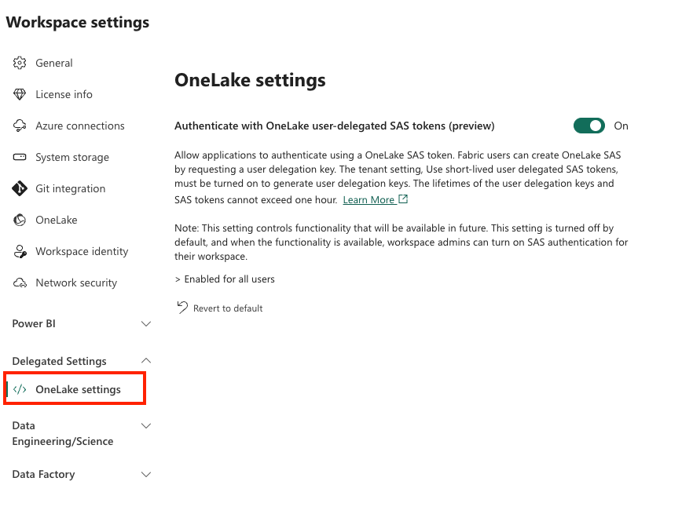

author: tolotti-snow
id: getting_started_with_iceberg_in_oneLake
summary: This is a quickstart for creating Iceberg tables usable by both Snowflake and Microsoft Fabric
categories: Getting-Started, data-engineering, azure, iceberg, Microsoft, Fabric, OneLake, search
environments: web
status: Published 
feedback link: https://github.com/Snowflake-Labs/sfguides/issues
tags: Getting Started, Data Engineering

# Getting Started with Iceberg in OneLake
<!-- ------------------------ -->
## Overview 
Duration: 3

Apache Iceberg is an open table format for huge analytical datasets that enables high performance analytics on open data formats with ACID compliance. Snowflake and Azure both support Iceberg format that enables customers to drastically improve data interoperability, speed of implmentation, and peformance for integrated data lakes.

This guide will take you through the steps of converting public data to Iceberg stored within Fabric OneLake storage. Microsoft Fabric is a unified analytics platform that integrates various data services like data engineering, data science, real-time analytics, and business intelligence into a single environment. It allows users to work across the entire analytics lifecycle, from data ingestion and transformation to advanced analytics and reporting. Fabric brings together key technologies like Power BI, Azure Synapse, and Data Factory under one umbrella for seamless data collaboration and processing. Its low-code/no-code tools, along with cloud-scale capabilities, make it accessible for both technical and non-technical users to build, analyze, and share insights. In this quickstart you will be creating a table using the Iceberg table format in OneLake, which can then be queried from both Snowflake and Fabric services.

### Prerequisites
- familiarity with [Snowflake](https://quickstarts.snowflake.com/guide/getting_started_with_snowflake/index.html#0) and a Snowflake account
- familiarity with [Microsoft Fabric](https://learn.microsoft.com/en-us/fabric/get-started/microsoft-fabric-overview) and a Fabric workspace
- familiarity with Apache Iceberg

### What You Will Learn
- creating an external volumne
- using sample data through Snowflake data sharing
- creating and populating an Iceberg table managed on OneLake
- querying Iceberg from Snowflake and Fabric services

### What You Will Build
- You will create an external volume and table using publicly shared sample data. The table will be in the Apache Iceberg table format, deployed in Azure on OneLake. With a Fabric shortcut you will be able to use the data for power BI reports, or other Fabric workloads.

### What You will Need 
- A free [Snowflake Account](https://signup.snowflake.com/?utm_cta=quickstarts_)
- [Fabric Capacity](https://learn.microsoft.com/en-us/fabric/get-started/fabric-trial)  **Important: Must be in same region as your Snowflake Account**
- For the sake of the lab it is best if both platforms have access to the public internet and are not in a virtual network.

The end-to-end workflow will look like this:



<!-- ------------------------ -->
## Prepare Sample Data
Duration: 3

The first thing you will do is create a database and warehouse in your Snowflake environment. Then create a database for the sample data from a public share in the Data Cloud. Copy and paste the code below to a SQL Worksheet in Snowflake and run through it.
```sql
--create database and warehouse for Iceberg
use role accountadmin;
CREATE OR REPLACE WAREHOUSE HOL_WH WITH WAREHOUSE_SIZE='X-SMALL';
CREATE DATABASE SnowflakeQS;
USE DATABASE SnowflakeQS;
CREATE SCHEMA IcebergTest;
USE SCHEMA IcebergTest;

-- Create a database for the sample data from the share.
CREATE DATABASE SNOWFLAKE_SAMPLE_DATA FROM SHARE SFC_SAMPLES.SAMPLE_DATA;

-- Grant the PUBLIC role access to the database.
GRANT IMPORTED PRIVILEGES ON DATABASE SNOWFLAKE_SAMPLE_DATA TO ROLE PUBLIC;

-- View the sample data
SELECT * FROM SNOWFLAKE_SAMPLE_DATA.TPCH_SF1.customer;
```


<!-- ------------------------ -->
## Create an Iceberg table in OneLake
Duration: 15

### Create the External Volume
Before you create an Iceberg table, you must have an external volume. An external volume is a Snowflake object that stores information about your cloud storage locations, and identity and access management (IAM) entities (in this case, your Entra ID Tenant). Snowflake uses an external volume to establish a connection with your cloud storage in order to access Iceberg metadata and Parquet data.

You will need your OneLake Base URL. To find this in Fabric UI:
- Go into your Fabric Workspace.
- Create a New Item.
- Select Lakehouse and name it "snowflakeQS".
- In the Explorer, click the elipses next to Files and then Properties.
- In the Properties Menu, copy the URL.
- Note: You will replace the https:// from the URL with azure:// in the SQL below.




Next you will need your Azure Tenant ID. To find this in Fabric UI:
- In the upper right click on the ? for help & support.
- At the bottom click About Fabric (note: this might say About Data Engineering or similar depending on your workspace).
- Copy the Tenant URL.  The Tenant ID is the UUID that follows ctid=



Copy this query into Snowflake and fill in the parameters with the collected information.

```sql
CREATE OR REPLACE EXTERNAL VOLUME FabricExVol
  STORAGE_LOCATIONS =
    (
      (
        NAME = 'FabricExVol'
        STORAGE_PROVIDER = 'AZURE'
        STORAGE_BASE_URL = 'azure://onelake.dfs.fabric.microsoft.com/<FabricWorkspaceName>>/<FabricLakehouseName>.Lakehouse/Files/'
        AZURE_TENANT_ID = '<Tenant ID>'
      )
    );
```

### Enabling Permissions
Now you need to enable Snowflake permission to access your Fabric workspace.

First run the following in Snowflake:
```sql
DESC EXTERNAL VOLUME FabricExVol;
```

In the output for property_value of the storage location, in the json you will see a AZURE_MULTI_TENANT_APP_NAME.  This value is the Service Principal that Snowflake uses to connect to Azure. Copy this value. You can remove the underscore and numbers at the end.


In Fabric, grant the service principal access to your Fabric lakehouse.
- From the Fabric settings, click on the admin portal.
- Scroll down to Developer settings, and under Service Principals can use Fabric APIs, enable this setting.


- Now open your workspace, click Manage access, then click Add people or groups.
- Search for the service principal from the previous step.
- Add the service principal as a Contributor.



### Create Table
Back in Snowflake, run the following to create the Iceberg table and insert data from the sample dataset.

```sql
--Create the Iceberg table in OneLake
 CREATE OR REPLACE ICEBERG TABLE snowflakeQS.ICEBERGTEST.dim_customer (
        C_CUSTKEY STRING,
        C_NAME STRING,
        C_ADDRESS STRING,
        C_NATIONKEY STRING,
        C_PHONE STRING,
        C_ACCTBAL STRING,
        C_MKTSEGMENT STRING,
        C_COMMENT STRING
    )
    EXTERNAL_VOLUME = 'FabricExVol'
    CATALOG = snowflake
    BASE_LOCATION = 'dim_customer';

--Insert sample data
INSERT INTO SnowflakeQS.ICEBERGTEST.dim_customer
    SELECT top 500 * FROM SNOWFLAKE_SAMPLE_DATA.TPCH_SF1.customer;

--Query the Iceberg table from Snowflake
Select * from SnowflakeQS.ICEBERGTEST.dim_customer
```

<!-- ------------------------ -->
## Accessing the Data in Fabric
Duration: 10

1. In order for Fabric to work on the Iceberg tables, you need to set up shortcuts to the data.

Find the location of your Iceberg table in storage.
The Iceberg table folder contains a ‘metadata’ folder, and that ‘metadata’ folder contains a file ending in ‘metadata.json’.
If you’re not sure where the table is stored, you can run the following query in Snowflake to discover this information.

```sql
SELECT SYSTEM$GET_ICEBERG_TABLE_INFORMATION('dim_customer');
```

This will return a path to the metadata file for this table, which should show you which storage account contains the Iceberg table.  For example, this is the relevant info to find the table: 

```
{"metadataLocation":"azure://<storage_account_path>/<path within storage>/<table name>/metadata/00001-389700a2-977f-47a2-9f5f-7fd80a0d41b2.metadata.json","status":"success"}
```

2. Open the workspace that contains your Fabric lakehouse object. 
  - Click Workspace settings.
  - Under Delegated settings, click OneLake settings, and turn on the Authenticate with OneLake user-delegated SAS tokens setting.
Note: This is a temporary step – we will remove this as a required step in the near future.



3. In your workspace, open your Fabric lakehouse object.

4. Click New shortcut from tables.

5. Select a OneLake Shortcut.

6. Enter the connection information for your storage location.

7. Navigate the folder structure and select the checkbox next to your Iceberg table folder to select it as the shortcut target location. Do not select the checkboxes for “data” or “metadata” subfolders.

8. Click Next and Create your shortcut.

<!-- ------------------------ -->
## Conclusion and Resources
Duration: 2


Congratulations! You've successfully created an Iceberg table in OneLake as a Snowflake data object. You can now use this data for power BI reports, querying from Snowflake, working with Snowpark, working with Synapse Notebooks, and many more use-cases.


### What You Learned
- creating an external volumne
- using sample data through Snowflake data sharing
- creating and populating an Iceberg table managed on OneLake
- querying Iceberg from Snowflake and Fabric services

### Resources
- [Microsoft Fabric and Power BI](https://learn.microsoft.com/en-us/power-bi/fundamentals/fabric-get-started)

- [Fabric and Snowflake together](https://www.microsoft.com/en-us/microsoft-fabric/blog/2024/05/22/snowflake-and-microsoft-announce-expansion-of-their-partnership/)

If you have any questions, reach out to your Snowflake account team!


