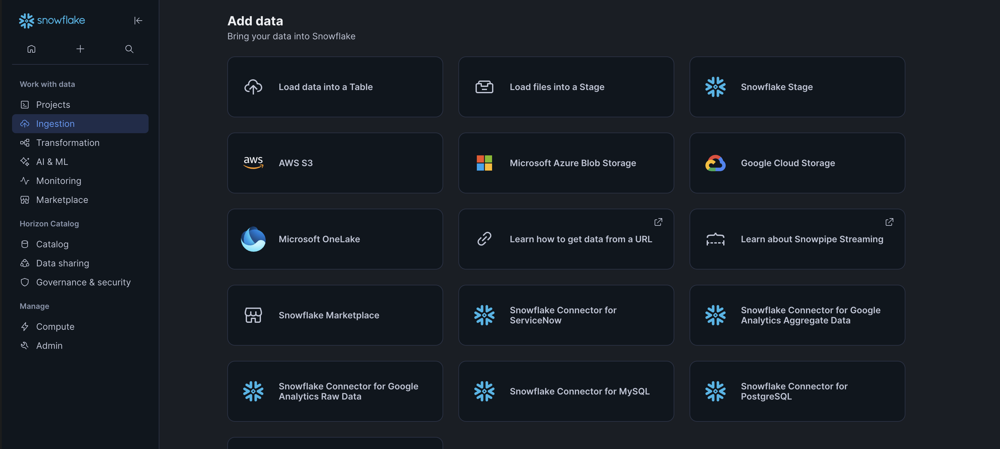
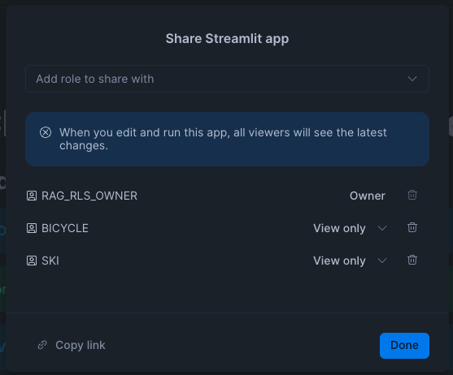

author: Tim Buchhorn
id: sfguide-getting-started-with-access-controls-for-cortex-search
language: en
summary: This guide walks you thorough creating an internal chatbot application that controls access to unstructured documents based on user based attributes
categories: snowflake-site:taxonomy/solution-center/certification/quickstart, snowflake-site:taxonomy/product/ai, snowflake-site:taxonomy/snowflake-feature/compliance-security-discovery-governance, snowflake-site:taxonomy/snowflake-feature/cortex-search
environments: web
status: Hidden 
feedback link: https://github.com/Snowflake-Labs/sfguides/issues
tags: AI, Conversational Assistants, Cortex Search

# Getting Started with access controls for RAGs (Cortex Search)
<!-- ------------------------ -->
## Overview 
Duration: 1

Retrieval-Augmented Generation (RAG) promises to unlock unprecedented value from enterprise data. The vast majority (80-90%) of corporate knowledge is trapped in unstructured documents, emails, and messages, often containing sensitive PII, IP, and financial data with inconsistent access controls. Deploying AI models without robust governance exposes this sensitive data, creating severe risks of data breaches, regulatory non-compliance, and loss of intellectual property.

For businesses to adopt AI safely, applications must be "permissions-aware." This is not an optional feature but a foundational requirement. AI systems must respect and enforce the existing security and access permissions of every user at the moment of retrieval. An employee, must only be allowed to "see" and surface data that the user querying it is already authorized to access.

In this guide, you will build a secure RAG pipeline (using Cortex Search) that enforces document-level access control. Specifically, we will create a RAG that utilises user attributes (such as their role) and pass this on as a filter condition to the cortex search service on the backend of a client facing application.


### Prerequisites
- Access to an account that can use Snowpark Container Services (non-trial accounts).

### What You’ll Learn 
- How to build a RAG chatbot in Streamlit in Snowflake (SiS) with access controls.

### What You’ll Need 
- A Snowflake account with the ability to create Compute Pools (SPCS). Trial accounts do not have this ability 
- Ability to create new users and roles in Snowflake

### What You’ll Build 
- A RAG chatbot in in Streamlit in Snowflake (SiS) with access controls, powered by Cortex Search.

<!-- ------------------------ -->
## Setup
Duration: 2

### Snowflake Setup

Open a SQL Worksheet and run through the following code to set up the neccessary objects and permissions in Snowflake.

```SQL
USE ROLE ACCOUNTADMIN;
CREATE ROLE IF NOT EXISTS RAG_OWNER;
CREATE ROLE IF NOT EXISTS SKI;
CREATE ROLE IF NOT EXISTS BICYCLE;

-- Create the users to test access controls. It is stringly recommended that MFA is enabled for these users
CREATE OR REPLACE USER bicycle_user
    PASSWORD             = '<enter initial password>'
    LOGIN_NAME           = 'bicycle_user'
    FIRST_NAME           = 'Bicycle'
    LAST_NAME            = 'User'
    EMAIL                = '<enter your email>'
    DEFAULT_ROLE         = BICYCLE  
    MUST_CHANGE_PASSWORD = TRUE;

GRANT ROLE BICYCLE TO USER bicycle_user;

CREATE OR REPLACE USER ski_user
    PASSWORD             = '<enter initial password>'
    LOGIN_NAME           = 'ski_user'
    FIRST_NAME           = 'Ski'
    LAST_NAME            = 'User'
    EMAIL                = '<enter your email>'
    DEFAULT_ROLE         = SKI 
    MUST_CHANGE_PASSWORD = TRUE;

GRANT ROLE SKI TO USER ski_user;

GRANT CREATE DATABASE ON ACCOUNT TO ROLE RAG_OWNER;
GRANT CREATE COMPUTE POOL ON ACCOUNT TO ROLE RAG_OWNER;
GRANT CREATE WAREHOUSE ON ACCOUNT TO ROLE RAG_OWNER;

SET USERNAME = (SELECT CURRENT_USER());
SELECT $USERNAME;
GRANT ROLE RAG_OWNER to USER identifier($USERNAME);

---

USE ROLE RAG_OWNER;

CREATE COMPUTE POOL IF NOT EXISTS RAG_STREAMLIT
    MIN_NODES = 1
    MAX_NODES = 3
    INSTANCE_FAMILY = CPU_X64_XS;

CREATE WAREHOUSE IF NOT EXISTS RAG_WH
  WAREHOUSE_TYPE = STANDARD
  WAREHOUSE_SIZE = XSMALL;

CREATE DATABASE IF NOT EXISTS RAG_DB;
USE DATABASE RAG_DB;
CREATE SCHEMA IF NOT EXISTS RAG_DB.RAG_SCHEMA;
USE SCHEMA RAG_SCHEMA;

CREATE OR REPLACE NETWORK RULE pypi_network_rule
 MODE = EGRESS
 TYPE = HOST_PORT
 VALUE_LIST = ('pypi.org', 'pypi.python.org', 'pythonhosted.org',  'files.pythonhosted.org');

USE ROLE ACCOUNTADMIN;

CREATE OR REPLACE EXTERNAL ACCESS INTEGRATION pypi_access_integration
 ALLOWED_NETWORK_RULES = (pypi_network_rule)
 ENABLED = true;

GRANT USAGE ON INTEGRATION pypi_access_integration TO ROLE RAG_OWNER;

GRANT CREATE STREAMLIT ON SCHEMA RAG_DB.RAG_SCHEMA TO ROLE RAG_OWNER;

GRANT USAGE ON WAREHOUSE RAG_WH TO ROLE BICYCLE;
GRANT USAGE ON WAREHOUSE RAG_WH TO ROLE SKI;

GRANT USAGE ON COMPUTE POOL RAG_STREAMLIT TO ROLE BICYCLE;
GRANT USAGE ON COMPUTE POOL RAG_STREAMLIT TO ROLE SKI;

GRANT USAGE ON DATABASE RAG_DB TO ROLE BICYCLE;
GRANT USAGE ON SCHEMA RAG_DB.RAG_SCHEMA TO ROLE BICYCLE;

GRANT USAGE ON DATABASE RAG_DB TO ROLE SKI;
GRANT USAGE ON SCHEMA RAG_DB.RAG_SCHEMA TO ROLE SKI;

USE ROLE RAG_OWNER;

CREATE OR REPLACE STAGE STREAMLIT_UI DIRECTORY = (ENABLE = TRUE) ENCRYPTION = (TYPE='SNOWFLAKE_SSE');
CREATE OR REPLACE STAGE SOURCE_DOCUMENTS DIRECTORY = (ENABLE = TRUE) ENCRYPTION = (TYPE='SNOWFLAKE_SSE');
```

### Upload Documents

Upload the documents in the unzipped Documents.zip folder [here](assets/Documents.zip) to the SOURCE_DOCUMENTS stage we just created. You can do this through the Snowsight UI. The instructions on how to do this can be found in our documentation [here](https://docs.snowflake.com/en/user-guide/data-load-local-file-system-stage-ui#upload-files-onto-a-named-internal-stage) or below.

In the navigation menu, select Ingestion » Add Data.

On the Add Data page, select Load files into a Stage.


Then upload the files from Documents folder in the cloned repository from the previous step. Be sure to select the RAG_DB database, the RAG_SCHEMA schema and the SOURCE_DOCUMENTS stage.


Once you have uploaded them, run the following SQL from your SQL Worksheet to check if the files have been uploaded successfully.

```SQL
LS @SOURCE_DOCUMENTS;
```

# Prepare Data for RAG

In this section, we use Snowflake's helper functions to prepare the unstructured documents and set up the Cortex Search Service. 

The functions below simplify the process of creating a RAG in to only a few steps. Specifically, we are using the following unique Snowflake features:
- Cortex AI Functions (AI_PARSE_DOCUMENT):
- SPLIT_TEXT_RECURSIVE_CHARACTER:

Note that we are adding an attribute column that we will dynamically filter on.

Run the following SQL in a SQL worksheet

```SQL
USE SCHEMA RAG_DB.RAG_SCHEMA;

CREATE OR REPLACE TABLE documents_table AS
  (SELECT TO_FILE('@source_documents', RELATIVE_PATH) AS docs, 
    RELATIVE_PATH as RELATIVE_PATH
    FROM DIRECTORY(@source_documents));

CREATE OR REPLACE TABLE EXTRACTED_TEXT_TABLE AS (
    SELECT  RELATIVE_PATH, 
            AI_PARSE_DOCUMENT(docs, {'mode': 'OCR'}):content::VARCHAR AS EXTRACTED_TEXT,
            CASE
                WHEN RELATIVE_PATH ILIKE '%ski%' THEN 'SKI'
                WHEN RELATIVE_PATH ILIKE '%bike%' OR RELATIVE_PATH ILIKE '%bicycle%' THEN 'BICYCLE'
                ELSE 'Other'
            END AS product_department
            FROM documents_table
            );


CREATE OR REPLACE TABLE CHUNKED_TABLE AS (
        SELECT
            e.*,
            c.value::VARCHAR AS chunk
        FROM EXTRACTED_TEXT_TABLE e,
        LATERAL FLATTEN(
            INPUT => snowflake.cortex.split_text_recursive_character(
                EXTRACTED_TEXT,
                'none',
                2000,
                300
            )
        ) c
    );

SELECT * FROM CHUNKED_TABLE;

--- Create Cortex Search Service

CREATE OR REPLACE CORTEX SEARCH SERVICE rag_cortex_search_service
  ON chunk
  ATTRIBUTES product_department
  WAREHOUSE = RAG_WH
  TARGET_LAG = '1 hour'
  INITIALIZE = ON_SCHEDULE
AS SELECT * FROM RAG_DB.RAG_SCHEMA.CHUNKED_TABLE;
```

The Cortex Search Service may take a few minutes to set up. Once it has completed,  we can test the cortex search service by running the following SQL. Check if the serving_state column is ACTIVE.

```SQL
DESC CORTEX SEARCH SERVICE rag_cortex_search_service;
```

Next, we will alter it to return a "scoring profile" which allows us to provide thresholds for the relevency of returned documents

```SQL
ALTER CORTEX SEARCH SERVICE RAG_DB.RAG_SCHEMA.rag_cortex_search_service
  ADD SCORING PROFILE IF NOT EXISTS default_with_components
  '{
    "component_scores": true
  }';
```

We can execute the following SQL to test if the Cortex Search Service is working.

```SQL
SELECT PARSE_JSON(
  SNOWFLAKE.CORTEX.SEARCH_PREVIEW(
      'rag_cortex_search_service',
      '{
         "query": "Tell me about the Ski Bootz",
         "filter": {"@eq": {"product_department": "SKI"} },
         "limit":10
      }'
  )
)['results'] as results;
```

# Prepare Streamlit App

The next step is to create a UI that can use these objects and present them to our business users in a safe and secure way. We are going to use Streamlit in Snowflake on a Container Runtime to make this simple. Since this is an internal application, we can leverage Snowflake's authentication and authorization mechanisms to ensure the app is "aware" of who is trying to access the data, and only return information from the documents they have access to.

Upload the streamlit python file and corresponding assets by downloading and unzipping the   and uploading to the STREAMLIT_UI stage. Follow similar steps to how you uploaded the source documents. The instructions on how to do this can be found in our documentation [here](https://docs.snowflake.com/en/user-guide/data-load-local-file-system-stage-ui#upload-files-onto-a-named-internal-stage). Be sure to select the RAG_DB database, the RAG_SCHEMA schema and the STREAMLIT_UI stage.

Next, run the following SQL to create the Streamlit app.

```SQL
CREATE OR REPLACE STREAMLIT rag_access_control_app
 FROM '@rag_db.rag_schema.streamlit_ui/'
 MAIN_FILE = 'rag_access_control_streamlit_ui.py'
 RUNTIME_NAME = 'SYSTEM$ST_CONTAINER_RUNTIME_PY3_11'
 COMPUTE_POOL = RAG_STREAMLIT
 QUERY_WAREHOUSE = RAG_WH
 EXTERNAL_ACCESS_INTEGRATIONS = (pypi_access_integration);

ALTER STREAMLIT rag_access_control_app ADD LIVE VERSION FROM LAST;
```

# Open App as Owner
Navigate to Projects > Streamlit in the left navigation menu. You should now see RAG_ACCESS_CONTROL_APP. Click to open the app. Make sure you have assumed the role RAG_OWNER (you can check this by clicking over your initials in the bottom left of the screen) 

You should now see the streamlit UI. If you type a question, it will not respond with a helpful answer since the filters applied do not allow the owner role to see the underlying data via the app. Since the owner role owns the Cortex Search Service, it could however query the service directly outside of the app. If this were to be implemented, this role would not be granted to users that needed access controls applied to them. 

# Share Streamlit App

We now want to test this functionality as different users with differnet permissions. First we need to grant access to other roles to this app. In the top right of the page, click the "Share" button. In the modal, grant access to "SKI" and "BICYCLE" roles as "View Only".



Select the 'Copy Link' button. Then Sign Out as the current user. You can find this button in the bottom left of the screen.

Next sign out as the current user. You can find this by cliking your initials icon in the bottom left of the UI.

# Test App as different users

Paste the copied link from the previous section into the browser. It should then prompt you to login. We are going to test the app experience as the 'Ski' user. Type in ski_user in the Username field, and the initial password you created as part of the initial set up. N.B. if you have a MFA enforcement policy set up (highly recommended), you will be prompted to complete those steps upon initial sign-in.

You should see the streamlit app load in the UI.

First, lets see if we can see any information on bicycles. We should not, since the filter on the back end should only return chuncks from documents related to skis.

Ask "Tell me about the Mondracer bike"

You should see that the app responded that it did not have any relevant information. Similarly the "Context Documents" in the left navigation menu (with Debug Mode on) should be empty.

Now lets ask a question which should return results.

Ask "Tell me about the TD Ski Bootz"

You should see a response and also relevant chunks being returned to answer the question.

You can now test this for "bicycle_user" by logging out and logging back in as bicycle_user.

When logged in as bicycle_user, ask:

"Tell me about the Mondracer bike"

You should see a response. 

Next ask:

"Tell me about the TD Ski Bootz".

You should not see a response that references source documents.

<!-- ------------------------ -->
## Understanding the Streamlit Code
Duration: 1

The Streamlit code contains the logic that allows us to safely use the Cortex Search Service and return only the relevant information to the authenticated user.

Cortex Search Services runs with Owners rights by design. This is to ensure that it runs with the same security model as other Snowflake objects that run with owner's rights and keeps the service performant for real world use cases. More information on this model can be found in our documentation [here](https://docs.snowflake.com/en/user-guide/snowflake-cortex/cortex-search/query-cortex-search-service#querying-with-owner-s-rights).

In this app, we are following recommended best practice of using explicit filters on the client-side query to filter for access controls. These filters are based on user attributes that are obtained from the Authentication flow from logging in to Snowflake.

Only the RLS_OWNER Role, which owns both the streamlit app and the Cortex Search Service, has the ability to use the Cortex Search Service, and modify any of the code within the streamlit app. Both the SKI and BICYCLE roles only have access to viwing and using the Streamlit app.


 we are obtaining the current role of the visiting user via HTTP headers upon login. We use this logic to pass this on as a filter on the backend to the Cortex Search Service. the visiting user is intentionally never granted access to the Cortex Serach Service itself, but rather the backend code utilises the Cortex Search ervice with Owners Rights, and passes back the relevant information via filters based on User Attributes in back end code.

The second is debug mode, which will show some extra information including which chuncks have been retrieved.

Select Visitor Mode and Debug Mode. Deslect "Use Chat History" for now.

<!-- ------------------------ -->
## Clean Up
Duration: 1

Run the following SQL to clean up.

```SQL
USE ROLE ACCOUNTADMIN;
DROP ROLE RAG_RLS_OWNER;
DROP ROLE SKI;
DROP ROLE BICYCLE;

DROP USER bicycle_user;
DROP USER ski_user;

DROP COMPUTE POOL RAG_STREAMLIT;
DROP WAREHOUSE RAG_WH;
DROP DATABASE RAG_RLS_DB CASCADE;
DROP EXTERNAL ACCESS INTEGRATION pypi_access_integration;
```

<!-- ------------------------ -->
## Conclusion And Resources
Duration: 1

At the end of your Snowflake Guide, always have a clear call to action (CTA). This CTA could be a link to the docs pages, links to videos on youtube, a GitHub repo link, etc. 

If you want to learn more about Snowflake Guide formatting, checkout the official documentation here: [Formatting Guide](https://github.com/googlecodelabs/tools/blob/master/FORMAT-GUIDE.md)

### What You Learned
- creating steps and setting duration
- adding code snippets
- embedding images, videos, and surveys
- importing other markdown files

### Related Resources
- <link to github code repo>
- <link to documentation>
