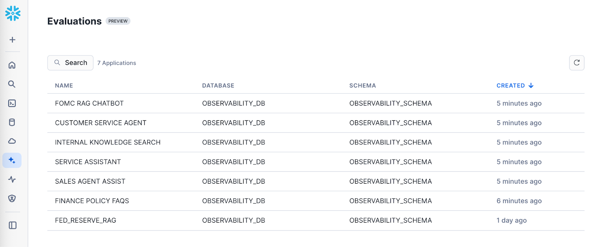
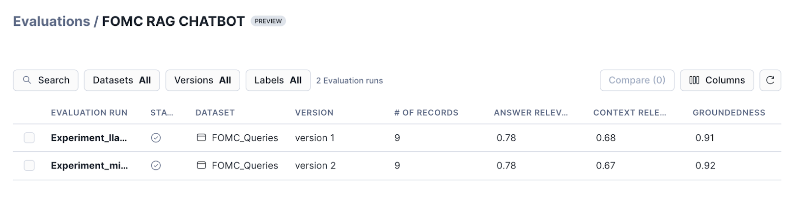
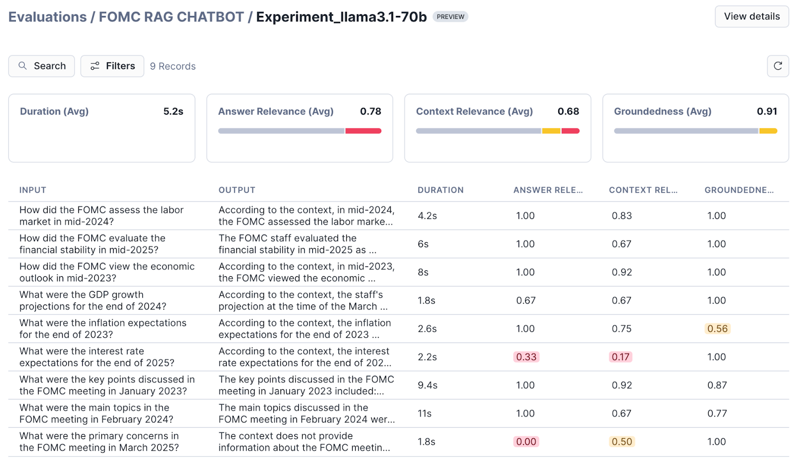
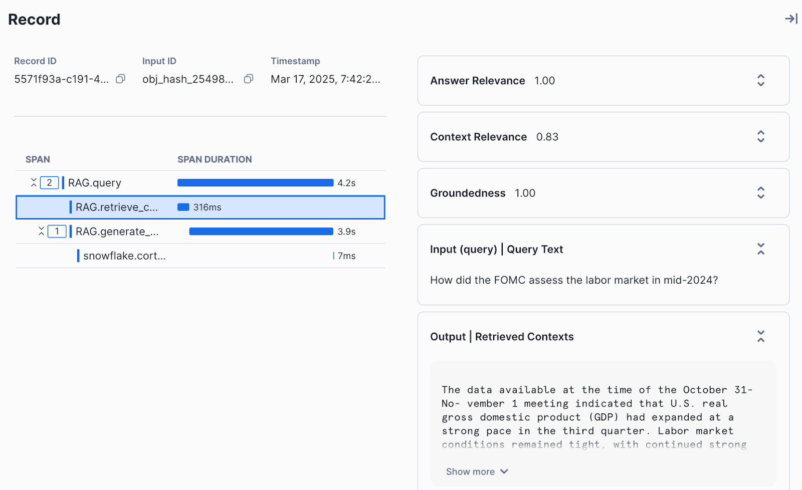

author: Josh Reini
id: getting_started_with_ai_observability
summary: This is a guide for getting started with Snowflake AI Observability.
categories: Getting-Started, Observability
environments: web
status: Published
feedback link: https://github.com/Snowflake-Labs/sfguides/issues
tags: Getting Started, AI, Observability, RAG, LLMs, TruLens, Snowflake

# Getting Started with AI Observability

## Overview

Duration: 5

AI Observability in Snowflake Cortex enables you to easily evaluate and trace your gen AI applications. With AI Observability, you can measure the performance of your AI applications by running systematic evaluations, and iterate on your application configurations to optimize performance. In addition, you can log the application traces to debug your application. AI Observability improves trust and transparency of gen AI applications and agents, enabling thorough benchmarking and performance measurement prior to deploying your applications.

In this tutorial, you'll build a Retrieval-Augmented Generation (RAG) system using Cortex Search and Cortex LLMs. This will be the basis of our example. Then, you'll add OpenTelemetry tracing using TruLens to the app. Last, you'll create a test set and run LLM-as-judge evaluations in batch against your application.

Here is a summary of what you will be able to learn in each step by following this quickstart:

- **Setup Environment**: Create Snowflake objects required for the example.
- **Prepare Data**: Load, parse and chunk data for RAG.
- **Create a RAG**: Create a RAG with Cortex Search and Complete, adding TruLens instrumentation.
- **Register the App**: Set application metadata for experiment tracking.
- **Create a Run**: Configure your test set for evaluation.
- **Compute Evaluation Metrics**: Compute evaluation metrics in batch on the run.
- **Examine Results**: Navigate AI Observability in Snowsight to view and compare traces and evaluation results.

### What is TruLens?

[TruLens](https://www.trulens.org/) is a library for tracking and evaluating Generative AI applications in open source, along with powering Snowflake AI Observability.

### What You Will Learn
- How to build a RAG with Cortex Search and Cortex LLM Functions.
- How to create a run.
- How to compute evaluation metrics.

### What You Will Build
- A retrieval-augmented generation (RAG) app
- An evaluation run with computed metrics

### Prerequisites
- A Snowflake account with Cortex LLM Functions and Cortex Search enabled.  If you do not have a Snowflake account, you can register for a [free trial account](https://signup.snowflake.com/?utm_cta=quickstarts_&_fsi=yYZEVo4S&_fsi=yYZEVo4S).
- A Snowflake account login with ACCOUNTADMIN role. If you have this role in your environment, you may choose to use it. If not, you will need to 1) Register for a free trial, 2) Use a different role that has the ability to create database, schema, tables, stages, tasks, user-defined functions, and stored procedures OR 3) Use an existing database and schema in which you are able to create the mentioned objects.

## Setup Environment

Duration: 8

If you are not working in a Snowflake trial account and do not have ACCOUNTADMIN privileges, ensure that the user role has the following roles granted ():

- SNOWFLAKE.CORTEX_USER database role
- SNOWFLAKE.AI_OBSERVABILITY_EVENTS_LOOKUP application role
- CREATE EXTERNAL AGENT privilege on the schema

For more information, see [Required Privileges for AI Observability](https://docs.snowflake.com/en/user-guide/snowflake-cortex/ai-observability/reference#label-ai-observability-required-privileges).

To open the notebook, open [getting-started-with-ai-observability.ipynb](https://github.com/Snowflake-Labs/sfguide-getting-started-with-ai-observability/blob/main/getting-started-with-ai-observability.ipynb) to download the Notebook from GitHub. ***(NOTE: Do NOT right-click to download.)***

Then, create a new Snowflake notebook by importing the notebook file in Snowsight.

In your Snowflake notebook, install the following python packages from the Snowflake conda channel: `snowflake-ml-python` `snowflake.core` `trulens-core` `trulens-providers-cortex` `trulens-connectors-snowflake`

Once we have a Snowflake notebook with the right packages installed, we are ready to go.

In the notebook, begin by setting up your Snowflake environment. Create a new database, warehouse, and establish a session.

```python
from snowflake.snowpark.context import get_active_session
session = get_active_session()
```

```sql
CREATE DATABASE IF NOT EXISTS cortex_search_tutorial_db;

CREATE OR REPLACE WAREHOUSE cortex_search_tutorial_wh WITH
     WAREHOUSE_SIZE='X-SMALL'
     AUTO_SUSPEND = 120
     AUTO_RESUME = TRUE
     INITIALLY_SUSPENDED=TRUE;

USE WAREHOUSE cortex_search_tutorial_wh;
```

## Prepare Data

Duration: 10

You will use a sample dataset of the Federal Open Market Committee (FOMC) meeting minutes for this example. This is a sample of twelve 10-page documents with meeting notes from FOMC meetings from 2023 and 2024. Download the files directly from your browser by following this link:

[FOMC minutes sample](https://drive.google.com/file/d/1C6TdVjy6d-GnasGO6ZrIEVJQRcedDQxG/view)

The complete set of FOMC minutes can be found at the [US Federal Reserve’s website](https://www.federalreserve.gov/monetarypolicy/fomccalendars.htm).

Create a stage in Snowflake to store your PDF files.

```sql
CREATE OR REPLACE STAGE cortex_search_tutorial_db.public.fomc
    DIRECTORY = (ENABLE = TRUE)
    ENCRYPTION = (TYPE = 'SNOWFLAKE_SSE');
```

Now upload the dataset. You can upload the dataset in Snowsight or using SQL. To upload in Snowsight:

1. Sign in to Snowsight.
2. Select **Data** in the left-side navigation menu.
3. Select your database `cortex_search_tutorial_db`.
4. Select your schema `public`.
5. Select **Stages** and choose `fomc`.
6. On the top right, select the **+ Files** button.
7. Drag and drop files into the UI or select **Browse** to choose a file from the dialog window.
8. Select **Upload** to upload your file.

Ensure that your PDF files have been successfully uploaded to the stage.

```sql
ls @cortex_search_tutorial_db.public.fomc
```

### Parse the data

Parse the uploaded PDF files to extract their content.

```sql
CREATE OR REPLACE TABLE CORTEX_SEARCH_TUTORIAL_DB.PUBLIC.PARSED_FOMC_CONTENT AS SELECT 
      relative_path,
      TO_VARCHAR(
        SNOWFLAKE.CORTEX.PARSE_DOCUMENT(
          @cortex_search_tutorial_db.public.fomc, 
          relative_path, 
          {'mode': 'LAYOUT'}
        ) :content
      ) AS parsed_text
    FROM directory(@cortex_search_tutorial_db.public.fomc)
    WHERE relative_path LIKE '%.pdf'
```

### Chunk the data

Split the parsed text into manageable chunks for efficient searching.

```sql
CREATE OR REPLACE TABLE CORTEX_SEARCH_TUTORIAL_DB.PUBLIC.CHUNKED_FOMC_CONTENT (
    file_name VARCHAR,
    CHUNK VARCHAR
);

INSERT INTO CORTEX_SEARCH_TUTORIAL_DB.PUBLIC.CHUNKED_FOMC_CONTENT (file_name, CHUNK)
SELECT
    relative_path,
    c.value AS CHUNK
FROM
    CORTEX_SEARCH_TUTORIAL_DB.PUBLIC.PARSED_FOMC_CONTENT,
    LATERAL FLATTEN( input => SNOWFLAKE.CORTEX.SPLIT_TEXT_RECURSIVE_CHARACTER (
        parsed_text,
        'markdown',
        1800,
        250
    )) c;
```

## Create a RAG

Duration: 10

Set up the Cortex Search service to enable efficient querying of the chunked content.

```sql
CREATE OR REPLACE CORTEX SEARCH SERVICE CORTEX_SEARCH_TUTORIAL_DB.PUBLIC.FOMC_SEARCH_SERVICE
    ON chunk
    WAREHOUSE = cortex_search_tutorial_wh
    TARGET_LAG = '1 hour'
    EMBEDDING_MODEL = 'snowflake-arctic-embed-l-v2.0'
    AS (
    SELECT
        file_name,
        chunk
    FROM CORTEX_SEARCH_TUTORIAL_DB.PUBLIC.CHUNKED_FOMC_CONTENT
    );
```

Next, we can create a `CortexSearchRetreiver` class to connect to our cortex search service and add the `retrieve` method that we can leverage for calling it.

```python
from snowflake.snowpark.context import get_active_session
session = get_active_session()
```

```python
import os
from snowflake.core import Root
from typing import List
from snowflake.snowpark.session import Session

class CortexSearchRetriever:

    def __init__(self, snowpark_session: Session, limit_to_retrieve: int = 4):
        self._snowpark_session = snowpark_session
        self._limit_to_retrieve = limit_to_retrieve

    def retrieve(self, query: str) -> List[str]:
        root = Root(session)

        search_service = (root
          .databases["CORTEX_SEARCH_TUTORIAL_DB"]
          .schemas["PUBLIC"]
          .cortex_search_services["FOMC_SEARCH_SERVICE"]
        )
        resp = search_service.search(
          query=query,
          columns=["chunk"],
          limit=self._limit_to_retrieve
        )

        if resp.results:
            return [curr["chunk"] for curr in resp.results]
        else:
            return []
```

```python
retriever = CortexSearchRetriever(snowpark_session=session, limit_to_retrieve=3)

retrieved_context = retriever.retrieve(query="how was inflation expected to evolve in 2024?")

retrieved_context
```

Before we put together the RAG, we want to enable TruLens-OpenTelemetry for tracing and observability.

```python
import os
os.environ["TRULENS_OTEL_TRACING"] = "1"
```

Create a database and schema to store our traces and evaluations.

```sql
create or replace database observability_db;
use database observability_db;
create or replace schema observability_schema;
use schema observability_schema;
```

Then, construct the RAG system with integrated instrumentation using the retriever we created previously. Including the span type and attributes in instrumentation will power evaluations of the spans captured.

```python
from snowflake.cortex import complete
from trulens.core.otel.instrument import instrument
from trulens.otel.semconv.trace import SpanAttributes

class RAG:

    def __init__(self):
        self.retriever = CortexSearchRetriever(snowpark_session=session, limit_to_retrieve=4)

    @instrument(
        span_type=SpanAttributes.SpanType.RETRIEVAL,
        attributes={
            SpanAttributes.RETRIEVAL.QUERY_TEXT: "query",
            SpanAttributes.RETRIEVAL.RETRIEVED_CONTEXTS: "return",
            }
    )
    def retrieve_context(self, query: str) -> list:
        """
        Retrieve relevant text from vector store.
        """
        return self.retriever.retrieve(query)


    @instrument(
        span_type=SpanAttributes.SpanType.GENERATION)
    def generate_completion(self, query: str, context_str: list) -> str:
        """
        Generate answer from context.
        """
        prompt = f"""
          You are an expert assistant extracting information from context provided.
          Answer the question in long-form, fully and completely, based on the context. Do not hallucinate.
          If you don´t have the information just say so. If you do have the information you need, just tell me the answer.
          Context: {context_str}
          Question:
          {query}
          Answer:
        """
        response = ""
        stream = complete("mistral-large2", prompt, stream = True)
        for update in stream:    
          response += update
          print(update, end = '')
        return response

    @instrument(
        span_type=SpanAttributes.SpanType.RECORD_ROOT, 
        attributes={
            SpanAttributes.RECORD_ROOT.INPUT: "query",
            SpanAttributes.RECORD_ROOT.OUTPUT: "return",
        })
    def query(self, query: str) -> str:
        context_str = self.retrieve_context(query)
        return self.generate_completion(query, context_str)


rag = RAG()
```

Test the RAG system by querying it with a sample question.

```python
response = rag.query("how was inflation expected to evolve in 2024?")
```

## Register the App

Duration: 5

Set metadata including application name and version, along with the snowpark session to store the experiments.

```python
from trulens.apps.app import TruApp
from trulens.connectors.snowflake import SnowflakeConnector

tru_snowflake_connector = SnowflakeConnector(snowpark_session=session)

app_name = "fed_reserve_rag"
app_version = "cortex_search"

tru_rag = TruApp(
        rag,
        app_name=app_name,
        app_version=app_version,
        connector=tru_snowflake_connector
    )
```

## Create a Run

Duration: 5

Prepare a set of test queries to evaluate the RAG system.

The test set can be either a dataframe in python or a table in Snowflake. In this example, we'll use a table in snowflake.

First, download the [dataset provided](https://github.com/Snowflake-Labs/sfguide-getting-started-with-ai-observability/blob/main/fomc_dataset.csv).

Then, upload `fomc_dataset.csv` to Snowflake:

1. Select Data -> Add Data
2. Choose the tile: Load data into a Table
3. Upload `fomc_dataset.csv` from the [github repository]()
4. Choose `OBSERVABILITY_DB.OBSERVABILITY_SCHEMA`, create a new table
5. Name the new table `FOMC_DATA` , then click next.
6. Update the column names to `QUERY`, and `GROUND_TRUTH_RESPONSE` and select Load.

Set up the configuration for running experiments and add the run to TruLens.

```python
from trulens.core.run import Run
from trulens.core.run import RunConfig

run_name = "experiment_1_run"

run_config = RunConfig(
    run_name=run_name,
    dataset_name="FOMC_DATA",
    description="Questions about the Federal Open Market Committee meetings",
    label="fomc_rag_eval",
    source_type="TABLE",
    dataset_spec={
        "input": "QUERY",
        "ground_truth_output":"GROUND_TRUTH_RESPONSE",
    },
)

run: Run = tru_rag.add_run(run_config=run_config)
```

Start the experiment run with the prepared test set. Doing so will invoke the application in batch using the inputs in the dataset you provided in the run.

```python
run.start()
```

## Compute Evaluation Metrics

Duration: 2

Analyze the performance of the RAG system by computing relevant metrics.

```python
run.compute_metrics([
    "answer_relevance",
    "context_relevance",
    "groundedness",
])
```

Evaluation metrics provide a quantifiable way to measure the accuracy and performance of your application. These metrics are computed using specific inputs to the application, LLM-generated outputs and any intermediate information (e.g., retrieved results for a RAG application). Additionally, some metrics can also be computed using ground truth if available.

Metric computations using "LLM-as-a-judge" approach where an LLM is used to generate a score (between 0 - 1) and an associated explanation based on the provided information.

The starting point for evaluating RAGs is the RAG triad of context relevance, groundedness and answer relevance. These are localized evaluations of a RAG system so you can pinpoint the root cause of poor performance. They are also reference-free, meaning they can be run without using ground truth data.


### Context Relevance
Context Relevance determines if the retrieved context from the retriever or the search service is relevant to the user query. Given the user query and retrieved context, an LLM judge is used to determine relevance of the retrieved context based on the query. 

### Groundedness
Groundedness determines if the generated response is supported by and grounded in the retrieved context from the retriever or the search service. Given the generated response and retrieved context, an LLM judge is used to determine groundedness. The underlying implementation uses Chain-of-thought reasoning when generating the groundedness scores. 

### Answer Relevance
Answer relevance determines if the generated response is relevant to the user query. Given the user query and generated response, an LLM judge is used to determine how relevant the response is when answering the user’s query. Note that this doesn’t rely on ground truth answer reference, and therefore this is not equivalent to assessing answer correctness. 

## Examine Results

To view evaluation results, navigate to Snowsight → AI & ML → Evaluations in the side navigation menu. The following user journey navigates you through the steps to view the evaluation results for your application runs

1. View all applications: Navigate to Snowsight → AI & ML → Evaluations
   


2. View runs corresponding to an application: Select a specific application to view the list of runs.
    


3. View evaluation results for a run: Select a run to view the aggregated results as well as the results corresponding to each record.



4. View traces for each record: Select a specific record to view detailed traces, metadata and evaluation results for a the record.
   


## Conclusion And Resources

Congratulations! You've successfully built a RAG by combining Cortex Search and Cortex Complete. You also created your first run, and computed evaluation metrics on the run. Last, you learned how to navigate the AI Observability interface to understand the detailed traces and individual evaluation results.

### What You Learned

- How to build a RAG with Cortex Search and Cortex LLM Functions.
- How to create a run for batch evaluation
- How to compute evaluation metrics on a run
- How to view results

### Related Resources

- [AI Observabilty Documentation](https://docs.snowflake.com/en/user-guide/snowflake-cortex/ai-observability/)
- [Open Source TruLens Documentation](https://www.trulens.org/getting_started/)
