author: Michael Meyer
id: getting_started_with_alation
summary: This guide is used to help with the installation of the Alation Data Intelligence Platform. The walk-through consists of being able to find & trust data in your organization, how to actively govern data, and how Alation can help with when migrating data to Snowflake.
categories: Getting-Started
environments: web
status: Published 
feedback link: https://github.com/Snowflake-Labs/sfguides/issues
tags: Data Catalog, Data Intelligence, Data Engineering, Data Governance, Alation, Getting Started

# Learn How Alation Powers Data Intelligence on Snowflake
<!-- ------------------------ -->
## Overview 
Duration: 1

Does your organization have data intelligence? Can people easily find, understand, and trust data? If not, you’ll want to join this lab to learn how Alation ensures people have reliable and trustworthy data to make confident, data-driven decisions.

In this expert-led, hands-on lab, you will follow a step-by-step guide utilizing an Alation-provided sample database of a fictitious TV streaming company, Juno. Using this example data, you will learn how the Alation Data Catalog improves productivity with self-service analytics and uses automation and continuous improvement to manage data governance. See why Alation is Snowflake’s *2-time Data Governance Partner of the Year*. 

During the lab, you’ll kickstart your 14-day free trial of Alation — to which you can connect to your own Snowflake environment and continue to explore the data catalog. 

### - What You’ll Learn 
- How to create and manage Snowflake access policies directly from Alation
- How to link a data policy to related data assets
- How to protect sensitive data using Snowflake's role-based masking policies
- How to write trusted SQL queries with guided navigation
- How to visualize column-level lineage for impact analysis

### - What You’ll Need 
- A trial [Snowflake](https://signup.snowflake.com/) Account with ACCOUNTADMIN access (recommended) or an existing Snowflake accoount (with ACCOUNTADMIN access)
- Alation free trial through Snowflake Partner Connect 

<!-- ------------------------ -->
## Getting Your Snowflake Trial Account
Duration: 3

- To create a Snowflake trial account, follow [this link](https://signup.snowflake.com) and fill out the form before clicking Continue. You'll be asked to choose a cloud provider and for the purposes of this workshop any of them will do. After checking the box to agree to the terms, click: ``` Get Started ```

- Next you will be prompted for the reason you are signing up for a Snowflake trial account. Choose "Virtual hands-on lab or demo" and any other ones that apply. Click: ``` Submit ```

<!-- ------------------------ -->
## Getting your Alation Trial 
Duration: 3
**1. Access Partner Connect from your Snowflake trial account.**

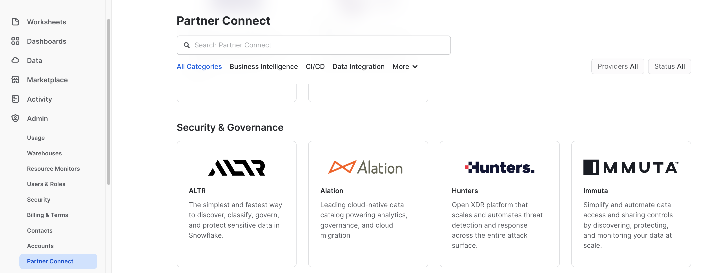

* After you have logged in, access the ``` Admin ``` menu selection from the left navigation bar.
* Then select ``` Partner Connect ```
* Either type in Alation in the search or scroll down to the Security & Governance section.


**2. Default Objects Created in your Snowflake trial account.**
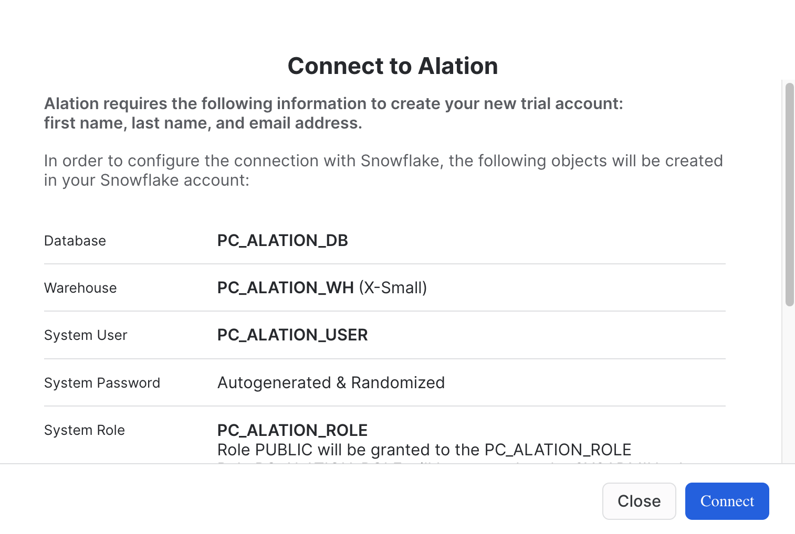
* Click: ``` Connect ```


**3. Your Partner Connect Account has been Created**
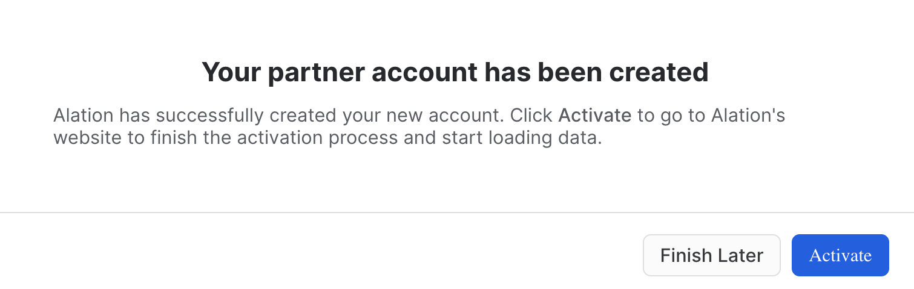
* Click: ``` Activate ```


**4. Alation Account set up**

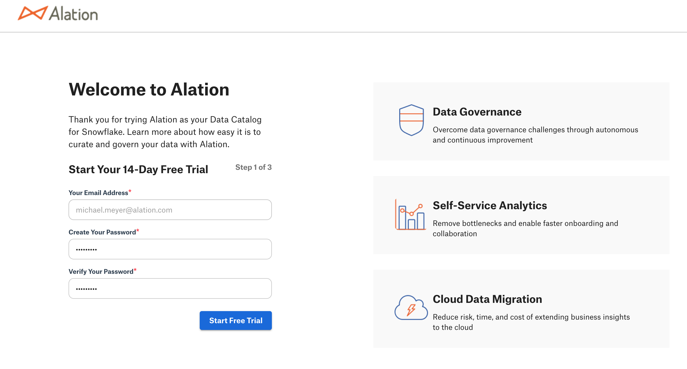
* The email address that you used for your trial Snowflake account will be used as your Alation user id. This is the reason why this field cannot be edited.
* Provide your password.
* Verify your password.
* Click: ``` Start Free Trial ```


**5. Getting Started User Information**


* Provide your information in order to start the trial. 
* Note: the email provided is how Alation will share addtional infomation throughout the trial.
* Click: ``` Next ```


**6. Your Account is Ready**

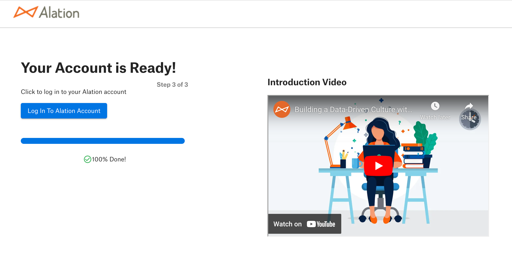
* Your Alation Trial has finished being installed and is ready for use.
* Click: ``` Log in to Alation Account ```
* Note: you will also receive an email with the Alation URL. 

<!-- ------------------------ -->
## Accessing the Lab
Duration: 2

In this Alation data intelligence lab, you can expect to see how the platform helps to solve problems for roles ranging from business analysts to data engineers. Each section will have discussion points along with exercises to help reinforce each topic.

Let's get started!

**1. Log into Alation website.**

Access the URL provided for your Alation trial in your preferred browser, like Chrome.

**2. On the home page scroll down to the bottom and click on Data Governance and Discovery VHOL.**


**3. The Data Governance and Discovery Virtual Hands on Lab.**

This is the main page that has the five chapters that will be covered in the lab. Each chapter covers a particular topic.

Let's get started with Chapter 01. Establishing a Governance Framework. Please click on the highlighted chapter link. 


## Establishing a Governance Framework
Duration: 5

**Overview**

One of the best parts of using the Alation data intelligence platform is that you get a system to drive data culture and a wealth of knowledge on how to get started. Data Governance doesn't need to be a daunting undertaking. Let Alation help guide you using an active data governance methodology based on people first. 

This section is all about how to get started and achieve value quickly from Alation—starting with curating assets to understanding common problems that most data organizations want to solve. Some challenges impact a particular role in an organization, and you will see how **all roles** benefit from the data intelligence platform solutions. 

**Note** that we will be accessing an Alation-provided Snowflake account for this lab. At the conclusion of the lab, we'll discuss how to set up Alation to manage your own Snowflake data sources.


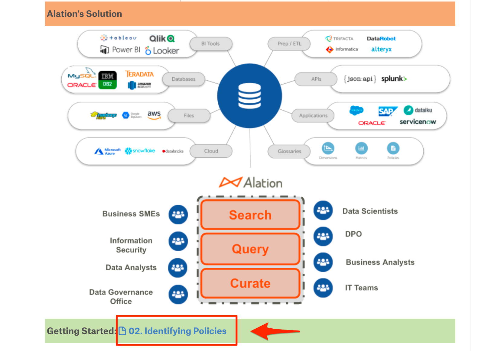

To continue to the next section, click on the link in the highlighted box at the bottom of the page.

<!-- ------------------------ -->
## Identifying Policies
Duration: 10

**Overview**

In today's world of data management, it is common to have policies and procedures that range from data quality and retention to personal data protection. If you are an organization that has policies defined, how difficult is it to find them? Often, policies are in file shares or document systems, making them very hard to discover. With Alation, you can store your policies where your data assets live, which makes them extremely easy to find. The other huge benefit is that data assets associated with the policy can be tracked.


<table>   
    <thead>
        <tr>
            <th colspan="2"> </th>
    </tr>
    </thead>
    <tbody>
        <tr>
            <td></td>
            <td><b>Exercise Guidance</b></td>
        </tr>
    </tbody>
</table>

1. Policies are part of the Governance App. Click on the dropdown arrow next to Apps.
2. Click on the Govern icon.

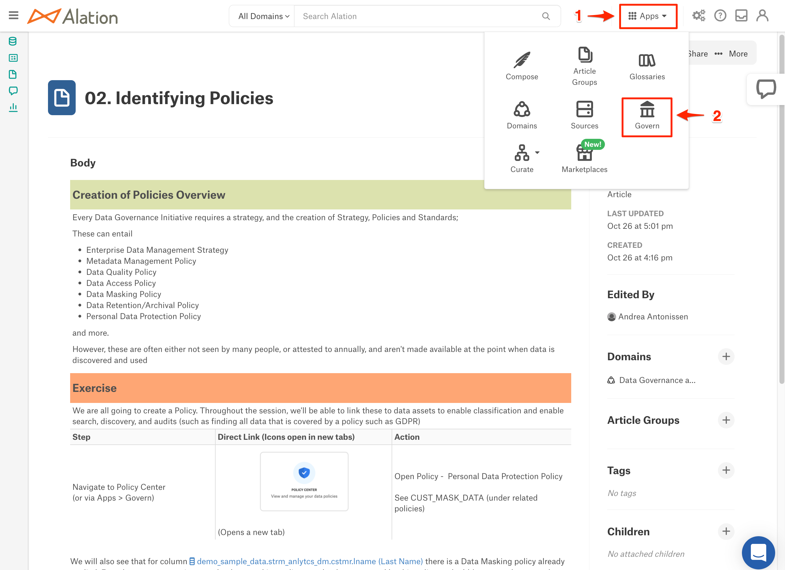

3. Click on the Policy Center tile.

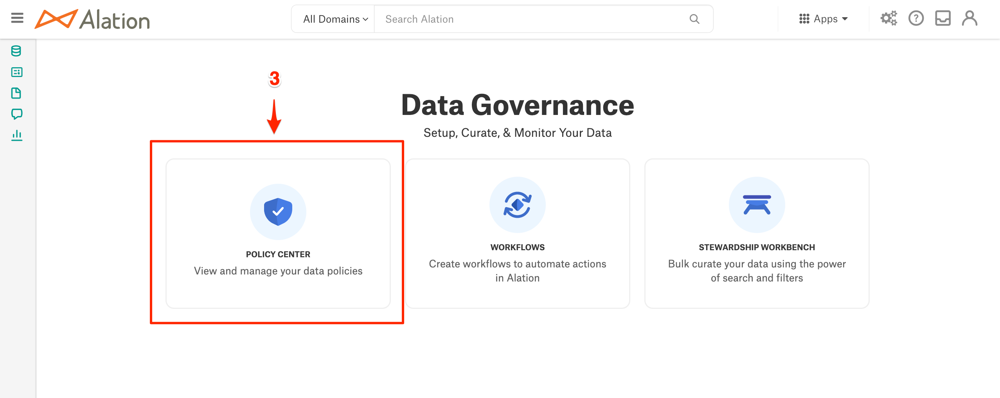

4. Once in Policy Center, you will be able to complete the exercise as outlined.

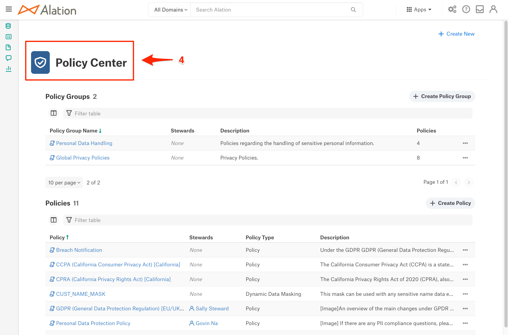


<table>   
    <thead>
        <tr>
            <th colspan="2"> </th>
    </tr>
    </thead>
    <tbody>
        <tr>
            <td></td>
            <td><b>Benefits</b></td>
        </tr>
    </tbody>
</table>

Policies as living content centralized with data asset information helps everyone in the organization. 

Now it is time to move on to Search and Discovery!


<!-- ------------------------ -->
## Search & Discovery
Duration: 10

**Overview**

Every organization wants to make data-driven decisions. For this to become a reality, all employees must have the ability to quickly search data assets (databases, files, reports, etc.) to discover trusted data they can understand and use. 

Alation creates an experience that allows users to expand their world of knowledge through curation and collaboration. A community of technical and non-technical producers and consumers helps drive data literacy, leading to better business decisions and success.

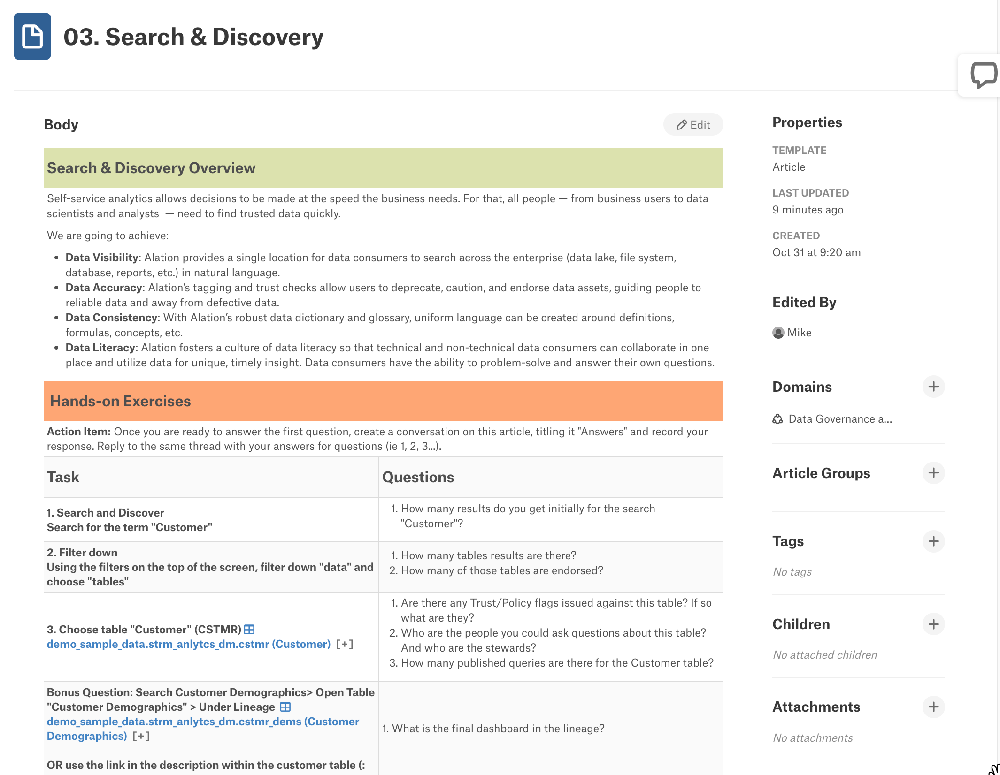


<table>   
    <thead>
        <tr>
            <th colspan="2"> </th>
    </tr>
    </thead>
    <tbody>
        <tr>
            <td></td>
            <td><b>Exercise Guidance</b></td>
        </tr>
    </tbody>
</table>

1. The Alation Search bar is always present on the home page in the header and at the top of the other pages.


2. As you start to type what you want to search for, Alation provides suggestions.
3. Click on All Results to see what the search has found and to filter the results to find what you are looking for quickly.

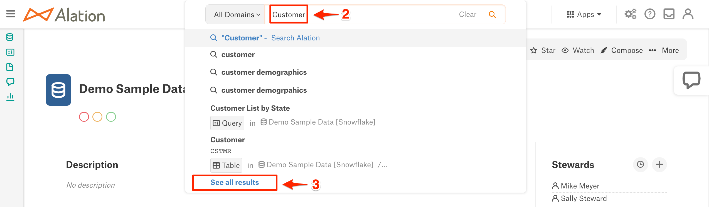

4. The top filters let you narrow your search by object type like column, articles, terms, etc.
5. The left-hand side of the screen has additional filters based on tags, custom fields, and more. This is a compelling way to look for specific items like PII Data Classification.
6. Search provides the trust flags to tell if the result item has been endorsed, warned, or deprecated. The star indicates this is an item you marked as one of your favorites.

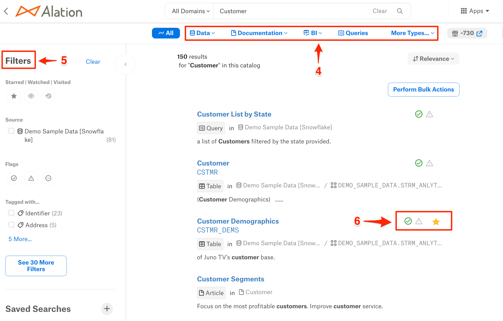


<table>   
    <thead>
        <tr>
            <th colspan="2"> </th>
    </tr>
    </thead>
    <tbody>
        <tr>
            <td></td>
            <td><b>Benefits</b></td>
        </tr>
    </tbody>
</table>

Search is core to increasing productivity and data literacy. Spend minutes instead of days finding the data that you need.

Now it is time to move on to Compose, Alation's SQL editor!

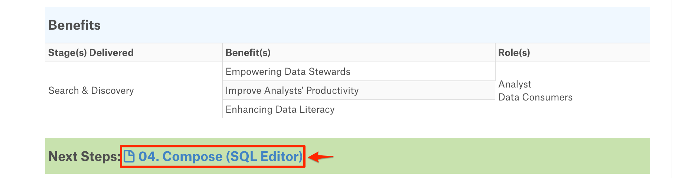
<!-- ------------------------ -->
## Compose 
Duration: 15

**Overview**

In addition to the rich cataloging and governance capabilities, Alation enables users to interact with data stored in cataloged sources. This capability is called Compose and provides a fully integrated and governed SQL development environment. 

Compose is more than your typical SQL editor. Because it is integrated with the catalog, the editor's IntelliSense can provide suggestions as you type for tables, columns, joins, etc. Another advantage is that active governance will show you when an item is deprecated, so you are not using bad data.

Queries can be developed by those who know SQL and shared with others in the organization. No worries if you don’t know how to read or write SQL. Queries can be published as forms that allow the business user to fill out some prompts and get answers to the questions they need to be answered.

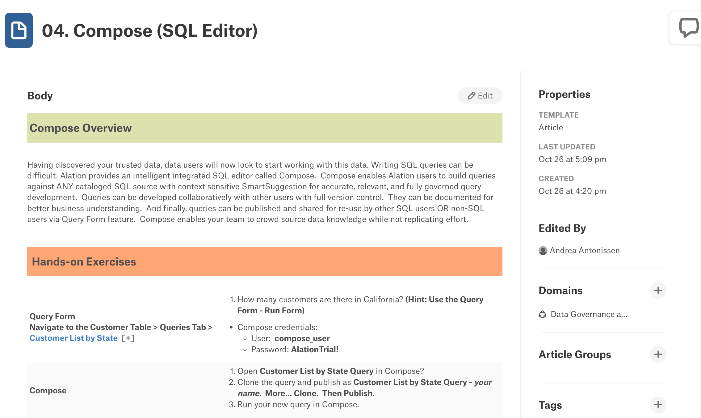


<table>   
    <thead>
        <tr>
            <th colspan="2"> </th>
    </tr>
    </thead>
    <tbody>
        <tr>
            <td></td>
            <td><b>Exercise Guidance</b></td>
        </tr>
    </tbody>
</table>

Queries and Compose are accessible from several places in the application. The following shows how you can navigate to them.

1. When viewing a table, you can click on the Queries tab to see all of the queries associated with this table.
2. The Compose link is in the upper right of the table view page. 


3. The left-hand navigation provides a Queries selection that can be expanded to see current queries.
4. You can click on the arrow to see additional queries and filters.
5. You can click on this link to launch the Compose SQL editor application, which will appear in a new tab.

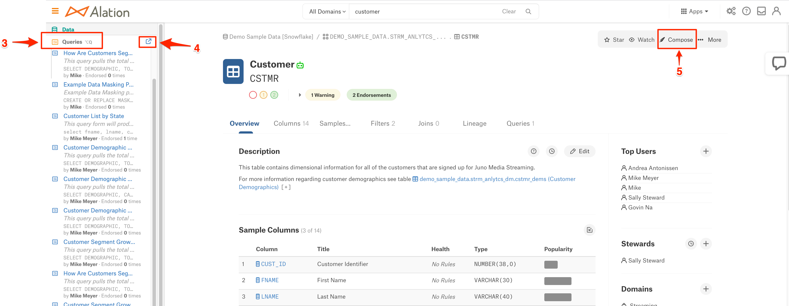

6. Since Compose was launched from a table view, a select statement with that table appears. If you were coming to Compose from a query, the query would appear.
7. The Connection Settings is where you provide your credentials to connect to the Alation provided Demo Sample Data - data source.


<table>   
    <thead>
        <tr>
            <th colspan="2"> </th>
    </tr>
    </thead>
    <tbody>
        <tr>
            <td></td>
            <td><b>Benefits</b></td>
        </tr>
    </tbody>
</table>

Compose helps spread data literacy in the organization by allowing users to build and share queries that help answer business questions.

Now it is time to wrap this up; let’s finish with a quick summary!

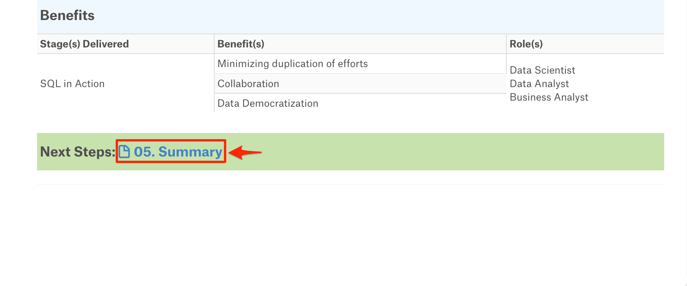

## Summary
Duration: 3

You did it! In this short period, you have seen how Alation:
- Improves productivity through self-service analytics
- Guides users to make better business decisions with trusted data
- Empowers organizations to continuously improve their data culture


### Continue your Alation Journey

To get the most out Alation during your trial.

1. The Quick Start Tour has self-guided demos on Self-service Analytics, Data Governance, and Compose. In addition, there are some how-to vides.
2. Our chat bot allows you to converse with a product specialist on questions you have, set up appointments with a product specialist, and search documentation for questions you have.


3. Click on this link to see how to connect your own Snowflake data sources.

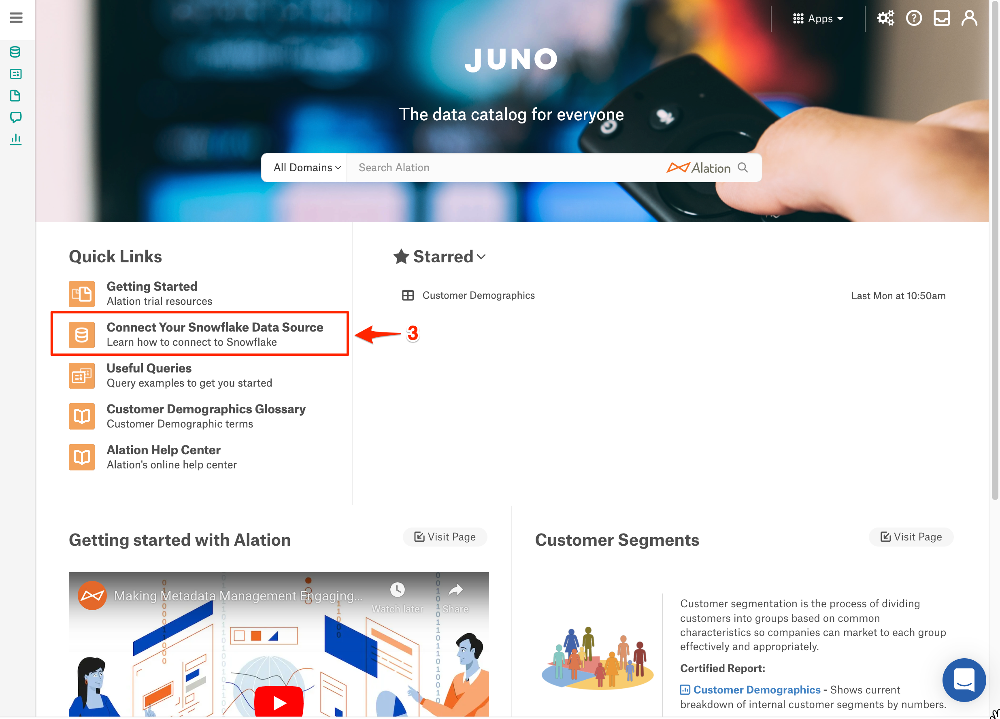

4. For additional guided demos and product information, please go to [Alation.com](https://www.alation.com/).


Last but not least, please check your email for continued guidance and tips throughout your trial. 

Thanks again for your interest in Alation; we are here for you!