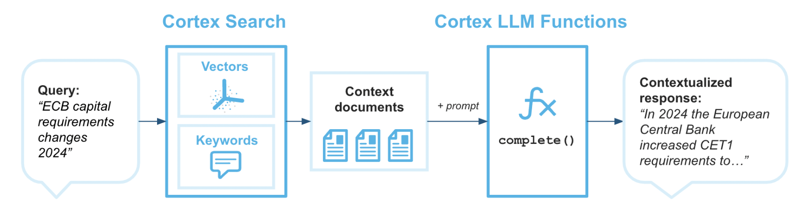
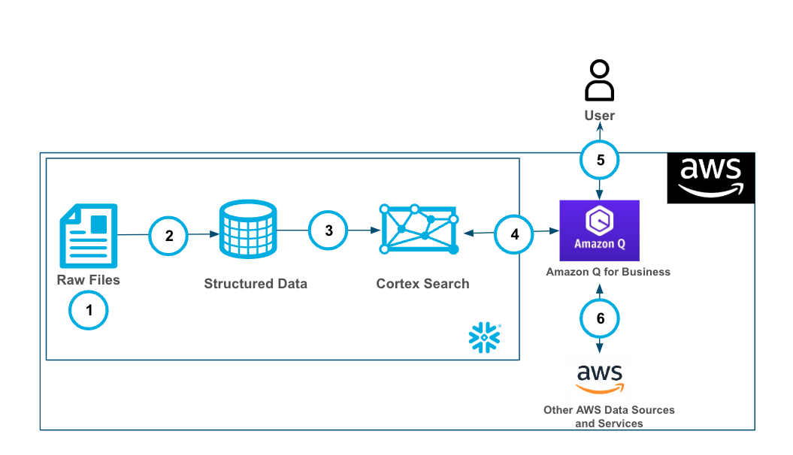
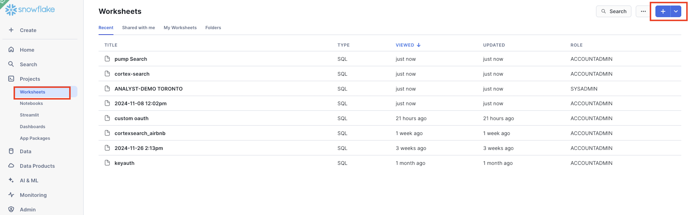
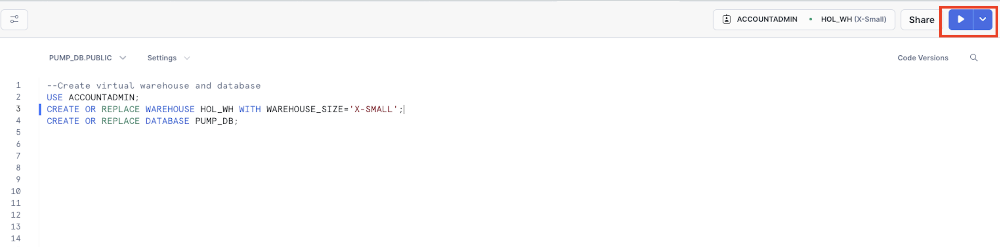
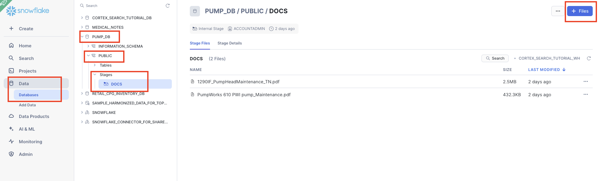

author: marzillo-snow
id: getting_started_with_amazon_q_for_business and_cortex
summary: This is a quickstart for using Amazon Q for Business with Cortex
categories: Getting-Started, data-science, data-engineering, AWS, cortex, genai, Amazon, Q, search, LLM, copilot
environments: web
status: Published 
feedback link: https://github.com/Snowflake-Labs/sfguides/issues
tags: Getting Started, Data Science, Data Engineering, Copilot

# Getting Started with Amazon Q for Business with Cortex
<!-- ------------------------ -->
## Overview 
Duration: 15

Cortex Search enables low-latency, high-quality “fuzzy” search over your Snowflake data. Cortex Search powers a broad array of search experiences for Snowflake users including Retrieval Augmented Generation (RAG) applications leveraging Large Language Models (LLMs).

Cortex Search gets you up and running with a hybrid (vector and keyword) search engine on your text data in minutes, without having to worry about embedding, infrastructure maintenance, search quality parameter tuning, or ongoing index refreshes. This means you can spend less time on infrastructure and search quality tuning, and more time developing high-quality chat and search experiences using your data. Check out the Cortex Search tutorials for step-by-step instructions on using Cortex Search to power AI chat and search applications.



Amazon Q Business makes generative AI securely accessible to everyone in your organization. Leveraging your own company's content, data, and systems, Amazon Q Business makes it easier to get you fast, relevant answers to pressing questions, solve problems, generate content, and take actions on your behalf. Amazon Q Business easily and securely connects to commonly used systems and tools so it can synthesize everything and provide tailored assistance empowering your teams to be more data-driven, creative, and productive.

Amazon Q Business offers plugins to enhance your application's functionality. Plugins help streamline tasks and boost productivity by integrating external services into the Amazon Q Business chat interface. With custom plugins from Q customers can quickly and securely connect to Cortex services like Search.


### Prerequisites
- Familiarity with [Snowflake](https://quickstarts.snowflake.com/guide/getting_started_with_snowflake/index.html#0) and a Snowflake account with Cortex Search.
- Familiarity with [AWS](https://aws.amazon.com/free) and an AWS account.

### You'll Learn
- Using Cortex Search along with complimentary functions in Snowflake.
- Using Amazon Q to leverage generative AI to get quick answers from your data.
- Connect Amazon Q to Snowflake Cortex Search with a custom plugin.

### What You’ll Need 
- A free [Snowflake Account](https://signup.snowflake.com/?utm_cta=quickstarts_)
- [AWS Account](https://aws.amazon.com/free) with access to Q
- For the sake of the lab it is best if both platforms have access to the public internet and are not in a virtual network


### What You’ll Build 
You will build an end-to-end copilot workflow on unstructured data in Snowflake
- to load data to Snowflake via Snowsight
- to extract unstructured data and create chunks in Snowflake
- to create a Snowflake Cortex Search Service on unstructured data
- to create a connection from Amazon Q to Cortex Search with Oauth authentication

The end-to-end workflow will look like this:

1. Ingest .pdf files into Snowflake Stage.
2. Using the PARSE_DOCUMENT() and the SPLIT_TEXT_RECURSIVE_CHARACTER() the raw pdf files are converted to a chunked field in a table.
3. The Cortex Search service is built on the chunked data.
4. Amazon Q for Business is connected to the Cortex Search service with a plugin using oauth authentication.
5. Users can use Amazon Q for Business with Cortex securely and seamlessly.
6. Along with the Cortex Plugin users can access other AWS data and services through Amazon Q for Business

<!-- ------------------------ -->
## Use Case
Duration: 5

In this use case you will build a Cortex Search service on the free text data contined in the two manuals [here](https://github.com/sfc-gh-mmarzillo/pump-docs-cortex-search/tree/main) for pump and pump head maintenance.

You will build a Cortex service that allows to you to us plain text to query these documents to get information. It is important to note that Cortex Search can scale much more than this use case. Please check out the Cortex Search documentation [here.](https://docs.snowflake.com/en/user-guide/snowflake-cortex/cortex-search/query-cortex-search-service)

<!-- ------------------------ -->
## Set Up Snowflake Environment and Cortex Search
Duration: 5

Download both of the files in [this repo](https://github.com/sfc-gh-mmarzillo/pump-docs-cortex-search/tree/main) by clicking on each file and clicking the download button near the top right.

Once you have the files downloaded you will go to Snowflake UI and open a new SQL worksheet and run the below code to create a database that we will be working out of. I'm using the ACCOUNTADMIN role here, but you can use whatever role you know gives you access to create objects (databases, tables, services) in Snowflake.

```sql
USE ACCOUNTADMIN;
CREATE OR REPLACE WAREHOUSE HOL_WH WITH WAREHOUSE_SIZE='X-SMALL';
CREATE OR REPLACE DATABASE PUMP_DB;
USE DATABASE PUMP_DB;
CREATE STAGE DOCS 
	DIRECTORY = ( ENABLE = true ) 
	ENCRYPTION = ( TYPE = 'SNOWFLAKE_SSE' );
```





Now that you have the database created you can upload the 2 manuals to a stage in the PUMP_DB database in the DOCS stage by clicking on Data on the left side of the Snowflake UI, clicking through to find the DOCS stage in the PUBLIC schema then clicking "+ files" in the top right to upload the files from your local machine.




####### START HEREEEEEE

```sql

```

Notice how we're setting up the Cortex Search service with a 30 day lag so that incremental updates to the service will be made ever 30 days. Additionally, we're setting up the service so that additional filters can be used on the attribute "ADMISSION_TYPE".

## Set Up Fabric Environment
Duration: 2

Head to your Fabric workspace, click "New" in the top left then "More Options" and select the "Notebook" widget.


<!-- ------------------------ -->
## Querying Cortex Search from Fabric
Duration: 15

Now let's copy and paste several blocks of code to the Fabric notebook and work through connecting to the Cortex Search service from Fabric.

First, let's install two packages that we need to use the API to connect.

```python
!pip install snowflake
%pip install --upgrade pydantic
```

Next, let's set up the connection request. For this quickstart you will have to populate the account identifier, your user name and password. For interactive work using username and password, but additional authentication methods are supported via the [Snowflake Python Package](https://docs.snowflake.com/en/developer-guide/python-connector/python-connector-connect).

```python
import os
import json

from snowflake.core import Root
from snowflake.connector import connect

# replace with hardcoded values if you wish; otherwise, ensure all values are in your environment.
CONNECTION_PARAMETERS = {
    "account": "<snowflake account>",
    "user": "<user name>",
    "password": "<password>",
    "role": "ACCOUNTADMIN",
    "warehouse": "HOL_WH",
    "database": "MEDICAL_NOTES",
    "schema": "PUBLIC"
    }
```

Now, let's connect to the service. You will likely need to approve the connection via MFA.

```python
# create a SnowflakeConnection instance
connection = connect(**CONNECTION_PARAMETERS,insecure_mode=True)
```

Next, we will build a function to query the Search service and return results. You can review and (if you would like) edit the query that we're sending to Cortex Search. Additionally, we're setting a high limit so that we return all relevant results and return all of the fields in the table with the free text field "TEXT". Take time as you would like to review the code that we're using to build the request.

```python
# Replace with your search parameters
# Replace with your search parameters
query = "you are a helpful assistant. Take your time to and be selective and only retrieve records that clearly show that the patient has an allergy to Penicillin and the diagnosis is related to Pneumonia. Exclude records where there is negation, for example there is mention of no pneumonia "
columns = ["TEXT","SUBJECT_ID","CATEGORY","ADMISSION_TYPE","DIAGNOSIS","AGE","GENDER","LOS"]
svc = "MEDNOTES_SEARCH_SERVICE"
filter_type={"@eq": {"ADMISSION_TYPE": "EMERGENCY"} }
limit = 1000


def search_records(connection, query, columns, svc, filter_type, limit):
    """
    Args:
        connection: The connection object to the database.
        query (str): The search query string.
        columns (list): The list of columns to retrieve.
        svc (str): The service name to perform the search.
        limit (int): The maximum number of results to return.

    Returns:
        dict: The search results in JSON format.
    """
    try:
        # create a root as the entry point for all objects
        root = Root(connection)
        
        # perform the search
        response = (
            root.databases[CONNECTION_PARAMETERS["database"]]
            .schemas[CONNECTION_PARAMETERS["schema"]]
            .cortex_search_services[svc]
            .search(
                query,
                columns,
                filter_type,
                limit=limit
            )
        )

        print(f"Received response with `request_id`: {response.request_id}")
        results = json.dumps(response.results, indent=5)
        print(results)
        return results
    except Exception as e:
        print(f"An error occurred: {e}")
```

Let's now run the function and place the results into a pandas dataframe.

```python
import pandas as pd
results = search_records(connection, query, columns, svc, filter_type, limit)
l = json.loads(results)
df = pd.DataFrame(l)
```
We have created a function that calls the service filtering only on Emergency admissions and using plain text to query the service and return records in which the discharge notes indicate an allergy to Penicillin. Then created a data frame with those records.

Now, let's take some time to review the results with some of Fabric Notebooks interactive EDA capabilities. Run the below code and click through the data to view the results. If you click through records on the "TEXT" field you can check to see if we're actually returning records where patients are allergic to Penicillin.

```python
display(df)
```


Click through additional fields to view the values in the table.

Now let's experiment with some more EDA in the results. Execute the below code in your Fabric Notebook.

```python
display(df, summary=True)
```

You can click through the different fields to see how patients allergic to Penicillin are separated across different categories.


To learn more about Fabric Notebook functionality check out the documentation [here](https://learn.microsoft.com/en-us/fabric/data-engineering/author-execute-notebook).

Finally, we can write the results of the Search query back to a table in Snowflake.

```python
from snowflake.connector.pandas_tools import write_pandas

# Write the DataFrame to Snowflake
success, nchunks, nrows, _ = write_pandas(connection, df, 'ALLERGY_TABLE')
```

You can head back to Snowflake to verify the table was created. And you can do with this whatever you would like...analyze the results in Snowflake, connect Power BI to it or build models with Cortex, SnowflakeML, Azure Openai and AzureML!


<!-- ------------------------ -->
## Conclusion and Resources
Duration: 5

This quickstart is just that, a quick way to get you started with using Fabric and Snowflake Cortex Search. There are plenty of different directions and enhancements you can make to this. The key thing is knowing that when you deploy Snowflake on Azure you have plenty of secure options for using Generative AI services regardless of where your data is and where you are orchestrating from!


### What You Learned
- Using Fabric Notebooks with Snowflake Cortex Search
- Creating a Cortex Search Service in Snowflake on unstructured data
- Using Fabric Notebooks to explore data
- Writing dataframes back to Snowflake

### Resources
- There are some great blogs on Medium regarding Snowflake Cortex, Microsoft Fabric and how Snowflake and Fabric work together

- [Snowflake Cortex](https://www.snowflake.com/en/data-cloud/cortex/)

- [Microsoft Fabric and Power BI](https://learn.microsoft.com/en-us/power-bi/fundamentals/fabric-get-started)

- [Fabric and Snowflake together](https://www.microsoft.com/en-us/microsoft-fabric/blog/2024/05/22/snowflake-and-microsoft-announce-expansion-of-their-partnership/)

If you have any questions, reach out to your Snowflake account team!


