author: sfc-gh-etolotti
id: getting_started_with_azure_data_factory_and_snowflake
summary: This is a quickstart for using Snowflake with Azure Data Factory
categories: Getting-Started, data-engineering, Microsoft
environments: web
status: Published 
feedback link: https://github.com/Snowflake-Labs/sfguides/issues
tags: Getting Started, Data Engineering, Azure, Microsoft

# Getting Started with Azure Data Factory and Snowflake
<!-- ------------------------ -->
## Overview 
Duration: 10

Azure Data Factory serves as a central orchestrator for managing data tasks, especially in ETL processes. It empowers businesses to seamlessly manage data movement through a code-free UI for intuitive authoring and single-pane-of-glass monitoring and management. By streamlining these workflows, Azure Data Factory enables organizations to harness their data assets effectively, driving informed decision-making and operational efficiency in today's data-centric landscape.

In this quickstart you will build an architecture that demonstrates how to use Azure Data Factory to orchestrate data ingestion from an Azure SQL transactional database into Snowflake to generate powerful analytical insights.


### Prerequisites
- Familiarity with [Snowflake](https://signup.snowflake.com/) and a Snowflake account
- Familiarity with Azure and an Azure account, an ADF workspace, and an Azure SQL with Adventure works sample data

### You'll Learn
- How to deploy an Azure SQL with Adventure Works sample data
- Setup an Azure Data Factory pipeline with linked services and datasets
- Utilize Copy Data, Data Flow, and Script activities using both SQL and SnowPark Python within ADF

### What You’ll Need 
- A free [Snowflake Account](https://signup.snowflake.com/)
- [Azure Account](https://azure.microsoft.com/en-us/free/search/?ef_id=_k_2ba2be3ad9791e57964fda0c62ccd55c_k_&OCID=AIDcmm5edswduu_SEM_k_2ba2be3ad9791e57964fda0c62ccd55c_k_&msclkid=2ba2be3ad9791e57964fda0c62ccd55c) with ADF, storage container, and Azure SQL

### What You’ll Build 
You will build an orchestrated data pipeline from Azure SQL to Snowflake, learning how to:
- Deploy an Azure SQL with Adventure Works 
- Deploy and ADF Workspace
- Build an ADF pipeline
- Trigger the data pipeline

The end-to-end workflow will look like this:
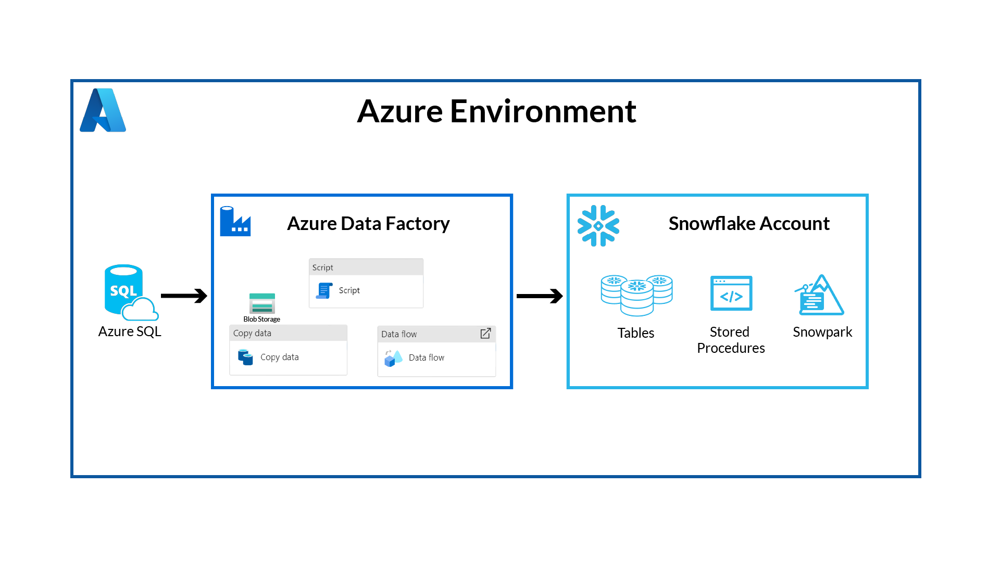

<!-- ------------------------ -->
## Use Case
Duration: 5

As a retail analyst, imagine effortlessly unraveling your company's sales performance with Azure Data Factory and Snowflake. Your sales data, stored in Azure SQL, seamlessly flows into Snowflake, where you can conduct comprehensive analyses with unprecedented speed and scalability. A combination of GUI and scripting-based interfaces allows anyone, no matter their skillset or preferences, to easily orchestrate data pipelines. With pushdown compute capabilities, choose between SQL and Python to effortlessly sift through the data within Snowflake, revealing invaluable insights. 


<!-- ------------------------ -->
## Set Up Snowflake Environment
Duration: 5

The first thing to do is create a database and warehouse in your Snowflake environment. Run the below code in a Snowflake worksheet. You are using the AccountAdmin role here for demo purposes, but in production you will likely use a different role.

```sql
-- Create a new database (if not already created)
CREATE DATABASE IF NOT EXISTS ADFdemo;
USE DATABASE ADFdemo;
-- Create a new virtual warehouse (if not already created)
CREATE WAREHOUSE IF NOT EXISTS ADFdemo WITH WAREHOUSE_SIZE='X-SMALL';
CREATE SCHEMA IF NOT EXISTS Raw;
CREATE SCHEMA IF NOT EXISTS Analytics;


CREATE OR REPLACE TABLE Raw.Customer(
	CustomerID int,
	NameStyle STRING ,
	Title STRING NULL,
	FirstName STRING ,
	MiddleName STRING NULL,
	LastName STRING ,
	Suffix STRING NULL,
	CompanyName STRING NULL,
	SalesPerson STRING NULL,
	EmailAddress STRING NULL,
	Phone STRING NULL,
	PasswordHash STRING ,
	PasswordSalt STRING ,
	rowguid STRING ,
	ModifiedDate datetime 
);


CREATE OR REPLACE TABLE Raw.Product(
	ProductID int  ,
	Name STRING ,
	ProductNumber STRING ,
	Color STRING NULL,
	StandardCost decimal ,
	ListPrice decimal ,
	Size STRING NULL,
	Weight decimal(8, 2) NULL,
	ProductCategoryID int NULL,
	ProductModelID int NULL,
	SellStartDate datetime ,
	SellEndDate datetime NULL,
	DiscontinuedDate datetime NULL,
	ThumbNailPhoto STRING NULL,
	ThumbnailPhotoFileName STRING NULL,
	rowguid STRING ,
	ModifiedDate datetime 
); 

CREATE OR REPLACE TABLE Raw.ProductCategory(
	ProductCategoryID int  ,
	ParentProductCategoryID int NULL,
	Name STRING ,
	rowguid STRING ,
	ModifiedDate datetime 
);


CREATE OR REPLACE TABLE Raw.SalesOrder(
	SalesOrderID int ,
	SalesOrderDetailID int ,
	OrderQty int ,
	ProductID int ,
	UnitPrice DECIMAL ,
	UnitPriceDiscount DECIMAL ,
	LineTotal  DECIMAL,
	rowguid STRING ,
	ModifiedDate datetime ,
	RevisionNumber int ,
	OrderDate datetime ,
	DueDate datetime ,
	ShipDate datetime NULL,
	Status int ,
	SalesOrderNumber  STRING,
	PurchaseOrderNumber STRING NULL,
	AccountNumber STRING NULL,
	CustomerID int ,
	ShipToAddressID int NULL,
	BillToAddressID int NULL,
	ShipMethod STRING ,
	CreditCardApprovalCode STRING NULL,
	SubTotal DECIMAL ,
	TaxAmt DECIMAL ,
	Freight DECIMAL ,
	TotalDue  DECIMAL,
	Comment STRING NULL
);

CREATE TABLE IF NOT EXISTS Analytics.CustomerOrders (
SalesOrderID int,
orderdate datetime,
DueDate datetime,
ShipDate datetime,
PurchaseOrderNumber STRING,
AccountNumber STRING,
TotalDue DECIMAL,
rowguid STRING,
Title STRING,
FirstName STRING,
LastName STRING,
CompanyName STRING,
EmailAddress STRING,
LineTotal DECIMAL,
Productname STRING,
ProductNumber STRING,
ProductCategoryName STRING
);

CREATE OR REPLACE PROCEDURE Analytics.InsertCustomerOrders()
RETURNS VARCHAR
LANGUAGE SQL
AS
$$
BEGIN

INSERT INTO Analytics.CustomerOrders
SELECT
    so.SalesOrderID,
    so.orderdate,
    so.DueDate,
    so.ShipDate,
    so.PurchaseOrderNumber,
    so.AccountNumber,
    so.TotalDue,
so.rowguid,
c.Title,
c.FirstName,
c.LastName,
c.CompanyName,
c.EmailAddress,
so.LineTotal,
p.name,
p.ProductNumber,
pc.Name
  FROM raw.SalesOrder so
    join raw.Customer c on c.CustomerID=so.CustomerID
    join raw.Product p on p.ProductID=so.ProductID
    join raw.ProductCategory pc on pc.ProductCategoryID=p.ProductCategoryID
LEFT JOIN Analytics.CustomerOrders co on co.SalesOrderID=so.SalesOrderID 
WHERE co.rowguid is null; 

  RETURN 'Success';
END;
$$;
```
This SQL has set up the raw tables for us to land data into, as well as some stored procedures you’ll use later in the quickstart.

The result should look like this screenshot, with tables, stored procedure, and Schemas: 
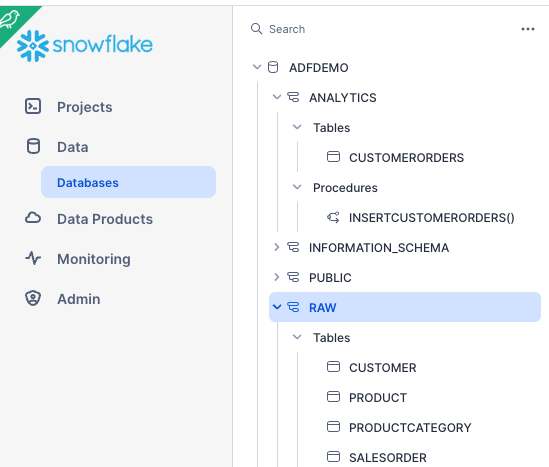

<!-- ------------------------ -->
## Set Up Azure Environment
Duration: 15

### Set Up Azure SQL with AdventureWorks Data

Now you need to set up your Azure SQL instance.  When you create it you can include a sample Adventure Works dataset, this will represent your transactional sales database.

1. Select create > Search Martkerplace for Azure SQL > Click Create > Under SQL Databases select Single Database and click Create
   * Database Name: ADFdemo
2. Server (Select create new): Give a unique server name, enable SQL authentication for this quickstart and enter an admin login and password. 
   * Go to Networking, for Connectivity method select Public Endpoint, select yes for both Allow Azure Services and Add Current client IP.
   * No changes in Networking or Security
3. Under Additional Settings, Use Existing Data: Select Sample
   * Select Create


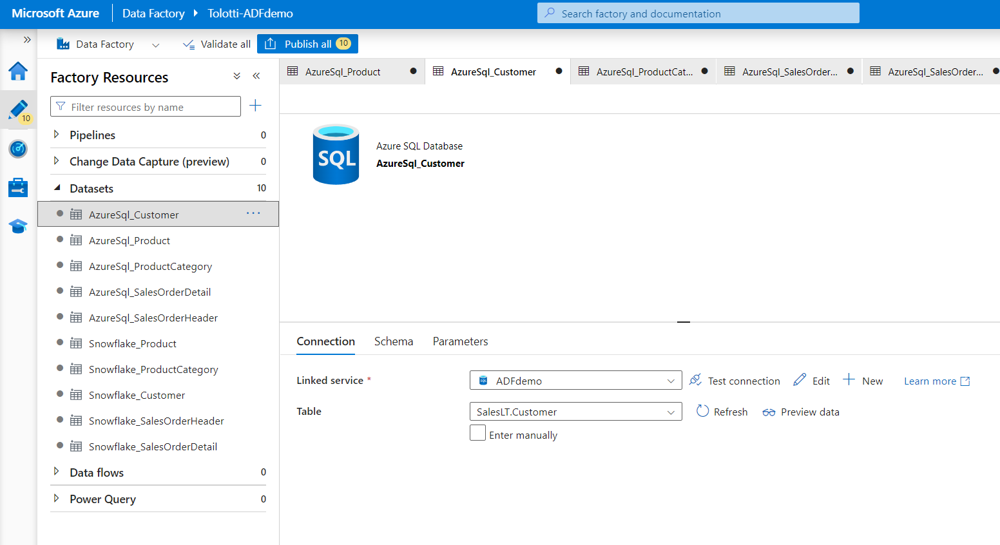


### Set Up ADF Workspace

Head back to the Azure Marketplace and search for Data Factory.  
Select Create > Enter a Name, your preferred region, and V2 for the Instance Details.  
Create with the default settings.

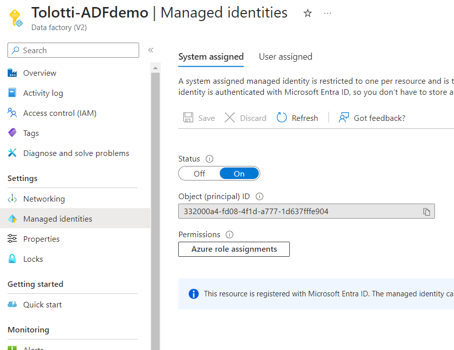

### Set up Container for Staging

Behind the scenes, ADF will use Blob Storage to stage data as it is moved.  So you need to have a Blob Storage container available.

1. From the Marketplace, search for Storage Account and create.
   * Give the Account a unique name
   * Keep all the default settings the same and Create

(Note: you are leaving the Networking open to public access for this Quickstart, be sure to follow your organization's security best practices for non-demo projects)

2. Once created select Go to Resource
   * On the left select Containers
   * Add a Container named adfdemo

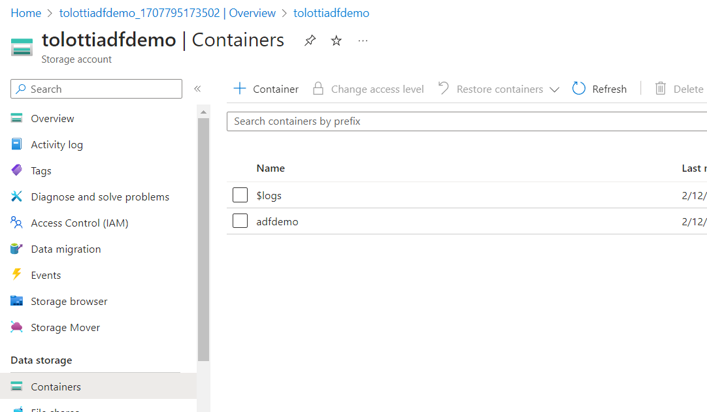

3. You’ll need to generate a SAS token for ADF to access the container.
   * On the left panel select Shared Access Signature
   * Ensure all resource types are available
   * Make the expiration End Date long enough to finish the Quickstart
   * Generate SAS and connection strong, then copy out the SAS token
(Note: Be sure to save it or leave this tab open, you won’t be able to get back to the token)

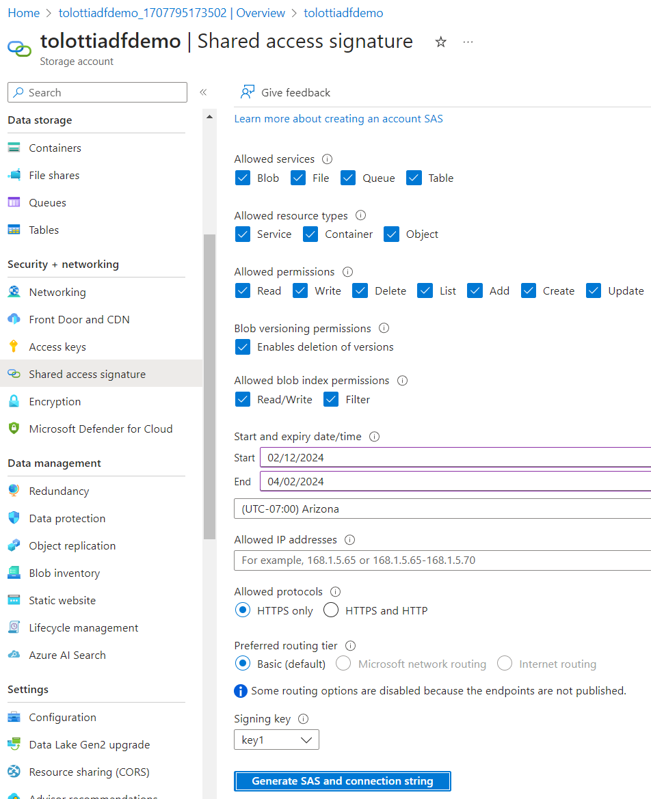

<!-- ------------------------ -->
## Configure the Linked Services
Duration: 10

Now you want to get into the ADF Studio.  Go to the ADF resource you created and click Launch Studio from the Overview tab.  This will open up the Data Factory Studio.

On the Left panel, click on the Manage tab, and then linked services.

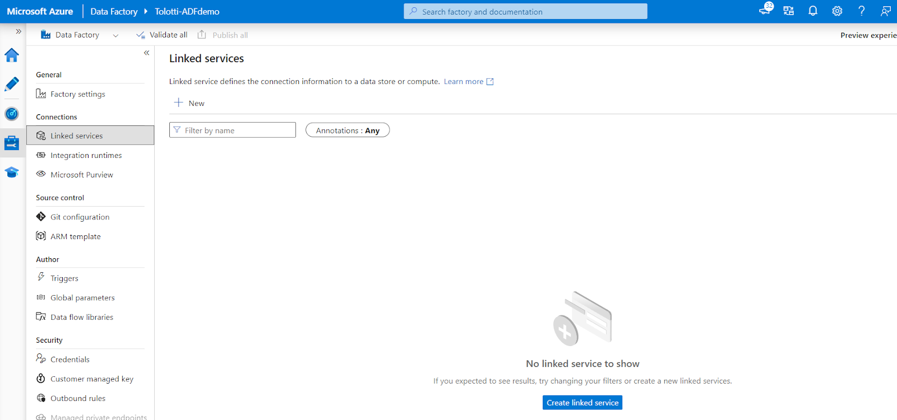


Linked Services act as the connection strings to any data sources or destinations you want to interact with. In this case you want to set up services for Azure SQL, Snowflake, and Blob Storage.

1. Click Create Linked Services > Select Azure SQL Database > Continue
   * Add a Name, select all the subscription information for your Azure SQL database
   * Enter your SQL authentication username and password setup previously
   * Test connection and create

2. Click Create Linked Services > Select Azure Blob Storage> Continue
   * Set Authentication type to SAS URI and enter the information created in previous steps
   * The URL should be just the base URL: such as AccountName.blob.core.windows.net

3. Click Create Linked Services > Select Snowflake > Continue
   * Fill out the details for your account, note the format of the account name
   * The database and warehouse are both ADFDEMO

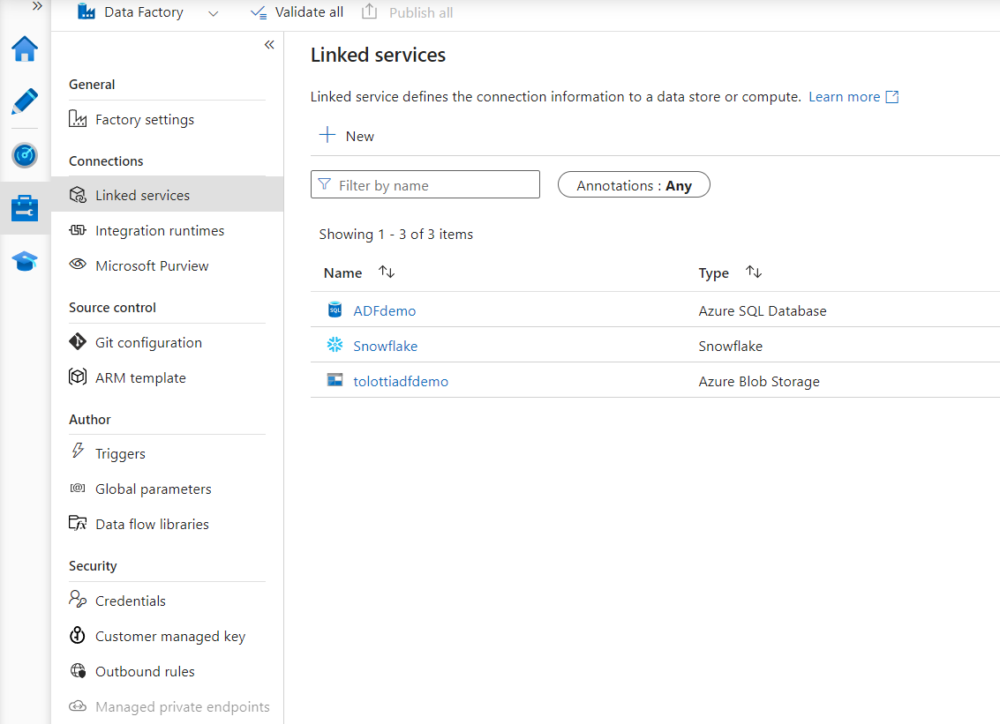

<!-- ------------------------ -->
## Create Source & Sink Datasets
Duration: 10

Next you need to create datasets that map the data inside the linked services.  In this case you'll need to set up 5 source datasets for the Azure SQL tables, and 5 sink datasets for the Snowflake tables.

Navigate to Author on the side menu, under the three dot menu on Datasets select New Dataset. 
   * Select Azure SQL database, name it AzureSQL_Product and enter your linked server to azure SQL
   * Then set the table name to SalesLT.Product

Repeat this process for the following:
   * AzureSQL_ProductCategory
   * AzureSQL_Customer
   * AzureSQL_SalesOrderHeader
   * AzureSQL_SalesOrderDetail

Now you want to set up the Sink datasets in Snowflake.
   * Create a new dataset, but this time select Snowflake
   * Name the dataset Snowflake_Product
   * Set the linked service to the Snowflake one you created.  And set the tablename to Raw.Product

Again repeat this process for the following:
   * Snowflake_ProductCategory
   * Snowflake_Customer
   * Snowflake_SalesOrder


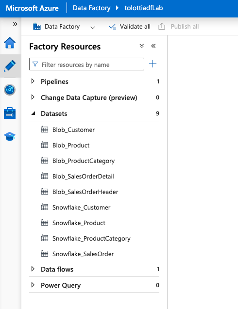

<!-- ------------------------ -->
## Create the Pipeline
Duration: 30

Now it’s time to set up the pipeline that will control the flow of the data.

### Copy Data

You'll start with a Copy Data Activity to directly copy the data from source to sink, with no transformation.  Transformations can be done later in Snowflake, which is an ELT process.

1. Under Move and Transform, select a CopyData activity.
   * Name the CopyData Activity as Product. 
   * Under the Source tab, select AzureSql_Product.
   * Under the Sink tab, select Snowflake_Product. In the pre-copy script enter “Truncate table Raw.Product;”. This SQL will clear what's in the raw staging in Snowflake each time data is loaded.
   * Under the Settings tab, toggle Enable Staging and set the Staging account to the Blob Storage setup previously.

2. You can copy and paste the Activity to create two more CopyData activities.
   * For the first, update the name to ProductCategory, and update the source and sink to the product category tables. Update the Sink truncate command to Raw.ProductCategory.
   * For the second, do the same with Customer.

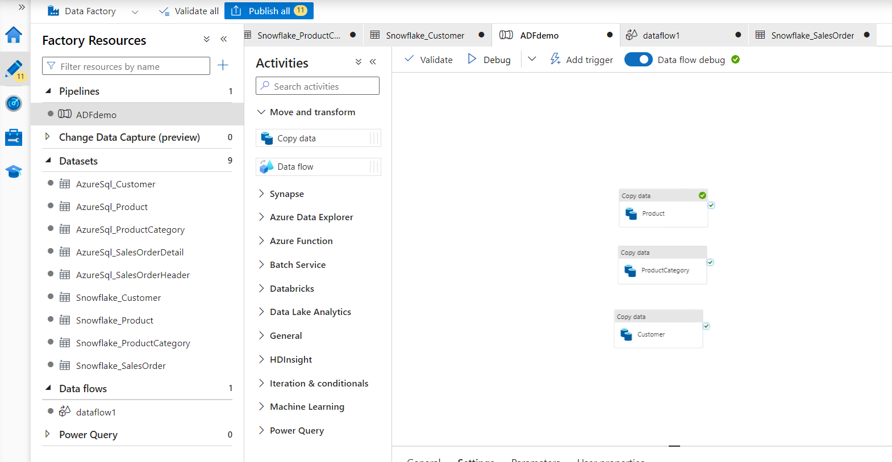


### Data Flow

Now add a Data Flow Activity. Data Flows are a traditional ETL task. You can perform transformations on the data in the middle of the data movement.  If you are familiar with SSIS, data flows have similar functionality. In this case you are going to merge the Sales Order Header and Detail into a single table in Snowflake.

- Name the activity SalesOrders.
- Under Settings select New Data flow.
- Under the Properties set the Name to SalesOrder DataFlow.
- At the top, select Data Flow Debug, and OK.  This will create a Spark cluster for debugging.
- Add a Source.  Name the output stream SalesOrderHeader and Select the dataset as AzureSQL_SalesOrderHeader.  Under projection click Import projection to get the field metadata.
- Add a second source. Name the output stream SalesOrderDetail and Select the dataset as AzureSQL_SalesOrderDetail.  Under projection click Import projection to get the field names.
- Select the small + to the right of the SalesOrderHeader task, and add Join.
- Set the left stream to SalesOrderHeader, and the right to SalesOrderDetail.
- Under join conditions set both the left and right to SalesOrderID.
- Click the + and add in a select task.  Since there are some columns in both tables with the same name, the skip duplicate input columns will just use the SalesOrderHeader columns.
- Select + and add a sink.  Name it Snowflake, set the dataset to Snowflake_SalesOrder. Under mapping uncheck Auto Mapping so it uses the fields from the select step. You may need to open the Dataset and Import schema to refresh the metadata if the mapping does not look correct.


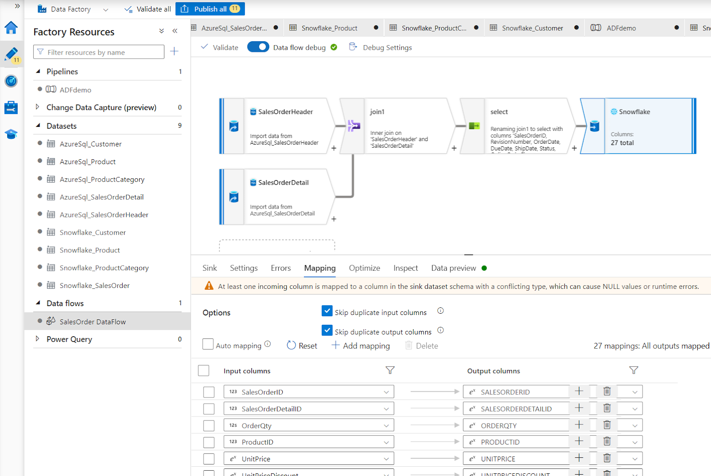


### Script Tasks

In order to push compute to Snowflake, you can add in script activities to call queries or stored procedures. In this step you can transform the data however you need to, using SQL or python via Snowpark.

Back in the pipeline, under the General Activities, add in a Script Activity. 

 Name the activity Update CustomerOrders, under Settings add in a query for 
    ```CALL Analytics.InsertCustomerOrders();
    ```

Now orchestrate the order of execution by connecting activities with the Success connector.


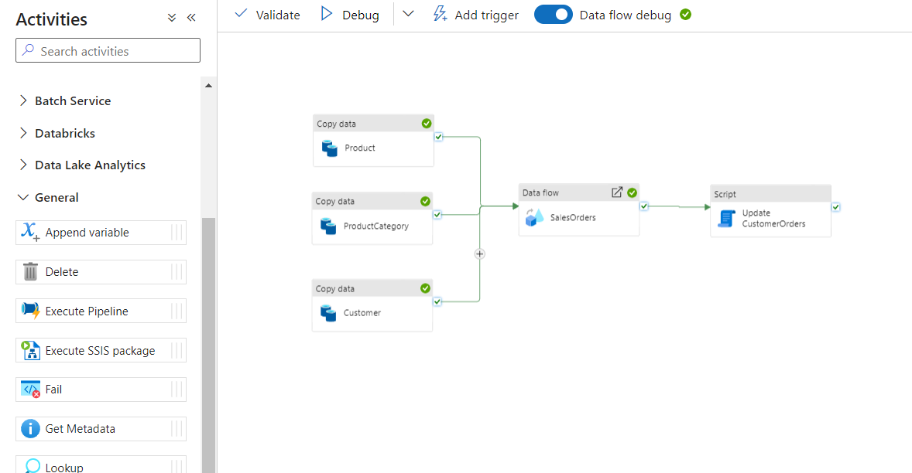


By clicking the Validate and Debug you can perform a test run of the entire pipeline.

Then go into your Snowflake instance and validate that the tables have data.

<!-- ------------------------ -->
## Triggers and Monitors
Duration: 5

ADF is designed to be an automated pipeline orchestrator. 

* At the top of the pipeline click Add Trigger, and New/Edit.
* Set Recurrence to Every 1 Day.
* Set the time to whatever works best for your testing.

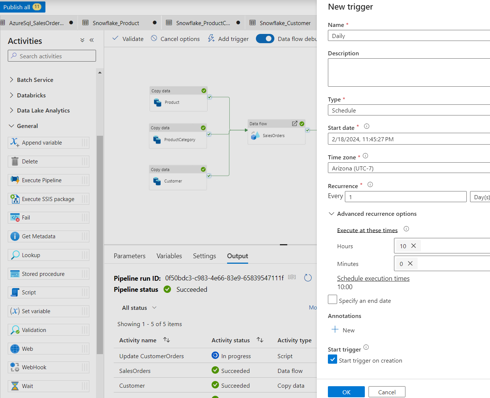

Now publish all objects created by clicking on Publish all at the top.

Once the trigger has activated and the pipeline is running, you can monitor the progress of all runs in the Monitor tab on the left menu.

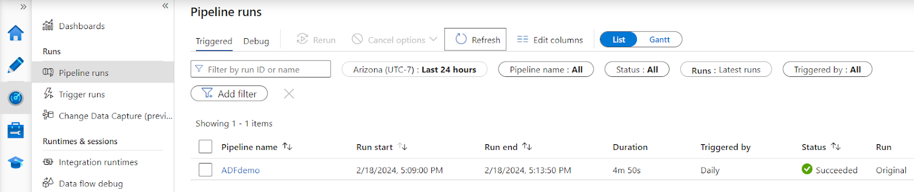

<!-- ------------------------ -->
## Conclusion and Resources
Duration: 5

Congratulations! You've successfully set up a data pipeline ingesting data from Azure SQL to Snowflake, using CopyData, DataFlows, and Script activities. You now have bulk data ingestion occuring at a scheduled interval, and your AdventureWorks retail data is prepared for analytics, machine learning, and data applications.

### What You Learned
- How to deploy an Azure SQL with Adventure Works sample data
- Set up an Azure Data Factory pipeline with linked services and datasets
- Utilize Copy Data, Data Flow, and Script activities using both SQL and SnowPark Python within ADF

### Related Resources

This Quickstart is just that, a quick way to get you started with ADF and Snowflake. You will want to consider the additional items below for enterprise-grade workloads:
- [Official Documentation](https://learn.microsoft.com/en-us/azure/data-factory/connector-snowflake?tabs=data-factory)
- [Common Troubleshooting](https://learn.microsoft.com/en-us/azure/data-factory/connector-troubleshoot-snowflake)
- [Using Private Endpoints](https://community.snowflake.com/s/article/How-to-set-up-a-managed-private-endpoint-from-Azure-Data-Factory-or-Synapse-to-Snowflake)
- [Key-Pair authentication](https://medium.com/snowflake/azure-data-factory-connecting-to-snowflake-using-keypair-authentication-906000506345)
