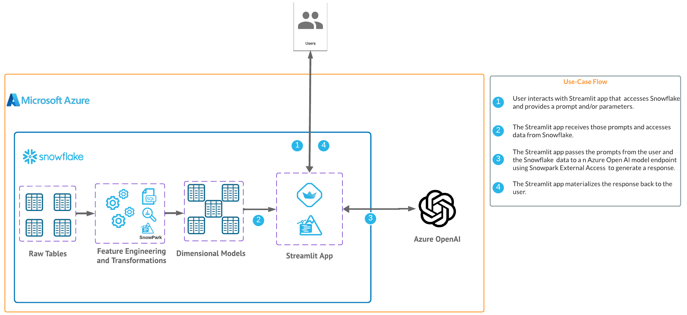
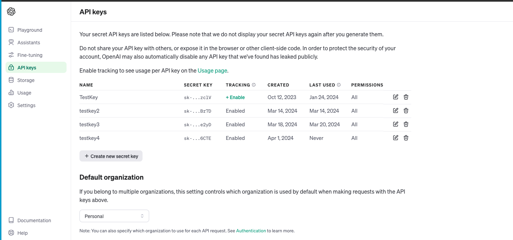
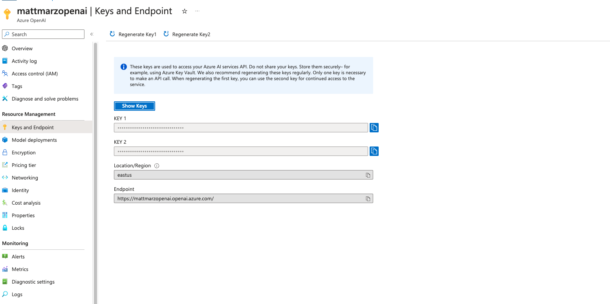
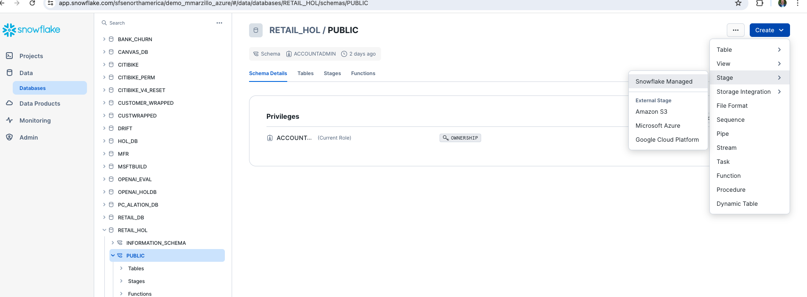
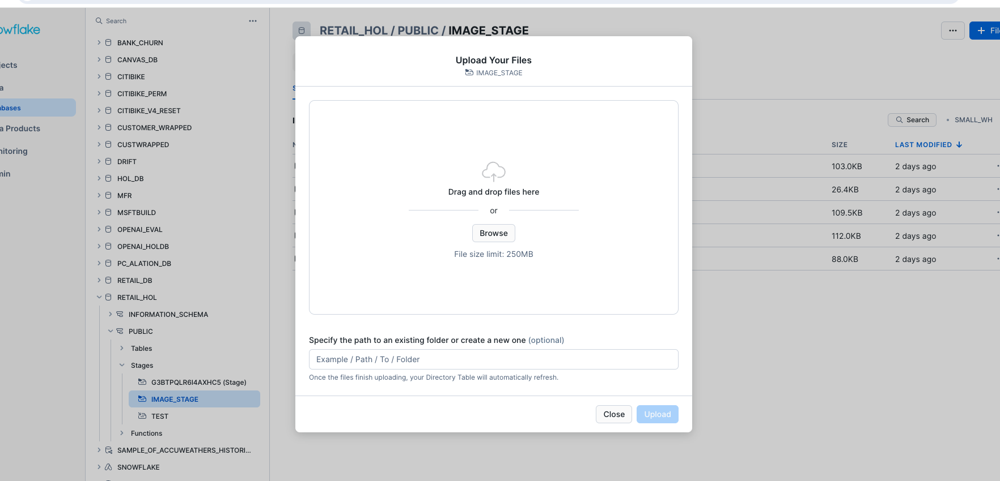
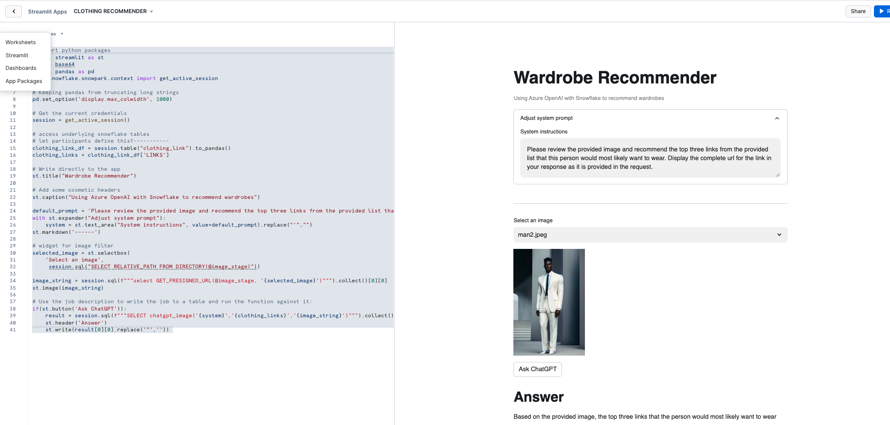

id: getting_started_with_azure_openai_streamlit_and_snowflake_for_image_use_cases
summary: Getting Started with Azure OpenAI Streamlit and Snowflake using Snowpark External Access for image use cases
categories: featured,getting-started,app-development, azure, openai, streamlit, genai, ai, ml, image
environments: web
status: Published
feedback link: <https://github.com/Snowflake-Labs/sfguides/issues>
tags: Getting Started, Generative AI, Snowflake External Access, Azure, OpenAI, Snowpark, Streamlit
authors: Matt Marzillo

# Getting Started with Azure OpenAI, Streamlit and Snowflake
<!-- ------------------------ -->
## Overview

Duration: 5

In this quickstart we will build a Streamlit application that leverages Snowpark External Access in Snowflake with Azure OpenAI that will generate a recommendation for clothing items given an image of a person.

In summary this is what you will do:
- Set up environments in both Snowflake and Azure.
- Create a function that leverages Snowpark External Access to make a call to Open AI.
- Create a Streamlit app that leverages the above function to generate responses using data from Snowflake and prompts.

### What is Generative AI?
Generative AI is a category of artificial intelligence techniques that enable machines to create new, original content, such as text, images, or music, by learning from existing data. These models, often based on neural networks, generate content by understanding patterns and structures in the training data and then producing novel examples that resemble what they have learned. Generative AI has applications in various fields, including natural language processing, computer vision, and creative arts.

### What is Azure OpenAI?
Azure OpenAI is a cloud-based service provided by Microsoft that integrates OpenAI's powerful language models, including GPT-4, into the Azure platform, enabling developers and businesses to build and deploy AI applications with advanced natural language processing capabilities. This collaboration offers high scalability, enterprise-grade security, and compliance features, making it suitable for a wide range of applications, from chatbots to complex data analysis. Users can access Azure's robust infrastructure and tools to train, fine-tune, and manage AI models efficiently. Azure OpenAI simplifies the process of implementing AI solutions while providing the flexibility to customize them according to specific organizational needs.

### What is Snowflake?
Snowflake is a cloud-based data warehousing solution that allows businesses to store and analyze large volumes of data efficiently. It separates storage and compute functionalities, enabling users to scale resources independently and pay only for what they use. Snowflake supports a wide range of data workloads, including data warehousing, data lakes, and data engineering, and offers robust data sharing capabilities across different cloud platforms.

### What is Streamlit?
Streamlit is a Python library that makes it easy to create and share custom web apps for machine learning and data science. In just a few minutes you can build and deploy powerful data apps.

### Pre-requisites
- Familiarity with [Snowflake](https://quickstarts.snowflake.com/guide/getting_started_with_snowflake/index.html#0) and a Snowflake account
with Access to [Streamlit](https://streamlit.io/) in your Snowflake account.
- [Azure Account](https://azure.microsoft.com) with Azure OpenAI or a stand alone OpenAI service.
- Familiarity with the Python programming language.

### What you’ll build
We will build an efficient architecture all within Snowflake that will access product urls and images in Snowflake and pass that data to a an OpenAI model to generate a recommendation . The architecture will look like this



<!-- ------------------------ -->
## Use Case
Duration: 5

This use case will leverage sample urls along with sample images that will be passed to the OpenAI model in order to provide recommendations from the urls using the image data as context along with the prompt.

<!-- ------------------------ -->
## Azure / Open AI Environment

Duration: 10

For this quickstart you can either leverage a Azure OpenAI service or a stand alone OpenAI resource. Depending on timing and your organizations Azure subscription you may be better off utilizing a personal/trial OpenAI service that comes with a nominal cost for the sake of this lab. You will have to navigate to [platform.openi.com/api-keys](platform.openi.com/api-keys) and create a new secret key as it looks below. Make note of the model name and keyas you will need this to generate a response. 



If you have access to image models in Azure you can follow the instructions [here](https://learn.microsoft.com/en-us/azure/ai-services/openai/gpt-v-quickstart?tabs=image%2Ccommand-line&pivots=programming-language-studio) to deploy an image model in Azure. (at the time of publishing this quickstart we will be using a gpt4 turbo image model). Make note of the deployment name for the image model that you deployed.

Head back to the Azure portal and find the Azure Open AI service then click on "Keys and Endpoint" make note of the key and Endpoint as you will need this to generate a response.



<!-- ------------------------ -->
## Snowflake Environment

Duration: 10

Open a SQL Worksheet (from the Projects tab) in the Snowflake UI and Copy and paste the below code into your Snowflake worksheet, this will create a table with links to items at a retail website that we will use to pass to OpenAI to provide recommendations. For the sake of the quickstart we are using the ACCOUNTADMIN role, but in practice you will likely want to use a different, organization specific role.

Users are encouraged to alter the code to add additional urls to other items if they would like.

```sql
--create database and warehouse
use role accountadmin;
CREATE OR REPLACE WAREHOUSE HOL_WH WITH WAREHOUSE_SIZE='X-SMALL';
CREATE OR REPLACE DATABASE RETAIL_HOL;

--create table with links to items
CREATE OR REPLACE TABLE clothing_link (
  link_id INT,
  links VARCHAR(512)
);

INSERT INTO clothing_link (link_id, links)
VALUES 
  (1, 'https://www.macys.com/shop/product/xscape-womens-floral-print-rosette-halter-gown?ID=17659240'),
  (2, 'https://www.macys.com/shop/product/calvin-klein-womens-3-4-sleeve-sheath-dress?ID=17294804'),
  (3, 'https://www.macys.com/shop/product/calvin-klein-womens-tulip-sleeve-midi-dress?ID=16193818'),
  (4, 'https://www.macys.com/shop/product/gloria-vanderbilt-womens-amanda-button-front-shirt?ID=11831590'),
  (5, 'https://www.macys.com/shop/product/tommy-hilfiger-womens-solid-short-sleeve-polo-top?ID=11649535'),
  (6, 'https://www.macys.com/shop/product/gloria-vanderbilt-womens-shape-effect-straight-leg-shorts?ID=17613003'),
  (7, 'https://www.macys.com/shop/product/steve-madden-womens-harlow-notched-collar-blazer?ID=17690729'),
  (8, 'https://www.macys.com/shop/product/womens-black-white-smocked-waist-geo-pants?ID=18038135'),
  (9, 'https://www.macys.com/shop/product/levis-womens-high-rise-wide-leg-ripped-jeans?ID=17389986'),
  (10, 'https://www.macys.com/shop/product/the-north-face-womens-heavyweight-crewneck-sweatshirt?ID=16631001'),
  (11, 'https://www.macys.com/shop/product/dress-the-population-womens-sweetheart-midi-dress?ID=17669569'),
  (12, 'https://www.macys.com/shop/product/tommy-hilfiger-mens-regular-fit-flex-poplin-shirt?ID=17527033'),
  (13, 'https://www.macys.com/shop/product/nike-mens-air-max-2013-casual-sneakers-from-finish-line?ID=17121035'),
  (14, 'https://www.macys.com/shop/product/tommy-hilfiger-mens-modern-fit-th-flex-stretch-chambray-suit-separate-jacket?ID=16771141'),
  (15, 'https://www.macys.com/shop/product/hugo-by-hugo-boss-mens-regular-fit-logo-graphic-t-shirt-created-for-macys?ID=17547940'),
  (16, 'https://www.macys.com/shop/product/cotton-on-mens-cabana-short-sleeve-shirts?ID=17850314'),
  (17, 'https://www.macys.com/shop/product/nike-mens-calm-slide-sandals-from-finish-line?ID=15469912'),
  (18, 'https://www.macys.com/shop/product/the-north-face-mens-thermoball-eco-snow-triclimate-jacket?ID=15433277'),
  (19, 'https://www.macys.com/shop/product/weatherproof-vintage-mens-stonewash-crew-logo-stonewash-sweater?ID=17508384'),
  (20, 'https://www.macys.com/shop/product/nike-mens-air-monarch-iv-training-sneakers-from-finish-line?ID=16391426'),
  (21, 'https://www.macys.com/shop/product/nike-mens-air-monarch-iv-training-sneakers-from-finish-line?ID=16391426');


select * from clothing_link;
```

Let's create a stage in the RETAIL_HOL database that we just created and load images. Click on 'Databases' on the left panel and select the 'PUBLIC' schema then the blue 'CREATE' button on the top left and create a 'Snowflake Managed' stage.



Name the stage 'IMAGE_STAGE', select 'Server Side Encryption' and enable the directory table. You can also use a SQL script to create the stage which is generated for you from the UI.

Let's now download several pictures and upload them to the stage that we just created. Right click on each of the below images and save them to your local machine. Users are also encourage to use any other images they may have.


Once the images are downloaded locally head back to the Snowflake UI, click on the stage that we just created from the Databases menu and select '+ Files' in the top right. From here we can upload the images either by dragging them in or browsing to upload. 



Once you have moved or selected the images click upload to upload the images to the Snowflake stage.

<!-- ------------------------ -->
## Snowpark External Access to call OpenAI

Duration: 10

Now we will work through the below code in a new Snowflake SQL worksheet. This code creates several objects that allows Snowflake to access OpenAI via a function called CHATGPT_IMAGE() that leverages a network rule and a Snowpark External Access object that allows Snowflake to securely make requests to OpenAI (or any other external service).

You will have to replace the value of the endpoint and the token for the OpenAI service that you are using. Additionally, you may need to replace the name of the model near the bottom of the code that maps to the model/deployment name that you are using.

```sql
use role ACCOUNTADMIN;
use database RETAIL_HOL;
use warehouse HOL_WH;

CREATE OR REPLACE NETWORK RULE CHATGPT_NETWORK_RULE
    MODE = EGRESS
    TYPE = HOST_PORT
    VALUE_LIST = ('<endpoint>'); --will be 'api.openai.com' if using openai

CREATE OR REPLACE SECRET CHATGPT_API_KEY
    TYPE = GENERIC_STRING
    SECRET_STRING='<openai token>';      

CREATE OR REPLACE EXTERNAL ACCESS INTEGRATION OPENAI_INTEGRATION
    ALLOWED_NETWORK_RULES = (CHATGPT_NETWORK_RULE)
    ALLOWED_AUTHENTICATION_SECRETS = (CHATGPT_API_KEY)
    ENABLED=TRUE;

CREATE OR REPLACE FUNCTION CHATGPT_IMAGE(instructions STRING, list STRING, user_context STRING)
returns string
language python
runtime_version=3.8
handler = 'ask_chatGPT'
external_access_integrations=(OPENAI_INTEGRATION)
packages = ('openai')
SECRETS = ('cred' = chatgpt_api_key )
as
$$
import _snowflake
from openai import OpenAI
client = OpenAI(
    api_key=_snowflake.get_generic_secret_string("cred") )
def ask_chatGPT(instructions, list, user_context):
    response = client.chat.completions.create(
    model="gpt-4-vision-preview",
    messages=[{"role": "system", "content": f"<SYSTEM>Follow these:{instructions}<END_SYSTEM>\n<CONTEXT_LIST>Use this list to select from {list}<END_CONTEXT_LIST>\n<USER_CONTEXT>Use this image for your response:{user_context}<END_USER_CONTEXT>"}])
    return response.choices[0].message.content
$$;
```

<!-- ------------------------ -->
## Build Streamlit App - With data in Snowflake 

Duration: 10

Now that we have our OpenAI function, let’s build our App.

Go back to the main account view by clicking ‘<- Worksheets’ and then select ‘Streamlit’.

Make sure that you’re still using the ‘ACCOUNTADMIN’ role and then create a new Streamlit app, which should open the app editor directly. You can access this app from the Streamlit view, but make sure to use the same role and that the app is in the same RETAIL_HOL database where the link table and the image stage are located. You can name the app whatever you would like, something like "Wardrobe Recommender" is appropriate.

Once the app is created paste the below code into the app code and click 'Run' in order to create the Streamlit App!

```python
# Import python packages
import streamlit as st
import base64
import pandas as pd
from snowflake.snowpark.context import get_active_session
	
# Keeping pandas from truncating long strings
pd.set_option('display.max_colwidth', 1000)

# Get the current credentials
session = get_active_session()

# access underlying snowflake tables
# let participants define this?-----------
clothing_link_df = session.table("clothing_link").to_pandas()
clothing_links = clothing_link_df['LINKS']

# Write directly to the app
st.title("Wardrobe Recommender")

# Add some cosmetic headers
st.caption("Using Azure OpenAI with Snowflake to recommend wardrobes")

default_prompt = 'Please review the provided image and recommend the top three links from the provided list that this person would most likely want to wear. Display the complete url for the link in your response as it is provided in the request.'
with st.expander("Adjust system prompt"):
    system = st.text_area("System instructions", value=default_prompt).replace("'","")
st.markdown('------') 

# widget for image filter
selected_image = st.selectbox(
    'Select an image',
     session.sql("SELECT RELATIVE_PATH FROM DIRECTORY(@image_stage)"))

image_string = session.sql(f"""select GET_PRESIGNED_URL(@image_stage, '{selected_image}')""").collect()[0][0]
st.image(image_string)

# Use the job description to write the job to a table and run the function against it:
if(st.button('Ask ChatGPT')):
    result = session.sql(f"""SELECT chatgpt_image('{system}','{clothing_links}','{image_string}')""").collect()
    st.header('Answer')
    st.write(result[0][0].replace('"','')) 
```

Once you have the app created you can adjust the prompt in the app and change the image selected in order to generate new recommendations. 



<!-- ------------------------ -->
## Test Prompt Engineering (OPTIONAL)

Duration: 5

Prompt engineering for a language model involves crafting your questions or prompts in a way that maximizes the effectiveness and accuracy of the responses you receive. Here are some simple guidelines to help you with prompt engineering:

**Be Clear and Specific:** The more specific your prompt, the better. Clearly define what you're asking for. If you need information on a specific topic, mention it explicitly.

**Provide Context:** If your question builds on particular knowledge or a specific scenario, provide that context. This helps the model understand the frame of reference and respond more accurately.

**Use Direct Questions:** Phrase your prompts as direct questions if you're looking for specific answers. This approach tends to yield more focused responses.

**Break Down Complex Queries:** If you have a complex question, break it down into smaller, more manageable parts. This can help in getting more detailed and precise answers.

**Specify the Desired Format:** If you need the information in a particular format (like a list, a summary, a detailed explanation), mention this in your prompt.

**Avoid Ambiguity:** Try to avoid ambiguous language. The clearer you are, the less room there is for misinterpretation.

**Sequential Prompts for Follow-ups:** If you're not satisfied with an answer or need more information, use follow-up prompts that build on the previous ones. This helps in maintaining the context and getting more refined answers.

**Experiment and Iterate:** Don’t hesitate to rephrase or adjust your prompts based on the responses you get. Sometimes a slight change in wording can make a big difference.

**Consider the Model's Limitations:** Remember that the model may not have the latest information, and it cannot browse the internet or access personal data unless explicitly provided in the prompt.

**Ethical Use:** Always use the model ethically. Avoid prompts that are harmful, biased, or violate privacy or legal guidelines.

Let’s look at how we can experiment and iterate on the prompt that we provided to the LLM function in Streamlit. Go back to the previous step and test out different prompt strategies to see if you can improve the accuracy of the response.

Consider the above concepts and also consider this pointed [guide to prompting](https://github.com/VILA-Lab/ATLAS/blob/main/data/README.md)

(it is required that you try the prompt in principal #6 🙂)

<!-- ------------------------ -->
## Conclusion

Duration: 5

### What we covered
After setting up our AWS and Snowflake and environments we built two primary things: a UDF that utilizes Snowpark External Access to make a call to different OpenAI models and a Streamlit app that leverages that function to make a simple and useful app that can be shared within an organization. With these two, easy to build, Snowflake features we expect customers to see value quickly when using Snowflake and OpenAI!

### What You Learned

- How to set up a Snowflake and Azure / OpenAI environment to integrate the two platforms.
- How to build a Snowpark External Access integration to call OpenAI.
- How to build a Streamlit app that calls OpenAI leveraging tabular and image data from Snowflake.


### Related resources 
- [RBAC with External Services](https://www.youtube.com/watch?v=fALb8SosA_U)

- [Prompting](https://github.com/VILA-Lab/ATLAS/blob/main/data/README.md)

- [Streamlit](https://streamlit.io/)

- [Azure OpenAI](https://azure.microsoft.com/en-us/products/ai-services/openai-service)

If you have any questions, reach out to your Snowflake account team!
