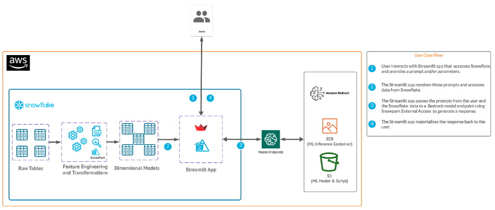

id: getting_started_with_bedrock_streamlit_and_snowflake
summary: Getting Started with Bedrock, Streamlit and Snowflake using Snowpark External Access
categories: featured,getting-started,app-development, bedrock, aws, streamlit, genai, ai, ml
environments: web
status: Published
feedback link: <https://github.com/Snowflake-Labs/sfguides/issues>
tags: Getting Started, Generative AI, Snowflake External Access, Bedrock, Snowpark, Streamlit
authors: Matt Marzillo, Dan Hunt

# Getting Started with Bedrock, Streamlit and Snowflake
<!-- ------------------------ -->
## Overview

Duration: 5

Generative AI is a category of artificial intelligence techniques that enable machines to create new, original content, such as text, images, or music, by learning from existing data. These models, often based on neural networks, generate content by understanding patterns and structures in the training data and then producing novel examples that resemble what they have learned. Generative AI has applications in various fields, including natural language processing, computer vision, and creative arts.

Amazon Bedrock is a fully managed service that offers a choice of high-performing foundation models via a single API, along with a broad set of capabilities to build generative AI applications.Amazon Bedrock is a managed service from Amazon Web Services designed to simplify the deployment, management, and scaling of Kubernetes clusters. It integrates with AWS's ecosystem to provide robust security, networking, and operational features, enabling users to focus more on their applications rather than on managing infrastructure. Bedrock aims to offer a seamless and efficient way to run containerized applications at scale, leveraging AWS's cloud capabilities for improved performance and reliability.	

Snowflake is a cloud-based data warehousing solution that allows businesses to store and analyze large volumes of data efficiently. It separates storage and compute functionalities, enabling users to scale resources independently and pay only for what they use. Snowflake supports a wide range of data workloads, including data warehousing, data lakes, and data engineering, and offers robust data sharing capabilities across different cloud platforms.

In this quickstart we will build a Streamlit application that leverages Snowpark External Access in Snowflake with Amazon Bedrock that will generate a personalized marketing message to customers to cross-sell products.

### Pre-requisites
- Familiarity with [Snowflake](https://quickstarts.snowflake.com/guide/getting_started_with_snowflake/index.html#0) and a Snowflake account
-Access to [Streamlit](https://streamlit.io/) in your Snowflake account.
- [AWS Account](https://aws.amazon.com/premiumsupport/knowledge-center/create-and-activate-aws-account/)
- The AWS account should be a sandbox account with open network policies or you you should [create a VPC](https://docs.aws.amazon.com/vpc/latest/userguide/working-with-vpcs.html) in the same region as the Snowflake account
- In the VPC [create subnets](https://docs.aws.amazon.com/vpc/latest/userguide/VPC_Internet_Gateway.html) in a few AZs with an internet gateway to allow egress traffic to the internet by using a routing table and security group for outbound traffic
Note: please make sure to use a supported Amazon Bedrock region.
Familiarity with the Python programming language.

### What you’ll build
We will build an efficient architecture all within Snowflake that will access purchase history in Snowflake and pass that data to a Bedrock model with context to generate a message that can be used in a marketing campaign. The architecture will look like this

