id: getting_started_with_bedrock_streamlit_and_snowflake
summary: Getting Started with Bedrock, Streamlit and Snowflake using Snowpark External Access
categories: featured,getting-started,app-development, bedrock, aws, streamlit, genai, ai, ml
environments: web
status: Published
feedback link: <https://github.com/Snowflake-Labs/sfguides/issues>
tags: Getting Started, Generative AI, Snowflake External Access, Bedrock, Snowpark, Streamlit
authors: Matt Marzillo, Dan Hunt

# Getting Started with Bedrock, Streamlit and Snowflake
<!-- ------------------------ -->
## Overview

Duration: 5

In this quickstart we will build a Streamlit application that leverages Snowpark External Access in Snowflake with Amazon Bedrock that will generate a personalized marketing message to customers to cross-sell products.

In summary this is what you will do:
- Set up environments in both Snowflake and AWS.
- Create a function that leverages Snowpark External Access to make a call to Amazon Bedrock.
- Create a Streamlit app that leverages the above function to generate responses using data from Snowflake and prompts.

### What is Generative AI?
Generative AI is a category of artificial intelligence techniques that enable machines to create new, original content, such as text, images, or music, by learning from existing data. These models, often based on neural networks, generate content by understanding patterns and structures in the training data and then producing novel examples that resemble what they have learned. Generative AI has applications in various fields, including natural language processing, computer vision, and creative arts.

### What is Amazon Bedrock?
Amazon Bedrock is a fully managed service that offers a choice of high-performing foundation models via a single API, along with a broad set of capabilities to build generative AI applications. Amazon Bedrock is a managed service from Amazon Web Services designed to simplify the deployment, management, and scaling of Kubernetes clusters. It integrates with AWS's ecosystem to provide robust security, networking, and operational features, enabling users to focus more on their applications rather than on managing infrastructure. Bedrock aims to offer a seamless and efficient way to run containerized applications at scale, leveraging AWS's cloud capabilities for improved performance and reliability.	

### What is Snowflake?
Snowflake is a cloud-based data warehousing solution that allows businesses to store and analyze large volumes of data efficiently. It separates storage and compute functionalities, enabling users to scale resources independently and pay only for what they use. Snowflake supports a wide range of data workloads, including data warehousing, data lakes, and data engineering, and offers robust data sharing capabilities across different cloud platforms.

### What is Streamlit?
Streamlit is a Python library that makes it easy to create and share custom web apps for machine learning and data science. In just a few minutes you can build and deploy powerful data apps.

### Pre-requisites
- Familiarity with [Snowflake](https://quickstarts.snowflake.com/guide/getting_started_with_snowflake/index.html#0) and a Snowflake account
with Access to [Streamlit](https://streamlit.io/) in your Snowflake account.
- [AWS Account](https://aws.amazon.com/premiumsupport/knowledge-center/create-and-activate-aws-account/).
- The AWS account should be a sandbox account with open network policies or you you should [create a VPC](https://docs.aws.amazon.com/vpc/latest/userguide/working-with-vpcs.html) in the same region as the Snowflake account.Additionally, users should have access to Bedrock models in their AWS account.
- In the VPC [create subnets](https://docs.aws.amazon.com/vpc/latest/userguide/VPC_Internet_Gateway.html) in a few AZs with an internet gateway to allow egress traffic to the internet by using a routing table and security group for outbound traffic
Note: please make sure to use a supported Amazon Bedrock region.
Familiarity with the Python programming language.
- (Optional) access to Sagemaker Canvas to fine tune a Bedrock model.

### What you’ll build
We will build an efficient architecture all within Snowflake that will access purchase history in Snowflake and pass that data to a Bedrock model with context to generate a message that can be used in a marketing campaign. The architecture will look like this


<!-- ------------------------ -->
## Use Case
Duration: 5

This use case will leverage purchase data that represents the most frequently purchased products for each customer along with a unique identifier. Additionally, we have a field with a perfect message to a customer that we will use at the end for the optional step of fine tuning a model with Sagemaker Canvas and Bedrock.

<!-- ------------------------ -->
## AWS Environment

Duration: 10

This part should be straightforward, head to your Bedrock service in AWS and let’s make sure that you have access to some base models by clicking on “Model Access” and check to make sure that you see “Access Granted”  for the Amazon Titan models as this what we will be using for the quickstart.

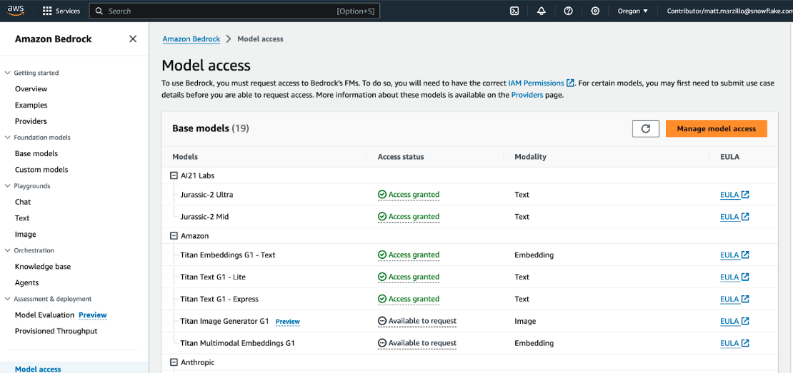

You will also need command line access tokens, so familiarize with the process of generating these credentials from the IAM service and know how to easily copy and paste this for later:
1. Select the ‘IAM’ service
2. Find your user and select ‘Create access key’

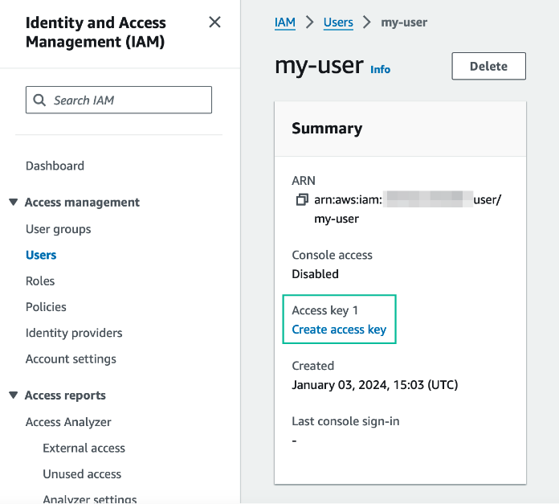

3. Select ‘Third-party service’, check “I understand the above recommendation and want to proceed to create an access key’ and click ‘Next’.
Note: for the purpose of this lab we are using access credentials directly, but for a production setting a more robust approach is recommended.
4. Click ‘Create access key’ and note down the ‘Access key’ and ‘Secret access key’ values securely (do not share these values).
Note: if you are using a managed AWS account, the credentials page may look more like the following, in which case you will also need the AWS session token, and should get this value shortly before using the credentials (since they will time out).

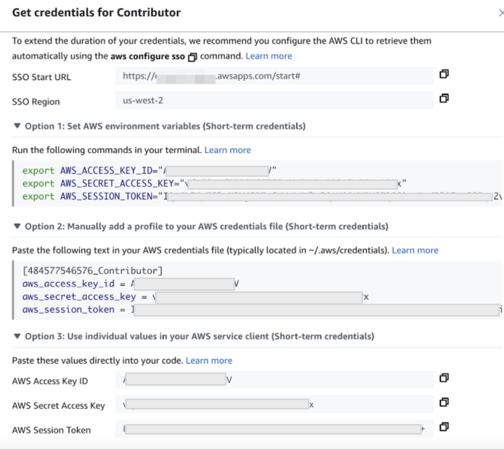

<!-- ------------------------ -->
## Snowflake Environment

Duration: 5

Copy and paste the below code into your Snowflake worksheet, what we’ll be doing here is creating two tables inside of a database that will be used in our application.

```sql
--create database and warehouse
use role accountadmin;
CREATE OR REPLACE WAREHOUSE HOL_WH WITH WAREHOUSE_SIZE='X-SMALL';
CREATE OR REPLACE DATABASE CUSTOMER_WRAPPED;

--create stage
USE DATABASE CUSTOMER_WRAPPED;
CREATE OR REPLACE STAGE CUSTOMER_WRAPPED_STAGE
URL='s3://hol-qs-bucket/'
FILE_FORMAT = (TYPE = 'csv');
list @customer_wrapped_stage;

--create customer_wrapped table
CREATE OR REPLACE TABLE CUSTOMER_WRAPPED
  (CUSTOMERID STRING,
   PRODUCTS_PURCHASED STRING,
   CUSTOMER_TYPE_AND_RECOMMENDATION STRING);

COPY INTO CUSTOMER_WRAPPED FROM @CUSTOMER_WRAPPED_STAGE/customer_wrapped.csv
  FILE_FORMAT=(TYPE = 'csv' FIELD_DELIMITER = ',' SKIP_HEADER = 1);

select top 10 * from CUSTOMER_WRAPPED;

--Create customer_demographics table
CREATE OR REPLACE TABLE CUSTOMER_DEMOGRAPHICS
  (CUSTOMERID STRING,
   NAME STRING,
   AGE STRING,
   CITY STRING,
   COUNTRY STRING,
   GENDER STRING,
   YEARS_AS_CUSTOMER INT,
   PURCHASES_TWENTYTHREE INT,
   DOLLARS_SPENT_TWENTYTHREE INT);

COPY INTO CUSTOMER_DEMOGRAPHICS FROM @CUSTOMER_WRAPPED_STAGE/customer_demographics.csv
  FILE_FORMAT=(TYPE = 'csv' SKIP_HEADER = 1);

select top 10 * from CUSTOMER_DEMOGRAPHICS;

--Create products table
CREATE OR REPLACE TABLE PRODUCTS (
    product_id INT,
    product_name VARCHAR(255)
);

COPY INTO PRODUCTS FROM @CUSTOMER_WRAPPED_STAGE/products.csv
  FILE_FORMAT=(TYPE = 'csv' SKIP_HEADER = 1);

select top 10 * from PRODUCTS;

--Create product_category table
CREATE OR REPLACE TABLE PRODUCT_CATEGORY (
    product_id INT,
    product_category VARCHAR(255)
);

COPY INTO PRODUCT_CATEGORY FROM @CUSTOMER_WRAPPED_STAGE/product_category.csv
  FILE_FORMAT=(TYPE = 'csv' SKIP_HEADER = 1);

select top 10 * from PRODUCT_CATEGORY;

-- Create the customer_purchases table
CREATE OR REPLACE TABLE customer_purchases (
    customer_id INT,
    product_id INT
);

COPY INTO CUSTOMER_PURCHASES FROM @CUSTOMER_WRAPPED_STAGE/customer_purchases.csv
  FILE_FORMAT=(TYPE = 'csv' SKIP_HEADER = 1);

select top 10 * from CUSTOMER_PURCHASES;
```

<!-- ------------------------ -->
## Snowpark External Access to call Bedrock

Duration: 15

Now we will work through the below code which will access the purchase data from Snowflake and generate a message from Bedrock. You will have to update the 2-3 values from the AWS command line tokens that we generated earlier (access key, secret key, and possibly session token). Additionally, you may have to update the AWS region depending on where your account is running - please make sure to use a supported Amazon Bedrock region!

The final code runs a sample record through the function we just created to produce a message. Additionally, you can uncomment the final line of code to run the whole table through the function. 

```sql
use role ACCOUNTADMIN;
use database CUSTOMER_WRAPPED;

--create object with aws keys
CREATE OR REPLACE SECRET aws_keys
    TYPE = password
    USERNAME = '<AWS Access Key ID>'
    PASSWORD = '<AWS Secret Access Key>';

-- optional, if using a session_key - if so, remember that this credential will expire
CREATE OR REPLACE SECRET session_key
    TYPE = password
    USERNAME = 'session'
    PASSWORD = ''; -- if not using a session key, leave this blank and it won't be used later

--create network rule - select your AWS region here
create or replace network rule aws_network_rule
mode = EGRESS
type = HOST_PORT
value_list = ('bedrock-runtime.<AWS Region - e.g. us-west-2>.amazonaws.com');


--create external access integration
create or replace EXTERNAL ACCESS INTEGRATION aws_integration
allowed_network_rules = (aws_network_rule)
ALLOWED_AUTHENTICATION_SECRETS = (aws_keys, session_key)
enabled=true;

create or replace function ask_bedrock(llm_instructions string, user_context_prompt string, model string)
returns string
language python
runtime_version=3.8
handler = 'ask_bedrock'
external_access_integrations=(aws_integration)
SECRETS = ('aws_keys' = aws_keys, 'session_key' = session_key)
PACKAGES = ('boto3')
as
$$
import json
import boto3
import _snowflake

# Function to get AWS credentials
def get_aws_credentials():
    aws_key_object = _snowflake.get_username_password('aws_keys')
    session_key_object = _snowflake.get_username_password('session_key')
    region = 'us-west-2'

    boto3_session_args = {
        'aws_access_key_id': aws_key_object.username,
        'aws_secret_access_key': aws_key_object.password,
        'region_name': region
    }

    if session_key_object.password != '':
        boto3_session_args['aws_session_token'] = session_key_object.password

    return boto3_session_args, region

# Function to prepare the request body based on the model
def prepare_request_body(model_id, instructions, user_context):
    default_max_tokens = 512
    default_temperature = 0.7
    default_top_p = 1.0

    if model_id == 'amazon.titan-text-express-v1':
        body = {
            "inputText": f"<SYSTEM>Follow these:{instructions}<END_SYSTEM>\n<USER_CONTEXT>Use this user context in your response:{user_context}<END_USER_CONTEXT>",
            "textGenerationConfig": {
                "maxTokenCount": default_max_tokens,
                "stopSequences": [],
                "temperature": default_temperature,
                "topP": default_top_p
            }
        }
    elif model_id == 'ai21.j2-ultra-v1':
        body = {
            "prompt": f"<SYSTEM>Follow these:{instructions}<END_SYSTEM>\n<USER_CONTEXT>Use this user context in your response:{user_context}<END_USER_CONTEXT>",
            "temperature": default_temperature,
            "topP": default_top_p,
            "maxTokens": default_max_tokens
        }
    elif model_id == 'anthropic.claude-3-sonnet-20240229-v1:0':
        body = {
            "max_tokens": default_max_tokens,
            "messages": [{"role": "user", "content": f"<SYSTEM>Follow these:{instructions}<END_SYSTEM>\n<USER_CONTEXT>Use this user context in your response:{user_context}<END_USER_CONTEXT>"}],
            "anthropic_version": "bedrock-2023-05-31"
                }
    else:
        raise ValueError("Unsupported model ID")

    return json.dumps(body)

# parse API response format from different model families in Bedrock
def get_completion_from_response(response_body, model_id):
    if model_id == 'amazon.titan-text-express-v1':
        output_text = response_body.get('results')[0].get('outputText')
    elif model_id == 'ai21.j2-ultra-v1':
        output_text = response_body.get('completions')[0].get('data').get('text')
    elif model_id == 'anthropic.claude-3-sonnet-20240229-v1:0':
        output_text = response_body.get('content')[0].get('text')
    else:
        raise ValueError("Unsupported model ID")
    return output_text

# Main function to call bedrock
def ask_bedrock(instructions, user_context, model):
    boto3_session_args, region = get_aws_credentials()

    # Create a session using the provided credentials
    session = boto3.Session(**boto3_session_args)

    # Create a bedrock client from session
    client = session.client('bedrock-runtime', region_name=region)

    # Prepare the request body based on the model
    body = prepare_request_body(model, instructions, user_context)

    response = client.invoke_model(modelId=model, body=body)
    response_body = json.loads(response.get('body').read())

    output_text = get_completion_from_response(response_body, model)
    return output_text
$$;


SET DEFAULT_LLM_INSTRUCTIONS = 'Review the customer\'s most frequent retail purchases from last year. Write a personalized email explaining their shopper profile based on these habits. Add a tailored message suggesting products and brands for them to consider, from their purchase history.';
SET DEFAULT_MODEL = 'anthropic.claude-3-sonnet-20240229-v1:0';

select ask_bedrock($DEFAULT_LLM_INSTRUCTIONS, 'Home Decor, Furniture, Lighting', $DEFAULT_MODEL);
--select ask_bedrock($DEFAULT_LLM_INSTRUCTIONS, PRODUCTS_PURCHASED, $DEFAULT_MODEL) from CUSTOMER_WRAPPED.public.customer_wrapped;
```

This block of code builds a User Defined Fucntion (UDF) called ask_bedrock() that accepts three parameters: instructions to the model, context for the model and model type.

Now, let's use that UDF in a Streamlit app!

<!-- ------------------------ -->
## Build Streamlit App

Duration: 10

Now that we have our Bedrock function, let’s build an interactive app where we can experiment and refine our prompts.

Go back to the main account view by clicking ‘<- Worksheets’ and then select ‘Streamlit’.

Make sure that you’re still using the ‘ACCOUNTADMIN’ role and then create a new Streamlit app, which should open the app editor directly. You can access this app from the Streamlit view, but make sure to use the same role.

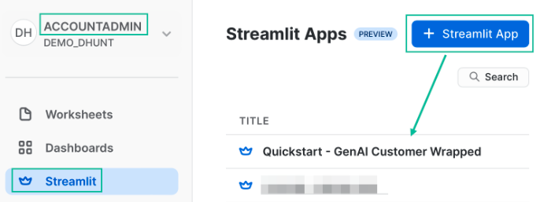

Once your app is open, it will be pre-loaded with some sample code. We don’t need that today, so replace the code with the script below:

```python
# Import python packages
import streamlit as st
from snowflake.snowpark.context import get_active_session

# Get the current credentials
session = get_active_session()

# my_table = session.table()

# Write directly to the app - purely cosmetic headers
st.title("Very Basic Bedrock Agent")
st.caption("The quickest of examples. :snowflake:")

default_prompt = 'Review the customers most frequent retail purchases from last year. Write a personalized email explaining their shopper profile based on these habits. Add a tailored message suggesting products and brands for them to consider, from their purchase history.'

with st.expander("Adjust system prompt"):
    system = st.text_area("System instructions", value=default_prompt).replace("'","")

st.markdown('------') 
bedrock_model = st.selectbox(
     'Select Bedrock model',
     ('amazon.titan-text-express-v1', 'ai21.j2-ultra-v1', 'anthropic.claude-3-sonnet-20240229-v1:0'))

# A field to enter an example prompt
user_context = st.text_area('Product categories and other user context'
                    , height=100
                    , value='Product categories: Home Decor, Furniture, Lighting\nCustomer name: Obinze Agarwal\nStore name: Nilezone Bedshop').replace("'","")

#Use the job description to write the job to a table and run the function against it:
if(st.button('Ask Bedrock')):
    result = session.sql(f"""SELECT ask_bedrock('{system}','{user_context}', '{bedrock_model}')""").collect()
    st.header('Answer')
    st.write(result[0][0].replace('"','')) 
```
<!-- ------------------------ -->
## Test Prompt Engineering (OPTIONAL)

Duration: 

Prompt engineering for a language model involves crafting your questions or prompts in a way that maximizes the effectiveness and accuracy of the responses you receive. Here are some simple guidelines to help you with prompt engineering:

**Be Clear and Specific:** The more specific your prompt, the better. Clearly define what you're asking for. If you need information on a specific topic, mention it explicitly.

**Provide Context:** If your question builds on particular knowledge or a specific scenario, provide that context. This helps the model understand the frame of reference and respond more accurately.

**Use Direct Questions:** Phrase your prompts as direct questions if you're looking for specific answers. This approach tends to yield more focused responses.

**Break Down Complex Queries:** If you have a complex question, break it down into smaller, more manageable parts. This can help in getting more detailed and precise answers.

**Specify the Desired Format:** If you need the information in a particular format (like a list, a summary, a detailed explanation), mention this in your prompt.

**Avoid Ambiguity:** Try to avoid ambiguous language. The clearer you are, the less room there is for misinterpretation.

**Sequential Prompts for Follow-ups:** If you're not satisfied with an answer or need more information, use follow-up prompts that build on the previous ones. This helps in maintaining the context and getting more refined answers.

**Experiment and Iterate:** Don’t hesitate to rephrase or adjust your prompts based on the responses you get. Sometimes a slight change in wording can make a big difference.

**Consider the Model's Limitations:** Remember that the model may not have the latest information, and it cannot browse the internet or access personal data unless explicitly provided in the prompt.

**Ethical Use:** Always use the model ethically. Avoid prompts that are harmful, biased, or violate privacy or legal guidelines.

Let’s look at how we can experiment and iterate on the prompt that we provided to the LLM function in Streamlit. Go back to the previous step and test out different prompt strategies to see if you can improve the accuracy of the response.

Consider the above concepts and also consider this pointed [guide to prompting](https://github.com/VILA-Lab/ATLAS/blob/main/data/README.md)

(it is required that you try the prompt in principal #6 🙂)

<!-- ------------------------ -->
## Build Streamlit App - With data in Snowflake (OPTIONAL)

Duration:

Let's build a new app similar to the one above, but with some of the data that we loaded to Snowflake. The app will additionally include a filter for a specific customer to provide context. There are several lines of code indicated below where the user has to write Snowpark and Python code to complete the app

```python
# Import python packages
import streamlit as st
import pandas as pd
from snowflake.snowpark.context import get_active_session
from snowflake.snowpark.functions import array_agg

# Get the current credentials
session = get_active_session()

# access underlying snowflake tables
purchases_df = session.table("customer_purchases")
products_df = session.table("products")
categories_df = session.table("product_category")

# join all tables together
# join the purchases_df, products_df and the categories_df into one dataframe
purchases_products_categories_df = # ADD YOUR CODE HERE

# aggregate products by customer
# with the purchases_products_categories_df dataframe aggregate the products by customer to create a new dataframe
# hint you will likely use the array_agg() function from snowpark
purchases_products_df = # ADD YOUR CODE HERE

# aggregate product categories by customer
# with the purchases_products_categories_df dataframe aggregate the product categories by customer to create a new dataframe
# hint you will likely use the array_agg() function from snowpark
purchases_categories_df = # ADD YOUR CODE HERE

# Add some cosmetic headers
st.title("Bedrock Shopper")
st.caption("You could add some more context here if you wanted to share this with business users. :snowflake:")

default_prompt = 'Review the customers most frequent retail purchases from last year. Write a personalized email explaining their shopper profile based on these habits. Add a tailored message suggesting products and brands for them to consider, from their purchase history.'

st.markdown('------') 
with st.expander("Adjust system prompt"):
    system = st.text_area("System instructions", value=default_prompt).replace("'","")

st.markdown('------') 
bedrock_model = st.selectbox(
     'Select Bedrock model',
     ('amazon.titan-text-express-v1', 'ai21.j2-ultra-v1', 'anthropic.claude-3-sonnet-20240229-v1:0'))

# widget for customer filter
option = st.selectbox(
    'Select a Customer ID',
     purchases_products_df['CUSTOMER_ID'])

# filter down to relevant products and categories
# products
filtered_products_df = purchases_products_df.loc[purchases_products_df['CUSTOMER_ID'] == option]['PRODUCT_ARRAY'].iloc[0]
# categories
filtered_categories_df = # ADD YOUR CODE HERE

# display products and categories
st.subheader("Products Purchased")
filtered_products_df
st.subheader("Categories Purchased")
filtered_categories_df

user_context = f"Products purchased: {filtered_products_df}, Product Categories: {filtered_categories_df}"

# Use the job description to write the job to a table and run the function against it:
# Use the job description to write the job to a table and run the function against it:
# Use the job description to write the job to a table and run the function against it:
if(st.button('Ask Bedrock')):
    result = session.sql(f"""SELECT ask_bedrock('{system}','{user_context}','{bedrock_model}')""").collect()
    st.header('Answer')
    st.write(result[0][0].replace('"','')) 
```

<!-- ------------------------ -->
## Fine Tune Model using Canvas (OPTIONAL)

Duration:

In this optional step we will walk through the process of using Sagemaker Canvas with Snowflake data to fine tune and deploy a Bedrock model.

First, open the Data Wrangler blade in your Canvas studio blade then click “Create” then “Tabular” and name the dataset “customer-wrapped”.

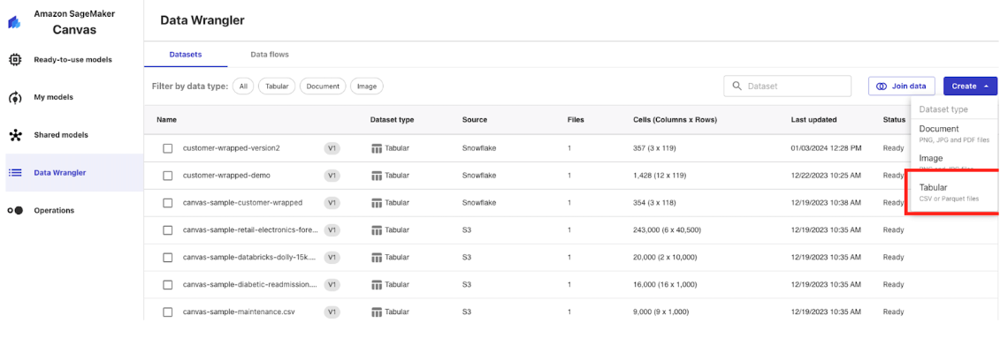

Next, click on “Data Source” then find the “Snowflake” option and click “Add Connection”.

Name the connection “snowflake-demo” then populate the configuration similar to below with your Snowflake AccountID, Username and Password.

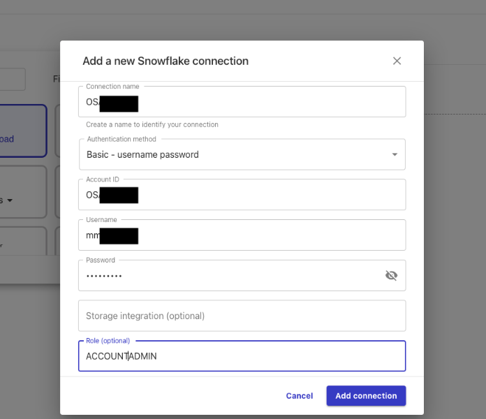
Note: here we are using username and password for authentication but you can also use ARN and OAuth.

Click “Add Connection”

Navigate to the “CUSTOMER_WRAPPED” database on the left and find the CUSTOMER_WRAPPED table in the Public schema and drag it into the working pane and use the HOL_WH in the top right hand corner then click “Create Dataset” in the bottom right.

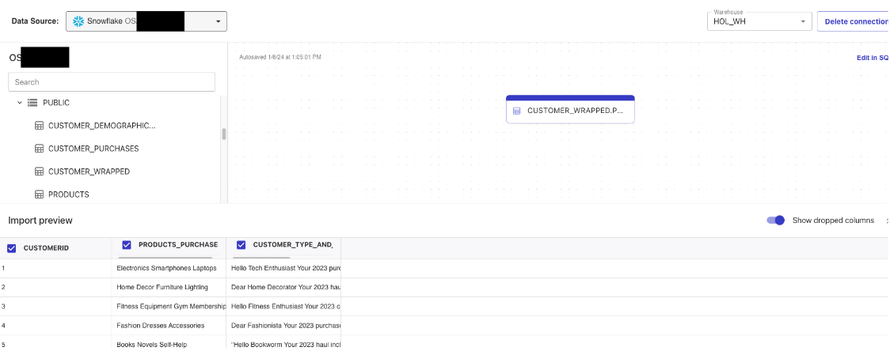
Note: here we are simply creating a Canvas dataset from a single Snowflake table, but in practice there is a lot more you can do with Canvas and Snowflake data like perform joins, aggregations, filters, etc.

Next, click into the dataset you just created and click “Create Model” in the top right corner, name the model “customer-wrapped” then select the “Fine Tune Foundational Model” option all the way to the right.

Now we’ll set up a training job, you can select up to 3 models to train,then select “PRODUCTS_PURCHASED” as input columns and “CUSTOMER_TYPE_AND_RECOMMENDATION” as the output column. You also have the option to change the parameters on the configuration of the model. Here we are just using the default configurations, more details on the configurations here: https://docs.aws.amazon.com/sagemaker/latest/dg/canvas-fm-chat-fine-tune.html

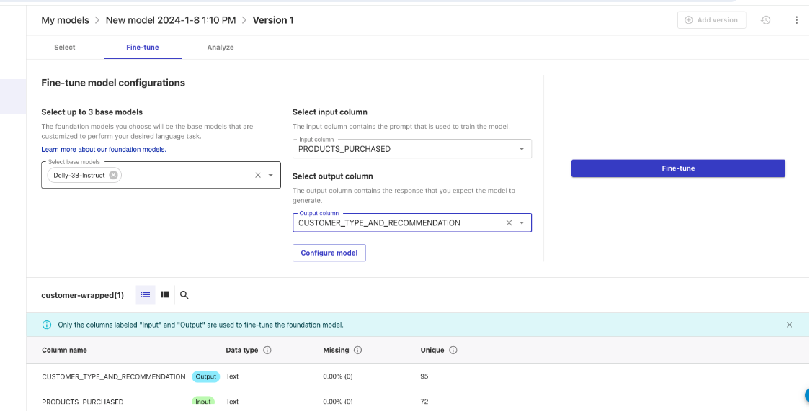
Note: this training job will take several hours to complete. So allow yourself time to come back once the model is trained.

Once the training model is complete, you can click into the model to analyze the model performance and even click “Test in Ready-to-use-models” to test the model in a chat environment.
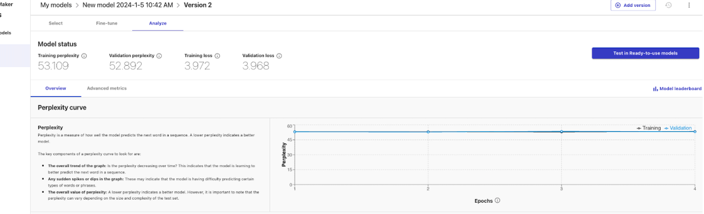

In order to use the model in a production environment you will have to navigate to the Bedrock service, click on “Custom Models”, find your model and purchase Provisioned Throughput. 
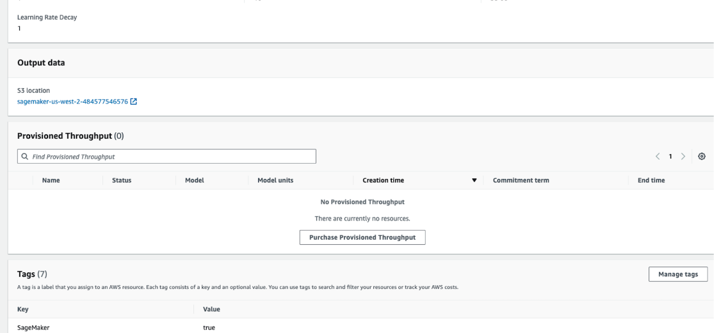

The cost of the provisioned throughput will vary depending on the model units and the commitment term.

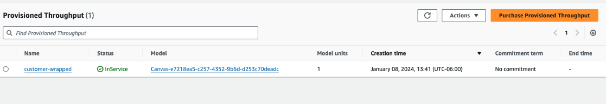

Once the model the provisioned throughput is active you can utilize the model name in an api call similar to how it was completed in this quickstart.

<!-- ------------------------ -->
## Conclusion

Duration: 5

### What we covered
After setting up our AWS and Snowflake and envrionments we built two primary things: a UDF that utilizes Snowpark External Access to make a call to different Bedrock models and a Streamlit app that leverages that function to make a simple and useful app that can be shared within an organization. With these two, easy to build, Snowflake features we expect customers to see value quickly when using Snowflake and Bedrock!

### What You Learned

- How to set up a Snowflake and AWS environment to integrate the two platforms.
- How to build a Snowpark External Access integration to call Amazon Bedrock.
- How to build a Streamlit app that calls Amazon Bedrock


### Related resources 
- [RBAC with External Services](https://www.youtube.com/watch?v=fALb8SosA_U)

- [Prompting](https://github.com/VILA-Lab/ATLAS/blob/main/data/README.md)

- [Streamlit](https://streamlit.io/)

- [Bedrock Performance](https://docs.aws.amazon.com/bedrock/latest/userguide/general-guidelines-for-bedrock-users.html)

- [Provisioned Throughput](https://docs.aws.amazon.com/bedrock/latest/userguide/prov-throughput.html)

If you have any questions, reach out to your Snowflake account team!
